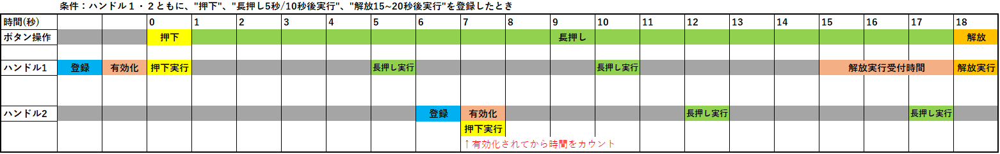
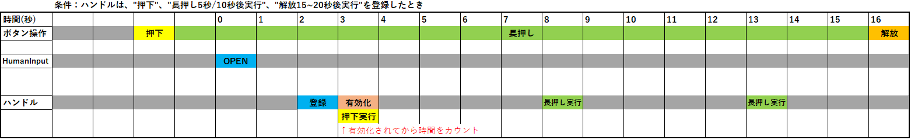

= ButtonManager 機能仕様書
:sectnums:
:sectnumlevels: 3
:chapter-label:
:revnumber: 0.0.4
:toc:
:toc-title: 目次
:toclevels: 3
:lang: ja
:xrefstyle: short
:figure-caption: Figure
:table-caption: Table
:section-refsig:
:experimental:

== 目的と適用範囲

本書はAITRIOSのデバイスの入力装置を使ったユーザー操作を検出し、通知する機能を有するButtonManagerを定義します。
XXのバージョンXXに適用されます。

<<<

== 用語
=== 通知用コールバック
上位AppがButtonManagerに登録するコールバックの総称。上位Appが要求するボタン操作が行われたことをコールバック実行によって通知する。

=== 検出用コールバック
PLが検出したボタン操作やUtilityのタイマーの時間経過をButtonManagerに通知するために、ButtonManagerがPL及びUtilityに登録するコールバックの総称。

<<<

== コンポーネントの説明
=== コンポーネントの概要
ButtonManagerは、ユーザーのボタン操作に応じて実施させたい処理を、コールバック関数呼び出しの形で提供するコンポーネントである。

.概要図
全体図挿入予定

<<<

=== コンポーネントの詳細説明

ButtonManagerは上位AppからOpenされ、PLとUtilityに検出用コールバックを登録する。
上位AppはOpenされたButtonManagerに通知用コールバックと、それが呼ばれる条件（ボタンの種類、操作内容、長押し時間等）を登録することができる。
ユーザーのボタン操作によって検出用コールバックがPL及びUtilityから実行されると、上位Appから登録された通知用コールバックの呼び出し条件と一致する通知用コールバックを実行する。

.構成図
[source,mermaid]
....
graph BT
    subgraph App
    	app[通知用コールバック]
    end

    subgraph Button_Manager
        direction TB
        pl1[ボタン検出用コールバック]

    end
    style Button_Manager fill:#f9f

    subgraph PL
        direction TB
        button[Button]
    end

    subgraph Utility
        direction TB
        timer[Timer]
    end

App ---> |Open/Close 通知用コールバック登録/解除 通知用コールバック実行有効化/無効化| Button_Manager
Button_Manager -.-> |通知用コールバック実行| App
Button_Manager ---> |検出用コールバック登録| PL
PL -.-> |検出用コールバック実行| Button_Manager

Button_Manager --> |検出用コールバック登録/タイマースタート/ストップ| Utility
....

==== 依存ブロック
.依存ブロック
[width="100%",options="header"]
|===
|ブロック名 |利用用途 |コメント
|Utility
|下記APIを使用  +
・時間経過検出用コールバック登録/解除API +
・タイマーのスタート/ストップAPI

|時間経過検出用コールバックは、タイマースタートのAPIによって開始したタイマーの設定時間経過時に実行される。

|PL
|下記APIを使用  +
・ボタン情報取得API +
・ボタン検出用コールバック登録/解除API

|ボタン検出用コールバックは、PLがボタンのGPIOの変化を検出すると実行される。 +

|OSAL
|下記のAPIを使用 +
・メッセージキュー送信/受信API

|ボタン検出用コールバックから、ButtonManagerのスレッドにボタン検出のイベントを処理をさせるためにメッセージキューを使用する。

|===

<<<

=== 状態遷移
ButtonManagerの取り得る状態を<<#_TableStates>>に示します。

[#_TableStates]
.状態一覧
[width="100%", cols="20%,80%",options="header"]
|===
|状態 |説明

|CLOSE
|ButtonManager停止状態。

|OPEN
|ButtonManager起動状態。

|===

また、OPEN状態はDISABLEとENABLEのいづれかのサブステータスを持ちます。各状態の説明を<<#_TableSubState>>に示します。

[#_TableSubState]
.OPENサブステータス一覧
[width="100%", cols="20%,80%",options="header"]
|===
|状態 |説明

|DISABLE
|ボタン通知用コールバック実行無効状態。CLOSEからの状態遷移直後はこの状態になる。この状態の時にボタン通知用コールバックの登録/解除を行うことが可能。ボタン通知用コールバック実行有効化APIが呼ばれた場合はENABLE状態に遷移する。

|ENABLE
|ボタン通知用コールバック実行有効状態。ボタン通知用コールバック実行無効化APIが呼ばれた場合はDISABLE状態に遷移する。

|===

ButtonManagerでは各APIを呼び出すことで<<#_状態遷移図>>に示す状態遷移を行います。 +
また、各APIでエラーが発生した場合には状態遷移は起こりません。 +

[#_状態遷移図]
.状態遷移図
[source,mermaid]
....
stateDiagram-v2
    direction TB
    [*] --> CLOSE
    CLOSE --> OPEN : EsfButtonManagerOpen
    OPEN --> CLOSE : EsfButtonManagerClose
    OPEN --> OPEN : EsfButtonManagerOpen
    state OPEN{
      [*] --> DISABLE
      ENABLE --> DISABLE : EsfButtonManagerDisableNotificationCallback
      DISABLE --> DISABLE : EsfButtonManagerRegisterPressedCallback EsfButtonManagerRegisterReleasedCallback EsfButtonManagerRegisterLongPressedCallback EsfButtonManagerUnregisterPressedCallback EsfButtonManagerUnregisterReleasedCallback EsfButtonManagerUnregisterLongPressedCallback
      DISABLE --> ENABLE : EsfButtonManagerEnableNotificationCallback
    }
....

各状態でのAPI受け付け可否と状態遷移先を<<#_TableStateTransition>>に示します。OPEN状態のサブステータス遷移表は<<#_TableSubStateTransition>>に示します。表中の状態名は、API実行完了後の遷移先状態を示し、すなわちAPI呼び出し可能であることを示します。×はAPI受け付け不可を示し、ここでのAPI呼び出しはエラーを返し状態遷移は起きません。

[#_TableStateTransition]
.状態遷移表
[width="100%", cols="10%,30%,20%,20%"]
|===
2.2+| 2+|状態
|CLOSE |OPEN
.10+|API名

|``**EsfButtonManagerOpen**``
|OPEN
|OPEN

|``**EsfButtonManagerClose**``
|×
|OPEN/CLOSE ※１

|その他API
|×
|OPEN

|===
※１：ハンドルが1つ以上残る場合はOPEN状態、0になる場合はCLOSE状態に遷移する。

[#_TableSubStateTransition]
.OPENサブステータス遷移表
[width="100%", cols="10%,30%,20%,20%"]
|===
2.2+| 2+|状態
|DISABLE |ENABLE
.10+|API名

|``**EsfButtonManagerEnableNotificationCallback**``
|ENABLE
|×

|``**EsfButtonManagerDisableNotificationCallback**``
|×
|DISABLE

|``**EsfButtonManagerRegisterPressedCallback**``
|DISABLE
|×

|``**EsfButtonManagerRegisterReleasedCallback**``
|DISABLE
|×

|``**EsfButtonManagerRegisterLongPressedCallback**``
|DISABLE
|×

|``**EsfButtonManagerUnregisterPressedCallback**``
|DISABLE
|×

|``**EsfButtonManagerUnregisterReleasedCallback**``
|DISABLE
|×

|``**EsfButtonManagerUnregisterLongPressedCallback**``
|DISABLE
|×

|===

<<<

=== コンポーネントの機能一覧
<<#_TableFunction>>に機能の一覧を示します。

[#_TableFunction]
.機能一覧
[width="100%", cols="30%,55%,15%",options="header"]
|===
|機能名 |概要  |節番号
|ボタン操作通知機能
|PL,Utilityで検出したボタン操作をコールバックによって上位Appに通知する機能。
|<<#_ボタン操作通知機能>>

|通知用コールバックの登録機能
|指定したボタンが操作された際に実行するコールバックを登録する機能。
|<<#_通知用コールバックの登録機能>>

|通知用コールバックの解除機能
|指定したボタンが操作された際に実行するコールバックの登録を解除する機能。
|<<#_通知用コールバックの解除機能>>

|通知用コールバックの実行有効化/無効化機能
|登録したコールバックの実行を有効化/無効化する機能。
|<<#_通知用コールバックの実行有効化/無効化機能>>
|===

<<<

=== コンポーネントの機能説明
[#_ボタン操作通知機能]
==== ボタン操作通知機能
* 機能概要
    ** PL,Utilityで検出したボタン操作をコールバックによって上位Appに通知する機能。
* 前提条件
    ** ButtonManagerがOPEN状態、サブステータスがENABLE状態であること。
* 機能詳細
    ** PL,Utilityで検出したボタン操作（押下・解放・長押し）をコールバックによって上位Appに通知する機能。
    ** 通知用コールバックはAPIによって登録/解除が可能で、コールバックの実行が有効化されている期間に行われたボタン操作が通知対象となる。通知用コールバックが登録されており、ボタン長押し中にコールバックの実行が有効化された場合は、コールバックの実行が有効化されたタイミングから長押しが開始されたとみなす。（<<#_ボタン操作通知範囲のタイミング図>>を参照）
+
[#_ボタン操作通知範囲のタイミング図]
.ボタン操作通知範囲のタイミング図

+
また、ボタン長押し中にButtonManagerがOpenされた場合のボタン操作通知タイミング図を<<#_ボタン長押し中にButtonManagerがOpenされた場合のボタン操作通知範囲のタイミング図>>に示す。
+
[#_ボタン長押し中にButtonManagerがOpenされた場合のボタン操作通知範囲のタイミング図]
.ボタン長押し中にButtonManagerがOpenされた場合のボタン操作通知範囲のタイミング図

[#_通知用コールバックの登録機能]
==== 通知用コールバックの登録機能
* 機能概要
    ** 指定したボタンが操作された際に実行するコールバックを登録する機能。
* 前提条件
    ** ButtonManagerがOPEN状態、サブステータスがDISABLE状態であること。
    ** 通知用コールバックの実行が無効化されていること。
* 機能詳細
    ** APIで指定したボタンが操作（押下・解放・長押し）された際に実行するコールバックを登録する。
      *** ボタン押下通知用コールバック：指定したボタンが押下された際に実行される
      *** ボタン長押し通知用コールバック：指定したボタンが指定した時間長押しされた際に実行される
      *** ボタン解放通知用コールバック：指定したボタンが指定した時間長押しされた後に解放された際に実行される
    ** 通知用コールバックの登録数が最大値を超えてしまう場合や、異常な入力パラメータを指定した場合はエラーとなる。

[#_通知用コールバックの解除機能]
==== 通知用コールバックの解除機能
* 機能概要
    ** 指定したボタンが操作された際に実行するコールバックの登録を解除する機能。
* 前提条件
    ** ButtonManagerがOPEN状態、サブステータスがDISABLE状態であること。
    ** 通知用コールバックの実行が無効化されていること。
* 機能詳細
    ** APIで指定したボタンが操作（押下・解放・長押し）された際に実行するコールバックの登録を解除する。
    ** 通知用コールバックが登録されていない場合や、異常な入力パラメータを指定した場合はエラーとなる。

[#_通知用コールバックの実行有効化/無効化機能]
==== 通知用コールバックの実行有効化/無効化機能
* 機能概要
    ** 登録したコールバックの実行を有効化/無効化させる機能
* 前提条件
    ** ButtonManagerがOPEN状態であること。
    ** 有効化するときはサブステータスがDISABLE状態であること。
    ** 無効化するときはサブステータスがENABLE状態であること。
* 機能詳細
    ** APIで指定したハンドルに対して、登録した通知用コールバック実行の有効化/無効化の設定を行う。
    ** ハンドルが不正の場合はエラーとなる。

<<<

=== コンポーネントの非機能要件一覧

<<#_TableNonFunction>>に非機能要件の一覧を示します。

[#_TableNonFunction]
.非機能要件一覧
[width="100%", cols="30%,55%,15%",options="header"]
|===
|機能名 |概要  |節番号
|Stack最大使用量
|1KB
|<<#_Stack最大使用量>>
|スレッド使用数
|1つ
|<<#_スレッド使用数>>
|最大処理時間
|1ms
|<<#_最大処理時間>>
|===

<<<

=== コンポーネントの非機能要件説明
[#_Stack最大使用量]
==== Stack最大使用量
Stackは1KBまで使用する。

[#_スレッド使用数]
==== スレッド使用数
ボタン検出のイベントを処理するためにスレッドを一つ生成する。

[#_最大処理時間]
==== 最大処理時間
ボタン検出のイベントを受信してから通知用コールバックの実行を開始するまでの最大処理時間は1msとする。

<<<

== API仕様
=== 定義一覧
==== Config一覧
<<#_TableConfigType>>にConfigの一覧を示します。

[#_TableConfigType]
.Config一覧
[width="100%", options="header"]
|===
|Config名 |デフォルト値 | 概要
|CONFIG_ESF_BUTTON_MANAGER_HANDLE_MAX_NUM
|3
|ButtonManagerが同時にOPEN可能な制御用ハンドルの最大値。1～5の範囲で設定可能。

|CONFIG_ESF_BUTTON_MANAGER_NOTIFICATION_CALLBACK_MAX_NUM
|3
|ButtonManagerのハンドル一つが、各ボタン毎に登録可能な通知用コールバックの最大数。1～5の範囲で設定可能。
|===

==== データ型一覧
<<#_TableDataType>>にデータ型の一覧を示します。

[#_TableDataType]
.データ型一覧
[width="100%", cols="30%,55%,15%",options="header"]
|===
|データ型名 |概要  |節番号
|EsfButtonManagerStatus
|APIの実行結果を定義する列挙型
|<<#_EsfButtonManagerStatus>>
|EsfButtonManagerHandle
|ButtonManager制御用ハンドルの定義
|<<#_EsfButtonManagerHandle>>
|EsfButtonManagerCallback
|ButtonManagerに登録するコールバック関数の定義
|<<#_EsfButtonManagerCallback>>
|===

==== API一覧
<<#_TableAPI>>にAPIの一覧を示します。

[#_TableAPI]
.API一覧
[width="100%", cols="30%,55%,15%",options="header"]
|===
|API名 |概要  |節番号
|EsfButtonManagerOpen
|Button Managerブロックの起動処理を行い、制御用のハンドルを取得する。
|<<#_EsfButtonManagerOpen>>
|EsfButtonManagerClose
|Button Managerブロックの停止処理を行い、ハンドルを閉じる。
|<<#_EsfButtonManagerClose>>
|EsfButtonManagerRegisterPressedCallback
|ボタン押下通知用コールバックを登録する。
|<<#_EsfButtonManagerRegisterPressedCallback>>
|EsfButtonManagerRegisterReleasedCallback
|ボタン開放通知用コールバックを登録する。
|<<#_EsfButtonManagerRegisterReleasedCallback>>
|EsfButtonManagerRegisterLongPressedCallback
|ボタン長押し通知用コールバックを登録する。
|<<#_EsfButtonManagerRegisterLongPressedCallback>>
|EsfButtonManagerUnregisterPressedCallback
|ボタン押下通知用コールバックを解除する。
|<<#_EsfButtonManagerUnregisterPressedCallback>>
|EsfButtonManagerUnregisterReleasedCallback
|ボタン開放通知用コールバックを解除する。
|<<#_EsfButtonManagerUnregisterReleasedCallback>>
|EsfButtonManagerUnregisterLongPressedCallback
|ボタン長押し通知用コールバックを解除する。
|<<#_EsfButtonManagerUnregisterLongPressedCallback>>
|EsfButtonManagerEnableNotificationCallback
|ボタン通知用コールバックの実行を有効にする。
|<<#_EsfButtonManagerEnableNotificationCallback>>
|EsfButtonManagerDisableNotificationCallback
|ボタン通知用コールバックの実行を無効にする。
|<<#_EsfButtonManagerDisableNotificationCallback>>
|===

<<<

=== データ型定義
[#_EsfButtonManagerStatus]
==== EsfButtonManagerStatus
APIの実行結果を定義する列挙型です。

* *書式*

[source, C]
....
typedef enum {
  kEsfButtonManagerStatusOk,
  kEsfButtonManagerStatusHandleError,
  kEsfButtonManagerStatusParamError,
  kEsfButtonManagerStatusInternalError,
  kEsfButtonManagerStatusResourceError,
  kEsfButtonManagerStatusStateTransitionError
} EsfButtonManagerStatus;
....

* *値*

[#_TableReturnValue]
.EsfButtonManagerStatusの値の説明
[width="100%", cols="30%,70%",options="header"]
|===
|メンバ名  |説明
|kEsfButtonManagerStatusOk
|正常終了

|kEsfButtonManagerStatusHandleError
|不正なハンドル

|kEsfButtonManagerStatusParamError
|入力パラーメータが不正

|kEsfButtonManagerStatusInternalError
|その他の内部エラー

|kEsfButtonManagerStatusResourceError
|リソースエラー

|kEsfButtonManagerStatusStateTransitionError
|状態遷移エラー

|===

[#_EsfButtonManagerHandle]
==== EsfButtonManagerHandle
ButtonManager制御用ハンドルの定義。

* *書式*

[source, C]
....
typedef void* EsfButtonManagerHandle;
....

[#_EsfButtonManagerCallback]
==== EsfButtonManagerCallback
ButtonManagerに登録する通知用コールバック関数へのポインタ。

* *書式*

[source, C]
....
typedef void (*EsfButtonManagerCallback)(void *user_data);
....

* *引数*
**``[IN] void *user_data``**::
コールバック登録時に渡されたユーザー定義のデータ。

<<<

=== API定義

[#_EsfButtonManagerOpen]
==== EsfButtonManagerOpen
* *機能*
+
ButtonManagerの起動処理を行い、制御用のハンドルを取得する。

* *書式* +
+
``**EsfButtonManagerStatus EsfButtonManagerOpen(EsfButtonManagerHandle *handle)**``

* *引数の説明* +
+
**``[OUT] EsfButtonManagerHandle *handle``**::
ButtonManager制御用ハンドル。

* *戻り値* +
+
実行結果に応じて<<#_EsfButtonManagerOpenの戻り値の説明>>のいずれかの値が返ります。
+
[#_EsfButtonManagerOpenの戻り値の説明]
.EsfButtonManagerOpenの戻り値の説明
[width="100%", cols="30%,70%",options="header"]
|===
|戻り値  |説明
|kEsfButtonManagerStatusOk
|正常終了

|kEsfButtonManagerStatusParamError
|引数のhandleがNULLの場合

|kEsfButtonManagerStatusInternalError
|スレッドの生成やPL,Utilityへの検出用コールバックの登録などに失敗し、ButtonManagerを起動できない場合

|kEsfButtonManagerStatusResourceError
|取得可能なハンドル数の上限に達し、これ以上ハンドルを取得できない場合
|===

* *説明* +
ButtonManagerの起動処理を行い、PL,Utilityにボタン検出用コールバックを登録する。 +
OPEN状態に遷移し、制御用のハンドルを取得する。 +
取得可能なハンドルは最大CONFIG_ESF_BUTTON_MANAGER_HANDLE_MAX_NUM個までで、既にOPEN状態の場合はハンドルの取得のみを行う。 +
既に他のコンテキストでButtonManagerのAPIが動作中の場合は、完了を待ってから実行される。通知用コールバックの実行と被った場合も完了を待ってから実行される。 +
エラーの場合は状態遷移は行われない。

[#_EsfButtonManagerClose]
==== EsfButtonManagerClose
* *機能*
+
ButtonManagerの停止処理を行い、ハンドルを閉じる。

* *書式* +
+
``**EsfButtonManagerStatus EsfButtonManagerClose(EsfButtonManagerHandle handle)**``

* *引数の説明* +
+
**``[IN] EsfButtonManagerHandle handle``**::
ButtonManager制御用ハンドル。

* *戻り値* +
+
実行結果に応じて<<#_EsfButtonManagerCloseの戻り値の説明>>のいずれかの値が返ります。
+
[#_EsfButtonManagerCloseの戻り値の説明]
.EsfButtonManagerCloseの戻り値の説明
[width="100%", cols="30%,70%",options="header"]
|===
|戻り値  |説明
|kEsfButtonManagerStatusOk
|正常終了

|kEsfButtonManagerStatusHandleError
|引数で渡されたhandleが不正なハンドルの場合

|kEsfButtonManagerStatusParamError
|引数のhandleがNULLの場合

|kEsfButtonManagerStatusInternalError
|スレッドの破棄やPL,Utilityへの検出用コールバックの登録解除などに失敗し、ButtonManagerを停止できない場合

|kEsfButtonManagerStatusStateTransitionError
|CLOSE状態で呼ばれた場合
|===

* *説明* +
ButtonManagerの停止処理を行い、ハンドルを閉じる。 +
ハンドルに登録されているすべての通知用コールバックの登録は解除される。 +
すべてのハンドルが閉じられた場合はPL,Utilityに登録した検出用コールバックを解除し、CLOSE状態に遷移する。 +
既に他のコンテキストでButtonManagerのAPIが動作中の場合は、完了を待ってから実行される。通知用コールバックの実行と被った場合も完了を待ってから実行される。 +
エラーの場合は状態遷移は行われない。

[#_EsfButtonManagerRegisterPressedCallback]
==== EsfButtonManagerRegisterPressedCallback
* *機能*
+
ボタン押下通知用コールバックを登録する。

* *書式* +
+
``**EsfButtonManagerStatus EsfButtonManagerRegisterPressedCallback(uint32_t button_id, const EsfButtonManagerCallback callback, void* user_data, EsfButtonManagerHandle handle)**``

* *引数の説明* +
+
**``[IN] uint32_t button_id``**::
ボタンID。PL_Buttonで定義されているIDを指定すること。
**``[IN] const EsfButtonManagerCallback callback``**::
登録するコールバック。
**``[IN] void* user_data``**::
ユーザデータ。使用しない場合はNULLを設定すること。
**``[IN/OUT] EsfButtonManagerHandle handle``**::
ButtonManager制御用ハンドル。

* *戻り値* +
+
[#_EsfButtonManagerRegisterPressedCallbackの戻り値]
.EsfButtonManagerRegisterPressedCallbackの戻り値
[width="100%", options="header"]
実行結果に応じて<<#_EsfButtonManagerRegisterPressedCallbackの戻り値の説明>>のいずれかの値が返ります。
+
[#_EsfButtonManagerRegisterPressedCallbackの戻り値の説明]
.EsfButtonManagerRegisterPressedCallbackの戻り値の説明
[width="100%", cols="30%,70%",options="header"]
|===
|戻り値  |説明
|kEsfButtonManagerStatusOk
|正常終了

|kEsfButtonManagerStatusHandleError
|引数で渡されたhandleが不正なハンドルの場合

|kEsfButtonManagerStatusParamError
|・引数のhandleまたはcallbackがNULLの場合 +
・不正なボタンIDが指定された場合

|kEsfButtonManagerStatusInternalError
|何らかの内部エラーが発生した場合

|kEsfButtonManagerStatusResourceError
|コールバック登録数が最大の場合

|kEsfButtonManagerStatusStateTransitionError
|CLOSE状態またはENABLE状態で呼ばれた場合
|===

* *説明* +
引数で指定されたボタンが押下された際に実行する通知用コールバックを登録する。 +
通知用コールバックの実行が無効化されているときに登録が可能。 +
登録できる通知用コールバックの最大数は各ボタン毎に、CONFIG_ESF_BUTTON_MANAGER_NOTIFICATION_CALLBACK_MAX_NUM個まで登録が可能。 +
既に他のコンテキストでButtonManagerのAPIが動作中の場合は、完了を待ってから実行される。通知用コールバックの実行と被った場合も完了を待ってから実行される。 +
入力引数に不備があった場合は、コールバックを登録せずにエラーを返す。

[#_EsfButtonManagerRegisterReleasedCallback]
==== EsfButtonManagerRegisterReleasedCallback
* *機能*
+
ボタン解放通知用コールバックを登録する。

* *書式* +
+
``**EsfButtonManagerStatus EsfButtonManagerRegisterReleasedCallback(uint32_t button_id, int32_t min_second, int32_t max_second, const EsfButtonManagerCallback callback, void* user_data, EsfButtonManagerHandle handle)**``

* *引数の説明* +
+
**``[IN] uint32_t button_id``**::
ボタンID。PL_Buttonで定義されているIDを指定すること。
**``[IN] int32_t min_second``**::
ボタン解放通知用コールバックを実行させるボタン長押し時間の開始秒数。 +
設定可能な値は0～120の範囲内。
**``[IN] int32_t max_second``**::
ボタン解放通知用コールバックを実行させるボタン長押し時間の終了秒数。 +
設定可能な値は0～120の範囲内。
**``[IN] const EsfButtonManagerCallback callback``**::
登録するコールバック。
**``[IN] void* user_data``**::
ユーザデータ。使用しない場合はNULLを設定すること。
**``[IN/OUT] EsfButtonManagerHandle handle``**::
ButtonManager制御用ハンドル。

* *戻り値* +
+
[#_EsfButtonManagerRegisterReleasedCallbackの戻り値]
.EsfButtonManagerRegisterReleasedCallbackの戻り値
[width="100%", cols="30%,70%",options="header"]
実行結果に応じて<<#_EsfButtonManagerRegisterReleasedCallbackの戻り値の説明>>のいずれかの値が返ります。
+
|===
|戻り値  |説明
|kEsfButtonManagerStatusOk
|正常終了

|kEsfButtonManagerStatusHandleError
|引数で渡されたhandleが不正なハンドルの場合

|kEsfButtonManagerStatusParamError
|・引数のhandleまたはcallbackがNULLの場合 +
・不正なボタンIDが指定された場合 +
・不正な時間設定がされた場合

|kEsfButtonManagerStatusInternalError
|何らかの内部エラーが発生した場合

|kEsfButtonManagerStatusResourceError
|コールバック登録数が最大の場合

|kEsfButtonManagerStatusStateTransitionError
|CLOSE状態またはENABLE状態で呼ばれた場合
|===

* *説明* +
引数で指定されたボタンが解放された際に実行する通知用コールバックを登録する。 +
通知用コールバックの実行が無効化されているときに登録が可能。 +
登録できる通知用コールバックの最大数は各ボタン毎に、CONFIG_ESF_BUTTON_MANAGER_NOTIFICATION_CALLBACK_MAX_NUM個まで登録が可能。 +
既に他のコンテキストでButtonManagerのAPIが動作中の場合は、完了を待ってから実行される。通知用コールバックの実行と被った場合も完了を待ってから実行される。 +
入力引数に不備があった場合は、コールバックを登録せずにエラーを返す。 +
設定可能な値の詳細を<<#_min_secondとmax_secondの実行例>>に示す。
+
[#_min_secondとmax_secondの実行例]
.min_secondとmax_secondの実行例
[width="100%", cols="30%,15%,15%,10%,35%",options="header"]
|===
|パターン |min_secondの例  |max_secondの例  |設定可否  |説明
|min_second < max_second
|0
|120
|OK
|時間を範囲指定するユースケース。ボタンが押下されてからmin_second～max_second秒経過後に解放された場合に通知用コールバックを実行する。

|min_second == max_second
|15
|15
|OK
|丁度の時間を指定するユースケース。ボタンが押下されてから丁度min_second秒経過後に解放された場合に通知用コールバックを実行する。

|min_second > max_second
|20
|19
|NG
|min_secondのほうが大きい値は設定不可。

|min_second > 0 +
max_second == 0
|30
|0
|OK
|〇〇秒以上の時間を指定するユースケース。max_secondが0の場合は、ボタンが押下されてからmin_second秒以上経過後に解放された場合に通知用コールバックを実行する。

|min_second == 0 +
max_second == 0
|0
|0
|OK
|時間指定をしないユースケース。両方とも0の場合は、秒数に関係なくボタンが解放されれば常にコールバックを実行する。

|min_second > 120
|121
|-
|NG
|min_secondが120より大きい値は設定不可

|max_second > 120
|-
|121
|NG
|max_secondが120より大きい値は設定不可

|min_second < 0
|-1
|-
|NG
|min_secondがマイナス値は設定不可

|max_second < 0
|-
|-1
|NG
|max_secondがマイナス値は設定不可

|===
+
<<#_複数のボタン解放通知用コールバック登録時のコールバック実行判定表>>はmin_second、max_secondの条件別のコールバック１～３が同時に登録されている時に、コールバックが実行されるか否かを、ボタン長押し時間毎に表している。〇はコールバック実行され、×はコールバック実行されない。
+
[#_複数のボタン解放通知用コールバック登録時のコールバック実行判定表]
.複数のボタン解放通知用コールバック登録時のコールバック実行判定表
[width="100%", options="autowidth"]
|===
3+^.^|登録コールバック 5+^.^|長押し時間
|名前 |min_second |max_second |5秒 |15秒 |29秒 |30秒 |31秒

|コールバック１
|5
|29
|〇
|〇
|〇
|×
|×

|コールバック２
|15
|15
|×
|〇
|×
|×
|×

|コールバック３
|30
|0
|×
|×
|×
|〇
|〇
|===

[#_EsfButtonManagerRegisterLongPressedCallback]
==== EsfButtonManagerRegisterLongPressedCallback
* *機能*
+
ボタン長押し通知用コールバックを登録する。

* *書式* +
+
``**EsfButtonManagerStatus EsfButtonManagerRegisterLongPressedCallback(uint32_t button_id, int32_t second, const EsfButtonManagerCallback callback, void* user_data, EsfButtonManagerHandle handle)**``

* *引数の説明* +
+
**``[IN] uint32_t button_id``**::
ボタンID。PL_Buttonで定義されているIDを指定すること。
**``[IN] int32_t second``**::
ボタン長押し通知用コールバックを実行させるボタン長押し時間（秒）。 +
設定可能な値は1～120の範囲内。
**``[IN] const EsfButtonManagerCallback callback``**::
登録するコールバック。
**``[IN] void* user_data``**::
ユーザデータ。使用しない場合はNULLを設定すること。
**``[IN/OUT] EsfButtonManagerHandle handle``**::
ButtonManager制御用ハンドル。

* *戻り値* +
+
[#_EsfButtonManagerRegisterLongPressedCallbackの戻り値]
.EsfButtonManagerRegisterLongPressedCallbackの戻り値
[width="100%", cols="30%,70%",options="header"]
実行結果に応じて<<#_EsfButtonManagerRegisterLongPressedCallbackの戻り値の説明>>のいずれかの値が返ります。
+
|===
|戻り値  |説明
|kEsfButtonManagerStatusOk
|正常終了

|kEsfButtonManagerStatusHandleError
|引数で渡されたhandleが不正なハンドルの場合

|kEsfButtonManagerStatusParamError
|・引数のhandleまたはcallbackがNULLの場合 +
・不正なボタンIDが指定された場合 +
・不正な時間設定がされた場合

|kEsfButtonManagerStatusInternalError
|何らかの内部エラーが発生した場合

|kEsfButtonManagerStatusResourceError
|コールバック登録数が最大の場合

|kEsfButtonManagerStatusStateTransitionError
|CLOSE状態またはENABLE状態で呼ばれた場合
|===

* *説明* +
引数で指定されたボタンが長押しされた際に実行する通知用コールバックを登録する。 +
通知用コールバックの実行が無効化されているときに登録が可能。 +
登録できる通知用コールバックの最大数は各ボタン毎に、CONFIG_ESF_BUTTON_MANAGER_NOTIFICATION_CALLBACK_MAX_NUM個まで登録が可能。 +
既に他のコンテキストでButtonManagerのAPIが動作中の場合は、完了を待ってから実行される。通知用コールバックの実行と被った場合も完了を待ってから実行される。 +
入力引数に不備があった場合は、コールバックを登録せずにエラーを返す。

[#_EsfButtonManagerUnregisterPressedCallback]
==== EsfButtonManagerUnregisterPressedCallback
* *機能*
+
指定したボタン押下通知用コールバックの登録を解除する。

* *書式* +
+
``**EsfButtonManagerStatus EsfButtonManagerUnregisterPressedCallback(uint32_t button_id, EsfButtonManagerHandle handle)**``

* *引数の説明* +
+
**``[IN] uint32_t button_id``**::
ボタンID。PL_Buttonで定義されているIDを指定すること。
**``[IN/OUT] EsfButtonManagerHandle handle``**::
ButtonManager制御用ハンドル。

* *戻り値* +
+
実行結果に応じて<<#_EsfButtonManagerUnregisterPressedCallbackの戻り値の説明>>のいずれかの値が返ります。
+
[#_EsfButtonManagerUnregisterPressedCallbackの戻り値の説明]
.EsfButtonManagerUnregisterPressedCallbackの戻り値の説明
[width="100%", cols="30%,70%",options="header"]
|===
|戻り値  |説明
|kEsfButtonManagerStatusOk
|正常終了

|kEsfButtonManagerStatusHandleError
|引数で渡されたhandleが不正なハンドルの場合

|kEsfButtonManagerStatusParamError
|・引数のhandleがNULLの場合 +
・不正なボタンIDが指定された場合

|kEsfButtonManagerStatusInternalError
|何らかの内部エラーが発生した場合

|kEsfButtonManagerStatusResourceError
|指定したボタンにコールバックが未登録の場合

|kEsfButtonManagerStatusStateTransitionError
|CLOSE状態またはENABLE状態で呼ばれた場合
|===

* *説明* +
ハンドルに登録されている指定したボタン押下通知用コールバックの登録を全て解除する。 +
通知用コールバックの実行が無効化されているときに解除が可能。 +
既に他のコンテキストでButtonManagerのAPIが動作中の場合は、完了を待ってから実行される。通知用コールバックの実行と被った場合も完了を待ってから実行される。 +

[#_EsfButtonManagerUnregisterReleasedCallback]
==== EsfButtonManagerUnregisterReleasedCallback
* *機能*
+
指定したボタン開放通知用コールバックの登録を解除する。

* *書式* +
+
``**EsfButtonManagerStatus EsfButtonManagerUnregisterReleasedCallback(uint32_t button_id, EsfButtonManagerHandle handle)**``

* *引数の説明* +
+
**``[IN] uint32_t button_id``**::
ボタンID。PL_Buttonで定義されているIDを指定すること。
**``[IN/OUT] EsfButtonManagerHandle handle``**::
ButtonManager制御用ハンドル。

* *戻り値* +
+
実行結果に応じて<<#_EsfButtonManagerUnregisterReleasedCallbackの戻り値の説明>>のいずれかの値が返ります。
+
[#_EsfButtonManagerUnregisterReleasedCallbackの戻り値]
.EsfButtonManagerUnregisterReleasedCallbackの戻り値
[width="100%", cols="30%,70%",options="header"]
|===
|戻り値  |説明
|kEsfButtonManagerStatusOk
|正常終了

|kEsfButtonManagerStatusHandleError
|引数で渡されたhandleが不正なハンドルの場合

|kEsfButtonManagerStatusParamError
|・引数のhandleがNULLの場合 +
・不正なボタンIDが指定された場合

|kEsfButtonManagerStatusInternalError
|何らかの内部エラーが発生した場合

|kEsfButtonManagerStatusResourceError
|指定したボタンにコールバックが未登録の場合

|kEsfButtonManagerStatusStateTransitionError
|CLOSE状態またはENABLE状態で呼ばれた場合
|===

* *説明* +
ハンドルに登録されている指定したボタン解放通知用コールバックの登録を全て解除する。 +
通知用コールバックの実行が無効化されているときに解除が可能。 +
既に他のコンテキストでButtonManagerのAPIが動作中の場合は、完了を待ってから実行される。通知用コールバックの実行と被った場合も完了を待ってから実行される。 +

[#_EsfButtonManagerUnregisterLongPressedCallback]
==== EsfButtonManagerUnregisterLongPressedCallback
* *機能*
+
指定したボタン長押し通知用コールバックの登録を解除する。

* *書式* +
+
``**EsfButtonManagerStatus EsfButtonManagerUnregisterLongPressedCallback(uint32_t button_id, EsfButtonManagerHandle handle)**``

* *引数の説明* +
+
**``[IN] uint32_t button_id``**::
ボタンID。PL_Buttonで定義されているIDを指定すること。
**``[IN/OUT] EsfButtonManagerHandle handle``**::
ButtonManager制御用ハンドル。

* *戻り値* +
+
実行結果に応じて<<#_EsfButtonManagerUnregisterLongPressedCallbackの戻り値の説明>>のいずれかの値が返ります。
+
[#_EsfButtonManagerUnregisterLongPressedCallbackの戻り値]
.EsfButtonManagerUnregisterLongPressedCallbackの戻り値
[width="100%", cols="30%,70%",options="header"]
|===
|戻り値  |説明
|kEsfButtonManagerStatusOk
|正常終了

|kEsfButtonManagerStatusHandleError
|引数で渡されたhandleが不正なハンドルの場合

|kEsfButtonManagerStatusParamError
|・引数のhandleがNULLの場合 +
・不正なボタンIDが指定された場合

|kEsfButtonManagerStatusInternalError
|何らかの内部エラーが発生した場合

|kEsfButtonManagerStatusResourceError
|指定したボタンにコールバックが未登録の場合

|kEsfButtonManagerStatusStateTransitionError
|CLOSE状態またはENABLE状態で呼ばれた場合
|===

* *説明* +
ハンドルに登録されている指定したボタン長押し通知用コールバックの登録を全て解除する。 +
通知用コールバックの実行が無効化されているときに解除が可能。 +
既に他のコンテキストでButtonManagerのAPIが動作中の場合は、完了を待ってから実行される。通知用コールバックの実行と被った場合も完了を待ってから実行される。 +

[#_EsfButtonManagerEnableNotificationCallback]
==== EsfButtonManagerEnableNotificationCallback
* *機能*
+
ボタン通知用コールバックの実行を有効にする。

* *書式* +
+
``**EsfButtonManagerStatus EsfButtonManagerEnableNotificationCallback(EsfButtonManagerHandle handle)**``

* *引数の説明* +
+
**``[IN/OUT] EsfButtonManagerHandle handle``**::
ButtonManager制御用ハンドル。

* *戻り値* +
+
実行結果に応じて<<#_EsfButtonManagerEnableNotificationCallbackの戻り値の説明>>のいずれかの値が返ります。
+
[#_EsfButtonManagerEnableNotificationCallbackの戻り値]
.EsfButtonManagerEnableNotificationCallbackの戻り値
[width="100%", options="header"]
|===
|戻り値  |説明
|kEsfButtonManagerStatusOk
|正常終了

|kEsfButtonManagerStatusHandleError
|引数で渡されたhandleが不正なハンドルの場合

|kEsfButtonManagerStatusParamError
|引数のhandleがNULLの場合

|kEsfButtonManagerStatusInternalError
|何らかの内部エラーが発生した場合

|kEsfButtonManagerStatusStateTransitionError
|CLOSE状態、ENABLE状態で呼ばれた場合

|===
* *説明* +
登録したボタン通知用コールバックの実行を有効にする。 +
既に他のコンテキストでButtonManagerのAPIが動作中の場合は、完了を待ってから実行される。通知用コールバックの実行と被った場合も完了を待ってから実行される。 +

[#_EsfButtonManagerDisableNotificationCallback]
==== EsfButtonManagerDisableNotificationCallback
* *機能*
+
ボタン通知用コールバックの実行を無効にする。

* *書式* +
+
``**EsfButtonManagerStatus EsfButtonManagerDisableNotificationCallback(EsfButtonManagerHandle handle)**``

* *引数の説明* +
+
**``[IN/OUT] EsfButtonManagerHandle handle``**::
ButtonManager制御用ハンドル。

* *戻り値* +
+
実行結果に応じて<<#_EsfButtonManagerDisableNotificationCallbackの戻り値の説明>>のいずれかの値が返ります。
+
[#_EsfButtonManagerDisableNotificationCallbackの戻り値]
.EsfButtonManagerDisableNotificationCallbackの戻り値
[width="100%", options="header"]
|===
|戻り値  |説明
|kEsfButtonManagerStatusOk
|正常終了

|kEsfButtonManagerStatusHandleError
|引数で渡されたhandleが不正なハンドルの場合

|kEsfButtonManagerStatusParamError
|引数のhandleがNULLの場合

|kEsfButtonManagerStatusInternalError
|何らかの内部エラーが発生した場合

|kEsfButtonManagerStatusStateTransitionError
|CLOSE状態、DISABLE状態で呼ばれた場合

|===
* *説明* +
登録したボタン通知用コールバックの実行を無効にする。 +
既に他のコンテキストでButtonManagerのAPIが動作中の場合は、完了を待ってから実行される。通知用コールバックの実行と被った場合も完了を待ってから実行される。 +

<<<

== API使用時の呼び出し例

各APIを使用する場合の呼び出し例を以下に示します。

[#_汎用的なAPI呼び出しシーケンスの例]
=== 汎用的なAPI呼び出しシーケンスの例

[source,mermaid]
....
%%{init: {'noteAlign':'left'}}%%
sequenceDiagram
    autonumber
    actor User
    participant App
    participant esf_buttonmanager as ButtonManager
    participant PL
    participant UtilityTimer

  App ->> +esf_buttonmanager : EsfButtonManagerOpen
  esf_buttonmanager ->> +PL : ボタン検出用コールバック登録
  PL -->> -esf_buttonmanager : _
  esf_buttonmanager ->> +UtilityTimer : 時間経過検出用コールバック登録
  UtilityTimer -->> -esf_buttonmanager : _
  esf_buttonmanager -->> -App : ハンドル

    App ->> +esf_buttonmanager : EsfButtonManagerRegisterPressedCallback EsfButtonManagerRegisterReleasedCallback EsfButtonManagerRegisterLongPressedCallback
    esf_buttonmanager -->> -App : _
    App ->> +esf_buttonmanager : EsfButtonManagerEnableNotificationCallback
    esf_buttonmanager -->> -App : _

  User ->> PL : ボタン押下
  PL ->> +esf_buttonmanager : ボタン検出用コールバック実行（押下）
  esf_buttonmanager -->> -PL : _
  esf_buttonmanager ->> +UtilityTimer : タイマースタート
  UtilityTimer -->> -esf_buttonmanager : _
  esf_buttonmanager ->> +App : ボタン押下通知用コールバック実行
  App -->> -esf_buttonmanager : _

  loop ボタン長押し中
    User ->> PL : ボタン長押し
    UtilityTimer ->> +esf_buttonmanager : 時間経過検出用コールバック実行
    esf_buttonmanager -->> -UtilityTimer : _
    esf_buttonmanager ->> +App : ボタン長押し通知用コールバック実行
    App -->> -esf_buttonmanager : _
  end

  User ->> PL : ボタン解放
  PL ->> +esf_buttonmanager : ボタン検出用コールバック実行（解放）
  esf_buttonmanager -->> -PL : _
  esf_buttonmanager ->> +UtilityTimer : タイマーストップ
  UtilityTimer -->> -esf_buttonmanager : _
  esf_buttonmanager ->> +App : ボタン解放通知用コールバック実行
  App -->> -esf_buttonmanager : _

  App ->> +esf_buttonmanager : EsfButtonManagerClose
  esf_buttonmanager ->> +PL : ボタン検出用コールバック解除
  PL -->> -esf_buttonmanager : _
  esf_buttonmanager ->> +UtilityTimer : 時間経過検出用コールバック解除
  UtilityTimer -->> -esf_buttonmanager : _
  esf_buttonmanager -->> -App : _

....

[#_複数モジュールからのAPI呼び出し例]
=== 複数モジュールからのAPI呼び出し例
複数モジュールからButtonManagerにアクセスする場合は、各モジュールでハンドルを取得し、API呼び出しを行う。API呼び出し例は
<<#_ボタン操作通知範囲のタイミング図>>を参照。

<<<

== 特記事項やコンポーネントごとの特有の説明事項
=== 制約等
* ButtonManagerからPL,Utilityにボタン/時間経過検出用コールバックを登録する必要があるため、ButtonManagerがOpenされる前にPL,Utilityで検出用コールバックの登録が可能な状態になっていること。
* ButtonManagerがCLOSE状態またはDISABLE状態でボタン押下～解放まで行われた場合のボタン操作の通知は不可能。

=== 特記事項
* ButtonManagerがCLOSE状態またはDISABLE状態でボタン押下が開始され、ENABLE状態になった後も解放されずに長押しが継続されている場合は、ENABLE状態になった時点から長押し時間の計測を開始する。（<<#_ボタン操作通知範囲のタイミング図>>を参照）

=== PLおよび他モジュールに要求する機能の一覧
.PLおよび他モジュールに要求する機能の一覧
[width="100%",cols="20%,40%,40%",options="header"]
|===
|モジュール名 |要求機能 |説明
|PL
|ボタン押下/解放検出機能
|ボタンが押下/解放された際のGPIOの変化を検出し、モジュール（ButtonManager）からPLに登録されたコールバックによって通知する機能。

|PL
|ボタン押下/解放検出用コールバックの登録/解除機能
|ボタン押下/解放検出用のコールバックの登録および登録解除する機能。

|PL
|デバイスの電源OFF状態でボタン長押しが始まった際のボタン押下検出機能
|間欠駆動などによってデバイスの電源OFF状態でボタン長押しが始まり、電源がONになった場合、電源OFF状態で行われたボタン押下をButtonManagerへ通知できること。通知にはButtonManagerから登録されるボタン検出用コールバックを使用すること。

|Utility
|時間経過検出機能
|スタートしたタイマーの設定時間経過時に、ButtonManagerからPLに登録されたコールバックによって通知する機能。

|Utility
|時間経過検出用コールバックの登録/解除機能
|時間経過検出用のコールバックの登録および登録解除する機能。

|Utility
|タイマーのスタート/ストップ機能
|時間経過検出機能に使用するタイマーのスタートとストップを行う機能。

|===

<<<

== 使用しているOSSの一覧
特になし。

<<<

== 参考文献

<<<

== 更新履歴
[width="100%", cols="20%,80%",options="header"]
|===
|Version |Changes
|v0.0.1
|初版リリース
|v0.0.2
|変更点 +
・タイトル修正 +
・構成図 通知用コールバックAPIについて追記 GPIOをButtonに変更 +
・依存ブロック HAL文章修正 OSAL追加 +
・状態遷移図 OPENのサブステータス追加 +
・コンポーネントの機能一覧 通知用コールバックの実行有効化/無効化機能追加 +
・コンポーネントの機能説明 +
　・ボタン操作通知機能 説明変更/ボタン操作通知範囲のシーケンス図を削除して、 +
　　ボタン操作通知範囲のタイミング図に変更 +
　　<<#_ボタン長押し中にButtonManagerがOpenされた場合のボタン操作通知範囲のタイミング図>>を追加 +
　・通知用コールバックの登録機能 前提条件追加/説明変更 +
　・通知用コールバックの解除機能 前提条件追加 +
　・通知用コールバックの実行有効化/無効化機能を追加 +
・データ型一覧 +
　・EsfButtonManagerButtonType削除 +
　・EsfButtonManagerButtonPressedCallbackInfo削除 +
　・EsfButtonManagerButtonReleasedCallbackInfo削除 +
　・EsfButtonManagerButtonLongPressedCallbackInfo削除 +
　・EsfButtonManagerNotificationCallbackInfo削除 +
・API一覧/API定義共通 +
　・EsfButtonManagerRegisterNotificationCallback削除 +
　・EsfButtonManagerUnregisterNotificationCallback削除 +
　・EsfButtonManagerRegisterPressedCallback追加 +
　・EsfButtonManagerRegisterReleasedCallback追加 +
　・EsfButtonManagerRegisterLongPressedCallback追加 +
　・EsfButtonManagerUnregisterPressedCallback追加 +
　・EsfButtonManagerUnregisterReleasedCallback追加 +
　・EsfButtonManagerUnregisterLongPressedCallback追加 +
　・EsfButtonManagerEnableNotificationCallback追加 +
　・EsfButtonManagerDisableNotificationCallback追加 +
・API定義 +
　・EsfButtonManagerOpen排他制御について文章追加 +
　・EsfButtonManagerClose排他制御について文章追加 +
　・start_secondとend_secondの仕様表をmin_secondとmax_secondの実行例に +
　　名称を変更してEsfButtonManagerRegisterReleasedCallbackの説明欄に移動 +
　　<<#_複数のボタン解放通知用コールバック登録時のコールバック実行判定表>>をEsfButtonManagerRegisterReleasedCallbackの説明欄に移動 +
・汎用的なAPI呼び出しシーケンスの例 +
　・ボタン検出用コールバック登録のタイミングをタイマースタート時に変更 +
　・ボタン検出用コールバック解除のタイミングをタイマーストップ時に変更 +
　・EsfButtonManagerRegisterNotificationCallbackを各登録関数の名称に変更 +
　・EsfButtonManagerEnableNotificationCallbackの実行を追加 +
　・optを削除 +
・複数モジュールからのAPI呼び出し例 <<#_ボタン操作通知範囲のタイミング図>>を参照するように変更
・特記事項やコンポーネントごとの特有の説明事項 +
　・制約等 状態遷移変更に伴い文章変更 +
　・特記事項 状態遷移変更に伴い文章変更
|v0.0.3
|変更点 +
・HALをPLに変更 Hal_TimerはUtilityTimerに変更。 +
・UtilityTimer仕様変更に追従して汎用的なAPI呼び出しシーケンスの例変更。
|v0.0.4
・<<#_汎用的なAPI呼び出しシーケンスの例>>の軽微な修正を実施 +
　　UtilityをUtilityTimerに変更 +
　　UtilityTimerに関する処理の呼び出し元/先をPLからUtilityTimerに変更 +
　　[ボタン解放通知用コールバック実行]を[時間経過検出用コールバック解除]に修正
|===
