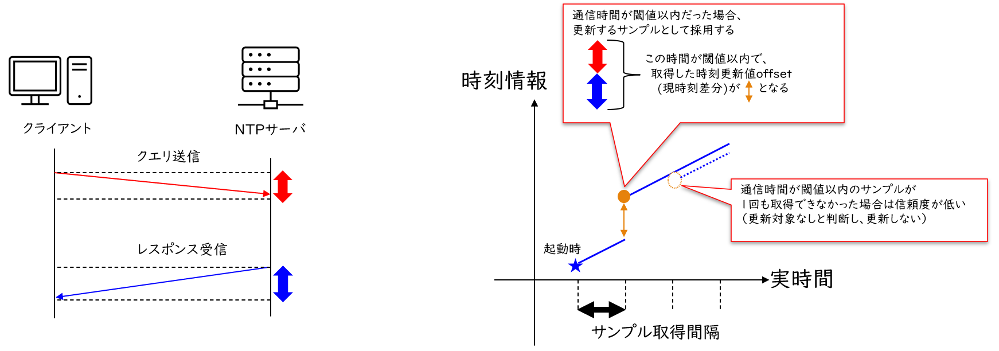
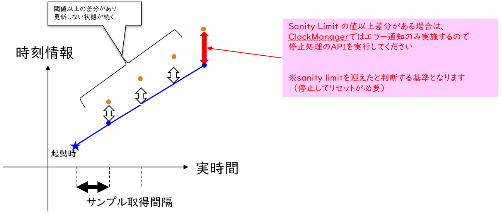
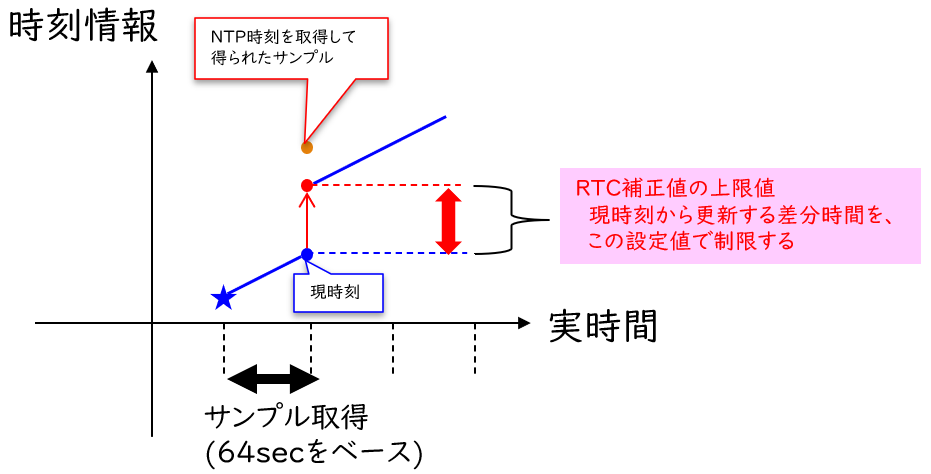
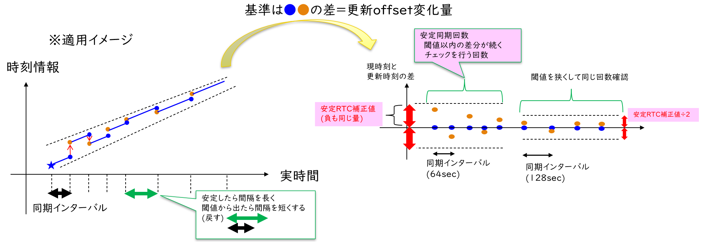

= Clock Manager Function Specification
:sectnums:
:sectnumlevels: 4
:chapter-label:
:revnumber: 0.0.7
:toc:
:toc-title: Table of Contents
:toclevels: 4
:lang: en
:xrefstyle: short
:figure-caption: Figure
:table-caption: Table
:section-refsig:
:experimental:

== Purpose and Scope

This document is created to define AITRIOS Clock Manager. The feature manages the operation of the NTP Client, which performs time synchronization. +
By specifying the necessary parameters for the NTP Client outside the OSS, it becomes easier to control time synchronization from higher-level modules.
// Applies to version XX of XX.

<<<

== Terms
=== step Mode
This mode is one of the methods to adjust the time setting. +
You can immediately correct the time difference between the system clock and the NTP server clock.

=== slew Mode
This mode is one of the methods to adjust the time setting. +
You can gradually correct the time difference between the system clock and the NTP server clock by slowly narrowing the gap.

=== Sanity Limit
A threshold for accepting a sample in NTP time synchronization calculations. This is the upper non-negative integer limit for evaluating the absolute value of theta, as defined in the "Network Time Protocol Version 4: Protocol and Algorithms Specification" [<<#_thebibliography1,1>>].  +
When the absolute value of theta exceeds the given threshold, control actions such as stopping the time synchronization process are taken.

=== RTC Correction Value
This is the difference between the system RTC time and the NTP server time. +
It is expressed as an offset value relative to the system RTC time.

=== NTP Packet Communication Time
This refers to the time taken for a packet to make a round trip between the system and the NTP server. 

=== NTP Information
A parameter used for time synchronization. +
There are two types of parameters required for time synchronization: (1) the hostname of the NTP server or its IPv4 address, and (2) auxiliary inputs for the NTP time synchronization algorithm.
The parameters that have been verified to work correctly are stored by the Parameter Storage Manager.  
This design philosophy is based on the principle that only verified parameters should be saved to non-volatile memory.

=== NTP Time
The time information retrieved from the NTP server.

=== Symbols and Functions Used in This Document
.Functions and symbols in this document
[width="100%", cols="50%,50%",options="header"]
|===
|Symbols / Functions|Description
|〔B〕|This indicates that the unit is in bytes.
|〔ms〕|This indicates that the unit is in milliseconds.
|[a, b]| This indicates a closed interval. This represents a set of real numbers x such that a ≦ x ≦ b, where a and b are real numbers.
|abs(x)|The absolute value function. abs(x) is a function that gives the absolute value of a real number x.
|floor(x)|The floor function. floor(x) is a function that returns the largest integer less than or equal to the real number x.
|sgn(x)|The sign function. sgn(x) is a function that returns 1 if the real number x is positive, -1 if it is negative, and 0 if it is zero.
|⇔|The logical equivalence. A ⇔ B means that A and B are logically equivalent.
|===

<<<

== Component Description
=== Component Overview
The Clock Manager is a component that requests time synchronization from the NTP Client. +
It has two threads: the "NTP Client Daemon Monitoring Thread" and the "Registered Callback Function Call Thread”. +
When the "public function to start operation" provided by the Clock Manager is called, the Clock Manager initializes the threads and the NTP Client Daemon. +

.Overview diagram
[source,mermaid]
....
graph TB
    ds["Upper Module<br>(e.g., App)"]
    cm["Clock Manager"]
  style cm fill:#3cb371,stroke:#333

  subgraph PL["PL"]
    nc["NTP Client"]
  end

  clock["CLOCK_REALTIME<br>(Internal Clock)"]
  server[("NTP Server")]

ds --->|"Start Command (Wakes up Clock Manager)<br>NTP Info/Operation Parameters"| cm
cm -->|"Wake up NTP Client<br>NTP Info"| nc
server -.->|"NTP Time Information"| nc
nc --->|"Time Synchronization"| clock
....

<<<

=== Component Detail

* The Clock Manager is expected to have the following features: +
1. Include threads.
2. Provide NTP information configuration and retrieval APIs.
3. Obtain NTP information either from the Parameter Storage Manager or from higher-level modules retrieved through API parameters.
4. Use the retrieved NTP information to request NTP Client Daemon to synchronize the system's internal Clock (time information) and NTP time.
5. Provide the public function to start or terminate operation.
6. Generate a thread when the public function to start operation is called. And initiate NTP Client Daemon.
7. Terminate the NTP Client Daemon and thread when the public function to terminate operation is called.
8. Have a mechanism to notify the completion of NTP time synchronization.

† Note: The application uses POSIX I/F to retrieve time information.


.Data flow diagram
[source,mermaid]
....
graph TB

refapp["APP"]
ds["Upper Module"]
cm["Clock Manager"]
style cm fill:#3cb371,stroke:#333
clock["CLOCK_REALTIME"]
server[("NTP Server")]
nc["NTP Client"]

ds --->|"Request to Start Clock Manager"| cm
ds --->|"Request to Set NTP Information"| cm
ds --->|"Request to Retrieve NTP Information"| cm
cm -->|"Return NTP Information from Retrieval Request"| ds
ds --->|"Request to Stop Clock Manager"| cm
cm --->|"Request to Start NTP Client Daemon & NTP Information"| nc
cm --->|"Request to Stop NTP Client Daemon"| nc
cm --->|"Status Check"| nc
nc -->|"Return Status from Status Check"| cm
nc -.->|"Time Synchronization"| clock
nc -->|"Time Information"| clock
server -->|"NTP Time Information"| nc
clock --->|"Time"| refapp
....

<<<

=== State Transition
<<#_TableStates>> shows the possible states of Clock Manager.

[#_TableStates]
.Status
[width="100%", cols="20%,80%",options="header"]
|===
|Status |Description
|IDLE|Standby
|READY|Clock Manager initialized status
|RUNNING|Running
|===

The <<#_FigureAbstractOfPPL>> below shows the state transitions in ClockManager when each API is called. +
If an error occurs with any API, no state transition will take place. +

[#_FigureAbstractOfPPL]
.State Transition Diagram
[source,mermaid]
....
stateDiagram-v2
  [*] --> IDLE
  IDLE --> READY: Clock Manager Initialization Complete
  READY --> RUNNING : Startup Complete
  RUNNING --> READY : Shutdown Complete
  READY --> IDLE : Clock Manager Resource Release Complete
....

<<#_TableStateTransition>> indicates whether or not to accept the API and the state transition destination in each state. The state names in the table indicate the state to which the system transitions after the API execution is completed. This shows that the API can be called. "X" signifies that the API is not accepted. Calling the API in this state will return an error and no state transition will occur. For more information on errors, see <<#_EsfClockManagerReturnValue>>.

[#_TableStateTransition]
.State Transition
[width="100%", cols="10%,42%,16%,16%,16%"]
|===
2.2+| 3+|Status
|IDLE |READY|RUNNING
.10+|API

|``**`EsfClockManagerInit`**``
|READY
|-
|X

|``**`EsfClockManagerDeinit`**``
|-
|IDLE
|X

|``**`EsfClockManagerSetParamsForcibly`**``
|X
|-
|-

|``**`EsfClockManagerSetParams`**``
|X
|-
|-

|``**`EsfClockManagerGetParams`**``
|X
|-
|-

|``**`EsfClockManagerStart`**``
|X
|RUNNING
|X

|``**`EsfClockManagerStop`**``
|X
|-
|READY

|``**`EsfClockManagerRegisterCbOnNtpSyncComplete`**``
|X
|-
|-

|``**`EsfClockManagerUnregisterCbOnNtpSyncComplete`**``
|X
|-
|-

|``**`EsfClockManagerMigration`**``
|×
|―
|―

|===

X: Returns an error (`kClockManagerStateTransitionError`) +
-: State remains unchanged (Returns OK).

* Note: +
  Transitions IDLE to READY (resp., IDLE→RUNNING, RUNNING→READY, READY→IDLE) occur only after successful initialization (resp., thread start, thread stop, and resource release). If fails, no state transition is performed. +
  See <<#_NonFunction1>> for details on the thread within Clock Manager.

<<<

=== Component Functions
Refer to <<#_TableFunction>> for details of each function.

[#_TableFunction]
.Functions
[width="100%", cols="30%,55%,15%",options="header"]
|===
|Function |Overview  |Section
|Parameter setting including NTP Client
|1. Obtain the NTP server's host name or its IPv4 address, the parameters required for NTP time synchronization, and the frequency at which the Clock Manager's threads monitor the NTP Client Daemon from higher-level modules. +
2. Save the parameters obtained from the previous section 1 to the Parameter Storage Manager upon the completion of NTP time synchronization.
|<<#_Function1>>

|Read parameters from non-volatile storage, such as those used by the NTP Client.
|1. Obtain the NTP server's host name or its IPv4 address, the parameters required for NTP time synchronization, and the frequency at which the Clock Manager's threads monitor the NTP Client Daemon from Parameter Storage Manager.
|<<#_Function2>>

|Thread management within the Clock Manager
|When the Clock Manager's "public function to start operation" is called, the function creates the threads contained within the Clock Manager. +
If the Clock Manager's "public function to stop operation" is called, the function terminates the threads managed by the Clock Manager.
|<<#_Function3>>

|Controlling NTP Client Daemon
|If the Clock Manager's "public function to start operation" is called, the feature uses the parameters obtained in <<#_Function1>> or <<#_Function2>> to start the NTP Client Daemon monitoring thread and to launch the NTP Client Daemon. +
If the Clock Manager's "public function to stop operation" is called, the function terminates the NTP Client Daemon.
|<<#_Function4>>

|Monitoring NTP Client Daemon
|Monitor the state of the NTP Client Daemon and output an error log if any anomalies are detected.
|<<#_Function5>>

|NTP time synchronization completion notification
|Monitor the NTP Client Daemon and notify the callback function when NTP time synchronization is completed.
However if NTP time synchronization fails, it is not notified by the callback function.  I.e., the notification by the callback function is happened if only when NTP time synchronization is successful.
|<<#_Function6>>

| Data Migration Function  
| To maintain compatibility with legacy versions, migrate legacy configuration data to the new format.
|<<#_Function7>>
|===

<<<

=== Component Details
[#_Function1]
==== Parameter setting including NTP Client
* Overview +
    Extract the NTP information and the NTP Client Daemon monitoring interval from the parameters provided by higher-level modules. +
    And save the extracted values to the Parameter Storage Manager upon the completion of NTP time synchronization. +
    The structure for obtaining the NTP information and the NTP Client Daemon monitoring interval is<<#_EsfClockManagerParams,`EsfClockManagerParams`>>.
* Prerequisites
    ** Parameter Storage Manager module is running.
* Details
    ** Detailed behavior +
        When the "public function for setting NTP Client parameters" provided by the Clock Manager is called by a higher-level module, the function performs the following actions:
        *** The Clock Manager performs parameter checks for values within the context in which it is called.
        *** Only if the values are appropriate, the Clock Manager save the value to the Parameter Storage Manager within the context in which it was called. However, the request to write to the Parameter Storage Manager will occur only after NTP time synchronization is complete. Until then, the values will be kept in volatile memory.
    ** Behavior in case of errors and recovery methods +
        If any of the parameters provided to the "public function for setting NTP Client parameters" offered by the Clock Manager are invalid:
        *** The Clock Manager will not save any of the provided values to the Parameter Storage Manager.
        *** The Clock Manager will not retain any of the provided values.
        *** The Clock Manager will return an error.
    ** Considerations +
        None. +

[#_Function2]
==== Read parameters from non-volatile storage, such as those used by the NTP Client.
* Overview +
    Obtain the NTP information and the NTP Client Daemon monitoring interval from the Parameter Storage Manager. +
    The structure for reading the NTP information and the NTP Client Daemon monitoring interval is<<#_EsfClockManagerParams,`EsfClockManagerParams`>>.
* Prerequisites
    ** Parameter Storage Manager module is running.
* Details
    ** Detailed behavior +
        The execution context is not one of the threads managed by the Clock Manager. his reading occurs in two cases:
        the first is when the Clock Manager's public function `EsfClockManagerGetParams` is called, and the second is when the Clock Manager's public function `EsfClockManagerStart` is called. +
        　 +
        (1) If `EsfClockManagerGetParams` is called and, between the device startup and the call to `EsfClockManagerGetParams`, no correct parameters have been set by `EsfClockManagerSetParamsForcibly` or `EsfClockManagerSetParams`, then execute A. +
        Here, A refers to the following: +
        (a) Read the stored NTP Client parameters from the Parameter Storage Manager, (b) perform a parameter check on the retrieved values, and (i) only if the values are valid, provide the non-volatile data to the caller; (ii) otherwise, use predefined default values and provide those to the caller. +
        　 +
        (2) If `EsfClockManagerStart` is called and, between the device startup and the call to `EsfClockManagerStart`, no correct parameters have been set by `EsfClockManagerSetParamsForcibly` or `EsfClockManagerSetParams`, then execute B. +
        Here, B refers to the following: +
        (a) Read the stored NTP Client parameters from the Parameter Storage Manager, 
        (b) perform a parameter check on the retrieved values, and
        (i) only if the values are valid, use them to create 
        the "NTP Client Daemon Monitoring Thread" and pass them to the NTP Client public functions;
        (ii) otherwise, use predefined default values to create
        the "NTP Client Daemon Monitoring Thread" and pass them to the NTP Client public functions.
    ** Behavior in case of errors and recovery methods +
        If the NTP Client parameters read from the Parameter Storage Manager are invalid, use predefined default values and return these as the result of `EsfClockManagerGetParams`, or pass them to the "NTP Client Daemon Monitoring Thread" and NTP Client public functions. +
    ** Considerations +
        *** None. +

[#_Function3]
==== Thread management within the Clock Manager
* Overview
    ** When the Clock Manager's "public function to start operation" is called, the function creates the threads contained within the Clock Manager.
    ** If the Clock Manager's "public function to stop operation" is called, the function terminates the threads managed by the Clock Manager.
* Prerequisites
    ** Parameter Storage Manager module is running.
* Details
    ** Detailed behavior +
        The execution context is not one of the threads managed by the Clock Manager. +
        If the Clock Manager's "public function to stop operation" is called, the function terminates the threads managed by the Clock Manager. +
        When the Clock Manager's "public function to start operation" is called by a higher-level module, +
        the Clock Manager will create the "NTP Client Daemon Monitoring Thread" within the context in which it was called. +
        There are two scenarios in which the Clock Manager's "public function to start operation" can be invoked:
        When `EsfClockManagerSetParamsForcibly`or`EsfClockManagerSetParams` has been called to set appropriate values before calling `EsfClockManagerStart`.
When `EsfClockManagerSetParamsForcibly`or`EsfClockManagerSetParams` has not been called and `EsfClockManagerStart` is called directly. +
        　 +
        (1) If `EsfClockManagerSetParamsForcibly`or`EsfClockManagerSetParams` has been called
        between the device startup and the call to `EsfClockManagerStart`, 
        and if valid parameters have been set by `EsfClockManagerSetParamsForcibly`or`EsfClockManagerSetParams`,
        then execute C'. +
        Here, C' refers to "create the 'NTP Client Daemon Monitoring Thread' using the parameters stored in volatile memory." +
        　 +
        (2) If `EsfClockManagerSetParamsForcibly`or`EsfClockManagerSetParams` has been called
        between the device startup and the call to `EsfClockManagerStart`, and if valid parameters have not been set by `EsfClockManagerSetParamsForcibly`or`EsfClockManagerSetParams`,
        then execute C. +
        Here, C refers to the following: +
        (a) Read the stored NTP Client parameters from the Parameter Storage Manager,
        (b) perform a parameter check on the retrieved values, and
        (i) only if the values are valid, use them to create the "NTP Client Daemon Monitoring Thread";
        (ii) otherwise, use predefined default values to create the "NTP Client Daemon Monitoring Thread."
    ** Behavior in case of errors and recovery methods +
        If the NTP Client parameters read from the Parameter Storage Manager are invalid, use predefined default values and pass them to the "NTP Client Daemon Monitoring Thread." If the "NTP Client Daemon Monitoring Thread" or the "Registered Callback Function Call Thread" fails to start, the thread that was successfully started is terminated and returned.
    ** Considerations
        *** None. +

[#_Function4]
==== Controlling NTP Client Daemon
* Overview +
    ** If the Clock Manager's "public function to start operation" is called, the feature uses the parameters obtained in <<#_Function1>> or <<#_Function2>> to start the NTP Client Daemon monitoring thread and to launch the NTP Client Daemon.
    ** If the Clock Manager's "public function to stop operation" is called, the function terminates the NTP Client Daemon.
* Prerequisites +
    ** The ability to configure the parameters necessary for starting the NTP Client Daemon.
* Details
    ** Detailed behavior +
        If the Clock Manager's "public function to terminate operation" is called by a higher-level module, the function will terminate the NTP Client Daemon. +
        When the Clock Manager's "public function to start operation" is called by a higher-level module,
        the Clock Manager will start the NTP Client Daemon within the context in which it was called. +
        There are two scenarios in which the Clock Manager's "public function to start operation" can be invoked:
        When `EsfClockManagerSetParamsForcibly`or`EsfClockManagerSetParams` has been called to set appropriate values before calling `EsfClockManagerStart`.
When `EsfClockManagerSetParamsForcibly`or`EsfClockManagerSetParams` has not been called and `EsfClockManagerStart` is called directly. +
        　 +
        (1) If `EsfClockManagerSetParamsForcibly`or`EsfClockManagerSetParams` has been called
        between the device startup and the call to `EsfClockManagerStart`,
        and if valid parameters have been set by `EsfClockManagerSetParamsForcibly`or`EsfClockManagerSetParams`,
        then execute D'. +
        Here, D' refers to "pass the parameters stored in volatile memory to the NTP Client public functions." +
        　 +
        (2) If `EsfClockManagerSetParamsForcibly`or`EsfClockManagerSetParams` has been called
        between the device startup and the call to `EsfClockManagerStart`,
        and if valid parameters have not been set by ``EsfClockManagerSetParamsForcibly` / `EsfClockManagerSetParams`,
        then execute D. +
        Here, D refers to the following: +
        (a) Read the stored NTP Client parameters from the Parameter Storage Manager,
        (b) perform a parameter check on the retrieved values, and
            (i) only if the values are valid, use them to pass to the NTP Client public functions;
            (ii) otherwise, use predefined default values and pass them to the NTP Client public functions.
    ** Behavior in case of errors and recovery methods +
        *** If the "NTP Client Daemon Monitoring Thread," the "Registered Callback Function Call Thread," or the NTP Client Daemon fails to start, attempt to ensure that none of the threads or the NTP Client Daemon are running, without attempting a restart, and return an error.

[#_Function5]
==== Monitoring NTP Client Daemon
* Overview +
    Monitor the state of the NTP Client Daemon and output an error log if any anomalies are detected.
* Prerequisites +
    ** NTP Client Daemon Monitoring Thread is running.
* Details
    ** Detailed behavior +
        The "NTP Client Daemon Monitoring Thread" monitors the NTP Client Daemon at the specified interval.
    ** Behavior in case of errors and recovery methods
        *** If the NTP Client Daemon Monitoring Thread detects an error in the NTP Client Daemon, it will output an error log.

[#_Function6]
==== NTP time synchronization completion notification
* Overview +
    ** If the NTP Client Daemon Monitoring Thread detects NTP time synchronization completion, it will notify the "Registered Callback Function Call Thread" managed by the Clock Manager.
    ** Invoke the callback function from the "Registered Callback Function Call Thread" to notify that NTP time synchronization is complete.
* Prerequisites +
    ** NTP Client Daemon is running.
    ** NTP information is obtained.
    ** NTP Client Daemon Monitoring Thread is running.
    ** The "Registered Callback Function Call Thread" is running.
* Details
    ** Detailed behavior +
        The "NTP Client Daemon Monitoring Thread" monitors the NTP Client Daemon at the given interval, and if it detects NTP time synchronization completion, it will notify the "Registered Callback Function Call Thread" of this completion.
        The "Registered Callback Function Call Thread" will then invoke the registered callback function to notify the higher-level module of the NTP time synchronization completion. +
        NTP time synchronization is considered complete only when the following conditions are met:
        *** The number of samples taken by the NTP Client Daemon is a positive integer.
    ** Behavior in case of errors and recovery methods +
        *** If the NTP Client Daemon Monitoring Thread detects an error in the NTP Client Daemon, it will output an error log.

[#_Function7]
==== Data Migration Function
* Overview +
    To maintain compatibility with legacy versions, migrate legacy configuration data to the new format. +
    Processing is only performed if there is configuration data that needs to be migrated.
* Prerequisites +
    ** Clock Manager is initialized.
    ** Parameter Storage Manager module is started.
* Details
    ** Detailed Behavior +
        本機能は、旧形式のNTPサーバーのhostnameを新形式に変換して保存し直す。 +
        具体的な移行処理としては、以下のような処理を行う： +
        This function converts and saves the legacy type of NTP server hostname to the new format. +
        The specific migration process includes the following steps: +
        1. Read the legacy data. +
        2. Read the existing new format data from the Parameter Storage Manager. +
        3. Save the converted data to the Parameter Storage Manager. +
           If migration is not required (i.e., if the existing new format data is present in the Parameter Storage Manager), no processing is performed.
        4. Perform initial settings for other new format data.
    ** Behavior in case of errors and recovery methods +
        If the migration process fails, an error log will be output. +  
        The recovery method is to attempt the migration process again.

[#_FigureClockManagerSequence]
.Control sequence diagram
[source,mermaid]
....
sequenceDiagram
  Clock Manager->>NTP Client: NTP Information<br>Request to Start NTP Client Daemon (ntpc_start_with_params or ntpc_start_with_list)

  loop Polling Interval
    Clock Manager->>NTP Client: Status Check (ntpc_status)
    NTP Client-->>Clock Manager: Status (Return from ntpc_status)

    alt When the NTP Client Daemon is stopped
      Clock Manager->>NTP Client: NTP Information<br>Request to Start NTP Client Daemon (ntpc_start_with_params or ntpc_start_with_list)
    end
  end
....

.Sequence diagram for forcing an update of NTP information
[source,mermaid]
....
sequenceDiagram
  Upper Module->>Clock Manager: Initialization Request (EsfClockManagerInit)
  Clock Manager->>Parameter Storage Manager: EsfParameterStorageManagerOpen
  Parameter Storage Manager-->>Clock Manager: Success or Failure of EsfParameterStorageManagerOpen
  Clock Manager-->>Upper Module: Initialization Completion Status (Return of EsfClockManagerInit)
  opt When Initialization is Successful
    Upper Module->>Clock Manager: Request to Retrieve NTP Information, etc. (EsfClockManagerGetParams)
    opt If No Accepted Setting Requests Have Been Made Yet
      Clock Manager->>Parameter Storage Manager: Request to Retrieve NTP Information, etc., from Non-Volatile Memory (EsfParameterStorageManagerLoad)
      Parameter Storage Manager-->>Clock Manager: NTP Information, etc., from Non-Volatile Memory (Return of EsfParameterStorageManagerLoad)
    end
    Clock Manager-->>Upper Module: Notification of NTP Information, etc. (Return of EsfClockManagerGetParams)
    Upper Module->>Clock Manager: Forced Setting Request for NTP Information, etc. (EsfClockManagerSetParamsForcibly)
    opt If Setting Request is Acceptable
      Clock Manager->>Parameter Storage Manager: Request to Save NTP Information, etc., to Non-Volatile Memory (EsfParameterStorageManagerSave)
      Parameter Storage Manager-->>Clock Manager: Save Success or Failure (Return of EsfParameterStorageManagerSave)
    end
    Clock Manager-->>Upper Module: Acceptance/Denial of Forced Setting Request for NTP Information, etc. (Return of EsfClockManagerSetParamsForcibly)

    Upper Module->>Clock Manager: Request to Start Clock Manager (EsfClockManagerStart)
    Clock Manager->>NTP Client: NTP Information<br>Request to Start NTP Client Daemon (ntpc_start_with_params or ntpc_start_with_list)
    Clock Manager ->>NTP Client: Status Check for NTP Time Synchronization Completion, etc. (ntpc_status)
    NTP Client-->>Clock Manager: Detection of NTP Time Synchronization Completion (Return of ntpc_status)
  end
....

.Sequence diagram for updating NTP information
[source,mermaid]
....
sequenceDiagram
  Upper Module->>Clock Manager: Initialization Request (EsfClockManagerInit)
  Clock Manager->>Parameter Storage Manager: EsfParameterStorageManagerOpen
  Parameter Storage Manager-->>Clock Manager: Success or Failure of EsfParameterStorageManagerOpen
  Clock Manager-->>Upper Module: Initialization Completion Status (Return of EsfClockManagerInit)
  opt When Initialization is Successful
    Upper Module->>Clock Manager: Request to Retrieve NTP Information, etc. (EsfClockManagerGetParams)
    opt If No Accepted Setting Requests Have Been Made Yet
      Clock Manager->>Parameter Storage Manager: Request to Retrieve NTP Information, etc., from Non-Volatile Memory (EsfParameterStorageManagerLoad)
      Parameter Storage Manager-->>Clock Manager: NTP Information, etc., from Non-Volatile Memory (Return of EsfParameterStorageManagerLoad)
    end
    Clock Manager-->>Upper Module: Notification of NTP Information, etc. (Return of EsfClockManagerGetParams)
    Upper Module->>Clock Manager: Request to Set NTP Information, etc. (EsfClockManagerSetParams)
    Clock Manager-->>Upper Module: Acceptance/Denial of NTP Information Setting Request (Return of EsfClockManagerSetParams)
    Upper Module->>Clock Manager: Request to Register Callback Function for NTP Time Synchronization Completion Notification (EsfClockManagerRegisterCbOnNtpSyncComplete)
    Clock Manager-->>Upper Module: Result of Registering Callback Function for NTP Time Synchronization Completion (Return of EsfClockManagerRegisterCbOnNtpSyncComplete)

    Upper Module->>Clock Manager: Request to Start Clock Manager (EsfClockManagerStart)
    Clock Manager->>NTP Client: NTP Information<br>Request to Start NTP Client Daemon (ntpc_start_with_params or ntpc_start_with_list)
    Clock Manager-->>Upper Module: Result of Start Request for Clock Manager (Return of EsfClockManagerStart)
    Clock Manager->>NTP Client: Status Check for NTP Time Synchronization Completion, etc. (ntpc_status)
    NTP Client-->>Clock Manager: Detection of NTP Time Synchronization Completion (Return of ntpc_status)
    Clock Manager->>Parameter Storage Manager: Request to Save NTP Information, etc., to Non-Volatile Memory (EsfParameterStorageManagerSave)
    Clock Manager->>Upper Module: NTP Time Synchronization Completion Notification (Callback Function Call)

    Upper Module->>Clock Manager: Request to Retrieve NTP Information, etc. (EsfClockManagerGetParams)
    Clock Manager-->>Upper Module: Notification of NTP Information, etc. (Return of EsfClockManagerGetParams)
    Upper Module->>Clock Manager: Request to Set NTP Information, etc. (EsfClockManagerSetParams)
    Clock Manager-->>Upper Module: Acceptance/Denial of NTP Information Setting Request (Return of EsfClockManagerSetParams)

    Upper Module->>Clock Manager: Stop Request (EsfClockManagerStop)
    Clock Manager->>NTP Client: Request to Stop NTP Client Daemon (ntpc_stop)
    Clock Manager->>NTP Client: Status Check for NTP Client Daemon (ntpc_status)
    NTP Client-->>Clock Manager: Detection of NTP Client Daemon Stop (Return of ntpc_status)
    Clock Manager-->>Upper Module: Stop Result (Return of EsfClockManagerStop)

    Upper Module->>Clock Manager: Request to Start Clock Manager (EsfClockManagerStart)
    Clock Manager->>NTP Client: NTP Information<br>Request to Start NTP Client Daemon (ntpc_start_with_params or ntpc_start_with_list)
    Clock Manager-->>Upper Module: Result of Start Request for Clock Manager (Return of EsfClockManagerStart)
    Clock Manager->>NTP Client: Status Check for NTP Time Synchronization Completion, etc. (ntpc_status)
    NTP Client-->>Clock Manager: Detection of NTP Time Synchronization Completion (Return of ntpc_status)
    Clock Manager->>Parameter Storage Manager: Request to Save NTP Information, etc., to Non-Volatile Memory (EsfParameterStorageManagerSave)
    Clock Manager->>Upper Module: NTP Time Synchronization Completion Notification (Callback Function Call)

    Upper Module->>Clock Manager: Stop Request (EsfClockManagerStop)
    Clock Manager->>NTP Client: Request to Stop NTP Client Daemon (ntpc_stop)
    Clock Manager->>NTP Client: Status Check for NTP Client Daemon (ntpc_status)
    NTP Client-->>Clock Manager: Detection of NTP Client Daemon Stop (Return of ntpc_status)
    Clock Manager-->>Upper Module: Stop Result (Return of EsfClockManagerStop)

    Upper Module->>Clock Manager: Resource Release Request (EsfClockManagerDeinit)
    Clock Manager->>Parameter Storage Manager: EsfParameterStorageManagerClose
    Parameter Storage Manager-->>Clock Manager: Success or Failure of EsfParameterStorageManagerClose
    Clock Manager-->>Upper Module: Resource Release Completion Status (Return of EsfClockManagerDeinit)
  end
....

<<<

=== Non-functional Requirements of the Component

<<#_TableNonFunction>> is a list of non-functional requirements for the Clock Manager.

[#_TableNonFunction]
.Nonfunctional requirements
[width="100%", cols="30%,55%,15%",options="header"]
|===
|Function |Overview  |Section
|Number of threads managed by the Clock Manager +
(Does not include the main thread in which the `main` function runs.)
|2
|<<#_NonFunction1>>
|Maximum stack usage
|XXX byte
|<<#_NonFunction2>>
|Heap memory usage
|XXX byte
|<<#_NonFunction3>>
|===
<<<

=== Non-functional Requirements Details
As of 2024/4/19, this section is T.B.D.

[#_NonFunction1]
==== Thread configuration
The Clock Manager module operates by starting threads (it has two threads).  +
The stack size for the "NTP Client Daemon Monitoring Thread" is CONFIG_ESF_CLOCK_MANAGER_NTP_CLIENT_MONITOR_STACKSIZE 〔B〕.  +
The stack size for the "Registered Callback Function Call Thread" is CONFIG_ESF_CLOCK_MANAGER_NOTIFIER_STACKSIZE 〔B〕.

[#_NonFunction2]
==== Maximum stack usage
T.B.D
[#_NonFunction3]
==== Heap memory usage
T.B.D

<<<

== API Specifications
=== Definition
==== Config
Refer to <<#_TableConfig>> for Config.

[#_TableConfig]
.Config
[width="100%", cols="30%,15%,55%",options="header"]
|===
|Name |Default Value |Overview
|`CONFIG_EXTERNAL_CLOCK_MANAGER`
|`n`
|Clock Manager enable/disable

|`CONFIG_ESF_CLOCK_MANAGER_NTP_CLIENT_MONITOR_STACKSIZE`
|`CONFIG_PTHREAD_STACK_DEFAULT`
|Stack size of "NTP Client Daemon Monitoring Thread"

|`CONFIG_ESF_CLOCK_MANAGER_NOTIFIER_STACKSIZE`
|`3072`
|Stack size of "Registered Callback Function Call Thread"

|===


==== Data Types
Refer to <<#_TableDataType>> for data types.

[#_TableDataType]
.Data Types
[width="100%", cols="30%,55%,15%",options="header"]
|===
|Name |Overview  |Section

|`EsfClockManagerReturnValue`
|Enumeration type that defines the results of Clock Manager API execution.
|<<#_EsfClockManagerReturnValue>>

|`EsfClockManagerParamType`
|Enumeration type that specifies NTP parameter type.
|<<#_EsfClockManagerParamType>>

|`EsfClockManagerParams`
|Structure that stores NTP parameters.
|<<#_EsfClockManagerParams>>

|`EsfClockManagerParamsMask`
|Structure that indicates which member variables of the object have been set when passing an object of the EsfClockManagerParams structure to the Clock Manager.
|<<#_EsfClockManagerParamsMask>>

|`EsfClockManagerConnection`
|Sub-structure of `EsfClockManagerParams`. +
Structure that contains the host name or IPv4 address of the NTP server.
|<<#_EsfClockManagerConnection>>

|`EsfClockManagerConnectionMask`
|Sub-structure of `EsfClockManagerParamsMask`. +
Indicates whether the member variables of the object have been set when passing the NTP server host name or IPv4 address of EsfClockManagerConnection structure to the Clock Manager.
|<<#_EsfClockManagerConnectionMask>>

|`EsfClockManagerCommon`
|Sub-structure of `EsfClockManagerParams`. +
Structure that contains the NTP synchronization time and the NTP Client Daemon monitoring time.
|<<#_EsfClockManagerCommon>>

|`EsfClockManagerCommonMask`
|Sub-structure of `EsfClockManagerParamsMask`. +
Structure that indicates which member variables of the object have been set when passing an object of the EsfClockManagerCommon structure to the Clock Manager.
|<<#_EsfClockManagerCommonMask>>

|`EsfClockManagerSkipAndLimit`
|Sub-structure of `EsfClockManagerParams`. +
Structure that contains the NTP synchronization skip/limit parameters.
|<<#_EsfClockManagerSkipAndLimit>>

|`EsfClockManagerSkipAndLimitMask`
|Sub-structure of `EsfClockManagerParamsMask`. +
Structure that indicates which member variables of the object have been set when passing an object of the EsfClockManagerSkipAndLimit structure to the Clock Manager.
|<<#_EsfClockManagerSkipAndLimitMask>>

|`EsfClockManagerSlewParam`
|Sub-structure of `EsfClockManagerParams`. +
Structure that contains parameters for setting the NTP synchronization Slew mode.
|<<#_EsfClockManagerSlewParam>>

|`EsfClockManagerSlewParamMask`
|Sub-structure of `EsfClockManagerParamsMask`. +
Structure that indicates which member variables of the object have been set when passing an object of the EsfClockManagerSlewParam structure to the Clock Manager.
|<<#_EsfClockManagerSlewParamMask>>

|`ESF_CLOCK_MANAGER_STOP_TIMEOUT`
|A macro defining the timeout period for stopping the Clock Manager (for fail-safe in cases where stopping the OSS takes time).
|<<#_ESF_CLOCK_MANAGER_STOP_TIMEOUT>>

|===


==== APIs
Refer to <<#_TableAPI>> for the supported APIs.

[#_TableAPI]
.APIs
[width="100%", cols="30%,55%,15%",options="header"]
|===
|API |Overview  |Section

|`EsfClockManagerInit`
|Initialize Clock Manager.
|<<#_EsfClockManagerInit>>

|`EsfClockManagerDeinit`
|Releases Clock Manager resource.
|<<#_EsfClockManagerDeinit>>

|`EsfClockManagerSetParamsForcibly`
|Forcefully write the parameters required for NTP time synchronization and the monitoring time to non-volatile storage.
|<<#_EsfClockManagerSetParamsForcibly>>

|`EsfClockManagerSetParams`
|Set the parameters and monitoring time required for NTP time synchronization.
|<<#_EsfClockManagerSetParams>>

|`EsfClockManagerGetParams`
|Get the parameters and monitoring time required for NTP time synchronization.
|<<#_EsfClockManagerGetParams>>

|`EsfClockManagerStart`
|Execute time synchronization.
|<<#_EsfClockManagerStart>>

|`EsfClockManagerStop`
|Stop time synchronization.
|<<#_EsfClockManagerStop>>

|`EsfClockManagerRegisterCbOnNtpSyncComplete`
|Register a callback function to notify when NTP time synchronization is complete.
|<<#_EsfClockManagerRegisterCbOnNtpSyncComplete>>

|`EsfClockManagerUnregisterCbOnNtpSyncComplete`
|Unregister the callback function that notifies when NTP time synchronization is complete.
|<<#_EsfClockManagerUnregisterCbOnNtpSyncComplete>>

|`EsfClockManagerMigration`
|Execute the migration process of the Clock Manager's configuration data.
|<<#_EsfClockManagerMigration>>

|===

<<<

=== Data Type Definition
[#_EsfClockManagerReturnValue]
==== EsfClockManagerReturnValue
This is an enumeration type that defines the result of executing Clock Manager API.

* *Format*

[source, C]
....
typedef enum {
  kClockManagerSuccess,              // Success
  kClockManagerParamError,           // Invalid parameter error
  kClockManagerInternalError,        // Internal error
  kClockManagerStateTransitionError  // State translation error
} EsfClockManagerReturnValue;
....

* *Value* 

[#_TableEsfClockManagerReturnValueValue]
.Values of EsfClockManagerReturnValue
[width="100%", cols="30%,70%",options="header"]
|===
|Member name  |Description
|`kClockManagerSuccess`
|Successful completion

|`kClockManagerParamError`
|Invalid input parameter

|`kClockManagerInternalError`
|Internal error

|`kClockManagerStateTransitionError`
|State transition error
|===

[#_EsfClockManagerParamType]
==== EsfClockManagerParamType
An enumeration representing the types of configuration parameters for the structures `EsfClockManagerSkipAndLimit` or `EsfClockManagerSlewParam`, as described below.

* *Format*

[source, C]
....
typedef enum EsfClockManagerParamType {
  kClockManagerParamTypeOff,
  kClockManagerParamTypeDefault,
  kClockManagerParamTypeCustom,
  kClockManagerParamTypeNumMax
} EsfClockManagerParamType;
....

* *Value*

[#_TableEsfClockManagerParamType]
.Values of EsfClockManagerParamType
[width="100%", cols="30%,70%",options="header"]
|===
|Member name  |Description
|`kClockManagerParamTypeOff`
|Set the corresponding feature to the OFF state (ignores related parameter settings).

|`kClockManagerParamTypeDefault`
|Set the corresponding feature parameters to default settings (ignores related parameter settings).

|`kClockManagerParamTypeCustom`
|Set the corresponding feature parameters individually.

|`kClockManagerParamTypeNumMax`
|Represents the number of enumeration constants of the `EsfClockManagerParamType` type.
|===


[#_EsfClockManagerParams]
==== EsfClockManagerParams
A structure that stores parameters obtained from higher-level modules. +
It also stores parameters retrieved from the Parameter Storage Manager.

* *Format*

[source, C]
....
typedef struct EsfClockManagerParams {
  EsfClockManagerConnection connect;
  EsfClockManagerCommon common;
  EsfClockManagerSkipAndLimit skip_and_limit;
  EsfClockManagerSlewParam slew_setting;
} EsfClockManagerParams;

....

* *Value*

[#_TableEsfClockManagerParamsValue]
.Values of EsfClockManagerParams
[width="100%", cols="20%,50%,15%,15%",options="header"]
|===
|Member name|Description|Range of setting values|Default Value

|`connect`
|Host name or +
IPv4 address of the destination NTP server.
|<<#_ESF_CLOCK_MANAGER_NTPADDR_MAX_SIZE,ESF_CLOCK_MANAGER_NTPADDR_MAX_SIZE>> +
bytes or less.
|`"time.aitrios.sony-semicon.com"`

|`common`
|Refer to <<#_EsfClockManagerCommon>>.
|Refer to <<#_EsfClockManagerCommon>>.
|Refer to <<#_EsfClockManagerCommon>>.

|`skip_and_limit`
|Refer to <<#_EsfClockManagerSkipAndLimit>>.
|Refer to <<#_EsfClockManagerSkipAndLimit>>.
|Refer to <<#_EsfClockManagerSkipAndLimit>>.

|`slew_settings`
|Refer to <<#_EsfClockManagerSlewParam>>.
|Refer to <<#_EsfClockManagerSlewParam>>.
|Refer to <<#_EsfClockManagerSlewParam>>.
|===


[#_EsfClockManagerParamsMask]
==== EsfClockManagerParamsMask
Structure that indicates which member variables of the object have been set when passing an object of the EsfClockManagerParams structure to the Clock Manager.


* *Format*

[source, C]
....
typedef struct EsfClockManagerParamsMask {
  EsfClockManagerConnectionMask connect;
  EsfClockManagerCommonMask common;
  EsfClockManagerSkipAndLimitMask skip_and_limit;
  EsfClockManagerSlewParamMask slew_setting;
} EsfClockManagerParamsMask;
....

.Values of EsfClockManagerParamsMask
[width="100%", cols="20%,50%,15%,15%",options="header"]
|===
|Member name|Description|Range of setting values|Default Value

|`connect`
|It indicates which member variables of the `EsfClockManagerConnection` structure, which is paired with the `EsfClockManagerConnectionMask` structure contained in this structure, are set or required.
|1 or 0
|0

|`common`
|It indicates which member variables of the `EsfClockManagerCommon` structure, which is paired with the `EsfClockManagerCommonMask` structure contained in this structure, are set or required.
|1 or 0 for each member variable.
|0

|`skip_and_limit`
|This structure indicates which member variables of the `EsfClockManagerSkipAndLimit` structure, which pairs with the `EsfClockManagerSkipAndLimitMask` object contained within this structure, are set or required.

|1 or 0 for each member variable.
|0

|`slew_setting`
|This structure indicates which member variables of the `EsfClockManagerSlewParam` structure, which pairs with the `EsfClockManagerSlewParamMask` object contained within this structure, are set or required.
|1 or 0 for each member variable.
|0
|===

[#_EsfClockManagerConnection]
==== EsfClockManagerConnection
Structure that contains the host name or IPv4 address of the NTP server.

* *Format*

[source, C]
....
typedef struct EsfClockManagerSettingConnection {
  char hostname[ESF_CLOCK_MANAGER_NTPADDR_MAX_SIZE];
} EsfClockManagerConnection;
....

.Values of EsfClockManagerConnection
[width="100%", cols="20%,50%,15%,15%",options="header"]
|===
|Member name  |Description |  Range of setting values | Default Value

|`hostname`
|Host name or  +
IPv4 address of the destination NTP server.
|Including the last null character,<<#_ESF_CLOCK_MANAGER_NTPADDR_MAX_SIZE,ESF_CLOCK_MANAGER_NTPADDR_MAX_SIZE>> +
〔B〕 or less.
|`"time.aitrios.sony-semicon.com"`

|===

[#_EsfClockManagerConnectionMask]
==== EsfClockManagerConnectionMask
Indicates whether the member variables of the object have been set when passing the NTP server host name or IPv4 address of EsfClockManagerConnection structure to the Clock Manager.


* *Format*

[source, C]
....
typedef struct EsfClockManagerSettingConnectionMask {
  uint8_t hostname : 1;
} EsfClockManagerConnectionMask;
....

.Values of EsfClockManagerConnectionMask
[width="100%", cols="20%,50%,15%,15%",options="header"]
|===
|Member name|Description|Range of setting values|Default Value

|`hostname`
|Contains 1 if the hostname in the `EsfClockManagerConnection` object, which pairs with this structure's object, is set or required; otherwise, contains 0.
|1 or 0
|0

|===


[#_EsfClockManagerCommon]
==== EsfClockManagerCommon
Structure that contains the NTP synchronization time and the NTP Client Daemon monitoring time.

* *Format*

[source, C]
....
typedef struct EsfClockManagerSettingCommon {
  int sync_interval;  // NTP client's period
  int polling_time;   // Clock Manager thread's period
} EsfClockManagerCommon;
....

.Values of EsfClockManagerCommon
[width="100%", cols="20%,50%,15%,15%",options="header"]
|===
|Member name  |Description |  Range of setting values | Default Value

|`sync_interval`
|Synchronization interval (unit:  seconds)
|[64, 1024]
|64

|`polling_time`
|Status monitoring interval (unit:  seconds)
|[1, 1024]
|60
|===

** `sync_interval` is the NTP time synchronization interval for the NTP Client Daemon.
** `polling_time` is the interval at which the "NTP Client Daemon Monitoring Thread" checks the status of the NTP Client Daemon.

[#_EsfClockManagerCommonMask]
==== EsfClockManagerCommonMask
Structure that indicates which member variables of the object have been set when passing an object of the EsfClockManagerCommon structure to the Clock Manager.


* *Format*

[source, C]
....
typedef struct EsfClockManagerSettingCommonMask {
  uint8_t sync_interval : 1;
  uint8_t polling_time : 1;
} EsfClockManagerCommonMask;
....

.Values of EsfClockManagerCommonMask
[width="100%", cols="20%,50%,15%,15%",options="header"]
|===
|Member name|Description|Range of setting values|Default Value

|`sync_interval`
|Contains 1 if `sync_interval` in the `EsfClockManagerCommon` object, which pairs with this structure's object, is set or required; otherwise, contains 0.
|1 or 0
|0

|`polling_time`
|Contains 1 if `polling_time` in the `EsfClockManagerCommon` object, which pairs with this structure's object, is set or required; otherwise, contains 0.
|1 or 0
|0

|===


[#_EsfClockManagerSkipAndLimit]
==== EsfClockManagerSkipAndLimit
Structure that contains the NTP synchronization skip/limit parameters.

* *Format*

[source, C]
....
typedef struct EsfClockManagerSettingSkipAndLimit {
  EsfClockManagerParamType type;
  int limit_packet_time;
  int limit_rtc_correction_value;
  int sanity_limit;
} EsfClockManagerSkipAndLimit;
....

.Values of EsfClockManagerSkipAndLimit
[width="100%", cols="20%,50%,15%,15%",options="header"]
|===
|Member name  |Description |  Range of setting values | Default Value

|`type`
|Specifies the parameter type for the members of this structure.  +
If you want to assign custom values to other member variables, set `kClockManagerParamTypeCustom`. +
To operate with default settings, set `kClockManagerParamTypeDefault`. +
To disable the SkipAndLimit feature, set `kClockManagerParamTypeOff`.
|Refer to <<#_EsfClockManagerParamType>>.
|`kClockManagerParamTypeOff`

|`limit_packet_time`
|Threshold for NTP packet round-trip time (unit:  msec).  +
 If the round-trip time between the device and the NTP server—i.e., the delta defined in [<<#_thebibliography1,1>>]—exceeds this value, the obtained value will not be accepted as a sample for NTP time synchronization. +

|[0, 10000]
|66

|`limit_rtc_correction_value`
|RTC correction width—the maximum allowable difference between the system time corrected by the RTC correction value and the current system time (unit:  seconds). +
This value limits the RTC correction value obtained or computed from the NTP server. +
Specifically, if the absolute value of the computed RTC correction exceeds this setting, +
it is constrained to sgn(computed RTC correction value) × +
`limit_rtc_correction_value`. +
For example, if the setting is 66: +
If the computed RTC correction is +70 msec, the RTC correction will be limited to +66 msec. +
If the computed RTC correction is -70 msec, the RTC correction will be limited to -66 msec.
|[0, 1000]
|66

|`sanity_limit`
|The threshold for theta as defined in [<<#_thebibliography1,1>>] (unit:  msec). +
If the communication time with the NTP server exceeds this value, the number of errors is recorded in RAM.
|[0, 32767]
|1000
|===

[#_EsfClockManagerSkipAndLimitMask]
==== EsfClockManagerSkipAndLimitMask
Structure that indicates which member variables of the object have been set when passing an object of the EsfClockManagerSkipAndLimit structure to the Clock Manager.


* *Format*

[source, C]
....
typedef struct EsfClockManagerSettingSkipAndLimitMask {
  uint8_t type : 1;
  uint8_t limit_packet_time : 1;
  uint8_t limit_rtc_correction_value : 1;
  uint8_t sanity_limit : 1;
} EsfClockManagerSkipAndLimitMask;
....

.Values of EsfClockManagerSkipAndLimitMask
[width="100%", cols="20%,50%,15%,15%",options="header"]
|===
|Member name|Description|Range of setting values|Default Value

|`type`
|Contains 1 if `type` in the `EsfClockManagerSkipAndLimit` object, which pairs with this structure's object, is set or required; otherwise, contains 0.
|1 or 0
|0

|`limit_packet_time`
|Contains 1 if `limit_packet_time` in the `EsfClockManagerSkipAndLimit` object, which pairs with this structure's object, is set or required; otherwise, contains 0.
|1 or 0
|0

|`limit_rtc_correction_value`
|Contains 1 if `limit_rtc_correction_value` in the `EsfClockManagerSkipAndLimit` object, which pairs with this structure's object, is set or required; otherwise, contains 0.
|1 or 0
|0

|`sanity_limit`
|Contains 1 if `sanity_limit` in the `EsfClockManagerSkipAndLimit` object, which pairs with this structure's object, is set or required; otherwise, contains 0.
|1 or 0
|0
|===


[#_EsfClockManagerSlewParam]
==== EsfClockManagerSlewParam
Structure that contains parameters for setting the NTP synchronization Slew mode.

* *Format*

[source, C]
....
typedef struct EsfClockManagerSettingSlewParam {
  EsfClockManagerParamType type;
  int stable_rtc_correction_value;
  int stable_sync_number;
} EsfClockManagerSlewParam;
....


.Values of EsfClockManagerSlewParam
[width="100%", cols="20%,50%,15%,15%",options="header"]
|===
|Member name  |Description |  Range of setting values | Default Value

|`type`
|Specifies the parameter type for the members of this structure.  +
If you want to assign custom values to other member variables, set `kClockManagerParamTypeCustom`.  +
To operate with default settings, set `kClockManagerParamTypeDefault`.  +
To disable the slew mode function, set `kClockManagerParamTypeOff`.
|Refer to <<#_EsfClockManagerParamType>>.
|`kClockManagerParamTypeOff`

|`stable_rtc_correction_value`
|Stable RTC correction value (unit: msec). +
If the absolute value of the RTC correction value is less than or equal to this setting, it is considered stable. Specifically,  +
abs (RTC correction value) ≦ (stable RTC correction value) +
⇔ The round-trip NTP packet is stable.
|[0, 1000]
|33

|`stable_sync_number`
|Threshold for extending the synchronization interval (unit:  count). +
When the stable state of `stable_rtc_correction_value` is maintained for a number of consecutive occurrences equal to or greater than this setting value, the synchronization interval will be extended.  +
If the stable condition for `stable_rtc_correction_value` is not met, the synchronization interval will be shortened.  +
The unit for changing the synchronization interval is based on the`sync_interval` setting described in <<#_EsfClockManagerCommon>>.
|[0, 1000]
|5
|===

[#_EsfClockManagerSlewParamMask]
==== EsfClockManagerSlewParamMask
Structure that indicates which member variables of the object have been set when passing an object of the EsfClockManagerSlewParam structure to the Clock Manager.


* *Format*

[source, C]
....
typedef struct EsfClockManagerSettingSlewParamMask {
  uint8_t type : 1;
  uint8_t stable_rtc_correction_value : 1;
  uint8_t stable_sync_number : 1;
} EsfClockManagerSlewParamMask;
....

.Values of EsfClockManagerSlewParamMask
[width="100%", cols="20%,50%,15%,15%",options="header"]
|===
|Member name|Description|Range of setting values|Default Value

|`type`
|Contains 1 if `type` in the `EsfClockManagerSlewParam` object, which pairs with this structure's object, is set or required; otherwise, contains 0.
|1 or 0
|0

|`stable_rtc_correction_value`
|Contains 1 if `stable_rtc_correction_value` in the `EsfClockManagerSlewParam` object, which pairs with this structure's object, is set or required; otherwise, contains 0.
|1 or 0
|0

|`stable_sync_number`
|Contains 1 if `stable_sync_number` in the `EsfClockManagerSlewParam` object, which pairs with this structure's object, is set or required; otherwise, contains 0.
|1 or 0
|0

|===


[#_ESF_CLOCK_MANAGER_STOP_TIMEOUT]
==== ESF_CLOCK_MANAGER_STOP_TIMEOUT

A macro that defines the timeout duration to stop the Clock Manager. The unit is 〔ms〕. (A fail-safe measure in case it takes time to stop the OSS.)

* *Format*

[source, C]
....
#define ESF_CLOCK_MANAGER_STOP_TIMEOUT (2000)
....


[#_ESF_CLOCK_MANAGER_NTPADDR_MAX_SIZE]
==== ESF_CLOCK_MANAGER_NTPADDR_MAX_SIZE

The maximum value for string length used for any of the following (unit: bytes). +
･ Host name of the destination NTP server +
･ The IPv4 address of the destination NTP server

* *Format*

[source, C]
....
#define ESF_CLOCK_MANAGER_NTPADDR_MAX_SIZE (272)

....


<<<

=== API Definition

[#_EsfClockManagerInit]
==== EsfClockManagerInit
* *Feature*
+
Initialize the Clock Manager. +
Not a thread-safe  and operates in the context of the caller. +
Create and initialize a structure object for storing parameters in volatile memory (by calling `malloc`). Additionally, calls `EsfParameterStorageManagerOpen`.
Other required control objects (such as `pthread_mutex_t` and `pthread_cond_t` structure objects) should also be created and initialized.

* *Format* +
+
``** EsfClockManagerReturnValue EsfClockManagerInit(void)**``

* *Argument* +
+
None

* *Return Value* +
+
One of the values shown in <<#_EsfClockManagerInitReturnValue>> will be returned based on the execution result.

[#_EsfClockManagerInitReturnValue]
.EsfClockManagerInit return value
[width="100%", cols="30%,70%",options="header"]
|===
|Return Value  |Description

|`kClockManagerSuccess`
|Successful completion

|`kClockManagerInternalError`
|Internal error

|`kClockManagerStateTransitionError`
|State transition error
|===

* *Description* +
Transition to the READY state when the call completes successfully. Otherwise, no state transition occurs.
When this function is called in the IDLE state and completes successfully, it will transition to the READY state.
If the function is called in the READY state, it will return `kClockManagerSuccess` and no state transition will occur.
If the function is called in the RUNNING state, it will return`kClockManagerStateTransitionError`.

[#_EsfClockManagerDeinit]
==== EsfClockManagerDeinit
* *Feature* +
+
Releases Clock Manager resource. +
Not a thread-safe  and operates in the context of the caller. +
Delete (`free`) the structure object used to store parameters in volatile memory . Additionally, call `EsfParameterStorageManagerClose`.
Furthermore, release other control objects, such as the `pthread_mutex_t` and `pthread_cond_t` structure objects.

* *Format*
+
``** EsfClockManagerReturnValue EsfClockManagerDeinit(void)**``

* *Argument* +
+
None

* *Return Value* +
+
One of the values shown in <<#_EsfClockManagerDeinitReturnValue>> will be returned based on the execution result.

[#_EsfClockManagerDeinitReturnValue]
.Return value of EsfClockManagerDeinit
[width="100%", cols="30%,70%",options="header"]
|===
|Return Value  |Description

|`kClockManagerSuccess`
|Successful completion

|`kClockManagerInternalError`
|Internal error

|`kClockManagerStateTransitionError`
|State transition error
|===

* *Description* +
If the call completes successfully, it transitions to the IDLE state. Otherwise, no state transition occurs.
When this function is called in the READY state and completes successfully, it will transition to the IDLE state.
If the function is called in the IDLE state, it will return `kClockManagerSuccess` and no state transition will occur.
If the function is called in the RUNNING state, it will return`kClockManagerStateTransitionError`.

[#_EsfClockManagerSetParamsForcibly]
==== EsfClockManagerSetParamsForcibly
* *Feature* +
+
Set the parameters and monitoring time required for NTP time synchronization. +
It is thread-safe  and operates in the context of the caller. +
This function will request the Parameter Storage Manager to write the parameters — by calling functions exposed by the Parameter Storage Manager — only if the arguments provided to this function are valid. +
If this function is called between the invocation of <<#_EsfClockManagerStart,`EsfClockManagerStart`>> and the completion of NTP time synchronization, it will return `kClockManagerInternalError`.

* *Format* +
+
``** EsfClockManagerReturnValue EsfClockManagerSetParamsForcibly(const EsfClockManagerParams *data, const EsfClockManagerParamsMask *mask)**``

* *Argument* +
+
**``[IN] const EsfClockManagerParams *data``**:: NTP Information
**``[IN] const EsfClockManagerParamsMask *mask``**:: Represents which member variables of the structure object pointed to by the parameter data are specified.

* *Return Value* +
+
One of the values shown in <<#_EsfClockManagerSetParamsForciblyReturnValue>> will be returned based on the execution result.

[#_EsfClockManagerSetParamsForciblyReturnValue]
.Return value of EsfClockManagerSetParamsForcibly
[width="100%", cols="30%,70%",options="header"]
|===
|Return Value  |Description

|`kClockManagerSuccess`
|Successful completion

|`kClockManagerParamError`
|The parameter is either out of the specified range or NULL.

|`kClockManagerInternalError`
|Internal error

|`kClockManagerStateTransitionError`
|State transition error
|===

* *Description* +
If this function is called between the invocation of <<#_EsfClockManagerStart,`EsfClockManagerStart`>> and the completion of NTP time synchronization, it will return `kClockManagerInternalError`.
Syntax check is conducted on the parameters provided as arguments. If all checks are passed, the parameters are stored in non-volatile memory via the Parameter Storage Manager.
Regardless of whether the process completes successfully or encounters an error, there will be no state transition.

[#_EsfClockManagerSetParams]
==== EsfClockManagerSetParams
* *Feature* +
+
Set the parameters and monitoring time required for NTP time synchronization. +
It is thread-safe  and operates in the context of the caller. +
Writing to the Parameter Storage Manager is performed after the NTP time synchronization is completed by the NTP Client Daemon. Until then, the data is held in volatile memory.
This design philosophy is based on the principle that only verified parameters should be saved to non-volatile memory. +
The parameters provided as arguments to this function will be applied to the system operation when EsfClockManagerStart is subsequently called.
If this function is called between the invocation of <<#_EsfClockManagerStart,`EsfClockManagerStart`>> and the completion of NTP time synchronization, it will return `kClockManagerInternalError`.

* *Format*
+
``** EsfClockManagerReturnValue EsfClockManagerSetParams(const EsfClockManagerParams *data, const EsfClockManagerParamsMask *mask)**``

* *Argument* +
+
**``[IN] const EsfClockManagerParams *data``**:: NTP Information
**``[IN] const EsfClockManagerParamsMask *mask``**:: Represents which member variables of the structure object pointed to by the parameter data are specified.

* *Return Value* +
+
One of the values shown in <<#_EsfClockManagerSetParamsReturnValue>> will be returned based on the execution result.

[#_EsfClockManagerSetParamsReturnValue]
.Return value of EsfClockManagerSetParams
[width="100%", cols="30%,70%",options="header"]
|===
|Return Value  |Description

|`kClockManagerSuccess`
|Successful completion

|`kClockManagerParamError`
|The parameter is either out of the specified range or NULL.

|`kClockManagerInternalError`
|Internal error

|`kClockManagerStateTransitionError`
|State transition error
|===

* *Description* +
Checks the parameters provided as arguments. If all checks are passed, the parameters are stored in volatile memory.
If the NTP time synchronization initiated by <<#_EsfClockManagerStart,`EsfClockManagerStart`>>  completes successfully, the parameters held in volatile memory are written to non-volatile memory. If the NTP time synchronization fails, the parameters in volatile memory are overwritten by those stored in non-volatile memory. +

Regardless of whether the process completes successfully or encounters an error, there will be no state transition.

[#_EsfClockManagerGetParams]
==== EsfClockManagerGetParams
* *Feature* +
+
Get the parameters and monitoring time required for NTP time synchronization. +
It is thread-safe  and operates in the context of the caller.

* *Format* +
+
``** EsfClockManagerReturnValue EsfClockManagerGetParams(EsfClockManagerParams *const data)**``

* *Argument* +
+
**``[OUT] EsfClockManagerParams *const data``**:: NTP Information

* *Return Value* +
+
One of the values shown in <<#_EsfClockManagerGetParamsReturnValue>> will be returned based on the execution result.

[#_EsfClockManagerGetParamsReturnValue]
.Return value of EsfClockManagerGetParams
[width="100%", cols="30%,70%",options="header"]
|===
|Return Value  |Description

|`kClockManagerSuccess`
|Successful completion

|`kClockManagerParamError`
|The parameter is NULL.

|`kClockManagerInternalError`
|Internal error

|`kClockManagerStateTransitionError`
|State transition error
|===

* *Description* +
The parameters that can be retrieved by this function are as follows: +
1. If parameters set by `EsfClockManagerSetParams` exist between the time the device starts and when this function is called, those parameters will be returned. +
2. If no parameters were set by `EsfClockManagerSetParams` between the time the device starts and when this function is called, it will return the parameters from non-volatile memory. +

+
If the values read from non-volatile memory are out of range, the function will return predetermined default values. +
Regardless of whether the process completes successfully or encounters an error, there will be no state transition.
+


[#_EsfClockManagerStart]
==== EsfClockManagerStart
* *Feature* +
+
Execute time synchronization. +
It is thread-safe  and operates in the context of the caller. Blocking queue.

* *Format* +
+
``** EsfClockManagerReturnValue EsfClockManagerStart(void)**``

* *Argument* +
+
None

* *Return Value* +
+
One of the values shown in <<#_EsfClockManagerStartReturnValue>> will be returned based on the execution result.

[#_EsfClockManagerStartReturnValue]
.Return value of EsfClockManagerStart
[width="100%", cols="30%,70%",options="header"]
|===
|Return Value  |Description

|`kClockManagerSuccess`
|Successful completion

|`kClockManagerInternalError`
|Internal error

|`kClockManagerStateTransitionError`
|State transition error
|===

* *Description* +
Initiates the startup process for the Clock Manager's "NTP Client Daemon Monitoring Thread" and the "Registered Callback Function Call Thread." +
Passes the NTP information as parameters to the NTP Client’s public function and initiates the NTP Client Daemon. +
Then transitions to the RUNNING state.

[#_EsfClockManagerStop]
==== EsfClockManagerStop
* *Feature* +
+
Stop time synchronization. +
It is thread-safe  and operates in the context of the caller. Blocking queue.

* *Format* +
+
``** EsfClockManagerReturnValue EsfClockManagerStop(void)**``

* *Argument* +
+
None

* *Return Value* +
+
One of the values shown in <<#_EsfClockManagerStopReturnValue>> will be returned based on the execution result.
If the NTP Client does not transition to a stopped state within the time specified in <<#_ESF_CLOCK_MANAGER_STOP_TIMEOUT>> during the stop process, it will return `kClockManagerStateTransitionError`.

[#_EsfClockManagerStopReturnValue]
.Return value of EsfClockManagerStop
[width="100%", cols="30%,70%",options="header"]
|===
|Return Value  |Description
|`kClockManagerSuccess`
|Successful completion

|`kClockManagerInternalError`
|Internal error

|`kClockManagerStateTransitionError`
|State transition error
|===

* *Description* +
Stops the NTP Client Daemon using the NTP Client's public stop function. +
It also handles the stop process for the Clock Manager’s “NTP Client Daemon Monitoring Thread” and the “Registered Callback Function Call Thread.” +
The system then transitions to the IDLE state. The process will block for up to ESF_CLOCK_MANAGER_STOP_TIMEOUT milliseconds until completion.

[#_EsfClockManagerRegisterCbOnNtpSyncComplete]
==== EsfClockManagerRegisterCbOnNtpSyncComplete
* *Feature* +
+
Register a callback function to notify when NTP time synchronization is complete. +
It is thread-safe  +
The Clock Manager cannot register multiple callback functions at the same time. This means that if `EsfClockManagerRegisterCbOnNtpSyncComplete(f)` is called,
and then`EsfClockManagerRegisterCbOnNtpSyncComplete(g)` is called afterward, the Clock Manager will register only `g` as the callback function.  Here,
`f` and `g` are pointers to functions.

* *Format* +
+
``** EsfClockManagerReturnValue EsfClockManagerRegisterCbOnNtpSyncComplete(void (*on_ntp_sync_complete)(bool))**``

* *Argument* +
+
The pointer is to a function that takes exactly one parameter of type `bool` and has a return type of `void`.  +
If the NTP time synchronization initiated by<<#_EsfClockManagerStart,`EsfClockManagerStart`>>   completes successfully,  `on_ntp_sync_complete`is called with`true` as its parameter. If the NTP synchronization completes with a failure, it is called with`false`.  +
The callback function is executed in the context of the Clock Manager’s "Registered Callback Function Call Thread".

* *Return Value* +
+
One of the values shown in <<#_EsfClockManagerRegisterCbOnNtpSyncCompleteReturnValue>> will be returned based on the execution result.

[#_EsfClockManagerRegisterCbOnNtpSyncCompleteReturnValue]
.Return value of EsfClockManagerRegisterCbOnNtpSyncComplete
[width="100%", cols="30%,70%",options="header"]
|===
|Return Value  |Description
|`kClockManagerSuccess`
|Successful completion

|`kClockManagerParamError`
|The parameter is NULL.

|`kClockManagerInternalError`
|Internal error

|`kClockManagerStateTransitionError`
|State transition error
|===

* *Description* +
The given function pointer is registered as a callback function.
Regardless of whether the process completes successfully or encounters an error, there will be no state transition.

[#_EsfClockManagerUnregisterCbOnNtpSyncComplete]
==== EsfClockManagerUnregisterCbOnNtpSyncComplete
* *Feature* +
+
Unregister the callback function that notifies when NTP time synchronization is complete. +
It is thread-safe 

* *Format* +
+
``** EsfClockManagerReturnValue EsfClockManagerUnregisterCbOnNtpSyncComplete(void)**``

* *Argument* +
+
None

* *Return Value* +
+
One of the values shown in <<#_EsfClockManagerUnregisterCbOnNtpSyncCompleteReturnValue>> will be returned based on the execution result.

[#_EsfClockManagerUnregisterCbOnNtpSyncCompleteReturnValue]
.Return value of EsfClockManagerUnregisterCbOnNtpSyncComplete
[width="100%", cols="30%,70%",options="header"]
|===
|Return Value  |Description
|`kClockManagerSuccess`
|Successful completion

|`kClockManagerInternalError`
|Internal error

|`kClockManagerStateTransitionError`
|State transition error
|===

* *Description* +
The registered callback function is unregistered. If this function is called when no callback function is registered, it returns`kClockManagerSuccess`.
Regardless of whether the process completes successfully or encounters an error, there will be no state transition.

[#_EsfClockManagerMigration]
==== EsfClockManagerMigration
* *Feature* +
+
Execute the migration process of the Clock Manager's configuration data. +
It is not thread-safe and operates in the context of the caller. +
To maintain compatibility with legacy versions, this process migrates configuration data from old formats to new formats. +

* *Format* +
+
``** EsfClockManagerReturnValue EsfClockManagerMigration(void)**``

* *Argument* +
+
None

* *Return Value* +
+
One of the values shown in <<#_EsfClockManagerMigrationReturnValue>> will be returned based on the execution result.

[#_EsfClockManagerMigrationReturnValue]
.Return value of EsfClockManagerMigration
[width="100%", cols="30%,70%",options="header"]
|===
|Return Value  |Description

|`kClockManagerSuccess`
|Successful completion

|`kClockManagerInternalError`
|Internal error
|===

* *Description* +
This function executes the migration process for configuration data. Specifically, it converts NTP server hostnames and other configuration parameters used in legacy versions to the current format. +
If an error occurs during the migration process, it returns `kClockManagerInternalError`. +
This function does not perform state transitions. +
When migration is not necessary (such as when new format settings already exist), it returns `kClockManagerSuccess` and terminates successfully.


<<<

== Example of API Usage Call

The following are examples of calls using APIs.

[#_FigureClockManagerAPIUsageSequence1]
.Time Synchronization Start Sequence
[source,mermaid]
....
sequenceDiagram
  activate Upper Module

  %%Upper Module-->>Clock Manager: Stop Clock Manager
  Upper Module->>Clock Manager: Start Clock Manager (EsfClockManagerStart)

  activate Clock Manager

  Clock Manager->>NTP Client: Start NTP Client (ntpc_start_with_params or ntpc_start_with_list)

  activate NTP Client

  Clock Manager -->> Upper Module: Return (Return of EsfClockManagerStart)


  loop Polling Interval
    Clock Manager->>NTP Client: Status Check (ntpc_status)
    NTP Client-->>Clock Manager: Status (Return of ntpc_status)

    alt NTP Client Stopped
      Clock Manager->>NTP Client: Start NTP Client (ntpc_start_with_params or ntpc_start_with_list)
    end
  end

  deactivate NTP Client
  deactivate Clock Manager
  deactivate Upper Module
....

[#_FigureClockManagerAPIUsageSequence2]
.Time Synchronization Stop Sequence
[source,mermaid]
....
sequenceDiagram
  activate Upper Module
  activate Clock Manager
  activate NTP Client

  Upper Module->>Clock Manager: Stop Clock Manager (EsfClockManagerStop)

  Clock Manager->>NTP Client: Request to Stop NTP Client Daemon (ntpc_stop)

  %loop Monitoring Completion of Stop
    Clock Manager->>NTP Client: Status Check (ntpc_status)
    NTP Client-->>Clock Manager: Status (Return of ntpc_status)
    alt When NTP Client Daemon Stop is Detected
      Clock Manager-->>Upper Module: Stop Successful (Return of EsfClockManagerStop)
    else
      Clock Manager-->>Upper Module: Stop Error (Return of EsfClockManagerStop)
    end
  %end
  deactivate NTP Client
  %NTP Client-->>Clock Manager: Detection of NTP Client Stop Completion

  deactivate Clock Manager
  deactivate Upper Module
....

[#_FigureClockManagerAPIUsageSequence3]
.Time Synchronization Completion Notification Callback Function Registration Sequence Diagram
[source,mermaid]
....
sequenceDiagram
  activate Upper Module

  Upper Module->>Clock Manager: Request to Register Callback Function for NTP Time Synchronization Completion Notification (EsfClockManagerRegisterCbOnNtpSyncComplete)

  activate Clock Manager


  Clock Manager -->> Upper Module: Return (Return of EsfClockManagerRegisterCbOnNtpSyncComplete)


  deactivate Clock Manager
  deactivate Upper Module
....

.Time Synchronization Completion Notification Callback Function Unregistration Sequence Diagram
[source,mermaid]
....
sequenceDiagram
  activate Upper Module

  Upper Module->>Clock Manager: Request to Unregister Callback Function for NTP Time Synchronization Completion Notification (EsfClockManagerUnregisterCbOnNtpSyncComplete)

  activate Clock Manager


  Clock Manager -->> Upper Module: Return (Return of EsfClockManagerUnregisterCbOnNtpSyncComplete)


  deactivate Clock Manager
  deactivate Upper Module
....


<<<

== Remarks and component-specific details

<<#_appendix1>> summarizes the changes made to the Parameter Storage Manager, and <<#_appendix2>> outlines the changes made to the NTP Client. +
For details, refer to the specifications of each module.

[#_appendix1]
=== Appendix: Parameter Storage Manager
The Parameter Storage Manager holds the parameters listed in <<#_TableEsfClockManagerParamsValue>>. +


* *Format*

[source, C]
....

typedef struct EsfClockManagerParamsForPsm {
  EsfClockManagerConnectionForPsm connect;
  EsfClockManagerCommonForPsm common;
  EsfClockManagerSkipAndLimitForPsm skip_and_limit;
  EsfClockManagerSlewParamForPsm slew_setting;
} EsfClockManagerParamsForPsm;

typedef struct EsfClockManagerParamsForPsmMask {
  EsfClockManagerConnectionForPsmMask connect;
  EsfClockManagerCommonForPsmMask common;
  EsfClockManagerSkipAndLimitForPsmMask skip_and_limit;
  EsfClockManagerSlewParamForPsmMask slew_setting;
} EsfClockManagerParamsForPsmMask;

typedef struct EsfClockManagerSettingConnectionForPsm {
  char hostname[ESF_CLOCK_MANAGER_NTPADDR_MAX_SIZE];
} EsfClockManagerConnectionForPsm;

typedef struct EsfClockManagerSettingConnectionForPsmMask {
  uint8_t hostname : 1;
} EsfClockManagerConnectionForPsmMask;

typedef struct EsfClockManagerSettingCommonForPsm {
  int sync_interval;  // NTP client's period
  int polling_time;   // Clock Manager thread's period
} EsfClockManagerCommonForPsm;

typedef struct EsfClockManagerSettingCommonForPsmMask {
  uint8_t sync_interval : 1;  // NTP client's period
  uint8_t polling_time : 1;   // Clock Manager thread's period
} EsfClockManagerCommonForPsmMask;

typedef struct EsfClockManagerSettingSkipAndLimitForPsm {
  uint8_t type;
  int limit_packet_time;
  int limit_rtc_correction_value;
  int sanity_limit;
} EsfClockManagerSkipAndLimitForPsm;

typedef struct EsfClockManagerSettingSkipAndLimitForPsmMask {
  uint8_t type : 1;
  uint8_t limit_packet_time : 1;
  uint8_t limit_rtc_correction_value : 1;
  uint8_t sanity_limit : 1;
} EsfClockManagerSkipAndLimitForPsmMask;

typedef struct EsfClockManagerSettingSlewParamForPsm {
  uint8_t type;
  int stable_rtc_correction_value;
  int stable_sync_number;
} EsfClockManagerSlewParamForPsm;

typedef struct EsfClockManagerSettingSlewParamForPsmMask {
  uint8_t type : 1;
  uint8_t stable_rtc_correction_value : 1;
  uint8_t stable_sync_number : 1;
} EsfClockManagerSlewParamForPsmMask;
....

* *Value*

The member variables of each structure are identical to those belonging to a structure with the same name, derived by removing`ForPsm`from the structure or structure tag name. 
Refer to <<#_EsfClockManagerParams>>.


[#_appendix2]
=== Appendix: NTP Client

Modifications to the OSS NTP Client are required to allow the Clock Manager to set parameters and run the NTP Client Daemon.  +
The sequence between the Clock Manager and the NTP Client is illustrated in the <<#_FigureClockManagerSequence>>.

NTP Client Daemon which has been created as a task starts NTP time synchronization spontaneously.  Even if NTP time synchronization is successful, only if the task is alive, the task performs NTP time synchronization spontaneously.

The following is a diagram which represents that the modified NTP Client Daemon repeats NTP time synchronization.
(In case of the original NTP Client Daemon, t is constant.)
[source,mermaid]
....
sequenceDiagram
  activate Upper Module

  Upper Module->>Clock Manager: Request to start Clock Manager (EsfClockManagerStart)
  activate Clock Manager
  Clock Manager->>NTP Client Daemon: NTP Information<br>Request to start NTP Client Daemon(ntpc_start_with_params or ntpc_start_with_list)

  activate NTP Client Daemon

  loop NTP Client Daemon is alive
    Note over NTP Client Daemon: NTP time synchronization

    Note over NTP Client Daemon: Sleep for t〔s〕<br> (, where t is not always constant.)
  end
  deactivate NTP Client Daemon


  loop Monitoring NTP Client Daemon
  alt EsfClockManagerStop has been called.
    alt NTP Client Daemon is alive
      activate NTP Client Daemon
      Clock Manager->>NTP Client Daemon: Requets to finish NTP Client Daemon(ntpc_stop)

      deactivate NTP Client Daemon
    else NTP Client Daemon is not alive
      Clock Manager->>NTP Client Daemon: Request to finish NTP Client Daemon(ntpc_stop)
    end
  else EsfClockManagerStop has not been called yet.
    alt NTP Client Daemon is not alive
      Clock Manager->>NTP Client Daemon: NTP Information<br>Request to start NTP Client Daemon(ntpc_start_with_params or ntpc_start_with_list)

      activate NTP Client Daemon

      loop NTP Client Daemon is alive
        Note over NTP Client Daemon: NTP time synchronization

        Note over NTP Client Daemon: Sleep for t〔s〕<br> (, where t is not always constant.)
      end
    end
  end
  end

  deactivate NTP Client Daemon
  deactivate Clock Manager
  deactivate Upper Module
....

==== Modifications

* <<#_NTPClientModifications1, Correspondence to setting parameters of NTP Client from outside>>
* <<#_NTPClientModifications2, Support for time synchronization skip function>> +
* <<#_NTPClientModifications3,Support for pseudo slew mode>>
* <<#_NTPClientModifications4, Support for synchronization interval variable>>

[#_NTPClientModifications1]
==== Correspondence to setting parameters of NTP Client from outside

Changes to the parameter settings are necessary to enable the use of NTP information within the NTP Client module. +
The parameter settings for the NTP Client, previously configured in the NTP Client’s Kconfig, will also be modified to be input externally. +

[#_NTPClientParameterInput1]
===== Add dedicated API
A dedicated API is added to input parameters from the Clock Manager module and start the NTP Client module.

[#_TableNTPClientAPI]
.Enhancing the NTP Client API
[width="100%", cols="20%,15%,65%",options="header"]
|===
|API |Overview |Content
|`ntpc_dualstack_family`
|Sets the protocol family.
|No changes.

|`ntpc_start_with_list`
|Starts the NTP Client Daemon.  +
The NTP server destination is specified as an parameter.
|No changes.

|`ntpc_start_with_params`
|Starts the NTP Client Daemon.  +
Starts the NTP Client Daemon. The NTP Client Daemon is started using parameters obtained from the Parameter Storage Manager or parameters provided by higher-level modules specified as parameters.
|Newly created function.

|`ntpc_start`
|Starts the NTP Client Daemon.  +
Connects to CONFIG_NETUTILS_NTPCLIENT_SERVER.
|No changes.

|`ntpc_stop`
|Stops the NTP Client Daemon.
|No changes.

|`ntpc_status`
|Obtains the status of the NTP Client Daemon.
|Modified to check the status or whether the NTP Client Daemon is running.
|===

[#_TableNTPClientConfig]
.NTP Client Configs
[width="100%", cols="25%,15%,25%,35%",options="header"]
|===
|Name |Default Value |Overview |Contents (Changes)

|`CONFIG_NETUTILS_NTPCLIENT`
|`n`
|Enable/Disable NTP Client
|No changes (used with y setting).

|`CONFIG_NETUTILS_NTPCLIENT_SERVER`
|`0.pool.ntp.org;1.pool.ntp.org;2.pool.ntp.org`
|Hostname of the NTP Server.
|No changes (not used). +
The API starts using parameters specified instead of this config.

|`CONFIG_NETUTILS_NTPCLIENT_SERVERIP`
|`0x0a000001`
|IP Address
|Modified to allow specifying the IP address without using this config.

|`CONFIG_NETUTILS_NTPCLIENT_PORTNO`
|`123`
|Port Number
|No changes (used as is).

|`CONFIG_NETUTILS_NTPCLIENT_STACKSIZE`
|`CONFIG_DEFAULT_TASK_STACKSIZE`
|Stack Size.
|No changes (used as is).

|`CONFIG_NETUTILS_NTPCLIENT_SERVERPRIO`
|`100`
|Daemon Priority.
|No changes (used as is).

|`CONFIG_NETUTILS_NTPCLIENT_STAY_ON`
|`y`
|Enable Polling.
|No changes (used as is).

|`CONFIG_NETUTILS_NTPCLIENT_POLLDELAYSEC`
|`60`
|Synchronization Interval.
|Uses values provided by higher-level modules or from the Parameter Storage Manager.

|`CONFIG_NETUTILS_NTPCLIENT_RETRIES`
|`60`
|Retry Count for Time Synchronization.
|No changes (used as is).

|`CONFIG_NETUTILS_NTPCLIENT_NUM_SAMPLES`
|`5`
|Number of Samples for Time Synchronization.
|No changes (used as is).

|`CONFIG_NETUTILS_NTPCLIENT_SIGWAKEUP`
|`18`
|Signal Number.
|No changes (used as is).

|`CONFIG_NETUTILS_NTPCLIENT_WITH_AUTH`
|`n`
|Authentication Setting.
|No changes (used as is).
|===

[#_NTPClientModifications2]
==== Support for time synchronization skip function

===== Background

RTC correction values are calculated within the NTP Client module based on multiple sampling values.  +
When a process with a higher priority than the NTP Client Daemon is executed, a delay occurs in the round-trip time of NTP packets used for sampling. +
This delay includes the time it takes for the higher-priority thread to release execution control until the NTP Client Daemon gains execution rights, leading to inaccuracies in the RTC correction values.

===== Countermeasure

* *Threshold for NTP packet round-trip time* +
If the NTP packet round-trip time of the sampling value exceeds the threshold, the obtained sampling value will not be used.

.Supported Parameter
[width="100%", cols="30%,15%,55%",options="header"]
|===
|Parameter Item |Default Value |Overview

|Threshold for NTP Packet Round-Trip
|66
|Used as a threshold to determine the accuracy of the NTP time when calculating RTC correction values in the NTP Client (unit: ms).
|===

.Illustration of the Effect of NTP Packet Communication Time Threshold


* *Sanity Limit* +
If the RTC correction value exceeds the Sanity Limit, an error log will be output, and the process will stop.

.Supported Parameter
[width="100%", cols="30%,15%,55%",options="header"]
|===
|Parameter Item |Default Value |Overview

|Sanity Limit
|1000
|Threshold used to determine if the RTC correction value is abnormal (unit: ms).
|===

.Illustration of the Effect of the Sanity Limit


[#_NTPClientModifications3]
==== Added support for pseudo slew mode

Implements a pseudo slew mode mechanism by limiting the RTC correction values to gradually adjust the time.

.Supported Parameter
[width="100%", cols="30%,15%,55%",options="header"]
|===
|Parameter Item |Default Value |Overview

|Maximum RTC Correction Range — Absolute Value of System Time Adjustment —
|66
|Limits the RTC correction value calculated by the NTP Client (unit: ms).
|===

.Illustration of the Effect of the Maximum RTC Correction Value


[#_NTPClientModifications4]
==== Support for synchronization interval variable

When NTP time synchronization is performed, the following conditions apply:

  (RTC Correction Value) ≤ (Stable RTC Correction Value) when no limit is set;
  (Limited RTC Correction Value) ≤ (Stable RTC Correction Value) when a limit is set.

When the number of times these conditions are met consecutively equals the specified count — referred to as the Stable Synchronization Count — the next values are set as follows:

  (Next Stable RTC Correction Value) ← floor((Current Stable RTC Correction Value) / 2)
  (Next Synchronization Interval) ← (Current Synchronization Interval) + sync_interval

Otherwise:

  (Next Stable RTC Correction Value) ← 2 × (Current Stable RTC Correction Value)
  (Next Synchronization Interval) ← (Current Synchronization Interval) - sync_interval
.Supported Parameter
[width="100%", cols="30%,15%,55%",options="header"]
|===
|Parameter Item |Default Value |Overview
|Stable RTC Correction Value
|33
|RTC correction value used to determine stable operation of time synchronization (unit: ms).

|Stable Synchronization Count
|5
|Threshold for extending the synchronization interval (unit:  count).

|Synchronization Interval
|64
|The interval time for performing time synchronization. +
Can be modified between 64 seconds and 1024 seconds +
 (unit: seconds).
|===

.Illustration of the Effect of Stable RTC Correction Value / Stable Synchronization Count


<<<

== List of OSS Used

[#_TableOSS]
.OSS
[width="100%", cols="30%,70%",options="header"]
|===
|Name |Description

|NTP Client
|Connects to an NTP server to obtain time information and updates the time information in NuttX. 
|===

<<<

== References

[#_thebibliography1]
* [1] D. Mills, J. Martin, Ed., J. Burbank, W. Kasch, ``Network Time Protocol Version 4: Protocol and Algorithms Specification'', RFC 5905, https://www.rfc-editor.org/rfc/rfc5905.txt, Internet Engineering Task Force, June 2010.
[#_thebibliography2]
* [2] ```Parameter Storage Manager 機能仕様書', Version 0.1.2, https://github.com/aitrios/aitrios-edge-device-manager.git.
<<<

== Update History
[width="100%", cols="20%,80%",options="header"]
|===
|Version |Changes 
|v0.0.1
|First edition
|v0.0.2
|Changes +
・Changed definition names: +
　・Substring: SSF_CLOCKMANAGER  -> ESF_CLOCK_MANAGER +
　・Substring: SsfClockManager -> EsfClockManager +
・Updated description of ntpc_start_with_list +
・Corrected typos: +
　・One of the duplicated “#_TableEsfClockManagerReturnValueValue” -> “#_TableEsfClockManagerParamType” +
　・One of the duplicated “Description of EsfClockManagerReturnValue values” -> “Description of EsfClockManagerParamType values” +
　・“Set kClockManagerParamType_OFF to disable SkipAndLimit function” -> “Set kClockManagerParamType_OFF to disable slew mode function” +
　・ PTHREAD_STACK_DEFAULT -> CONFIG_PTHREAD_STACK_DEFAULT +
　・ DEFAULT_TASK_STACKSIZE -> CONFIG_DEFAULT_TASK_STACKSIZE +
　・ Nuttx -> NuttX +
･  Additions: +
　･ Added ntpc_start_with_params +
　･ Added notes on CONFIG_ESF_CLOCK_MANAGER_STACKSIZE (formerly CONFIG_SSF_CLOCK_MANAGER_STACKSIZE) and CONFIG_ESF_CLOCK_MANAGER_PRIORITY (formerly CONFIG_SSF_CLOCK_MANAGER_PRIORITY) +
・Deletions: +
　・Removed API: EsfClockManagerCheckParam (formerly SsfClockManagerCheckParam)
|v0.0.3
|Changes +
・Corrected typos throughout +
・Updated wording to a more technical documentation style +
・Changed “Device Setting” to “Parameter Storage Manager” +
・Modified the format of EsfClockManagerStart +
・CONFIG_ESF_CLOCK_MANAGER_STACKSIZE -> CONFIG_ESF_CLOCK_MANAGER_NTP_CLIENT_MONITOR_STACKSIZE +
･ Data flow diagram +
･ “Reading parameters from non-volatile memory for NTP Client, etc.” +
･ “Thread control by Clock Manager” +
･ “Control of NTP Client Daemon” +
･ Sequence diagram for NTP information update +
･ Removed type names with the prefix `SsfDeviceSetting` +
・ `kClockManagerParamType_Off` -> `kClockManagerParamTypeOff` +
・ `kClockManagerParamType_Default` -> `kClockManagerParamTypeDefault` +
・ `kClockManagerParamType_Custom` -> `kClockManagerParamTypeCustom` +
・ `kClockManagerParamType_NUM_MAX` -> `kClockManagerParamTypeNumMax` +
･  Additions: +
　･ Added the NTP time synchronization completion notification mechanism +
　・References +
　･ Added support for saving information obtained by reading a QR code +
　･ Sequence diagram for forced NTP information update +
　･ Described parameter setting API +
　･ Described parameter retrieval API +
　・EsfClockManagerInit +
　・EsfClockManagerDeinit +
　・CONFIG_ESF_CLOCK_MANAGER_NOTIFIER_STACKSIZE +
・Deletions: +
　・CONFIG_ESF_CLOCK_MANAGER_PRIORITY +
|v0.0.4
|Change +
Corrected typo: ntp.pool.org to pool.ntp.org +
|v0.0.5
|Change +
The default NTP server: "pool.ntp.org" to "time.aitrios.sony-semicon.com" +
|v0.0.6
|Change +
・The notification on NTP time synchronization is called if only when NTP time synchronization is successful. +
･  Addition: +
　･ Added an explanation that NTP Client Daemon continues NTP time synchronization.
|v0.0.7
|Changes +
・Added `EsfClockManagerMigration` API +
　・Added functional specifications for data migration feature +
　・Added `EsfClockManagerMigration` to API list +
　・Added data migration feature to function list +
　・Added detailed description of API definition +
　・Updated state transition table
|===
