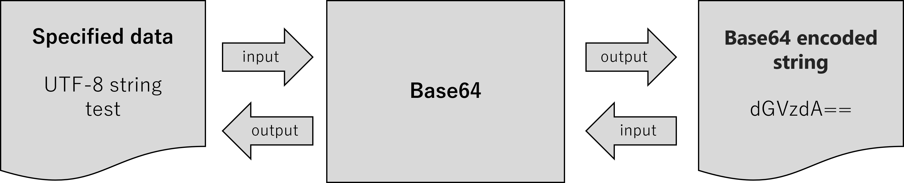
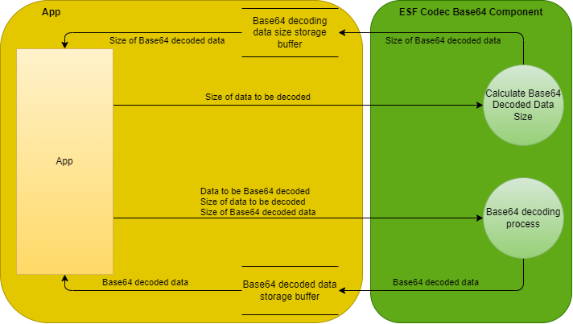

= AITRIOS Base64機能仕様書
:sectnums:
:sectnumlevels: 3
:chapter-label:
:revnumber: 0.1.4
:toc:
:toc-title: 目次
:toclevels: 3
:lang: ja
:xrefstyle: short
:figure-caption: Figure
:table-caption: Table
:section-refsig:
:experimental:
ifdef::env-github[:mermaid_block: source,mermaid,subs="attributes"]
ifndef::env-github[:mermaid_block: mermaid,subs="attributes"]
ifdef::env-github,env-vscode[:mermaid_break: break]
ifndef::env-github,env-vscode[:mermaid_break: opt]
ifdef::env-github,env-vscode[:mermaid_critical: critical]
ifndef::env-github,env-vscode[:mermaid_critical: opt]
ifdef::env-github[:mermaid_br: pass:p[&lt;br&gt;]]
ifndef::env-github[:mermaid_br: pass:p[ ]]

== 目的と適用範囲

本書はAITRIOSのESF内部モジュールであるCodecのBase64機能を定義します。
T3S3のバージョンXXに適用されます。

<<<

== 用語
      [残件]機能仕様書の説明書きに登場するESFやESF内部の各モジュール名(Codec)については、
      共通のものができ次第差し替え予定です。

=== ESF
ESF(AITRIOS Edge Software Framework) +

* 各種アプリから実行可能なAITRIOS基準のAPIを持つレイヤです。
* 基本的にはOS、チップ等の変更影響を受けません。
* アプリの機能の根幹となるため、SSSが管理します。
* ブロック単位で分離することで、センサ等を変更する際の影響を極力小さくします。

=== Codec
ESFの内部モジュールです。 +
以下の汎用外部ライブラリの機能を提供します。

** JPEG
** QRコード読み取り
** Base64

=== Base64
Base64(Base64 Data Encoding)とは、データをBase64文字列に変換するエンコード方式です。 +
主に、以下の2つの機能に対応します。

* 通常のBase64エンコード。 +
https://datatracker.ietf.org/doc/html/rfc4648#section-4[参考 : RFC4648 4.Base 64 Encoding]
* URLやファイル名に使用可能な文字列に対応したBase64エンコード。(URLセーフまたはファイルセーフ) +
https://datatracker.ietf.org/doc/html/rfc4648#section-5[参考 : RFC4648 5.Base 64 Encoding with URL and Filename Safe Alphabet]

<<<

[#_ComponentExp]
== コンポーネントの説明
=== コンポーネントの概要
Base64とは、世の中にある様々な文字コード(マルチバイト文字列)やバイナリデータをテキスト形式に変換する手法の1つです。 +
テキスト形式はASCII形式です。 +
主に、テキスト形式しか扱えないアプリケーションやプログラム、データを伝送するために用いられます。 +
Base64では、0から63までの64種類の6ビットデータを、7ビット範囲の文字列に置換します。 +
概要図では、例として以下のBase64エンコード・デコード処理を示しています。

* Base64エンコードによる「UTF-8」の文字列「test」をBase64エンコード文字列「dGVzdA==」への変換
* Base64デコードによるBase64エンコード文字列「dGVzdA==」から「UTF-8」文字列「test」への復元

.概要図

[#_Component0]
==== コンポーネントの処理 (Base64変換規則)
本書で使用するBase64は、通常のBase64の文字を使用します。 +
Base64文字、変換規則については、
https://datatracker.ietf.org/doc/html/rfc4648#section-4[RFC4648 Table 1: The Base 64 Alphabet]
を参照ください。 +

URLセーフまたはファイルセーフBase64では、URLやファイル名に使用可能な文字を使います。 +
通常のBase64で使用されている + / の代わりに、 - _ を使用します。 +
URLセーフまたはファイルセーフBase64文字、変換規則については、
https://datatracker.ietf.org/doc/html/rfc4648#section-5[RFC4648 Table 2: The "URL and Filename safe" Base 64 Alphabet]
を参照ください。 +
尚、バージョンXXXでは、URLセーフまたはファイルセーフBase64には対応していません。

[#_Component1]
==== コンポーネントの処理 (Base64エンコード)
[#_Component1_1]
===== Base64エンコードの基本処理
Base64エンコードは、24ビットのデータを1つの集まりとして扱います。 +
この集まりを6ビットごとに4つのデータに分けます。 +
4つの6ビットデータは<<#_Component0, RFC4648のBase64変換規則>>に基づいて、4文字(ASCII)に変換されます。 +

[#_Component1_2]
===== パディング文字について
3の倍数以外のサイズのデータをBase64エンコードする際に、4文字に満たない場合が生じます。 +
この場合、パディング文字 = 記号を付与し、必ず4文字に変換します。

[#_Component1_3]
===== データを分割してBase64エンコードする場合
大きいデータを扱う場合など、データを分割してBase64エンコードを行う際は3の倍数でデータを分割してください。 +
3の倍数以外で分割した場合、分割エンコード末尾にパディングが付与され、正常にデコードできない可能性があります。

<<<

=== コンポーネントの詳細説明
例として、AppでBase64エンコード・デコードを行う場合のデータフロー図を示します。

* Base64エンコード
  ** Base64エンコード文字列サイズを取得
  ** Base64エンコード文字列を取得

.データフロー図(Base64エンコード)

* Base64デコード
  ** Base64デコードデータサイズを取得
  ** Base64デコードデータを取得

.データフロー図(Base64デコード)

<<<

=== 状態遷移
Base64では状態遷移はありません。

<<<

=== コンポーネントの機能一覧
<<#_TableFunction>>に機能の一覧を示します。

[#_TableFunction]
.機能一覧
[width="100%", cols="30%,60%,10%",options="header"]
|===
|機能名 |概要  |節番号
|Base64エンコード処理
|Base64エンコード処理を行います。
|<<#_Function1, 3.5.1>>

|Base64デコード処理
|Base64デコード処理を行います。
|<<#_Function2, 3.5.2>>

|Base64エンコード処理 +
(URLセーフまたはファイルセーフ)
|URLまたはファイル名に対応したBase64エンコード処理を行います。 +
(バージョンXXでは非対応)
|<<#_Function3, 3.5.3>>

|Base64デコード処理 +
(URLセーフまたはファイルセーフ)
|URLまたはファイル名に対応したBase64デコード処理を行います。 +
(バージョンXXでは非対応)
|<<#_Function4, 3.5.4>>

|Base64エンコード文字列サイズ計算
|Base64エンコード文字列サイズを計算します。
|<<#_Function5, 3.5.5>>

|Base64デコードデータサイズ計算
|Base64デコードデータサイズを計算します。
|<<#_Function6, 3.5.6>>

|Base64エンコード処理 +
(FileIO対応)
|MemoryManager FileIOハンドルを使用したLheap領域からのエンコード元データ入力、Lheap領域へのエンコードデータ出力に対応したBase64エンコード処理を行います。
|<<#_Function7, 3.5.7>>

|Base64エンコード処理 +
(LargeHeap領域使用)
|MemoryManagerのLargeHeap領域を使用したLheap領域からのエンコード元データ入力、Lheap領域へのエンコードデータ出力に対応したBase64エンコード処理を行います。
|<<#_Function8, 3.5.8>>
|===

<<<

=== コンポーネントの機能説明
[#_Function1]
==== Base64エンコード処理
* 機能概要 +
  Base64エンコード処理を行います。
* 前提条件 +
  特にありません。
* 機能詳細
    ** 詳細挙動 +
       Base64エンコード対象データをBase64文字列に変換します。 +
    ** エラー時の挙動、復帰方法 +
       エラー時はエンコード処理を実施しません。 +
       システム状態に影響しないので復旧処理は不要です。

[#_Function2]
==== Base64デコード処理
* 機能概要 +
  Base64デコード処理を行います。
* 前提条件 +
   特にありません。
* 機能詳細
    ** 詳細挙動 +
       Base64文字列を元のデータへ復元します。
    ** エラー時の挙動、復帰方法 +
       エラー時は途中までデコードされている可能性があるため、デコード結果を参照しないでください。 +
       システム状態には影響しないので復旧処理は不要です。

[#_Function3]
==== Base64エンコード処理(URLセーフまたはファイルセーフ)
* 機能概要 +
  URLセーフまたはファイルセーフBase64エンコード処理を行います。(バージョンXXでは非対応)
* 前提条件 +
  特にありません。
* 機能詳細
    ** 詳細挙動 +
       URLまたはファイル名の許容文字に対応したBase64エンコード処理を行います。
    ** エラー時の挙動、復帰方法 +
       エラー時はエンコード処理を実施しません。 +
       システム状態に影響しないので復旧処理は不要です。

[#_Function4]
==== Base64デコード処理(URLセーフまたはファイルセーフ)
* 機能概要 +
  URLセーフまたはファイルセーフBase64デコード処理を行います。(バージョンXXでは非対応)
* 前提条件 +
  特にありません。
* 機能詳細
    ** 詳細挙動 +
       URLまたはファイル名の許容文字に対応したBase64デコード処理を行います。
    ** エラー時の挙動、復帰方法 +
       エラー時は途中までデコードされている可能性があるため、デコード結果を参照しないでください。 +
       システム状態には影響しないので復旧処理は不要です。

[#_Function5]
==== Base64エンコード文字列サイズ計算
* 機能概要 +
  Base64エンコード文字列サイズを計算します。
* 前提条件 +
  特にありません。
* 機能詳細
    ** 詳細挙動 +
       Base64エンコード対象のデータサイズから、Base64エンコード文字列サイズを計算します。
    ** エラー時の挙動、復帰方法 +
       エラー時はサイズ計算を実施しません。 +
       システム状態に影響しないので復旧処理は不要です。

[#_Function6]
==== Base64デコードデータサイズ計算
* 機能概要 +
  Base64デコードデータサイズを計算します。
* 前提条件 +
  特にありません。
* 機能詳細
    ** 詳細挙動 +
       Base64デコード対象データサイズから、元のデータサイズを計算します。
    ** エラー時の挙動、復帰方法 +
       エラー時はサイズ計算を実施しません。 +
       システム状態に影響しないので復旧処理は不要です。

[#_Function7]
==== Base64エンコード処理(FileIO対応)
* 機能概要 +
  MemoryManager FileIOハンドルを使用したLheap領域からのエンコード元データ入力、Lheap領域へのエンコードデータ出力に対応したBase64エンコード処理を行います。
* 前提条件 +
  FileIO, Lheapが使用できるデバイスであること。
* 機能詳細
    ** 詳細挙動 +
       FileIOを使用したLheap領域からのエンコード元データ入力、Lheap領域へのエンコードデータ出力に対応したBase64エンコード処理を行います。 +
       FileIOアクセスにはMemoryManager機能を使用します。
    ** エラー時の挙動、復帰方法 +
       分割エンコードの途中でエラーとなった場合はそこまでのエンコード結果が出力先FileIOに書き込まれる場合があります。 +
       システム状態に影響しないので復旧処理は不要です。

[#_Function8]
==== Base64エンコード処理(LargeHeap領域使用)
* 機能概要 +
  MemoryManagerのLargeHeap領域を使用したBase64エンコード処理を行います。
* 前提条件 +
  Lheapが使用できるデバイスであること。
* 機能詳細
    ** 詳細挙動 +
       Map機能サポート状況により、異なる手順でBase64エンコード処理を行います。
       *** Map機能サポート +
        MemoryManagerのMapアクセス機能を使用して、Lheap領域からのエンコード元データ入力、Lheap領域へのエンコードデータ出力に対応したBase64エンコード処理を行います。
       *** Map機能非サポート +
        MemoryManagerのFileIOアクセス機能を使用して、Lheap領域からのエンコード元データ入力、Lheap領域へのエンコードデータ出力に対応したBase64エンコード処理を行います。
    ** エラー時の挙動、復帰方法 +
       Map機能非サポートの場合は、分割エンコードの途中でエラーとなった場合はそこまでのエンコード結果が出力先FileIOに書き込まれる場合があります。 +
       システム状態に影響しないので復旧処理は不要です。

<<<

=== コンポーネントの非機能要件一覧

<<#_TableNonFunction>>に非機能要件の一覧を示します。

[#_TableNonFunction]
.非機能要件一覧
[width="100%", cols="30%,55%,15%",options="header"]
|===
|機能名 |概要  |節番号
|Stack最大使用量
|使用するStack領域の最大サイズを示します。
|<<#_NonFunction1, 3.7.1>>

|ヒープ最大使用量
|使用するヒープ領域の最大サイズを示します。
|<<#_NonFunction2, 3.7.2>>

|staticメモリ最大使用量
|staticに確保するメモリの最大サイズを示します。
|<<#_NonFunction3, 3.7.3>>

|スレッド使用数
|使用するスレッド数を示します。
|<<#_NonFunction4, 3.7.4>>
|===

<<<

=== コンポーネントの非機能要件説明
[#_NonFunction1]
==== Stack最大使用量
Stackは 512 byte使用します。

[#_NonFunction2]
==== ヒープ最大使用量
ヒープ領域は最大 7 Kbyteを使用します。

[#_NonFunction3]
==== staticメモリ最大使用量
staticメモリは 65 byte使用します。

[#_NonFunction4]
==== スレッドの使用数
スレッドは未使用です。

<<<

== API仕様
=== 定義一覧
==== データ型一覧
<<#_TableDataType>>にデータ型の一覧を示します。

[#_TableDataType]
.データ型一覧
[width="100%", cols="30%,55%,15%",options="header"]
|===
|データ型名 |概要  |節番号
|EsfCodecBase64ResultEnum
|Base64のAPIの実行結果を定義する列挙型です。
|<<#_SampleEnum>>

|ESF_BASE64_MAX_SIZE
|Base64で使用する最大入力サイズ定義です。
|<<#_SampleDefineBase64MaxSize>>
|===

==== API一覧
<<#_TableAPI>>にAPIの一覧を示します。

[#_TableAPI]
.API一覧
[width="100%", cols="30%,60%,10%",options="header"]
|===
|API名 |概要  |節番号
|EsfCodecBase64Encode
|Base64エンコードを行います。
|<<#_SampleFunction1, 4.3.1>>

|EsfCodecBase64Decode
|Base64デコードを行います。
|<<#_SampleFunction2, 4.3.2>>

|EsfCodecBase64UrlEncode
|URLセーフまたはファイルセーフに対応したBase64エンコードを行います。 +
(バージョンXXでは非対応)
|<<#_SampleFunction3, 4.3.3>>

|EsfCodecBase64UrlDecode
|URLセーフまたはファイルセーフに対応したBase64デコードを行います。 +
(バージョンXXでは非対応)
|<<#_SampleFunction4, 4.3.4>>

|EsfCodecBase64GetEncodeSize
|Base64エンコード文字列サイズを取得します。
|<<#_SampleFunction5, 4.3.5>>

|EsfCodecBase64GetDecodeSize
|Base64デコードデータサイズを取得します。
|<<#_SampleFunction6, 4.3.6>>

|EsfCodecBase64EncodeFileIO
|FileIOアクセスに対応したBase64エンコードを行います。
|<<#_SampleFunction7, 4.3.7>>

|EsfCodecBase64EncodeHandle
|MemoryManagerのLargeHeap領域を使用したBase64エンコード処理を行います。
|<<#_SampleFunction8, 4.3.8>>
|===

<<<

=== データ型定義
[#_SampleEnum]
==== EsfCodecBase64ResultEnum
Base64のAPIの実行結果を定義する列挙型です。

* *書式*

[source, C]
....
typedef enum {
    kEsfCodecBase64ResultSuccess = 0,
    kEsfCodecBase64ResultNullParam,
    kEsfCodecBase64ResultOutOfRange,
    kEsfCodecBase64ResultExceedsOutBuffer,
    kEsfCodecBase64ResultIllegalInSize,
    kEsfCodecBase64ResultIllegalInData,
    kEsfCodecBase64ResultInternalError,
    kEsfCodecBase64ResultExternalError,
    kEsfCodecBase64NotSupported
} EsfCodecBase64ResultEnum;
....

* *値*

      [残件]AITRIOS共通エラーコード決定後にマッピングを行います。

[#_TableReturnValue]
.EsfCodecBase64ResultEnumの値の説明
[width="100%", cols="33%,50%,17%",options="header"]
|===
|メンバ名  |説明 |AITRIOS共通エラーコード
|kEsfCodecBase64ResultSuccess
|成功。
|#xxx

|kEsfCodecBase64ResultNullParam
|引数はNULポインタです。
|#xxx

|kEsfCodecBase64ResultOutOfRange
|設定された値は、範囲外の値です。
|#xxx

|kEsfCodecBase64ResultExceedsOutBuffer
|設定されたサイズでは、処理結果が出力バッファ領域を超えてしまいます。
|#xxx

|kEsfCodecBase64ResultIllegalInSize
|設定された入力サイズでは、処理を実行できません。
|#xxx

|kEsfCodecBase64ResultIllegalInData
|設定された入力データでは、処理を実行できません。
|#xxx

|kEsfCodecBase64ResultInternalError
|内部処理エラーが発生しています。
|#xxx

|kEsfCodecBase64ResultExternalError
|外部処理エラーが発生しています。
|#xxx

|kEsfCodecBase64NotSupported
|本デバイスでは未サポートのAPIです。
|#xxx
|===

[#_SampleDefineBase64MaxSize]
==== ESF_BASE64_MAX_SIZE
Base64で使用する最大入力サイズ定義です。 +
Base64の入力サイズのsize_t型の最大値とOSSの入力サイズのunsigned int型の最大値が不一致となる環境の場合、unsigned int型の最大値を採用します。
また、今回使用するOSS内の処理で入力サイズを3倍する処理がありオーバーフローを防ぐため上記で採用した型の最大値を3で除した値をBase64で使用する最大入力サイズとします。

* *書式*

[source, C]
....
#if SIZE_MAX > UINT_MAX
#define ESF_BASE64_MAX_SIZE (UINT_MAX / 3)
#else
#define ESF_BASE64_MAX_SIZE (SIZE_MAX / 3)
#endif
....

<<<

=== API定義

[#_SampleFunction1]
==== EsfCodecBase64Encode
* *機能* +
+
Base64エンコードを行います。

* *書式* +
+
``** EsfCodecBase64ResultEnum EsfCodecBase64Encode( const uint8_t* in, size_t in_size, char* out, size_t* out_size )**``

* *引数の説明* +
+
**``[IN] const uint8_t* in``**::
Base64エンコード対象のデータ格納バッファです。NULLを指定してはいけません。

**``[IN] size_t in_size``**::
Base64エンコード対象のデータサイズ(byte)の値です。 +
** 1 以上、 最大値「(((ESF_BASE64_MAX_SIZE - 1) / 4) * 4 + 1 - 1) * 3 / 4」 以下の整数を指定してください。 +
最大値については、<<#_SampleFunction6_1, Base64デコードデータサイズの最大値について>>を参照ください。
** Base64エンコード結果格納バッファの上限を超えないデータサイズを指定してください。 +
「([IN] ``**out_size**`` - 1(終端文字)) * 3 / 4」以下の整数を指定してください。

**``[OUT] char* out``**::
Base64エンコード結果を格納するバッファです。NULLを指定してはいけません。 +
バッファサイズについては、 引数の説明[IN] ``**out_size**``を参照ください。 +

**``[IN, OUT] size_t* out_size``**::
** [IN] ``**out**``のバッファサイズ(byte)の値です。NULLを指定してはいけません。 +
        *** 1 以上、ESF_BASE64_MAX_SIZE 以下の整数を指定してください。
        *** Base64エンコード結果が格納バッファを超えないように、バッファサイズを指定してください。 +
        <<#_SampleFunction5, EsfCodecBase64GetEncodeSize>>以上の整数を指定してください、
        「(``**in_size**`` * 4 / 3) + 終端文字」で算出した整数を指定することも可能です。

** [OUT] Base64エンコード結果に終端文字を含めた文字列サイズ(byte)を設定します。

* *戻り値* +
+
実行結果に応じて<<#_TableReturnValue, EsfCodecBase64ResultEnum>>のいずれかの値を返します。

* *説明* +
``**in**``で指定されたエンコード対象データ格納バッファの
``**in_size**``(byte)までを読み出し、Base64エンコードを行います。 +
エンコード結果は、[IN] ``**out_size**``(byte)のエンコード結果格納バッファ``**out**``に格納し、終端文字('\0')を付与します。 +
[OUT] ``**out_size**``には、終端文字を含めたエンコード結果の文字列サイズを設定します。 +
本APIの実行結果でkEsfCodecBase64ResultSuccess以外を返した場合は、``**out**``、``**out_size**``は変更されません。

NOTE: データを分割してエンコードする場合は、<<#_Component1_3, データを分割してBase64エンコードする場合>>を参照ください。

** 動作情報
*** 同時に呼び出し可能。
*** 複数のスレッドからの呼び出し可能。
*** 複数のタスクからの値呼び出し可能。
*** API内部でブロッキングしません。
*** 戻り値はkEsfCodecBase64ResultSuccessを返します。

** エラー共通動作
*** エラー時の挙動 +
    エンコード処理を実施しません。
*** エラーの際のOUT引数の状態 +
    エンコード処理を実施しないため、``**out**``、``**out_size**``には設定しません。

** 各エラー動作

[#_ErrorTable1]
.エラー一覧
[width="100%", cols="10%,61%,30%",options="header"]
|===
|エラーの際の戻り値|エラー内容|エラーとなる条件（事前条件など）
|kEsfCodecBase64ResultNullParam
|Base64エンコード対象のデータ格納バッファを設定していないため、Base64エンコードを実行できません。
|``**in**``の設定はNULLポインタです。

|kEsfCodecBase64ResultNullParam
|Base64エンコード結果を格納するバッファを設定していないため、Base64エンコード文字列を格納できません。
|``**out**``の設定はNULLポインタです。

|kEsfCodecBase64ResultOutOfRange
|Base64エンコード対象のデータサイズの値は範囲外のため、Base64エンコードを実行できません。
|``**in_size**``の値は 1 未満、または 最大値 を超えています。

|kEsfCodecBase64ResultOutOfRange
|Base64エンコード結果を格納するバッファサイズの値は範囲外のため、Base64エンコードを実行できません。
|[IN] ``**out_size**``の値は 0 以下です。

|kEsfCodecBase64ResultExceedsOutBuffer
|設定されたBase64エンコード対象のデータサイズでは、Base64エンコード結果を格納するバッファ領域を超えてしまい、
Base64エンコードを実行できません。
|``**in_size**``は「([IN] ``**out_size**`` - 1(終端文字)) * 3 / 4」の値を超えています。
|===

[#_SampleFunction2]
==== EsfCodecBase64Decode
* *機能* +
+
Base64デコードを行います。

* *書式* +
+
``** EsfCodecBase64ResultEnum EsfCodecBase64Decode( const char* in, size_t in_size, uint8_t* out, size_t* out_size )**``

* *引数の説明* +
+
**``[IN] const char* in``**::
Base64デコード対象のデータ格納バッファです。NULLを指定してはいけません。

**``[IN] size_t in_size``**::
Base64デコード対象のデータサイズ(byte)の値です。終端文字はサイズに含みません。 +
** 4 以上、 最大値「(ESF_BASE64_MAX_SIZE / 4) * 4」 以下の整数を指定できます。 +
最大値については、<<#_SampleFunction5_1, Base64エンコード文字列サイズの最大値について>>を参照ください。
** Base64デコード結果格納バッファの上限を超えないデータサイズを指定してください。 +
「[IN] ``**out_size**`` * 4 / 3」以下の整数を指定できます。
** 4の倍数の値を指定してください。

**``[OUT] uint8_t* out``**::
Base64デコード結果を格納するバッファです。NULLを指定してはいけません。 +
バッファサイズについては、 引数の説明[IN] ``**out_size**``を参照ください。

**``[IN, OUT] size_t* out_size``**::
** [IN] ``**out**``のバッファのサイズ(byte)の値です。NULLを指定してはいけません。 +
        *** 1 以上、ESF_BASE64_MAX_SIZE 以下の整数を指定してください。
        *** Base64デコード結果格納バッファを超えないように、バッファサイズを指定してください。 +
        <<#_SampleFunction6, EsfCodecBase64GetDecodeSize>>以上の整数を指定してください、
        「``**in_size**`` * 3 / 4」で算出した整数を指定することも可能です。

** [OUT] Base64デコード結果のデータサイズ(byte)を設定します。

* *戻り値* +
+
実行結果に応じて<<#_TableReturnValue, EsfCodecBase64ResultEnum>>のいずれかの値を返します。

* *説明* +
``**in**``で指定されたデコード対象データ格納バッファの
``**in_size**``(byte)までを読み出し、Base64デコードを行います。 +
デコード結果は、[IN] ``**out_size**``(byte)のデコード結果格納バッファ``**out**``に格納します。 +
[OUT] ``**out_size**``には、デコード結果のデータサイズを設定します。 +

** 動作情報
*** 同時に呼び出し可能。
*** 複数のスレッドからの呼び出し可能。
*** 複数のタスクからの値呼び出し可能。
*** API内部でブロッキングしません。
*** 戻り値はkEsfCodecBase64ResultSuccessを返します。

** エラー共通動作
*** エラー時の挙動 +
    エラー時は途中までデコードされている可能性があるため、デコード結果を参照しないでください。
*** エラーの際のOUT引数の状態 +
    ``**out**``、``**out_size**``には、途中までのデコード処理結果が設定されている可能性があります。

** 各エラー動作

[#_ErrorTable2]
.エラー一覧
[width="100%", cols="10%,61%,30%",options="header"]
|===
|エラーの際の戻り値|エラー内容|エラーとなる条件（事前条件など）
|kEsfCodecBase64ResultNullParam
|Base64デコード対象のデータ格納バッファを設定していないため、Base64デコードを実行できません。
|``**in**``はNULLポインタです。

|kEsfCodecBase64ResultNullParam
|Base64デコード結果を格納するバッファを設定していないため、Base64デコードデータを格納できません。
|``**out**``はNULLポインタです。

|kEsfCodecBase64ResultOutOfRange
|Base64デコード対象のデータサイズの値は範囲外のため、Base64デコードが実行できません。
|``**in_size**``の値は 4 未満、または 最大値 を超えています。

|kEsfCodecBase64ResultOutOfRange
|Base64デコード結果を格納するバッファサイズの値は範囲外のため、Base64デコードが実行できません。
|[IN] ``**out_size**``の値は 0 以下です。

|kEsfCodecBase64ResultExceedsOutBuffer
|設定されたBase64デコード対象のデータサイズサイズでは、Base64デコード結果を格納するバッファ領域を超えてしまい、
Base64デコードが実行できません。
|``**in_size**``は「[IN] ``**out_size**`` * 4 / 3」の値を超えています。

|kEsfCodecBase64ResultIllegalInSize
|Base64デコード対象のデータサイズは4文字単位ではないため、Base64デコードが実行できません。
|``**in_size**``は4の倍数以外の値です。

|kEsfCodecBase64ResultIllegalInData
|N番目の入力文字はBase64の文字ではないため、 Base64デコードが実行できません。
|``**in**``[N]はBase64に該当しない文字です。
|===

[#_SampleFunction3]
==== EsfCodecBase64UrlEncode
* *機能* +
+
URLセーフまたはファイルセーフに対応したBase64エンコードを行います。(バージョンXXでは非対応)

* *書式* +
+
``** EsfCodecBase64ResultEnum EsfCodecBase64UrlEncode( const uint8_t* in, size_t in_size, char* out, size_t* out_size )**``

* *引数の説明* +
+
**``[IN] const uint8_t* in``**::
Base64エンコード対象のデータ格納バッファです。NULLを指定してはいけません。

**``[IN] size_t in_size``**::
Base64エンコード対象のデータサイズ(byte)の値です。 +
** Base64エンコード結果格納バッファの上限を超えないデータサイズを指定してください。

**``[OUT] char* out``**::
Base64エンコード結果を格納するバッファです。NULLを指定してはいけません。 +
バッファサイズについては、 引数の説明[IN] ``**out_size**``を参照ください。 +

**``[IN, OUT] size_t* out_size``**::
** [IN] ``**out**``のバッファサイズ(byte)の値です。 +
        *** 1 以上、ESF_BASE64_MAX_SIZE 以下の整数を指定してください。
        *** Base64エンコード結果が格納バッファを超えないように、バッファサイズを指定してください。

** [OUT] Base64エンコード結果に終端文字を含めた文字列サイズ(byte)を設定します。

* *戻り値* +
+
実行結果に応じて<<#_TableReturnValue, EsfCodecBase64ResultEnum>>のいずれかの値を返します。

* *説明* +
バージョンXXでは非対応です。

NOTE: データを分割してエンコードする場合は、<<#_Component1_3, データを分割してBase64エンコードする場合>>を参照ください。

[#_SampleFunction4]
==== EsfCodecBase64UrlDecode
* *機能* +
+
URLセーフまたはファイルセーフに対応したBase64デコードを行います。(バージョンXXでは非対応)

* *書式* +
+
``** EsfCodecBase64ResultEnum EsfCodecBase64UrlDecode( const char* in, size_t in_size, uint8_t* out, size_t* out_size )**``

* *引数の説明* +
+
**``[IN] const char* in``**::
Base64デコード対象のデータ格納バッファです。NULLを指定してはいけません。

**``[IN] size_t in_size``**::
Base64デコード対象のデータサイズ(byte)の値です。終端文字はサイズに含みません。 +
** Base64デコード結果格納バッファの上限を超えないデータサイズを指定してください。

**``[OUT] uint8_t* out``**::
Base64デコード結果を格納するバッファです。NULLを指定してはいけません。 +
バッファサイズについては、 引数の説明[IN] ``**out_size**``を参照ください。

**``[IN, OUT] size_t* out_size``**::
** [IN] ``**out**``のバッファのサイズ(byte)の値です。 +
        *** 1 以上、ESF_BASE64_MAX_SIZE 以下の整数を指定してください。
        *** Base64デコード結果格納バッファを超えないように、バッファサイズを指定してください。

** [OUT] Base64デコード結果のデータサイズ(byte)を設定します。

* *戻り値* +
+
実行結果に応じて<<#_TableReturnValue, EsfCodecBase64ResultEnum>>のいずれかの値を返します。

* *説明* +
バージョンXXでは非対応です。

[#_SampleFunction5]
==== EsfCodecBase64GetEncodeSize
* *機能* +
+
Base64エンコード文字列サイズを取得します。

* *書式* +
+
``** size_t EsfCodecBase64GetEncodeSize( size_t in_size )**``

* *引数の説明* +
+
**``[IN] size_t in_size``**::
Base64エンコード対象のデータサイズ(byte)の値です。 +
** 1 以上 最大値「(((ESF_BASE64_MAX_SIZE - 1) / 4) * 4 + 1 - 1) * 3 / 4」 以下の整数を指定してください。 +
最大値については、<<#_SampleFunction6_1, Base64デコードデータサイズの最大値について>>を参照ください。

* *戻り値* +
+
Base64エンコード文字列サイズの値を返します。 +
Base64エンコード対象のデータサイズが範囲外の場合、0 を返します。

* *説明* +
``**in_size**``にBase64エンコード対象のデータサイズ(byte)の値を指定し、
Base64エンコードサイズの計算処理を行います。 +
その結果に終端文字を含めた文字列サイズを戻り値で返します。 +
[#_SampleFunction5_1]
** Base64エンコード文字列サイズの最大値について +
Base64エンコード文字列サイズとして許容される最大値は、
1 から ESF_BASE64_MAX_SIZE までの整数で「4の倍数 + 終端文字」となる値が該当します。 +
式で表すと以下のようになります。 +

  Base64エンコード文字列サイズの最大値 = ((ESF_BASE64_MAX_SIZE - 1(終端文字)) / 4) * 4 + 1(終端文字)

** 動作情報
*** 同時に呼び出し可能。
*** 複数のスレッドからの呼び出し可能。
*** 複数のタスクからの値呼び出し可能。
*** API内部でブロッキングしません。
*** 戻り値はBase64エンコード文字列サイズの値を返します。

** エラー共通動作
*** エラー時の挙動 +
    Base64エンコード文字列のサイズ計算を実施しません。

** 各エラー動作

[#_ErrorTable5]
.エラー一覧
[width="100%", cols="10%,61%,30%",options="header"]
|===
|エラーの際の戻り値|エラー内容|エラーとなる条件（事前条件など）
|0
|Base64エンコード対象のデータサイズは範囲外のため、Base64エンコード文字列サイズを取得できません。
|``**in_size**``の値は 1 未満、または 最大値 を超えています。
|===

[#_SampleFunction6]
==== EsfCodecBase64GetDecodeSize
* *機能* +
+
Base64デコードデータサイズを取得します。

* *書式* +
+
``** size_t EsfCodecBase64GetDecodeSize( size_t in_size )**``

* *引数の説明* +
+
**``[IN] size_t in_size``**::
Base64デコード対象のデータサイズ(byte)です。終端文字はサイズに含みません。 +
** 2 以上 最大値 ESF_BASE64_MAX_SIZE 以下の整数を指定してください。

* *戻り値* +
+
Base64デコードデータサイズの値を返します。 +
Base64デコード対象のデータサイズの値が範囲外の場合、0 を返します。

* *説明* +
``**in_size**``にBase64デコード対象のデータサイズ(byte)の値を指定し、
Base64デコードデータサイズの計算処理を行います。 +
その結果を戻り値で返します。 +
[#_SampleFunction6_1]
** 本APIでは正確なBase64デコードデータサイズは算出できません +
Base64デコードではパディング文字がある場合は、必ず除外してデコードします。 +
しかし、本APIではパディング文字数はわからないため、Base64デコードサイズから除外できません。 +
よって、実際のBase64デコードデータサイズは、本APIで取得したサイズよりパディング文字数(1 or 2)少なくなる場合があります。 +
尚、実際のBase64デコードデータサイズは、<<#_SampleFunction2, Base64デコード処理>>の[OUT] ``**out_size**``で取得可能です。
** Base64デコードデータサイズの最大値について +
Base64デコードデータの最大サイズは、Base64エンコード文字列の最大サイズから終端文字を除いた整数値から算出します。 +
Base64エンコード文字列サイズの最大値については、<<#_SampleFunction5_1, Base64エンコード文字列サイズの最大値について>>を参照ください。 +
式で表すと以下のようになります。 +

    Base64デコードデータの最大サイズ  = (Base64エンコード文字列最大値 - 終端文字) * 3 / 4

    Base64デコードデータの最大サイズ  = (((ESF_BASE64_MAX_SIZE - 1) / 4) * 4 + 1 - 1) * 3 / 4

** 動作情報
*** 同時に呼び出し可能。
*** 複数のスレッドからの呼び出し可能。
*** 複数のタスクからの値呼び出し可能。
*** API内部でブロッキングしません。
*** 戻り値はBase64デコードデータサイズの値を返します。

** エラー共通動作
*** エラー時の挙動 +
    Base64デコードデータのサイズ計算を実施しません。

** 各エラー動作

[#_ErrorTable6]
.エラー一覧
[width="100%", cols="10%,61%,30%",options="header"]
|===
|エラーの際の戻り値|エラー内容|エラーとなる条件（事前条件など）
|0
|Base64デコード対象のデータサイズの値は範囲外のため、Base64デコードデータサイズを取得できません。
|``**in_size**``の値は 5 未満、または 最大値 を超えています。
|===

[#_SampleFunction7]
==== EsfCodecBase64EncodeFileIO
* *機能* +
+
FileIOアクセスに対応したBase64エンコードを行います。

* *書式* +
+
``** EsfCodecBase64ResultEnum EsfCodecBase64EncodeFileIO(
    EsfMemoryManagerHandle in_handle, size_t in_size,
    EsfMemoryManagerHandle out_handle, size_t* out_size)**``

* *引数の説明* +
+
**``[IN] EsfMemoryManagerHandle in_handle``**::
Base64エンコード対象のデータが格納されているMemoryManagerのFileIOハンドルです。

**``[IN] size_t in_size``**::
Base64エンコード対象のデータサイズ(byte)の値です。 +
** 1 以上、 最大値「(((ESF_BASE64_MAX_SIZE - 1) / 4) * 4 + 1 - 1) * 3 / 4」 以下の整数を指定してください。 +
最大値については、<<#_SampleFunction6_1, Base64デコードデータサイズの最大値について>>を参照ください。 +
** Base64エンコード結果格納バッファの上限を超えないデータサイズを指定してください。 +
「([IN] ``**out_size**`` - 1(終端文字)) * 3 / 4」以下の整数を指定してください。

**``[OUT] EsfMemoryManagerHandle out_handle``**::
Base64エンコード結果を格納するMemoryManagerのFileIOハンドルです。 +

**``[IN, OUT] size_t* out_size``**::
** [IN] ``**out**``のバッファサイズ(byte)の値です。NULLを指定してはいけません。 +
        *** 1 以上、ESF_BASE64_MAX_SIZE 以下の整数を指定してください。
        *** Base64エンコード結果が格納バッファを超えないように、バッファサイズを指定してください。 +
        <<#_SampleFunction5, EsfCodecBase64GetEncodeSize>>以上の整数を指定してください、
        「(``**in_size**`` * 4 / 3) + 終端文字」で算出した整数を指定することも可能です。

** [OUT] Base64エンコード結果に終端文字を含めた文字列サイズ(byte)を設定します。

NOTE: in_handle, out_handleにはOpen, Seek済みのhandleを指定してください。Base64では指定されたhandleをそのまま指定サイズまでアクセスします。 +
      in_handleとout_handleのhandleは別のhandleを指定してください。

* *戻り値* +
+
実行結果に応じて<<#_TableReturnValue, EsfCodecBase64ResultEnum>>のいずれかの値を返します。

* *説明* +
``**in_handle**``で指定されたエンコード対象データ格納FileIOハンドルの``**in_size**``(byte)までを読み出し、Base64エンコードを行います。 +
エンコード結果は、エンコード結果格納FileIOハンドル**out_handle**に格納し終端文字('\0')を付与します。
[OUT] ``**out_size**``には、終端文字を含めたエンコード結果の文字列サイズを設定します。

** 動作情報
*** 排他制御をするため同時実行はできません。
*** 戻り値はkEsfCodecBase64ResultSuccessを返します。
*** エンコード処理実行後のFIleIOハンドルのSeek位置 +
    FileIO読み出し、書き込み操作により各ハンドルのSeek位置は変更されたまま返却します。

** エラー共通動作
*** エラー時の挙動 +
    エンコード処理を実施しません。
*** エラーの際のOUT引数の状態 +
    分割エンコード途中で失敗した場合、``**out_handle**``にそこまでのエンコード結果が書き込まれます。
    ``**out_size**``の操作は行いません。
*** エラーの際のFIleIOハンドルのSeek位置 +
    ``**in_handle**``, ``**out_handle**`` のFileIOハンドルのSeek位置は不定です。

** 各エラー動作

[#_ErrorTable7]
.エラー一覧
[width="100%", cols="10%,61%,30%",options="header"]
|===
|エラーの際の戻り値|エラー内容|エラーとなる条件（事前条件など）
|kEsfCodecBase64ResultNullParam
|Base64エンコード結果の文字列サイズを格納するポインタを設定していないため、Base64エンコードを実行できません。
|``**out_size**``の設定はNULLポインタです。

|kEsfCodecBase64ResultOutOfRange
|Base64エンコード対象のデータサイズの値は範囲外のため、Base64エンコードを実行できません。
|``**in_size**``の値は 1 未満、または 最大値 を超えています。

|kEsfCodecBase64ResultOutOfRange
|Base64エンコード結果を格納するバッファサイズの値は範囲外のため、Base64エンコードを実行できません。
|[IN] ``**out_size**``の値は 0 以下です。

|kEsfCodecBase64ResultExceedsOutBuffer
|設定されたBase64エンコード対象のデータサイズでは、Base64エンコード結果を格納するバッファ領域を超えてしまい、
Base64エンコードを実行できません。
|``**in_size**``は「([IN] ``**out_size**`` - 1(終端文字)) * 3 / 4」の値を超えています。

|kEsfCodecBase64ResultExternalError
|外部処理の実行に失敗したため、Base64エンコードを実行できません。
|MemoryManager、システムコール、標準ライブラリ、排他制御などの外部処理が失敗しています。

|kEsfCodecBase64NotSupported
|このデバイスでは本APIは未サポートのため、Base64エンコードを実行できません。
|FileIOに対応していないデバイスでAPIを使用しています。
|===

[#_SampleFunction8]
==== EsfCodecBase64EncodeHandle
* *機能* +
+
MemoryManagerのLargeHeap領域を使用したBase64エンコード処理を行います。

* *書式* +
+
``** EsfCodecBase64ResultEnum EsfCodecBase64EncodeHandle(
    EsfMemoryManagerHandle in_handle, size_t in_size,
    EsfMemoryManagerHandle out_handle, size_t* out_size)**``

* *引数の説明* +
+
**``[IN] EsfMemoryManagerHandle in_handle``**::
Base64エンコード対象のデータが格納されているMemoryManagerのハンドルです。 +
LargeHeap領域向けであるMemoryManagerのハンドルを指定してください。

**``[IN] size_t in_size``**::
Base64エンコード対象のデータサイズ(byte)の値です。 +
** 1 以上、 最大値「(((ESF_BASE64_MAX_SIZE - 1) / 4) * 4 + 1 - 1) * 3 / 4」 以下の整数を指定してください。 +
最大値については、<<#_SampleFunction6_1, Base64デコードデータサイズの最大値について>>を参照ください。 +
** Base64エンコード結果格納バッファの上限を超えないデータサイズを指定してください。 +
「([IN] ``**out_size**`` - 1(終端文字)) * 3 / 4」以下の整数を指定してください。

**``[OUT] EsfMemoryManagerHandle out_handle``**::
Base64エンコード結果を格納するMemoryManagerのハンドルです。 +

**``[IN, OUT] size_t* out_size``**::
** [IN] ``**out**``のバッファサイズ(byte)の値です。NULLを指定してはいけません。 +
        *** 1 以上、ESF_BASE64_MAX_SIZE 以下の整数を指定してください。
        *** Base64エンコード結果が格納バッファを超えないように、バッファサイズを指定してください。 +
        <<#_SampleFunction5, EsfCodecBase64GetEncodeSize>>以上の整数を指定してください、
        「(``**in_size**`` * 4 / 3) + 終端文字」で算出した整数を指定することも可能です。

** [OUT] Base64エンコード結果に終端文字を含めた文字列サイズ(byte)を設定します。

NOTE: in_handleとout_handleのhandleは別のhandleを指定してください。 +
      Base64では指定されたhandleをそのまま指定サイズまでアクセスします。

* *戻り値* +
+
実行結果に応じて<<#_TableReturnValue, EsfCodecBase64ResultEnum>>のいずれかの値を返します。

* *説明* +
``**in_handle**``で指定されたエンコード対象データを格納したMemoryManagerハンドルの``**in_size**``(byte)までを読み出し、Base64エンコードを行います。 +
エンコード結果は、MemoryManagerハンドル``**out_handle**``に格納し終端文字('\0')を付与します。
[OUT] ``**out_size**``には、終端文字を含めたエンコード結果の文字列サイズを設定します。

** 動作情報
*** 戻り値はkEsfCodecBase64ResultSuccessを返します。
*** Map機能非サポートの場合は、エンコード処理実行後の各ハンドルはClose状態で返却します。

** エラー共通動作
*** エラー時の挙動 +
    エンコード処理を実施しません。
*** エラーの際のOUT引数の状態 +
    Map機能非サポートの場合は、分割エンコード途中で失敗すると``**out_handle**``にそこまでのエンコード結果が書き込まれます。
    ``**out_size**``の操作は行いません。

** 各エラー動作

[#_ErrorTable8]
.エラー一覧
[width="100%", cols="10%,61%,30%",options="header"]
|===
|エラーの際の戻り値|エラー内容|エラーとなる条件（事前条件など）
|kEsfCodecBase64ResultNullParam
|Base64エンコード結果の文字列サイズを格納するポインタを設定していないため、Base64エンコードを実行できません。
|``**out_size**``の設定はNULLポインタです。

|kEsfCodecBase64ResultOutOfRange
|Base64エンコード対象のデータサイズの値は範囲外のため、Base64エンコードを実行できません。
|``**in_size**``の値は 1 未満、または 最大値 を超えています。

|kEsfCodecBase64ResultOutOfRange
|Base64エンコード結果を格納するバッファサイズの値は範囲外のため、Base64エンコードを実行できません。
|[IN] ``**out_size**``の値は 0 以下です。

|kEsfCodecBase64ResultExceedsOutBuffer
|設定されたBase64エンコード対象のデータサイズでは、Base64エンコード結果を格納するバッファ領域を超えてしまい、
Base64エンコードを実行できません。
|``**in_size**``は「([IN] ``**out_size**`` - 1(終端文字)) * 3 / 4」の値を超えています。

|kEsfCodecBase64ResultExternalError
|外部処理の実行に失敗したため、Base64エンコードを実行できません。
|MemoryManager、システムコール、標準ライブラリ、排他制御などの外部処理が失敗しています。

|kEsfCodecBase64NotSupported
|このデバイスでは本APIは未サポートのため、Base64エンコードを実行できません。
|``**in_handle**``または``**out_handle**``はDMA領域領域向け、WasmHeap領域向けのハンドルです。
|===

<<<

== API使用時の呼び出し例

各APIを使用する場合の呼び出し例を以下に示します。

.Base64エンコード
====

[source, C]
----
// Base64エンコード処理用のパラメータ
uint8_t in[3] = {0x61, 0x62, 0x63}; // Base64エンコード対象のデータ, この例では3byteのデータを設定します。
size_t in_size = sizeof(in); // Base64エンコード対象のデータサイズ(byte), この例で設定される値は「3」です。
char* out = NULL; // Base64エンコード結果の格納用バッファのポインタ
size_t out_size = 0; // Base64エンコードサイズ, この例では初期値を「0」で設定します
EsfCodecBase64ResultEnum base64_result = kEsfCodecBase64ResultOutOfRange; // Base64 API実行結果, 任意の初期値を設定します

// Base64エンコード文字列サイズを取得
out_size = EsfCodecBase64GetEncodeSize(in_size, &out_size);
if (out_size > 0) {
    // 成功した場合の処理を実行します。
    // out_size = 5 の結果を得られます。(エンコード文字列サイズ4 byte + 終端文字1 byte)
} else {
    // 各エラーに応じた処理を実行します。
    // out_sizeには結果は設定されないため、out_sizeは初期値「0」のままです。
}

// Base64エンコード結果の格納用バッファの設定
out = malloc(out_size); // Base64エンコード結果の格納用バッファをout_sizeサイズ分設定します
if (out != NULL) {
    // 成功した場合の処理を実行します。
} else {
    // エラー処理を実行します。
}

base64_result = EsfCodecBase64Encode(in, in_size, out, &out_size);
if (base64_result == kEsfCodecBase64ResultSuccess) {
    // 成功した場合の処理を実行します。
    // out[out_size] = {Y, W, J, j, \0} の処理結果を得られます。
    // out_size = 5 の結果を得られます。(エンコード文字列サイズ4 byte + 終端文字1 byte)
} else {
    // 各エラーに応じた処理を実行します。
    // outには処理結果は設定されないため、malloc実行後の状態のままです。
    // out_sizeには結果は設定されないため、
    // この例ではEsfCodecBase64GetEncodeSizeの実行結果のままです。(out_size = 5)
}
----
====

.Base64デコード
====

[source, C]
----
// Base64デコード処理用のパラメータ
char in[] = "YWJj"; // Base64デコード対象のデータ, この例では4文字のデータを設定します。
size_t in_size = strlen(in); // Base64デコード対象の文字列長(byte), この例で設定される値は「4」です。
int8_t* out = NULL; // Base64デコード結果の格納用バッファのポインタ
size_t out_size = 0; // Base64デコードサイズ, この例では初期値を「0」で設定します
EsfCodecBase64ResultEnum base64_result = kEsfCodecBase64ResultOutOfRange; // Base64 API実行結果, 任意の初期値を設定します

// Base64デコードデータサイズを取得
out_size = EsfCodecBase64GetEncodeSize(in_size, &out_size);
if (out_size > 0) {
    // 成功した場合の処理を実行します。
    // ここでは、out_size = 3 の結果を得られます。(デコードデータサイズ3 byte)
} else {
    // 各エラーに応じた処理を実行します。
    // ここでは、out_sizeは設定されないため、out_sizeは初期値「0」のままです。
}

// Base64デコード結果の格納用バッファの設定
out = malloc(out_size); // Base64デコード結果の格納用バッファをout_sizeサイズ分設定します
if (out != NULL) {
    // 成功した場合の処理を実行します。
} else {
    // エラー処理を実行します。
}

base64_result = EsfCodecBase64Decode(in, in_size, out, &out_size);
if (base64_result == kEsfCodecBase64ResultSuccess) {
    // 成功した場合の処理を実行します。
    // out[out_size] = {0x61, 0x62, 0x63} の処理結果を得られます。
    // out_size = 3 の結果を得られます。(デコードデータサイズ3 byte)
} else {
    // 各エラーに応じた処理を実行します。
    // outにはデコード途中の結果が設定されている可能性があります。
    // out_sizeにはデコード途中の結果が設定されている可能性があります。
}
----
====

<<<

== 特記事項やコンポーネントごとの特有の説明事項

=== 出力ポインタ指定
各APIの出力ポインタの指定はNativeAPIからアクセス可能なメモリを指定してください。 +
WASMアプリから使用する場合はマップ済Lheap、マップ済AoTメモリもしくはStack等を指定してください。

=== 非標準拡張
本モジュールでは以下の非標準拡張を使用します。 +

[#_TableNonstandardExtensions]
[width="100%", cols="15%,60%,25%",options="header"]
|===
|拡張名 |説明 |用途
|**``##\\__VA_ARGS__``**
|**``\\__VA_ARGS__``**のgcc非標準拡張です。 +
可変引数を扱うマクロで、引数なしを扱う事ができるように拡張されています。
|ログ出力先切替マクロに使用します。

|===

<<<

== 使用しているOSSの一覧

====
* OSS
** https://github.com/joedf/base64.c
====

<<<

== 参考文献
本書で参照した文献やサイトを記載します。

====
* RFC4648(Base64に関するRFC)
** https://datatracker.ietf.org/doc/html/rfc4648
====

<<<

== 更新履歴
[width="100%", cols="20%,80%a",options="header"]
|===
|Version |Changes

|0.1.0
|初版リリース

|0.1.1
|詳細設計のフィードバック

* 全体
    ** 誤記修正

* API仕様
    ** **``SSF_BASE64_MAX_SIZE``** 最大入力サイズ定義 追加

* データ型定義
    ** 未サポートAPIを実装しない方針により**``SsfCodecBase64ResultEnum``** から **``kSsfCodecBase64ResultNotSupport``** を削除

* API定義
    ** NULL非許容の引数の非許容記載漏れを追記

    ** 最大入力サイズで**``SIZE_MAX``**としていた記載を**`SSF_BASE64_MAX_SIZE`**に変更

    ** 未サポートAPIを実装しないため次の文言を削除 +
        「SsfCodecBase64ResultEnumのkSsfCodecBase64ResultNotSupportの値を返します。」 +
        **``SsfCodecBase64UrlEncode``** +
        **``SsfCodecBase64UrlDecode``**

    ** 戻り値でサイズを返すようにAPI変更 +
       **``SsfCodecBase64GetEncodeSize``** +
       **``SsfCodecBase64GetDecodeSize``**

* API使用時の呼び出し例
    ** API変更に伴い呼び出し例を修正 +
       **``SsfCodecBase64GetEncodeSize``** +
       **``SsfCodecBase64GetDecodeSize``**

* 特記事項
    ** 出力ポインタ指定についての見出しを追記
    ** 非標準拡張追記

|0.1.2
|名称変更対応

* 全体
  ** 名称変更
    *** SSF -> ESF

|0.1.3
|FileIO対応エンコードAPI追加

* コンポーネントの機能一覧、コンポーネントの機能説明
  ** Base64エンコード(FileIO対応) を追加

* ヒープ最大使用量
  ** Base64エンコード(FileIO対応) で使用する最大値7KBを記載

* データ型定義
  ** ``**EsfCodecBase64ResultEnum**`` 下記を追加 +
    kEsfCodecBase64ResultInternalError +
    kEsfCodecBase64ResultExternalError +
    kEsfCodecBase64NotSupported

* API一覧、API定義
  ** ``**EsfCodecBase64EncodeFileIO**`` を追加

|0.1.4
|EsfCodecBase64EncodeとEsfCodecBase64EncodeFileIOを統合したAPI追加

* コンポーネントの機能一覧、コンポーネントの機能説明
  ** FileIOによる呼び分けを不要にするEsfCodecBase64EncodeとEsfCodecBase64EncodeFileIOを統合したAPI追加

* API一覧、API定義
  ** ``**EsfCodecBase64EncodeHandle**`` を追加

* 軽微な修正
  ** API一覧の``EsfCodecBase64EncodeFileIO``の欄にあるリンクを修正
|===
