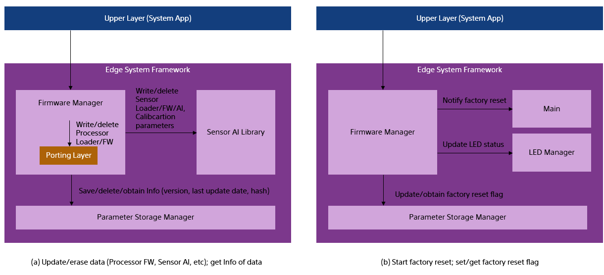

= Firmware Manager Functional Specifications
:sectnums:
:sectnumlevels: 3
:chapter-label:
:revnumber: 0.1.6
:toc:
:toc-title: Table of Contents
:toclevels: 3
:lang: en
:xrefstyle: short
:figure-caption: Figure
:table-caption: Table
:section-refsig:
:experimental:
ifdef::env-github[:mermaid_block: source,mermaid,subs="attributes"]
ifndef::env-github[:mermaid_block: mermaid,subs="attributes"]
ifdef::env-github,env-vscode[:mermaid_break: break]
ifndef::env-github,env-vscode[:mermaid_break: opt]
ifdef::env-github,env-vscode[:mermaid_critical: critical]
ifndef::env-github,env-vscode[:mermaid_critical: opt]
ifdef::env-github[:mermaid_br: pass:p[&lt;br&gt;]]
ifndef::env-github[:mermaid_br: pass:p[ ]]

== Purpose and Scope

This document describes the specifications of the Firmware Manager, which controls device updates in AITRIOS. +

<<<

== Terminology

=== Update Data
Refers to the data written to the device. +

=== Deletion Data
Refers to the data on the device that is subject to deletion. +

=== Download Memory
Refers to the area used to store update data. +
The application must store the update data in the download memory. +
Firmware Manager manages the download memory and writes the update data from the download memory to the device. +

=== Application
Refers to the block that uses this module. (Assumed to be the System App.)

<<<

== Module Description
=== Overview of This Module
The Firmware Manager provides functionality to perform update and deletion operations on data stored on the device. +
The application can update or delete data on the device using the API provided by the Firmware Manager, without needing to be aware of the specific methods for data manipulation. +
It also provides an interface to invoke the factory reset functionality provided by ESF main. +

NOTE: The Porting Layer is a part of the Firmware Manager. However, since its implementation may vary depending on the Application Processor used by the device, its specifications are not defined in this document and it is treated as an external module. +

[#_FigureOverview]
.Overview Diagram

<<<

=== State Transitions
The possible states of the Firmware Manager are shown in <<#_TableStates>>.

[#_TableStates]
.State List
[width="100%", cols="20%,80%",options="header"]
|===
|State |Description

|UNINIT
|Initial state. +
Functions other than ``EsfFwMgrInit`` cannot be called.

|IDLE
|Standby state. +
You can start updating the device using the ``EsfFwMgrOpen`` function. +
You can also start a factory reset using the ``EsfFwMgrStartFactoryReset`` function.

|WRITABLE
|Writable state. +
The ``EsfFwMgrCopyToInternalBuffer``, ``EsfFwMgrWrite``, and ``EsfFwMgrPostProcess`` functions can be executed.

|ERASABLE
|Erasable state. +
You can execute deletion using the ``EsfFwMgrErase`` function.

|DONE
|Update/erase completed state. +
Call the ``EsfFwMgrClose`` function to complete the device update.

|ERROR
|Update/erase error state. +
Call the ``EsfFwMgrClose`` function to complete the device update. +

|===

Firmware Manager performs state transitions as shown in <<#_FigureStateTransition>> when each API is called. +
If ``kEsfFwMgrResultAborted`` (device update error) occurs during any function execution, the state transitions to ERROR. +
In case of any other error, no state transition occurs. +

[#_FigureStateTransition]
.State Transition Diagram (To be updated; current content is valid)
[{mermaid_block}]
----
stateDiagram-v2
    [*] --> UNINIT
    UNINIT --> IDLE : EsfFwMgrInit
    IDLE --> UNINIT : EsfFwMgrDeinit

    IDLE --> WRITABLE : EsfFwMgrOpen{mermaid_br} (Write option argument set) 
    IDLE --> ERASABLE : EsfFwMgrOpen{mermaid_br} (Write option argument not set) 
    note left of IDLE
        The EsfFwMgrClose function
        transitions the state from
        ERASABLE, WRITABLE, DONE, or ERROR
        back to IDLE.
    end note

    WRITABLE --> DONE : EsfFwMgrPostProcess{mermaid_br}
    WRITABLE --> ERROR : EsfFwMgrWrite{mermaid_br} (Error occurred) 
    WRITABLE --> WRITABLE : EsfFwMgrWrite{mermaid_br}EsfFwMgrCopyToInternalBuffer

    ERASABLE --> DONE : EsfFwMgrErase{mermaid_br} (Deletion and post-processing complete) 
    ERASABLE --> ERROR : EsfFwMgrErase{mermaid_br} (Error occurred) 
----

The API availability and corresponding transition destinations for each state are shown in <<#_TableStateTransition>>. +
The state names in the table indicate the destination state after the API completes, meaning the API is callable in that state. +
An "×" indicates the API is not accepted in that state; in such cases, calling the API returns the ``kEsfFwMgrResultFailedPrecondition`` error, and no state transition occurs. +
For error details, refer to <<#_EsfFwMgrResult>>. +

[#_TableStateTransition]
.State Transition Table
[width="100%", cols=""]
|===
2.2+| 6+|State 
|UNINIT |IDLE |WRITABLE |ERASABLE |DONE |ERROR
.100+|API Name

|``EsfFwMgrInit`` +
|IDLE
|×
|×
|×
|×
|×

|``EsfFwMgrDeinit`` +
|×
|UNINIT
|×
|×
|×
|×

|``EsfFwMgrOpen`` +
|×
|ERASABLE or +
WRITABLE
|×
|×
|×
|×

|``EsfFwMgrCopyToInternalBuffer`` +
|×
|×
|WRITABLE or +
ERROR
|×
|×
|×

|``EsfFwMgrWrite`` +
|×
|×
|WRITABLE or +
ERROR
|×
|×
|×

|``EsfFwMgrPostProcess`` +
|×
|×
|DONE or +
ERROR
|×
|×
|×

|``EsfFwMgrErase`` +
|×
|×
|×
|DONE or +
ERROR
|×
|×

|``EsfFwMgrClose`` +
|×
|×
|IDLE
|IDLE
|IDLE
|IDLE

|``EsfFwMgrGetInfo`` +
|×
|IDLE
|WRITABLE
|ERASABLE
|DONE
|ERROR

|``EsfFwMgrGetBinaryHeaderInfo`` +
|×
|×
|WRITABLE(*) 
|×
|DONE(*)
|ERROR(*)

|``EsfFwMgrStartFactoryReset`` +
|×
|IDLE
|×
|×
|×
|×

|[DEPRECATED] ``EsfFwMgrSetFactoryResetFlag`` +
|×
|IDLE
|WRITABLE
|ERASABLE
|DONE
|ERROR

|[DEPRECATED] ``EsfFwMgrGetFactoryResetFlag`` +
|×
|IDLE
|WRITABLE
|ERASABLE
|DONE
|ERROR

|``EsfFwMgrSwitchProcessorFirmwareSlot`` +
|UNINIT
|IDLE
|×
|×
|×
|×

|===

(*) The API can only be called under certain conditions. +
For details, refer to each API's description.

<<<

<<#_TableFunction>> shows a list of functions.

[#_TableFunction]
.Function List
[width="100%", cols="30%,55%,15%",options="header"]
|===
|Function Name |Description |Section

|Module Initialization and Finalization
|Functions for initializing and finalizing the Firmware Manager.
|<<#_Function1>>

|Write Function
|Function for writing update data to the device.
|<<#_Function2>>

|Erase Function
|Function for deleting data on the device.
|<<#_Function3>>

|Data Retrieval Function
|Function for retrieving version and last update time.
|<<#_Function4>>

|Factory Reset Function
|Function for executing a factory reset.
|<<#_Function5>>
|===

<<<

=== Module Function Descriptions
[#_Function1]
==== Module Initialization and Finalization
* Function Overview +
    Provides initialization and finalization functions for the Firmware Manager.

* Prerequisites +
    None.

* Function Details
    ** Detailed Behavior +
        Initialization: Internal resources of the Firmware Manager are allocated by calling the ``EsfFwMgrInit`` function. After initialization, the Firmware Manager APIs become available. +
        Finalization: Resources are released by calling the ``EsfFwMgrDeinit`` function. +
    
    ** Notes
        *** These APIs are assumed to be used by ESF Main.

[#_Function2]
==== Write Function
* Function Overview +
    Provides functionality to write update data to the device. +

* Prerequisites +
    The Firmware Manager must be initialized.

* Function Details
    ** Detailed Behavior +
        . The application can use ``EsfFwMgrGetInfo`` to retrieve the version information of the current data on the device and determine whether an update is necessary. +
        . To start the update, call ``EsfFwMgrOpen`` with the update target specified. +
            At this time, a non-``NULL`` pointer must be specified for the ``prepare_write`` argument. +
            This prepares for writing and allocates an internal buffer to temporarily store update data. +
            A handle is returned as an OUT parameter, which must be passed to subsequent Firmware Manager API calls.
        . The application calls ``EsfFwMgrCopyToInternalBuffer`` to copy the update data to the internal buffer, and then calls ``EsfFwMgrWrite`` to write the buffered data to the device. +
            Writing can be performed in segments. +
            *** If the return value is other than ``kEsfFwMgrResultOk`` +
                **** If the return value is other than ``kEsfFwMgrResultAborted`` +
                    The application should check the parameters and system state and retry. (The state remains WRITABLE.) +
                **** If the return value is ``kEsfFwMgrResultAborted`` +
                    A non-recoverable error occurred, and the state transitioned to ERROR. The application must call ``EsfFwMgrClose`` to finalize the update.
        . After writing all update data, call ``EsfFwMgrPostProcess`` to perform post-processing (e.g., hash verification). +
        . Finally, call ``EsfFwMgrClose`` to complete the data update. +

    ** Notes
        *** Concurrent updates of multiple data items are not supported. Complete (Close) one update before starting (Open) the next. Updates cannot be performed concurrently with deletions or factory resets. +
        *** If ``EsfFwMgrClose`` is called in the WRITABLE or ERROR state, the update is aborted. The state of the data after aborting from WRITABLE or ERROR is undefined. +
        *** For details on the update data, refer to <<#_Notice_EsfFwMgrTarget>>.

[#_Function3]
==== Erase Function
* Function Overview +
    Provides functionality to delete data on the device. +

* Prerequisites +
    The Firmware Manager must be initialized.

* Function Details
    ** Detailed Behavior +
        . The application can use ``EsfFwMgrGetInfo`` to retrieve the version information of the data on the device and determine whether deletion is necessary. +
        . To start deletion, call ``EsfFwMgrOpen`` with the deletion target specified. +
            At this time, ``NULL`` must be specified for the ``prepare_write`` argument. +
            A handle is returned as an OUT parameter, which must be passed to subsequent ``EsfFwMgrErase`` and ``EsfFwMgrClose`` calls.
        . Call ``EsfFwMgrErase`` to delete the data on the device. +
            *** If the return value is ``kEsfFwMgrResultOk`` +
                Deletion completed successfully and transitioned to the DONE state. +
                The application must call ``EsfFwMgrClose`` to complete the update. +
            *** If the return value is not ``kEsfFwMgrResultOk`` +
                **** If the return value is other than ``kEsfFwMgrResultAborted`` +
                    The application should check the parameters and system state and retry. +
                **** If the return value is ``kEsfFwMgrResultAborted`` +
                    A non-recoverable error occurred and the state transitioned to ERROR. +
                    The application must call ``EsfFwMgrClose`` to finalize the update. +

    ** Notes
        *** Concurrent deletion of multiple data items is not supported. Complete (Close) one deletion before starting (Open) the next. Deletions cannot be performed concurrently with updates or factory resets. +
        *** If ``EsfFwMgrClose`` is called in the ERASABLE or ERROR state, the update is aborted. The state of the data after aborting from the ERROR state is undefined. +
        *** For details on the update data, refer to <<#_Notice_EsfFwMgrTarget>>.

[#_Function4]
==== Data Retrieval Function
* Function Overview +
    Provides functionality to retrieve version and last update timestamp. +

* Prerequisites +
    The Firmware Manager must be initialized.

* Function Details
    ** Detailed Behavior +
        . The application specifies the target to be retrieved with the ``EsfFwMgrGetInfo`` function. +
            The Firmware Manager returns version and last update timestamp as OUT parameters. A hash value may also be returned depending on the data type. +
        *** If an error occurs +
            The application should check the parameters and system state and retry. +

[#_Function5]
==== Factory Reset Function
* Function Overview +
    Provides functionality to perform a factory reset. +

* Prerequisites +
    The Firmware Manager must be initialized.

* Function Details
    ** Detailed Behavior +
        *** The application can execute a factory reset by calling the ``EsfFwMgrStartFactoryReset`` function. +
        *** If an error occurs +
            The application should check the parameters and system state and retry. +

    ** Notes
        *** A factory reset cannot be performed while an update or deletion is in progress. +
<<<

=== Non-Functional Requirements of This Module

<<#_TableNonFunction>> shows a list of non-functional requirements.

[#_TableNonFunction]
.Non-Functional Requirements List
[width="100%", cols="30%,55%,15%",options="header"]
|===
|Requirement |Description |Section

|Maximum Processing Time
|Specifies the maximum time required for processing.
|<<#_NonFunction1>>

|Stack Memory Usage
|Indicates the maximum size of stack memory used.
|<<#_NonFunction2>>

|Heap Memory Usage
|Indicates the maximum size of heap memory used.
|<<#_NonFunction3>>

|Large Heap Memory Usage
|Indicates the maximum size of large heap memory used.
|<<#_NonFunction4>>

|Number of Threads Used
|Indicates the number of threads used.
|<<#_NonFunction5>>

|Static Memory Usage
|Indicates the maximum size of static memory used.
|<<#_NonFunction6>>

|===

<<<

=== Non-Functional Requirement Descriptions of This Module
[#_NonFunction1]
==== Maximum Processing Time
Excluding mutual exclusion control and I/O wait time, it is less than or equal to 1 ms. +

[#_NonFunction2]
==== Stack Memory Usage
1024 bytes. (Planned)

[#_NonFunction3]
==== Heap Memory Usage
2 KB. (Planned)

[#_NonFunction4]
==== Maximum Large Heap Memory Usage
1024 KB. (Planned)

[#_NonFunction5]
==== Number of Threads Used
No threads are used.

[#_NonFunction6]
==== Static Memory Usage
1 KB. (Planned)

<<<

== API Specifications
=== Definition List
==== Config List
<<#_TableConfig>> shows the list of configuration parameters.

[#_TableConfig]
.Config List
[width="100%", cols="30%,25%,45%",options="header"]
|===
|Config Name |Default Value |Description

|EXTERNAL_FIRMWARE_MANAGER_MAX_MEMORY_SIZE
|1048576 (1MB)
|Maximum size [Byte] of the internal buffer used to temporarily store update data. +
    Range: 1024–1048576

|EXTERNAL_FIRMWARE_MANAGER_ENABLE_DEBUG_LOG
|n
|Enables debug logging for the firmware manager. (Currently not supported)

|EXTERNAL_FIRMWARE_MANAGER_AI_MODEL_SLOT_NUM
|4
|Number of AI model slots.

|===

==== Data Type List
<<#_TableDataType>> shows the list of data types.

[#_TableDataType]
.Data Type List
[width="100%", cols="30%,55%,15%",options="header"]
|===
|Data Type Name |Description |Section

|EsfFwMgrHandle
|Handle for operating the Firmware Manager.
|<<#_EsfFwMgrHandle>>

|EsfFwMgrResult
|Enumeration defining the result of API execution.
|<<#_EsfFwMgrResult>>

|EsfFwMgrTarget
|Enumeration defining the update target.
|<<#_EsfFwMgrTarget>>

|EsfFwMgrOpenRequest
|Structure defining the request data for the ``EsfFwMgrOpen`` function.
|<<#_EsfFwMgrOpenRequest>>

|EsfFwMgrPrepareWriteRequest
|Structure defining the prepare-write request data for the ``EsfFwMgrOpen`` function.
|<<#_EsfFwMgrPrepareWriteRequest>>

|EsfFwMgrOpenResponse
|Structure defining the response data for the ``EsfFwMgrOpen`` function.
|<<#_EsfFwMgrOpenResponse>>

|EsfFwMgrPrepareWriteResponse
|Structure defining the prepare-write response data for the ``EsfFwMgrOpen`` function.
|<<#_EsfFwMgrPrepareWriteResponse>>

|EsfFwMgrPrepareCopyToInternalBufferRequest
|Structure defining the request data for the ``EsfFwMgrCopyToInternalBuffer`` function.
|<<#_EsfFwMgrCopyToInternalBufferRequest>>

|EsfFwMgrWriteRequest
|Structure defining the request data for the ``EsfFwMgrWrite`` function.
|<<#_EsfFwMgrWriteRequest>>

|EsGetInfoData
|Structure defining the argument data for the ``EsfFwMgrGetInfo`` function.
|<<#_EsfFwMgrGetInfoData>>

|EsfFwMgrGetInfoResponse
|Structure defining the response data for the ``EsfFwMgrGetInfo`` function.
|<<#_EsfFwMgrGetInfoResponse>>

|EsfFwMgrFactoryResetCause
|Enumeration defining the cause of factory reset.
|<<#_EsfFwMgrFactoryResetCause>>

|===

==== API List
<<#_TableAPI>> shows the list of APIs.

[#_TableAPI]
.API List
[width="100%", cols="30%,55%,15%",options="header"]
|===
|API Name |Description |Section

|EsfFwMgrInit
|Initializes the Firmware Manager.
|<<#_EsfFwMgrInit>>

|EsfFwMgrDeinit
|Finalizes the Firmware Manager.
|<<#_EsfFwMgrDeinit>>

|EsfFwMgrOpen
|Starts update or deletion of data.
|<<#_EsfFwMgrOpen>>

|EsfFwMgrCopyToInternalBuffer
|Copies update data to the internal buffer.
|<<#_EsfFwMgrCopyToInternalBuffer>>

|EsfFwMgrWrite
|Writes update data to the device.
|<<#_EsfFwMgrWrite>>

|EsfFwMgrPostProcess
|Performs post-processing such as hash verification on the update data.
|<<#_EsfFwMgrPostProcess>>

|EsfFwMgrErase
|Deletes data on the device.
|<<#_EsfFwMgrErase>>

|EsfFwMgrClose
|Finalizes update or deletion of data.
|<<#_EsfFwMgrClose>>

|EsfFwMgrGetBinaryHeaderInfo
|Retrieves the binary header information.
|<<#_EsfFwMgrGetBinaryHeaderInfo>>

|EsfFwMgrGetInfo
|Retrieves version, update timestamp, and hash of the specified target.
|<<_EsfFwMgrGetInfo>>

|EsfFwMgrStartFactoryReset
|Starts a factory reset.
|<<#_EsfFwMgrStartFactoryReset>>

|EsfFwMgrSetFactoryResetFlag
|[DEPRECATED] Sets the factory reset permission flag.
|<<#_EsfFwMgrSetFactoryResetFlag>>

|EsfFwMgrGetFactoryResetFlag
|[DEPRECATED] Retrieves the factory reset permission flag.
|<<#_EsfFwMgrGetFactoryResetFlag>>

|===

<<<

=== Data Type Definitions

[#_EsfFwMgrHandle]
==== EsfFwMgrHandle
Handle used to operate the Firmware Manager.

* *Format* +
+
[source, C]
....
#define ESF_FIRMWARE_MANAGER_HANDLE_INVALID (NULL)
typedef struct EsfFwMgrContext* EsfFwMgrHandle;
....

[#_EsfFwMgrResult]
==== EsfFwMgrResult
Enumeration that defines the result of API execution.

* *Format* +
+
[source, C]
....
typedef enum EsfFwMgrResult {
    kEsfFwMgrResultOk,
    kEsfFwMgrResultInvalidArgument,
    kEsfFwMgrResultFailedPrecondition,
    kEsfFwMgrResultAborted,
    kEsfFwMgrResultOutOfRange,
    kEsfFwMgrResultResourceExhausted,
    kEsfFwMgrResultUnavailable,
    kEsfFwMgrResultUnimplemented,
    kEsfFwMgrResultInternal,
    kEsfFwMgrResultBusy
} EsfFwMgrResult;
....

* *Values* +
+
[#_TableEsfFwMgrResult]
.Description of EsfFwMgrResult Values
[width="100%", cols="30%,70%",options="header"]
|===
|Member Name |Description

|kEsfFwMgrResultOk
|The operation completed successfully.

|kEsfFwMgrResultInvalidArgument
|The argument is invalid.

|kEsfFwMgrResultFailedPrecondition
|The Firmware Manager is in an invalid state.

|kEsfFwMgrResultAborted
|Failed to write update data or delete data.

|kEsfFwMgrResultOutOfRange
|The parameter is out of the valid range.

|kEsfFwMgrResultResourceExhausted
|Failed to allocate necessary resources.

|kEsfFwMgrResultUnavailable
|The API is currently unavailable due to an error in another module.

|kEsfFwMgrResultUnimplemented
|The API is not implemented.

|kEsfFwMgrResultInternal
|An internal error occurred.

|kEsfFwMgrResultBusy
|The Firmware Manager is already running in another context.
|===

[#_EsfFwMgrTarget]
==== EsfFwMgrTarget
Enumeration that represents the type of data targeted for update or deletion. +
The enum values in this enumeration are subject to change.

* *Format*

[source, C]
....
typedef enum EsfFwMgrTarget {
    kEsfFwMgrTargetSensorLoader = 0,
    kEsfFwMgrTargetSensorFirmware = 1,
    kEsfFwMgrTargetProcessorLoader = 2,
    kEsfFwMgrTargetProcessorFirmware = 3,
    kEsfFwMgrTargetSensorCalibrationParam = 5,
    kEsfFwMgrTargetAIModel = 9,
} EsfFwMgrTarget;
....

* *Values* +

[#_TableEsfFwMgrTarget]
.Description of EsfFwMgrTarget Values
[width="100%", cols="30%,70%",options="header"]
|===
|Member Name |Description

|kEsfFwMgrTargetSensorLoader
|Sensor loader

|kEsfFwMgrTargetSensorFirmware
|Sensor firmware

|kEsfFwMgrTargetProcessorLoader
|Processor loader

|kEsfFwMgrTargetProcessorFirmware
|Processor firmware

|kEsfFwMgrTargetSensorCalibrationParam
|Sensor calibration parameters (Currently not supported)

|kEsfFwMgrTargetAIModel
|Sensor AI model

|===

[#_EsfFwMgrOpenRequest]
==== EsfFwMgrOpenRequest
Structure that defines the request data for the ``EsfFwMgrOpen`` function.

* *Format* +
+
[source, C]
....
#define ESF_FIRMWARE_MANAGER_TARGET_NAME_SIZE (32 + 1)
#define ESF_FIRMWARE_MANAGER_TARGET_VERSION_SIZE (44 + 1)
#define ESF_FIRMWARE_MANAGER_TARGET_HASH_SIZE (32)

typedef struct EsfFwMgrOpenRequest {
    EsfFwMgrTarget target;
    char name[ESF_FIRMWARE_MANAGER_TARGET_NAME_SIZE];
    char version[ESF_FIRMWARE_MANAGER_TARGET_VERSION_SIZE];
    uint8_t hash[ESF_FIRMWARE_MANAGER_TARGET_HASH_SIZE];
} EsfFwMgrOpenRequest;
....

* *Members* +
+
[#_TableEsfFwMgrOpenRequest]
.Description of EsfFwMgrOpenRequest Members
[width="100%", cols="30%,70%",options="header"]
|===
|Member Name |Description

|target
|The target of the update.

|name
|Name (string) of the update or deletion data. +
Used to identify the target data. +
Ignored if the target is Processor Firmware or Processor Loader.

|version
|Version (string) of the update or deletion data. +
Ignored if the target is Processor Firmware or Processor Loader. +
For other targets: +
– In a write-type Open, it is saved as metadata of the update data. +
– In a delete-type Open, it is used to identify the data to be deleted.

|hash
|SHA-256 hash value of the update or deletion data. +
In a write-type Open, it is used to verify the integrity of the update data and stored as metadata. +
In a delete-type Open, it is used to identify the data to be deleted.
|===

[#_EsfFwMgrPrepareWriteRequest]
==== EsfFwMgrPrepareWriteRequest
Structure that defines the prepare-write request data for the ``EsfFwMgrOpen`` function.

* *Format* +
+
[source, C]
....
typedef struct EsfFwMgrPrepareWriteRequest {
    int32_t total_size;
    int32_t memory_size;
} EsfFwMgrPrepareWriteRequest;
....

* *Members* +
+
[#_TableEsfFwMgrPrepareWriteRequest]
.Description of EsfFwMgrPrepareWriteRequest Members
[width="100%", cols="30%,70%",options="header"]
|===
|Member Name |Description

|total_size
|Total size of the update data. +
This must be specified when the update target is the Application Processor Firmware (``kEsfFwMgrTargetProcessorFirmware``), or in the case of T3, Sensor bootloader (``kEsfFwMgrTargetSensorLoader``), Sensor firmware (``kEsfFwMgrTargetSensorFirmware``), or AI model (``kEsfFwMgrTargetAIModel``). +
Ignored for other targets. +
(For the rationale behind this constraint, refer to <<_BackgroundOfArgumentOfOpen>>.) +

|memory_size
|Requested size [bytes] of the download memory.

|===

[#_EsfFwMgrOpenResponse]
==== EsfFwMgrOpenResponse
Structure that defines the response data for the ``EsfFwMgrOpen`` function.

* *Format* +
+
[source, C]
....
typedef struct EsfFwMgrOpenResponse {
    EsfFwMgrHandle handle;
    EsfFwMgrPrepareWriteResponse prepare_write;
} EsfFwMgrOpenResponse;
....

* *Members* +
+
[#_TableEsfFwMgrOpenResponse]
.Description of EsfFwMgrOpenResponse Members
[width="100%", cols="30%,70%",options="header"]
|===
|Member Name |Description

|handle
|Handle used to operate the Firmware Manager.

|prepare_write
|Response data when a prepare-write request is made. +
For details on this member, refer to <<#_EsfFwMgrPrepareWriteResponse, EsfFwMgrPrepareWriteResponse>>.

|===

[#_EsfFwMgrPrepareWriteResponse]
==== EsfFwMgrPrepareWriteResponse
Structure that defines the prepare-write response data for the ``EsfFwMgrOpen`` function.

* *Format* +
+
[source, C]
....
typedef struct EsfFwMgrPrepareWriteResponse {
    int32_t memory_size;
    int32_t writable_size;
} EsfFwMgrPrepareWriteResponse;
....

* *Members* +
+
[#_TableEsfFwMgrPrepareWriteResponse]
.Description of EsfFwMgrPrepareWriteResponse Members
[width="100%", cols="30%,70%",options="header"]
|===
|Member Name |Description

|memory_size
|Size [bytes] of the internal buffer for temporarily storing update data.

|writable_size
|Maximum size [bytes] that can be written at one time.

|===

[#_EsfFwMgrCopyToInternalBufferRequest]
==== EsfFwMgrCopyToInternalBufferRequest
Structure that defines the request data for the ``EsfFwMgrWrite`` function.

* *Format* +
+
[source, C]
....
typedef struct EsfFwMgrCopyToInternalBufferRequest {
  int32_t offset;
  int32_t size;
  const uint8_t* data;
} EsfFwMgrCopyToInternalBufferRequest;
....

* *Members* +
+
[#_TableEsfFwMgrCopyToInternalBufferRequest]
.Description of EsfFwMgrCopyToInternalBufferRequest Members
[width="100%", cols="30%,70%",options="header"]
|===
|Member Name |Description

|offset
|Starting offset [bytes] in the internal buffer to which the data will be copied. +
If a negative value or a value equal to or greater than the internal buffer size is specified, an error is returned.

|size
|Size [bytes] of the data to be copied to the internal buffer. +
If a negative value is specified, an error is returned. +
An error is also returned if ``offset`` + ``size`` exceeds the internal buffer size.

|===

[#_EsfFwMgrWriteRequest]
==== EsfFwMgrWriteRequest
Structure that defines the request data for the ``EsfFwMgrWrite`` function.

* *Format* +
+
[source, C]
....
typedef struct EsfFwMgrWriteRequest {
    int32_t offset;
    int32_t size;
} EsfFwMgrWriteRequest;
....

* *Members* +
+
[#_TableEsfFwMgrWriteRequest]
.Description of EsfFwMgrWriteRequest Members
[width="100%", cols="30%,70%",options="header"]
|===
|Member Name |Description

|offset
|Start offset [bytes] in the internal buffer from which data will be written. +
An error is returned if a negative value or a value equal to or greater than the buffer size is specified.

|size
|Size [bytes] of the data to write. +
The data must reside in the download memory. +
An error is returned if the value is less than or equal to 0, or if the specified range exceeds the download memory size.

|===

[#_EsfFwMgrBinaryHeaderInfo]
==== EsfFwMgrBinaryHeaderInfo
Structure representing the binary header information.

* *Format* +
+
[source, C]
....
typedef enum EsfFwMgrSwArchVersion {
  kEsfFwMgrSwArchVersion1,
  kEsfFwMgrSwArchVersion2,
  kEsfFwMgrSwArchVersionUnknown,
} EsfFwMgrSwArchVersion;

typedef struct EsfFwMgrBinaryHeaderInfo {
  EsfFwMgrSwArchVersion sw_arch_version;
} EsfFwMgrBinaryHeaderInfo;
....

* *Members* +
+
[#_TableEsfFwMgrWriteRequest]
.Description of EsfFwMgrBinaryHeaderInfo Members
[width="100%", cols="30%,70%",options="header"]
|===
|Member Name |Description

|sw_arch_version
|Software architecture version of the binary. If the header is missing or the value in the header is invalid, ``kEsfFwMgrSwArchVersionUnknown`` is returned.
|===

[#_EsfFwMgrGetInfoData]
==== EsfFwMgrGetInfoData
Structure that defines the argument data for the ``EsfFwMgrGetInfo`` function.

* *Format* +
+
[source, C]
....
typedef struct EsfFwMgrGetInfoData {
    EsfFwMgrTarget target;
    char name[ESF_FIRMWARE_MANAGER_TARGET_NAME_SIZE];
    int32_t in_length;
    EsfFwMgrGetInfoResponse* response;
    int32_t out_length;
} EsfFwMgrGetInfoData;
....

* *Members* +
+
[#_TableEsfFwMgrGetInfoData]
.Description of EsfFwMgrGetInfoData Members
[width="100%", cols="30%,70%",options="header"]
|===
|Member Name |Description

|target
|Target for update.

|name
|Name (string) of the device where the binary is deployed.

|in_length
|Number of elements in ``response``.

|response
|Pointer to the structure for the data retrieval request. Cannot be NULL.

|out_length
|Number of elements that contain valid results.

|===

[#_EsfFwMgrGetInfoResponse]
==== EsfFwMgrGetInfoResponse
Structure that defines the response data for the ``EsfFwMgrGetInfo`` function.

* *Format* +
+
[source, C]
....
#define ESF_FIRMWARE_MANAGER_AI_MODEL_SLOT_NUM CONFIG_EXTERNAL_FIRMWARE_MANAGER_AI_MODEL_SLOT_NUM
#define ESF_FIRMWARE_MANAGER_LAST_UPDATE_SIZE (32 + 1)
typedef struct EsfFwMgrGetInfoResponse {
    char version[ESF_FIRMWARE_MANAGER_TARGET_VERSION_SIZE];
    char last_update[ESF_FIRMWARE_MANAGER_LAST_UPDATE_SIZE];
    char hash[ESF_FIRMWARE_MANAGER_TARGET_HASH_SIZE];
} EsfFwMgrGetInfoResponse;
....

* *Members* +
+
[#_TableEsfFwMgrGetInfoResponse]
.Description of EsfFwMgrGetInfoResponse Members
[width="100%", cols="30%,70%",options="header"]
|===
|Member Name |Description

|version
|String representing version information.

|last_update
|String representing the last update timestamp.

|hash
|Hash value (SHA-256) of the update data.

|===

[#_EsfFwMgrFactoryResetCause]
==== EsfFwMgrFactoryResetCause
Enumeration that defines the cause of a factory reset.

* *Format* +
+
[source, C]
....
typedef enum {
    kEsfFwMgrResetCauseButton,
    kEsfFwMgrResetCauseCommand,
} EsfFwMgrFactoryResetCause;
....

* *Values* +
+
[#_Table_EsfFwMgrFactoryResetCause]
.Description of EsfFwMgrFactoryResetCause Values
[width="100%", cols="30%,70%",options="header"]
|===
|Member Name |Description

|kEsfFwMgrResetCauseButton
|Factory reset initiated by button press.

|kEsfFwMgrResetCauseCommand
|Factory reset initiated by command.

|===

<<<

=== Multi-threaded Invocation Support
In the list below, APIs in Group A cannot be executed concurrently. +
APIs in Group B can be executed concurrently (they are blocking). +
One API from Group A and one or more APIs from Group B can also be executed concurrently. +

If an API from Group A is called from a different context while another Group A API is running, the call will immediately return with an error (``kEsfFwMgrResultBusy``). +

APIs in Group C do not return an error even if called from multiple threads. +
For details on the behavior when called from multiple threads, refer to the descriptions of each API.

* Group A
** EsfFwMgrInit
** EsfFwMgrDeinit
** EsfFwMgrOpen
** EsfFwMgrCopyToInternalBuffer
** EsfFwMgrWrite
** EsfFwMgrPostProcess
** EsfFwMgrErase
** EsfFwMgrClose
** EsfFwMgrGetBinaryHeaderInfo
** EsfFwMgrStartFactoryReset

* Group B
** EsfFwMgrGetInfo
** [DEPRECATED] EsfFwMgrSetFactoryResetFlag
** [DEPRECATED] EsfFwMgrGetFactoryResetFlag

* Group C
** EsfFwMgrSwitchProcessorFirmwareSlot

=== API Definitions

[#_EsfFwMgrInit]
==== EsfFwMgrInit
* *Function* +
    Initializes the Firmware Manager.

* *Prototype* +
    ``EsfFwMgrResult EsfFwMgrInit(void)``

* *Arguments* +
    ``[IN] None``:: 

    ``[OUT] None``:: 

* *Return Value* +
    Returns one of the values defined in <<#_TableEsfFwMgrResult, EsfFwMgrResult>> depending on the execution result.

* *Description* +
    Allocates internal resources for the Firmware Manager and transitions it to the IDLE state. +
    This API must be called before using any other Firmware Manager API. +
    If successful, this API returns ``kEsfFwMgrResultOk``.

    ** Behavior on Error +
        *** If this API is called when the Firmware Manager is not in the INIT state, ``kEsfFwMgrResultFailedPrecondition`` is returned. +
            Ensure that the Firmware Manager is in the INIT state.
        *** If internal resource allocation fails, ``kEsfFwMgrResultResourceExhausted`` is returned. +
            Ensure sufficient system resources are available.
        *** If a Group A Firmware Manager API is already running in another context, ``kEsfFwMgrResultBusy`` is returned. +

[#_EsfFwMgrDeinit]
==== EsfFwMgrDeinit
* *Function* +
    Finalizes the Firmware Manager.

* *Prototype* +
    ``EsfFwMgrResult EsfFwMgrDeinit(void)``

* *Arguments* +
    ``[IN] None``:: 

    ``[OUT] None``:: 

* *Return Value* +
    Returns one of the values defined in <<#_TableEsfFwMgrResult, EsfFwMgrResult>> depending on the execution result.

* *Description* +
    Releases internal resources of the Firmware Manager and transitions it to the INIT state. +
    If this API is called while any Firmware Manager API is running in another context, an error is returned. +
    If successful, this API returns ``kEsfFwMgrResultOk``.

    ** Behavior on Error +
        *** If this API is called when the Firmware Manager is not in the IDLE state, ``kEsfFwMgrResultFailedPrecondition`` is returned. +
            Ensure that the Firmware Manager is in the IDLE state.
        *** If a Group A Firmware Manager API is already running in another context, ``kEsfFwMgrResultBusy`` is returned. +
        *** If a Group B Firmware Manager API is already running in another context, ``kEsfFwMgrResultFailedPrecondition`` is returned. +

[#_EsfFwMgrOpen]
==== EsfFwMgrOpen
* *Function* +
    Starts an update or deletion operation on the device.

* *Prototype* +
    ``EsfFwMgrResult EsfFwMgrOpen(const EsfFwMgrOpenRequest* request, const EsfFwMgrPrepareWriteRequest* prepare_write, EsfFwMgrOpenResponse* response)``

* *Arguments* +
    ``[IN] const EsfFwMgrOpenRequest* request``::  
    Input parameter. Cannot be ``NULL``. +
    For details of the structure, see <<#_EsfFwMgrOpenRequest>>.

    ``[IN] const EsfFwMgrPrepareWriteRequest* prepare_write``::  
    Optional input parameter. +
    Set this when using the write function. +
    Set to ``NULL`` when using the delete function. +
    For details of the structure, see <<#_EsfFwMgrPrepareWriteRequest>>.

    ``[OUT] EsfFwMgrOpenResponse* response``::  
    Output parameter. Cannot be ``NULL``. +
    For details of the structure, see <<#_EsfFwMgrOpenResponse>>.

* *Return Value* +
    Returns one of the values defined in <<#_TableEsfFwMgrResult, EsfFwMgrResult>>, depending on the execution result.

* *Description* +
    Determines the update or delete target based on the specified target, name, version, and hash. +
    When performing deletion of an AI model, be sure to specify the same version-hash pair used during the write-type Open. +
    (If incorrect, it may lead to an unrecoverable state.) +
    If successful, this API returns ``kEsfFwMgrResultOk``. +

    ** When ``prepare_write`` is not ``NULL``: +
        The Firmware Manager prepares for writing. +
        It allocates an internal buffer to temporarily store update data and performs startup processing for external modules, depending on the target. +
        Memory allocation uses the Memory Manager. +
        On success, the Firmware Manager transitions to the WRITABLE state. +
        The ``prepare_write`` member of the ``response`` output parameter is populated with buffer and writable size information.

    ** When ``prepare_write`` is ``NULL``: +
        The Firmware Manager transitions to the ERASABLE state. +
        The ``prepare_write`` member of the ``response`` is not updated. +

    ** If the target is AIModel, slot management is also involved in determining the state transition: +
    *** For write operations, the state transitions to WRITABLE only if there is an available slot. +
    *** For delete operations, the state transitions to ERASABLE only if a matching version exists in a slot. +
    See <<#_Slot_Management>> for details about AI model slot management.

    ** Behavior on Error +
        *** If the Firmware Manager is not in the IDLE state, returns ``kEsfFwMgrResultFailedPrecondition``. +
            Make sure the Firmware Manager is in the IDLE state.
        *** If the Sensor module is in Streaming state, returns ``kEsfFwMgrResultFailedPrecondition``. +
            Ensure that the Sensor module is not in Streaming state.
            **** If any other external module API returns an error, returns ``kEsfFwMgrResultUnavailable``. +
                Check the status of external modules.
        *** If ``request`` or ``response`` is ``NULL``, returns ``kEsfFwMgrResultInvalidArgument``. +
            Ensure these arguments are not ``NULL`` before retrying.
        *** If any member of the input parameters is invalid, returns ``kEsfFwMgrResultInvalidArgument``. +
            Check the parameter contents before retrying.
        *** If the specified target is not implemented, returns ``kEsfFwMgrResultUnimplemented``. +
            Check the parameter contents before retrying.
        *** If memory allocation fails, returns ``kEsfFwMgrResultResourceExhausted``. +
            Ensure sufficient system resources are available.
        *** If a Group A Firmware Manager API is already running in another context, returns ``kEsfFwMgrResultBusy``. +

[#_EsfFwMgrCopyToInternalBuffer]
==== EsfFwMgrCopyToInternalBuffer
* *Function* +
    Copies update data to the internal buffer.

* *Prototype* +
    ``EsfFwMgrResult EsfFwMgrCopyToInternalBuffer(EsfFwMgrHandle handle, const EsfFwMgrCopyToInternalBufferRequest* request)``

* *Arguments* +
    ``[IN] EsfFwMgrHandle handle``::  
    Handle for operating the Firmware Manager.

    ``[IN] const EsfFwMgrCopyToInternalBufferRequest* request``::  
    Request structure. Cannot be ``NULL``. +
    For structure details, see <<#_EsfFwMgrCopyToInternalBufferRequest>>.

* *Return Value* +
    Returns one of the values from <<#_TableEsfFwMgrResult, EsfFwMgrResult>> depending on the execution result.

* *Description* +
    Copies update data into the specified range of the internal buffer. +
    The data from ``request->data`` to ``request->data + request->size - 1`` is copied to the internal buffer from ``request->offset`` to ``request->offset + request->size - 1``. +
    This API processes in the caller’s context and blocks until completion. +
    On success, this API returns ``kEsfFwMgrResultOk``. +

    ** Behavior on Error +
        *** If called when the Firmware Manager is not in the WRITABLE state, returns ``kEsfFwMgrResultFailedPrecondition``.
        *** If the input argument is ``NULL`` or contains unexpected parameters, returns ``kEsfFwMgrResultInvalidArgument``. +
            Refer to <<#_EsfFwMgrCopyToInternalBuffer>> and provide valid arguments.
        *** If an unrecoverable error occurs internally, returns ``kEsfFwMgrResultAborted``. +
            Call ``EsfFwMgrClose`` to terminate the update operation.

[#_EsfFwMgrWrite]
==== EsfFwMgrWrite
* *Function* +
    Writes update data to the device.

* *Prototype* +
    ``EsfFwMgrResult EsfFwMgrWrite(EsfFwMgrHandle handle, const EsfFwMgrWriteRequest* request)``

* *Arguments* +
    ``[IN] EsfFwMgrHandle handle``::  
    Handle for operating the Firmware Manager.

    ``[IN] const EsfFwMgrWriteRequest* request``::  
    Data write request structure. Cannot be ``NULL``. +
    For structure details, see <<#_EsfFwMgrWriteRequest>>.

* *Return Value* +
    Returns one of the values from <<#_TableEsfFwMgrResult, EsfFwMgrResult>> depending on the execution result.

* *Description* +
    Writes data from the internal buffer to the device. +
    The data in the internal buffer from ``request->offset`` to ``request->offset + request->size - 1`` is written to the device. +
    The data must have been copied beforehand using ``EsfFwMgrCopyToInternalBuffer``. +
    This API processes in the caller’s context and blocks until completion. +
    On success, this API returns ``kEsfFwMgrResultOk``. +

    ** When ``kEsfFwMgrTargetProcessorFirmware`` is specified as the target during ``EsfFwMgrOpen``: +
        *** On the first call to this API, the existence of a header is checked. If present, the header is validated. +
        *** The header is not written to the device. +
        *** At least 8 bytes must be specified for ``request->size`` on the first call. +

    ** Behavior on Error +
        *** If called when the Firmware Manager is not in the WRITABLE state, returns ``kEsfFwMgrResultFailedPrecondition``. +
            Make sure the Firmware Manager is in the WRITABLE state.
        *** If the input argument is ``NULL`` or contains unexpected parameters, returns ``kEsfFwMgrResultInvalidArgument``. +
            Refer to <<#_EsfFwMgrWriteRequest, EsfFwMgrWriteRequest>> and provide valid arguments.
        *** If writing or post-processing fails and is unrecoverable, returns ``kEsfFwMgrResultAborted``. +
            The Firmware Manager transitions to the ERROR state. Data consistency is not guaranteed. +
            Call ``EsfFwMgrClose`` to terminate the update.
        *** If an external module API returns an error, returns ``kEsfFwMgrResultUnavailable``. +
            Check the status of external modules and retry.
        *** If another Group A API is already running in a different context, returns ``kEsfFwMgrResultBusy``. +

[#_EsfFwMgrPostProcess]
==== EsfFwMgrPostProcess
* *Function* +
    Performs post-processing such as verifying the hash of the update data.

* *Prototype* +
    ``EsfFwMgrResult EsfFwMgrPostProcess(EsfFwMgrHandle handle)``

* *Arguments* +
    ``[IN] EsfFwMgrHandle handle``::  
    Handle for operating the Firmware Manager.

* *Return Value* +
    Returns one of the values from <<#_TableEsfFwMgrResult, EsfFwMgrResult>> depending on the execution result.

* *Description* +
    This API must be called after all update data has been written using ``EsfFwMgrWrite``. +
    Verifies that the SHA-256 hash of the written data matches the hash provided during ``EsfFwMgrOpen``. +
    Additional validation may be performed depending on the data type. +
    If verification succeeds, the data version, last update timestamp (and hash, depending on the data) are saved using the Parameter Storage Manager. +
    If all operations succeed, this API returns ``kEsfFwMgrResultOk``. +
    The Firmware Manager transitions to the DONE state. +

    ** Behavior on Error +
        *** If this API is called when the Firmware Manager is not in the WRITABLE state, ``kEsfFwMgrResultFailedPrecondition`` is returned. +
            Ensure the Firmware Manager is in the WRITABLE state.
        *** If the input argument is ``NULL`` or has invalid parameters, ``kEsfFwMgrResultInvalidArgument`` is returned. +
            Check the arguments and pass valid parameters.
        *** If a non-recoverable error such as hash mismatch occurs, ``kEsfFwMgrResultAborted`` is returned. +
            The Firmware Manager transitions to the ERROR state. +
            Call ``EsfFwMgrClose`` to terminate the update.
        *** If an external module API returns an error, ``kEsfFwMgrResultUnavailable`` is returned. +
            Check the status of the external module before retrying.
        *** If a Group A Firmware Manager API is running in another context, ``kEsfFwMgrResultBusy`` is returned. +

[#_EsfFwMgrErase]
==== EsfFwMgrErase
* *Function* +
    Deletes data on the device.

* *Prototype* +
    ``EsfFwMgrResult EsfFwMgrErase(EsfFwMgrHandle handle)``

* *Arguments* +
    ``[IN] EsfFwMgrHandle handle``::  
    Handle for operating the Firmware Manager.

* *Return Value* +
    Returns one of the values from <<#_TableEsfFwMgrResult, EsfFwMgrResult>> depending on the execution result.

* *Description* +
    Deletes data on the device using deletion processes provided by the corresponding external module for the target. +
    If deletion succeeds, post-processing is performed. +
    If all operations succeed, this API returns ``kEsfFwMgrResultOk``. +
    The Firmware Manager transitions to the DONE state. +

    ** Post-Processing Details +
        Deletes version and hash information of the deleted data using the Parameter Storage Manager. +
        Also updates the last update timestamp of that data. +

    ** Behavior on Error +
        *** If this API is called when the Firmware Manager is not in the ERASABLE state, ``kEsfFwMgrResultFailedPrecondition`` is returned. +
            Ensure the Firmware Manager is in the ERASABLE state.
        *** If the input argument is ``NULL``, ``kEsfFwMgrResultInvalidArgument`` is returned. +
            Ensure the argument is not ``NULL`` before retrying.
        *** If data deletion or post-processing fails and is not recoverable, ``kEsfFwMgrResultAborted`` is returned. +
            The Firmware Manager transitions to the ERROR state. Data consistency is not guaranteed. +
            The application must call ``EsfFwMgrClose`` to terminate the update.
        *** If an external module API returns an error, ``kEsfFwMgrResultUnavailable`` is returned. +
            Check the external module's status.
        *** If a Group A Firmware Manager API is running in another context, ``kEsfFwMgrResultBusy`` is returned. +

[#_EsfFwMgrClose]
==== EsfFwMgrClose
* *Function* +
    Finalizes the write or erase operation.

* *Prototype* +
    ``EsfFwMgrResult EsfFwMgrClose(EsfFwMgrHandle handle)``

* *Arguments* +
    ``[IN] EsfFwMgrHandle handle``::  
    Handle for operating the Firmware Manager.

* *Return Value* +
    Returns one of the values defined in <<#_TableEsfFwMgrResult, EsfFwMgrResult>>, depending on the execution result.

* *Description* +
    Finalizes the write or erase operation and performs termination processes via the corresponding external module for the target. +
    If the operation is successful, this API returns ``kEsfFwMgrResultOk``. +
    The Firmware Manager transitions to the IDLE state. +

    ** Behavior on Error +
        *** If this API is called when the Firmware Manager is not in the ERASABLE, WRITABLE, DONE, or ERROR state, ``kEsfFwMgrResultFailedPrecondition`` is returned. +
            Ensure the state is ERASABLE, WRITABLE, DONE, or ERROR.
        *** If an external module API returns an error, ``kEsfFwMgrResultUnavailable`` is returned. +
            Check the status of the external module.
        *** If the input argument is ``NULL``, ``kEsfFwMgrResultInvalidArgument`` is returned. +
            Ensure the argument is not ``NULL`` before retrying.
        *** If a Group A Firmware Manager API is already running in another context, ``kEsfFwMgrResultBusy`` is returned. +

[#_EsfFwMgrGetBinaryHeaderInfo]
==== EsfFwMgrGetBinaryHeaderInfo
* *Function* +
    Retrieves the header information of the written binary.

* *Prototype* +
    ``EsfFwMgrResult EsfFwMgrGetBinaryHeaderInfo(EsfFwMgrHandle handle, EsfFwMgrBinaryHeaderInfo* info)``

* *Arguments* +
    ``[IN] EsfFwMgrHandle handle``::  
    Handle for operating the Firmware Manager.

    ``[OUT] EsfFwMgrBinaryHeaderInfo* info``::  
    Output parameter for binary header information. +
    For structure details, refer to <<#_EsfFwMgrBinaryHeaderInfo>>.

* *Return Value* +
    Returns one of the values defined in <<#_TableEsfFwMgrResult, EsfFwMgrResult>>, depending on the execution result.

* *Description* +
    Retrieves header information for the binary being written using the specified ``handle``. +
    The timing for calling this API depends on the type of binary. +
    In the case of ``kEsfFwMgrTargetProcessorFirmware``, this API can be called after ``EsfFwMgrWrite`` has written at least the header size (128 bytes). +
    (Note: although the header itself is not written to the device, this API becomes available once the total ``request->size`` passed to ``EsfFwMgrWrite`` exceeds the header size.) +
    This API does not change the state of the Firmware Manager. +
    Currently, this API is only implemented for ``kEsfFwMgrTargetProcessorFirmware``. +
    It will return an error for other binary types.

    ** Behavior on Error +
        *** If this API is called before header information is available, ``kEsfFwMgrResultFailedPrecondition`` is returned.
        *** If the arguments are invalid, ``kEsfFwMgrResultInvalidArgument`` is returned.
        *** If a Group A Firmware Manager API is already running in another context, ``kEsfFwMgrResultBusy`` is returned. +

[#_EsfFwMgrGetInfo]
==== EsfFwMgrGetInfo
* *Function*  +
    Retrieves the version, hash, and last update timestamp of the specified target.

* *Prototype* +
    ``EsfFwMgrResult EsfFwMgrGetInfo(EsfFwMgrGetInfoData* data)``

* *Parameter Description* +
    ``[IN/OUT] EsfFwMgrGetInfoData* data``::  
    A structure containing the information required for retrieval. +
    See <<#_EsfFwMgrGetInfoData>> for details.

* *Return Value* +
    Returns one of the values defined in <<#_TableEsfFwMgrResult, EsfFwMgrResult>>, depending on the result of execution. +

* *Description* +
    Retrieves the version, hash, and last update timestamp of the target specified by ``target`` and ``name``. The value of ``name`` must match the value passed to ``EsfFwMgrOpen``. +
    If ``target`` is Processor Firmware or Processor Loader, ``name`` is ignored. +
    The caller must prepare as many ``EsfFwMgrGetInfoResponse`` elements as required, store them in the ``response`` field of ``data``, and set the element count in ``in_length``. +
    If the ``target`` is AIModel, provide ``ESF_FIRMWARE_MANAGER_AI_MODEL_SLOT_NUM`` elements; otherwise, provide one element. +
    For Processor Firmware targets, ``version`` refers to the version embedded at binary build time. For other targets, it refers to the value passed to ``EsfFwMgrOpen``. +
    ``hash`` refers to the value passed to ``EsfFwMgrOpen``. +
    If the ``target`` is AIModel and the number of models on the device is fewer than ``ESF_FIRMWARE_MANAGER_AI_MODEL_SLOT_NUM``, unused slots will contain ``version = ""``, ``hash = 0``. +
    The ``last_update`` field will contain the last deletion timestamp if the slot was previously used; otherwise, it will be an empty string. +
    If successful, this API returns ``kEsfFwMgrResultOk``. +
    The Firmware Manager state remains unchanged.

    ** Error Behavior +
        *** If the API is called while the Firmware Manager is in the UNINIT state, ``kEsfFwMgrResultFailedPrecondition`` is returned. +
            Ensure the Firmware Manager is not in the UNINIT state.
        *** If an external module API returns an error, ``kEsfFwMgrResultUnavailable`` is returned. +
            Check the state of the external module.
        *** If the argument is ``NULL`` or ``in_length`` is invalid, ``kEsfFwMgrResultInvalidArgument`` is returned. +
            Ensure the arguments are correct before retrying.

    ** Notes +
        *** This API supports invocation from multiple threads and tasks. (It is blocking.)

[#_EsfFwMgrStartFactoryReset]
==== EsfFwMgrStartFactoryReset
* *Function*  +
    Initiates a Factory Reset.

* *Prototype* +
    ``EsfFwMgrResult EsfFwMgrStartFactoryReset(EsfFwMgrFactoryResetCause cause)``

* *Parameter Description* +
    ``[IN] EsfFwMgrFactoryResetCause cause``::  
    An enumerated type that defines the reason for the factory reset.

* *Return Value* +
    Returns one of the values defined in <<#_TableEsfFwMgrResult, EsfFwMgrResult>>, depending on the result of execution.

* *Description* +
    Uses the LED Manager to set the LED to Factory Reset mode and notifies ESF Main to begin the Factory Reset process. +
    If the operation is successful, the API returns ``kEsfFwMgrResultOk``. +
    The Firmware Manager state remains unchanged. +
    If ``cause`` is ``kEsfFwMgrResetCauseButton`` or ``kEsfFwMgrResetCauseCommand``, ``EsfMainNotifyMsg(kEsfMainMsgTypeFactoryReset)`` is invoked. +
    If ``cause`` is ``kEsfFwMgrResetCauseDowngrade``, ``EsfMainNotifyMsg(kEsfMainMsgTypeFactoryResetForDowngrade)`` is invoked. +

    ** Error Behavior +
        *** If the API is called while the Firmware Manager is not in the IDLE state, ``kEsfFwMgrResultFailedPrecondition`` is returned. +
            Ensure the Firmware Manager is in the IDLE state.
        *** If an external module API returns an error, ``kEsfFwMgrResultUnavailable`` is returned. +
            Check the state of the external module.
    

[#_EsfFwMgrSetFactoryResetFlag]
==== [DEPRECATED] EsfFwMgrSetFactoryResetFlag
* *Function*  +
    Do not use this function. It is retained solely to prevent build errors in other components.

* *Prototype* +
    ``EsfFwMgrResult EsfFwMgrSetFactoryResetFlag(bool factory_reset_flag)``

* *Parameter Description* +
    ``[IN] bool factory_reset_flag``::  
    This parameter is ignored.

* *Return Value* +
    Always returns ``kEsfFwMgrResultOk``.

* *Description* +
    This function does nothing.

[#_EsfFwMgrGetFactoryResetFlag]
==== [DEPRECATED] EsfFwMgrGetFactoryResetFlag
* *Function*  +
    Do not use this function. It is retained solely to prevent build errors in other components.

* *Prototype* +
    ``EsfFwMgrResult EsfFwMgrGetFactoryResetFlag(bool* factory_reset_flag)``

* *Parameter Description* +
    ``[OUT] bool* factory_reset_flag``::  
    Output parameter for the factory reset permission flag. +

* *Return Value* +
    Always returns ``kEsfFwMgrResultOk``.

* *Description* +
    If ``factory_reset_flag`` is not ``NULL``, sets ``*factory_reset_flag`` to ``true``.  
    If ``factory_reset_flag`` is ``NULL``, the function does nothing.

[#_EsfFwMgrSwitchProcessorFirmwareSlot]
==== EsfFwMgrSwitchProcessorFirmwareSlot
* *Function*  +
    Switches the Processor Firmware slot to be used on the next boot.

* *Prototype* +
    ``EsfFwMgrResult EsfFwMgrSwitchProcessorFirmwareSlot(void)``

* *Parameter Description* +
    ``[IN] None``::  

    ``[OUT] None``::

* *Return Value* +
    Returns one of the values defined in <<#_TableEsfFwMgrResult, EsfFwMgrResult>>, depending on the result of execution.

* *Description* +
    Calls the Firmware Manager Porting Layer function ``FwMgrPlSwitchFirmwarePartition`` to switch the Processor Firmware slot used on the next boot. +
    If successful, returns ``kEsfFwMgrResultOk``. Otherwise, returns an appropriate error code. +
    For details, refer to the specification of ``FwMgrPlSwitchFirmwarePartition``. +
    This API must be called when the Firmware Manager is in either the UNINIT or IDLE state. *If called in any other state, it does not return an error, but the behavior is undefined.* (This API may be called in the UNINIT state, and thus it is implemented as simply as possible, omitting state checks.) +
    This API does not support concurrent execution. Its behavior is undefined if called simultaneously from multiple threads or contexts. +
    This API works properly even when all ESF modules, including other Firmware Managers, have been finalized or deinitialized.

<<<

== API Usage Example

The following is an example sequence for using each API.

=== Write Function
[{mermaid_block}]
----
sequenceDiagram
  participant upper_layer as Upper Layer
  participant fw_mgr_core as FW Manager
  participant fw_mgr_pl as Sensor AI Lib / FW Manager Porting Layer
  participant mem_mgr as Memory Manager
  participant ps_mgr as Parameter Storage Manager

  upper_layer ->> +fw_mgr_core: EsfFwMgrInit()
  fw_mgr_core -->> -upper_layer: {mermaid_br}

  upper_layer ->> fw_mgr_core: EsfFwMgrOpen(prepare_write != NULL)
    activate fw_mgr_core
  fw_mgr_core ->> mem_mgr: Allocate memory
    deactivate fw_mgr_core
    activate mem_mgr
  mem_mgr -->> fw_mgr_core: {mermaid_br}
    deactivate mem_mgr
    activate fw_mgr_core
  fw_mgr_core -->> upper_layer: {mermaid_br}
    deactivate fw_mgr_core

  loop
    loop
      upper_layer ->> +fw_mgr_core: EsfFwMgrCopyToInternalBuffer()
      fw_mgr_core -->> -upper_layer: {mermaid_br}
    end

    upper_layer ->> fw_mgr_core: EsfFwMgrWrite()
      activate fw_mgr_core
    fw_mgr_core ->> fw_mgr_pl: Write data
      deactivate fw_mgr_core
      activate fw_mgr_pl
    fw_mgr_pl -->> fw_mgr_core: {mermaid_br}
      deactivate fw_mgr_pl
      activate fw_mgr_core
    fw_mgr_core -->> upper_layer: {mermaid_br}
      deactivate fw_mgr_core
  end

  upper_layer ->> fw_mgr_core: EsfFwMgrPostProcess()
    activate fw_mgr_core
  fw_mgr_core ->> ps_mgr: Save version, update date, and hash
    deactivate fw_mgr_core
    activate ps_mgr
  ps_mgr -->> fw_mgr_core: {mermaid_br}
    deactivate ps_mgr
    activate fw_mgr_core
  fw_mgr_core -->> upper_layer: {mermaid_br}
    deactivate fw_mgr_core

  upper_layer ->> fw_mgr_core: EsfFwMgrClose()
    activate fw_mgr_core
  fw_mgr_core ->> mem_mgr: Deallocate memory
    deactivate fw_mgr_core
    activate mem_mgr
  mem_mgr -->> fw_mgr_core: {mermaid_br}
    deactivate mem_mgr
    activate fw_mgr_core
  fw_mgr_core -->> upper_layer: {mermaid_br}
    deactivate fw_mgr_core

  upper_layer ->> +fw_mgr_core: EsfFwMgrDeinit()
  fw_mgr_core -->> -upper_layer: {mermaid_br}
----

=== Delete Function

[{mermaid_block}]
----
sequenceDiagram
  participant upper_layer as Upper Layer
  participant fw_mgr_core as FW Manager
  participant fw_mgr_pl as Sensor AI Lib / FW Manager Porting Layer
  participant ps_mgr as Parameter Storage Manager

  upper_layer ->> +fw_mgr_core: EsfFwMgrInit()
  fw_mgr_core -->> -upper_layer: {mermaid_br}

  upper_layer ->> +fw_mgr_core: EsfFwMgrOpen(prepare_write = NULL)
  fw_mgr_core -->> -upper_layer: {mermaid_br}

  upper_layer ->> fw_mgr_core: EsfFwMgrErase()
    activate fw_mgr_core
  fw_mgr_core ->> fw_mgr_pl: Erase data
    deactivate fw_mgr_core
    activate fw_mgr_pl
  fw_mgr_pl -->> fw_mgr_core: {mermaid_br}
    deactivate fw_mgr_pl
    activate fw_mgr_core

  fw_mgr_core ->> ps_mgr: Delete version, update date, and hash
    deactivate fw_mgr_core
    activate ps_mgr
  ps_mgr -->> fw_mgr_core: {mermaid_br}
    deactivate ps_mgr
    activate fw_mgr_core
  fw_mgr_core -->> upper_layer: {mermaid_br}
    deactivate fw_mgr_core

  upper_layer ->> +fw_mgr_core: EsfFwMgrClose()
  fw_mgr_core -->> -upper_layer: {mermaid_br}

  upper_layer ->> +fw_mgr_core: EsfFwMgrDeinit()
  fw_mgr_core -->> -upper_layer: {mermaid_br}
----

=== Data Retrieval Function

[{mermaid_block}]
----
sequenceDiagram
  participant upper_layer as Upper Layer
  participant fw_mgr_core as FW Manager
  participant ps_mgr as Parameter Storage Manager

  upper_layer ->> fw_mgr_core: EsfFwMgrGetInfo()
    activate fw_mgr_core
  fw_mgr_core ->> ps_mgr: Get version, update date, and hash
    deactivate fw_mgr_core
    activate ps_mgr
  ps_mgr -->> fw_mgr_core: {mermaid_br}
    deactivate ps_mgr
    activate fw_mgr_core
  fw_mgr_core -->> upper_layer: {mermaid_br}
    deactivate fw_mgr_core
----

=== Factory Reset Function
[{mermaid_block}]
----

sequenceDiagram
  participant upper_layer as Upper Layer
  participant fw_mgr_core as Firmware Manager
  participant led_mgr as led manager
  participant main

upper_layer ->> fw_mgr_core : EsfFwMgrStartFactoryReset()
  activate fw_mgr_core
fw_mgr_core ->> led_mgr : EsfLedManagerSetStatus()
  deactivate fw_mgr_core
  activate led_mgr
led_mgr -->> fw_mgr_core : {mermaid_br}
  deactivate led_mgr
  activate fw_mgr_core
fw_mgr_core ->> main : SsfMainNotifyMsg(kSsfMainMsgTypeFactoryReset)
  deactivate fw_mgr_core
  activate main
main -->> fw_mgr_core : {mermaid_br}
  deactivate main
  activate fw_mgr_core
fw_mgr_core -->> upper_layer : {mermaid_br}
  deactivate fw_mgr_core
----

<<<

== Special Notes and Module-Specific Information

[#_Notice_Limitation]
=== Limitations
* Firmware Manager APIs cannot be called from WASM. +
* Only one Firmware Manager handle can exist at a time. +

[#_Notice_NonstandardExtensions]
=== Nonstandard Extensions
This module uses the following nonstandard extensions. +

[#_TableNonstandardExtensions]
[width="100%", cols="15%,60%,25%",options="header"]
|===
|Extension Name |Description |Purpose
|``##\\__VA_ARGS__`` 
|This is a nonstandard gcc extension of ``\\__VA_ARGS__``. +
It extends macro support for variable arguments to allow macros with no arguments. 
|Used for switching log output destination macros.
|===

[#_Notice_FeatureRequest]
=== Feature Requests to Other Modules

These are the feature requests made by the Firmware Manager to other modules. +

.Feature Request Table
[width="100%", options="header"]
|===
|Module |Requested Feature |Description

1.3+|Firmware Manager Porting Layer
    1.1+|Write
    1.1+|Function to write CameraFW

    1.1+|Erase
    1.1+|Function to erase CameraFW

    1.1+|OTA Partition Management
    1.1+|Partition handling is abstracted by HAL OTA.

1.11+|SensCord
    1.1+|Retrieve module state
    1.1+|Used to determine the streaming state.

    1.1+|Get OTA size for sensor
    1.1+|Size that can be written at once.

    1.1+|Write SensorFW
    1.1+|

    1.1+|Write SensorLoader
    1.1+|

    1.1+|Save ColorMatrix
    1.1+|Save ColorMatrix for image quality adjustment.

    1.1+|Save Gamma
    1.1+|Save Gamma for image quality adjustment.

    1.1+|Save LSC
    1.1+|Save LSC for image quality adjustment.

    1.1+|Save PreWB
    1.1+|Save PreWB for image quality adjustment.

    1.1+|Save Dewarp
    1.1+|Save Dewarp for image quality adjustment.

    1.1+|Write AI Model
    1.1+|The target slot is determined by SensCord.

    1.1+|Save AI Parameter
    1.1+|AI Parameter (network_info.txt) +
    The target slot is determined by SensCord. +
    Stored using Parameter Storage Manager.

1.23+|Parameter Storage Manager
    1.1+|Save/Retrieve CameraFW LastUpdate
    1.1+|

    1.1+|Save/Retrieve CameraFW Version
    1.1+|

    1.1+|Save/Retrieve SensorFW LastUpdate
    1.1+|

    1.1+|Save/Retrieve SensorFW Version
    1.1+|

    1.1+|Save/Retrieve SensorLoader LastUpdate
    1.1+|

    1.1+|Save/Retrieve SensorLoader Version
    1.1+|

    1.1+|Save/Retrieve ColorMatrix Version
    1.1+|

    1.1+|Save/Retrieve ColorMatrix LastUpdate
    1.1+|

    1.1+|Save/Retrieve ColorMatrix Hash
    1.1+|

    1.1+|Save/Retrieve Gamma Version
    1.1+|

    1.1+|Save/Retrieve Gamma LastUpdate
    1.1+|

    1.1+|Save/Retrieve Gamma Hash
    1.1+|

    1.1+|Save/Retrieve LSC Version
    1.1+|

    1.1+|Save/Retrieve LSC LastUpdate
    1.1+|

    1.1+|Save/Retrieve LSC Hash
    1.1+|

    1.1+|Save/Retrieve PreWB Version
    1.1+|

    1.1+|Save/Retrieve PreWB LastUpdate
    1.1+|

    1.1+|Save/Retrieve PreWB Hash
    1.1+|

    1.1+|Save/Retrieve Dewarp Version
    1.1+|

    1.1+|Save/Retrieve Dewarp LastUpdate
    1.1+|

    1.1+|Save/Retrieve Dewarp Hash
    1.1+|
    
    1.1+|Save/Retrieve AI Version
    1.1+|Includes Network ID, Converter version, Model version, etc.

    1.1+|Save/Retrieve AI Model LastUpdate
    1.1+|

1.1+|Security
    1.1+|SHA256
    1.1+|Segmented hash calculation.

1.1+|ESF(Main)
    1.1+|Factory reset event handling
    1.1+|Send a corresponding event to ESF(Main) when a factory reset is requested. +
    Perform factory reset processing upon receiving the event.

1.1+|ESF(Led Manager)
    1.1+|Status display function
    1.1+|Display status corresponding to factory reset.

|===

[#_Notice_EsfFwMgrTarget]
=== List of Update Targets

The following is a list of items that can be updated by the Firmware Manager. +

.Update Target List
[width="100%", cols="40%,20%,40%", options="header"]
|===
|EsfFwMgrTarget |Write/Erase |Update Contents

1.5+|SensorLoader
    1.3+|Write
        1.1+|Sensor Loader
        1.1+|Sensor Loader LastUpdate
        1.1+|Sensor Loader Version
    1.2+|Erase
        1.1+|Sensor Loader Version
        1.1+|Sensor Loader LastUpdate +
            *Note: This is an update, not a deletion.

1.5+|SensorFirmware
    1.3+|Write
        1.1+|SensorFw
        1.1+|SensorFw LastUpdate
        1.1+|SensorFw Version
    1.2+|Erase
        1.1+|SensorFw Version
        1.1+|SensorFw LastUpdate +
            *Note: This is an update, not a deletion.

1.5+|ProcessorLoader
    1.3+|Write
        1.1+|Boot Loader
        1.1+|Boot Loader LastUpdate
        1.1+|Boot Loader Version
    1.2+|Erase
        1.1+|Boot Loader LastUpdate +
            *Note: This is an update, not a deletion.
        1.1+|Boot Loader Version

1.5+|ProcessorFirmware
    1.3+|Write
        1.1+|CameraFW
        1.1+|CameraFW LastUpdate
        1.1+|CameraFW Version
    1.2+|Erase
        1.1+|CameraFW LastUpdate +
            *Note: This is an update, not a deletion.
        1.1+|CameraFW Version

1.40+|SensorCalibrationParam
    1.20+|Write
        1.1+|ColorMatrix
        1.1+|ColorMatrix Hash
        1.1+|ColorMatrix Version
        1.1+|ColorMatrix LastUpdate
        1.1+|Gamma
        1.1+|Gamma Hash
        1.1+|Gamma Version
        1.1+|Gamma LastUpdate
        1.1+|Lsc
        1.1+|Lsc Hash
        1.1+|Lsc Version
        1.1+|Lsc LastUpdate
        1.1+|PreWB
        1.1+|PreWB Hash
        1.1+|PreWB Version
        1.1+|PreWB LastUpdate
        1.1+|Dewarp
        1.1+|Dewarp Hash
        1.1+|Dewarp Version
        1.1+|Dewarp LastUpdate
    1.20+|Erase
        1.1+|ColorMatrix
        1.1+|ColorMatrix Hash
        1.1+|ColorMatrix Version
        1.1+|ColorMatrix LastUpdate +
            *Note: This is an update, not a deletion.
        1.1+|Gamma
        1.1+|Gamma Hash
        1.1+|Gamma Version
        1.1+|Gamma LastUpdate +
            *Note: This is an update, not a deletion.
        1.1+|Lsc
        1.1+|Lsc Hash
        1.1+|Lsc Version
        1.1+|Lsc LastUpdate +
            *Note: This is an update, not a deletion.
        1.1+|PreWB
        1.1+|PreWB Hash
        1.1+|PreWB Version
        1.1+|PreWB LastUpdate +
            *Note: This is an update, not a deletion.
        1.1+|Dewarp
        1.1+|Dewarp Hash
        1.1+|Dewarp Version
        1.1+|Dewarp LastUpdate +
            *Note: This is an update, not a deletion.

1.8+|AIModel
    1.5+|Write
        1.1+|AI Model
        1.1+|AI Parameter
        1.1+|AI Version
        1.1+|AI Model LastUpdate
        1.1+|AI Model Hash
    1.3+|Erase
        1.1+|AI Version
        1.1+|AI Model LastUpdate +
            *Note: This is an update, not a deletion.
        1.1+|AI Model Hash
|===

[#_Notice_UpdateDataStructure]
=== Structure of Update Data
The update data consists of an OTA binary and a precomputed hash value for the entire binary, both sent from the cloud. +
The Firmware Manager calculates the hash value of the downloaded binary and compares it against the received hash. +

[#_Notice_UpdateInterrupted]
=== Behavior When Update Is Interrupted
The Firmware Manager will cancel the update when `SsfFirmwareUpdateClose` is called while in WRITABLE, ERASABLE, or ERROR states. +

The post-interruption state of the data depends on the external module, and it is undefined whether the data will revert to the state before the update began. +

For more details, refer to the table below. +

[#_TableUpdateInterrupted]
.Data State When Update Is Interrupted
[width="100%", cols="30%a,20%a,50%a",options="header"]
|===
|Camera |Update Target |Data State
.6+|T5
    |SensorLoader
    |
[cols="1,1,1,1"]
!===
        ! Target ! Last Update ! Hash ! Version

        ! Reverts
        ! Reverts
        ! None
        ! Reverts
!===

    |SensorFirmware
    |
[cols="1,1,1,1"]
!===
        ! Target ! Last Update ! Hash ! Version

        ! Reverts
        ! Reverts
        ! None
        ! Reverts
!===

    |ProcessorLoader
    |
[cols="1,1,1,1"]
!===
        ! Target ! Last Update ! Hash ! Version

        ! T.B.D.
        ! Reverts
        ! None
        ! Reverts
!===

    |ProcessorFirmware
    |
[cols="1,1,1,1"]
!===
        ! Target ! Last Update ! Hash ! Version

        ! T.B.D.
        ! Reverts
        ! None
        ! Reverts
!===

    |SensorCalibrationParam
    |
[cols="1,1,1,1"]
!===
        ! Target ! Last Update ! Hash ! Version

        ! Reverts
        ! Reverts
        ! Reverts
        ! Reverts
!===

    |AIModel
    |
[cols="1,1,1,1"]
!===
        ! Target ! Last Update ! Hash ! Version

        ! Reverts
        ! Reverts
        ! Reverts
        ! Reverts
!===
|===

[#_Slot_Management]
=== AIModel Slot Management
Firmware Manager manages the slots used by AIModel. +
It maintains the slot information internally and performs updates/writes/deletions based on the specified version information. +

* In the case of a write operation: +
If the specified version already exists, an error is returned. +
If it does not exist, the data is written into an available AIModel slot. +

* In the case of a delete operation: +
If the specified version exists, it will be deleted. +

The judgment for whether an update is needed is performed in the <<#_EsfFwMgrOpen>> function. Please refer to that section for details. +

[#_BackgroundOfArgumentOfOpen]
=== Background of the `total_size` Argument in EsfFwMgrOpen
The current System App cannot retrieve the binary size at the start of OTA (because EVP has no API for obtaining size). +
Therefore, specifying the size at the start requires downloading the binary once, discarding it, and then downloading it again for writing. +

Since the AI model in T5 can be several hundred MB in size, avoiding double downloads is desirable. +
Thus, the current FW Manager allows OTA to begin without specifying the size. +

However, in the case of T3, SensorLoader, SensorFirmware, and AI model require the size to be known at the time of `EsfFwMgrOpen`, due to transfer protocol constraints of IMX500. +

Additionally, AP FW contains encrypted FW for ota_0 in the first half and for ota_1 in the second half. +
Due to the ESP32 Flash memory design (encryption results vary by address), the size must be specified when OTA begins. +
As a result, the System App downloads the data twice during AP FW OTA. +

A fix is planned for this behavior, but the revised specification has not yet been finalized. +

<<<

== List of Used OSS

No OSS is used. +

<<<

== References
* Cloud-Edge-IF Config State +

    ** Deploy Edge Firmware (Private) +
        link:../../../Cloud-Edge-IF/config_state/system_app.md#deploy-edge-firmware-private[doc/design/Cloud-Edge-IF/config_state/system_app.md#deploy-edge-firmware-private]

    ** DeployTarget +
        link:../../../Cloud-Edge-IF/config_state/system_app_object.md#deploytarget[doc/design/Cloud-Edge-IF/config_state/system_app_object.md#deploytarget]

<<<
