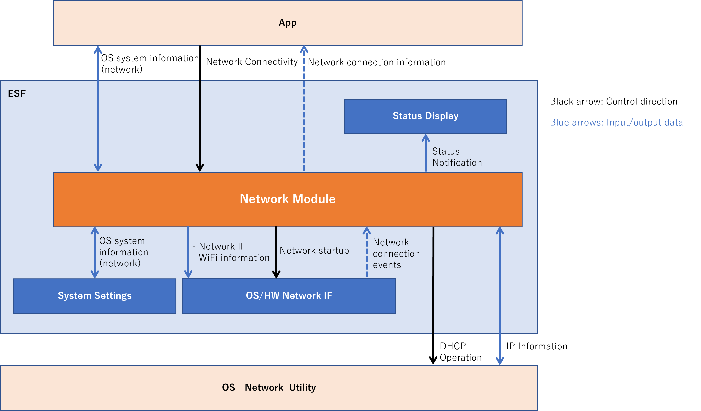
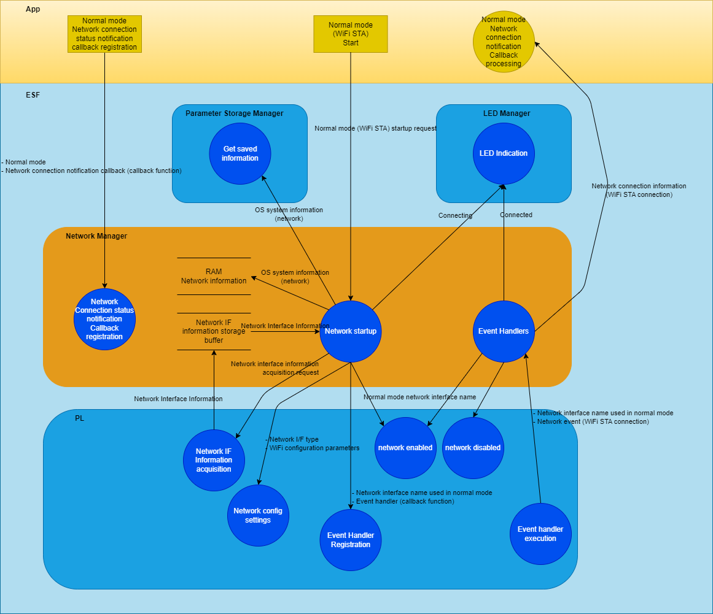
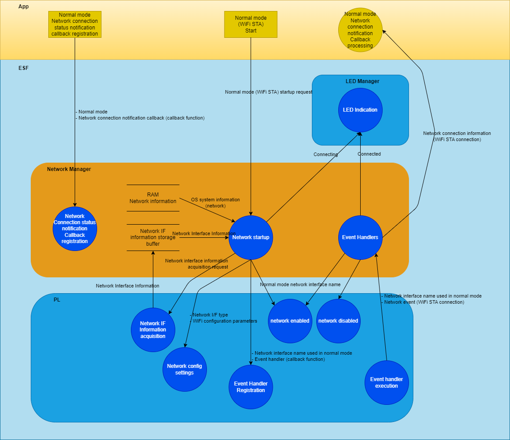
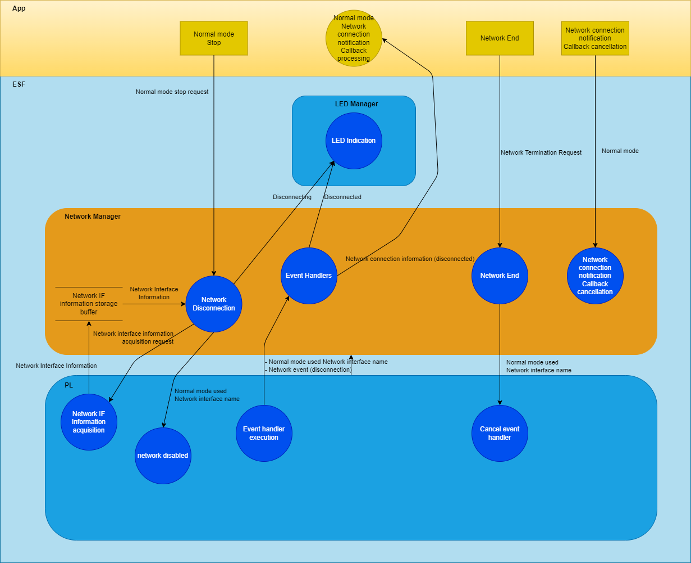

= AITRIOS Edge Device ESF Network Manager Functional Specification
:sectnums:
:sectnumlevels: 3
:chapter-label:
:revnumber: 0.1.14
:toc:
:toc-title: Table of Contents
:toclevels: 3
:lang: en
:xrefstyle: short
:figure-caption: Figure
:table-caption: Table
:section-refsig:
:experimental:
ifdef::env-github[:mermaid_block: source, mermaid,subs="attributes"]
ifndef::env-github[:mermaid_block: mermaid,subs="attributes"]
ifdef::env-github,env-vscode[:mermaid_break: break]
ifndef::env-github,env-vscode[:mermaid_break: opt]
ifdef::env-github,env-vscode[:mermaid_critical: critical]
ifndef::env-github,env-vscode[:mermaid_critical: opt]
ifdef::env-github[:mermaid_br: pass:p[&lt;br&gt;]]
ifndef::env-github[:mermaid_br: pass:p[ ]]

== Purpose and Scope

This document defines the Network Manager of AITRIOS. +
It applies to version XX of XX.

<<<

== Terminology
=== Ethernet
Ethernet is a communication standard used to transmit signals over a network by connecting devices via LAN (Local Area Network) cables or other wired methods. +
In this function, it is used when connecting a device booted in Normal mode via a wired connection. +
For details on Normal mode, refer to <<#_ComponentConnectMode, Network Connection Modes>>. +
In this document, it is referred to as "Eth."

=== Wi-Fi
Wi-Fi is a communication standard used to transmit signals over a network by wirelessly connecting devices. +

==== Wi-Fi Station Mode
Wi-Fi Station Mode is one of the operating modes of Wi-Fi devices, in which the device connects to a Wi-Fi access point as a client. +
In this function, it is used when connecting a device booted in Normal mode via a wireless connection. +
For details on Normal mode, refer to <<#_ComponentConnectMode, Network Connection Modes>>. +
In this document, it is referred to as "WiFi STA."

==== Wi-Fi Access Point Mode
Wi-Fi Access Point Mode is one of the operating modes of a Wi-Fi router, where the router function is disabled and it operates solely as a Wi-Fi access point. +
In this function, it is used when a device booted in AccessPoint mode is waiting for a wireless connection. +
For details on AccessPoint mode, refer to <<#_ComponentConnectMode, Network Connection Modes>>. +
In this document, it is referred to as "WiFi AP."

=== RSSI
RSSI (Received Signal Strength Indicator) refers to the strength of the received signal, expressed as a numerical value. +
In this function, a device booted in Normal mode using Wi-Fi Station Mode obtains the signal strength received from a Wi-Fi access point or router. +
For details on RSSI in this function, refer to <<#_FunctionGetInfo, Retrieving Network Information>>. +

<<<

== Component Description
=== Component Overview
The Network Manager provides functions for controlling the network-related aspects of a device. +
When the network configuration of the OS or hardware is changed, the Network Manager handles the response. +
Below is an example of the component overview diagram. +

.Overview Diagram

<<<

=== Detailed Component Description
[#_ComponentConnectMode]
==== Network Connection Modes
The Network Manager allows selection of the control network by specifying the connection type. +
It supports two types of operation: connecting to a network as a client device, and acting as a Wi-Fi Access Point that waits for external connections. +
These can be specified through the network connection mode. +
The available connection modes are listed below. +

NOTE: Wi-Fi Access Point operation is not supported. +

[#_ComponentTableConnectMode]
.Network Connection Mode List
[width="100%", cols="50%,50%",options="header"]
|===
|Network Connection Mode Name |Connection Type
|Normal Mode
|WiFi STA, Eth

|AccessPoint Mode (Not Supported)
|WiFi AP
|===

[#_ComponentProcess]
==== Network Operations
The Network Manager performs operations on network interfaces, retrieves information, and manages IP addresses. +
It provides the following three types of operations: +

* Operations using information specified by the upper layer +
* Operations using configuration retrieved from the Parameter Storage Manager +
* Operations using stored information (maintained in the Network Manager's RAM) +

For details, refer to <<#_DFD_StartSet, Data Flow Diagram: Network Startup (using configuration from Parameter Storage Manager)>> and +
<<#_DFD_StartRAM, Data Flow Diagram: Network Startup (using stored network information in RAM)>>. +

[#_ComponentWiFiStatus]
==== Network Status Notification
The Network Manager notifies the LED Manager of the network connection status and any operation errors. +
For details on notification content, refer to <<#_StatusWiFiStatus, LED Manager Status Notification>>. +

[#_ComponentNotifyInfo]
==== Network Connection Status Callback
The Network Manager calls the registered status callback function in response to changes in network connection status. +
For details on the notified states, refer to <<#_StatusNotifyInfo, Network Connection Status Notification>>. +

[#_ComponentDFD]
==== Data Flow Diagrams
The following diagrams show the network data flow for startup and shutdown in Normal mode. +
The data flow is the same for AccessPoint mode. +

* Network Startup (using configuration from Parameter Storage Manager) +

[#_DFD_StartSet]
.Data Flow Diagram: Network Startup (using configuration from Parameter Storage Manager)

* Network Startup (using stored configuration in RAM) +

[#_DFD_StartRAM]
.Data Flow Diagram: Network Startup (using stored network information in RAM)

* Network Shutdown +

[#_DFD_Stop]
.Data Flow Diagram: Network Shutdown

<<<

=== State Transitions
The Network Manager has the following state transitions:

* <<#_Status1, Network Manager Initialization State Transitions>> +
This describes the initialization state transition of the Network Manager. +
* <<#_Status2, Network Connection State Transitions>> +
This describes the network connection state transitions. +
Transitions occur based on network start/stop and event notifications received from the PL. +
Along with these transitions, callback notifications are sent to the application, and status notifications are sent to the LED Manager.

[#_Status1]
==== Network Manager Initialization State Transitions
The initialization states of the Network Manager are shown in <<#_TableStates1>>.

[#_TableStates1]
.State List
[width="100%", cols="20%,80%",options="header"]
|===
|State |Description

|UNINIT
|The uninitialized state. Functions other than initialization cannot be used.

|INIT
|The initialized state.
|===

The Network Manager transitions between states as shown in <<#_FigureState1>> when APIs are called. +
If an error occurs in an API, no state transition takes place. +

[#_FigureState1]
.State Transition Diagram
[{mermaid_block}]
----
stateDiagram-v2
    [*] --> UNINIT
    UNINIT --> INIT : EsfNetworkManagerInit
    INIT --> UNINIT : EsfNetworkManagerDeinit
    INIT --> INIT : Other APIs
----

The availability of each API per state and the resulting transition states are shown in <<#_TableStateTransition1>>. +
The state names in the table indicate the target state after successful API execution, meaning the API can be called in that state. +
An "×" indicates the API is not accepted in that state; calling it will return an error and no transition will occur. +

[#_TableStateTransition1]
.State Transition Table
[width="100%", cols="10%,30%,20%,20%"]
|===
2.2+| 2+|State
|UNINIT |INIT
.5+|API Name

|``**EsfNetworkManagerInit**``
|INIT
|INIT

|``**EsfNetworkManagerDeinit**``
|×
|UNINIT

|Other APIs
|×
|INIT
|===

[#_Status2]
==== Network Connection State Transitions
The list of network connection states is shown in <<#_TableStates2>>.

[#_TableStates2]
.Network Connection State List
[width="100%", cols="25%,25%,50%",options="header"]
|===
|Network Connection State |Description |Remarks
|Connecting
|Attempting to connect
|In the process of establishing a connection after executing EsfNetworkManagerStart.

|Connected
|Connected
|Connection established. +
If the connection is lost after being established, it transitions back to Connecting.

|Disconnecting
|Disconnecting
|After executing EsfNetworkManagerStop, before disconnection completes.

|Disconnected
|Disconnected
|After EsfNetworkManagerOpen and before EsfNetworkManagerStart is executed. +
Or after executing EsfNetworkManagerStop and disconnection completes.
|===

State transitions occur based on API calls to start/stop the network and received events, as shown in the diagrams below. +
No state transition occurs in the event of an API error or irrelevant event. +

[#_FigureState2_1]
.State Transition Diagram (Normal Mode Connection - Eth)
[{mermaid_block}]
----
stateDiagram-v2
    [*] --> Disconnected
    Disconnected --> Connecting : EsfNetworkManagerStart
    Connecting --> Disconnecting : EsfNetworkManagerStop（ifup state）
    Connecting --> Disconnected : EsfNetworkManagerStop（ifdown state）
    Connecting --> Connected : kPlNetworkEventIfUp (Linkup state)\n kPlNetworkEventLinkUp (ifup state)
    Connected --> Connecting : kPlNetworkEventLinkDown
    Connected --> Disconnecting : EsfNetworkManagerStop
    Disconnecting --> Disconnected : kPlNetworkEventIfDown
----

[#_FigureState2_2]
.State Transition Diagram (Normal Mode Connection - WiFi STA)
[{mermaid_block}]
----
stateDiagram-v2
    [*] --> Disconnected
    Disconnected --> Connecting : EsfNetworkManagerStart
    Connecting --> Disconnected : EsfNetworkManagerStop
    Connecting --> Connected : kPlNetworkEventWifiStaConnected
    Connected --> Connecting : kPlNetworkEventWifiStaDisconnected
    Connected --> Disconnected : EsfNetworkManagerStop
----

[#_FigureState2_3]
.State Transition Diagram (AccessPoint Mode Connection)
[{mermaid_block}]
----
stateDiagram-v2
    [*] --> Disconnected
    Disconnected --> Connecting : EsfNetworkManagerStart
    Connecting --> Disconnected : EsfNetworkManagerStop
    Connecting --> Connected : kPlNetworkEventWifiApConnected
    Connected --> Connecting : kPlNetworkEventWifiApDisconnected\n (when number of connections becomes 0)
    Connected --> Disconnected : EsfNetworkManagerStop
----

The acceptability of APIs in each state, received events, and their resulting transitions are shown in <<#_TableStateTransition2_1_1>>, <<#_TableStateTransition2_1_2>>, and <<#_TableStateTransition2_2>>. +
The state names in the tables indicate the target state after the event is received. If the event is an API, it also indicates that the API can be called in that state. +
"×" indicates the API is not accepted in that state; an error is returned and no transition occurs. +
For details on errors, refer to <<#_SampleResult>>. +
"－" indicates no state transition. +

[#_TableStateTransition2_1_1]
.State Transition Table (Normal Mode - Eth Connection)
[width="100%", cols="2%,23%,15%,15%,15%,15%"]
|===
2.2+|Event 4+|State
|Disconnected |Connecting |Connected| Disconnecting
.2+|API Call

|``**EsfNetworkManagerStart**``
|Connecting
|×
|×
|×

|``**EsfNetworkManagerStop**``
|×
|Ifup state: Disconnecting + 
Ifdown state: Disconnected
|Disconnecting
|×

.5+|PL Event
|``**kPlNetworkEventIfUp**``
|－
|Linkup state: Connected + 
Linkdown state: Connecting
|－
|－

|``**kPlNetworkEventLinkUp**``
|－
|Ifup state: Connected + 
Ifdown state: Connecting
|－
|－

|``**kPlNetworkEventIfDown**``
|－
|－
|－(*1)
|Disconnected

|``**kPlNetworkEventLinkDown**``
|－
|－
|Connecting
|－

|Other PL Events
|－
|－
|－
|－
|===
(*1) The IFDOWN event from the Connected state is discarded, as it is not expected to occur except after executing EsfNetworkManagerStop.

[#_TableStateTransition2_1_2]
.State Transition Table (Normal Mode - WiFi STA Connection)
[width="100%", cols="2%,23%,15%,15%,15%,15%"]
|===
2.2+|Event 4+|State
|Disconnected |Connecting |Connected| Disconnecting
.2+|API Call

|``**EsfNetworkManagerStart**``
|Connecting
|×
|×
|×

|``**EsfNetworkManagerStop**``
|×
|Disconnected(*1)
|Disconnected(*2)
|×

.5+|PL Event
|``**kPlNetworkEventWifiStaConnected**``
|－
|Connected +
|－
|－

|``**kPlNetworkEventWifiStaDisconnected**``
|－
|－
|Connecting
|－

|Other PL Events
|－
|－
|－
|－
|===
(*1) Some cameras do not support `kPlNetworkEventWifiStaStart` or `kPlNetworkEventWifiStaStop`, so there is no transition to Disconnecting. +  
(*2) There is no guarantee that `kPlNetworkEventWifiStaDisconnected` will be received after stopping from Connected, so transition to Disconnected is handled directly by EsfNetworkManagerStop.

[#_TableStateTransition2_2]
.State Transition Table (AccessPoint Mode Connection)
[width="100%", cols="2%,23%,15%,15%,15%,15%"]
|===
2.2+|Event 4+|State
|Disconnected |Connecting |Connected| Disconnecting
.2+|API Call

|``**EsfNetworkManagerStart**``
|Connecting
|×
|×
|×

|``**EsfNetworkManagerStop**``
|×
|Disconnected(*1)
|Disconnected(*2)
|×

.5+|PL Event
|``**kPlNetworkEventWifiApConnected**``
|－
|Connected + 
Connection count incremented(*3)
|－ + 
Connection count incremented
|－

|``**kPlNetworkEventWifiApDisconnected**``
|－
|－
|Connection count decremented + 
If connection count = 0: Connecting + 
If not 0: －
|－

|Other PL Events
|－
|－
|－
|－
|===
(*1) Some cameras do not support `kPlNetworkEventWifiApStop`, so there is no condition for transition to Disconnecting. +  
(*2) There is no guarantee that `kPlNetworkEventWifiApDisconnected` will be received after stopping from Connected, so transition to Disconnected is handled directly by EsfNetworkManagerStop. +  
(*3) Events are received for every connection and disconnection to the AP. As long as there is at least one connection, the state is considered Connected.

[#_StatusWiFiStatus]
===== Network State Notification
The network connection state is reported to the LED Manager. +

.Notification Content List
[width="100%", cols="20%,20%,20%,40%",options="header"]
|===
|Event |Meaning |Target LED Type |Trigger for Operation
|SSID/Password Loading
|Loading SSID/password.
|WiFi LED
a|* ON  
** After verifying the validity of connection information when starting connection in WiFi STA  
* OFF  
** When connection start fails in WiFi STA  
** When disconnection succeeds  
** When other WiFi LED status turns ON

|AP Found And Doing Authentication
|Authenticating with AP.
|WiFi LED
a|* ON  
** Upon successful start of connection in WiFi STA  
* OFF  
** When disconnection succeeds  
** When other WiFi LED status turns ON

|Link Established
|Link established.
|WiFi LED
a|* ON  
** When communication with Access Point begins in WiFi STA  
* OFF  
** When disconnection succeeds  
** When disconnection from connected AP is detected  
** When other WiFi LED status turns ON

|Disconnected, Establishing Network Link On Physical Layer
|Disconnected (establishing physical link).
|Service LED
a|* ON  
** When connection starts successfully  
* OFF  
** When disconnection succeeds  
** When other Service LED status turns ON

|Disconnected, No Internet Connection
|Disconnected (no internet connection).
|Service LED
a|* ON  
** When DHCP IP address acquisition starts  
* OFF  
** When disconnection succeeds  
** When disconnection from connected AP is detected  
** When physical link is lost  
** When interface disconnection is detected

|Disconnected, Connecting DNS and NTP
|Disconnected (attempting DNS and NTP connection).
|Service LED
a|* ON  
** When communication with Access Point begins in WiFi STA  
** When both interface and link are UP in Ethernet  
* OFF  
** When disconnection succeeds  
** When disconnection from connected AP is detected  
** When physical link is lost  
** When interface disconnection is detected
|===

[#_StatusNotifyInfo]
===== Network Connection State Notification
The registered status notification callback function is called based on the network connection state. +
The notification contents and triggers are primarily linked to the transitions defined in <<#_TableStates2, Network State Notification>>. +
The transitions and corresponding notifications are listed in <<#_StatusTableNotifyInfo, Network Connection Status Notification Information List>>. +
For more details on notification content, refer to <<#_SampleNotifyInfo, EsfNetworkManagerNotifyInfo>>.

[#_StatusTableNotifyInfo]
.Network Connection Status Notification Information List
[width="100%", cols="10%,30%,20%,20%,20%,20%"]
|===
2.2+|New State / Event 4+|Previous State
|Disconnected |Connecting |Connected| Disconnecting
.4+|New State
|Disconnected +
|－
|－
|kEsfNetworkManagerNotifyInfoDisconnected
|kEsfNetworkManagerNotifyInfoDisconnected

|Connecting +
|－
|－
|kEsfNetworkManagerNotifyInfoDisconnected
|－

|Connected +
|－
|kEsfNetworkManagerNotifyInfoConnected
|－
|－

|Disconnecting +
|－
|－
|－
|－

.5+|Event
|kPlNetworkEventWifiApStart +
|－
|kEsfNetworkManagerNotifyInfoApStart
|－
|－
|===

<<<

=== Component Function List
The list of functions is shown in <<#_TableFunction>>.

[#_TableFunction]
.Function List
[width="100%", cols="35%,57%,8%",options="header"]
|===
|Function Name |Description |Section Number
|Initialization Function
|Provides the initialization function of the Network Manager.
|<<#_FunctionInitialize>>

|Handle Function
|Provides functions related to the handle of the Network Manager.
|<<#_FunctionHandle>>

|Network Connection Control
|Provides functions to control network connection.
|<<#_FunctionConnection>>

|Network Information Retrieval
|Provides functions to retrieve various network information.
|<<#_FunctionGetInfo>>

|Callback Notification Control
|Provides functions to register and unregister callback functions that notify network connection status.
|<<#_FunctionCallback>>

|Network Connection Information Storage
|Handles saving and retrieval of network connection information.
|<<#_FunctionNetworkSetting>>
|===

<<<

=== Component Function Descriptions

[#_FunctionInitialize]
==== Initialization Function
* Function Overview +
Initializes the Network Manager. +
Must be executed before calling other Network Manager APIs.
* Prerequisites +
None.
* Function Details
    ** Detailed Behavior +
        By calling ``**EsfNetworkManagerInit**``, internal states are initialized and required resources are allocated. +
        Also initializes the PL functions used. +
        After initialization, Network Manager APIs can be used. +
        By calling ``**EsfNetworkManagerDeinit**``, resources are released and the internal state returns to uninitialized. +
        Also terminates the PL functions used. +
        Do not call these APIs concurrently.

    ** Error Behavior and Recovery +
        See <<#_SampleFunctionInit, Initialization Function API>> for details in each API description.

[#_FunctionHandle]
==== Handle Function
* Function Overview +
Manages handles required for using Network Manager APIs.
* Prerequisites +
Network Manager must be initialized.
* Function Details
    ** Detailed Behavior +
        By calling ``**EsfNetworkManagerOpen**``, a handle is allocated and Network Manager APIs become available. +
        Handles are acquired per <<#_SampleMode, Connection Mode>> and <<#_SampleHandleType, Handle Type>>. +
        Subsequent API calls will perform operations on the network corresponding to the specified connection mode, constrained by the permissions of the specified handle type. +
        When a handle is no longer needed, call ``**EsfNetworkManagerClose**`` to release it. +
        This function allows exclusive operations and can be safely called from multiple threads.

    ** Error Behavior and Recovery +
        See <<#_SampleFunctionOpen, Handle Function API>> for details in each API description.

[#_FunctionConnection]
==== Network Connection Control
* Function Overview +
Starts and stops network connections.
* Prerequisites +
A handle of type "Control Handle" must be acquired.
* Function Details
    ** Detailed Behavior +
        *** By calling ``**EsfNetworkManagerStart**``, network connection for the connection mode specified at handle acquisition begins. +
        The connection is established using the user-specified connection settings. +
        Notifies connection status to the LED Manager based on connection state. +
        Uses the PL and OS Network Utility to establish the connection. +
        The OS Network Utility is used for DHCP and IP configuration. PL is used for: +
        **** Registering and executing event handlers +
        **** Setting WiFi information +
        **** Enabling the network +

        *** By calling ``**EsfNetworkManagerStop**``, network disconnection starts for the connection mode specified at handle acquisition. +
        Notifies disconnection status to the LED Manager. +
        Uses the PL and OS Network Utility to disconnect. +
        The OS Network Utility is used for DHCP and IP configuration. PL is used for: +
        **** Disabling the network +

        *** If disconnection is detected during a connection initiated in WiFi STA mode, reconnection will be attempted using PL.

    ** Error Behavior and Recovery +
        See <<#_SampleFunctionStart, Network Connection Control API>> for details in each API description.

[#_FunctionGetInfo]
==== Network Information Retrieval
* Function Overview +
Retrieves various network information.
* Prerequisites +
A handle of type "Control Handle" or "Information Handle" must be acquired.
* Function Details
    ** Detailed Behavior +
        *** By calling ``**EsfNetworkManagerGetIFStatus**``, retrieves the network status for the connection mode specified at handle acquisition. +
        *** By calling ``**EsfNetworkManagerGetIFInfo**``, retrieves the network information for the specified connection mode. +
        *** By calling ``**EsfNetworkManagerGetNetstat**``, retrieves Netstat information. +
        *** By calling ``**EsfNetworkManagerGetRssi**``, retrieves RSSI information. +
        RSSI can only be retrieved in Normal mode with a WiFi connection. +

    ** Error Behavior and Recovery +
        See <<#_SampleFunctionGetIFStatus, Network Information Retrieval API>> for details in each API description.

[#_FunctionCallback]
==== Callback Notification Control
* Function Overview +
Registers and unregisters callback functions that notify network connection status.
* Prerequisites +
A handle of type "Control Handle" or "Information Handle" must be acquired.
* Function Details
    ** Detailed Behavior +
        *** By calling ``**EsfNetworkManagerRegisterCallback**``, registers a callback function to receive network connection status notifications for the connection mode specified at handle acquisition. +
        For details on the notified content, refer to <<#_ComponentNotifyInfo, Network Connection State Notification>>. +
        *** By calling ``**EsfNetworkManagerUnregisterCallback**``, unregisters the callback function previously registered. +

    ** Error Behavior and Recovery +
        See <<#_SampleFunctionReg, Callback Notification Control API>> for details in each API description.

[#_FunctionNetworkSetting]
==== Network Connection Information Storage
* Function Overview +
Saves and retrieves network connection information.
* Prerequisites +
None.
* Function Details
    ** Detailed Behavior +
        *** By calling ``**EsfNetworkManagerSaveParameter**`` or ``**EsfNetworkManagerSaveVariantParameter**``, saves network connection information via the Parameter Storage Manager. +
        *** By calling ``**EsfNetworkManagerLoadParameter**`` or ``**EsfNetworkManagerLoadVariantParameter**``, retrieves network connection information via the Parameter Storage Manager. +

    ** Error Behavior and Recovery +
        See <<#_SampleFunctionSaveParameter, Network Connection Information Storage API>> for details in each API description.

<<<

=== Non-Functional Requirements of the Component

The list of non-functional requirements is shown in <<#_TableNonFunction>>.

[#_TableNonFunction]
.Non-Functional Requirement List
[width="100%", cols="30%,55%,15%",options="header"]
|===
|Requirement Name |Description |Section Number
|Maximum Stack Usage
|Indicates the maximum size of the stack area used.
|<<#_NonFunction1>>

|Maximum Heap Usage
|Indicates the maximum size of the heap area used.
|<<#_NonFunction2>>

|Maximum Static Memory Usage
|Indicates the maximum size of memory allocated statically.
|<<#_NonFunction3>>

|Number of Threads Used
|Indicates the number of threads used.
|<<#_NonFunction4>>
|===

<<<

=== Non-Functional Requirement Descriptions

[#_NonFunction1]
==== Maximum Stack Usage
The stack uses 512 bytes.

[#_NonFunction2]
==== Maximum Heap Usage
The heap area uses 4 kilobytes.

[#_NonFunction3]
==== Maximum Static Memory Usage
The static memory uses 128 bytes.

[#_NonFunction4]
==== Number of Threads Used
No threads are used.

<<<

== API Specifications
=== Definition List
==== Data Type List
The list of data types is shown in <<#_TableDataType>>.

[#_TableDataType]
.Data Type List
[width="100%", cols="30%,55%,15%",options="header"]
|===
|Data Type Name |Description |Section Number
|EsfNetworkManagerResult
|Enumeration defining the result of API execution.
|<<#_SampleResult>>

|EsfNetworkManagerHandle
|Definition of the Network Manager handle.
|<<#_EsfNetworkManagerHandle>>

|EsfNetworkManagerMode
|Enumeration defining the connection mode.
|<<#_SampleMode>>

|EsfNetworkManagerHandleType
|Enumeration defining the handle type.
|<<#_SampleHandleType>>

|EsfNetworkManagerNotifyInfo
|Enumeration defining the network connection status. Used in EsfNetworkManagerNotifyInfoCallback.
|<<#_SampleNotifyInfo>>

|EsfNetworkManagerStartType
|Enumeration defining the network start type.
|<<#_SampleStartType>>

|EsfNetworkManagerParameterType
|Enumeration defining the type of network connection parameters.
|<<#_SampleParameterType>>

|ESF_NETWORK_MANAGER_IP_ADDRESS_LEN
|Macro defining the IP address length.
|<<#_SampleIpAddrLen>>

|ESF_NETWORK_MANAGER_WIFI_SSID_LEN
|Macro defining the WiFi SSID length.
|<<#_SampleWifiSsidLen>>

|ESF_NETWORK_MANAGER_WIFI_PASSWORD_LEN
|Macro defining the WiFi password length.
|<<#_SampleWifiPasswordLen>>

|ESF_NETWORK_MANAGER_PROXY_URL_LEN
|Macro defining the proxy URL length.
|<<#_SampleProxyUrlLen>>

|ESF_NETWORK_MANAGER_PROXY_USER_NAME_LEN
|Macro defining the proxy user name length.
|<<#_SampleProxyUserNameLen>>

|ESF_NETWORK_MANAGER_PROXY_PASSWORD_LEN
|Macro defining the proxy password length.
|<<#_SampleProxyPasswordLen>>

|EsfNetworkManagerOSInfo
|Union type for OS system-related information.
|<<#_SampleOSInfo>>

|EsfNetworkManagerNormalMode
|Structure for Normal mode information.
|<<#_SampleNormal>>

|EsfNetworkManagerAccessPointMode
|Structure for AccessPoint mode information.
|<<#_SampleAccessPoint>>

|EsfNetworkManagerIPInfo
|Structure for IP information.
|<<#_SampleIP>>

|EsfNetworkManagerWiFiStaInfo
|Structure for WiFi STA information.
|<<#_SampleWiFiSta>>

|EsfNetworkManagerWiFiApInfo
|Structure for WiFi AP information.
|<<#_SampleWiFiAp>>

|EsfNetworkManagerStatusInfo
|Structure representing the network connection status.
|<<#_SampleStatus>>

|EsfNetworkManagerNotifyInfoCallback
|Pointer type for the callback function used for network status notifications.
|<<#_SampleFunctionCallbackNotify>>

|EsfNetworkManagerParameter
|Structure for network connection parameters.
|<<#_SampleParameter>>

|EsfNetworkManagerParameterMask
|Structure for masking network connection parameters. +
|<<#_SampleParameterMask>>

|EsfNetworkManagerVariantParameter
|Union type for network connection parameters.
|<<#_SampleVariantParameter>>

|EsfNetworkManagerVariantParameterMask
|Union type for masking network connection parameters.
|<<#_SampleVariantParameterMask>>

|EsfNetworkManagerNormalModeMask
|Structure for masking Normal mode information. +
|<<#_SampleNormalMask>>

|EsfNetworkManagerAccessPointModeMask
|Structure for masking AccessPoint mode information. +
|<<#_SampleAccessPointMask>>

|EsfNetworkManagerIPInfoMask
|Structure for masking IP information. +
|<<#_SampleIPMask>>

|EsfNetworkManagerWiFiStaInfoMask
|Structure for masking WiFi STA information. +
|<<#_SampleWiFiStaMask>>

|EsfNetworkManagerWiFiApInfoMask
|Structure for masking WiFi AP information. +
|<<#_SampleWiFiApMask>>

|EsfNetworkManagerProxy
|Structure for proxy information.
|<<#_SampleProxy>>

|EsfNetworkManagerProxyMask
|Structure for masking proxy information.
|<<#_SampleProxyMask>>
|===

==== API List
The list of APIs is shown in <<#_TableAPI>>.

[#_TableAPI]
.API List
[width="100%", cols="30%,55%,15%",options="header"]
|===
|API Name |Description |Section Number
|EsfNetworkManagerInit
|Initializes the Network Manager.
|<<#_SampleFunctionInit>>

|EsfNetworkManagerDeinit
|Terminates the Network Manager.
|<<#_SampleFunctionDeinit>>

|EsfNetworkManagerOpen
|Acquires a handle for the Network Manager.
|<<#_SampleFunctionOpen>>

|EsfNetworkManagerClose
|Releases a handle for the Network Manager.
|<<#_SampleFunctionClose>>

|EsfNetworkManagerStart
|Starts a network connection.
|<<#_SampleFunctionStart>>

|EsfNetworkManagerStop
|Stops a network connection.
|<<#_SampleFunctionStop>>

|EsfNetworkManagerGetIFStatus
|Retrieves the network connection status.
|<<#_SampleFunctionGetIFStatus>>

|EsfNetworkManagerGetIFInfo
|Retrieves network information.
|<<#_SampleFunctionGetIFInfo>>

|EsfNetworkManagerGetNetstat
|Retrieves Netstat information.
|<<#_SampleFunctionGetNetstat>>

|EsfNetworkManagerGetRssi
|Retrieves RSSI information.
|<<#_SampleFunctionGetRssi>>

|EsfNetworkManagerRegisterCallback
|Registers a callback function for network connection status notifications.
|<<#_SampleFunctionReg>>

|EsfNetworkManagerUnregisterCallback
|Unregisters a callback function for network connection status notifications.
|<<#_SampleFunctionUnRegister>>

|ESF_NETWORK_MANAGER_INIT_INFO_NORMAL_WIFI
|Initializes the OS system information union with the following settings: +
・Normal mode +
・DHCP enabled +
・Connection type: WiFi
|<<#_SampleFunctionInitNormalWiFi>>

|ESF_NETWORK_MANAGER_INIT_INFO_NORMAL_ETH
|Initializes the OS system information union with the following settings: +
・Normal mode +
・DHCP enabled +
・Connection type: Ethernet
|<<#_SampleFunctionInitNormalEth>>

|ESF_NETWORK_MANAGER_INIT_INFO_AP
|Initializes the OS system information union with the following settings: +
・AccessPoint mode +
・Default IP address used +
・Specified SSID and password set
|<<#_SampleFunctionInitAccessPoint>>

|ESF_NETWORK_MANAGER_MASK_ENABLE_ALL
|Sets all elements in the mask structure to "enabled (1)". +
|<<#_ESF_NETWORK_MANAGER_MASK_ENABLE_ALL>>

|ESF_NETWORK_MANAGER_MASK_DISABLE_ALL
|Sets all elements in the mask structure to "disabled (0)". +
|<<#_ESF_NETWORK_MANAGER_MASK_DISABLE_ALL>>

|EsfNetworkManagerSaveParameter
|Saves network connection information via the Parameter Storage Manager.
|<<#_SampleFunctionSaveParameter>>

|EsfNetworkManagerLoadParameter
|Loads network connection information via the Parameter Storage Manager.
|<<#_SampleFunctionLoadParameter>>

|EsfNetworkManagerSaveVariantParameter
|Saves network connection information via the Parameter Storage Manager. +
Connection information is specified as a union.
|<<#_SampleFunctionSaveVariantParameter>>

|EsfNetworkManagerLoadVariantParameter
|Loads network connection information via the Parameter Storage Manager. +
Connection information is specified as a union.
|<<#_SampleFunctionLoadVariantParameter>>
|===

<<<

=== Data Type Definitions

[#_SampleResult]
==== EsfNetworkManagerResult
Enumeration that defines the result of executing a Network Manager API. +

* *Format*

[source, C]
....
typedef enum EsfNetworkManagerResult {
    kEsfNetworkManagerResultSuccess = 0,
    kEsfNetworkManagerResultHWIFError,
    kEsfNetworkManagerResultUtilityDHCPServerError,
    kEsfNetworkManagerResultUtilityIPAddressError,
    kEsfNetworkManagerResultExternalError,
    kEsfNetworkManagerResultStatusUnexecutable,
    kEsfNetworkManagerResultStatusAlreadyRunning,
    kEsfNetworkManagerResultInvalidParameter,
    kEsfNetworkManagerResultNoConnectInfo,
    kEsfNetworkManagerResultAlreadyCallbackRegistered,
    kEsfNetworkManagerResultAlreadyCallbackUnregistered,
    kEsfNetworkManagerResultResourceExhausted,
    kEsfNetworkManagerResultInternalError,
    kEsfNetworkManagerResultNotFound,
    kEsfNetworkManagerResultInvalidHandleType,
    kEsfNetworkManagerResultFailedPrecondition,
} EsfNetworkManagerResult;
....

* *Values*

[#_TableReturnValueResult]
.Description of EsfNetworkManagerResult Values
[width="100%", cols="30%,70%",options="header"]
|===
|Member Name |Description
|kEsfNetworkManagerResultSuccess
|The operation completed successfully.

|kEsfNetworkManagerResultHWIFError
|PL API execution error.

|kEsfNetworkManagerResultUtilityDHCPServerError
|DHCP server error.

|kEsfNetworkManagerResultUtilityIPAddressError
|IP address operation error.

|kEsfNetworkManagerResultExternalError
|External API execution error.

|kEsfNetworkManagerResultStatusUnexecutable
|Not in a state where execution is possible.

|kEsfNetworkManagerResultStatusAlreadyRunning
|The operation is already running.

|kEsfNetworkManagerResultInvalidParameter
|Invalid parameter.

|kEsfNetworkManagerResultNoConnectInfo
|No connection information is available.

|kEsfNetworkManagerResultAlreadyCallbackRegistered
|Callback function is already registered.

|kEsfNetworkManagerResultAlreadyCallbackUnregistered
|Callback function is already unregistered.

|kEsfNetworkManagerResultResourceExhausted
|Insufficient resources.

|kEsfNetworkManagerResultInternalError
|Internal error.

|kEsfNetworkManagerResultNotFound
|Handle mismatch error.

|kEsfNetworkManagerResultInvalidHandleType
|Handle type error.

|kEsfNetworkManagerResultFailedPrecondition
|Operation was rejected.
|===

[#_EsfNetworkManagerHandle]
==== EsfNetworkManagerHandle
Definition of the Network Manager handle.

* *Format*

[source, C]
....
typedef int32_t EsfNetworkManagerHandle;
#define ESF_NETWORK_MANAGER_INVALID_HANDLE (-1)
....

[#_SampleMode]
==== EsfNetworkManagerMode
Enumeration that defines the connection mode.

* *Format*

[source, C]
....
typedef enum EsfNetworkManagerMode {
    kEsfNetworkManagerModeNormal,
    kEsfNetworkManagerModeAccessPoint,
    kEsfNetworkManagerModeNum,
} EsfNetworkManagerMode;
....

* *Values*

[#_TableReturnValueMode]
.Description of EsfNetworkManagerMode Values
[width="100%", cols="30%,70%",options="header"]
|===
|Member Name |Description
|kEsfNetworkManagerModeNormal
|Normal mode.

|kEsfNetworkManagerModeAccessPoint
|AccessPoint mode. (Not supported)

|kEsfNetworkManagerModeNum
|Number of enum definitions.
|===

[#_SampleHandleType]
==== EsfNetworkManagerHandleType
Enumeration that defines the handle type.

* *Format*

[source, C]
....
typedef enum EsfNetworkManagerHandleType {
    kEsfNetworkManagerHandleTypeControl,
    kEsfNetworkManagerHandleTypeInfo,
    kEsfNetworkManagerHandleTypeNum,
} EsfNetworkManagerHandleType;
....

* *Values*

[#_TableHandleType]
.Description of EsfNetworkManagerHandleType Values
[width="100%", cols="30%,70%",options="header"]
|===
|Member Name |Description
|kEsfNetworkManagerHandleTypeControl
|Control handle. +
Allows all operations.

|kEsfNetworkManagerHandleTypeInfo
|Information handle. +
Allows network information retrieval and callback control. +
Network connection control is not allowed.

|kEsfNetworkManagerHandleTypeNum
|Number of enum definitions.
|===

[#_SampleNotifyInfo]
==== EsfNetworkManagerNotifyInfo
Enumeration that defines the network connection status. Used in EsfNetworkManagerNotifyInfoCallback.

* *Format*

[source, C]
....
typedef enum EsfNetworkManagerNotifyInfo {
    kEsfNetworkManagerNotifyInfoConnected = 0,
    kEsfNetworkManagerNotifyInfoDisconnected,
    kEsfNetworkManagerNotifyInfoApStart,
    kEsfNetworkManagerNotifyInfoNum
} EsfNetworkManagerNotifyInfo;
....

* *Values*

[#_TableReturnValueNotifyInfo]
.Description of EsfNetworkManagerNotifyInfo Values
[width="100%", cols="30%,70%",options="header"]
|===
|Member Name |Description
|kEsfNetworkManagerNotifyInfoConnected
|Connected.

|kEsfNetworkManagerNotifyInfoDisconnected
|Disconnected.

|kEsfNetworkManagerNotifyInfoApStart
|WiFi AP has started operating. (Used only in AccessPoint mode)

|kEsfNetworkManagerNotifyInfoNum
|Number of enum definitions.
|===

[#_SampleStartType]
==== EsfNetworkManagerStartType
Enumeration that defines the type of network connection start.

* *Format*

[source, C]
....
typedef enum EsfNetworkManagerStartType {
    kEsfNetworkManagerStartTypeFuncParameter = 0,
    kEsfNetworkManagerStartTypeSaveParameter,
    kEsfNetworkManagerStartTypeLastStartSuccessParameter,
    kEsfNetworkManagerStartTypeNum
} EsfNetworkManagerStartType;
....

* *Values*

[#_TableStartType]
.Description of EsfNetworkManagerStartType Values
[width="100%", cols="30%,70%",options="header"]
|===
|Member Name |Description
|kEsfNetworkManagerStartTypeFuncParameter
|Uses function-specified parameters.

|kEsfNetworkManagerStartTypeSaveParameter
|Uses saved parameters.

|kEsfNetworkManagerStartTypeLastStartSuccessParameter
|Uses parameters from the last successful Start.

|kEsfNetworkManagerStartTypeNum
|Number of enum definitions.
|===

[#_SampleParameterType]
==== EsfNetworkManagerParameterType
Enumeration that defines the type of network connection parameters.

* *Format*

[source, C]
....
typedef enum EsfNetworkManagerParameterType {
    kEsfNetworkManagerParameterTypeNormal,
    kEsfNetworkManagerParameterTypeAccessPoint,
    kEsfNetworkManagerParameterTypeProxy,
    kEsfNetworkManagerParameterTypeNum,
} EsfNetworkManagerParameterType;
....

* *Values*

[#_TableParameterType]
.Description of EsfNetworkManagerParameterType Values
[width="100%", cols="30%,70%",options="header"]
|===
|Member Name |Description
|kEsfNetworkManagerParameterTypeNormal
|Normal connection information.

|kEsfNetworkManagerParameterTypeAccessPoint
|AccessPoint connection information. (Not supported)

|kEsfNetworkManagerParameterTypeProxy
|Proxy connection information.

|kEsfNetworkManagerParameterTypeNum
|Number of enum definitions.
|===

[#_SampleIpAddrLen]
==== ESF_NETWORK_MANAGER_IP_ADDRESS_LEN
Macro that defines the length of an IP address.

* *Format*

[source, C]
....
#define ESF_NETWORK_MANAGER_IP_ADDRESS_LEN (39+1)
....

* *Value*

[#_TableIpAddrLen]
.Description of ESF_NETWORK_MANAGER_IP_ADDRESS_LEN
[width="100%", cols="30%,70%",options="header"]
|===
|Name |Description
|ESF_NETWORK_MANAGER_IP_ADDRESS_LEN
|IP address length. Defines 40 bytes: maximum 39 characters for IPv6 + 1 NULL terminator.
|===

[#_SampleWifiSsidLen]
==== ESF_NETWORK_MANAGER_WIFI_SSID_LEN
Macro that defines the length of a WiFi SSID.

* *Format*

[source, C]
....
#define ESF_NETWORK_MANAGER_WIFI_SSID_LEN (32+1)
....

* *Value*

[#_TableWifiSsidLen]
.Description of ESF_NETWORK_MANAGER_WIFI_SSID_LEN
[width="100%", cols="30%,70%",options="header"]
|===
|Name |Description
|ESF_NETWORK_MANAGER_WIFI_SSID_LEN
|WiFi SSID length. Defines 33 bytes: 32 characters + 1 NULL terminator.
|===

[#_SampleWifiPasswordLen]
==== ESF_NETWORK_MANAGER_WIFI_PASSWORD_LEN
Macro that defines the length of a WiFi password.

* *Format*

[source, C]
....
#define ESF_NETWORK_MANAGER_WIFI_PASSWORD_LEN (64+1)
....

* *Value*

[#_TableWifiPasswordLen]
.Description of ESF_NETWORK_MANAGER_WIFI_PASSWORD_LEN
[width="100%", cols="30%,70%",options="header"]
|===
|Name |Description
|ESF_NETWORK_MANAGER_WIFI_PASSWORD_LEN
|WiFi password length. Defines 65 bytes: 64 characters + 1 NULL terminator.
|===

[#_SampleProxyUrlLen]
==== ESF_NETWORK_MANAGER_PROXY_URL_LEN
Macro that defines the length of the proxy URL.

* *Format*

[source, C]
....
#define ESF_NETWORK_MANAGER_PROXY_URL_LEN (256+1)
....

* *Value*

[#_TableProxyUrlLen]
.Description of ESF_NETWORK_MANAGER_PROXY_URL_LEN
[width="100%", cols="30%,70%",options="header"]
|===
|Name |Description
|ESF_NETWORK_MANAGER_PROXY_URL_LEN
|Proxy URL length. Defines 257 bytes: 256 characters + 1 NULL terminator.
|===

[#_SampleProxyUserNameLen]
==== ESF_NETWORK_MANAGER_PROXY_USER_NAME_LEN
Macro that defines the length of the proxy user name.

* *Format*

[source, C]
....
#define ESF_NETWORK_MANAGER_PROXY_USER_NAME_LEN (32+1)
....

* *Value*

[#_TableProxyUserNameLen]
.Description of ESF_NETWORK_MANAGER_PROXY_USER_NAME_LEN
[width="100%", cols="30%,70%",options="header"]
|===
|Name |Description
|ESF_NETWORK_MANAGER_PROXY_USER_NAME_LEN
|Proxy user name length. Defines 33 bytes: 32 characters + 1 NULL terminator.
|===

[#_SampleProxyPasswordLen]
==== ESF_NETWORK_MANAGER_PROXY_PASSWORD_LEN
Macro that defines the length of the proxy password.

* *Format*

[source, C]
....
#define ESF_NETWORK_MANAGER_PROXY_PASSWORD_LEN (32+1)
....

* *Value*

[#_TableProxyPasswordLen]
.Description of ESF_NETWORK_MANAGER_PROXY_PASSWORD_LEN
[width="100%", cols="30%,70%",options="header"]
|===
|Name |Description
|ESF_NETWORK_MANAGER_PROXY_PASSWORD_LEN
|Proxy password length. Defines 33 bytes: 32 characters + 1 NULL terminator.
|===

[#_SampleOSInfo]
==== EsfNetworkManagerOSInfo
Union that contains network information for the OS system.

* *Format*

[source, C]
....
typedef union EsfNetworkManagerOSInfo {
    EsfNetworkManagerNormalMode normal_mode;
    EsfNetworkManagerAccessPointMode accesspoint_mode;
} EsfNetworkManagerOSInfo;
....

* *Values*

[#_TableOSInfo]
.Description of EsfNetworkManagerOSInfo Members
[width="100%", cols="20%,80%",options="header"]
|===
|Member Name |Description
|normal_mode
|Network information for Normal mode. +

|accesspoint_mode
|Network information for AccessPoint mode. (Not supported) +
|===

[#_SampleNormal]
==== EsfNetworkManagerNormalMode
Structure for Normal mode information.

* *Format*

[source, C]
....
typedef struct EsfNetworkManagerNormalMode {
    EsfNetworkManagerIPInfo dev_ip;
    EsfNetworkManagerIPInfo dev_ip_v6;
    EsfNetworkManagerWiFiStaInfo wifi_sta;
    int32_t ip_method;
    int32_t netif_kind;
} EsfNetworkManagerNormalMode;
....

* *Values*

[#_TableReturnValueNormal]
.Description of EsfNetworkManagerNormalMode Members
[width="100%", cols="20%,80%",options="header"]
|===
|Member Name |Description
|dev_ip
|Static IP information for the device in Normal mode. +

|dev_ip_v6
|Static IPv6 IP information for the device in Normal mode. (Not supported) +
Available when IPv6 configuration is enabled. +

|wifi_sta
|WiFi connection information when in WiFi STA mode under Normal mode. +

|ip_method
|Specifies whether DHCP is used for the device IP. +
0: DHCP +
1: Static

|netif_kind
|Specifies the type of network interface for the device. +
0: WiFi +
1: Ethernet +
|===

[#_SampleAccessPoint]
==== EsfNetworkManagerAccessPointMode
Structure for AccessPoint mode information.

* *Format*

[source, C]
....
typedef struct EsfNetworkManagerAccessPointMode {
    EsfNetworkManagerIPInfo dev_ip;
    EsfNetworkManagerWiFiApInfo wifi_ap;
} EsfNetworkManagerAccessPointMode;
....

* *Values*

[#_TableReturnValueAccessPoint]
.Description of EsfNetworkManagerAccessPointMode Members
[width="100%", cols="20%,80%",options="header"]
|===
|Member Name |Description
|dev_ip
|Static IPv4 address information for the device in AccessPoint mode. +
If not configured (left as per ESF_NETWORK_MANAGER_INIT_INFO_AP), the following default values are used: +
dev_ip.ip = 192.168.4.1 +
dev_ip.subnet_mask = 255.255.255.0 +
dev_ip.gateway = 192.168.4.1 +
dev_ip.dns = 0.0.0.0 +

|wifi_ap
|WiFi AP information in AccessPoint mode. +
|===

[#_SampleIP]
==== EsfNetworkManagerIPInfo
Structure for IP information.

* *Format*

[source, C]
....
typedef struct EsfNetworkManagerIPInfo {
    char ip[ESF_NETWORK_MANAGER_IP_ADDRESS_LEN];
    char subnet_mask[ESF_NETWORK_MANAGER_IP_ADDRESS_LEN];
    char gateway[ESF_NETWORK_MANAGER_IP_ADDRESS_LEN];
    char dns[ESF_NETWORK_MANAGER_IP_ADDRESS_LEN];
} EsfNetworkManagerIPInfo;
....

* *Values*

[#_TableReturnValueIP]
.Description of EsfNetworkManagerIPInfo Members
[width="100%", cols="20%,80%",options="header"]
|===
|Member Name |Description
|ip
|IP address. +

|subnet_mask
|Subnet mask. +
Specify in IP address format.

|gateway
|Gateway. +
Specify in IP address format.

|dns
|DNS. +
Specify in IP address format.
|===

[#_SampleWiFiSta]
==== EsfNetworkManagerWiFiStaInfo
Structure for WiFi STA information.

* *Format*

[source, C]
....
typedef struct EsfNetworkManagerWiFiStaInfo {
    char ssid[ESF_NETWORK_MANAGER_WIFI_SSID_LEN];
    char password[ESF_NETWORK_MANAGER_WIFI_PASSWORD_LEN];
    int32_t encryption;
} EsfNetworkManagerWiFiStaInfo;
....

* *Values*

[#_TableWiFiSta]
.Description of EsfNetworkManagerWiFiStaInfo Members
[width="100%", cols="20%,80%",options="header"]
|===
|Member Name |Description
|ssid
|WiFi SSID.

|password
|WiFi password.

|encryption
|WiFi encryption method. (Not supported) +
0: WPA2-PSK +
1: WPA3-PSK +
2: WPA2_WPA3_PSK +
|===

[#_SampleWiFiAp]
==== EsfNetworkManagerWiFiApInfo
Structure for WiFi Access Point information.

* *Format*

[source, C]
....
typedef struct EsfNetworkManagerWiFiApInfo {
    char ssid[ESF_NETWORK_MANAGER_WIFI_SSID_LEN];
    char password[ESF_NETWORK_MANAGER_WIFI_PASSWORD_LEN];
    int32_t encryption;
    int32_t channel;
} EsfNetworkManagerWiFiApInfo;
....

* *Values*

[#_TableWiFiAp]
.Description of EsfNetworkManagerWiFiApInfo Members
[width="100%", cols="20%,80%",options="header"]
|===
|Member Name |Description
|ssid
|WiFi SSID.

|password
|WiFi password.

|encryption
|WiFi encryption method. (Not supported) +
0: WPA2-PSK +
1: WPA3-PSK +
2: WPA2_WPA3_PSK +

|channel
|WiFi channel number. (Not supported)
|===

[#_SampleStatus]
==== EsfNetworkManagerStatusInfo
Structure representing network connection status.

* *Format*

[source, C]
....
typedef struct EsfNetworkManagerStatusInfo {
    bool is_if_up;
    bool is_link_up;
} EsfNetworkManagerStatusInfo;
....

* *Values*

[#_TableReturnValueStatus]
.Description of EsfNetworkManagerStatusInfo Members
[width="100%", cols="20%,80%",options="header"]
|===
|Member Name |Description
|is_if_up
|Indicates network interface status. +
true: up +
false: down +

|is_link_up
|Indicates network link status. +
Valid only when the interface is Ethernet. +
true: up +
false: down +
|===

[#_SampleFunctionCallbackNotify]
==== EsfNetworkManagerNotifyInfoCallback
Pointer type for the callback function used to notify network connection status. +
Used with `EsfNetworkManagerRegisterCallback`. +
This function notifies the upper application of network connection status. +
**Note:** Network Manager APIs must not be called from within this callback function.

* *Format*

``**typedef void (*EsfNetworkManagerNotifyInfoCallback)(EsfNetworkManagerMode mode, EsfNetworkManagerNotifyInfo info, void *private_data)**``

* *Parameters*

``** [IN] EsfNetworkManagerMode mode **``:::
The mode specified when acquiring the handle via `EsfNetworkManagerRegisterCallback`. +
See <<#_SampleMode, EsfNetworkManagerMode>> for details. +

``** [IN] EsfNetworkManagerNotifyInfo info **``:::
The network connection status. +
See <<#_SampleNotifyInfo, EsfNetworkManagerNotifyInfo>> for details. +

``** [IN] void *private_data **``:::
The `private_data` pointer specified in `EsfNetworkManagerRegisterCallback`.

[#_SampleParameter]
==== EsfNetworkManagerParameter
Structure for network connection information. +

* *Format*

[source, C]
....
typedef struct EsfNetworkManagerParameter {
    EsfNetworkManagerNormalMode normal_mode;
    EsfNetworkManagerAccessPointMode accesspoint_mode;
    EsfNetworkManagerProxy proxy;
} EsfNetworkManagerParameter;
....

* *Values*

[#_TableNetworkParameter]
.Description of EsfNetworkManagerParameter Members
[width="100%", cols="20%,80%",options="header"]
|===
|Member Name |Description
|normal_mode
|Network information for Normal mode. +

|accesspoint_mode
|Network information for AccessPoint mode. (Not supported) +

|proxy
|Proxy information. +
This information is used only for saving or retrieving connection settings. +
It is not used by the Network Manager for proxy-based communication. +
If proxy communication is required, retrieve the proxy info and implement proxy handling separately.
|===

[#_SampleParameterMask]
==== EsfNetworkManagerParameterMask
Structure for masking fields in network connection information. +
Used to specify whether each parameter is valid or not when saving or loading via the Parameter Storage Manager.

* *Format*

[source, C]
....
typedef struct EsfNetworkManagerParameterMask {
  EsfNetworkManagerNormalModeMask normal_mode;
  EsfNetworkManagerAccessPointModeMask accesspoint_mode;
  EsfNetworkManagerProxyMask proxy;
} EsfNetworkManagerParameterMask;
....

* *Values*  +
Refer to the members with the same names in <<#_TableNetworkParameter, Description of EsfNetworkManagerParameter Members>>. +
Setting a bit field to 0 disables processing. +
Setting it to 1 enables processing.

[#_SampleVariantParameter]
==== EsfNetworkManagerVariantParameter
Union that represents network connection information. +

* *Format*

[source, C]
....
typedef union EsfNetworkManagerVariantParameter {
    EsfNetworkManagerNormalMode normal_mode;
    EsfNetworkManagerAccessPointMode accesspoint_mode;
    EsfNetworkManagerProxy proxy;
} EsfNetworkManagerVariantParameter;
....

* *Values*

[#_TableNetworkVariantParameter]
.Description of EsfNetworkManagerVariantParameter Members
[width="100%", cols="20%,80%",options="header"]
|===
|Member Name |Description
|normal_mode
|Network information for Normal mode. +

|accesspoint_mode
|Network information for AccessPoint mode. (Not supported) +

|proxy
|Proxy information. +
This field is used only for saving and loading connection information. +
It is not used for proxy communication in connections initiated by Network Manager. +
If proxy support is needed, retrieve the proxy information and handle the communication separately.
|===

[#_SampleVariantParameterMask]
==== EsfNetworkManagerVariantParameterMask
Union structure for masking fields in network connection information. +
Used to specify whether each parameter is valid or not when saving or loading via the Parameter Storage Manager.

* *Format*

[source, C]
....
typedef union EsfNetworkManagerVariantParameterMask {
  EsfNetworkManagerNormalModeMask normal_mode;
  EsfNetworkManagerAccessPointModeMask accesspoint_mode;
  EsfNetworkManagerProxyMask proxy;
} EsfNetworkManagerVariantParameterMask;
....

* *Values*  +
Refer to the members with the same names in <<#_TableNetworkVariantParameter, Description of EsfNetworkManagerVariantParameter Members>>. +
Setting a bit field to 0 disables processing. +
Setting it to 1 enables processing.

[#_SampleNormalMask]
==== EsfNetworkManagerNormalModeMask
Mask structure for Normal mode information. +
Used to specify whether each parameter is valid or not when saving or loading via the Parameter Storage Manager.

* *Format*

[source, C]
....
typedef struct EsfNetworkManagerNormalModeMask {
    EsfNetworkManagerIPInfoMask dev_ip;
    EsfNetworkManagerIPInfoMask dev_ip_v6;
    EsfNetworkManagerWiFiStaInfoMask wifi_sta;
    uint8_t ip_method : 1;
    uint8_t netif_kind : 1;
} EsfNetworkManagerNormalModeMask;
....

* *Values*  +
Refer to the members with the same names in <<#_TableReturnValueNormal, Description of EsfNetworkManagerNormalMode Members>>. +
Setting a bit field to 0 disables processing. +
Setting it to 1 enables processing.

[#_SampleAccessPointMask]
==== EsfNetworkManagerAccessPointModeMask
Mask structure for AccessPoint mode information. +
Used to specify whether each parameter is valid or not when saving or loading via the Parameter Storage Manager.

* *Format*

[source, C]
....
typedef struct EsfNetworkManagerAccessPointModeMask {
    EsfNetworkManagerIPInfoMask dev_ip;
    EsfNetworkManagerWiFiApInfoMask wifi_ap;
} EsfNetworkManagerAccessPointModeMask;
....

* *Values* +
Refer to the members with the same names in <<#_TableReturnValueAccessPoint, Description of EsfNetworkManagerAccessPointMode Members>>. +
Setting a bit field to 0 disables processing. +
Setting it to 1 enables processing.

[#_TableReturnValueAccessPoint]

[#_SampleIPMask]
==== EsfNetworkManagerIPInfoMask
Mask structure for the IP information structure. +
Used to specify whether each parameter is valid or not when saving or loading via the Parameter Storage Manager.

* *Format*

[source, C]
....
typedef struct EsfNetworkManagerIPInfoMask {
    uint8_t ip : 1;
    uint8_t subnet_mask : 1;
    uint8_t gateway : 1;
    uint8_t dns : 1;
} EsfNetworkManagerIPInfoMask;
....

* *Values*  +
Refer to the members with the same names in <<#_TableReturnValueIP, Description of EsfNetworkManagerIPInfo Members>>. +
Setting a bit field to 0 disables processing. +
Setting it to 1 enables processing.

[#_SampleWiFiStaMask]
==== EsfNetworkManagerWiFiStaInfoMask
Mask structure for the WiFi STA information structure. +
Used to specify whether each parameter is valid or not when saving or loading via the Parameter Storage Manager.

* *Format*

[source, C]
....
typedef struct EsfNetworkManagerWiFiStaInfoMask {
    uint8_t ssid : 1;
    uint8_t password : 1;
    uint8_t encryption : 1;
} EsfNetworkManagerWiFiStaInfoMask;
....

* *Values*  +
Refer to the members with the same names in <<#_TableWiFiSta, Description of EsfNetworkManagerWiFiStaInfo Members>>. +
Setting a bit field to 0 disables processing. +
Setting it to 1 enables processing.

[#_SampleWiFiApMask]
==== EsfNetworkManagerWiFiApInfoMask
Mask structure for the WiFi AP information structure. +
Used to specify whether each parameter is valid or not when saving or loading via the Parameter Storage Manager.

* *Format*

[source, C]
....
typedef struct EsfNetworkManagerWiFiApInfoMask {
    uint8_t ssid : 1;
    uint8_t password : 1;
    uint8_t encryption : 1;
    uint8_t channel : 1;
} EsfNetworkManagerWiFiApInfoMask;
....

* *Values*  +
Refer to the members with the same names in <<#_SampleWiFiAp, Description of EsfNetworkManagerWiFiApInfo Members>>. +
Setting a bit field to 0 disables processing. +
Setting it to 1 enables processing.

[#_SampleProxy]
==== EsfNetworkManagerProxy
Structure for proxy connection information. +

* *Format*

[source, C]
....
typedef struct EsfNetworkManagerProxy {
    char url[ESF_NETWORK_MANAGER_PROXY_URL_LEN];
    int32_t port;
    char username[ESF_NETWORK_MANAGER_PROXY_USER_NAME_LEN];
    char password[ESF_NETWORK_MANAGER_PROXY_PASSWORD_LEN];
} EsfNetworkManagerProxy;
....

* *Values* 

[#_TableProxy]
.Description of EsfNetworkManagerProxy Members
[width="100%", cols="20%,80%",options="header"]
|===
|Member Name  |Description
|url
|Proxy URL.

|port
|Proxy port.

|username
|Proxy username.

|password
|Proxy password.

|===

[#_SampleProxyMask]
==== EsfNetworkManagerProxyMask
Mask structure for proxy connection information.

* *Format*

[source, C]
....
typedef struct EsfNetworkManagerProxyMask {
    uint8_t url : 1;
    uint8_t port : 1;
    uint8_t username : 1;
    uint8_t password : 1;
} EsfNetworkManagerProxyMask;
....

* *Values*  +
Refer to the members with the same names in <<#_SampleProxy, Description of EsfNetworkManagerProxy Members>>. +
Setting a bit field to 0 disables processing. +
Setting it to 1 enables processing.

<<<

=== API Definitions
[#_SampleFunctionInit]
==== EsfNetworkManagerInit
* *Function* +
Initializes the Network Manager.

* *Format* +

``** EsfNetworkManagerResult EsfNetworkManagerInit(void)**``  

* *Parameters* +

None.

* *Return Value* +
Returns one of the values from <<#_TableReturnValueResult, EsfNetworkManagerResult>> depending on the execution result.

* *Description* +
** Detailed Behavior +
*** Allocates internal resources. +
*** Initializes the PL features to be used. Initialization failures in PL features are ignored. +
*** Retrieves network interface information from PL and stores it in internal memory. +
*** Initializes internal state. +
*** If this API is called again while already initialized, it will return ``**kEsfNetworkManagerResultSuccess**`` without doing anything. +

** Notes +
*** Cannot be called simultaneously. +
*** Cannot be called from multiple threads. +
*** Cannot be called from multiple tasks. +
*** This API performs blocking for the following reasons: +
Maximum blocking time is less than 1ms. +
**** To ensure exclusive access to resources +
**** To prevent simultaneous execution of PL APIs +

** Error Information +

[#_ErrorTableInit]
.Error Information
[width="100%", options="header"]
|===
|Return Value |Description |Error Condition |Recovery Method
|kEsfNetworkManagerResultSuccess
|Success
|Initialization succeeded
|None

|kEsfNetworkManagerResultResourceExhausted
|Memory allocation error
|Memory allocation failure
|Release unnecessary memory and retry

|kEsfNetworkManagerResultHWIFError
|PL API error
|Error response from PL API
|Retry; if it fails to recover, restart the system

|kEsfNetworkManagerResultInternalError
|Internal error
|Internal process failure
|Restart the system
|===

[#_SampleFunctionDeinit]
==== EsfNetworkManagerDeinit
* *Function* +
Terminates the Network Manager.

* *Format* +

``** EsfNetworkManagerResult EsfNetworkManagerDeinit(void)**``  

* *Parameters* +

None.

* *Return Value* +
Returns one of the values from <<#_TableReturnValueResult, EsfNetworkManagerResult>> depending on the execution result.

* *Description* +
** Detailed Behavior +
*** Stops all network connections via the PL. +
*** Deregisters all event handlers registered with the PL. +
*** Finalizes the PL features used. Finalization failures are ignored. +
*** Frees allocated resources. +
*** Updates internal state to uninitialized. +

** Notes +
*** Cannot be called concurrently. +
*** Not callable from multiple threads. +
*** Not callable from multiple tasks. +
*** This API blocks for the following reasons: +
Maximum blocking time is less than 1ms. +
**** To ensure exclusive access to resources +
**** To ensure exclusive access to handles +
**** To avoid simultaneous execution of PL APIs +

** Error Information +

[#_ErrorTableDeinit]
.Error Information
[width="100%", options="header"]
|===
|Return Value |Description |Error Condition |Recovery Method
|kEsfNetworkManagerResultSuccess
|Success
|Termination succeeded
|None

|kEsfNetworkManagerResultStatusUnexecutable
|Invalid state
|Called before initialization
|No action required

|kEsfNetworkManagerResultHWIFError
|PL API error
|Error returned from PL API
|Retry; if unrecoverable, reboot the system

|kEsfNetworkManagerResultInternalError
|Internal error
|Internal failure occurred
|Reboot the system
|===

[#_SampleFunctionOpen]
==== EsfNetworkManagerOpen
* *Function* +
Obtains a handle for the Network Manager.

* *Format* +

``** EsfNetworkManagerResult EsfNetworkManagerOpen(EsfNetworkManagerMode mode, EsfNetworkManagerHandleType handle_type, EsfNetworkManagerHandle *handle)**``  

* *Parameters* +

**``[IN] EsfNetworkManagerMode mode``**::  
Specifies the network connection mode.  
See <<#_SampleMode, EsfNetworkManagerMode>> for possible values.

**``[IN] EsfNetworkManagerHandleType handle_type``**::  
Specifies the handle type.  
See <<#_SampleHandleType, EsfNetworkManagerHandleType>> for possible values.

**``[OUT] EsfNetworkManagerHandle *handle``**::  
Returns the obtained handle.  
Must not be NULL.

* *Return Value* +
Returns one of the values from <<#_TableReturnValueResult, EsfNetworkManagerResult>> depending on the execution result.

* *Description* +
** Detailed Behavior +
*** Obtains a handle with the specified mode and type. +
*** If the number of handles exceeds the limit, returns ``**kEsfNetworkManagerResultResourceExhausted**``. +

** Notes +
*** Can be called concurrently. +
*** Can be called from multiple threads. +
*** Can be called from multiple tasks. +
*** This API blocks for the following reasons: +
Maximum blocking time is less than 1ms. +
**** To ensure exclusive access to resources +
**** To ensure exclusive access for handle management +

** Error Information +

[#_ErrorTableOpen]
.Error Information
[width="100%", options="header"]
|===
|Return Value |Description |Error Condition |Recovery Method
|kEsfNetworkManagerResultSuccess
|Success
|Successful execution
|None

|kEsfNetworkManagerResultInvalidParameter
|Invalid parameter
|Invalid parameter specified
|Review and correct the parameters, then retry

|kEsfNetworkManagerResultStatusUnexecutable
|Invalid state
|Called before initialization
|Initialize first, then retry

|kEsfNetworkManagerResultResourceExhausted
|Resource limit exceeded
|Exceeded the maximum number of handles
|Release unused handles, then retry

|kEsfNetworkManagerResultInternalError
|Internal error
|Internal failure occurred
|Reboot the system
|===

[#_SampleFunctionClose]
==== EsfNetworkManagerClose
* *Function* +
Releases a handle of the Network Manager.

* *Format* +

``** EsfNetworkManagerResult EsfNetworkManagerClose(EsfNetworkManagerHandle handle)**``  

* *Parameters* +

**``[IN] EsfNetworkManagerHandle handle``**::  
The handle to be released.

* *Return Value* +
Returns one of the values from <<#_TableReturnValueResult, EsfNetworkManagerResult>> depending on the execution result.

* *Description* +
** Detailed Behavior +
*** Releases the specified handle. +
*** Cannot be released while the handle is being used in another API execution. Please wait until completion. +
*** If the handle is of type "control handle", it cannot be released while the network is connected. +
Disconnect the network before releasing. +

** Notes +
*** Can be called concurrently. +
*** Can be called from multiple threads. +
*** Can be called from multiple tasks. +
*** This API blocks for the following reasons: +
Maximum blocking time is less than 1 ms. +
**** To ensure exclusive access to resources +
**** To ensure exclusive handle management +

** Error Information +

[#_ErrorTableClose]
.Error Information
[width="100%", options="header"]
|===
|Return Value |Description |Error Condition |Recovery Method
|kEsfNetworkManagerResultSuccess
|Success
|Successful release
|None

|kEsfNetworkManagerResultInvalidParameter
|Invalid parameter
|Invalid input parameter
|Review the parameter and retry

|kEsfNetworkManagerResultStatusUnexecutable
|Invalid state
|Uninitialized state
|No action required

|kEsfNetworkManagerResultNotFound
|Handle not found
|Specified handle is not allocated
|No action required

|kEsfNetworkManagerResultFailedPrecondition
|Operation denied
|Handle in use
|Retry after usage is complete

|kEsfNetworkManagerResultFailedPrecondition
|Operation denied
|Network is connected with specified handle
|Disconnect the network and retry

|kEsfNetworkManagerResultInternalError
|Internal error
|An internal error occurred
|System reboot
|===

[#_SampleFunctionStart]
==== EsfNetworkManagerStart
* *Function* +
Starts a network connection.

* *Format* +

``** EsfNetworkManagerResult EsfNetworkManagerStart(EsfNetworkManagerHandle handle, EsfNetworkManagerStartType start_type, EsfNetworkManagerOSInfo *os_info)**``  

* *Parameters* +

**``[IN] EsfNetworkManagerHandle handle``**::  
Handle of the Network Manager.  
A control handle must be specified.  
See <<#_SampleHandleType, EsfNetworkManagerHandleType>> for handle types.  

**``[IN] EsfNetworkManagerStartType start_type``**::  
Specifies the type of network connection start.  
See <<#_SampleStartType, EsfNetworkManagerStartType>> for details.  

**``[IN] EsfNetworkManagerOSInfo *os_info``**::  
Connection information.  
Set the information for the member corresponding to the connection mode of the allocated handle.  
See <<#_SampleOSInfo, EsfNetworkManagerOSInfo>> for details.  
When specifying ``**kEsfNetworkManagerStartTypeFuncParameter**``, do not pass NULL.  

* *Return Value* +
Returns one of the values from <<#_TableReturnValueResult, EsfNetworkManagerResult>> depending on the execution result.

* *Description* +
** Detailed Behavior +
*** Initiates the network connection in the mode specified when the handle was allocated. +
*** If `start_type` is ``**kEsfNetworkManagerStartTypeFuncParameter**``, the connection is established using `os_info`. +
    On success, the specified `os_info` is saved internally. +
*** If `start_type` is ``**kEsfNetworkManagerStartTypeSaveParameter**``, information is loaded from Parameter Storage Manager and used for connection. +
    On success, the retrieved information is saved internally. +
*** If `start_type` is ``**kEsfNetworkManagerStartTypeLastStartSuccessParameter**``, the connection is established using the previously saved internal data. +
*** Registers event handlers for the interface corresponding to the connection mode via PL. +
    Sets IP address, subnet mask, gateway, and DNS. +
    The following shows how to configure fixed IP and DHCP: +

[#_TableAPIStartIP]
.IP address setting operations
[width="100%", cols="20%,40%,40%",options="header"]
|===
|Category |Setting Operation |Notes
|Normal Mode + Fixed IP
|Set IP address, subnet mask, gateway, and DNS for the target interface.
|Performed before initiating connection via PL.

|Normal Mode + DHCP
|Set IP address, subnet mask, gateway, and DNS to 0.0.0.0 (disabled).
|Performed before initiating connection via PL.

|Normal Mode + DHCP
|Obtain IP using DHCP client and set IP address, subnet mask, gateway, and DNS on target interface.
|Performed after IFUP during connection.

|Access Point Mode
|Set IP address, subnet mask, gateway, and DNS for DHCP assignment.
|Performed before initiating connection via PL.

|Access Point Mode
|Start DHCP server.
|Performed after IFUP during connection.
|===

*** Network information is set via PL on the interface for the selected mode. +
*** Initiates the network connection via PL. +
*** After successful connection, notifies LED Manager of connection status.  
    See <<#_ComponentWiFiStatus, LedManager Status Notification>> for details. +

** Notes +
*** Can be called concurrently. +
*** Can be called from multiple threads. +
*** Can be called from multiple tasks. +
*** This API blocks for the following reasons: +
Maximum blocking time is less than 1000 ms. +
**** To ensure exclusive access to resources +
**** Blocking due to concurrent PL API executions +
**** Blocking due to concurrent access to Parameter Storage Manager +

** Error Information +

[#_ErrorTableStart]
.Error Information
[width="100%", options="header"]
|===
|Return Value |Description |Error Condition |Recovery Method
|kEsfNetworkManagerResultSuccess
|Success
|Operation succeeded
|None

|kEsfNetworkManagerResultStatusUnexecutable
|Invalid state
|Uninitialized
|Initialize and retry

|kEsfNetworkManagerResultHWIFError
|PL API error
|Error response from PL API
|Retry, reboot if unrecoverable

|kEsfNetworkManagerResultExternalError
|External API error
|Error from Parameter Storage Manager API
|Retry, reboot if unrecoverable

|kEsfNetworkManagerResultNotFound
|Handle not found
|Specified handle not allocated
|Obtain control handle and retry

|kEsfNetworkManagerResultInvalidHandleType
|Invalid handle type
|Specified handle is not a control handle
|Obtain control handle and retry

|kEsfNetworkManagerResultFailedPrecondition
|Handle in operation
|Control operation in progress with the specified handle
|Retry after completion

|kEsfNetworkManagerResultStatusAlreadyRunning
|Already connected
|Network is already connected
|No action required +
If immediately after `EsfNetworkManagerStop`, wait before retrying

|kEsfNetworkManagerResultNoConnectInfo
|No connection information
|`start_type` is `kEsfNetworkManagerStartTypeSaveParameter` but no data saved
|Change `start_type` and retry

|kEsfNetworkManagerResultUtilityDHCPServerError
|DHCP server operation failed
|Error response from DHCP server API
|Retry, reboot if unrecoverable

|kEsfNetworkManagerResultUtilityIPAddressError
|IP address operation failed
|Error response from IP address API
|Retry, reboot if unrecoverable

|kEsfNetworkManagerResultInvalidParameter
|Invalid parameter
|Invalid input parameter
|Review the parameter and retry

|kEsfNetworkManagerResultInternalError
|Internal error
|Internal failure occurred
|System reboot

|===

[#_SampleFunctionStop]
==== EsfNetworkManagerStop
* *Function* +
Starts the network disconnection process.

* *Format* +

``** EsfNetworkManagerResult EsfNetworkManagerStop(EsfNetworkManagerHandle handle)**``  

* *Parameters* +

**``[IN] EsfNetworkManagerHandle handle``**::  
Handle of the Network Manager.  
Specify a control handle.  
Refer to <<#_SampleHandleType, EsfNetworkManagerHandleType>> for handle types.

* *Return Value* +
Returns one of the values from <<#_TableReturnValueResult, EsfNetworkManagerResult>> depending on the execution result.

* *Description* +
** Detailed Behavior +
*** Disconnects the network using the mode specified at handle allocation. +
*** If operating in AccessPoint mode, stops the DHCP server. +
*** Initiates network disconnection on the interface corresponding to the connection mode via PL. +
*** After successful disconnection, notifies the LED Manager of the status.  
Refer to <<#_ComponentWiFiStatus, LedManager Status Notification>> for details. +

** Notes +
*** Can be called concurrently. +
*** Can be called from multiple threads. +
*** Can be called from multiple tasks. +
*** This API blocks for the following reasons: +
Maximum blocking time is less than 1 ms. +
**** To ensure exclusive access to resources +
**** Blocking due to concurrent PL API executions +

** Error Information +

[#_ErrorTableStop]
.Error Information
[width="100%", options="header"]
|===
|Return Value |Description |Error Condition |Recovery Method
|kEsfNetworkManagerResultSuccess
|Success
|Operation succeeded
|None

|kEsfNetworkManagerResultStatusUnexecutable
|Invalid state
|Uninitialized state
|Initialize and retry

|kEsfNetworkManagerResultInvalidParameter
|Invalid parameter
|Invalid input parameter
|Review the parameter and retry

|kEsfNetworkManagerResultHWIFError
|PL API error
|Error response from PL API
|Retry; if not recoverable, reboot the system

|kEsfNetworkManagerResultNotFound
|Handle not found
|Specified handle not allocated
|Obtain a control handle and retry

|kEsfNetworkManagerResultInvalidHandleType
|Invalid handle type
|Specified handle is not a control handle
|Obtain a control handle and retry

|kEsfNetworkManagerResultFailedPrecondition
|Handle in operation
|A control operation is in progress on the handle
|Retry after operation completes

|kEsfNetworkManagerResultStatusAlreadyRunning
|Already stopped
|Network connection is already stopped
|No action required

|kEsfNetworkManagerResultUtilityDHCPServerError
|DHCP server operation failed
|Error response from DHCP server API
|Retry; if not recoverable, reboot the system

|kEsfNetworkManagerResultInternalError
|Internal error
|An internal error occurred
|System reboot
|===

[#_SampleFunctionGetIFStatus]
==== EsfNetworkManagerGetIFStatus
* *Function* +
Retrieves the network connection status.

* *Format* +

``** EsfNetworkManagerResult EsfNetworkManagerGetIFStatus(EsfNetworkManagerHandle handle, EsfNetworkManagerStatusInfo *status)**``  

* *Parameters* +

**``[IN] EsfNetworkManagerHandle handle``**::  
Handle of the Network Manager.  
Specify either a control handle or an information handle.  
Refer to <<#_SampleHandleType, EsfNetworkManagerHandleType>> for handle types.  

**``[OUT] EsfNetworkManagerStatusInfo *status``**::  
The retrieved network connection status.  
Do not specify NULL.

* *Return Value* +
Returns one of the values from <<#_TableReturnValueResult, EsfNetworkManagerResult>> depending on the execution result.

* *Description* +
** Detailed Behavior +
*** Retrieves the connection status for the mode associated with the handle. +
*** Uses PL to obtain network status. +
*** If the network connection has already started, retrieves the current connection status. +
*** If connection info is saved internally in Network Manager, retrieves status corresponding to that info. +
*** If no saved connection info is found, checks WiFi status first. If WiFi is not implemented, checks Ethernet status. +

** Notes +
*** Can be called concurrently. +
*** Can be called from multiple threads. +
*** Can be called from multiple tasks. +
*** This API blocks for the following reasons: +
Maximum blocking time is less than 1 ms. +
**** To ensure exclusive access to resources +
**** Blocking due to concurrent PL API executions +

** Error Information +

[#_ErrorTableGetIFStatus]
.Error Information
[width="100%", options="header"]
|===
|Return Value |Description |Error Condition |Recovery Method
|kEsfNetworkManagerResultSuccess
|Success
|Operation succeeded
|None

|kEsfNetworkManagerResultStatusUnexecutable
|Invalid state
|Uninitialized state
|Initialize and retry

|kEsfNetworkManagerResultHWIFError
|PL API error
|Error response from PL API
|Retry; if not recoverable, reboot the system

|kEsfNetworkManagerResultNotFound
|Handle not found
|Specified handle not allocated
|Allocate a valid handle and retry

|kEsfNetworkManagerResultInvalidParameter
|Invalid parameter
|Invalid input parameter
|Review the parameter and retry

|kEsfNetworkManagerResultInternalError
|Internal error
|An internal error occurred
|System reboot
|===

[#_SampleFunctionGetIFInfo]
==== EsfNetworkManagerGetIFInfo
* *Function* +
Retrieves the network information.

* *Format* +
``** EsfNetworkManagerResult EsfNetworkManagerGetIFInfo(EsfNetworkManagerHandle handle, EsfNetworkManagerOSInfo *ifinfo)**``  

* *Parameter Description* +
**``[IN] EsfNetworkManagerHandle handle``**:: 
Network Manager handle. +
Specify a handle of type "control handle" or "information handle". +
See <<#_SampleHandleType, EsfNetworkManagerHandleType>> for details.

**``[OUT] EsfNetworkManagerOSInfo *ifinfo``**:: 
Retrieved network information. +
Do not specify NULL. +
See <<#_SampleOSInfo, EsfNetworkManagerOSInfo>> for details.

* *Return Value* +
Returns one of the values of <<#_TableReturnValueResult, EsfNetworkManagerResult>> depending on the result of execution.

* *Description* +
** Detailed Behavior +
*** Retrieves network information for the connection mode of the handle. +
*** If a connection has been established, retrieves the information used during connection start. +
*** If connection information is stored internally in Network Manager, retrieves that stored information. +
*** If no connection information is stored internally, returns ``**kEsfNetworkManagerResultNoConnectInfo**``. +
*** If an IP address was assigned via DHCP, the actual IP address in use is retrieved. +

** Notes +
*** Can be called concurrently. +
*** Can be called from multiple threads. +
*** Can be called from multiple tasks. +
*** Blocking may occur internally due to the following reasons: +
Maximum blocking time is less than 1ms. +
**** To ensure exclusive access to resources +

** Error Information +
[#_ErrorTableGetIFInfo]
.Error Information
[width="100%", options="header"]
|===
|Return Value |Description |Error Condition |Recovery Method
|kEsfNetworkManagerResultSuccess |Success |Operation succeeded |None
|kEsfNetworkManagerResultStatusUnexecutable |Invalid state |Uninitialized state |Initialize and retry
|kEsfNetworkManagerResultNotFound |Handle not found |The specified handle was not allocated |Allocate handle and retry
|kEsfNetworkManagerResultInvalidParameter |Invalid parameter |Invalid input parameter |Check and correct parameter, then retry
|kEsfNetworkManagerResultNoConnectInfo |No connection info |No connection or no stored info |Retry after starting connection
|kEsfNetworkManagerResultInternalError |Internal error |Error occurred in internal processing |Restart the system
|===

[#_SampleFunctionGetNetstat]
==== EsfNetworkManagerGetNetstat
* *Function* +
Retrieves Netstat information.

* *Format* +
``** EsfNetworkManagerResult EsfNetworkManagerGetNetstat(EsfNetworkManagerHandle handle, const int32_t netstat_buf_size, char *netstat_buf)**``  

* *Parameter Description* +
**``[IN] EsfNetworkManagerHandle handle``**:: 
Network Manager handle. +
Specify a handle of type "control handle" or "information handle". +
See <<#_SampleHandleType, EsfNetworkManagerHandleType>> for details.

**``[IN] const int32_t netstat_buf_size``**:: 
Size of ``**netstat_buf**``.

**``[OUT] char *netstat_buf``**:: 
Buffer to store the result of Netstat information. +
Do not specify NULL.

* *Return Value* +
Returns one of the values of <<#_TableReturnValueResult, EsfNetworkManagerResult>> depending on the result of execution.

* *Description* +
** Detailed Behavior +
Retrieves Netstat using the PL.

** Notes +
*** Can be called concurrently. +
*** Can be called from multiple threads. +
*** Can be called from multiple tasks. +
*** Blocking may occur internally due to the following reasons: +
Maximum blocking time is less than 1ms. +
**** To ensure exclusive access to resources +
**** Blocking due to concurrent PL API execution +

** Error Information +
[#_ErrorTableGetNetstat]
.Error Information
[width="100%", options="header"]
|===
|Return Value |Description |Error Condition |Recovery Method
|kEsfNetworkManagerResultSuccess |Success |Operation succeeded |None
|kEsfNetworkManagerResultStatusUnexecutable |Invalid state |Uninitialized state |Initialize and retry
|kEsfNetworkManagerResultHWIFError |PL API error |Error response from PL API |Retry; restart the system if not resolved
|kEsfNetworkManagerResultNotFound |Handle not found |The specified handle was not allocated |Allocate handle and retry
|kEsfNetworkManagerResultInvalidParameter |Invalid parameter |Invalid input parameter |Check and correct parameter, then retry
|kEsfNetworkManagerResultInternalError |Internal error |Error occurred in internal processing |Restart the system
|===

[#_SampleFunctionGetRssi]
==== EsfNetworkManagerGetRssi
* *Function* +
Retrieves RSSI information. (Supported only in Normal mode)

* *Format* +
``** EsfNetworkManagerResult EsfNetworkManagerGetRssi(EsfNetworkManagerHandle handle, int8_t *rssi_buf)**``  

* *Parameter Description* +
**``[IN] EsfNetworkManagerHandle handle``**:: 
Network Manager handle. +
Specify a handle of type "control handle" or "information handle". +
See <<#_SampleHandleType, EsfNetworkManagerHandleType>> for details.

**``[OUT] int8_t *rssi_buf``**:: 
Buffer to store the retrieved RSSI information. +
Do not specify NULL.

* *Return Value* +
Returns one of the values of <<#_TableReturnValueResult, EsfNetworkManagerResult>> depending on the result of execution.

* *Description* +
** Detailed Behavior +
Retrieves RSSI using the PL. +
Executable only if the handle is in Normal mode and the network is connected via Wi-Fi. +

** Notes +
*** Can be called concurrently. +
*** Can be called from multiple threads. +
*** Can be called from multiple tasks. +
*** Blocking may occur internally due to the following reasons: +
Maximum blocking time is less than 1ms. +
**** To ensure exclusive access to resources +
**** Blocking due to concurrent PL API execution +

** Error Information +
[#_ErrorTableGetRssi]
.Error Information
[width="100%", options="header"]
|===
|Return Value |Description |Error Condition |Recovery Method
|kEsfNetworkManagerResultSuccess |Success |Operation succeeded |None
|kEsfNetworkManagerResultStatusUnexecutable |Invalid state |Any of the following: +
・Uninitialized state +
・Handle in AccessPoint mode +
・Wi-Fi not connected |Resolve the condition and retry
|kEsfNetworkManagerResultHWIFError |PL API error |Error response from PL API |Retry; restart the system if not resolved
|kEsfNetworkManagerResultNotFound |Handle not found |The specified handle was not allocated |Allocate handle and retry
|kEsfNetworkManagerResultInvalidParameter |Invalid parameter |Invalid input parameter |Check and correct parameter, then retry
|===

[#_SampleFunctionReg]
==== EsfNetworkManagerRegisterCallback
* *Function* +
Registers a callback function for network connection status notifications.

* *Format* +
``** EsfNetworkManagerResult EsfNetworkManagerRegisterCallback(EsfNetworkManagerHandle handle, EsfNetworkManagerNotifyInfoCallback notify_callback, void *private_data )**``

* *Parameter Description* +
**``[IN] EsfNetworkManagerHandle handle``**::  
Handle of the Network Manager. +
Specify a handle of type "control handle" or "information handle". +
See <<#_SampleHandleType, EsfNetworkManagerHandleType>> for handle types.

**``[IN] EsfNetworkManagerNotifyInfoCallback notify_callback``**::  
Pointer to the callback function for notifying network connection status. +
NULL is not allowed.

**``[IN] void *private_data``**::  
User data passed as a parameter when invoking the callback function. +
NULL can be specified.

* *Return Value* +
Returns one of the <<#_TableReturnValueResult, EsfNetworkManagerResult>> values depending on the result.

* *Description* +
** Detailed Behavior +
*** Registers a callback function to notify the network connection status for the connection mode of the handle. +
*** The callback function is invoked when the network connection status changes. +
*** For details on the notified status, see <<#_StatusNotifyInfo, Network Connection Status Notification>>. +
*** If ``**private_data**`` is set, it is passed to the callback function when called. +
*** Upon registration, the latest status is notified immediately by invoking the callback in the context of this API execution. +

** Notes +
*** Can be called concurrently. +
*** Can be called from multiple threads. +
*** Can be called from multiple tasks. +
*** This API performs blocking for the following reasons (maximum blocking time: less than 1 ms): +
**** For exclusive control of resource access +
**** For exclusive control of callback function access +

** Error Information +
[#_ErrorTableFunctionReg]
.Error Information
[width="100%", options="header"]
|===
|Return Value |Description |Error Condition |Recovery Method
|kEsfNetworkManagerResultSuccess
|Success
|Succeeded
|None

|kEsfNetworkManagerResultStatusUnexecutable
|Invalid state
|Uninitialized state
|Retry after initialization

|kEsfNetworkManagerResultNotFound
|Handle not found
|Specified handle has not been acquired
|Acquire handle and retry

|kEsfNetworkManagerResultInvalidParameter
|Invalid parameter
|Invalid input parameter
|Review parameter and retry

|kEsfNetworkManagerResultAlreadyCallbackRegistered
|Already registered
|Callback function for target mode already registered
|Unregister the existing callback and retry
|===

[#_SampleFunctionUnRegister]
==== EsfNetworkManagerUnregisterCallback
* *Function* +
Unregisters the callback function for network connection status notifications.

* *Format* +
``** EsfNetworkManagerResult EsfNetworkManagerUnregisterCallback(EsfNetworkManagerHandle handle)**``

* *Parameter Description* +
**``[IN] EsfNetworkManagerHandle handle``**::  
Handle of the Network Manager. +
Specify a handle of type "control handle" or "information handle". +
See <<#_SampleHandleType, EsfNetworkManagerHandleType>> for handle types.

* *Return Value* +
Returns one of the <<#_TableReturnValueResult, EsfNetworkManagerResult>> values depending on the result.

* *Description* +
** Detailed Behavior +
Unregisters the callback function for network connection status notifications for the connection mode of the handle.

** Notes +
*** Can be called concurrently. +
*** Can be called from multiple threads. +
*** Can be called from multiple tasks. +
*** This API performs blocking for the following reasons (maximum blocking time: less than 1 ms): +
**** For exclusive control of resource access +
**** For exclusive control of callback function access +

** Error Information +
[#_ErrorTableFunctionUnReg]
.Error Information
[width="100%", options="header"]
|===
|Return Value |Description |Error Condition |Recovery Method
|kEsfNetworkManagerResultSuccess
|Success
|Succeeded
|None

|kEsfNetworkManagerResultStatusUnexecutable
|Invalid state
|Uninitialized state
|Retry after initialization

|kEsfNetworkManagerResultNotFound
|Handle not found
|Specified handle has not been acquired
|Acquire handle and retry

|kEsfNetworkManagerResultInvalidParameter
|Invalid parameter
|Invalid input parameter
|Review parameter and retry

|kEsfNetworkManagerResultAlreadyCallbackUnregistered
|Already unregistered
|Callback function for the target mode already unregistered
|No action needed
|===

[#_SampleFunctionInitNormalWiFi]
==== ESF_NETWORK_MANAGER_INIT_INFO_NORMAL_WIFI
* *Function* +
Macro to initialize the information used to start the network. +
Initializes the structure for Normal mode with WiFi and DHCP enabled. +

* *Format* +
[source, C]
....
#define ESF_NETWORK_MANAGER_INIT_INFO_NORMAL_WIFI(_os_info_, _ssid_,        \
                                                  _password_)               \
  do {                                                                      \
    memset((_os_info_), 0, sizeof(EsfNetworkManagerOSInfo));                \
    snprintf((_os_info_)->normal_mode.wifi_sta.ssid,                        \
             sizeof((_os_info_)->normal_mode.wifi_sta.ssid), "%s", _ssid_); \
    snprintf((_os_info_)->normal_mode.wifi_sta.password,                    \
             sizeof((_os_info_)->normal_mode.wifi_sta.password), "%s",      \
             _password_);                                                   \
    (_os_info_)->normal_mode.ip_method = 0;                                 \
    (_os_info_)->normal_mode.netif_kind = 0;                                \
  } while (0)
....

* *Parameter Description* +
**``[IN] EsfNetworkManagerOSInfo * _os_info_``**::  
Pointer to the data to be initialized. +
Do not specify NULL.

**``[IN] const char * _ssid_``**::  
SSID to be used for the initial setup. +
Do not specify NULL.

**``[IN] const char * _password_``**::  
WiFi connection password to be used for the initial setup. +
Do not specify NULL.

* *Description* +
This macro is used to initialize the ``**EsfNetworkManagerOSInfo**`` structure. +
It sets the connection method to WiFi, with DHCP enabled, and uses the specified SSID and password. +
Use with ``**EsfNetworkManagerStart**`` using a control handle with Normal mode specified.

[#_SampleFunctionInitNormalEth]
==== ESF_NETWORK_MANAGER_INIT_INFO_NORMAL_ETH
* *Function* +
Macro to initialize the information used to start the network. +
Initializes the structure for Normal mode with Ethernet and DHCP enabled. +

* *Format* +
[source, C]
....
#define ESF_NETWORK_MANAGER_INIT_INFO_NORMAL_ETH(_os_info_)  \
  do {                                                       \
    memset((_os_info_), 0, sizeof(EsfNetworkManagerOSInfo)); \
    (_os_info_)->normal_mode.ip_method = 0;                  \
    (_os_info_)->normal_mode.netif_kind = 1;                 \
  } while (0)
....

* *Parameter Description* +
**``[IN] EsfNetworkManagerOSInfo * _os_info_``**::  
Pointer to the data to be initialized. +
Do not specify NULL.

* *Description* +
This macro is used to initialize the ``**EsfNetworkManagerOSInfo**`` structure. +
It sets the connection method to Ethernet with DHCP enabled. +
Use with ``**EsfNetworkManagerStart**`` using a control handle with Normal mode specified.

[#_SampleFunctionInitAccessPoint]
==== ESF_NETWORK_MANAGER_INIT_INFO_AP
* *Function* +
Macro to initialize the information used to start the network. +
Initializes the structure for Access Point mode. +

* *Format* +
[source, C]
....
#define ESF_NETWORK_MANAGER_INIT_INFO_AP(_os_info_, _ssid_, _password_)    \
  do {                                                                     \
    memset((_os_info_), 0, sizeof(EsfNetworkManagerOSInfo));               \
    snprintf((_os_info_)->accesspoint_mode.wifi_ap.ssid,                   \
             sizeof((_os_info_)->accesspoint_mode.wifi_ap.ssid), "%s",     \
             _ssid_);                                                      \
    snprintf((_os_info_)->accesspoint_mode.wifi_ap.password,               \
             sizeof((_os_info_)->accesspoint_mode.wifi_ap.password), "%s", \
             _password_);                                                  \
  } while (0)
....

* *Parameter Description* +
**``[IN] EsfNetworkManagerOSInfo * _os_info_``**::  
Pointer to the data to be initialized. +
Do not specify NULL.

**``[IN] const char * _ssid_``**::  
SSID to be used for the initial setup. +
Do not specify NULL.

**``[IN] const char * _password_``**::  
WiFi connection password to be used for the initial setup. +
Do not specify NULL.

* *Description* +
This macro is used to initialize the ``**EsfNetworkManagerOSInfo**`` structure. +
It sets default values for the device's static IP information and sets the specified SSID and password. +
Use with ``**EsfNetworkManagerStart**`` using a control handle with Access Point mode specified.

[#_ESF_NETWORK_MANAGER_MASK_ENABLE_ALL]
==== ESF_NETWORK_MANAGER_MASK_ENABLE_ALL
* *Function* +
Macro to enable (1) all elements of a mask structure.

* *Format* +
[source, C]
....
#define ESF_NETWORK_MANAGER_MASK_ENABLE_ALL(obj) \
  (memset((obj), 0xFF, sizeof(*(obj))))
....

* *Parameter Description* +
**``[OUT] obj``**::  
Pointer to the mask structure. +
Do not specify NULL.

* *Return Value* +
None.

* *Description* +
This macro is used to initialize ``**EsfNetworkManagerXXXMask**`` structures. +
All elements of the structure are set to enabled (1).

[#_ESF_NETWORK_MANAGER_MASK_DISABLE_ALL]
==== ESF_NETWORK_MANAGER_MASK_DISABLE_ALL
* *Function* +
Macro to disable (0) all elements of a mask structure.

* *Format* +
[source, C]
....
#define ESF_NETWORK_MANAGER_MASK_DISABLE_ALL(obj) \
  (memset((obj), 0x00, sizeof(*(obj))))
....

* *Parameter Description* +
**``[OUT] obj``**::  
Pointer to the mask structure. +
Do not specify NULL.

* *Return Value* +
None.

* *Description* +
This macro is used to initialize ``**EsfNetworkManagerXXXMask**`` structures. +
All elements of the structure are set to disabled (0).

[#_SampleFunctionSaveParameter]
==== EsfNetworkManagerSaveParameter
* *Function* +
Saves network connection information via the Parameter Storage Manager.

* *Format* +
``** EsfNetworkManagerResult EsfNetworkManagerSaveParameter(const EsfNetworkManagerParameterMask *mask, const EsfNetworkManagerParameter *parameter)**``

* *Parameter Description* +
**``[IN] const EsfNetworkManagerParameterMask *mask``**:: 
Mask structure for network connection information. +
Only data marked as enabled in the mask will be saved. +
Must not be NULL. +
See <<#_SampleParameterMask, EsfNetworkManagerParameterMask>> for details. +

**``[IN] const EsfNetworkManagerParameter *parameter``**:: 
Network connection information. +
Only set data corresponding to the enabled fields in the mask. +
Must not be NULL. +
See <<#_SampleParameter, EsfNetworkManagerParameter>> for details. +

* *Return Value* +
Returns one of the values from <<#_TableReturnValueResult, EsfNetworkManagerResult>> depending on the execution result.

* *Description* +
** Detailed Behavior +
*** Validates the data in ``**parameter**`` indicated by the enabled fields in ``**mask**``. +
    See <<#_CheckTableParameter, Parameter Integrity Check>> for validation details. +
*** Saves the validated ``**parameter**`` data through the Parameter Storage Manager.
** Notes +
*** Reentrant (can be called concurrently). +
*** Callable from multiple threads. +
*** Callable from multiple tasks. +
*** May block internally for the following reasons (max blocking time < 1000ms): +
**** Mutual exclusion for resource access +
**** Blocking due to concurrent access to Parameter Storage Manager +

* *Error Information* +
[#_ErrorTableSaveParameter]
.Error Information
[width="100%", options="header"]
|===
|Return Value |Description |Error Condition |Recovery Method
|kEsfNetworkManagerResultSuccess
|Success
|Execution succeeded
|None

|kEsfNetworkManagerResultStatusUnexecutable
|Invalid state
|Uninitialized state
|Initialize and retry

|kEsfNetworkManagerResultExternalError
|External API error
|Error returned from Parameter Storage Manager API
|Retry, or restart system if not resolved

|kEsfNetworkManagerResultInvalidParameter
|Invalid parameter
|Invalid input parameter
|Check parameter contents and retry

|kEsfNetworkManagerResultInternalError
|Internal error
|Abnormality occurred in internal processing
|Restart system
|===

[#_SampleFunctionLoadParameter]
==== EsfNetworkManagerLoadParameter
* *Function* +
Retrieves network connection information via the Parameter Storage Manager.

* *Format* +
``** EsfNetworkManagerResult EsfNetworkManagerLoadParameter(const EsfNetworkManagerParameterMask *mask, EsfNetworkManagerParameter *parameter)**``

* *Parameter Description* +
**``[IN] const EsfNetworkManagerParameterMask *mask``**:: 
Mask structure for network connection information. +
Only retrieves data marked as enabled in the mask. +
Must not be NULL. +
See <<#_SampleParameterMask, EsfNetworkManagerParameterMask>> for details. +

**``[OUT] EsfNetworkManagerParameter *parameter``**:: 
Structure to receive the retrieved data. +
Must not be NULL. +
See <<#_SampleParameter, EsfNetworkManagerParameter>> for details. +

* *Return Value* +
Returns one of the values from <<#_TableReturnValueResult, EsfNetworkManagerResult>> depending on the execution result.

* *Description* +
** Detailed Behavior +
*** Retrieves data from the Parameter Storage Manager corresponding to the enabled fields in ``**mask**``, and sets them in ``**parameter**``. +
** Notes +
*** Reentrant (can be called concurrently). +
*** Callable from multiple threads. +
*** Callable from multiple tasks. +
*** May block internally for the following reasons (max blocking time < 1000ms): +
**** Mutual exclusion for resource access +
**** Blocking due to concurrent access to Parameter Storage Manager +

* *Error Information* +
[#_ErrorTableLoadParameter]
.Error Information
[width="100%", options="header"]
|===
|Return Value |Description |Error Condition |Recovery Method
|kEsfNetworkManagerResultSuccess
|Success
|Execution succeeded
|None

|kEsfNetworkManagerResultStatusUnexecutable
|Invalid state
|Uninitialized state
|Initialize and retry

|kEsfNetworkManagerResultExternalError
|External API error
|Error returned from Parameter Storage Manager API
|Retry, or restart system if not resolved

|kEsfNetworkManagerResultInvalidParameter
|Invalid parameter
|Invalid input parameter
|Check parameter contents and retry

|kEsfNetworkManagerResultInternalError
|Internal error
|Abnormality occurred in internal processing
|Restart system
|===

[#_SampleFunctionSaveVariantParameter]
==== EsfNetworkManagerSaveVariantParameter
* *Function* +
Saves network connection information via the Parameter Storage Manager.

* *Format* +
``** EsfNetworkManagerResult EsfNetworkManagerSaveVariantParameter(EsfNetworkManagerParameterType parameter_type, const EsfNetworkManagerVariantParameterMask *mask, const EsfNetworkManagerVariantParameter *parameter)**``

* *Parameters* +
**``[IN] EsfNetworkManagerParameterType parameter_type``**:: 
Specifies the network connection information to be used. +
Only the elements specified in ``**mask**`` and ``**parameter**`` will be saved. +
See <<#_SampleParameterType, EsfNetworkManagerParameterType>> for details. +

**``[IN] const EsfNetworkManagerVariantParameterMask *mask``**:: 
Union structure representing the network connection information mask. +
Only data enabled in the mask will be saved. +
NULL must not be specified. +
See <<#_SampleVariantParameterMask, EsfNetworkManagerVariantParameterMask>> for details. +

**``[IN] const EsfNetworkManagerVariantParameter *parameter``**:: 
Union structure representing the network connection information. +
Set the values to be saved only for data enabled in the mask. +
NULL must not be specified. +
See <<#_SampleVariantParameter, EsfNetworkManagerVariantParameter>> for details. +

* *Return Value* +
Returns one of the values from <<#_TableReturnValueResult, EsfNetworkManagerResult>> depending on the result.

* *Description* +
** Operation Details +
*** Processes the elements of the union structures ``**mask**`` and ``**parameter**`` specified by ``**parameter_type**``. +
*** Checks the validity of the values in ``**parameter**`` enabled by ``**mask**``. +
See <<#_CheckTableParameter, Parameter Validity Check Details>>. +
*** Saves the values enabled by ``**mask**`` via the Parameter Storage Manager.
** Notes +
*** Can be called concurrently. +
*** Callable from multiple threads. +
*** Callable from multiple tasks. +
*** Blocking may occur internally for the following reasons (max blocking time: < 1000ms): +
**** Exclusive control of resource access +
**** Blocking due to concurrent access to the Parameter Storage Manager +

* *Error Information* +
[#_ErrorTableSaveParameter]
.Error Information
[width="100%", options="header"]
|===
|Return Value |Description |Error Condition |Recovery Method
|kEsfNetworkManagerResultSuccess |Success |Success |None
|kEsfNetworkManagerResultStatusUnexecutable |Invalid State |Uninitialized state |Initialize and retry
|kEsfNetworkManagerResultExternalError |External API Error |Error response from Parameter Storage Manager |Retry; if not resolved, reboot the system
|kEsfNetworkManagerResultInvalidParameter |Invalid Parameter |Invalid input parameter |Check parameters and retry
|kEsfNetworkManagerResultInternalError |Internal Error |Internal processing failure |System reboot
|===

[#_SampleFunctionLoadVariantParameter]
==== EsfNetworkManagerLoadVariantParameter
* *Function* +
Retrieves network connection information via the Parameter Storage Manager.

* *Format* +
``** EsfNetworkManagerResult EsfNetworkManagerLoadVariantParameter(EsfNetworkManagerParameterType parameter_type, const EsfNetworkManagerVariantParameterMask *mask, EsfNetworkManagerVariantParameter *parameter)**``

* *Parameters* +
**``[IN] EsfNetworkManagerParameterType parameter_type``**:: 
Specifies the network connection information to be used. +
Only the elements specified in ``**mask**`` and ``**parameter**`` will be used. +
See <<#_SampleParameterType, EsfNetworkManagerParameterType>> for details. +

**``[IN] const EsfNetworkManagerVariantParameterMask *mask``**:: 
Union structure representing the network connection information mask. +
Only data enabled in the mask will be retrieved. +
NULL must not be specified. +
See <<#_SampleVariantParameterMask, EsfNetworkManagerVariantParameterMask>> for details. +

**``[OUT] EsfNetworkManagerVariantParameter *parameter``**:: 
Union structure holding the retrieved information. +
NULL must not be specified. +
See <<#_SampleVariantParameter, EsfNetworkManagerVariantParameter>> for details. +

* *Return Value* +
Returns one of the values from <<#_TableReturnValueResult, EsfNetworkManagerResult>> depending on the result.

* *Description* +
** Operation Details +
*** Processes the elements of the union structures ``**mask**`` and ``**parameter**`` specified by ``**parameter_type**``. +
*** Retrieves the values enabled in ``**mask**`` via the Parameter Storage Manager and sets them in ``**parameter**``.
** Notes +
*** Can be called concurrently. +
*** Callable from multiple threads. +
*** Callable from multiple tasks. +
*** Blocking may occur internally for the following reasons (max blocking time: < 1000ms): +
**** Exclusive control of resource access +
**** Blocking due to concurrent access to the Parameter Storage Manager +

* *Error Information* +
[#_ErrorTableLoadParameter]
.Error Information
[width="100%", options="header"]
|===
|Return Value |Description |Error Condition |Recovery Method
|kEsfNetworkManagerResultSuccess |Success |Success |None
|kEsfNetworkManagerResultStatusUnexecutable |Invalid State |Uninitialized state |Initialize and retry
|kEsfNetworkManagerResultExternalError |External API Error |Error response from Parameter Storage Manager |Retry; if not resolved, reboot the system
|kEsfNetworkManagerResultInvalidParameter |Invalid Parameter |Invalid input parameter |Check parameters and retry
|kEsfNetworkManagerResultInternalError |Internal Error |Internal processing failure |System reboot
|===

<<<

== Example API Usage

This section shows an example sequence of API calls for using Normal Mode with WiFi STA connection.

[#_SequenceStart]
=== Example Sequence: Initial Setup, Network Connection, and Information Retrieval via API
This sequence demonstrates the API call flow for saving network connection data via Parameter Storage Manager after initial setup, connecting to the network using saved data, and retrieving information.

[{mermaid_block}]
....
sequenceDiagram
    autonumber
    participant App
    participant esf_main as ESF Main
    participant esf_network as Network Manager
    participant esf_parameter_storage_manager as Parameter Storage Manager
    participant esf_led_manager as LED Manager
    participant util as NetUtils
    participant pl as PL

  Note over esf_main: ESF Initialization
  esf_main ->> +esf_network : NetworkInit
  esf_network -->> -esf_main : kEsfNetworkManagerResultSuccess

  Note over App,esf_network: Save network connection info
  App ->> +esf_network : EsfNetworkManagerSaveParameter(&mask, &parameter)
  esf_network ->> esf_network : Validate parameters
  esf_network ->> +esf_parameter_storage_manager : Save info
  esf_parameter_storage_manager -->> -esf_network : Save successful
  esf_network -->> -App : kEsfNetworkManagerResultSuccess

  Note over App,esf_network: Register callback NormalNetworkNotifyFunc for Normal mode
  App ->> +esf_network : EsfNetworkManagerOpen(kEsfNetworkManagerModeNormal, kEsfNetworkManagerHandleTypeInfo, &info_handle)
  esf_network -->> -App : kEsfNetworkManagerResultSuccess
  App ->> +esf_network : EsfNetworkManagerRegisterCallback(info_handle, NormalNetworkNotifyFunc, NULL)
  esf_network -->> -App : kEsfNetworkManagerResultSuccess
  App ->> +esf_network : EsfNetworkManagerClose(info_handle)
  esf_network -->> -App : kEsfNetworkManagerResultSuccess

  Note over App,esf_network: Start network in Normal mode (use saved parameters)
  App ->> +esf_network : EsfNetworkManagerOpen(kEsfNetworkManagerModeNormal, kEsfNetworkManagerHandleTypeControl, &ctrl_handle)
  esf_network -->> -App : kEsfNetworkManagerResultSuccess
  App ->> +esf_network : EsfNetworkManagerStart(ctrl_handle, kEsfNetworkManagerStartTypeSaveParameter, NULL)
  esf_network ->> +esf_parameter_storage_manager : Retrieve info
  esf_parameter_storage_manager -->> -esf_network : Retrieval successful

  esf_network ->> esf_network : Get IF name for Normal mode

  esf_network ->> +esf_led_manager : EsfLedManagerSetStatus(&status)
  Note right of esf_led_manager: WiFi LED: Loading SSID/Password
  esf_led_manager -->> -esf_network : kEsfLedManagerSuccess

  esf_network ->> +util : Set IP address
  util -->> -esf_network : Success

  esf_network ->> +pl : PlNetworkRegisterEventHandler(if_name, NormalEventHandlerFunc, NULL)
  pl -->> -esf_network : PL Success
  esf_network ->> +pl : PlNetworkSetConfig(if_name, &config)
  pl -->> -esf_network : PL Success
  esf_network ->> +pl : PlNetworkStart(if_name)
  pl -->> -esf_network : PL Success

  esf_network ->> esf_network : Save connection info in Network Manager
  Note over esf_network: Saved for use when kEsfNetworkManagerStartTypeLastStartSuccessParameter is specified next time

  esf_network ->> +esf_led_manager : EsfLedManagerSetStatus(&status)
  Note right of esf_led_manager: WiFi LED: Authenticating AP\nService LED: Establishing physical link
  esf_led_manager -->> -esf_network : kEsfLedManagerSuccess

  esf_network -->> -App : kEsfNetworkManagerResultSuccess

  opt If WiFi STA connection in Normal mode succeeds
    pl ->> +esf_network : PL NormalEventHandlerFunc(if_name, kPlNetworkEventWifiStaConnected, NULL)
    opt DHCP
      esf_network ->> +esf_led_manager : EsfLedManagerSetStatus(&status)
      Note right of esf_led_manager: Service LED: Not connected (no internet)
      esf_led_manager -->> -esf_network : kEsfLedManagerSuccess
      esf_network ->> +util : Get DHCP address
      util -->> -esf_network : Success
      esf_network ->> +util : Set IP address
      util -->> -esf_network : Success
    end
    esf_network ->> +esf_led_manager : EsfLedManagerSetStatus(&status)
    Note right of esf_led_manager: WiFi LED: Link established\nService LED: Not connected (trying DNS/NTP)
    esf_led_manager -->> -esf_network : kEsfLedManagerSuccess
    esf_network ->> +App : NormalNetworkNotifyFunc(kEsfNetworkManagerModeNormal, kEsfNetworkManagerNotifyInfoNormalConnected)
    App -->> -esf_network : No return
    esf_network -->> -pl : No return
  end

  App ->> +esf_network : EsfNetworkManagerOpen(kEsfNetworkManagerModeNormal, kEsfNetworkManagerHandleTypeInfo, &info_handle)
  esf_network -->> -App : kEsfNetworkManagerResultSuccess

  Note over App,esf_network: Get network connection status
  App ->> +esf_network : EsfNetworkManagerGetIFStatus(info_handle, &netif_buf)
  esf_network ->> esf_network : Get IF name for Normal mode
  esf_network ->> +pl : PlNetworkGetState(if_name)
  pl -->> -esf_network : PL Success
  esf_network -->> -App : kEsfNetworkManagerResultSuccess, netif_buf.is_if_up = XXX, is_link_up = XXX

  Note over App,esf_network: Get network information
  App ->> +esf_network : EsfNetworkManagerGetIFInfo(info_handle, &netinfo_buf)
  esf_network ->> esf_network : Get IF name for Normal mode
  esf_network ->> +pl : PlNetworkGetConfig(if_name, &config)
  pl -->> -esf_network : PL Success
  esf_network -->> -App : kEsfNetworkManagerResultSuccess, netinfo_buf.normal_mode = populated

  Note over App,esf_network: Get Netstat info
  App ->> +esf_network : EsfNetworkManagerGetNetstat(info_handle, &netstat_buf, netstat_buf_size)
  esf_network ->> +pl : PlNetworkGetNetStat(&netstat_buf, netstat_buf_size)
  pl -->> -esf_network : PL Success
  esf_network -->> -App : kEsfNetworkManagerResultSuccess

  Note over App,esf_network: Get RSSI info
  App ->> +esf_network : EsfNetworkManagerGetRssi(info_handle, &rssi)
  esf_network ->> esf_network : Get IF name for Normal mode
  esf_network ->> +pl : PlNetworkGetState(if_name, &state)
  pl -->> -esf_network : PL Success
  esf_network -->> -App : kEsfNetworkManagerResultSuccess, *rssi = state.wifi.rssi

  App ->> +esf_network : EsfNetworkManagerClose(info_handle)
  esf_network -->> -App : kEsfNetworkManagerResultSuccess

  Note over App,esf_network: Get network connection info
  App ->> +esf_network : EsfNetworkManagerLoadParameter(&mask, &parameter)
  esf_network ->> +esf_parameter_storage_manager : Retrieve info
  esf_parameter_storage_manager -->> -esf_network : Retrieval successful
  esf_network -->> -App : kEsfNetworkManagerResultSuccess
....

[#_SequenceStop]
=== Example API Call Sequence: From Network Disconnection to Termination

[{mermaid_block}]
....
sequenceDiagram
    autonumber
    participant App
    participant esf_main as ESF Main
    participant esf_network as Network Manager
    participant esf_parameter_storage_manager as Parameter Storage Manager
    participant esf_led_manager as LED Manager
    participant pl as PL

  Note left of App: Termination process

  Note over App,esf_network: Network disconnection

  Note over App: Use the ctrl_handle acquired during network connection
  App ->> +esf_network : EsfNetworkManagerStop(ctrl_handle)
  esf_network ->> esf_network : Retrieve the interface name corresponding to Normal mode
  esf_network ->> +pl : PlNetworkStop(if_name)
  pl -->> -esf_network : PL Success
  esf_network ->> +App : NormalNetworkNotifyFunc(kEsfNetworkManagerModeNormal, kEsfNetworkManagerNotifyInfoNormalDisconnected)
  App -->> -esf_network : No return value
  esf_network ->> +esf_led_manager : EsfLedManagerSetStatus(&status) 
  Note right of esf_led_manager: WiFi LED: Off{mermaid_br}Service LED: Set information to false
  esf_led_manager -->> -esf_network : kEsfLedManagerSuccess
  esf_network -->> -App : kEsfNetworkManagerResultSuccess

  Note over App,esf_network: Unregister the callback function for network connection state notification in Normal mode
  App ->> +esf_network : EsfNetworkManagerUnregisterCallback(ctrl_handle)
  esf_network -->> -App : kEsfNetworkManagerResultSuccess
  App ->> +esf_network : EsfNetworkManagerClose(ctrl_handle)
  esf_network -->> -App : kEsfNetworkManagerResultSuccess

  esf_main ->> +esf_network : EsfNetworkManagerDeinit
  esf_network ->> esf_network : Retrieve the stored interface name
  esf_network ->> +pl : PlNetworkStop(if_name)
  pl -->> -esf_network : PL Success
  esf_network ->> +pl : PlNetworkUnregisterEventHandler(if_name)
  pl -->> -esf_network : PL Success
  esf_network -->> -esf_main : kEsfNetworkManagerResultSuccess
....

[#_SequenceStop]
=== Example API Call Sequence: From Network Disconnection to Termination

[{mermaid_block}]
....
sequenceDiagram
    autonumber
    participant App
    participant esf_main as ESF Main
    participant esf_network as Network Manager
    participant esf_parameter_storage_manager as Parameter Storage Manager
    participant esf_led_manager as LED Manager
    participant pl as PL

  Note left of App: Termination process

  Note over App,esf_network: Network disconnection

  Note over App: Use ctrl_handle acquired during network connection
  App ->> +esf_network : EsfNetworkManagerStop(ctrl_handle)
  esf_network ->> esf_network : Retrieve IF name for Normal mode
  esf_network ->> +pl : PlNetworkStop(if_name)
  pl -->> -esf_network : PL Success
  esf_network ->> +App : NormalNetworkNotifyFunc(kEsfNetworkManagerModeNormal, kEsfNetworkManagerNotifyInfoNormalDisconnected)
  App -->> -esf_network : No return value
  esf_network ->> +esf_led_manager : EsfLedManagerSetStatus(&status) 
  Note right of esf_led_manager: WiFi LED: OFF{mermaid_br}Service LED: Configuration info to false
  esf_led_manager -->> -esf_network : kEsfLedManagerSuccess
  esf_network -->> -App : kEsfNetworkManagerResultSuccess

  Note over App,esf_network: Unregister callback function for Normal mode
  App ->> +esf_network : EsfNetworkManagerUnregisterCallback(ctrl_handle)
  esf_network -->> -App : kEsfNetworkManagerResultSuccess
  App ->> +esf_network : EsfNetworkManagerClose(ctrl_handle)
  esf_network -->> -App : kEsfNetworkManagerResultSuccess

  esf_main ->> +esf_network : EsfNetworkManagerDeinit
  esf_network ->> esf_network : Retrieve stored IF name
  esf_network ->> +pl : PlNetworkStop(if_name)
  pl -->> -esf_network : PL Success
  esf_network ->> +pl : PlNetworkUnregisterEventHandler(if_name)
  pl -->> -esf_network : PL Success
  esf_network -->> -esf_main : kEsfNetworkManagerResultSuccess
....

[#_SequenceApp]
=== Example API Call Sequence: Direct Connection and Disconnection Using Parameters

[{mermaid_block}]
....
sequenceDiagram
    autonumber
    participant App
    participant esf_network as Network Manager
    participant esf_led_manager as LED Manager
    participant util as NetUtils
    participant pl as PL

  Note over App,esf_network: Register NormalNetworkNotifyFunc callback for Normal mode
  App ->> +esf_network : EsfNetworkManagerOpen(kEsfNetworkManagerModeNormal, kEsfNetworkManagerHandleTypeControl, &ctrl_handle)
  esf_network -->> -App : kEsfNetworkManagerResultSuccess
  App ->> +esf_network : EsfNetworkManagerRegisterCallback(ctrl_handle, NormalNetworkNotifyFunc, NULL)
  esf_network -->> -App : kEsfNetworkManagerResultSuccess

  Note over App,esf_network: Connect to network in Normal mode, WiFi, DHCP
  App ->> +esf_network : ESF_NETWORK_MANAGER_INIT_INFO_NORMAL_WIFI(&os_info, "ssid", "password")
  esf_network -->> -App : -

  App ->> +esf_network : EsfNetworkManagerStart(ctrl_handle, kEsfNetworkManagerStartTypeFuncParameter, &os_info)

  esf_network ->> esf_network : Retrieve IF name for Normal mode

  esf_network ->> +esf_led_manager : EsfLedManagerSetStatus(&status)
  Note right of esf_led_manager: WiFi LED: SSID/Password Loading
  esf_led_manager -->> -esf_network : kEsfLedManagerSuccess

  esf_network ->> +util : Set IP address
  util -->> -esf_network : Success

  esf_network ->> +pl : PlNetworkRegisterEventHandler(if_name, NormalEventHandlerFunc, NULL)
  pl -->> -esf_network : PL Success
  esf_network ->> +pl : PlNetworkSetConfig(if_name, &config)
  pl -->> -esf_network : PL Success
  esf_network ->> +pl : PlNetworkStart(if_name)
  pl -->> -esf_network : PL Success

  esf_network ->> esf_network : Save connection info internally
  Note over esf_network: Used next time with kEsfNetworkManagerStartTypeLastStartSuccessParameter

  esf_network ->> +esf_led_manager : EsfLedManagerSetStatus(&status)
  Note right of esf_led_manager: WiFi LED: AP authenticating{mermaid_br}Service LED: Physical link establishing
  esf_led_manager -->> -esf_network : kEsfLedManagerSuccess

  esf_network -->> -App : kEsfNetworkManagerResultSuccess

  opt If WiFi STA connection in Normal mode is successful
    pl ->> +esf_network : PL NormalEventHandlerFunc(if_name, kPlNetworkEventWifiStaConnected, NULL)
    opt DHCP
      esf_network ->> +esf_led_manager : EsfLedManagerSetStatus(&status)
      Note right of esf_led_manager: Service LED: Not connected (no internet access)
      esf_led_manager -->> -esf_network : kEsfLedManagerSuccess
      esf_network ->> +util : Obtain DHCP address
      util -->> -esf_network : Success
      esf_network ->> +util : Set IP address
      util -->> -esf_network : Success
    end
    esf_network ->> +esf_led_manager : EsfLedManagerSetStatus(&status)
    Note right of esf_led_manager: WiFi LED: Link established{mermaid_br}Service LED: Not connected (attempting DNS, NTP)
    esf_led_manager -->> -esf_network : kEsfLedManagerSuccess
    esf_network ->> +App : NormalNetworkNotifyFunc(kEsfNetworkManagerModeNormal, kEsfNetworkManagerNotifyInfoNormalConnected)
    App -->> -esf_network : No return value
    esf_network -->> -pl : No return value
  end

  Note over App,esf_network: Disconnect from network
  App ->> +esf_network : EsfNetworkManagerStop(ctrl_handle)
  esf_network ->> esf_network : Retrieve IF name for Normal mode
  esf_network ->> +pl : PlNetworkStop(if_name)
  pl -->> -esf_network : PL Success
  esf_network ->> +App : NormalNetworkNotifyFunc(kEsfNetworkManagerModeNormal, kEsfNetworkManagerNotifyInfoNormalDisconnected)
  App -->> -esf_network : No return value
  esf_network ->> +esf_led_manager : EsfLedManagerSetStatus(&status) 
  Note right of esf_led_manager: WiFi LED: OFF{mermaid_br}Service LED: Configuration info to false
  esf_led_manager -->> -esf_network : kEsfLedManagerSuccess
  esf_network -->> -App : kEsfNetworkManagerResultSuccess

  Note over App,esf_network: Unregister callback
  App ->> +esf_network : EsfNetworkManagerUnregisterCallback(ctrl_handle)
  esf_network -->> -App : kEsfNetworkManagerResultSuccess
  App ->> +esf_network : EsfNetworkManagerClose(ctrl_handle)
  esf_network -->> -App : kEsfNetworkManagerResultSuccess
....

<<<

== Notes and Component-Specific Information

=== Limitations
* Maximum Handle Count +
  The number of Network Manager handles is limited per handle type as follows: +
  ** Control Handle: One per connection mode
  ** Info Handle: Two per connection mode

* Multiple Callback Function Registration +
  Registering multiple network connection status notification callback functions is not supported. +
  Please register only one per connection mode.

* IPv6 Support +
  IPv6 is not supported. Please use IPv4.

* DHCP Lease Period +
  DHCP lease renewal is not performed after the lease period expires.

* WiFi Encryption Method Specification +
  Specifying the WiFi encryption method is not supported. It operates with PL fixed values.

* WiFi Channel Specification +
  Specifying the WiFi channel is not supported. It operates with PL fixed values.

* Wi-Fi Access Point Mode +
  Wi-Fi Access Point Mode is not supported. +
  Please use Normal mode for network connection. +
  Do not access AccessPoint mode connection information when saving or retrieving network information.

* Proxy +
  The Network Manager only supports saving and retrieving proxy information via the Parameter Storage Manager. +
  Proxy is not used in communication initiated by Network Manager. +
  If proxy is needed, retrieve proxy info via get operation and apply it manually for the communication.

[#_ValidateCheck]
=== Parameter Validation Checks
**``EsfNetworkManagerSaveParameter``** and **``EsfNetworkManagerStart``** perform parameter validation checks. +
Check items are listed below. +

[#_CheckTableParameter]
.Parameter Validation Check List
[width="100%", options="header"]
|===
|Item |Check (on Save) |Check (on Connect) |Remarks
|normal_mode.dev_ip.* |Empty string or IPv4 format parsable by inet_pton |IPv4 format parsable by inet_pton |
|normal_mode.dev_ip_v6.* |Empty string or IPv6 format parsable by inet_pton |IPv6 format parsable by inet_pton |Error if IPv6 is disabled
|normal_mode.wifi_sta.ssid |0–32 chars |1–32 chars |Content not validated as it's the target SSID
|normal_mode.wifi_sta.password |0–64 chars |Same as left |Content not validated as it's the target password
|normal_mode.wifi_sta.encryption |0–2 |Same as left |
|normal_mode.ip_method |0–1 |Same as left |
|normal_mode.netif_kind |0–1 |Same as left |0 (WiFi) cannot be used on T3P
|accesspoint_mode.dev_ip.* |Empty string or IPv4 format parsable by inet_pton |IPv4 format parsable by inet_pton |
|accesspoint_mode.wifi_ap.ssid |0–32 ASCII printable chars |1–32 ASCII printable chars |Characters must be ASCII 33 (!) to 126 (~)
|accesspoint_mode.wifi_ap.password |Empty or 8–63 ASCII printable chars or 64 hex chars |8–63 ASCII printable chars or 64 hex chars |ASCII chars must be in range 33 (!) to 126 (~)
|accesspoint_mode.wifi_ap.encryption |0–2 |Same as left |
|accesspoint_mode.wifi_ap.channel |Not checked |Same as left |
|proxy.url |0–256 chars |Same as left |
|proxy.port |0–65535 |Same as left |
|proxy.username |0–32 chars |Same as left |
|proxy.password |0–32 chars |Same as left |
|===

[#_Notice_NonstandardExtensions]
=== Non-Standard Extensions
This module uses the following non-standard extensions: +

[#_TableNonstandardExtensions]
[width="100%", cols="15%,60%,25%",options="header"]
|===
|Extension |Description |Usage
|**``##\\__VA_ARGS__``** |GCC-specific extension for **``\\__VA_ARGS__``**. +
Extends variadic macros to allow no arguments. |Used in macros for switching log output destinations
|===

=== Items for Consideration
* When implementing intermittent operation, support for retaining the DHCP-assigned IP address is required.

=== Functions Required from PL and Other Modules
.Functions Required from PL and Other Modules
[width="100%",cols="20%,30%,50%",options="header"]
|===
|Module Name |Required Function |Description

|LedManager
|Status Notification
|Functionality to notify the following statuses: +
・ SSID/Password Loading +
・ AP Found And Doing Authentication +
・ Link Established +
・ Disconnected, Establishing Network Link On Physical Layer +
・ Disconnected, No Internet Connection +
・ Disconnected, Connecting DNS and NTP +

|Parameter Storage Manager
|Save/Retrieve
|Functionality to save and retrieve data. +

|PL
|Network Information Retrieval
|Functionality to retrieve network information from the system.

|PL
|Network Status Retrieval
|Functionality to retrieve UP/DOWN network status.

|PL
|Netstat Retrieval
|Functionality to retrieve system-wide Netstat information.

|PL
|Event Notification
|Functionality to notify network-related events.

|PL
|Network Configuration
|Functionality to configure connection settings such as SSID. +
Also includes retrieval of configured settings.

|PL
|Network Enable/Disable Control
|Functionality to enable or disable network (UP/DOWN).
|===

<<<

== List of Open Source Software Used
* nuttx-apps +
Used netutils for DHCP operations and IP information configuration/acquisition

<<<

== References

* ParameterStorageManager Function Specification
** link:../../../spec/esf/parameter_storage_manager/ParameterStorageManager.adoc[ParameterStorageManager.adoc]

* LedManager Function Specification
** link:../../../spec/esf/led_manager/LedManager.adoc[LedManager.adoc]

* PL Network Function Specification
** link:../../../spec/porting_layer/network_manager/pl_network.adoc[pl_network.adoc]

<<<

== Revision History
[width="100%", cols="20%,80%a",options="header"]
|===
|Version |Changes

|v0.1.0
|Initial release

|v0.1.1
|Feedback from detailed design

* Overall
    ** Names modified to comply with coding rules
    ** Added notes for concurrent API calls
    ** Fixed incorrect document links

* State changes
    ** Removed Disconnecting state from WiFi connection states +
        *** Changed so that ``**SsfNetworkStop**`` transitions to Disconnected
        *** Changed trigger condition for Disconnected state notification
    ** Refined network state notifications
        *** Unified states instead of separating for Normal and MobileApp modes
    ** Network connection state notifications
        *** Unified states instead of separating for Normal and MobileApp modes

* Non-functional requirements changes
    ** Changed maximum heap usage to 2kByte

* Data type changes
    ** Modified ``**SsfNetworkResult**``
        *** Removed unused definitions
        *** Renamed ``**kSsfNetworkResultOSInfoNotFound**`` to ``**kSsfNetworkResultNoConnectInfo**``
        *** Added ``**kSsfNetworkResultInvalidHandleType**`` and ``**kSsfNetworkResultFailedPrecondition**``
    ** Modified format of ``**SsfNetworkHandle**``
        *** Added invalid value definition ``**SSF_NETWORK_INVALID_HANDLE**``
    ** Changed ``**SsfNetworkNotifyInfo**``
        *** Unified states instead of separating for Normal and MobileApp modes
    ** Deleted ``**SSF_NETWORK_DNS_LEN**``
        *** Changed to use ``**SSF_NETWORK_IP_ADDRESS_LEN**``
    ** Split ``**SSF_NETWORK_WIFI_INFO_LEN**`` into ``**SSF_NETWORK_WIFI_SSID_LEN**`` and ``**SSF_NETWORK_WIFI_PASSWORD_LEN**`` +
        Modified to separate due to HAL password length limit of 64 characters
    ** Added explanation to ``**SsfNetworkNotifyInfoCallback**``
        *** Noted that Network API cannot be used from within the callback function

* API changes
    ** Modified behavior of ``**SsfNetworkDeinit**``
        *** Removed note about disconnecting the network
    ** Modified behavior of ``**SsfNetworkClose**``
        *** Changed to disallow execution while the handle is connected
        *** Added note that execution is not allowed while the handle is in use
    ** Changed argument order of ``**SsfNetworkGetNetstat**``
    ** Added explanation of validation checks for ``**SsfNetworkValidateParameter**``

* Added note on non-standard extensions

|v0.1.2
|External review responses

* Overall
    ** Renamed MobileApp mode to AccessPoint mode

* Data flow diagram
    ** Changed operating mode descriptions from MobileApp to Normal mode

* Detailed component descriptions
    ** Removed "Network connection form" column from the Network connection mode table

* Example sequence of API calls from disconnect to termination via DeviceSetting
    ** Updated sequence to reflect assumption that disconnection is done after unregistering callback

* API changes
    ** Revised validation checks for ``**SsfNetworkValidateParameter**``
        *** Changed IP address validation to use inet_pton format
    ** Added parameter explanations for initialization macros

|v0.1.3
|Implementation feedback

* Overall
    ** Fixed typos

* Network state notification
    ** Unified notifications to Indicator for both Normal and Ap modes

* Module functionality description
    ** Network configuration validity check
      *** Removed prerequisites

* API changes
    ** SsfNetworkClose
      *** Added condition for error: "handle is currently connected"
    ** SsfNetworkStart
      *** Added kSsfNetworkResultInvalidHandleType and kSsfNetworkResultFailedPrecondition as errors
    ** SsfNetworkStop
      *** Added kSsfNetworkResultInvalidHandleType and kSsfNetworkResultFailedPrecondition as errors
    ** SSF_NETWORK_INIT_INFO_NORMAL_WIFI
      *** Changed string settings from strncpy to snprintf
    ** SSF_NETWORK_INIT_INFO_AP
      *** Changed string settings from strncpy to snprintf
    ** SsfNetworkValidateParameter
      *** Corrected return value description

|v0.1.4
|Structural changes

* Overall
    ** Fixed typos
    ** Changed description from "Network Manager used from Parameter Storage Manager" to "used from app", and "Network Manager uses Parameter Storage Manager"
    ** Name changes
      *** SSF -> ESF
      *** Network -> Network Manager
      *** Device Indicator -> LED Manager
      *** Device Setting -> Parameter Storage Manager

* Component function description
    ** Added network connection information saving functionality
    ** Removed network configuration validity check functionality

* Data types
    ** Added unsupported note to AccessPoint mode of EsfNetworkManagerMode
    ** Added unsupported note to accesspoint_mode of EsfNetworkManagerOSInfo union
    ** Added unsupported note to accesspoint_mode of EsfNetworkManagerParameter struct
    ** Added EsfNetworkManagerStartType for connection initiation
    ** Added string length definitions for Proxy
    ** Added structures related to Proxy
    ** Renamed validation-related struct to connection info struct
    ** Added kEsfNetworkManagerResultExternalError to error definitions

* API changes
    ** EsfNetworkManagerStart
      *** Added connection initiation type to arguments
      *** Added kEsfNetworkManagerResultExternalError to errors
    ** EsfNetworkManagerSaveParameter
      *** Newly added
    ** EsfNetworkManagerLoadParameter
      *** Newly added

* Example usage of API
    ** Changed to sequence where app uses Network Manager and Network Manager uses Parameter Storage Manager

* Special notes and component-specific remarks
    ** Added note that Wi-Fi Access Point Mode is unsupported
    ** Added Proxy-related restrictions
    ** Moved parameter validation descriptions to this section
    ** Added Proxy-related descriptions to validation

* Required functions from HAL and other modules
    ** Added entry for Parameter Storage Manager

|v0.1.5
|Added HAL initialization/termination descriptions

* Component function description
    ** Initialization function
      *** Added HAL init/term descriptions

* API
    ** EsfNetworkManagerInit
      *** Added HAL init processing
    ** EsfNetworkManagerDeinit
      *** Added HAL termination processing

|v0.1.6
|Implementation feedback

* Data type definition
    ** EsfNetworkManagerProxy
      *** Changed string fields from uint8_t array to char array

* API definition
    ** ESF_NETWORK_MANAGER_MASK_ENABLE_ALL
      *** Newly added
    ** ESF_NETWORK_MANAGER_MASK_DISABLE_ALL
      *** Newly added

|v0.1.7
|Change for Parameter Storage Manager raw data type

* Restrictions +
  Described that parameters with zero length are not currently allowed

|v0.1.8
|WiFi STA reconnection support

* Overall +
    ** Name change
      *** HAL -> PL
* Component description
    ** Data flow diagram
      *** Reflected reconnection on WiFi STA disconnection
    ** Network connection control
      *** Added behavior on WiFi STA disconnection detection

* API definitions
    ** ESF_NETWORK_MANAGER_INIT_INFO_NORMAL_WIFI
      *** Changed __os_info__ parameter to be treated with parentheses
    ** ESF_NETWORK_MANAGER_INIT_INFO_NORMAL_ETH
      *** Changed __os_info__ parameter to be treated with parentheses
    ** ESF_NETWORK_MANAGER_INIT_INFO_AP
      *** Changed __os_info__ parameter to be treated with parentheses

|v0.1.9
|Modifications due to LedManager spec changes

* State updates notified to LedManager
  ** Changed to notify only Wifi connection states, not errors

|v0.1.10
|Fixed Deinit processing

* API
    ** EsfNetworkManagerDeinit
      *** Added description that all Network connections via PL will be stopped

|v0.1.11
|Allow NULL termination in strings during Save

* Special notes and component-specific remarks
    ** Separated parameter validation for Save and Connect, allowed zero-length for Save

|v0.1.12
|Added Service LED operations

* State transitions
    ** Network state notification
        *** Added Service LED operation details

* Example usage of API
    ** Described overview of Service LED operation

|v0.1.13
|Full revision

* Network state notification
    ** Added column for LED trigger
* API
    ** Unified detailed behavior descriptions with bullet points
    ** EsfNetworkManagerStart
        *** Noted that running immediately after Stop may return AlreadyRunning
    ** EsfNetworkManagerOpen
        *** Added "NULL not allowed" note to *handle description
* Example usage of API
    ** Clarified which LED is affected
    ** Example sequence from disconnect to termination
        *** Changed to reuse the handle used in Start instead of creating new one at the top
* Restrictions
    ** Removed note about character count limits for parameters
* Parameter validation
    ** Fixed incorrect format for IPv6 addresses
* Required functions from PL and other modules
    ** LedManager
        *** Added missing ServiceLED operation description

|v0.1.13
|Added Save/Load API with reduced stack size

* Data type definitions
  ** Added:
    *** EsfNetworkManagerParameterType
    *** EsfNetworkManagerVariantParameter
    *** EsfNetworkManagerVariantParameterMask

* API definitions
  ** Added:
    *** EsfNetworkManagerSaveVariantParameter
    *** EsfNetworkManagerLoadVariantParameter

|v0.1.14
|Added mutual exclusion for Save/Load operations

* Non-functional requirements
    *** Updated to latest

* API definitions
  ** Modified blocking behavior descriptions for:
    *** EsfNetworkManagerSaveParameter
    *** EsfNetworkManagerLoadParameter

|===
