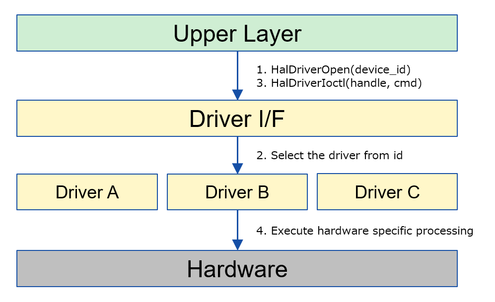
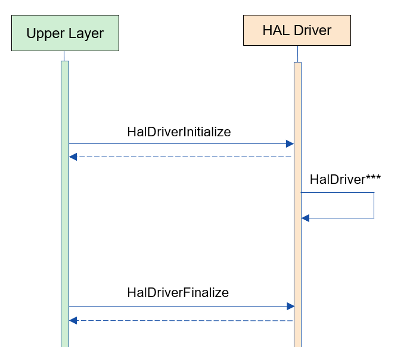
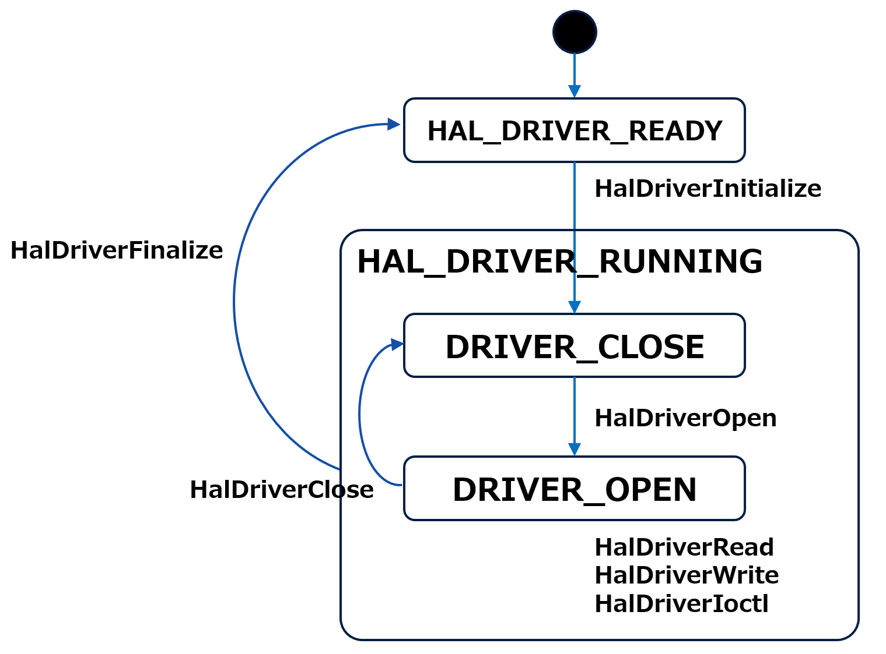
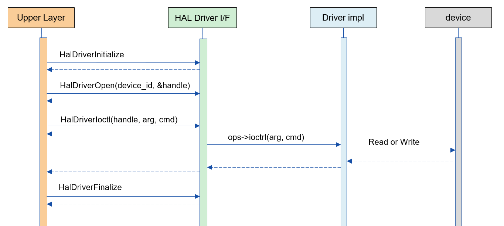

= HAL Driver (LLM Translation)
:sectnums:
:sectnumlevels: 3
:chapter-label:
:revnumber: 0.0.2
:toc: left
:toc-title: Table of Contents
:toclevels: 3
:lang: en
:xrefstyle: short
:figure-caption: Figure
:table-caption: Table
:section-refsig:
:experimental:

== Purpose and Scope

This document describes the specifications of the HAL Driver, which is one of the implementation layers of AITRIOS HAL. +
The purpose of the HAL Driver is to absorb board-level differences at the function implementation level that cannot be absorbed by HAL configuration alone, as the processing varies greatly between cameras. +
For example, processes during FW OTA updates involve many chip-dependent procedures, and by creating dedicated driver files and executing the process through the HAL Driver, the impact on other modules can be minimized while ensuring high scalability.

TIP: This module is intended for use only within HAL.

<<<

== Terminology

[#_words]
.Term List
[options="header"]
|===
|Term |Description 

|HAL
|Hardware Abstract Layer. A layer that absorbs camera differences.

|PL
|Porting Layer. A layer that absorbs differences in cameras and OS.

|I/F
|Interface.

|Driver file, Driver impl
|The main body part for HAL Driver I/F.
|===

<<<

== Component Description

The purpose of the HAL Driver is to absorb board-level differences at the function implementation level that cannot be absorbed by HAL configuration alone, as the processing varies greatly between cameras. +
The HAL Driver is implemented by preparing the HAL Driver I/F and HAL Driver files, and registering the drivers.

=== Component Overview

Below is a software configuration diagram centered around this block.

.Overview Diagram
image::./images/driver_layer.png[scaledwidth="100%",align="center"]

.Detailed Diagram

<<<

=== Detailed Component Description

An example of the usage sequence for the HAL Driver is shown below. +
After executing HalDriverInitialize, other HAL modules can use various driver functions through the HAL Driver API.

[#_button_seq]
.Sequence Overview

==== Dependent Blocks (for internal HAL use)
.Dependent Blocks
[width="100%",options="header"]
|===
|Block Name |Usage |Link
|HAL IOExp
|Used to control the IOExpander in the implementation of the HAL Driver.
|https://github.com/aitrios/aitrios-edge-device-manager/blob/main/docs/spec/hal/ioexp/hal_ioexp.adoc
|===

=== State Transitions
The states that HAL can take are shown in <<#_TableStates>>.

[#_TableStates]
.State List
[width="100%", cols="20%,80%",options="header"]
|===
|State |Description 

|HAL_DRIVER_READY
|HAL Driver not initialized.

|HAL_DRIVER_RUNNING
|HAL Driver initialized.

|DRIVER_CLOSE
|Driver not open. A sub-state of HAL_DRIVER_RUNNING.

|DRIVER_OPEN
|Driver open. A sub-state of HAL_DRIVER_RUNNING.
|===

HAL state transitions are shown in <<#_FigureState>>. +
Additionally, state transitions do not occur if an error occurs in each API.

[#_FigureState]
.State Transition Diagram

The API acceptance and the transition destination for each state are shown in <<#_TableStateTransition>>. The state names in the table represent the destination state after API execution, indicating that the API can be called. +
An "×" indicates that the API cannot be accepted, and an API call in such cases returns an error with no state transition. For details on errors, refer to <<#_HalErrCode, HalErrCode List>>.

[#_TableStateTransition]
.State Transition Table
[width="100%", cols="10%,20%,20%,20%,20%"]
|===
2.3+| 3+|State 
.2+|HAL_DRIVER_READY
2+|HAL_DRIVER_RUNNING
|DRIVER_CLOSE
|DRIVER_OPEN
.20+|API Name

|``**HalDriverInitialize**``
|HAL_DRIVER_RUNNING
|×
|×

|``**HalFinalize**``
|×
|HAL_DRIVER_READY
|HAL_DRIVER_READY

|``**HalDriverOpen**``
|×
|DRIVER_OPEN
|×

|``**HalDriverClose**``
|×
|×
|DRIVER_CLOSE

|``**HalDriverRead**``
|×
|×
|DRIVER_OPEN

|``**HalDriverWrite**``
|×
|×
|DRIVER_OPEN

|``**HalDriverIoctl**``
|×
|×
|DRIVER_OPEN

|``**HalDriverAddDriver**``
|×
|DRIVER_CLOSE
|DRIVER_OPEN
|===

=== Component Function List
The list of functions is shown in <<#_TableFunction>>.

[#_TableFunction]
.Function List
[width="100%", cols="30%,55%,15%",options="header"]
|===
|Function Name |Overview  |Section Number
|Driver Open/Close
|Opens/Closes the handler to use the HAL Driver API.
|<<#_Function1>>

|Read/Write Function
|Enables the use of the driver's Read/Write functions. Actual behavior depends on the driver file.
|<<#_Function2>>

|Ioctl Function
|Allows the use of complex driver functions other than Read/Write. Actual behavior depends on the driver file.
|<<#_Function3>>

|Register New Driver
|Allows adding a HAL Driver with minimal impact on other HAL modules.
|<<#_Function4>>
|===

<<<

=== Component Function Description
[#_Function1]
==== Driver Open/Close
Function Overview::
Opens/Closes the handler to use the HAL Driver API.
Preconditions::
HalDriverInitialize must be executed.
Function Details::
Refer to <<#_HalDriverOpen, HalDriverOpen>> and <<#_HalDriverClose, HalDriverClose>> for details.
Behavior Details::
Opens/Closes the handler to use the HAL Driver API.
Behavior During Errors and Recovery Method::
Check if the Open/Close handler is registered.
Considerations::
None.

[#_Function2]
==== Read/Write Function
Function Overview::
Enables the use of the driver's Read/Write functions. Actual behavior depends on the driver file.
Preconditions::
The handler must be obtained by HalDriverOpen.
Function Details::
Refer to <<#_HalDriverRead, HalDriverRead>> and <<#_HalDriverWrite, HalDriverWrite>> for details.
Behavior Details::
Calls the registered Read/Write handler.
Behavior During Errors and Recovery Method::
Check if the Read/Write handler is registered.
Considerations::
None.

[#_Function3]
==== Ioctl Function
Function Overview::
Allows the use of complex driver functions other than Read/Write. Actual behavior depends on the driver file.
Preconditions::
The handler must be obtained by HalDriverOpen.
Function Details::
Refer to <<#_HalDriverIoctl, HalDriverIoctl>> for details.
Behavior Details::
Calls the registered Ioctl handler.
Behavior During Errors and Recovery Method::
Check if the Ioctl handler is registered.
Considerations::
None.

[#_Function4]
==== Register New Driver
Function Overview::
Allows adding a HAL Driver with minimal impact on other HAL modules.
Preconditions::
None.
Function Details::

When registering and using a new driver, the following three tasks are generally required:

1. Create a new HAL Driver main file.
2. Add one line to the HAL Driver I/F source to include the new driver's header file and implement ops.
3. Register the driver with the HAL Driver.

Detailed steps for each task are described below.

Behavior Details::

* 1. Create a new HAL Driver main file.
** Create a new header and source file as follows.
** The specification of the void *arg argument in Ioctl is determined by the driver side.
*** It is recommended to prepare a somewhat general-purpose structure that can be reused for similar devices.
**** Instead of defining a structure for each device's .c source file, define a general IOExpander-related struct, long cmd in hal_driver_ioexp.h, and include it in each device's .c source.

[source, C]
.pcal6416aev.h
....
HalErrCode Pcal6416AevOpen(uint32_t device_id);
HalErrCode Pcal6416AevClose(uint32_t device_id);
HalErrCode Pcal6416AevIoctl(void *arg_, uint32_t cmd);

struct HalDriverOps pcal6416aev_ops = {
  .open = Pcal6416AevOpen,
  .close = Pcal6416AevClose,
  .read = NULL,
  .write = NULL,
  .ioctl = Pcal6416AevIoctl,
};
....

[source, C]
.pcal6416aev.c
....
HalErrCode Pcal6416AevOpen(uint32_t device_id) {
  return 0;  // Perform setup if necessary
}

HalErrCode Pcal6416AevClose(uint32_t device_id) {
  return 0;  // Perform close process if necessary
}

HalErrCode Pcal6416AevIoctl(void *arg_, uint32_t cmd) {
  struct ioexp_ioctl_arg *io_arg = (struct ioexp_ioctl_arg*)arg;
  switch (cmd) {
  case IOCTL_CMD_SETVAL:
    int phy_port = io_arg->phy_port;
    int val = io_arg->setval;
    // HalI2cWriteRegister***
    break;
  }
  return 0;
}
....

* 2. Add one line to include the new driver's header file and implement ops in the HAL Driver I/F source.
** Edit the HAL Driver I/F source file as follows.

[source, C]
.hal_driver.c
....
#include "pcal6416aev.h"
#include "pcal6408ahkx.h"  // ★Added

struct hal_driver_info {
  uint32_t device_id;
  char dev_name[32];
  struct HalDriverOps* ops;
};

....

* 3. Register the driver with the HAL Driver.
** Use the HalDriverAddDriver API to register the driver.
** Ensure that the device_id does not conflict with other devices (usually assign consecutive numbers).
** The value of "name" is used by the HAL Driver I/F to search for the corresponding driver file.

<<<

Behavior During Errors and Recovery Method::
Check the registration details, such as duplicated device IDs.
Considerations::
None.

<<<

=== Non-Functional Requirements List for the Component

The list of non-functional requirements is shown in <<#_TableNonFunction>>.

[#_TableNonFunction]
.Non-Functional Requirements List
[width="100%", cols="30%,55%,15%",options="header"]
|===
|Function Name |Overview  |Section Number
|Maximum Stack Usage
|The maximum stack size used by the HAL Driver.
|<<#__stack, 3.7.1.>>

|Maximum Heap Usage
|The maximum heap size used by the HAL Driver.
|<<#_heap, 3.7.2>>

|Maximum Static Data Usage
|The maximum static data size used by the HAL Driver.
|<<#_static, 3.7.3>>

|Performance
|The performance of functions provided by the HAL Driver.
|<<#_performance, 3.7.4>>
|===

=== Description of Non-Functional Requirements for the Component
==== Maximum Stack Usage
[#_stack]
1024 bytes

==== Maximum Heap Usage
[#_heap]
128 bytes per driver handler to open +
128 bytes per driver to use

* *Example for T5* +
** Driver handlers to open: up to 32 (maximum number of ioexp_id) +
32 × 128 bytes = 4096 bytes +
** Drivers to use: 2 +
2 × 128 bytes = 256 bytes

[#_static]
==== Maximum Static Data Usage
256 bytes

[#_performance]
==== Performance
Less than 1 millisecond

<<<

== API Specifications
=== List of Definitions
==== List of Data Types
The list of data types is shown in <<#_TableDataType>>.

[#_TableDataType]
.Data Types List
[width="100%", cols="30%,55%,15%",options="header"]
|===
|Data Type Name |Overview  |Section Number
|enum HalErrCode
|An enumeration that defines the execution result of the API.
|<<#_HalErrCode, 4.2.1.>>

|HalDriverHandle
|A handler to use the HAL Driver API.
|<<#_HalDriverHandle, 4.2.2.>>
|===

==== List of APIs
The list of APIs is shown in <<#_TablePublicAPI>>.

[#_TablePublicAPI]
.List of APIs that can be used directly from the upper application
[width="100%", cols="10%,60%,20%",options="header"]
|===
|API Name |Overview |Section Number
|HalDriverInitialize
|Performs the initialization process of this module.
|<<#_HalDriverInitialize, 4.3.1.>>

|HalDriverFinalize
|Performs the termination process of this module.
|<<#_HalDriverFinalize, 4.3.2.>>

|HalDriverOpen
|Opens the handler to use the HAL Driver API.
|<<#_HalDriverOpen, 4.3.3.>>

|HalDriverClose
|Closes the handler to use the HAL Driver API.
|<<#_HalDriverClose, 4.3.4.>>

|HalDriverRead
|Executes the driver's Read process. Support and content vary depending on each driver.
|<<#_HalDriverRead, 4.3.5.>>

|HalDriverWrite
|Executes the driver's Write process. Support and content vary depending on each driver.
|<<#_HalDriverWrite, 4.3.6.>>

|HalDriverIoctl
|Executes complex processes that cannot be handled by the HalDriverRead/Write API. Support and content vary depending on each driver.
|<<#_HalDriverIoctl, 4.3.7.>>

|HalDriverAddDriver
|Adds a driver.
|<<#_HalDriverAddDriver, 4.3.8.>>
|===

<<<

=== Data Type Definitions
[#_HalErrCode]
==== HalErrCode
An enumeration that defines the execution result of the API.
(T.B.D.)

[#_HalDriverHandle]
==== HalDriverHandle
A handler to use the HAL Driver API.

* *Format*
[source, C]
....
typedef uint32_t HalDriverHandle;
....

=== API Descriptions

[#_HalDriverInitialize]
==== HalDriverInitialize
* *Function* +
Performs the initialization process of the HAL Driver.

* *Format* +
[source, C]
....
HalErrCode HalDriverInitialize(void)
....

* *Explanation of Arguments* +
-

* *Return Value* +
Returns one of the HalErrCode values based on the execution result.

* *Explanation* +
** Performs the initialization process of the HAL Driver.

.API Detailed Information
[width="100%", cols="30%,70%",options="header"]
|===
|API Detail  |Description
|API Type
|Synchronous API
|Execution Context
|Operates in the caller's context
|Concurrent Calls
|Allowed
|Calls from Multiple Threads
|Allowed
|Calls from Multiple Tasks
|Allowed
|Does the API Block Internally?
|Blocks.
If HalDriverInitialize or HalDriverFinalize is already running in another context, this API waits for completion before proceeding.
|===

.Error Information
[options="header"]
|===
|Error Code |Cause |State of OUT Parameters |System State After Error |Recovery Method
|kHalErrLock/kHalErrUnlock (tentative)
|Issue with mutual exclusion
|-
|No impact
|Not required
|===

<<<

[#_HalDriverFinalize]
==== HalDriverFinalize
* *Function* +
Performs the termination process related to the HAL Driver.

* *Format* +
[source, C]
....
HalErrCode HalDriverFinalize(void)
....

* *Explanation of Arguments* +
-

* *Return Value* +
Returns one of the HalErrCode values based on the execution result.

* *Explanation* +
** Performs the termination process related to the HAL Driver.

[#_HalDriverFinalize_desc]
.API Detailed Information
[width="100%", cols="30%,70%",options="header"]
|===
|API Detail  |Description
|API Type
|Synchronous API
|Execution Context
|Operates in the caller's context
|Concurrent Calls
|Allowed
|Calls from Multiple Threads
|Allowed
|Calls from Multiple Tasks
|Allowed
|Does the API Block Internally?
|Blocks.
If HalDriverInitialize or HalDriverFinalize is already running in another context, this API waits for completion before proceeding.
|===

[#_HalDriverFinalize_error]
.Error Information
[options="header"]
|===
|Error Code |Cause |State of OUT Parameters |System State After Error |Recovery Method
|kHalErrLock/kHalErrUnlock (tentative)
|Issue with mutual exclusion
|-
|No impact
|Not required
|===

<<<

[#_HalDriverOpen]
==== HalDriverOpen

* *Function* +
Opens the handler to use the HAL Driver API.

* *Format* +
[source, C]
....
HalErrCode HalDriverOpen(uint32_t device_id, void *arg, HalDriverHandle *handle)
....

* *Explanation of Arguments* +
**[IN] uint32_t device_id**:: 
ID of the device to use the driver.

**[IN/OUT] void *arg**:: 
Data to pass to the driver when opening. Refer to the driver’s specifications for details.

**[OUT] HalDriverHandle *handle**:: 
The handler.

* *Return Value* +
Returns one of the HalErrCode values based on the execution result.

* *Explanation* +
** Opens the handler to use the HAL Driver API.
** This API can be used after executing HalDriverInitialize.
** The target driver’s Open API is executed within this API, and the handler is set upon success.
** This API also succeeds if a previously opened device_id is specified (supports multiple opens).
*** Implementers of the HAL Driver should ensure that multiple open and close calls do not affect the device's operation (e.g., only perform device-related actions on the first open and the last close).

.API Detailed Information
[width="100%", cols="30%,70%",options="header"]
|===
|API Detail  |Description
|API Type
|Synchronous API
|Execution Context
|Operates in the caller's context
|Concurrent Calls
|Allowed
|Calls from Multiple Threads
|Allowed
|Calls from Multiple Tasks
|Allowed
|Does the API Block Internally?
|Blocks. Access to internal HAL lists is mutually exclusive.
|===

.Error Information
[options="header"]
|===
|Error Code |Cause |State of OUT Parameters |System State After Error |Recovery Method
|kHalErrInvalidState (tentative)
|HalDriverInitialize has not been executed
|-
|No impact
|Not required
|kHalErrInvalidParam (tentative)
|Parameter error
|-
|No impact
|Not required
|kHalErrNotFound (tentative)
|Specified device ID not found
|-
|No impact
|Not required
|kHalErrNoSupported (tentative)
|Specified device cannot be opened
|-
|No impact
|Not required
|kHalErrLock/kHalErrUnlock (tentative)
|Issue with mutual exclusion
|-
|No impact
|Not required
|===

<<<

[#_HalDriverClose]
==== HalDriverClose
* *Function* +
Closes the handler used for the HAL Driver API.

* *Format* +
[source, C]
....
HalErrCode HalDriverClose(HalDriverHandle handle)
....

* *Explanation of Arguments* +
**[IN] HalDriverHandle handle**:: 
The handler.

* *Return Value* +
Returns one of the HalErrCode values based on the execution result.

* *Explanation* +
** Closes the handler used for the HAL Driver API.
** This API can be used after executing HalDriverInitialize.
** If an unopened handle is specified, this API will fail.

.API Detailed Information
[width="100%", cols="30%,70%",options="header"]
|===
|API Detail  |Description
|API Type
|Synchronous API
|Execution Context
|Operates in the caller's context
|Concurrent Calls
|Allowed
|Calls from Multiple Threads
|Allowed
|Calls from Multiple Tasks
|Allowed
|Does the API Block Internally?
|Blocks. Access to internal HAL lists is mutually exclusive.
|===

.Error Information
[options="header"]
|===
|Error Code |Cause |State of OUT Parameters |System State After Error |Recovery Method
|kHalErrInvalidState (tentative)
|HalDriverInitialize has not been executed
|-
|No impact
|Not required
|kHalErrInvalidParam (tentative)
|Parameter error
|-
|No impact
|Not required
|kHalErrNoSupported (tentative)
|Specified device cannot be closed
|-
|No impact
|Not required
|kHalErrLock/kHalErrUnlock (tentative)
|Issue with mutual exclusion
|-
|No impact
|Not required
|===

<<<

[#_HalDriverRead]
==== HalDriverRead
* *Function* +
Performs the driver’s read process.

* *Format* +
[source, C]
....
HalErrCode HalDriverRead(HalDriverHandle handle, void *buf, uint32_t size, uint32_t *read_size)
....

* *Explanation of Arguments* +
**[IN] HalDriverHandle handle**:: 
The handler.

**[OUT] void *buf**:: 
Destination buffer address for the read result.

**[IN] uint32_t size**:: 
Number of bytes to read.

**[OUT] uint32_t *read_size**:: 
Actual number of bytes read.

* *Return Value* +
Returns one of the HalErrCode values based on the execution result.

* *Explanation* +
** Performs the driver’s read process.
** The support and operation vary depending on the driver.
** This API can be used after executing HalDriverInitialize.
** Specify the handler obtained through HalDriverOpen.

.API Detailed Information
[width="100%", cols="30%,70%",options="header"]
|===
|API Detail  |Description
|API Type
|Synchronous API
|Execution Context
|Operates in the caller's context
|Concurrent Calls
|Allowed
|Calls from Multiple Threads
|Allowed
|Calls from Multiple Tasks
|Allowed
|Does the API Block Internally?
|Blocks. Access to internal HAL lists is mutually exclusive. +
If the same handle is executing HalDriverRead, HalDriverWrite, or HalDriverIoctl, the API waits for completion before proceeding.
|===

.Error Information
[options="header"]
|===
|Error Code |Cause |State of OUT Parameters |System State After Error |Recovery Method
|kHalErrInvalidState (tentative)
|HalDriverInitialize has not been executed
|-
|No impact
|Not required

|kHalErrInvalidParam (tentative)
|Parameter error
|-
|No impact
|Not required

|===

<<<

[#_HalDriverWrite]
==== HalDriverWrite
* *Function* +
Performs the driver’s write process.

* *Format* +
[source, C]
....
HalErrCode HalDriverWrite(HalDriverHandle handle, const void *buf, uint32_t size, uint32_t *written_size)
....

* *Explanation of Arguments* +
**[IN] HalDriverHandle handle**:: 
The handler.

**[IN] const void *buf**:: 
Address of the buffer to write.

**[IN] uint32_t size**:: 
Number of bytes to write.

**[IN] uint32_t *written_size**:: 
Actual number of bytes written.

* *Return Value* +
Returns one of the HalErrCode values based on the execution result.

* *Explanation* +
** Performs the driver’s write process.
** The support and operation vary depending on the driver.
** This API can be used after executing HalDriverInitialize.
** Specify the handler obtained through HalDriverOpen.

.API Detailed Information
[width="100%", cols="30%,70%",options="header"]
|===
|API Detail  |Description
|API Type
|Synchronous API
|Execution Context
|Operates in the caller's context
|Concurrent Calls
|Allowed
|Calls from Multiple Threads
|Allowed
|Calls from Multiple Tasks
|Allowed
|Does the API Block Internally?
|Blocks. Access to internal HAL lists is mutually exclusive. +
If the same handle is executing HalDriverRead, HalDriverWrite, or HalDriverIoctl, the API waits for completion before proceeding.
|===

.Error Information
[options="header"]
|===
|Error Code |Cause |State of OUT Parameters |System State After Error |Recovery Method
|kHalErrInvalidState (tentative)
|HalDriverInitialize has not been executed
|-
|No impact
|Not required

|kHalErrInvalidParam (tentative)
|Parameter error
|-
|No impact
|Not required
|===

<<<

[#_HalDriverIoctl]
==== HalDriverIoctl
* *Function* +
Executes complex processes that cannot be performed by the HalDriverRead/Write API.

* *Format* +
[source, C]
....
HalErrCode HalDriverIoctl(HalDriverHandle handle, void *arg, uint32_t cmd)
....

* *Explanation of Arguments* +
**[IN] HalDriverHandle handle**:: 
The handler.

**[IN/OUT] void *arg**:: 
Argument for processing. The specifications vary depending on the driver.

**[IN] uint32_t cmd**:: 
Command for processing. The specifications vary depending on the driver.

* *Return Value* +
Returns one of the HalErrCode values based on the execution result.

* *Explanation* +
** Executes complex processes that cannot be performed by the HalDriverRead/Write API.
** The support and operation vary depending on the driver.
** This API can be used after executing HalDriverInitialize.

.API Detailed Information
[width="100%", cols="30%,70%",options="header"]
|===
|API Detail  |Description
|API Type
|Synchronous API
|Execution Context
|Operates in the caller's context
|Concurrent Calls
|Allowed
|Calls from Multiple Threads
|Allowed
|Calls from Multiple Tasks
|Allowed
|Does the API Block Internally?
|Blocks. Access to internal HAL lists is mutually exclusive. +
If the same handle is executing HalDriverRead, HalDriverWrite, or HalDriverIoctl, the API waits for completion before proceeding.
|===

.Error Information
[options="header"]
|===
|Error Code |Cause |State of OUT Parameters |System State After Error |Recovery Method
|kHalErrInvalidState (tentative)
|HalDriverInitialize has not been executed
|-
|No impact
|Not required

|kHalErrInvalidParam (tentative)
|Parameter error
|-
|No impact
|Not required

|===

<<<

[#_HalDriverAddDriver]
==== HalDriverAddDriver
* *Function* +
Registers a driver.

* *Format* +
[source, C]
....
HalErrCode HalDriverAddDriver(uint32_t device_id, const char *name, const struct HalDriverOps *ops);
....

* *Explanation of Arguments* +
**[IN] uint32_t device_id**:: 
ID of the device for which the driver will be used.

**[IN] const char *name**:: 
Driver name.

**[IN] const struct HalDriverOps *ops:: 
Address of the driver operation table. +
Specify the address of the HalDriverOps added in <<#_Function4, Register New Driver>>.

* *Return Value* +
Returns one of the HalErrCode values based on the execution result.

* *Explanation* +
** Registers a driver.
** An error is returned if a device ID that has already been registered is specified.
** This API can be used after executing HalDriverInitialize.

[#_HalDriverAddDriver_desc]
.API Detailed Information
[width="100%", cols="30%,70%",options="header"]
|===
|API Detail  |Description
|API Type
|Synchronous API
|Execution Context
|Operates in the caller's context
|Concurrent Calls
|Allowed
|Calls from Multiple Threads
|Allowed
|Calls from Multiple Tasks
|Allowed
|Does the API Block Internally?
|Blocks.
Access to internal HAL lists is mutually exclusive.
|===

[#_HalDriverAddDriver_error]
.Error Information
[options="header"]
|===
|Error Code |Cause |State of OUT Parameters |System State After Error |Recovery Method
|kHalErrInvalidState (tentative)
|HalDriverInitialize has not been executed
|-
|No impact
|Not required

|kHalErrInvalidParam (tentative)
|Parameter error
|-
|No impact
|Not required
|===

<<<

== Example of API Calls
=== Example up to Ioctl
.Ioctl Example

== Special Notes or Component-Specific Descriptions

== List of OSS Used
None

<<<

== References
None

<<<
== Revision History
[width="100%", cols="20%,80%",options="header"]
|===
|Version |Changes 
|0.0.1
|Initial version

|0.0.2
|- Changed "HAL config" to "HAL configuration." +
- Removed the description of OSAL from the terminology and added PL. +
- Changed HalInitialize/HalFinalize to HalDriverInitialize/HalDriverFinalize. +
- Revised Figure 2 (detailed diagram). +
- Removed HAL Config from dependent blocks and added HAL IOExp. +
- Changed HAL_READY/HAL_RUNNING to HAL_DRIVER_READY/HAL_DRIVER_RUNNING. +
- Changed the description in hal_overview.adoc to "HalErrCode List (T.B.D.)". +
- Changed Osal_I2CWrite to HalI2cWriteRegister. +
- In section 4.3 (API descriptions), made HalDriverInitialize/HalDriverFinalize public functions and reordered the API list. +
- Changed "HalErrorCode" to "HalErrCode". +
- Changed the error codes for mutual exclusion from kHalErrInternal to kHalErrLock/kHalErrUnlock. +
- Removed the description about AP binary updates from HalDriverClose API. +
- Changed the language of the diagrams (*.png) to English.

|===
