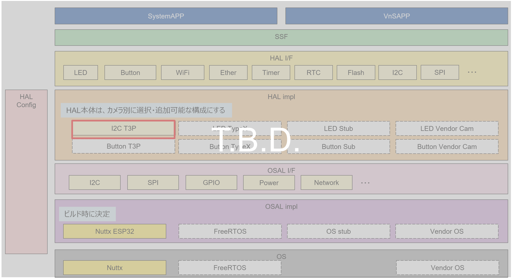
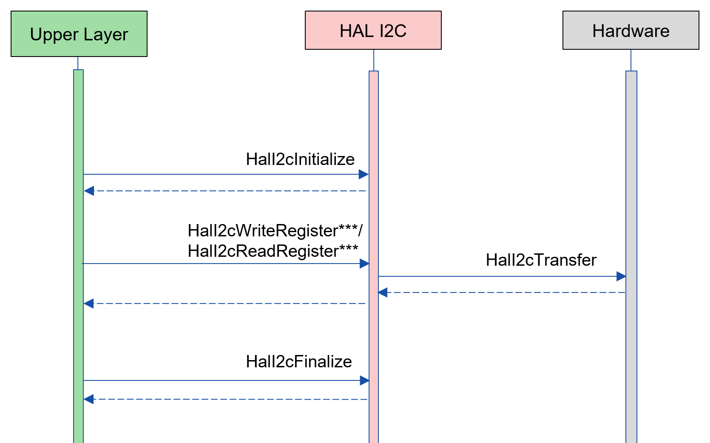
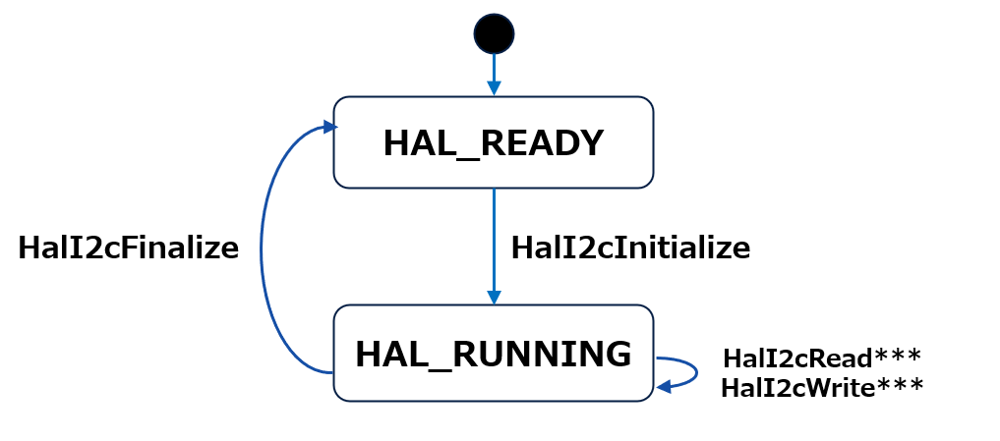
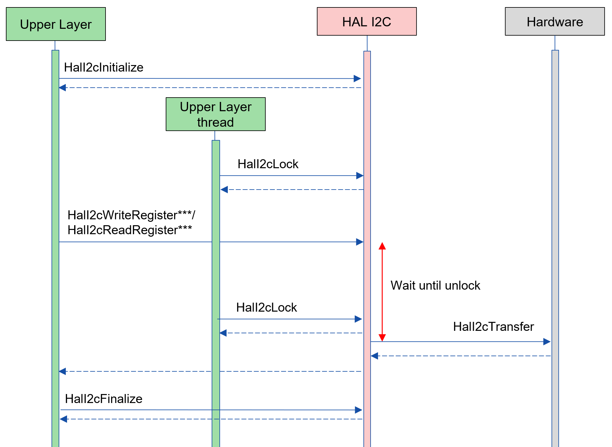
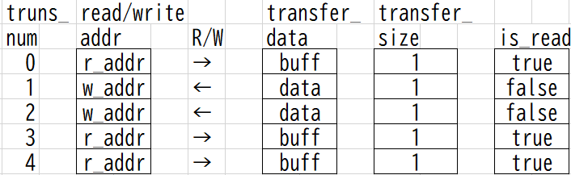

= HAL I2C
:sectnums:
:sectnumlevels: 3
:chapter-label:
:revnumber: 0.0.2
:toc: left
:toc-title: 目次
:toclevels: 3
:lang: ja
:xrefstyle: short
:figure-caption: Figure
:table-caption: Table
:section-refsig:
:experimental:

== 目的と適用範囲

本書では AITRIOS HAL の impl レイヤーの一つである、I2C impl の仕様について記載します。

<<<

== 用語

[#_words]
.用語一覧
[options="header"]
|===
|用語 |説明 

|HAL
|Hardware Abstract Layer. カメラ差分を吸収する層

|PL
|Porting Layer. カメラ/ OS 差分を吸収する層

|public API
|上位レイヤーから直接使用可能な API

|private API
|HAL 内部でのみ使用される API
|===

<<<

== コンポーネントの説明

HAL impl レイヤーは、カメラ差分を意識せずに使える HAL I/F に対する本体部分であり、カメラ差分を吸収することが目的となります。
また、ターゲットとするカメラに合わせて追加・変更が可能です。

=== コンポーネントの概要

以下に本ブロックを中心としたソフトウェア構成図を示します。

.概要図

<<<

=== コンポーネントの詳細説明

HAL I2C の使用シーケンス例を以下に示します。
上位レイヤーは HalI2cInitialize を実行後、HAL I2C API を使用して I2C 通信を行うことができます。

[#_i2c_seq]
.シーケンス概要

<<<

=== 状態遷移
HAL I2C の取り得る状態を <<#_TableStates>> に示します。

[#_TableStates]
.状態一覧
[width="100%", cols="20%,80%",options="header"]
|===
|状態 |説明 

|HAL_I2C_READY
|初期状態

|HAL_I2C_RUNNING
|実行可能状態
|===

HAL I2C では <<#_FigureState>> に示す状態遷移を行います。 +
また、各 API でエラーが発生した場合には状態遷移は起こりません。 +

[#_FigureState]
.状態遷移図

各状態での API 受け付け可否と状態遷移先を <<#_TableStateTransition>> に示します。表中の状態名は、API 実行完了後の遷移先状態を示し、すなわち API 呼び出し可能であることを示します。 +
× は API 受け付け不可を示し、ここでの API 呼び出しはエラーを返し状態遷移は起きません。エラーの詳細は <<#_HalErrCode, HalErrCode 一覧>> を参照してください。 

[#_TableStateTransition]
.状態遷移表
[width="100%", cols="10%,30%,30%,30%"]
|===
2.2+| 2+|状態 
|HAL_I2C_READY |HAL_I2C_RUNNING 
.14+|API 名

|``**HalI2cInitialize**``            
|HAL_I2C_RUNNING                   
|×

|``**HalI2cFinalize**``   
|×                   
|HAL_I2C_READY

|``**HalI2cReadRegister8**``   
|×                   
|HAL_I2C_RUNNING

|``**HalI2cReadRegister16**``   
|×                   
|HAL_I2C_RUNNING

|``**HalI2cReadRegister32**``   
|×                   
|HAL_I2C_RUNNING

|``**HalI2cReadRegister64**``   
|×                   
|HAL_I2C_RUNNING
|``**HalI2cWriteRegister8**``   
|×                   
|HAL_I2C_RUNNING

|``**HalI2cWriteRegister16**``   
|×                   
|HAL_I2C_RUNNING

|``**HalI2cWriteRegister32**``   
|×                   
|HAL_I2C_RUNNING

|``**HalI2cWriteRegister64**``   
|×                   
|HAL_I2C_RUNNING

|``**HalI2cGetDeviceInfo**``             
|×                   
|HAL_I2C_RUNNING

|``**HalI2cReset**``             
|×                   
|HAL_I2C_RUNNING

|``**HalI2cLock**``
|×
|HAL_I2C_RUNNING

|``**HalI2cUnlock**``
|×
|HAL_I2C_RUNNING
|===

<<<

=== コンポーネントの機能一覧
<<#_TableFunction>> に機能の一覧を示します。

[#_TableFunction]
.機能一覧
[width="100%", cols="30%,55%,15%",options="header"]
|===
|機能名 |概要  |節番号
|I2C Read Register
|I2C デバイスの Register Read を行います。
|<<#_Function1>>

|I2C Write Register
|I2C デバイスの Register Write を行います。
|<<#_Function2>>

|I2C Bus Reset
|I2C バスの Reset を行います。
|<<#_Function3>>

|I2C API Lock/Unlock
|HAL I2C API のロック/アンロックを行います。
|<<#_Function4>>

|===

<<<

=== コンポーネントの機能説明
[#_Function1]
==== I2C Read Register
機能概要::
I2C デバイスの指定したレジスターからデータを読み込みます。
前提条件::
HalI2cInitialize が実行済みであること。
機能詳細::
HalI2cReadRegister8, 16... とレジスター長ごとに API が存在します。詳細は <<#_TableAPI, API 一覧>> を参照してください。
詳細挙動::
I2C デバイスの指定したレジスターからデータを読み込みます。
エラー時の挙動、復帰方法::
エラーコードを返します。
検討事項::
なし。

[#_Function2]
==== I2C Write Register
機能概要::
I2C デバイスの指定したレジスターにデータを書き込みます。
前提条件::
HalI2cInitialize が実行済みであること。
機能詳細::
HalI2cWriteRegister8, 16... とレジスター長ごとに API が存在します。詳細は <<#_TableAPI, API 一覧>> を参照してください。
詳細挙動::
I2C デバイスの指定したレジスターにデータを書き込みます。
エラー時の挙動、復帰方法::
エラーコードを返します。
検討事項::
なし。

[#_Function3]
==== I2C Bus Reset
機能概要::
I2C デバイスのポートをリセットします。
前提条件::
HalI2cInitialize が実行済みであること。
機能詳細::
-
詳細挙動::
I2C デバイスのポートをリセットします。
エラー時の挙動、復帰方法::
エラーコードを返します。 +
データの再送が必要です。
検討事項::
なし

[#_Function4]
==== I2C API Lock/Unlock
機能概要::
HAL I2C API のロック/アンロックを行います。
前提条件::
HalI2cInitialize が実行済みであること。
機能詳細::
ロック/アンロックは同一スレッド上で実行してください。 +
ロック/アンロックは他の HAL I2C API とは別のスレッドで実行してください。 +
ロック後に同スレッド上で他 HAL I2C API を実行した場合の動作は保証しません。
詳細挙動::
HAL I2C API のロック/アンロックを行います。
エラー時の挙動、復帰方法::
エラーコードを返します。
検討事項::
なし

<<<
=== コンポーネントの非機能要件一覧

<<#_TableNonFunction>> に非機能要件の一覧を示します。

[#_TableNonFunction]
.非機能要件一覧
[width="100%", cols="30%,55%,15%",options="header"]
|===
|機能名 |概要  |節番号
|Stack 最大使用量
|Stack 使用量の最大値 (バイト数)
|<<#_CompornentNonFunction, 3.7.>>

|ヒープ最大使用量
|ヒープ使用量の最大値 (バイト数)
|<<#_CompornentNonFunction, 3.7.>>

|static データ最大使用量
|static データ使用量 (バイト数)
|<<#_CompornentNonFunction, 3.7.>>

|パフォーマンス
|各 API の処理時間
|<<#_CompornentNonFunction, 3.7.>>
|===

=== コンポーネントの非機能要件説明

[#_CompornentNonFunction]
==== Stack 最大使用量
512 バイト

==== ヒープ最大使用量
512 バイト

==== static データ最大使用量
64 バイト

==== パフォーマンス
1 ミリ秒未満

<<<

== API 仕様
=== 定義一覧
==== データ型一覧
<<#_TableDataType>> にデータ型の一覧を示します。

[#_TableDataType]
.データ型一覧
[width="100%", cols="30%,55%,15%",options="header"]
|===
|データ型名 |概要  |節番号
|enum HalErrCode
|API の実行結果を定義する列挙型です。
|<<#_HalErrCode>> を参照

|enum HalI2cEndian
|デバイスのエンディアンを定義する列挙型です。
|<<#_HalI2cEndian>> を参照

|enum HalI2cMsgType
|データの Read/Write を定義する列挙型です。
|<<#_HalI2cMsgType>> を参照

|struct HalI2cDeviceInfo
|I2C デバイス情報を取得するための構造体です。
|<<#_HalI2cDeviceInfo>> を参照
|===

==== API 一覧
<<#_TablePublicAPI>> および <<#_TablePrivateAPI>> に API の一覧を示します。

[#_TablePublicAPI]
.Public API 一覧
[width="100%", cols="10%,60%,20%",options="header"]
|===
|API 名 |概要 |節番号
|HalI2cInitialize
|I2C バスの初期化を行います。
|<<#_HalI2cInitialize, 4.3.1.>>

|HalI2cFinalize
|I2C バスの終了処理を行います。
|<<#_HalI2cFinalize, 4.3.2.>>

|HalI2cReadRegister8
|8 bit レジスターから I2C Read を行います。
|<<#_HalI2cReadRegister8, 4.3.3.>>

|HalI2cReadRegister16
|16 bit レジスターから I2C Read を行います。
|<<#_HalI2cReadRegister16, 4.3.4.>>

|HalI2cReadRegister32
|32 bit レジスターから I2C Read を行います。
|<<#_HalI2cReadRegister32, 4.3.5.>>

|HalI2cReadRegister64
|64 bit レジスターから I2C Read を行います。
|<<#_HalI2cReadRegister64, 4.3.6.>>

|HalI2cWriteRegister8
|8 bit レジスターへ I2C Write を行います。
|<<#_HalI2cWriteRegister8, 4.3.7.>>

|HalI2cWriteRegister16
|16 bit レジスターへ I2C Write を行います。
|<<#_HalI2cWriteRegister16, 4.3.8.>>

|HalI2cWriteRegister32
|32 bit レジスターへ I2C Write を行います。
|<<#_HalI2cWriteRegister32, 4.3.9.>>

|HalI2cWriteRegister64
|64 bit レジスターへ I2C Write を行います。
|<<#_HalI2cWriteRegister64, 4.3.10.>>

|HalI2cGetDeviceInfo
|I2C デバイス情報を取得します。
|<<#_HalI2cGetDeviceInfo, 4.3.11.>>

|HalI2cReset
|I2C デバイスのポートをリセットします。
|<<#_HalI2cReset, 4.3.12.>>

|HalI2cLock
|HAL I2C API をロックします。
|<<#_HalI2cLock, 4.3.13.>>

|HalI2cUnlock
|HAL I2C API のロックを解除します。
|<<#_HalI2cUnlock, 4.3.14.>>

|===

[#_TablePrivateAPI]
.Private API 一覧
[width="100%", cols="10%,60%,20%",options="header"]
|===
|API 名 |概要 |節番号
|HalI2cTransfer
|I2C データ転送を行います。
|<<#_HalI2cTransfer, 4.3.15.>>
|===

<<<

=== データ型定義
[#_HalErrCode]
==== HalErrCode
API の実行結果を定義する列挙型です。
(T.B.D.)

[#_HalI2cEndian]
==== enum HalI2cEndian
デバイスのエンディアンを定義する列挙型です。

* *書式* +
[source, C]
....
typedef enum {
  kHalI2cLittleEndian = 1,
  kHalI2cBigEndian,
  kHalI2cEndianMax
} HalI2cEndian;
....

[#_HalI2cMsgType]
==== enum HalI2cMsgType
データの Read/Write を定義する列挙型です。

* *書式* +
[source, C]
....
typedef enum {
  kHalI2cMsgTypeWrite = 0,
  kHalI2cMsgTypeRead,
  kHalI2cMsgTypeMax
} HalI2cMsgType;
....

[#_HalI2cDeviceInfo]
==== struct HalI2cDeviceInfo
I2C デバイス一情報を取得するための構造体です。

* *書式* +
[source, C]
....
struct HalI2cDeviceInfo {
  char	   name[32+1];
  uint32_t device_id;
  uint32_t port;
  uint32_t addr;
};
....

* *値* +
HalI2cDeviceInfo 値の説明
[width="100%", cols="20%,80%",options="header"]
|===
|メンバ名  |説明
|name
|デバイス名
|device_id
|対象デバイスのデバイス ID
|port
|対象デバイスのポート番号
|addr
|対象デバイスのアドレス
|===

=== 各 API の説明
[#_HalI2cInitialize]
==== HalI2cInitialize
* *機能* +
I2C バスを初期化します。

* *書式* +
[source, C]
....
HalErrCode HalI2cInitialize(void)
....

* *引数の説明* +
-

* *戻り値* +
+
実行結果に応じて HalErrCode のいずれかの値が返ります。

* *説明* +
I2C バスを初期化すします。

[#_HalI2cInitialize]
.エラー情報
[options="header"]
|===
|エラーコード |原因 |OUT 引数の状態 |エラー後のシステム状態 |復旧方法
|kHalErrInvalidState (仮)
|HalI2cInitialize が実行されていない
|-
|影響なし
|不要

|kHalErrInvalidParam (仮)
|パラメータエラー
|-
|影響なし
|不要
|===

<<<

[#_HalI2cFinalize]
==== HalI2cFinalize
* *機能* +
I2C デバイスの終了処理を行います。

* *書式* +
[source, C]
....
HalErrCode HalI2cFinalize(void)
....

* *引数の説明* +
-

* *戻り値* +
+
実行結果に応じて HalErrCode のいずれかの値が返ります。

* *説明* +
I2C デバイスの終了処理を行います。

[#_HalI2cFinalize]
.エラー情報
[options="header"]
|===
|エラーコード |原因 |OUT 引数の状態 |エラー後のシステム状態 |復旧方法
|kHalErrInvalidState (仮)
|HalI2cInitialize が実行されていない
|-
|影響なし
|不要

|kHalErrInvalidParam (仮)
|パラメータエラー
|-
|影響なし
|不要
|===

<<<

[#_HalI2cReadRegister8]
==== HalI2cReadRegister8
* *機能* +
デバイスの I2C レジスター アドレスから 8 ビット レジスターを Read します。

* *書式* +
[source, C]
....
HalErrCode HalI2cReadRegister8(uint32_t device_id, uint8_t read_addr, uint8_t *read_buf)
....

* *引数の説明* +
**[IN] uint32_t device_id**:: 
対象のデバイス ID。

**[IN] uint8_t read_addr**:: 
レジスター アドレス。

**[IN/OUT] uint8_t *read_buf**:: 
Read したデータが格納されます。

* *戻り値* +
+
実行結果に応じて HalErrCode のいずれかの値が返ります。

* *説明* +
指定されたレジスター アドレスを I2C Read します。 +
対象のデバイスは CONFIG_HAL_I2C コンフィグの DEV_ID から選択してください。 +
本 API は、HalI2cInitialize の実行後に使用可能です。

[#_HalI2cReadRegister8_desc]
.API 詳細情報
[width="100%", cols="30%,70%",options="header"]
|===
|API 詳細情報  |説明
|API 種別
|同期 API
|実行コンテキスト
|呼び元のコンテキストで動作
|同時呼び出し
|可能
|複数スレッドからの呼び出し
|可能
|複数タスクからの呼び出し
|可能
|API 内部でブロッキングするか
|対象デバイス ID のデバイスに接続されている I2C ポート番号単位でブロッキングします。 +
すでに他のコンテキストで HalI2cReadRegister8/16/32/64、HalI2cWriteRegister8/16/32/64 が動作中の場合、完了を待ってから実行されます。
|===

[#_HalI2cReadRegister8_error]
.エラー情報
[options="header"]
|===
|エラーコード |原因 |OUT 引数の状態 |エラー後のシステム状態 |復旧方法
|kHalErrInvalidState (仮)
|HalI2cInitialize が実行されていない
|-
|影響なし
|不要

|kHalErrInvalidParam (仮)
|パラメータエラー
|-
|影響なし
|不要

|kHalErrTransfer (仮)
|指定したレジスター アドレスが不正
|-
|指定したデバイス ID の I2C がリセットされます。
|指定したデバイス ID が使用できる正しいレジスター アドレスを指定してください。

|kHalErrTimedout (仮)
|指定したデバイス ID に対する I/O にタイムアウト発生
|-
|指定したデバイスへの I/O は失敗しました。
|指定したデバイスの状態を確認してください。
|===

<<<

[#_HalI2cReadRegister16]
==== HalI2cReadRegister16
* *機能* +
デバイスの I2C レジスター アドレスから 16 ビット レジスターを Read します。

* *書式* +
[source, C]
....
HalErrCode HalI2cReadRegister16(uint32_t device_id, uint16_t read_addr, uint16_t *read_buf, HalI2cEndian dev_endian)
....

* *引数の説明* +
**[IN] uint32_t device_id**:: 
対象のデバイス ID。

**[IN] uint16_t read_addr**:: 
レジスター アドレス。

**[IN/OUT] uint16_t *read_buf**:: 
Read したデータが格納されます。

**[IN] HalI2cEndian dev_endian**:: 
対象デバイスのレジスター アドレスのエンディアンを指定してください。 +
** kHalI2cLittleEndian : リトルエンディアン +
** kHalI2cBigEndianfalse : ビッグエンディアン

* *戻り値* +
+
実行結果に応じて HalErrCode のいずれかの値が返ります。

* *説明* +
指定されたレジスター アドレスを I2C Read します。 +
対象のデバイスは CONFIG_HAL_I2C コンフィグの DEV_ID から選択してください。 +
本 API は、HalI2cInitialize の実行後に使用可能です。

[#_HalI2cReadRegister16_desc]
.API 詳細情報
[width="100%", cols="30%,70%",options="header"]
|===
|API 詳細情報  |説明
|API 種別
|同期 API
|実行コンテキスト
|呼び元のコンテキストで動作
|同時呼び出し
|可能
|複数スレッドからの呼び出し
|可能
|複数タスクからの呼び出し
|可能
|API 内部でブロッキングするか
|対象デバイス ID のデバイスに接続されている I2C ポート番号単位でブロッキングします。 +
すでに他のコンテキストで HalI2cReadRegister8/16/32/64、HalI2cWriteRegister8/16/32/64 が動作中の場合、完了を待ってから実行されます。
|===

[#_HalI2cReadRegister16_error]
.エラー情報
[options="header"]
|===
|エラーコード |原因 |OUT 引数の状態 |エラー後のシステム状態 |復旧方法
|kHalErrInvalidState (仮)
|HalI2cInitialize が実行されていない
|-
|影響なし
|不要

|kHalErrInvalidParam (仮)
|パラメータエラー
|-
|影響なし
|不要

|kHalErrTransfer (仮)
|指定したレジスター アドレスが不正
|-
|指定したデバイス ID の I2C がリセットされます。
|指定したデバイス ID が使用できる正しいレジスター アドレスを指定してください。

|kHalErrTimedout (仮)
|指定したデバイス ID に対する I/O にタイムアウト発生
|-
|指定したデバイスへの I/O は失敗しました。
|指定したデバイスの状態を確認してください。
|===

<<<

[#_HalI2cReadRegister32]
==== HalI2cReadRegister32
* *機能* +
デバイスの I2C レジスター アドレスから 32 ビット レジスターを Read します。

* *書式* +
[source, C]
....
HalErrCode HalI2cReadRegister32(uint32_t device_id, uint32_t read_addr, uint32_t *read_buf, HalI2cEndian dev_endian)
....

* *引数の説明* +
**[IN] uint32_t device_id**:: 
対象のデバイス ID。

**[IN] uint32_t read_addr**:: 
レジスター アドレス。

**[IN/OUT] uint32_t *read_buf**:: 
Read したデータが格納されます。

**[IN] HalI2cEndian dev_endian**:: 
対象デバイスのレジスター アドレスのエンディアンを指定してください。 +
** kHalI2cLittleEndian : リトルエンディアン +
** kHalI2cBigEndianfalse : ビッグエンディアン

* *戻り値* +
+
実行結果に応じて HalErrCode のいずれかの値が返ります。

* *説明* +
指定されたレジスター アドレスを I2C Read します。 +
対象のデバイスは CONFIG_HAL_I2C コンフィグの DEV_ID から選択してください。 +
本 API は、HalI2cInitialize の実行後に使用可能です。

[#_HalI2cReadRegister32_desc]
.API 詳細情報
[width="100%", cols="30%,70%",options="header"]
|===
|API 詳細情報  |説明
|API 種別
|同期 API
|実行コンテキスト
|呼び元のコンテキストで動作
|同時呼び出し
|可能
|複数スレッドからの呼び出し
|可能
|複数タスクからの呼び出し
|可能
|API 内部でブロッキングするか
|対象デバイス ID のデバイスに接続されている I2C ポート番号単位でブロッキングします。 +
すでに他のコンテキストで HalI2cReadRegister8/16/32/64、HalI2cWriteRegister8/16/32/64 が動作中の場合、完了を待ってから実行されます。
|===

[#_HalI2cReadRegister32_error]
.エラー情報
[options="header"]
|===
|エラーコード |原因 |OUT 引数の状態 |エラー後のシステム状態 |復旧方法
|kHalErrInvalidState (仮)
|HalI2cInitialize が実行されていない
|-
|影響なし
|不要

|kHalErrInvalidParam (仮)
|パラメータエラー
|-
|影響なし
|不要

|kHalErrTransfer (仮)
|指定したレジスター アドレスが不正
|-
|指定したデバイス ID の I2C がリセットされます。
|指定したデバイス ID が使用できる正しいレジスター アドレスを指定してください。

|kHalErrTimedout (仮)
|指定したデバイス ID に対する I/O にタイムアウト発生
|-
|指定したデバイスへの I/O は失敗しました。
|指定したデバイスの状態を確認してください。
|===

<<<

[#_HalI2cReadRegister64]
==== HalI2cReadRegister64
* *機能* +
デバイスの I2C レジスター アドレスから 64 ビット レジスターを Read します。

* *書式* +
[source, C]
....
HalErrCode HalI2cReadRegister64(uint32_t device_id, uint64_t read_addr, uint64_t *read_buf, HalI2cEndian dev_endian)
....

* *引数の説明* +
**[IN] uint32_t device_id**:: 
対象のデバイス ID。

**[IN] uint64_t read_addr**:: 
レジスター アドレス。

**[IN/OUT] uint64_t *read_buf**:: 
Read したデータが格納されます。

**[IN] HalI2cEndian dev_endian**:: 
対象デバイスのレジスター アドレスのエンディアンを指定してください。 +
** kHalI2cLittleEndian : リトルエンディアン +
** kHalI2cBigEndianfalse : ビッグエンディアン

* *戻り値* +
+
実行結果に応じて HalErrCode のいずれかの値が返ります。

* *説明* +
指定されたレジスター アドレスを I2C Read します。 +
対象のデバイスは CONFIG_HAL_I2C コンフィグの DEV_ID から選択してください。 +
本 API は、HalI2cInitialize の実行後に使用可能です。

[#_HalI2cReadRegister64_desc]
.API 詳細情報
[width="100%", cols="30%,70%",options="header"]
|===
|API 詳細情報  |説明
|API 種別
|同期 API
|実行コンテキスト
|呼び元のコンテキストで動作
|同時呼び出し
|可能
|複数スレッドからの呼び出し
|可能
|複数タスクからの呼び出し
|可能
|API 内部でブロッキングするか
|対象デバイス ID のデバイスに接続されている I2C ポート番号単位でブロッキングします。 +
すでに他のコンテキストで HalI2cReadRegister8/16/32/64、HalI2cWriteRegister8/16/32/64 が動作中の場合、完了を待ってから実行されます。
|===

[#_HalI2cReadRegister64_error]
.エラー情報
[options="header"]
|===
|エラーコード |原因 |OUT 引数の状態 |エラー後のシステム状態 |復旧方法
|kHalErrInvalidState (仮)
|HalI2cInitialize が実行されていない
|-
|影響なし
|不要

|kHalErrInvalidParam (仮)
|パラメータエラー
|-
|影響なし
|不要

|kHalErrTransfer (仮)
|指定したレジスター アドレスが不正
|-
|指定したデバイス ID の I2C がリセットされます。
|指定したデバイス ID が使用できる正しいレジスター アドレスを指定してください。

|kHalErrTimedout (仮)
|指定したデバイス ID に対する I/O にタイムアウト発生
|-
|指定したデバイスへの I/O は失敗しました。
|指定したデバイスの状態を確認してください。
|===

<<<

[#_HalI2cWriteRegister8]
==== HalI2cWriteRegister8
* *機能* +
デバイスの I2C レジスター アドレスに 8 ビット レジスターを Write します。
* *書式* +
[source, C]
....
HalErrCode HalI2cWriteRegister8(uint32_t device_id, uint8_t write_addr, const uint8_t *write_buf)
....

* *引数の説明* +
**[IN] uint32_t device_id**:: 
対象のデバイス ID。

**[IN] uint8_t write_addr**:: 
レジスター アドレス。

**[IN] const uint8_t *write_buf**:: 
Write するデータを格納してください。

* *戻り値* +
+
実行結果に応じて HalErrCode のいずれかの値が返ります。

* *説明* +
指定されたレジスター アドレスを I2C Write します。 +
対象のデバイスは CONFIG_HAL_I2C コンフィグの DEV_ID から選択してください。 +
本 API は、HalI2cInitialize の実行後に使用可能です。

[#_HalI2cWriteRegister8_desc]
.API 詳細情報
[width="100%", cols="30%,70%",options="header"]
|===
|API 詳細情報  |説明
|API 種別
|同期 API
|実行コンテキスト
|呼び元のコンテキストで動作
|同時呼び出し
|可能
|複数スレッドからの呼び出し
|可能
|複数タスクからの呼び出し
|可能
|API 内部でブロッキングするか
|対象デバイス ID のデバイスに接続されている I2C ポート番号単位でブロッキングします。 +
すでに他のコンテキストで HalI2cReadRegister8/16/32/64、HalI2cWriteRegister8/16/32/64 が動作中の場合、完了を待ってから実行されます。
|===

[#_HalI2cWriteRegister8_error]
.エラー情報
[options="header"]
|===
|エラーコード |原因 |OUT 引数の状態 |エラー後のシステム状態 |復旧方法
|kHalErrInvalidState (仮)
|HalI2cInitialize が実行されていない
|-
|影響なし
|不要

|kHalErrInvalidParam (仮)
|パラメータエラー
|-
|影響なし
|不要

|kHalErrTransfer (仮)
|指定したレジスター アドレスが不正
|-
|指定したデバイス ID の I2C がリセットされます。
|指定したデバイス ID が使用できる正しいレジスター アドレスを指定してください。

|kHalErrTimedout (仮)
|指定したデバイス ID に対する I/O にタイムアウト発生
|-
|指定したデバイスへの I/O は失敗しました。
|指定したデバイスの状態を確認してください。
|===

<<<

[#_HalI2cWriteRegister16]
==== HalI2cWriteRegister16
* *機能* +
デバイスの I2C レジスター アドレスに 16 ビット レジスターを Write します。
* *書式* +
[source, C]
....
HalErrCode HalI2cWriteRegister16(uint32_t device_id, uint16_t write_addr, const uint16_t *write_buf, HalI2cEndian dev_endian)
....

* *引数の説明* +
**[IN] uint32_t device_id**:: 
対象のデバイス ID。

**[IN] uint16_t write_addr**:: 
レジスター アドレス。

**[IN] const uint16_t *write_buf**:: 
Write するデータを格納します。

**[IN] HalI2cEndian dev_endian**:: 
対象デバイスのレジスター アドレスのエンディアンを指定してください。 +
** kHalI2cLittleEndian : リトルエンディアン +
** kHalI2cBigEndianfalse : ビッグエンディアン

* *戻り値* +
+
実行結果に応じて HalErrCode のいずれかの値が返ります。

* *説明* +
指定されたレジスター アドレスを I2C Write します。 +
対象のデバイスは CONFIG_HAL_I2C コンフィグの DEV_ID から選択してください。 +
本 API は、HalI2cInitialize の実行後に使用可能です。

[#_HalI2cWriteRegister16_desc]
.API 詳細情報
[width="100%", cols="30%,70%",options="header"]
|===
|API 詳細情報  |説明
|API 種別
|同期 API
|実行コンテキスト
|呼び元のコンテキストで動作
|同時呼び出し
|可能
|複数スレッドからの呼び出し
|可能
|複数タスクからの呼び出し
|可能
|API 内部でブロッキングするか
|対象デバイス ID のデバイスに接続されている I2C ポート番号単位でブロッキングします。 +
すでに他のコンテキストで HalI2cReadRegister8/16/32/64、HalI2cWriteRegister8/16/32/64 が動作中の場合、完了を待ってから実行されます。
|===

[#_HalI2cWriteRegister16_error]
.エラー情報
[options="header"]
|===
|エラーコード |原因 |OUT 引数の状態 |エラー後のシステム状態 |復旧方法
|kHalErrInvalidState (仮)
|HalI2cInitialize が実行されていない
|-
|影響なし
|不要

|kHalErrInvalidParam (仮)
|パラメータエラー
|-
|影響なし
|不要

|kHalErrTransfer (仮)
|指定したレジスター アドレスが不正
|-
|指定したデバイス ID の I2C がリセットされます。
|指定したデバイス ID が使用できる正しいレジスター アドレスを指定してください。

|kHalErrTimedout (仮)
|指定したデバイス ID に対する I/O にタイムアウト発生
|-
|指定したデバイスへの I/O は失敗しました。
|指定したデバイスの状態を確認してください。
|===

<<<

[#_HalI2cWriteRegister32]
==== HalI2cWriteRegister32
* *機能* +
デバイスの I2C レジスター アドレスに 32 ビット レジスターを Write します。
* *書式* +
[source, C]
....
HalErrCode HalI2cWriteRegister32(uint32_t device_id, uint32_t write_addr, const uint32_t *write_buf, HalI2cEndian dev_endian)
....

* *引数の説明* +
**[IN] uint32_t device_id**:: 
対象のデバイス ID。

**[IN] uint32_t write_addr**:: 
レジスター アドレス。

**[IN] const uint32_t *write_buf**:: 
Write するデータを格納します。

**[IN] HalI2cEndian dev_endian**:: 
対象デバイスのレジスター アドレスのエンディアンを指定してください。 +
** kHalI2cLittleEndian : リトルエンディアン +
** kHalI2cBigEndianfalse : ビッグエンディアン

* *戻り値* +
+
実行結果に応じて HalErrCode のいずれかの値が返ります。

* *説明* +
指定されたレジスター アドレスを I2C Write します。 +
対象のデバイスは CONFIG_HAL_I2C コンフィグの DEV_ID から選択してください。 +
本 API は、HalI2cInitialize の実行後に使用可能です。

[#_HalI2cWriteRegister32_desc]
.API 詳細情報
[width="100%", cols="30%,70%",options="header"]
|===
|API 詳細情報  |説明
|API 種別
|同期 API
|実行コンテキスト
|呼び元のコンテキストで動作
|同時呼び出し
|可能
|複数スレッドからの呼び出し
|可能
|複数タスクからの呼び出し
|可能
|API 内部でブロッキングするか
|対象デバイス ID のデバイスに接続されている I2C ポート番号単位でブロッキングします。 +
すでに他のコンテキストで HalI2cReadRegister8/16/32/64、HalI2cWriteRegister8/16/32/64 が動作中の場合、完了を待ってから実行されます。
|===

[#_HalI2cWriteRegister32_error]
.エラー情報
[options="header"]
|===
|エラーコード |原因 |OUT 引数の状態 |エラー後のシステム状態 |復旧方法
|kHalErrInvalidState (仮)
|HalI2cInitialize が実行されていない
|-
|影響なし
|不要

|kHalErrInvalidParam (仮)
|パラメータエラー
|-
|影響なし
|不要

|kHalErrTransfer (仮)
|指定したレジスター アドレスが不正
|-
|指定したデバイス ID の I2C がリセットされます。
|指定したデバイス ID が使用できる正しいレジスター アドレスを指定してください。

|kHalErrTimedout (仮)
|指定したデバイス ID に対する I/O にタイムアウト発生
|-
|指定したデバイスへの I/O は失敗しました。
|指定したデバイスの状態を確認してください。
|===

<<<

[#_HalI2cWriteRegister64]
==== HalI2cWriteRegister64
* *機能* +
デバイスの I2C レジスター アドレスに 64 ビット レジスターを Write します。
* *書式* +
[source, C]
....
HalErrCode HalI2cWriteRegister64(uint32_t device_id, uint64_t write_addr, const uint64_t *write_buf, HalI2cEndian dev_endian)
....

* *引数の説明* +
**[IN] uint32_t device_id**:: 
対象のデバイス ID。

**[IN] uint64_t write_addr**:: 
レジスター アドレス。

**[IN] const uint64_t *write_buf**:: 
Write するデータを格納します。

**[IN] HalI2cEndian dev_endian**:: 
対象デバイスのレジスター アドレスのエンディアンを指定してください。 +
** kHalI2cLittleEndian : リトルエンディアン +
** kHalI2cBigEndianfalse : ビッグエンディアン

* *戻り値* +
+
実行結果に応じて HalErrCode のいずれかの値が返ります。

* *説明* +
指定されたレジスター アドレスを I2C Write します。 +
対象のデバイスは CONFIG_HAL_I2C コンフィグの DEV_ID から選択してください。 +
本 API は、HalI2cInitialize の実行後に使用可能です。

[#_HalI2cWriteRegister64_desc]
.API 詳細情報
[width="100%", cols="30%,70%",options="header"]
|===
|API 詳細情報  |説明
|API 種別
|同期 API
|実行コンテキスト
|呼び元のコンテキストで動作
|同時呼び出し
|可能
|複数スレッドからの呼び出し
|可能
|複数タスクからの呼び出し
|可能
|API 内部でブロッキングするか
|対象デバイス ID のデバイスに接続されている I2C ポート番号単位でブロッキングします。 +
すでに他のコンテキストで HalI2cReadRegister8/16/32/64、HalI2cWriteRegister8/16/32/64 が動作中の場合、完了を待ってから実行されます。
|===

[#_HalI2cWriteRegister64_error]
.エラー情報
[options="header"]
|===
|エラーコード |原因 |OUT 引数の状態 |エラー後のシステム状態 |復旧方法
|kHalErrInvalidState (仮)
|HalI2cInitialize が実行されていない
|-
|影響なし
|不要

|kHalErrInvalidParam (仮)
|パラメータエラー
|-
|影響なし
|不要

|kHalErrTransfer (仮)
|指定したレジスター アドレスが不正
|-
|指定したデバイス ID の I2C がリセットされます。
|指定したデバイス ID が使用できる正しいレジスター アドレスを指定してください。

|kHalErrTimedout (仮)
|指定したデバイス ID に対する I/O にタイムアウト発生
|-
|指定したデバイスへの I/O は失敗しました。
|指定したデバイスの状態を確認してください。
|===

<<<

[#_HalI2cGetDeviceInfo]
==== HalI2cGetDeviceInfo
* *機能* +
I2C デバイス情報一覧を取得します。

* *書式* +
[source, C]
....
HalErrCode HalI2cGetDeviceInfo(struct HalI2cDeviceInfo *device_info, uint32_t *count)
....

* *引数の説明* +
**[IN/OUT] struct HalI2cDeviceInfo *device_info**:: 
I2C デバイス情報一覧のアドレスが格納されるバッファのアドレスを指定してください。

**[IN/OUT] uint32_t *count**:: 
デバイス情報の個数が格納されるバッファのアドレスを指定してください。

* *戻り値* +
+
実行結果に応じてHalErrCodeのいずれかの値が返ります。

* *説明* +
すべての I2C デバイス情報を取得します。 +
device_info のメモリ領域は、HAL I2C 内で共有メモリとして管理していますので解放しないでください。また、このメモリ領域を書き換えないでください。

[#_HalI2cGetDeviceInfo]

[#_HalI2cGetDeviceInfo_desc]
.API 詳細情報
[width="100%", cols="30%,70%",options="header"]
|===
|API 詳細情報  |説明
|API 種別
|同期 API
|実行コンテキスト
|呼び元のコンテキストで動作
|同時呼び出し
|可能
|複数スレッドからの呼び出し
|可能
|複数タスクからの呼び出し
|可能
|API 内部でブロッキングするか
|ブロッキングしません。 
|===

[#_HalI2cGetDeviceInfo_error]
.エラー情報
[options="header"]
|===
|エラーコード |原因 |OUT 引数の状態 |エラー後のシステム状態 |復旧方法
|kHalErrInvalidState (仮)
|HalI2cInitialize が実行されていない
|-
|影響なし
|不要

|kHalErrInvalidParam (仮)
|パラメータエラー
|-
|影響なし
|不要
|===

<<<

[#_HalI2cReset]
==== HalI2cReset
* *機能* +
I2C デバイスをリセットします。

* *書式* +
[source, C]
....
HalErrCode HalI2cReset(uint32_t device_id)
....

* *引数の説明* +
**[IN] uint32_t device_id**:: 
対象のデバイス ID。

* *戻り値* +
+
実行結果に応じて HalErrCode のいずれかの値が返ります。

* *説明* +
I2C でアクセス エラーの場合に I2C をリセットします。

[#_HalI2cReset_desc]
.API 詳細情報
[width="100%", cols="30%,70%",options="header"]
|===
|API 詳細情報  |説明
|API 種別
|同期 API
|実行コンテキスト
|呼び元のコンテキストで動作
|同時呼び出し
|可能
|複数スレッドからの呼び出し
|可能
|複数タスクからの呼び出し
|可能
|API 内部でブロッキングするか
|ブロッキングします。 
|===

[#_HalI2cReset]
.エラー情報
[options="header"]
|===
|エラーコード |原因 |OUT 引数の状態 |エラー後のシステム状態 |復旧方法
|kHalErrInvalidState (仮)
|HalI2cInitialize が実行されていない
|-
|影響なし
|不要

|kHalErrInvalidParam (仮)
|パラメータエラー
|-
|影響なし
|不要
|===

<<<

[#_HalI2cLock]
==== HalI2cLock
* *機能* +
HAL I2C API をロックします。

* *書式* +
[source, C]
....
HalErrCode HalI2cLock(void)
....

* *引数の説明* +
-

* *戻り値* +
+
実行結果に応じて HalErrCode のいずれかの値が返ります。

* *説明* +
** HAL I2C API をロックします。
** 本 API 実行後、HalI2cUnlock API を実行するまで、他の HAL I2C API は待機されます。
** 本 API と HalI2cUnlock API は同一スレッドで実行し、その他 HAL I2C API は、本 API を実行したスレッドとは別スレッドで実行してください。
** 本 API を実行後、HalI2cUnlock API 実行までに同一スレッドで、その他 HAL I2C API を実行した場合、動作は保証しません。
** 本 API は HalI2cInitialize の実行後に使用可能です。

* *HalI2cLock/Unlock 使用例* +

.HalI2cLock/Unlock 使用例

[#_HalI2cLock_desc]
.API 詳細情報
[width="100%", cols="30%,70%",options="header"]
|===
|API 詳細情報  |説明
|API 種別
|同期 API
|実行コンテキスト
|呼び元のコンテキストで動作
|同時呼び出し
|可能
|複数スレッドからの呼び出し
|可能
|複数タスクからの呼び出し
|可能
|API 内部でブロッキングするか
|ブロッキングします。 
|===

[#_HalI2cLock_error]
.エラー情報
[options="header"]
|===
|エラーコード |原因 |OUT 引数の状態 |エラー後のシステム状態 |復旧方法
|kHalErrInvalidState (仮)
|HalI2cInitialize が実行されていない
|-
|影響なし
|不要

|kHalErrLock (仮)
|ロックエラー
|-
|影響なし
|不要
|===

<<<

[#_HalI2cUnlock]
==== HalI2cUnlock
* *機能* +
HAL I2C API をロックします。

* *書式* +
[source, C]
....
HalErrCode HalI2cUnlock(void)
....

* *引数の説明* +
-

* *戻り値* +
+
実行結果に応じて HalErrCode のいずれかの値が返ります。

* *説明* +
** HAL I2C API のロックを解除します。
** 本 API は HalI2cInitialize の実行後に使用可能です。

[#_HalI2cUnlock_desc]
.API 詳細情報
[width="100%", cols="30%,70%",options="header"]
|===
|API 詳細情報  |説明
|API 種別
|同期 API
|実行コンテキスト
|呼び元のコンテキストで動作
|同時呼び出し
|可能
|複数スレッドからの呼び出し
|可能
|複数タスクからの呼び出し
|可能
|API 内部でブロッキングするか
|ブロッキングします。 
|===

[#_HalI2cUnlock_error]
.エラー情報
[options="header"]
|===
|エラーコード |原因 |OUT 引数の状態 |エラー後のシステム状態 |復旧方法
|kHalErrInvalidState (仮)
|HalI2cInitialize が実行されていない
|-
|影響なし
|不要

|kHalErrLock (仮)
|ロックエラー
|-
|影響なし
|不要
|===

<<<

[#_HalI2cTransfer]
==== HalI2cTransfer
* *機能* +
[HAL 内部 API] I2C データ通信を行います。

* *書式* +
[source, C]
....
HalErrCode HalI2cTransfer(uint32_t device_id, const uint8_t *transfer_data[], const uint8_t transfer_size[], const bool is_read[], uint32_t trans_num, HalI2cEndian dev_endian)
....

* *引数の説明* +
**[IN] uint32_t device_id**:: 
対象のデバイス ID。

**[IN/OUT] uint8_t *transfer_data[]**:: 
転送データの配列。要素数は trans_num。 +
is_read が true の場合、Read 結果が格納されます。 +
is_read が false の場合、Write するデータを格納します。

**[IN] uint8_t transfer_size[]**:: 
転送データのバイト数を格納した配列。要素数は trans_num。

**[IN] bool is_read[]**:: 
Read/Write 転送を表すフラグの配列。要素数は trans_num。 +
Read する場合は true を指定し、Write する場合は false を指定します。

**[IN] uint32_t trans_num**:: 
転送したいデータ総数。

**[IN] HalI2cEndian dev_endian**:: 
対象デバイスのレジスター アドレスのエンディアンを指定してください。 +
** kHalI2cLittleEndian : リトルエンディアン +
** kHalI2cBigEndianfalse : ビッグエンディアン

* *戻り値* +
+
実行結果に応じて HalErrCode のいずれかの値が返ります。

* *説明* +
** I2C データ通信を行う HAL 内部 API です。
** 1 回のデータ通信の場合、trans_num は 1 で、1 バイト分の transfer_data と transfer_size を用意し、is_read で Read (true を指定) または Write (false を指定) の転送方向を指定します。
** データ通信を複数レジスターに対して実施する場合、レジスター個数を trans_num に指定して、その個数分に対応した transfer_data、transfer_size、is_read の配列を用意します。
** 1 個のレジスターに対して、Read と Write を同時にデータ転送する場合、trans_num に 2 を指定して、transfer_data[2]、transfer_size[2] を用意し、is_read[2] 配列には、それぞれ true、false を指定するようにします。
** HAL impl 実装者は、HalI2cReadRegister***/HalI2cWriteRegister*** から本 API を実行してください。
** この API の中で、対象デバイス ID のデバイスに接続されている I2C ポート番号単位でブロッキングしますので、呼び出し元でブロッキングする必要はありません。

.引数の値とデータ転送のイメージ

** trans_num 0 から 4 の動作
*** 0 : r_addr から buff (読み込みバッファ アドレス) へ 1 バイト読み込み
*** 1 : w_addr へ data を 1 バイト書き込み
*** 2 : w_addr へ data を 1 バイト書き込み
*** 3 : r_addr から buff (読み込みバッファ アドレス) へ 1 バイト読み込み
*** 4 : r_addr から buff (読み込みバッファ アドレス) へ 1 バイト読み込み

・API 詳細情報 +
[source, C]
....
// 実装イメージ
for (int i = 0; i < trans_num; i++) {
  i2c_msg[i].frequency = frequency;
  i2c_msg[i].addr      = addr;
  i2c_msg[i].buffer    = transfer_data[i];
  i2c_msg[i].length    = transfer_size[i];
  if (is_read[i]) {
    i2c_msg[i].flags = I2C_M_READ;
  } else {
    i2c_msg[i].flags = 0;
  }
}
result = I2C_TRANSFER(port_handle, i2c_msg, trans_num);
....

[#_HalI2cTransfer]
.エラー情報
[options="header"]
|===
|エラーコード |原因 |OUT 引数の状態 |エラー後のシステム状態 |復旧方法
|kHalErrInvalidState (仮)
|HalI2cInitialize が実行されていない
|-
|影響なし
|不要

|kHalErrInvalidParam (仮)
|パラメータエラー
|-
|影響なし
|不要
|===

<<<

== API 使用時の呼び出し例

<<#_i2c_seq, シーケンス概要>> を参照。

<<<

== 特記事項やコンポーネントごとの特有の説明事項
なし

== 使用している OSS の一覧
なし

<<<

== 参考文献
なし

<<<

== 更新履歴
[width="100%", cols="20%,80%",options="header"]
|===
|Version |Changes 
|0.0.1
|初版

|0.0.2
|- 全体 : 英単語の前後に半角空白を挿入 (読みやすくするため) +
- 用語 : OSAL の記述を削除し、PL を追記 +
- HalInitialize/HalFinalize を HalI2cInitialize/HalI2cFinalize に変更 +
- READY/RUNNING を HAL_I2C_READY/HAL_I2C_RUNNING に変更 +
- hal_overview.adoc の記述を HalErrCode 一覧 (T.B.D.) に変更 +
- 4.3. 各 API の説明 : HalI2cInitialize/HalI2cFinalize を Public 関数に変更し、API 一覧の並びも変更 +
- HalI2cReadRegister8/16/32/64 API 説明の Hal config devices の devide_id の記述を CONFIG_I2C コンフィグの DEV_ID に変更、HalI2cRead/WriteRegister8/16/32/64 の表記を HalI2cReadRegister8/16/32/64、HalI2cWriteRegister8/16/32/64 に変更 (詳細に表示)、エラーコード kHalErrTransfer、kHalErrTimeout を追記 +
- HalI2cWriteRegister8/16/32/64 API 説明の Hal config devices の devide_id の記述を CONFIG_I2C コンフィグの DEV_ID に変更、HalI2cRead/WriteRegister8/16/32/64 の表記を HalI2cReadRegister8/16/32/64、HalI2cWriteRegister8/16/32/64 に変更 (詳細に表示)、エラーコード kHalErrTransfer、kHalErrTimeout を追記 +
- 図 (*.png) を英語表記に変更

|===
