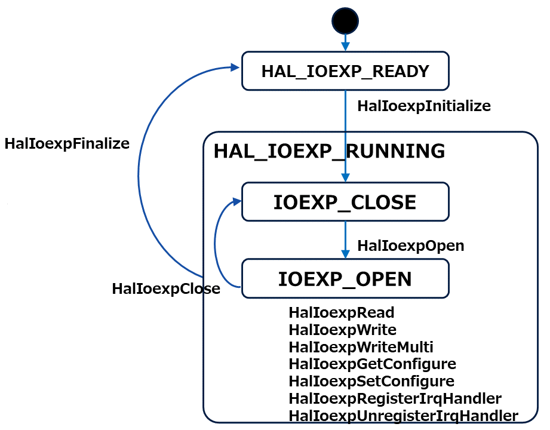
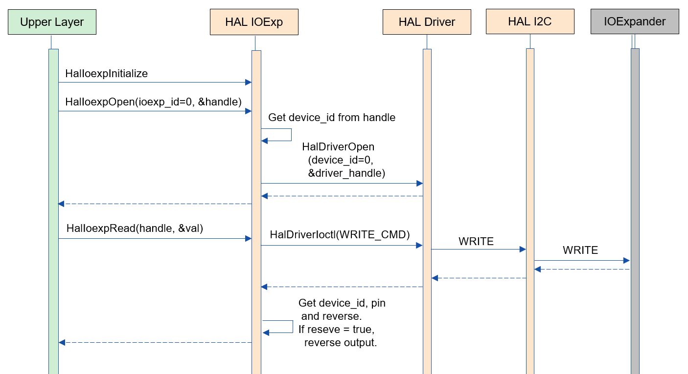
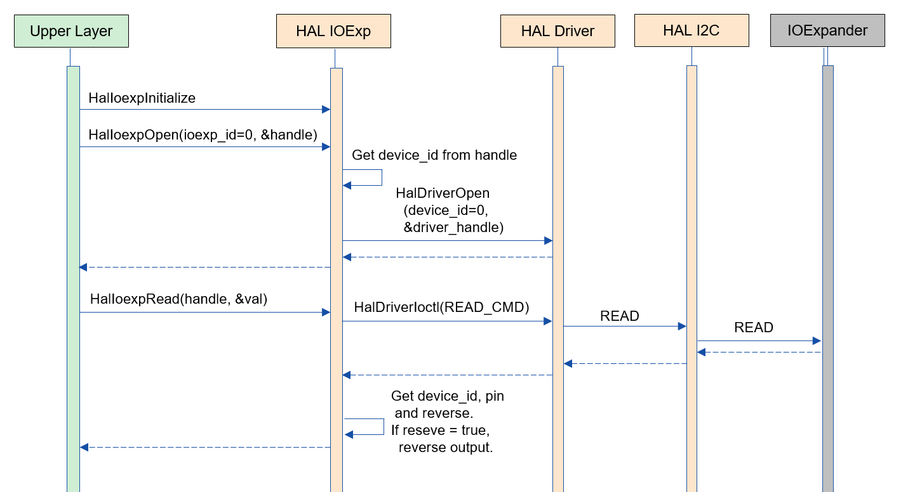
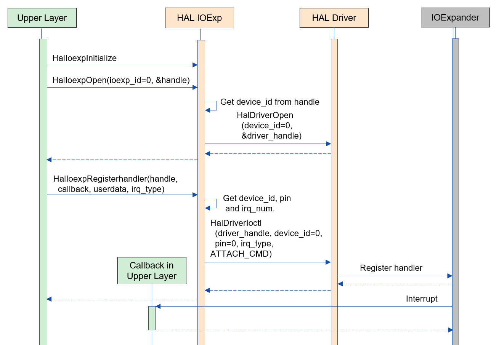

= HAL IOExp
:sectnums:
:sectnumlevels: 3
:chapter-label:
:revnumber: 0.0.3
:toc: left
:toc-title: Table of Contents
:toclevels: 3
:lang: en
:xrefstyle: short
:figure-caption: Figure
:table-caption: Table
:section-refsig:
:experimental:

== Purpose and Scope
This document describes the specifications of HAL IOExp, which is one of the AITRIOS HAL I/F layers. +
The purpose of HAL IOExp is to handle functions related to the IOExpander, such as absorbing output inversion of IOExpander pins and configuring interrupts for IOExpander pins.

<<<

== Terminology

[#_words]
.Term List
[options="header"]
|===
|Term |Description

|HAL
|Hardware Abstract Layer. A layer that absorbs camera-specific differences.

|PL
|Porting Layer. A layer that absorbs camera and OS-specific differences.

|I/F
|Interface
|===

<<<

== Component Description

The HAL IOExp layer is designed to control the camera’s IOExpander. +
This module is not affected by camera-specific differences and can absorb such differences based on the contents of <<#_BuildConfig>>.

=== Component Overview

The following diagram shows the software configuration centered around this block.

.Overview Diagram
image::./images/ioexplib_layer.png[scaledwidth="100%",align="center"]

<<<

=== Detailed Component Description

The following shows an example of the usage sequence for HAL IOExp. +
After executing HalIoexpInitialize, the upper layer can use the various IOExpander control functions through the HAL IOExp APIs.

[#_button_seq]
.Sequence Overview
image::./images/ioexplib_seq.png[scaledwidth="100%",align="center"]

==== Dependent Blocks (for internal HAL use)
.Dependent Blocks
[width="100%",options="header"]
|===
|Block Name |Usage Purpose |Link

|HAL Driver
|Implements the HAL Driver I/F required for implementing HAL drivers.
|https://github.com/aitrios/aitrios-edge-device-manager/blob/main/docs/spec/hal/driver/hal_driver.adoc
|===

<<<

=== State Transitions
The possible states of HAL IOExp are shown in <<#_TableStates>>.

[#_TableStates]
.State List
[width="100%", cols="20%,80%",options="header"]
|===
|State |Description

|HAL_IOEXP_READY
|HAL IOExp is uninitialized.

|HAL_IOEXP_RUNNING
|HAL IOExp is initialized.

|IOEXP_CLOSE
|Handle not acquired. A substate of HAL_IOEXP_RUNNING.

|IOEXP_OPEN
|Handle acquired. A substate of HAL_IOEXP_RUNNING.
|===

In HAL IOExp, the state transitions follow the diagram shown in <<#_FigureState>>. +
If an error occurs in any API, no state transition will take place.

[#_FigureState]
.State Transition Diagram

The acceptance of APIs in each state and their subsequent transition destinations are shown in <<#_TableStateTransition>>. +
In the table, the state names indicate the destination state after the API execution, meaning that the API can be called. +
An × indicates that the API is not accepted; calling an API in these states will return an error and no state transition will occur. +
For details about the errors, refer to <<#_HalErrCode, HalErrCode List>>.

[#_TableStateTransition]
.State Transition Table
[width="100%", cols="10%,20%,20%,20%,20%"]
|===
2.3+| 3+|State
.2+|HAL_IOEXP_READY
2+|HAL_IOEXP_RUNNING
|IOEXP_CLOSE
|IOEXP_OPEN
.20+|API Name

|``**HalIoexpInitialize**``
|HAL_IOEXP_RUNNING
|×
|×

|``**HalIoexpFinalize**``
|×
|HAL_IOEXP_READY
|HAL_IOEXP_READY

|``**HalIoexpOpen**``
|×
|IOEXP_OPEN
|×

|``**HalIoexpClose**``
|×
|×
|IOEXP_CLOSE

|``**HalIoexpSetConfigure**``
|×
|×
|IOEXP_OPEN

|``**HalIoexpGetConfigure**``
|×
|×
|IOEXP_OPEN

|``**HalIoexpWrite**``
|×
|×
|IOEXP_OPEN

|``**HalIoexpWriteMulti**``
|×
|×
|IOEXP_OPEN

|``**HalIoexpRead**``
|×
|×
|IOEXP_OPEN

|``**HalIoexpRegisterIrqHandler**``
|×
|×
|IOEXP_OPEN

|``**HalIoexpUnregisterIrqHandler**``
|×
|×
|IOEXP_OPEN
|===

<<<

=== Component Function List
The list of functions is shown in <<#_TableFunction>>.

[#_TableFunction]
.Function List
[width="100%", cols="30%,55%,15%",options="header"]
|===
|Function Name |Overview |Section Number

|Acquisition/Release of HAL IOExp API Handle
|Acquires or releases a handle for using the HAL IOExp API.
|<<#_Function1>>

|Configuration/Retrieval of IOExpander Pins
|Configures or retrieves settings such as the input/output direction of IOExpander pins.
|<<#_Function2>>

|Setting/Retrieving IOExpander Pin Values
|Sets output values or retrieves input/output values of IOExpander pins.
|<<#_Function3>>

|Configuration of IOExpander Pin Interrupts
|Enables or disables interrupts on IOExpander pins.
|<<#_Function4>>
|===

<<<

=== Component Function Descriptions

[#_Function1]
==== Acquisition/Release of HAL IOExp API Handle
Function Overview::  
Acquires or releases a handle for using the HAL IOExp API.  
Preconditions::  
HAL IOExp must be in an available state.  
Function Details::  
For details on acquiring a handle, refer to <<#_HalIoexpOpen, HalIoexpOpen>>. +
For details on releasing a handle, refer to <<#_HalIoexpClose, HalIoexpClose>>.  
Detailed Behavior::  
For details on acquiring a handle, refer to <<#_HalIoexpOpen, HalIoexpOpen>>. +
For details on releasing a handle, refer to <<#_HalIoexpClose, HalIoexpClose>>.  
Behavior in Case of Errors and Recovery::  
For details on acquiring a handle, refer to <<#_HalIoexpOpen, HalIoexpOpen>>. +
For details on releasing a handle, refer to <<#_HalIoexpClose, HalIoexpClose>>.  
Considerations::  
None  

[#_Function2]
==== Configuration/Retrieval of IOExpander Pins
Function Overview::  
Configures or retrieves settings such as the input/output direction of IOExpander pins.  
Preconditions::  
IOExpander must be in an available state.  
Function Details::  
For details on configuration, refer to <<#_HalIoexpSetConfigure, HalIoexpSetConfigure>>. +
For details on retrieval, refer to <<#_HalIoexpGetConfigure, HalIoexpGetConfigure>>.  
Detailed Behavior::  
For details on configuration, refer to <<#_HalIoexpSetConfigure, HalIoexpSetConfigure>>. +
For details on retrieval, refer to <<#_HalIoexpGetConfigure, HalIoexpGetConfigure>>.  
Behavior in Case of Errors and Recovery::  
For details on configuration, refer to <<#_HalIoexpSetConfigure, HalIoexpSetConfigure>>. +
For details on retrieval, refer to <<#_HalIoexpGetConfigure, HalIoexpGetConfigure>>.  
Considerations::  
None  

[#_Function3]
==== Setting/Retrieving IOExpander Pin Values
Function Overview::  
Sets output values or retrieves input/output values of IOExpander pins.  
Preconditions::  
IOExpander must be in an available state.  
Function Details::  
For details on setting values, refer to <<#_HalIoexpWrite, HalIoexpWrite>>. +
For details on setting multiple values, refer to <<#_HalIoexpWriteMulti, HalIoexpWriteMulti>>. +
For details on retrieving values, refer to <<#_HalIoexpRead, HalIoexpRead>>.  
Detailed Behavior::  
For details on setting values, refer to <<#_HalIoexpWrite, HalIoexpWrite>>. +
For details on setting multiple values, refer to <<#_HalIoexpWriteMulti, HalIoexpWriteMulti>>. +
For details on retrieving values, refer to <<#_HalIoexpRead, HalIoexpRead>>.  
Behavior in Case of Errors and Recovery::  
For details on setting values, refer to <<#_HalIoexpWrite, HalIoexpWrite>>. +
For details on setting multiple values, refer to <<#_HalIoexpWriteMulti, HalIoexpWriteMulti>>. +
For details on retrieving values, refer to <<#_HalIoexpRead, HalIoexpRead>>.  
Considerations::  
None  

[#_Function4]
==== Configuration of IOExpander Pin Interrupts
Function Overview::  
Enables or disables interrupts on IOExpander pins.  
Preconditions::  
IOExpander must be in an available state.  
Function Details::  
For details on enabling interrupts, refer to <<#_HalIoexpRegisterIrqHandler, HalIoexpRegisterIrqHandler>>. +
For details on disabling interrupts, refer to <<#_HalIoexpUnregisterIrqHandler, HalIoexpUnregisterIrqHandler>>.  
Detailed Behavior::  
For details on enabling interrupts, refer to <<#_HalIoexpRegisterIrqHandler, HalIoexpRegisterIrqHandler>>. +
For details on disabling interrupts, refer to <<#_HalIoexpUnregisterIrqHandler, HalIoexpUnregisterIrqHandler>>.  
Behavior in Case of Errors and Recovery::  
For details on enabling interrupts, refer to <<#_HalIoexpRegisterIrqHandler, HalIoexpRegisterIrqHandler>>. +
For details on disabling interrupts, refer to <<#_HalIoexpUnregisterIrqHandler, HalIoexpUnregisterIrqHandler>>.  
Considerations::  
None  

=== List of Component Non-Functional Requirements

The list of non-functional requirements is shown in <<#_TableNonFunction>>.

[#_TableNonFunction]
.Non-Functional Requirements List
[width="100%", cols="30%,55%,15%",options="header"]
|===
|Requirement Name |Overview |Section Number

|Maximum Stack Usage
|Maximum stack size used by HAL IOExp
|<<#_stack, 3.7.1.>>

|Maximum Heap Usage
|Maximum heap size used by HAL IOExp
|<<#_heap, 3.7.2.>>

|Maximum Static Data Usage
|Maximum static data size used by HAL IOExp
|<<#_static, 3.7.3.>>

|Performance
|Performance of the functions provided by HAL IOExp
|<<#_paformance, 3.7.4.>>
|===

=== Description of Component Non-Functional Requirements

[#_stack]
==== Maximum Stack Usage
2048 bytes

[#_heap]
==== Maximum Heap Usage
75 bytes per ioexp_id used +
30 bytes per device_id used

* *Example) In the case of T5* +
** ioexp_id: 0–31 (32 items) +
32 × 75 bytes = 2400 +
** device_id: 0–1 (2 items) +
2 × 30 bytes = 60 bytes

[#_static]
==== Maximum Static Data Usage
150 bytes

[#_paformance]
==== Performance
Less than 1 millisecond

<<<

== API Specifications

=== List of Definitions

==== List of Data Types
The list of data types is shown in <<#_TableDataType>>.

[#_TableDataType]
.Data Type List
[width="100%", cols="30%,55%,15%",options="header"]
|===
|Data Type Name |Overview |Section Number

|enum HalErrCode
|An enumeration that defines the result of API execution.
|<<#_HalErrCode, 4.2.1.>>

|HalIoexpHandle
|A structure that represents a handle for using the HAL IOExp API.
|<<#_HalIoexpHandle, 4.2.2.>>

|enum HalIoexpValue
|An enumeration that represents the value of IOExpander pins.
|<<#_HalIoexpValue, 4.2.3.>>

|HalIoexpIrqHandler
|A function pointer that represents the interrupt handler for the IOExpander.
|<<#_HalIoexpIrqHandler, 4.2.4.>>

|enum HalIoexpIrqType
|An enumeration that represents the GPIO interrupt trigger.
|<<#_HalIoexpIrqType, 4.2.5.>>

|struct HalIoexpConfig
|A structure that represents the configuration of IOExpander pins.
|<<#_HalIoexpConfig, 4.2.6.>>

|enum HalIoexpDirection
|An enumeration that represents the input/output direction of IOExpander pins.
|<<#_HalIoexpDirection, 4.2.7.>>
|===

==== List of APIs
The list of APIs is shown in <<#_TablePublicAPI>>.

[#_TablePublicAPI]
.APIs Directly Usable from Upper Layers
[width="100%", cols="30%,55%,15%",options="header"]
|===
|API Name |Overview |Section Number

|HalIoexpInitialize
|Sets HAL IOExp to an available state.
|<<#_HalIoexpInitialize, 4.3.1.>>

|HalIoexpFinalize
|Sets HAL IOExp to an unavailable state.
|<<#_HalIoexpFinalize, 4.3.2.>>

|HalIoexpOpen
|Acquires a HAL IOExp handle.
|<<#_HalIoexpOpen, 4.3.3.>>

|HalIoexpClose
|Releases a HAL IOExp handle.
|<<#_HalIoexpClose, 4.3.4.>>

|HalIoexpSetConfigure
|Configures the input/output direction and other settings of IOExpander pins.
|<<#_HalIoexpSetConfigure, 4.3.5.>>

|HalIoexpGetConfigure
|Retrieves the input/output direction and other settings of IOExpander pins.
|<<#_HalIoexpGetConfigure, 4.3.6.>>

|HalIoexpWrite
|Sets values to IOExpander pins.
|<<#_HalIoexpWrite, 4.3.7.>>

|HalIoexpWriteMulti
|Sets multiple values to IOExpander pins.
|<<#_HalIoexpWrite, 4.3.8.>>

|HalIoexpRead
|Retrieves the values of IOExpander pins.
|<<#_HalIoexpRead, 4.3.9.>>

|HalIoexpRegisterIrqHandler
|Enables interrupts on IOExpander pins.
|<<#_HalIoexpRegisterIrqHandler, 4.3.10.>>

|HalIoexpUnregisterIrqHandler
|Disables interrupts on IOExpander pins.
|<<#_HalIoexpUnregisterIrqHandler, 4.3.11.>>
|===

<<<

[#_BuildConfig]
==== Build Configuration (for esp32s3)
The configuration information for HAL IOExp is specified in the build configuration.

* *Format* +
[source, C]
....
CONFIG_EXTERNAL_HAL_IOEXP_NUM=32
CONFIG_HAL_IOEXP0_DEV_ID=0
CONFIG_HAL_IOEXP0_PIN=0
CONFIG_HAL_IOEXP0_REVERSE=y
CONFIG_HAL_IOEXP0_IRQ=0
CONFIG_HAL_IOEXP1_DEV_ID=1
CONFIG_HAL_IOEXP1_PIN=0
CONFIG_HAL_IOEXP1_REVERSE=n
CONFIG_HAL_IOEXP1_IRQ=1
...
CONFIG_HAL_IOEXP31_DEV_ID=2
CONFIG_HAL_IOEXP31_PIN=2
CONFIG_HAL_IOEXP31_REVERSE=y
CONFIG_HAL_IOEXP31_IRQ=2
....

[#_BuildConfig_table]
.Description of BuildConfig
[width="100%", cols="30%,70%",options="header"]
|===
|Member Name |Description

|CONFIG_EXTERNAL_HAL_IOEXP_NUM
|The number of ioexp_id to use. The maximum value is 32. +
If CONFIG_EXTERNAL_HAL_IOEXP_NUM = 32, the range of ioexp_id that can be specified is 0–31.

|CONFIG_HAL_IOEXP*_DEV_ID
|The device_id associated with ioexp_id=*.

|CONFIG_HAL_IOEXP*_PIN
|The actual IOExpander chip pin number associated with ioexp_id=*.

|CONFIG_HAL_IOEXP*_REVERSE
|The output inversion flag associated with ioexp_id=*.

|CONFIG_HAL_IOEXP*_IRQ
|The IRQ number associated with ioexp_id=*.
|===

<<<

=== Data Type Definitions

[#_HalErrCode]
==== HalErrCode
An enumeration that defines the result of API execution.  
(T.B.D.)

[#_HalIoexpHandle]
==== HalIoexpHandle
A structure that represents a handle for using the HAL IOExp API.

* *Format* +
[source, C]
....
typedef void *HalIoexpHandle
....

[#_HalIoexpValue]
==== HalIoexpValue
An enumeration that represents the value of IOExpander pins.

* *Format*
[source, C]
....
typedef enum {
  kHalIoexpValueHigh = 0,
  kHalIoexpValueLow,
  kHalIoexpValueMax,
} HalIoexpValue
....

* *Values*

[#_HalIoexpValueValue]
.Description of HalIoexpValue Members
[width="100%", cols="30%,70%",options="header"]
|===
|Member Name |Description

|kHalIoexpValueHigh
|GPIO value is in High state.

|kHalIoexpValueLow
|GPIO value is in Low state.

|kHalIoexpValueMax
|Maximum value of the enum.
|===

[#_HalIoexpIrqHandler]
==== HalIoexpIrqHandler
A function pointer that represents the IOExpander interrupt handler body. +
It is executed when the system detects an IOExpander interrupt.

* *Format* +
[source, C]
....
typedef void (*HalIoexpIrqHandler)(HalIoexpValue val, void *private_data)
....

* *Parameter Descriptions* +
**[OUT] HalIoexpValue val**::  
The value of the IOExpander pin is set.  

**[OUT] void *private_data**::  
The private_data specified in HalIoexpRegisterIrqHandler is set.  

[#_HalIoexpIrqType]
==== HalIoexpIrqType
An enumeration that represents the IOExpander interrupt trigger.

* *Format*
[source, C]
....
typedef enum {
  kHalIoexpIrqTypeRisingEdge = 0,
  kHalIoexpIrqTypeFallingEdge,
  kHalIoexpIrqTypeBothEdge,
  kHalIoexpIrqTypeLowLevel,
  kHalIoexpIrqTypeHighLevel,
  kHalIoexpIrqTypeMax
} HalIoexpIrqType;
....

* *Values*

[#_HalIoexpIrqTypeValue]
.Description of HalIoexpIrqType Members
[width="100%", cols="30%,70%",options="header"]
|===
|Member Name |Description

|kHalIoexpIrqTypeRisingEdge
|Signal level changes from Low to High.

|kHalIoexpIrqTypeFallingEdge
|Signal level changes from High to Low.

|kHalIoexpIrqTypeBothEdge
|Signal level changes in either direction.

|kHalIoexpIrqTypeLowLevel
|Triggered when the signal level remains Low.

|kHalIoexpIrqTypeHighLevel
|Triggered when the signal level remains High.

|kHalIoexpIrqTypeMax
|Maximum value of the enum.
|===

[#_HalIoexpConfig]
==== HalIoexpConfig
A structure that represents the configuration of IOExpander pins.

* *Format* +
[source, C]
....
typedef struct {
  HalIoexpDirection direction;
} HalIoexpConfig;
....

[#_HalIoexpConfig_table]
.Description of HalIoexpConfig Members
[width="100%", cols="30%,70%",options="header"]
|===
|Member Name |Description

|HalIoexpDirection direction;
|Input/output direction of the pin.
|===

[#_HalIoexpDirection]
==== HalIoexpDirection
An enumeration that represents the input/output direction of IOExpander pins.

* *Format* +
[source, C]
....
typedef enum {
  kHalIoexpDirectionInput = 0,
  kHalIoexpDirectionOutput,
  kHalIoexpDirectionMax
} HalIoexpDirection;
....

[#_HalIoexpDirection_table]
.Description of HalIoexpDirection Members
[width="100%", cols="30%,70%",options="header"]
|===
|Member Name |Description

|kHalIoexpDirectionInput
|Input direction.

|kHalIoexpDirectionOutput
|Output direction.

|kHalIoexpDirectionMax
|Maximum value of the enum.
|===

<<<

=== Description of Each API

[#_HalIoexpInitialize]
==== HalIoexpInitialize

* *Function* +
Sets HAL IOExp to an available state.

* *Format* +
[source, C]
....
HalErrCode HalIoexpInitialize(void)
....

* *Parameter Descriptions* +
-

* *Return Value* +
Returns one of the HalErrCode values depending on the execution result.

* *Description* +
** Sets HAL IOExp to an available state.

[#_HalIoexpInitialize]
.API Detailed Information
[width="100%", cols="30%,70%",options="header"]
|===
|API Detail |Description

|API Type
|Synchronous API

|Execution Context
|Operates in the caller's context.

|Concurrent Calls
|Not allowed.

|Calls from Multiple Threads
|Allowed.

|Calls from Multiple Tasks
|Allowed.

|Does the API block internally?
|Yes, it blocks. +
If the HAL IOExp API is operating in another context, this API waits until completion before execution. However, calling Initialize twice results in an error.
|===

[#_HalIoexpInitialize_error]
.Error Information
[options="header"]
|===
|Error Code |Cause |State of OUT Parameter |System State After Error |Recovery Method

|kHalErrInvalidState (tentative)
|Already in an available state.
|-
|No impact
|Not required

|kHalErrInvalidParam (tentative)
|Parameter error
|-
|No impact
|Not required

|kHalErrLock (tentative)
|Blocking error
|-
|No impact
|Not required
|===

<<<

[#_HalIoexpFinalize]
==== HalIoexpFinalize

* *Function* +
Sets HAL IOExp to an unavailable state.

* *Format* +
[source, C]
....
HalErrCode HalIoexpFinalize(void)
....

* *Parameter Descriptions* +
-

* *Return Value* +
Returns one of the HalErrCode values depending on the execution result.

* *Description* +
** Sets HAL IOExp to an unavailable state. +
** This API can be used only after executing HalIoexpInitialize. +
** If there are handles with unregistered interrupts, it will unregister the interrupts. +
** If there are acquired handles, it will release them.

[#_HalIoexpFinalize]
.API Detailed Information
[width="100%", cols="30%,70%",options="header"]
|===
|API Detail |Description

|API Type
|Synchronous API

|Execution Context
|Operates in the caller's context.

|Concurrent Calls
|Not allowed.

|Calls from Multiple Threads
|Allowed.

|Calls from Multiple Tasks
|Allowed.

|Does the API block internally?
|Yes, it blocks. +
If the HAL IOExp API is operating in another context, this API waits until completion before execution. +
HAL implementation developers must call this within the HAL API. +
However, calling Finalize twice results in an error.
|===

[#_HalIoexpFinalize_error]
.Error Information
[options="header"]
|===
|Error Code |Cause |State of OUT Parameter |System State After Error |Recovery Method

|kHalErrInvalidState (tentative)
|HalIoexpInitialize has not been executed.
|-
|No impact
|Not required

|kHalErrLock (tentative)
|Blocking error
|-
|No impact
|Not required
|===

<<<

[#_HalIoexpOpen]
==== HalIoexpOpen

* *Function* +
Sets the IOExpander to an available state.

* *Format* +
[source, C]
....
HalErrCode HalIoexpOpen(uint32_t ioexp_id, HalIoexpHandle *handle)
....

* *Parameter Descriptions* +
**[IN] uint32_t ioexp_id**::  
The ID of the IOExpander for which the handle is to be acquired.  

**[OUT] <<#_HalIoexpHandle, HalIoexpHandle>> *handle**::  
HAL IOExp handle. Returns an error if NULL.

* *Return Value* +
Returns one of the HalErrCode values depending on the execution result.

* *Description* +
** Acquires a HAL IOExp handle. +
** This API can be used only after executing HalIoexpInitialize. +
** Returns an error if a non-existent ioexp_id is specified. +
** Returns an error if the specified ioexp_id has already been acquired.

[#_HalIoexpOpen]
.API Detailed Information
[width="100%", cols="30%,70%",options="header"]
|===
|API Detail |Description

|API Type
|Synchronous API

|Execution Context
|Operates in the caller's context.

|Concurrent Calls
|Allowed.

|Calls from Multiple Threads
|Allowed.

|Calls from Multiple Tasks
|Allowed.

|Does the API block internally?
|Yes, it blocks. +
If the HAL IOExp API is operating in another context, this API waits until completion before execution.
|===

[#_HalIoexpOpen_error]
.Error Information
[options="header"]
|===
|Error Code |Cause |State of OUT Parameter |System State After Error |Recovery Method

|kHalErrInvalidState (tentative)
|HalIoexpInitialize has not been executed.
|-
|No impact
|Not required

|kHalErrLock (tentative)
|Blocking error
|-
|No impact
|Not required

|kHalErrInvalidParam (tentative)
|Parameter error
|-
|No impact
|Not required
|===

<<<

[#_HalIoexpClose]
==== HalIoexpClose

* *Function* +
Sets the IOExpander to an unavailable state.

* *Format* +
[source, C]
....
HalErrCode HalIoexpClose(const HalIoexpHandle handle)
....

* *Parameter Descriptions* +
**[IN] const <<#_HalIoexpHandle, HalIoexpHandle>> handle**::  
HAL IOExp handle. Returns an error if NULL.

* *Return Value* +
Returns one of the HalErrCode values depending on the execution result.

* *Description* +
** Releases a HAL IOExp handle. +
** This API can be used only after executing HalIoexpInitialize. +
** Use a handle acquired by HalIoexpOpen. +
** If the IOExpander is running, waits for completion before execution. +
** If a handle is passed that still has registered interrupts, this API unregisters the interrupts before releasing the handle.

[#_HalIoexpClose]
.API Detailed Information
[width="100%", cols="30%,70%",options="header"]
|===
|API Detail |Description

|API Type
|Synchronous API

|Execution Context
|Operates in the caller's context.

|Concurrent Calls
|Allowed.

|Calls from Multiple Threads
|Allowed.

|Calls from Multiple Tasks
|Allowed.

|Does the API block internally?
|Yes, it blocks. +
If the HAL IOExp API is operating in another context, this API waits until completion before execution.
|===

[#_HalIoexpClose_error]
.Error Information
[options="header"]
|===
|Error Code |Cause |State of OUT Parameter |System State After Error |Recovery Method

|kHalErrInvalidState (tentative)
|HalIoexpInitialize has not been executed.
|-
|No impact
|Not required

|kHalErrLock (tentative)
|Blocking error
|-
|No impact
|Not required

|kHalErrInvalidParam (tentative)
|Parameter error
|-
|No impact
|Not required
|===

<<<

[#_HalIoexpSetConfigure]
==== HalIoexpSetConfigure

* *Function* +
Configures information such as the input/output direction for IOExpander pins.

* *Format* +
[source, C]
....
HalErrCode HalIoexpSetConfigure(const HalIoexpHandle handle, const HalIoexpConfig *config)
....

* *Parameter Descriptions* +
**[IN] const <<#_HalIoexpHandle, HalIoexpHandle>> handle**::  
HAL IOExp handle. Returns an error if NULL. +
The actual pin number of the IOExpander chip is linked to the ioexp_id of the acquired handle.

**[IN] const <<#_HalIoexpConfig, HalIoexpConfig>> *config**::  
Configuration information for the IOExpander. Returns an error if NULL.

* *Return Value* +
Returns one of the HalErrCode values depending on the execution result.

* *Description* +
** Configures the input/output direction and other settings for IOExpander pins. +
** This API can be used only after executing HalIoexpInitialize. +
** Use a handle acquired by HalIoexpOpen. +
** Returns an error if a non-existent pin number is specified. +
** Returns an error if a handle registered as an interrupt pin by HalIoexpRegisterIrqHandler is specified.

[#_HalIoexpSetConfigure]
.API Detailed Information
[width="100%", cols="30%,70%",options="header"]
|===
|API Detail |Description

|API Type
|Synchronous API

|Execution Context
|Operates in the caller's context.

|Concurrent Calls
|Allowed.

|Calls from Multiple Threads
|Allowed.

|Calls from Multiple Tasks
|Allowed.

|Does the API block internally?
|Yes, it blocks. +
If the HAL IOExp API is operating in another context, this API waits until completion before execution.
|===

[#_HalIoexpSetConfigure_error]
.Error Information
[options="header"]
|===
|Error Code |Cause |State of OUT Parameter |System State After Error |Recovery Method

|kHalErrInvalidState (tentative)
|HalIoexpInitialize has not been executed.
|-
|No impact
|Not required

|kHalErrLock (tentative)
|Blocking error
|-
|No impact
|Not required

|kHalIoexpConfigError (tentative)
|Ioexp configuration error.
|-
|No impact
|Not required

|kHalErrInvalidParam (tentative)
|Parameter error
|-
|No impact
|Not required
|===

<<<

[#_HalIoexpGetConfigure]
==== HalIoexpGetConfigure

* *Function* +
Retrieves information such as the input/output direction from IOExpander pins.

* *Format* +
[source, C]
....
HalErrCode HalIoexpGetConfigure(const HalIoexpHandle handle, HalIoexpConfig *config)
....

* *Parameter Descriptions* +
**[IN] const <<#_HalIoexpHandle, HalIoexpHandle>> handle**::  
HAL IOExp handle. Returns an error if NULL. +
The actual pin number of the IOExpander chip is linked to the ioexp_id of the acquired handle.

**[OUT] <<#_HalIoexpConfig, HalIoexpConfig>> *config**::  
Retrieved configuration information for the IOExpander. Returns an error if NULL.

* *Return Value* +
Returns one of the HalErrCode values depending on the execution result.

* *Description* +
** Retrieves the input/output direction and other settings from IOExpander pins. +
** This API can be used only after executing HalIoexpInitialize. +
** Use a handle acquired by HalIoexpOpen. +
** Returns an error if a non-existent pin number is specified.

[#_HalIoexpGetConfigure]
.API Detailed Information
[width="100%", cols="30%,70%",options="header"]
|===
|API Detail |Description

|API Type
|Synchronous API

|Execution Context
|Operates in the caller's context.

|Concurrent Calls
|Allowed.

|Calls from Multiple Threads
|Allowed.

|Calls from Multiple Tasks
|Allowed.

|Does the API block internally?
|Yes, it blocks. +
If the HAL IOExp API is operating in another context, this API waits until completion before execution.
|===

[#_HalIoexpGetConfigure_error]
.Error Information
[options="header"]
|===
|Error Code |Cause |State of OUT Parameter |System State After Error |Recovery Method

|kHalErrInvalidState (tentative)
|HalIoexpInitialize has not been executed.
|-
|No impact
|Not required

|kHalErrLock (tentative)
|Blocking error
|-
|No impact
|Not required

|kHalErrInvalidParam (tentative)
|Parameter error
|-
|No impact
|Not required
|===

<<<

[#_HalIoexpWrite]
==== HalIoexpWrite

* *Function* +
Sets values on IOExpander pins.

* *Format* +
[source, C]
....
HalErrCode HalIoexpWrite(const HalIoexpHandle handle, HalIoexpValue value)
....

* *Parameter Descriptions* +
**[IN] const <<#_HalIoexpHandle, HalIoexpHandle>> handle**::  
HAL IOExp handle. Returns an error if NULL. +
The actual pin number of the IOExpander chip is linked to the ioexp_id of the acquired handle.

**[IN] <<#_HalIoexpValue, HalIoexpValue>> value**::  
The value to set on the IOExpander pin.

* *Return Value* +
Returns one of the HalErrCode values depending on the execution result.

* *Description* +
** Sets a value on an IOExpander pin. +
** This API can be used only after executing HalIoexpInitialize. +
** Use a handle acquired by HalIoexpOpen. +
** Returns an error if a non-existent pin number is specified. +
** Returns an error if the specified pin is registered as an interrupt pin by HalIoexpRegisterIrqHandler. +
** Returns an error if the specified pin is configured as Output.

[#_HalIoexpWrite_desc]
.API Detailed Information
[width="100%", cols="30%,70%",options="header"]
|===
|API Detail |Description

|API Type
|Synchronous API

|Execution Context
|Operates in the caller's context.

|Concurrent Calls
|Allowed.

|Calls from Multiple Threads
|Allowed.

|Calls from Multiple Tasks
|Allowed.

|Does the API block internally?
|Yes, it blocks. +
If the HAL IOExp API is operating in another context, this API waits until completion before execution.
|===

[#_HalIoexpWrite_error]
.Error Information
[options="header"]
|===
|Error Code |Cause |State of OUT Parameter |System State After Error |Recovery Method

|kHalErrInvalidState (tentative)
|HalIoexpInitialize has not been executed.
|-
|No impact
|Not required

|kHalErrLock (tentative)
|Blocking error
|-
|No impact
|Not required

|kHalErrInvalidValue (tentative)
|Value setting error.
|-
|No impact
|Not required
|===

[#_HalIoexpWriteMulti]
==== HalIoexpWriteMulti

* *Function* +
Sets multiple values on IOExpander pins.

* *Format* +
[source, C]
....
HalErrCode HalIoexpWriteMulti(const HalIoexpHandle *handle_array, uint32_t handle_num, const HalIoexpValue *value_array, uint32_t value_num)
....

* *Parameter Descriptions* +
**[IN] const <<#_HalIoexpHandle, HalIoexpHandle>> *handle_array**::  
Array of HAL IOExp handles. Returns an error if NULL. +
The actual device IDs and pin numbers of the IOExpander chip are linked to the ioexp_id of each acquired handle.

**[IN] uint32_t handle_num**::  
Number of HAL IOExp handles in the array.  
Returns an error if 0.

**[IN] const <<#_HalIoexpValue, HalIoexpValue>> *value_array**::  
Array of values to set on the IOExpander pins.

**[IN] uint32_t value_num**::  
Number of values in the array.  
Returns an error if 0.  
Returns an error if it differs from handle_num.

* *Return Value* +
Returns one of the HalErrCode values depending on the execution result.

* *Description* +
** Sets multiple values on IOExpander pins. +
** Create arrays such that each specified HAL IOExp handle corresponds to the respective IOExpander pin value. +
** This API can be used only after executing HalIoexpInitialize. +
** Use handles acquired by HalIoexpOpen. +
** Returns an error if a non-existent pin number is specified. +
** Returns an error if a pin specified is registered as an interrupt pin by HalIoexpRegisterIrqHandler. +
** Returns an error if a pin specified is configured as Output. +
** Returns an error if different device IDs are present in the specified HAL IOExp handle array. +
** Returns an error if duplicate pin numbers exist in the specified HAL IOExp handle array.

[#_HalIoexpWriteMulti_desc]
.API Detailed Information
[width="100%", cols="30%,70%",options="header"]
|===
|API Detail |Description

|API Type
|Synchronous API

|Execution Context
|Operates in the caller's context.

|Concurrent Calls
|Allowed.

|Calls from Multiple Threads
|Allowed.

|Calls from Multiple Tasks
|Allowed.

|Does the API block internally?
|Yes, it blocks. +
If the HAL IOExp API is operating in another context, this API waits until completion before execution.
|===

[#_HalIoexpWriteMulti_error]
.Error Information
[options="header"]
|===
|Error Code |Cause |State of OUT Parameter |System State After Error |Recovery Method

|kHalErrInvalidState (tentative)
|HalIoexpInitialize has not been executed.
|-
|No impact
|Not required

|kHalErrLock (tentative)
|Blocking error.
|-
|No impact
|Not required

|kHalErrInvalidValue (tentative)
|Value setting error.
|-
|No impact
|Not required
|===

<<<

[#_HalIoexpRead]
==== HalIoexpRead

* *Function* +
Retrieves the value of an IOExpander pin.

* *Format* +
[source, C]
....
HalErrCode HalIoexpRead(const HalIoexpHandle handle, HalIoexpValue *value)
....

* *Parameter Descriptions* +
**[IN] const <<#_HalIoexpHandle, HalIoexpHandle>> handle**::  
HAL IOExp handle. Returns an error if NULL. +
The actual pin number of the IOExpander chip is linked to the ioexp_id of the acquired handle.

**[OUT] <<#_HalIoexpValue, HalIoexpValue>> *value**::  
The retrieved value of the pin. Returns an error if NULL.

* *Return Value* +
Returns one of the HalErrCode values depending on the execution result.

* *Description* +
** Retrieves the value of an IOExpander pin. +
** This API can be used only after executing HalIoexpInitialize. +
** Use a handle acquired by HalIoexpOpen. +
** Returns an error if a non-existent pin number is specified.

[#_HalIoexpRead_desc]
.API Detailed Information
[width="100%", cols="30%,70%",options="header"]
|===
|API Detail |Description

|API Type
|Synchronous API

|Execution Context
|Operates in the caller's context.

|Concurrent Calls
|Allowed.

|Calls from Multiple Threads
|Allowed.

|Calls from Multiple Tasks
|Allowed.

|Does the API block internally?
|Yes, it blocks. +
If the HAL IOExp API is operating in another context, this API waits until completion before execution.
|===

[#_HalIoexpRead_error]
.Error Information
[options="header"]
|===
|Error Code |Cause |State of OUT Parameter |System State After Error |Recovery Method

|kHalErrInvalidState (tentative)
|HalIoexpInitialize has not been executed.
|-
|No impact
|Not required

|kHalErrLock (tentative)
|Blocking error
|-
|No impact
|Not required

|kHalErrInvalidValue (tentative)
|Value retrieval error.
|-
|No impact
|Not required
|===

<<<

[#_HalIoexpRegisterIrqHandler]
==== HalIoexpRegisterIrqHandler

* *Function* +
Enables interrupts on IOExpander pins.

* *Format* +
[source, C]
....
HalErrCode HalIoexpRegisterIrqHandler(const HalIoexpHandle handle, HalIoexpIrqHandler handler, void *private_data, HalIoexpIrqType type)
....

* *Parameter Descriptions* +
**[IN] const <<#_HalIoexpHandle, HalIoexpHandle>> handle**::  
HAL IOExp handle. Returns an error if NULL. +
The actual pin number of the IOExpander chip is linked to the ioexp_id of the acquired handle.

**[IN] <<#_HalIoexpIrqHandler, HalIoexpIrqHandler>> handler**::  
Interrupt handler. Returns an error if NULL.

**[IN] void *private_data**::  
Parameter set when the interrupt handler is executed. Can be NULL.

**[IN] <<#_HalIoexpIrqType, HalIoexpIrqType>> type**::  
Type of interrupt to detect.

* *Return Value* +
Returns one of the HalErrCode values depending on the execution result.

* *Description* +
** Enables interrupts on IOExpander pins. +
** This API can be used only after executing HalIoexpInitialize. +
** Use a handle acquired by HalIoexpOpen. +
** Returns an error if a non-existent pin number is specified. +
** Returns an error if the pin number has already been registered for interrupts.

[#_HalIoexpRegisterIrqHandler_desc]
.API Detailed Information
[width="100%", cols="30%,70%",options="header"]
|===
|API Detail |Description

|API Type
|Synchronous API

|Execution Context
|Operates in the caller's context.

|Concurrent Calls
|Allowed.

|Calls from Multiple Threads
|Allowed.

|Calls from Multiple Tasks
|Allowed.

|Does the API block internally?
|Yes, it blocks. +
If HAL IOExpLib API is running in another context, this API waits until completion before execution.
|===

[#_HalIoexpRegisterIrqHandler_error]
.Error Information
[options="header"]
|===
|Error Code |Cause |State of OUT Parameter |System State After Error |Recovery Method

|kHalErrInvalidState (tentative)
|HalIoexpInitialize has not been executed.
|-
|No impact
|Not required

|kHalErrInvalidParam (tentative)
|Parameter error.
|-
|No impact
|Not required

|kHalErrLock (tentative)
|Blocking error.
|-
|No impact
|Not required
|===

<<<

[#_HalIoexpUnregisterIrqHandler]
==== HalIoexpUnregisterIrqHandler

* *Function* +
Disables interrupts on IOExpander pins.

* *Format* +
[source, C]
....
HalErrCode HalIoexpUnregisterIrqHandler(const HalIoexpHandle handle)
....

* *Parameter Descriptions* +
**[IN] const <<#_HalIoexpHandle, HalIoexpHandle>> handle**::  
HAL IOExp handle. Returns an error if NULL. +
The actual pin number of the IOExpander chip is linked to the ioexp_id of the acquired handle.

* *Return Value* +
Returns one of the HalErrCode values depending on the execution result.

* *Description* +
** Disables interrupts on IOExpander pins. +
** This API can be used only after executing HalIoexpInitialize. +
** Use a handle acquired by HalIoexpOpen. +
** If the interrupt handler is currently running, waits for completion before execution. +
** Returns an error if a non-existent pin number is specified. +
** Returns an error if the pin number has not been registered for interrupts.

[#_HalIoexpUnregisterIrqHandler_desc]
.API Detailed Information
[width="100%", cols="30%,70%",options="header"]
|===
|API Detail |Description

|API Type
|Synchronous API

|Execution Context
|Operates in the caller's context.

|Concurrent Calls
|Allowed.

|Calls from Multiple Threads
|Allowed.

|Calls from Multiple Tasks
|Allowed.

|Does the API block internally?
|Yes, it blocks. +
If the HAL IOExp API is operating in another context, this API waits until completion before execution.
|===

[#_HalIoexpUnregisterIrqHandler_error]
.Error Information
[options="header"]
|===
|Error Code |Cause |State of OUT Parameter |System State After Error |Recovery Method

|kHalErrInvalidState (tentative)
|HalIoexpInitialize has not been executed.
|-
|No impact
|Not required

|kHalErrInvalidParam (tentative)
|Parameter error.
|-
|No impact
|Not required

|kHalErrLock (tentative)
|Blocking error.
|-
|No impact
|Not required
|===

<<<

== Example API Usage

=== Example up to HalIoexpWrite

=== Example up to HalIoexpRead

=== Example of HalIoexpRegisterIRQHandler

== List of OSS Used
None

<<<

== Revision History
[width="100%", cols="20%,80%",options="header"]
|===
|Version |Changes

|0.0.1
|Initial version.

|0.0.2
|- Entire document: Inserted half-width spaces around English words for readability. +
- Terminology: Removed OSAL entry and added PL. +
- Changed HAL Config description to BuildConfig. +
- Replaced Ioexplib description with HAL IOExp. +
- Changed HalInitialize/HalFinalize to HalIoexpInitialize/HalIoexpFinalize. +
- Removed OSAL List and Hal Driver IOExpander from dependent blocks. +
- Changed HAL_READY/HAL_RUNNING to HAL_IOEXP_READY/HAL_IOEXP_RUNNING. +
- Updated hal_overview.adoc description to HalErrCode List (T.B.D.). +
- Section 4.3: Changed HalIoexpInitialize/HalIoexpFinalize to public functions and rearranged API list. +
- Removed APIs used only internally within HAL. +
- Changed error code prefix from kHAL* to kHalErr*. +
- Updated diagrams (*.png) to English versions.

|0.0.3
|- Added HalIoexpWriteMulti API. +
- Section 4.3: Updated display names for the following links: +
  HalIoexpHandle, HalIoexpValue, HalIoexpIrqHandler, HalIoexpIrqType, HalIoexpConfig.
|===
