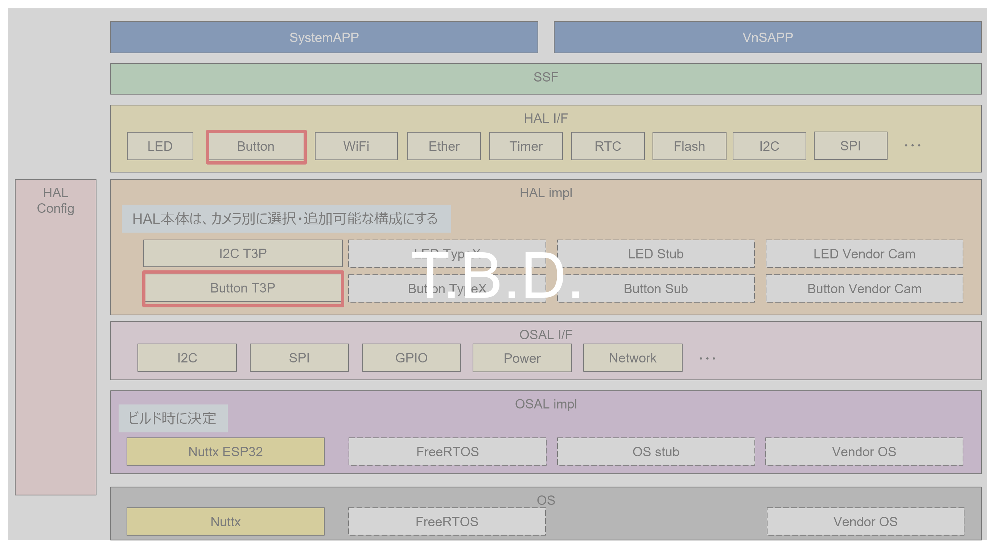
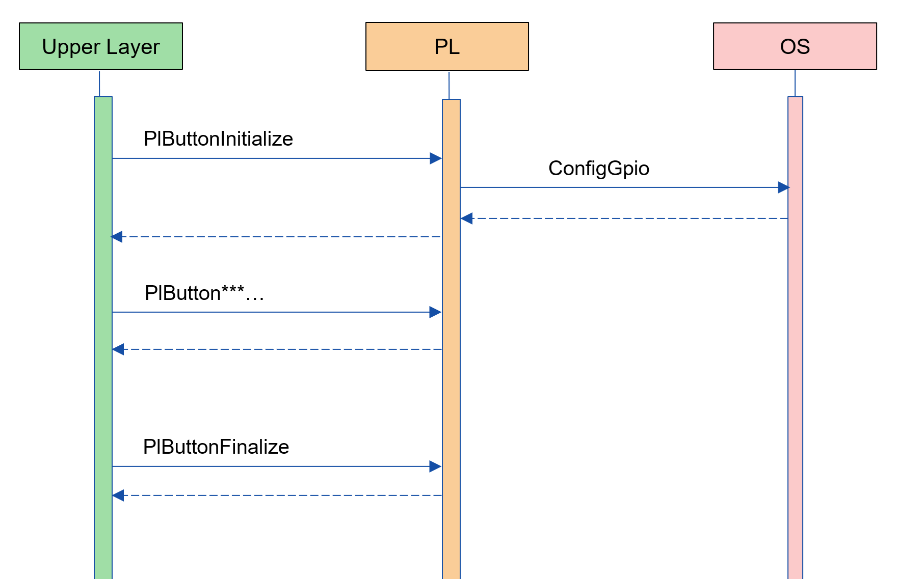
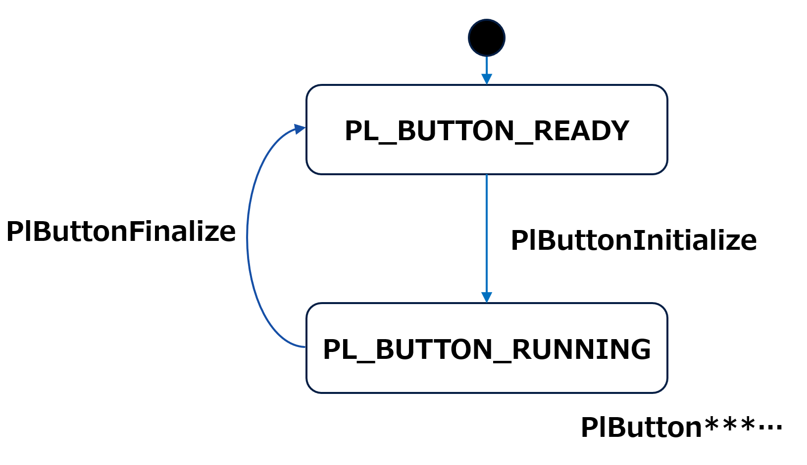
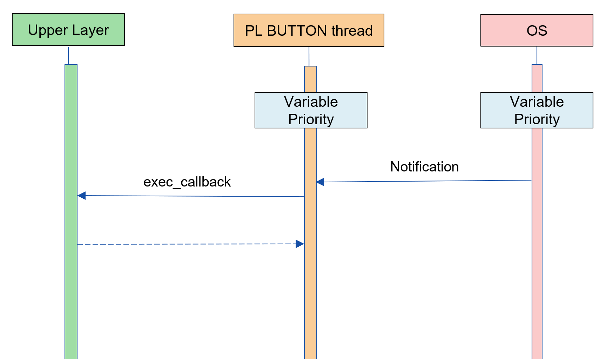
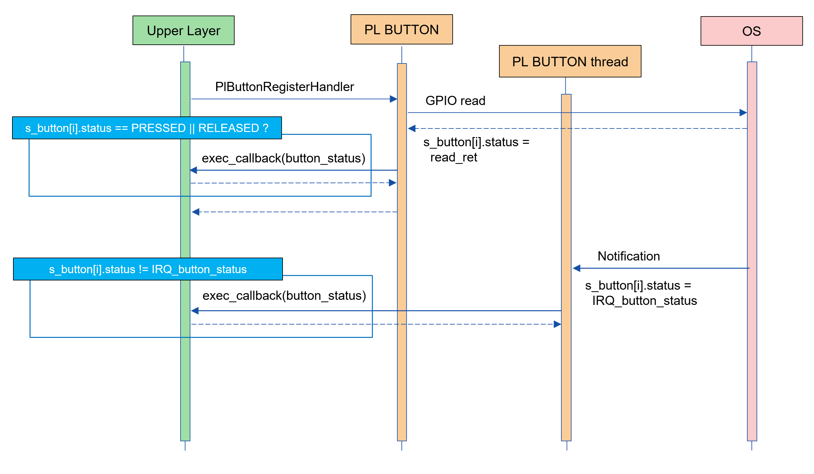

= PL BUTTON
:sectnums:
:sectnumlevels: 3
:chapter-label:
:revnumber: 0.0.2
:toc: left
:toc-title: 目次
:toclevels: 3
:lang: ja
:xrefstyle: short
:figure-caption: Figure
:table-caption: Table
:section-refsig:
:experimental:

== 目的と適用範囲

本書では AITRIOS PL の impl レイヤーの一つである、PL Button impl の仕様について記載します。
ボタン割り込みの検出など、本来であれば基板毎に差が出てくる実装を吸収するのが PL BUTTON レイヤーの目的です。

<<<

== 用語

[#_words]
.用語一覧
[options="header"]
|===
|用語 |説明 

|PL
|Porting Layer. カメラ/ OS 差分を吸収する層
|===

<<<

== コンポーネントの説明

PL Button レイヤーは、カメラ差分を意識せずに使える PL I/F に対する本体部分であり、ボタン機能に関するカメラ差分を吸収することが目的となります。
また、ターゲットとするカメラに合わせて追加・変更が可能です。

=== コンポーネントの概要

以下に本ブロックを中心としたソフトウェア構成図を示します。

.概要図

<<<

=== コンポーネントの詳細説明

PL BUTTON の使用シーケンス例を以下に示します。
上位レイヤーは PlButtonInitialize を実行後、PL BUTTON API を使用して各種 Button 機能を使うことができます。

[#_button_seq]
.シーケンス概要

==== 依存ブロック（PL 内部向け）
なし

<<<

=== 状態遷移
PL の取り得る状態を <<#_TableStates>> に示します。

[#_TableStates]
.状態一覧
[width="100%", cols="20%,80%",options="header"]
|===
|状態 |説明 

|PL_BUTTON_READY
|初期状態

|PL_BUTTON_RUNNING
|実行可能状態
|===

PL では <<#_FigureState>> に示す状態遷移を行います。 +
また、各 API でエラーが発生した場合には状態遷移は起こりません。 +

[#_FigureState]
.状態遷移図

各状態での API 受け付け可否と状態遷移先を <<#_TableStateTransition>> に示します。表中の状態名は、API 実行完了後の遷移先状態を示し、すなわち API 呼び出し可能であることを示します。 +
× は API 受け付け不可を示し、ここでの API 呼び出しはエラーを返し状態遷移は起きません。エラーの詳細は <<#_PlErrCode, PlErrCode 一覧>> を参照してください。 

[#_TableStateTransition]
.状態遷移表
[width="100%", cols="10%,30%,30%,30%"]
|===
2.2+| 2+|状態 
|PL_BUTTON_READY |PL_BUTTON_RUNNING 
.10+|API 名

|``**PlButtonInitialize**``            
|PL_BUTTON_RUNNING                   
|×

|``**PlButtonFinalize**``   
|×                   
|PL_BUTTON_READY

|``**PlButtonGetInfo**``   
|×                   
|PL_BUTTON_RUNNING

|``**PlButtonRegisterHandler**``   
|×                   
|PL_BUTTON_RUNNING

|``**PlButtonUnregisterHandler**``   
|×                   
|PL_BUTTON_RUNNING
|===

<<<

=== コンポーネントの機能一覧
<<#_TableFunction>> に機能の一覧を示します。

[#_TableFunction]
.機能一覧
[width="100%", cols="30%,55%,15%",options="header"]
|===
|機能名 |概要  |節番号
|カメラが持つボタン情報の取得
|カメラが持つボタンの総数などを取得できます。
|<<#_Function1>>

|ボタンに対するハンドラの登録
|ボタンイベントが起きた時に実行したいハンドラを登録できます。
|<<#_Function2>>

|ボタンに対するハンドラの登録解除
|ボタンイベントに対するハンドラを解除します。
|<<#_Function3>>
|===

<<<

=== コンポーネントの機能説明
[#_Function1]
==== カメラが持つボタン情報の取得
機能概要::
カメラが持つボタンの総数などを取得できます。
前提条件::
PlButtonInitialize が実行済みであること
機能詳細::
詳細は <<#_PlButtonGetInfo, PlButtonGetInfo>> を参照してください。
詳細挙動::
詳細は <<#_PlButtonGetInfo, PlButtonGetInfo>> を参照してください。
エラー時の挙動、復帰方法::
詳細は <<#_PlButtonGetInfo, PlButtonGetInfo>> を参照してください。
検討事項::
なし

[#_Function2]
==== ボタンに対するハンドラの登録
機能概要::
ボタンイベントが起きた時に実行したいハンドラを登録できます。
前提条件::
PlButtonInitialize が実行済みであること
機能詳細::
詳細は <<#_PlButtonRegisterHandler, PlButtonRegisterHandler>> を参照してください。
詳細挙動::
詳細は <<#_PlButtonRegisterHandler, PlButtonRegisterHandler>> を参照してください。
エラー時の挙動、復帰方法::
詳細は <<#_PlButtonRegisterHandler, PlButtonRegisterHandler>> を参照してください。
検討事項::
なし

[#_Function3]
==== ボタンに対するハンドラの登録解除
機能概要::
ボタンイベントに対するハンドラを解除します。
前提条件::
PlButtonInitialize が実行済みであること
機能詳細::
詳細は <<#_PlButtonUnregisterHandler, PlButtonUnregisterHandler>> を参照してください。
詳細挙動::
詳細は <<#_PlButtonUnregisterHandler, PlButtonUnregisterHandler>> を参照してください。
エラー時の挙動、復帰方法::
詳細は <<#_PlButtonUnregisterHandler, PlButtonUnregisterHandler>> を参照してください。
検討事項::
なし

<<<

=== コンポーネントの非機能要件一覧

<<#_TableNonFunction>> に非機能要件の一覧を示します。

[#_TableNonFunction]
.非機能要件一覧
[width="100%", cols="30%,55%,15%",options="header"]
|===
|機能名 |概要  |節番号
|Stack 最大使用量
|PL BUTTON が使用する最大スタックサイズ
|<<#_stack, 3.7.1.>>

|通常ヒープ最大使用量
|PL BUTTON が使用する最大 app ヒープサイズ
|<<#_appheap, 3.7.2.>>

|static データ最大使用量
|PL BUTTON が使用する最大 static データサイズ
|<<#_static, 3.7.3.>>

|パフォーマンス
|PL BUTTON が提供する機能のパフォーマンス
|<<#_paformance, 3.7.4.>>
|===

=== コンポーネントの非機能要件説明

[#_stack]
==== Stack 最大使用量
[width="100%", cols="50%,50%",options="header"]
|===
|用途 |使用量
|各 PL BUTTON API 中で使用するスタック領域
|最大 1 KB

|PlButtonHandler 実行用スレッドのスタックサイズ
|4 KB
|===

[#_heap]
==== 通常ヒープ最大使用量
CONFIG で定義するボタンの数 ひとつにつき通常ヒープを 256 バイト使用します。

==== app ヒープ最大使用量
PL BUTTON では app ヒープを使用しません。

[#_static]
==== static データ最大使用量
256 バイト使用します。

[#_paformance]
==== パフォーマンス
** 本モジュールのすべての API は 1 ms 以下で動作します。
*** 下位モジュールのパフォーマンスは含みません。別途参照してください。

<<<

=== 制約
==== 注意事項
Button コールバックを実行する PL 側のスレッドはひとつのみです。複数のボタン割込みが検出された際、コールバックが重い処理があると、後続のコールバック実行が遅れるので注意してください。

== API 仕様
=== 定義一覧
==== データ型一覧
<<#_TableDataType>> にデータ型の一覧を示します。

[#_TableDataType]
.データ型一覧
[width="100%", cols="30%,55%,15%",options="header"]
|===
|データ型名 |概要  |節番号
|enum PlErrCode
|API の実行結果を定義する列挙型です。
|<<#_PlErrCode, PlErrCode 一覧>>

|enum PlButtonStatus
|ボタンの状態を表す列挙型です。
|<<#_PlButtonStatus, 4.2.2.>>

|PlButtonHandler
|ボタンのイベントハンドラ本体を表す関数ポインタです。
|<<#_PlButtonHandler, 4.2.3.>>
|===

==== API 一覧
<<#_TablePublicAPI>> および <<#_TablePrivateAPI>> に API の一覧を示します。

[#_TablePublicAPI]
.上位アプリから直接使用可能な API
[width="100%", cols="10%,60%,20%",options="header"]
|===
|API 名 |概要 |節番号
|PlButtonInitialize
|ボタンに関する全体的な初期化を行います。
|<<#_PlButtonInitialize, 4.3.1,>>

|PlButtonInitialize
|ボタンに関する全体的な終了処理を行います。
|<<#_PlButtonInitialize, 4.3.2,>>

|PlButtonGetInfo
|カメラが持つボタンの総数などを取得できます。
|<<#_PlButtonGetInfo, 4.3.3,>>

|PlButtonRegisterHandler
|ボタンイベントが起きた時に実行したいハンドラを登録できます。
|<<#_PlButtonRegisterHandler, 4.3.4,>>

|PlButtonUnregisterHandler
|ボタンイベントに対するハンドラを解除します。
|<<#_PlButtonUnregisterHandler, 4.3.5,>>
|===

[#_TablePrivateAPI]
.PL 内部でのみ使用される API
[width="100%", cols="10%,60%,20%",options="header"]
|===
|API 名 |概要 |節番号
|PlButtonOpen
|指定された番号のボタンの初期化を行います。
|<<#_PlButtonOpen, 4.3.6,>>

|PlButtonClose
|指定された番号のボタンの終了処理を行います。
|<<#_PlButtonClose, 4.3.7,>>
|===

<<<

=== データ型定義
[#_PlErrCode]
==== PlErrCode
API の実行結果を定義する列挙型です。
(T.B.D.)

[#_PlButtonStatus]
==== PlButtonStatus
ボタン状態を表す列挙型です。

* *書式*
[source, C]
....
typedef enum {
    kPlButtonStatusPressed,
    kPlButtonStatusReleased,
    kPlButtonStatusMax
} PlButtonStatus;
....

* *値*

.PlButtonStatus の値の説明
[width="100%", cols="30%,70%",options="header"]
|===
|メンバ名  |説明
|kPlButtonStatusPressed
|ボタンが押されている状態。
|kPlButtonStatusReleased
|ボタンが離されている状態。
|kPlButtonStatusMax
|Enum 最大数
|===

[#_PlButtonHandler]
==== PlButtonHandler
** ボタンのイベントハンドラ本体を表す関数ポインタです。

** システムがボタン割り込みを検出した際、PlButtonHandler は PL 内のスレッドによって実行されます。
** このスレッドは PL 内にひとつだけ生成され、スレッド優先度は CONFIG_EXTERNAL_PL_BUTTON_THREAD_PRIORITY で決定されます。
** 複数のボタン割り込みを検出した場合は、最初に検出された割り込みから順番に PlButtonHandler が実行されます。
*** イベントコールバックに重い処理があると、後続のコールバック実行が遅れるので注意してください。

[#_callback_seq]
.ハンドラ実行スレッド

ハンドラの実行タイミングについては、<<#_PlButtonRegisterHandler, PlButtonRegisterHandler>> を参照してください。

* *書式*
[source, C]
....
typedef void (*PlButtonHandler)(PlButtonStatus status, void *private_data)
....

* *引数の説明* +
**``[in] PlButtonStatus status``**:: 
ボタンの状態が設定されます。

**``[in] void *private_data``**:: 
PlButtonRegisterHandler で指定された private_data が設定されます。

<<<

[#_PlButtonInfo]
==== PlButtonInfo
カメラが持つボタンの情報を表す構造体です。

* *書式*
[source, C]
....
typedef struct {
    const uint32_t *button_ids;
    uint32_t button_total_num;
} PlButtonInfo;
....

* *値*

.PlButtonInfo の値の説明
[width="100%", cols="30%,70%",options="header"]
|===
|メンバ名  |説明
|const uint32_t *button_ids;
|button id 一覧（配列）

配列の本体のメモリは PL 内部で確保・解放されます。（PlButtonInitialize 時に確保、PlButtonFinalize で解放）
|uint32_t button_total_num
|ボタン総数（button_ids の配列サイズ）
|===

=== 各 API の説明

[#_PlButtonInitialize]
==== PlButtonInitialize
* *機能* +
ボタンに関する全体的な初期化をします。

* *書式* +
[source, C]
....
PlErrCode PlButtonInitialize(void)
....

* *引数の説明* +
-

* *戻り値* +
実行結果に応じて PlErrCode のいずれかの値が返ります。

* *説明* +
ボタンに関する全体的な初期化をします。

.API 詳細情報
[width="100%", cols="30%,70%",options="header"]
|===
|API 詳細情報  |説明
|API 種別
|同期 API
|実行コンテキスト
|呼び元のコンテキストで動作
|同時呼び出し
|可能
|複数スレッドからの呼び出し
|可能
|複数タスクからの呼び出し
|可能
|API 内部でブロッキングするか
|ブロッキングする。
すでに他のコンテキストで PL BUTTON API が動作中の場合、完了を待ってから実行されます。
|===

.エラー情報
[options="header"]
|===
|エラーコード |原因 |OUT 引数の状態 |エラー後のシステム状態 |復旧方法
|kPlErrInvalidState (仮)
|PlButtonInitialize が実行済み
|-
|影響なし
|不要

|kPlErrInvalidParam (仮)
|パラメータエラー
|-
|影響なし
|不要

|kPlErrLock/kPlErrUnlock (仮)
|ブロッキングエラー
|-
|影響なし
|不要

|kPlErrThread (仮)
|スレッド停止中エラー
|-
|影響なし
|不要
|===

<<<

[#_PlButtonFinalize]
==== PlButtonFinalize
* *機能* +
ボタンに関する全体的な終了処理をします。

* *書式* +
[source, C]
....
PlErrCode PlButtonFinalize(void)
....

* *引数の説明* +
-

* *戻り値* +
実行結果に応じて PlErrCode のいずれかの値が返ります。

* *説明* +
ボタンに関する全体的な終了処理をします。

.API 詳細情報
[width="100%", cols="30%,70%",options="header"]
|===
|API 詳細情報  |説明
|API 種別
|同期 API
|実行コンテキスト
|呼び元のコンテキストで動作
|同時呼び出し
|可能
|複数スレッドからの呼び出し
|可能
|複数タスクからの呼び出し
|可能
|API 内部でブロッキングするか
|ブロッキングする。
すでに他のコンテキストで PL BUTTON API が動作中の場合、完了を待ってから実行されます。
|===

.エラー情報
[options="header"]
|===
|エラーコード |原因 |OUT 引数の状態 |エラー後のシステム状態 |復旧方法
|kPlErrInvalidState (仮)
|PlButtonFinalize が実行済み。
|-
|影響なし
|不要

|kPlErrLock/kPlErrUnlock (仮)
|ブロッキングエラー
|-
|影響なし
|不要
|===

<<<

[#_PlButtonGetInfo]
==== PlButtonGetInfo

* *機能* +
カメラが持つボタンの総数などを取得できます。

* *書式* +
[source, C]
....
PlErrCode PlButtonGetInfo(PlButtonInfo *info)
....

* *引数の説明* +
**[OUT] PlButtonInfo *info**:: 
カメラが持つボタンの情報。

* *戻り値* +
実行結果に応じて PlErrCode のいずれかの値が返ります。

* *説明* +
** 本 API は、PlButtonInitialize の実行後に使用可能です。
** info が NULL の場合、エラーを返します。

.API 詳細情報
[width="100%", cols="30%,70%",options="header"]
|===
|API 詳細情報  |説明
|API 種別
|同期 API
|実行コンテキスト
|呼び元のコンテキストで動作
|同時呼び出し
|可能
|複数スレッドからの呼び出し
|可能
|複数タスクからの呼び出し
|可能
|API 内部でブロッキングするか
|ブロッキングする。
すでに他のコンテキストで PL BUTTON API が動作中の場合、完了を待ってから実行されます。
|===

.エラー情報
[options="header"]
|===
|エラーコード |原因 |OUT 引数の状態 |エラー後のシステム状態 |復旧方法
|kPlErrInvalidState (仮)
|PlButtonInitialize が実行されていない
|-
|影響なし
|不要

|kPlErrInvalidParam (仮)
|パラメータエラー
|-
|影響なし
|不要

|kPlErrLock/kPlErrUnlock (仮)
|ブロッキングエラー
|-
|影響なし
|不要

|kPlErrOpen (仮)
|指定した Button が OPEN されていない。
|-
|影響なし
|不要

|kPlErrCallback (仮)
|コールバック２重登録エラー
|-
|影響なし
|不要

|kPlErrThread (仮)
|スレッド停止中エラー
|-
|影響なし
|不要
|===

<<<

[#_PlButtonRegisterHandler]
==== PlButtonRegisterHandler

* *機能* +
ボタンイベントが起きた時に実行したいハンドラを登録できます。

* *書式* +
[source, C]
....
PlErrCode PlButtonRegisterHandler(uint32_t button_id, PlButtonHandler handler, void *private_data)
....

* *引数の説明* +
**[IN] uint32_t button_id**:: 
ハンドラを登録したいボタン番号。CONFIG 定義から選択してください。

**[IN] <<#_PlButtonHandler, PlButtonHandler>> handler**:: 
ハンドラ本体。NULL の場合、エラーを返します。

**[IN] void *private_data**:: 
ユーザーデータ。NULL でも問題ありません。

* *戻り値* +
実行結果に応じて PlErrCode のいずれかの値が返ります。

* *説明* +
** ボタンイベントが起きた時に実行したいハンドラを登録できます。
** 本 API は、PlButtonInitialize の実行後に使用可能です。
** ハンドラがすでに登録済みの場合、エラーを返します。
** handler が NULL の場合、エラーを返します。
** 対象のボタンは CONFIG で定義されている button メンバの button_id から選択してください。(ex. CONFIG_EXTERNAL_PL_BUTTON0_GPIO の場合、button_id は 0)
** ハンドラは PL 側のスレッドで実行され、スレッドの優先度は CONFIG_EXTERNAL_PL_BUTTON_THREAD_PRIORITY で決定されます。
** ハンドラの実行タイミングは、PlButtonRegisterHandler 実行時と、ボタン割り込み検出時の 2 種類となります。

TIP: システム電源が OFF の状態からボタンを押したままシステムを起動されると、起動時のボタン状態を上位が検知できないため、PlButtonRegisterHandler 時にもハンドラを実行します。
本関数でのハンドラ実行だけは、呼び出し側のスレッドで動作することになります。

[#_button_callback]
.ハンドラ実行タイミング

[#_PlButtonRegisterHandler_desc]
.API 詳細情報
[width="100%", cols="30%,70%",options="header"]
|===
|API 詳細情報  |説明
|API 種別
|同期 API
|実行コンテキスト
|呼び元のコンテキストで動作
|同時呼び出し
|可能
|複数スレッドからの呼び出し
|可能
|複数タスクからの呼び出し
|可能
|API 内部でブロッキングするか
|ブロッキングする。
すでに他のコンテキストで PL BUTTON API が動作中の場合、完了を待ってから実行されます。
|===

[#_PlButtonRegisterHandler_error]
.エラー情報
[options="header"]
|===
|エラーコード |原因 |OUT 引数の状態 |エラー後のシステム状態 |復旧方法
|kPlErrInvalidState (仮)
|PlButtonInitialize が実行されていない
|-
|影響なし
|不要

|kPlErrInvalidParam (仮)
|パラメータエラー
|-
|影響なし
|不要

|kPlErrLock/kPlErrUnlock (仮)
|ブロッキングエラー
|-
|影響なし
|不要

|kPlErrOpen (仮)
|指定した Button が OPEN されていない。
|-
|影響なし
|不要

|kPlErrCallback (仮)
|コールバック多重登録エラー
|-
|影響なし
|不要

|kPlErrThread (仮)
|スレッド停止中エラー
|-
|影響なし
|不要
|===

<<<

[#_PlButtonUnregisterHandler]
==== PlButtonUnregisterHandler
* *機能* +
ボタンイベントに対するハンドラを解除します。

* *書式* +
[source, C]
....
PlErrCode PlButtonUnregisterHandler(uint32_t button_id)
....

* *引数の説明* +
**[IN] uint32_t button_id**:: 
ハンドラを登録したいボタン番号。CONFIG 定義から選択してください。

* *戻り値* +
実行結果に応じて PlErrCode のいずれかの値が返ります。

* *説明* +
指定されたボタンのハンドラを解除します。
本 API は、PlButtonInitialize の実行後に使用可能です。
ハンドラがすでに登録済みの場合、エラーを返します。
対象のボタンは CONFIG で定義されている button メンバの button_id から選択してください。(ex. CONFIG_EXTERNAL_PL_BUTTON0_GPIO の場合、button_id は 0)
対象のボタンのハンドラが実行中の場合、完了を待ってから本 API が実行されます。

[#_PlButtonUnregisterHandler_desc]
.API 詳細情報
[width="100%", cols="30%,70%",options="header"]
|===
|API 詳細情報  |説明
|API 種別
|同期 API
|実行コンテキスト
|呼び元のコンテキストで動作
|同時呼び出し
|可能
|複数スレッドからの呼び出し
|可能
|複数タスクからの呼び出し
|可能
|API 内部でブロッキングするか
|ブロッキングする。
すでに他のコンテキストで PL BUTTON API が動作中の場合、完了を待ってから実行されます。
対象のボタンのハンドラが実行中の場合、完了を待ってから本 API が実行されます。
|===

[#_PlButtonUnregisterHandler_error]
.エラー情報
[options="header"]
|===
|エラーコード |原因 |OUT 引数の状態 |エラー後のシステム状態 |復旧方法
|kPlErrInvalidState (仮)
|PlButtonInitialize が実行されていない
|-
|影響なし
|不要

|kPlErrLock/kPlErrUnlock (仮)
|ブロッキングエラー
|-
|影響なし
|不要

|kPlErrOpen (仮)
|指定した Button が OPEN されていない。
|-
|影響なし
|不要

|kPlErrCallback (仮)
|コールバック未登録エラー
|-
|影響なし
|不要
|===

<<<

[#_PlButtonOpen]
==== PlButtonOpen
* *機能* +
[PL 内部 API] 指定されたボタンの初期化をします。

* *書式* +
[source, C]
....
PlErrCode PlButtonOpen(uint32_t button_id)
....

* *引数の説明* +
**[IN] uint32_t button_id**:: 
初期化対象のボタン番号。CONFIG 定義から選択してください。

* *戻り値* +
実行結果に応じて PlErrCode のいずれかの値が返ります。

* *説明* +
指定されたボタンを初期化します。本 API は PL 内部 API です。
Open 済みのボタンを指定された場合、エラーを返します。

[#_PlButtonOpen_desc]
.API 詳細情報
[width="100%", cols="30%,70%",options="header"]
|===
|API 詳細情報  |説明
|API 種別
|同期 API
|実行コンテキスト
|呼び元のコンテキストで動作
|同時呼び出し
|可能
|複数スレッドからの呼び出し
|可能
|複数タスクからの呼び出し
|可能
|API 内部でブロッキングするか
|ブロッキングする。
すでに他のコンテキストで PL BUTTON API が動作中の場合、完了を待ってから実行されます。
|===

[#_PlButtonOpen_error]
.エラー情報
[options="header"]
|===
|エラーコード |原因 |OUT 引数の状態 |エラー後のシステム状態 |復旧方法
|kPlErrOpen (仮)
|指定した Button が OPEN 済み
|-
|影響なし
|不要

|kPlErrMemory (仮)
|メモリエラー
|-
|影響なし
|不要
|===

<<<

[#_PlButtonClose]
==== PlButtonClose
* *機能* +
[PL 内部 API] 指定されたボタンの終了処理を行います。

* *書式* +
[source, C]
....
PlErrCode PlButtonClose(uint32_t button_id)
....

* *引数の説明* +
**[IN] uint32_t button_id**:: 
対象のボタン番号。CONFIG 定義から選択してください。

* *戻り値* +
実行結果に応じて PlErrCode のいずれかの値が返ります。

* *説明* +
指定されたボタンの終了処理を行います。本 API は PL 内部 API です。
Close 済みのボタンを指定された場合、エラーを返します。

[#_PlButtonClose_desc]
.API 詳細情報
[width="100%", cols="30%,70%",options="header"]
|===
|API 詳細情報  |説明
|API 種別
|同期 API
|実行コンテキスト
|呼び元のコンテキストで動作
|同時呼び出し
|可能
|複数スレッドからの呼び出し
|可能
|複数タスクからの呼び出し
|可能
|API 内部でブロッキングするか
|ブロッキングする。
すでに他のコンテキストで PL BUTTON API が動作中の場合、完了を待ってから実行されます。
|===

[#_PlButtonClose_error]
.エラー情報
[options="header"]
|===
|エラーコード |原因 |OUT 引数の状態 |エラー後のシステム状態 |復旧方法
|kPlErrOpen (仮)
|指定した Button が OPEN されていない。
|-
|影響なし
|不要
|===

<<<

== API 使用時の呼び出し例

<<#_button_seq, シーケンス概要>>を参照。

== 特記事項やコンポーネントごとの特有の説明事項
なし

== 使用している OSS の一覧
なし

<<<

== 参考文献
なし

<<<

== 更新履歴
[width="100%", cols="20%,80%",options="header"]
|===
|Version |Changes 
|0.0.1
|初版

|0.0.2
|- 全体 : 英単語の前後に半角空白を挿入 (読みやすくするため) +
- READY/RUNNING を PL_BUTTON_READY/PL_BUTTON_RUNNING に変更 +
- hal_overview.adoc の記述を HalErrCode 一覧 (T.B.D.) に変更 +
- 4.3. 各 API の説明 : PlButtonInitialize/PlButtonFinalize を Public 関数に変更し、API 一覧の並びも変更 +
- エラーコード kPlErrUnlock を追加
- 図 (*.png) を英語表記に変更

|===
