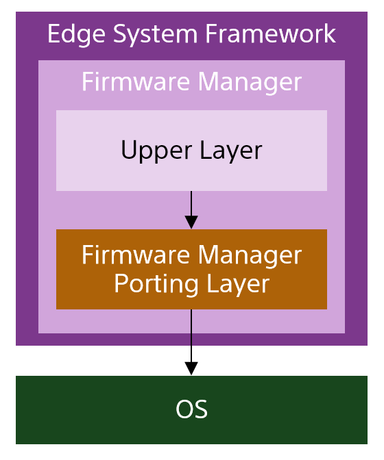
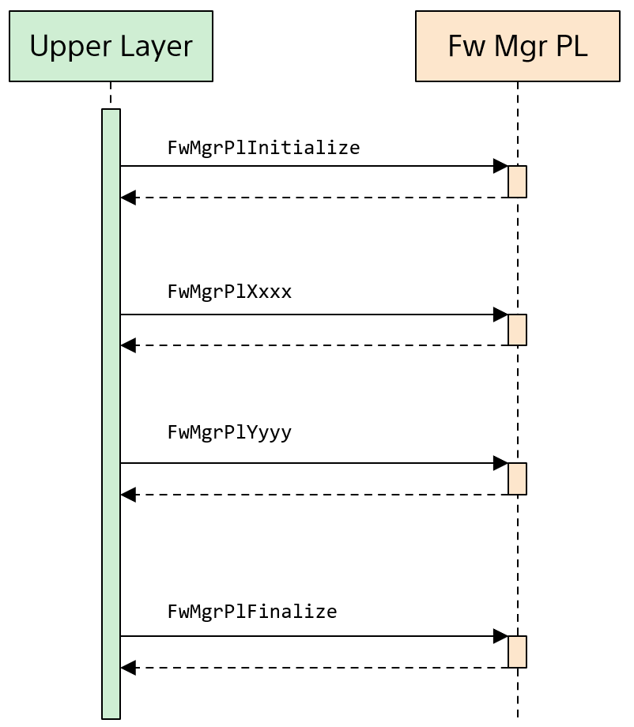
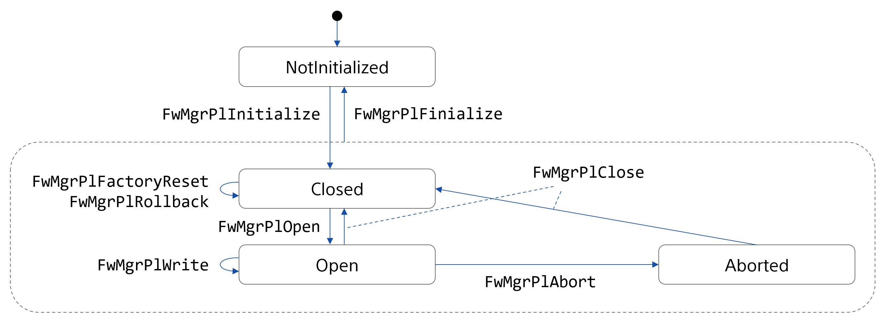
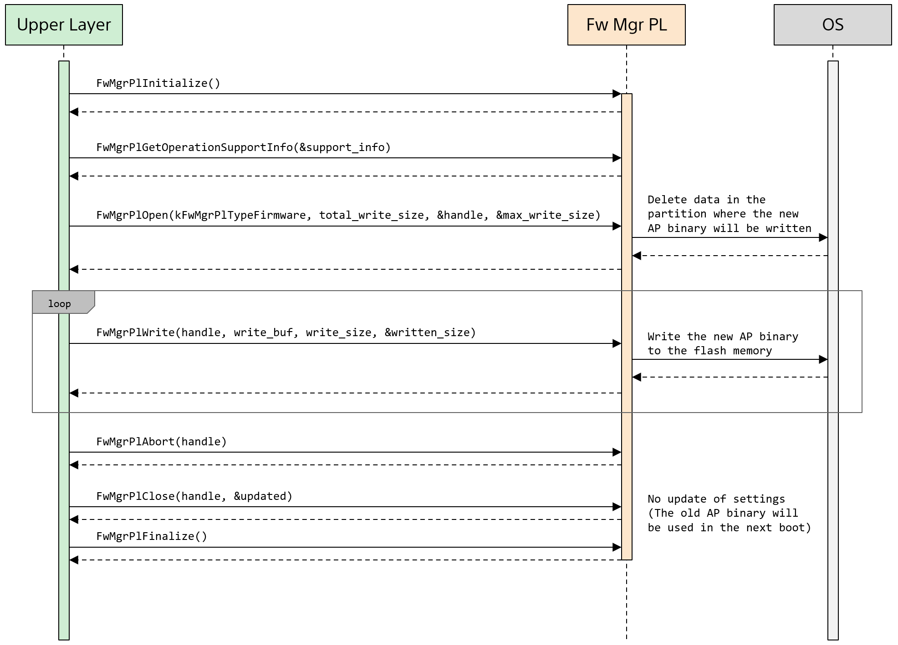
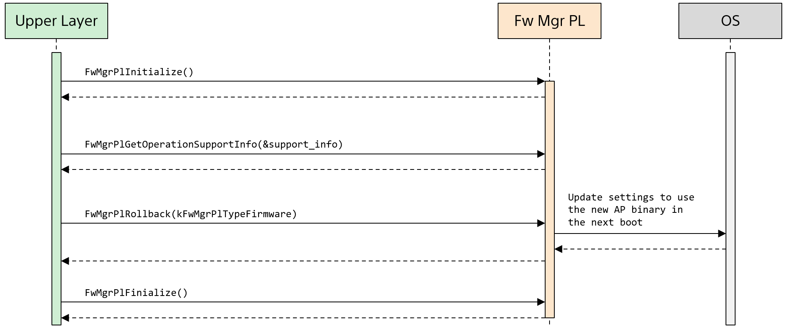

= Firmware Manager Porting Layer (T3P/T5) 機能仕様書
:sectnums:
:sectnumlevels: 3
:chapter-label:
:revnumber: 0.0.1
:toc: left
:toc-title: 目次
:toclevels: 3
:lang: ja
:xrefstyle: short
:figure-caption: Figure
:table-caption: Table
:section-refsig:
:experimental:

WARNING: T3P 及び T5 の両方に対応している記述になっていますが、現状では、 **T5 用の実装のみ**が行われています。(T3P 用の実装も計画されています。)

== 目的と適用範囲

本書では T3P 及び T5 用の Firmware Manager Porting Layer の仕様を説明します。

<<<

== 用語

[#_words]
.用語一覧 (要更新)
[options="header"]
|===
|用語 |説明 

|AP
|Application Processor

|AP バイナリ
|AP に保存されているバイナリファイル。ファームウェア (FW) など。

|上位レイヤ
|Firmware Manager Porting Layer を呼び出すレイヤ。(Firmware Manager の他の構成要素)
|===

<<<

== ブロックの説明
Firmware Manager Porting Layer は Firmware Manager の構成要素の1つです。
Firmware Manager は AP (Application Processor) に保存されているバイナリファイル (FWなど) の更新を担いますが、Porting Layer は、その処理のうち、AP に依存する処理を抽象化し、上位レイヤ (本ブロック以外の Firmware Manager の構成要素) が AP の違いを意識しなくて済むようにすることです。
Porting Layer は AP ごとに異なるものが使用されます。本書で説明されているのは、T3P 及び T5 用の Porting Layer の仕様です。
本 Porting Layer は ESP32 系の AP (ESP32, ESP32-S3) 用の Porting Layer ですが、T3P 及び T5 における使用のみを想定しているため、ESP32 系の AP を使ったほかのカメラに使用するには、修正・拡張が必要です。
また、ESP32 系以外の AP を使う場合は、その AP に対応する Firmware Manager Porting Layer を使用してください。
本ブロックは Firmware Manager 内部のみから呼び出されることを想定しています。

WARNING: カメラ周辺機器（センサーなど）のFW・データ更新などは本ブロックでは想定されていません。

=== ブロックの概要

以下に本ブロックを中心としたソフトウェア構成図を示します。

.概要図

<<<

=== ブロックの詳細説明

Firmware Manager Porting Layer の使用シーケンス例を以下に示します。
上位レイヤは、FwMgrPlInitialize を呼び出した後、FwMgrPlInitialize 以外の API を使用できるようになります。最後に必ず FwMgrPlFinalize を呼び出してください。

[#_button_seq]
.シーケンス概要

==== 依存ブロック
.依存ブロック
[width="100%",options="header"]
|===
|ブロック名 |利用用途 |リンク

|OS
|フラッシュメモリ上のデータ (パーティションテーブル、及び ota_0, ota_1, otadata パーティション) の読み書き
|
|===

<<<

=== 状態遷移

Firmware Manager Porting Layer は、以下の<<#_TableStates>>に示される状態を取り得ます。
[#_TableStates]
.状態一覧
[width="100%", cols="20%,80%",options="header"]
|===
|状態 |説明 

|NotInitialized
|Firmware Manager Porting Layer が初期化されていない状態

|Closed
|Firmware Manager Porting Layer の初期化が完了し、AP バイナリのアップデートの開始、ロールバック、ファクトリーリセットが可能な状態

|Open
|AP バイナリのアップデートが開始され、フラッシュへの書き込みが可能な状態

|Aborted
|AP バイナリのアップデートが中断された状態
|===

Firmware Manager Porting Layer では<<#_FigureState>>に示す状態遷移を行います。 +
なお、各 API でエラーが発生した場合には状態遷移は起こりません。 +

[#_FigureState]
.状態遷移図

各状態での API 受け付け可否と状態遷移先を<<#_TableStateTransition>>に示します。
表中の状態名は、API 実行完了後の遷移先状態を示し、すなわち API 呼び出し可能であることを示します。
ただし、処理が正常に完了しなかった場合 (返り値が kPlErrCodeOk 以外の場合)、状態は遷移しません。
×は API 受け付け不可を示します。受け付け不可の状態で API が呼び出された場合エラーを返します。

[#_TableStateTransition]
.状態遷移表
[width="100%", cols="5%,10%,10%,10%,10%,10%"]
|===
2.2+| 4+|状態 
|NotInitialized|Closed|Open|Aborted
.40+|API 名

|``**FwMgrPlInitialize**``
|Closed
|×
|×
|×

|``**FwMgrPlFinalize**``   
|×
|NotInitialized
|NotInitialized
|NotInitialized

|``**FwMgrPlOpen**``   
|×
|Open
|×
|×

|``**FwMgrPlClose**``   
|×
|×
|Closed
|Closed

|``**FwMgrPlWrite**``   
|×
|×
|Open
|×

|``**FwMgrPlAbort**``   
|×
|×
|Aborted
|×

|``**FwMgrPlRollback**``   
|×
|Closed
|×
|×

|``**FwMgrPlFactoryReset**``   
|×
|Closed
|×
|×

|``**FwMgrPlGetOperationSupportStatus**``   
|NotInitialized
|Closed
|Open
|Aborted

|``**FwMgrPlSwitchFirmwarePartition**``   
|NotInitialized
|Closed
|×
|×
|===

<<<

=== ブロックの機能一覧
<<#_TableOperation>>に機能の一覧を示します。

[#_TableOperation]
.機能一覧
[width="100%", cols="30%,55%,15%",options="header"]
|===
|機能名 |概要  |節番号
|AP バイナリのアップデート
|指定された AP バイナリを AP に書き込み、次回以降の起動時にその新しい AP バイナリが使用されるようにします。
現状では FW のアップデートのみがサポートされています。
|<<#_Operation1>>

|AP バイナリのアップデートの中断
|指定された AP バイナリのアップデートを中断します。
中断できるかどうかは、AP、AP バイナリの種類によって異なります。
|<<#_Operation2>>

|AP バイナリのロールバック
|指定された AP バイナリを1つ前のバージョンに戻します。
ロールバックができるかどうかは、AP、AP バイナリの種類によって異なります。
現状では未サポートです。
|<<#_Operation3>>

|AP バイナリを工場出荷状態に戻す (ファクトリーリセット)
|AP バイナリ一式を工場出荷状態に戻します。
現状では未サポートです。
|<<#_Operation4>>
|===

<<<

=== ブロックの機能説明
[#_Operation1]
==== AP バイナリのアップデート
機能概要::
指定された AP バイナリを AP に書き込み、次回以降の起動時にその新しい AP バイナリが使用されるようにします。
前提条件::
Firmware Manager Porting Layer が Closed 状態であること。
機能詳細::
AP バイナリの種類と AP バイナリを受け取って、フラッシュメモリに書き込みます。
その後、その AP バイナリが次回以降の起動時に使用されるように設定を更新します。
フラッシュメモリのどの位置に書き込まれるかは、AP バイナリの種類によって異なります。
他コンテキストなどで、AP バイナリのアップデート、ロールバック、ファクトリーリセットの処理を行っている最中は、アップデートを実施できません。
詳細挙動::
AP バイナリの種類を指定して FwMgrPlOpen を呼び出すことによってハンドルを取得し、そのハンドルを指定して FwMgrPlWrite を (場合によっては複数回) 呼び出すことによって AP バイナリを書き込みます。
その後、FwMgrPlClose を呼び出すことで書き込まれた AP バイナリが次回以降の起動時に使用されるように設定の更新 (パーティションの切り替え) を行います。 +
+
**FW のアップデートの場合** +
T3P/T5 ではフラッシュメモリに FW 用のパーティションが2つ (ota_0, ota_1) あります。それぞれのパーティション用に暗号化した FW (※) を結合し、その結合したバイナリを (必要であれば複数回に分けて) Firmware Manager Porting Layer に渡してください。 +
※ ESP32/ESP32-S3 のフラッシュメモリの暗号化は書き込み先アドレスに依存するため、同じ FW でも ota_0 に書き込む用と ota_1 に書き込む用で暗号化結果が異なります。 +
+
例：2 MB の FW をアップデートする場合 +
(1) FW を ota_0 に書き込む用に暗号化する。(FW_encrypted_0 と呼ぶ) +
(2) FW を ota_1 に書き込む用に暗号化する。(FW_encrypted_1 と呼ぶ) +
(3) (1) と (2) の暗号化済み FW を結合し、前半 2 MB が FW_encrypted_0 であり、後半 2 MB が FW_encrypted_1 である 4 MB のバイナリを作成する。 (FW_encrypted_combined と呼ぶ) +
(4) total_write_size = 4 MB で FwMgrPlOpen を呼ぶ。 +
(5) FW_encrypted_combined を buf に入れて FwMgrPlWrite を呼ぶ。 (必要であれば複数回に分ける) +
(6) FwMgrPlClose を呼ぶ。 +
+
Firmware Manager Porting Layer は、現在使用していない方のパーティションに、それに対応している方のバイナリを書き込みます。(例えば、 ota_0 に現在実行中の FW が格納されている場合、受け取ったバイナリの前半部分は使用せず、後半部分を ota_1 に書き込みます。)

詳細は<<#_FwMgrPlOpen, FwMgrPlOpen>>, <<#_FwMgrPlClose, FwMgrPlClose>>, <<#_FwMgrPlWrite, FwMgrPlWrite>>を参照してください。

エラー時の挙動、復帰方法::
T.B.D.
検討事項::
T.B.D.

[#_Operation2]
==== AP バイナリのアップデートの中断
機能概要::
指定された AP バイナリのアップデートを中断します。中断できる AP バイナリとできない AP バイナリが存在します。
中断できるかどうかは、FwMgrPlGetOperationSupportStatus を呼び出すことで取得できます。
前提条件::
Firmware Manager Porting Layer が Open 状態であること。
機能詳細::
ハンドルを受け取って、現在実施中の AP バイナリのアップデートを中断します。
中断できるかどうかは、AP バイナリの種類によって異なります。
詳細挙動::
Open 状態において、FwMgrPlAbort を呼び出すことで、現在実施中の AP バイナリのアップデートを中断します。
本 API が成功した場合、FwMgrPlClose を呼び出してください。なお、FwMgrPlAbort の呼び出し後に FwMgrPlClose が呼ばれた場合、AP バイナリの切り替えは発生しません。
詳細は<<#_FwMgrPlAbort, FwMgrPlAbort>>,  <<#_FwMgrPlClose, FwMgrPlClose>>, <<#_FwMgrPlGetOperationSupportStatus, FwMgrPlGetOperationSupportStatus>>を参照してください。
エラー時の挙動、復帰方法::
T.B.D.
検討事項::
T.B.D.

[#_Operation3]
==== AP バイナリのロールバック
機能概要::
指定された AP バイナリを1つ前のバージョンに戻します。
ロールバックできるかどうかは、FwMgrPlGetOperationSupportStatus を呼び出すことで取得できます。
前提条件::
Firmware Manager Porting Layer が Closed 状態であること。
機能詳細::
**現状では未サポートです。**
AP バイナリの種類を受け取って、その AP バイナリを1つ前のバージョンに戻します。
ロールバックができるかどうかは、AP バイナリの種類によって異なります。
他コンテキストで、AP バイナリのアップデート、ロールバック、ファクトリーリセットの処理を行っている最中は、ロールバックを実施できません。
詳細挙動::
Closed 状態において、FwMgrPlRollback を呼び出すことで、ロールバックを実施します。
詳細は<<#_FwMgrPlRollback, FwMgrPlRollback>>, <<#_FwMgrPlGetOperationSupportStatus, FwMgrPlGetOperationSupportStatus>>を参照してください。
エラー時の挙動、復帰方法::
T.B.D.
検討事項::
T.B.D.

[#_Operation4]
==== AP バイナリを工場出荷状態に戻す (ファクトリーリセット)
機能概要::
AP バイナリを工場出荷状態に戻します。カメラによってサポート有無が異なります。
ファクトリーリセットできるかどうかは、FwMgrPlGetOperationSupportStatus を呼び出すことで取得できます。
前提条件::
Firmware Manager Porting Layer が Closed 状態であること。
機能詳細::
**現状では未サポートです。**
AP バイナリの種類を受け取って、その種類の AP バイナリとして、工場出荷時に設定されていたものを使用するように設定を変更します。
他コンテキストで、AP バイナリのアップデート、ロールバック、ファクトリーリセットの処理を行っている最中は、ファクトリーリセットを実施できません。
詳細挙動::
Closed 状態において、 FwMgrPlFactoryReset を呼び出すことで、ファクトリーリセットを実施します。
詳細は<<#_FwMgrPlFactoryReset, FwMgrPlFactoryReset>>, <<#_FwMgrPlGetOperationSupportStatus, FwMgrPlGetOperationSupportStatus>>を参照してください。
エラー時の挙動、復帰方法::
T.B.D.
検討事項::
T.B.D.

<<<

=== ブロックの非機能要件一覧

<<#_TableNonFunctionalRequirements>>に非機能要件の一覧を示します。

[#_TableNonFunctionalRequirements]
.非機能要件一覧
[width="100%", cols="30%,55%,15%",options="header"]
|===
|機能名 |概要  |節番号
|スタック最大使用量
|ブロック内で消費されるスタック最大使用量
|<<#_MaxStackUsage>>

|ヒープ最大使用量
|ブロック内で使用されるヒープ最大使用量 (LHeap を使用して確保される分を除く)
|<<#_MaxHeapUsage>>

|LHeap 最大使用量
|ブロック内で LHeap を使用して確保されるメモリの最大量
|<<#_MaxLHeapUsage>>

|static データ最大使用量
|ブロック内で使用される static データ最大使用量
|<<#_MaxStaticDataUsage>>

|パフォーマンス
|各 API の処理にかかる時間
|<<#_Performance>>
|===

=== ブロックの非機能要件説明

[#_MaxStackUsage]
==== Stack最大使用量
1 KB 以下 (予定)

[#_MaxHeapUsage]
==== ヒープ最大使用量
5 KB 以下 (予定)
※ FwMgrPlWrite 時は、AP バイナリは、上位レイヤが確保したメモリ上に配置され、Firmware Manager Porting Layer API はそこへのポインタを受け取るため、Firmware Manager Porting Layer の処理では AP バイナリ用のメモリ確保は行われない。

[#_MaxLHeapUsage]
==== LHeap 最大使用量
なし

[#_MaxStaticDataUsage]
==== staticデータ最大使用量
1 KB 以下 (予定)

[#_Performance]
==== パフォーマンス

.Firmware Manager Porting Layer の各処理のパフォーマンス
[width="100%", cols="30%,15%,55%",options="header"]
|===
|API |処理時間 |備考
|FwMgrPlOpen
|[要計測]
|

|FwMgrPlClose
|[要計測]
|

|FwMgrPlWrite
|[要計測]
|

|FwMgrPlAbort
|[要計測]
|

|FwMgrPlRollback
|-
|未サポート

|FwMgrPlFactoryReset
|-
|未サポート

|FwMgrPlGetOperationSupportStatus
|0.1ms 以下
|

|===

<<<

== API 仕様
=== 定義一覧
==== データ型一覧
<<#_TableDataType>>にデータ型の一覧を示します。

[#_TableDataType]
.データ型一覧
[width="100%", cols="30%,55%,15%",options="header"]
|===
|データ型名 |概要  |節番号
|PlErrCode
|API の実行結果を定義する列挙型です。
|[準備中]

|FwMgrPlHandle
|AP バイナリアップデート用のハンドルを表す構造体です。
|<<#_FwMgrPlHandle>>

|FwMgrPlType
|AP バイナリの種類を表す列挙型です。
|<<#_FwMgrPlType>>

|FwMgrPlSupportInfo
|AP バイナリの操作がサポートされているかどうかを表す構造体です。
|<<#_FwMgrPlSupportInfo>>

|FwMgrPlOperationSupportInfo
|各 AP バイナリの種類に対する操作がサポートされているかどうかを表す構造体です。
|<<#_FwMgrPlOperationSupportInfo>>
|===

==== API一覧
<<#_TableAPI>> に API の一覧を示します。

[#_TableAPI]
.ブロック外部から利用可能な API 一覧
[width="100%", cols="10%,60%,20%",options="header"]
|===
|API 名 |概要 |節番号
|FwMgrPlInitialize
|本ブロックの初期化処理を行います。
|<<#_FwMgrPlInitialize>>

|FwMgrPlFinalize
|本ブロックの終了処理を行います。
|<<#_FwMgrPlFinalize>>

|FwMgrPlOpen
|AP バイナリのアップデートの開始処理を行います。AP バイナリの書き込み先のデータを削除し、ハンドルを取得します。
|<<#_FwMgrPlOpen>>

|FwMgrPlClose
|AP バイナリのアップデートの終了処理を実施します。
正常に AP バイナリが書き込まれていれば、次回以降の起動で新しい AP バイナリが使用されるように設定を更新します。
|<<#_FwMgrPlClose>>

|FwMgrPlWrite
|AP バイナリの書き込みを行います。
|<<#_FwMgrPlWrite>>

|FwMgrPlAbort
|AP バイナリのアップデートを中断します。
|<<#_FwMgrPlAbort>>

|FwMgrPlRollback
|AP バイナリをひとつ前のバージョンに戻します。(ロールバック)
|<<#_FwMgrPlRollback>>

|FwMgrPlFactoryReset
|AP バイナリを工場出荷状態へ戻します。(ファクトリーリセット)
|<<#_FwMgrPlFactoryReset>>

|FwMgrPlGetOperationSupportInfo
|AP バイナリのアップデート、アップデートの中断、ロールバック、ファクトリーリセットをサポートされているかどうかを取得します。
|<<#_FwMgrPlGetOperationSupportInfo>>

|FwMgrPlGetInfo
|AP バイナリのバージョン、ハッシュ、更新日時を取得します。
|<<#_FwMgrPlGetInfo>>

|FwMgrPlSwitchFirmwarePartition
|AP Firmware の起動面の切り替えを行います。
|<<#_FwMgrPlSwitchFirmwarePartition>>
|===

<<<

=== データ型定義
[#_FwMgrPlHandle]
==== FwMgrPlHandle
AP バイナリアップデート用のハンドルを表す構造体です。

* *書式*

[source, C]
....
typedef void* FwMgrPlHandle;
....

[#_FwMgrPlType]
==== FwMgrPlType
AP バイナリの種類を表す列挙型です。

* *書式*

[source, C]
....
typedef enum TagFwMgrPlType {
  kFwMgrPlTypeFirmware,
  kFwMgrPlTypeBootloader,
  kFwMgrPlTypePartitionTable,
} FwMgrPlType;
....
* *値*

.FwMgrPlTypeの値の説明
[width="100%", cols="30%,70%",options="header"]
|===
|メンバ名  |説明
|kFwMgrPlTypeFirmware
|FW を表します。
|kFwMgrPlTypeBootloader
|Bootloader を表します。
|kFwMgrPlTypePartitionTable
|パーティションテーブルを表します。
|===

[#_FwMgrPlSupportInfo]
==== FwMgrPlSupportInfo
AP バイナリの操作がサポートされているかどうかを表す構造体です。

* *書式*

[source, C]
....
typedef struct TagFwMgrPlSupportInfo {
  bool update_supported;
  bool update_abort_supported;
  bool rollback_supported;
  bool factory_reset_supported;
} FwMgrPlSupportInfo;
....

* *値*

.FwMgrPlSupportInfoの説明
[width="100%", cols="30%,70%",options="header"]
|===
|メンバ名  |説明
|update_supported
|アップデートがサポートされているかどうかを表します。(true: サポートされている。false: サポートされていない。以下同様)
|update_abort_supported
|アップデートの中断がサポートされているかどうかを表します。
|rollback_supported
|ロールバックがサポートされているかどうかを表します。
|factory_reset_supported
|ファクトリーリセットがサポートされているかどうかを表します。
|===

[#_FwMgrPlOperationSupportInfo]
==== FwMgrPlOperationSupportInfo
各 AP バイナリの種類に対する AP バイナリの操作がサポートされているかどうかを表す構造体です。

* *書式*

[source, C]
....
typedef struct TagFwMgrPlOperationSupportInfo {
  FwMgrPlSupportInfo firmware;
  FwMgrPlSupportInfo bootloader;
  FwMgrPlSupportInfo partition_table;
} FwMgrPlOperationSupportInfo;
....

* *値*

.FwMgrPlSupportInfoの説明
[width="100%", cols="30%,70%",options="header"]
|===
|メンバ名  |説明
|firmware
|FW の操作のサポート状況を表します。
|bootloader
|Bootloader の操作のサポート状況を表します。
|partition_table
|パーティションテーブルの操作のサポート状況を表します。
|===

=== 各 API の説明

[#_FwMgrPlInitialize]
==== FwMgrPlInitialize
* *機能* +
本ブロックの初期化処理を行います。

* *書式* 

[source, C]
....
PlErrCode FwMgrPlInitialize(void);
....

* *引数の説明* +
-

* *戻り値* +
成功時は kPlErrCodeOk を返します。失敗時は PlErrCode のいずれかの値 (kPlErrCodeOk 以外) を返します。

* *説明* +
** AP バイナリに関する初期化処理を行います。
** Firmware Manager Porting Layer の他の API を使用する前に呼ぶ必要があります。
** 通常は、システム起動時に呼ばれることを想定しています。

.API 詳細情報
[width="100%", cols="30%,70%",options="header"]
|===
|API 詳細情報  |説明
|API 種別
|同期 API
|実行コンテキスト
|呼び元のコンテキストで動作
|同時呼び出し
|不可 (エラーを返します。)
|複数スレッドからの呼び出し
|不可 (エラーを返します。)
|複数タスクからの呼び出し
|不可 (エラーを返します。)
|API 内部でブロッキングするか
|ブロッキングするします。
|===

.エラー情報
[options="header"]
|===
|エラーコード |原因 |OUT引数の状態 |エラー後のシステム状態 |復旧方法

|kPlErrLock
|他コンテキストで、Firmware Manager Porting Layer の API が実行中です。
|-
|影響なし
|不要

|kPlErrInvalidState
|Firmware Manager Porting Layer の状態が NotInitialized ではありません。
|-
|影響なし
|不要
|===

<<<

[#_FwMgrPlFinalize]
==== FwMgrPlFinalize
* *機能* +
本ブロックの終了処理を行います。

* *書式*

[source, C]
....
PlErrCode FwMgrPlFinalize(void);
....

* *引数の説明* +
-

* *戻り値* +
成功時は kPlErrCodeOk を返します。失敗時は PlErrCode のいずれかの値 (kPlErrCodeOk 以外) を返します。

* *説明* +
** 本ブロックの終了処理を行います。
** 通常は、システムの終了時に呼ばれることを想定しています。
** 本 API は、呼ばれたときの状態によって、処理内容が異なります。
*** *Closed 状態*: 終了処理のみを行います。(通常はこの状態で呼ばれることを想定しています。)
*** *Open 状態*: FwMgrPlAbort 相当の処理を行ったのち、FwMgrPlClose 相当の処理を行い、その後、終了処理を行います。
*** *Aborted 状態*: FwMgrPlClose 相当の処理を行い、その後、終了処理を行います。

[#_FwMgrPlFinalize_desc]
.API 詳細情報
[width="100%", cols="30%,70%",options="header"]
|===
|API 詳細情報  |説明
|API 種別
|同期 API
|実行コンテキスト
|呼び元のコンテキストで動作
|同時呼び出し
|不可 (エラーを返します。)
|複数スレッドからの呼び出し
|不可 (エラーを返します。)
|複数タスクからの呼び出し
|不可 (エラーを返します。)
|API 内部でブロッキングするか
|ブロッキングします。
|===

[#_FwMgrPlFinalize_error]
.エラー情報
[options="header"]
|===
|エラーコード |原因 |OUT引数の状態 |エラー後のシステム状態 |復旧方法

|kPlErrLock
|他コンテキストで、Firmware Manager Porting Layer の API が実行中です。
|-
|影響なし
|不要

|kPlErrInvalidState
|Firmware Manager Porting Layer の状態が Open, Closed, Aborted のいずれでもありません。
|-
|影響なし
|不要
|===
<<<

[#_FwMgrPlOpen]
==== FwMgrPlOpen

* *機能* +
AP バイナリのアップデートの開始処理を行います。AP バイナリの書き込み先のデータを削除し、ハンドルを取得します。

* *書式*

[source, C]
....
PlErrCode FwMgrPlOpen(FwMgrPlType type, uint32_t total_write_size, uint8_t *hash,
                      FwMgrPlHandle *handle, uint32_t *max_write_size);
....

* *引数の説明* +
**[IN] FwMgrPlType type**:: 
アップデートを行う AP バイナリの種類。
サポートされていない種類を指定した場合は、エラーを返します。

**[IN] uint32_t total_write_size**:: 
アップデートを行う AP バイナリのサイズ。
0 が指定された場合はエラーを返します。
また、AP バイナリの書き込み先の書き込み領域のサイズを超えた場合もエラーを返します。
type = kFwMgrPlTypeFirmware の場合、32 の倍数である必要があります。32 の倍数でない場合、エラーを返します。(フラッシュメモリの暗号化が 16 bytes 単位で行われるため、暗号化後の FW サイズは 16 の倍数であり、 ota_0, ota_1 の2パーティション分が結合されているため、必ず 32 の倍数になる)

**[IN] uint8_t hash**:: 
AP バイナリのハッシュ。32 bytes の配列の先頭アドレスを指定してください。
ここで指定した値が、 ``FwMgrPlGetInfo`` で取得できます。この値が実際に書き込まれるバイナリのハッシュ値と一致することの確認はしません。

**[OUT] FwMgrPlHandle *handle**:: 
アップデート用のハンドル。ここで取得した handle を、以降の FwMgrPlWrite, FwMgrPlClose, FwMgrPlAbort の呼び出しにおいて引数として渡してください。
NULL が指定された場合はエラーを返します。

**[OUT] uint32_t *max_write_size**:: 
FwMgrPlWriteで指定できる最大サイズ。
NULL が指定された場合はエラーを返します。

* *戻り値* +
成功時は kPlErrCodeOk を返します。失敗時は PlErrCode のいずれかの値 (kPlErrCodeOk 以外) を返します。

* *説明* +
** AP バイナリのアップデート用のハンドルを取得します。
** フラッシュメモリの書き込み先の領域のデータを削除します。
** 本 API は Firmware Manager Porting Layer の状態が Closed の時に実行可能です。それ以外の状態の場合、何も実行せずにエラーを返します。(データの削除は行われません)
** 他コンテキストで Firmware Manager Porting Layer API が実行中の場合、何も実行せずにエラーを返します。(データの削除は行われません)
** 本 API で取得したハンドルは、アップデート中断の有無にかかわらず、必ず、FwMgrPlClose を使用して Close してください。

.API 詳細情報
[width="100%", cols="30%,70%",options="header"]
|===
|API 詳細情報  |説明
|API 種別
|同期 API
|実行コンテキスト
|呼び元のコンテキストで動作
|同時呼び出し
|不可 (エラーを返します。)
|複数スレッドからの呼び出し
|不可 (エラーを返します。)
|複数タスクからの呼び出し
|不可 (エラーを返します。)
|API 内部でブロッキングするか
|ブロッキングします。
|===

.エラー情報
[options="header"]
|===
|エラーコード |原因 |OUT引数の状態 |エラー後のシステム状態 |復旧方法

|kPlErrLock
|他コンテキストで、Firmware Manager Porting Layer の API が実行中です。
|無効な値
|影響なし (フラッシュメモリ上のデータ削除は行われません。)
|不要

|kPlErrInvalidState
|Firmware Manager Porting Layer の状態が Closed ではありません。
|無効な値
|影響なし (フラッシュメモリ上のデータ削除は行わません。)
|不要

|kPlErrInvalidParam
|不正な引数が指定されています。
|無効な値
|影響なし (フラッシメモリ上ュのデータ削除は行われません。)
|不要

|kPlErrNoSupported
|type にサポートされていない種類が指定されています。
|無効な値
|影響なし (フラッシメモリ上ュのデータ削除は行われません。)
|不要

|kPlErrInternal
|API 実行中に予期しないエラーが発生しました。
|無効な値
|T.B.D.
|T.B.D.
|===

<<<

[#_FwMgrPlClose]
==== FwMgrPlClose
* *機能* +
AP バイナリのアップデートの終了処理を実施します。
正常に AP バイナリが書き込まれていれば、次回以降の起動で新しい AP バイナリが使用されるように設定を更新します。

* *書式*

[source, C]
....
PlErrCode FwMgrPlClose(FwMgrPlHandle handle, bool *updated);
....

* *引数の説明* +
**[IN] FwMgrPlHandle handle**:: 
ハンドル。
FwMgrPlOpen で取得したハンドルを指定してください。

**[OUT] bool *updated**:: 
AP バイナリがアップデートされたかどうか。
true の場合、次回以降の起動において新しい AP バイナリが使用されます。
Open 状態で本 API が呼ばれ、かつ、本 API の処理が成功した場合に限り true になります。Aborted 状態で本 API が呼ばれた場合、本 API の処理が成功した場合でも false になります。
バイナリがアップデートされたかどうかの情報を取得する必要がない場合、NULL を指定することも可能です。

* *戻り値* +
成功時は kPlErrCodeOk を返します。失敗時は PlErrCode のいずれかの値 (kPlErrCodeOk 以外) を返します。

* *説明* +
** AP バイナリアップデートの終了処理を実施します。
** 本 API は Open, Aborted 状態で実行可能です。どちらの状態で実行されたかによって処理内容が異なります。
*** **Open 状態**：FwMgrPlWrite を使用して書き込まれた AP バイナリのサイズの合計が、FwMgrPlOpen 時に指定された total_write_size と一致していれば、書き込んだ AP バイナリの検証の検証を行います。検証が成功した場合、AP バイナリの切り替えが実施され、次回以降の起動において新しい AP バイナリが使用されるようになります。書き込みデータサイズが一致しない場合、及び、検証が失敗した場合はエラーを返します。(検証内容は AP バイナリによって異なります。例えば、ヘッダーの検証、SHA256 ハッシュの一致確認などです)
*** **Aborted 状態**：AP バイナリの切り替えは実施されません。
** 本 API が成功した場合、本 API の呼び出し時に指定したハンドルは無効になり、以降の API の呼び出しに使えなくなります。(失敗した場合、ハンドルは引き続き使用可能です)
** 他コンテキストで Firmware Manager Porting Layer API が実行中の場合、何も実行せずにエラーを返します。
** AP バイナリが FW の場合に実施される検証は、以下の通りです。
*** ヘッダのマジックと チップ ID が期待通りの値かどうか。(チップ ID で区別できるのは ESP32, ESP32-S3 のどちらであるかである。そのため、例えば、ESP32 を使ったカメラ A の FW を ESP32 を使ったカメラ B に書き込んだ場合でも検証は成功する (可能性がある))
*** FW の末尾にハッシュ値がついている場合、FW の SHA256 ハッシュがその値と一致するかどうか。

.API 詳細情報
[width="100%", cols="30%,70%",options="header"]
|===
|API 詳細情報  |説明
|API 種別
|同期 API
|実行コンテキスト
|呼び元のコンテキストで動作
|同時呼び出し
|不可 (エラーを返します。)
|複数スレッドからの呼び出し
|不可 (エラーを返します。)
|複数タスクからの呼び出し
|不可 (エラーを返します。)
|API 内部でブロッキングするか
|ブロッキングします。
|===

.エラー情報
[options="header"]
|===
|エラーコード |原因 |OUT引数の状態 |エラー後のシステム状態 |復旧方法

|kPlErrLock
|他コンテキストで Firmware Manager Porting Layer API が実行中です。
|無効な値
|影響なし (パーティション切り替えは行われません。)
|不要

|kPlErrInvalidParam
|不正な引数が指定されています。
|無効な値
|影響なし (パーティション切り替えは行われません。)
|不要

|kPlErrInvalidState
|Firmware Manager Porting Layer の状態が Open, Aborted のいずれでもありません。
|無効な値
|影響なし (パーティション切り替えは行われません。)
|不要

|kPlErrInvalidOperation
|wMgrPlWrite によって書き込まれた AP バイナリのサイズの合計が FwMgrPlOpn 時に指定された total_write_size と一致していません。
|無効な値
|FwMgrPlWrite で書き込まれた AP バイナリはフラッシュメモリから削除されずそのまま残ります。パーティション切り替えは行われません。
|FwMgrPlAbort 呼び出したのち、再度本 API を呼び出してください。AP バイナリのアップデートをリトライする場合は、FwMgrPlOpen から再度やり直してください。

|kPlErrInvalidValue
|FwMgrPlWrite によって書き込まれた AP バイナリの検証 (ヘッダー、ハッシュ) に失敗しました。
|無効な値
|FwMgrPlWrite で書き込まれた AP バイナリはフラッシュメモリから削除されずそのまま残ります。パーティション切り替えは行われません。
|FwMgrPlAbort 呼び出したのち、再度本 API を呼び出してください。AP バイナリのアップデートをリトライする場合は、FwMgrPlOpen から再度やり直してください。

|kPlErrInternal
|API 実行中に予期しないエラーが発生しました。
|無効な値
|T.B.D.
|T.B.D.
|===

<<<

[#_FwMgrPlWrite]
==== FwMgrPlWrite
* *機能* +
AP バイナリをフラッシュメモリ書き込みます。フラッシュメモリのどの位置に書き込まれるかは、AP バイナリの種類によって異なります。

* *書式*

[source, C]
....
PlErrCode FwMgrPlWrite(FwMgrPlHandle handle, const uint8_t *buffer,
                       uint32_t write_size, uint32_t *written_size);
....

* *引数の説明* +
**[IN] FwMgrPlHandle handle**:: 
ハンドル。
FwMgrPlOpen で取得したハンドルを指定してください。

**[IN] const uint8_t *buf**:: 
書き込み対象のバッファ。
NULL が指定された場合はエラーを返します。

**[IN] const uint32_t write_size**:: 
書き込みサイズ。
0 または、 FwMgrPlOpen 時に取得できる max_write_size より大きい値を指定するとエラーを返します。

**[OUT] uint32_t *written_size**:: 
実際に書き込まれたサイズ。
NULL が指定された場合はエラーを返します。

* *戻り値* +
成功時は kPlErrCodeOk を返します。失敗時は PlErrCode のいずれかの値 (kPlErrCodeOk 以外) を返します。

* *説明* +
** AP バイナリへアップデートデータを書き込みます。
** 本 API は Open 状態で実行可能です。それ以外の状態の場合、何も実行せずにエラーを返します。
** 本API は複数回に分けて実行することが可能です。書き込む AP バイナリのサイズの合計が FwMgrPlOpen 時に指定した total_write_size に一致するようにしてください。
** 「これまでに本 API で書き込んだ AP バイナリのサイズの合計」と write_size の和が、FwMgrPlOpen 時に指定した total_write_size を超えるとエラーを返します。
** 他コンテキストで Firmware Manager Porting Layer API が実行中の場合、何も実行せずにエラーを返します。
** 本 API が成功しても、write_size よりも小さいサイズのデータしか書き込まれていない可能性があります。**必ず *written_size の値を確認してください**。
*written_size < write_size の場合は、書き込めていない部分の AP バイナリの書き込みを再度 (本 API を呼び出して) 行ってください。
*written_size は 0 になることもあり得ます。*written_size == 0 が複数回続いた場合は、呼び出し側で書き込みを中断するなどの措置を講じてください。(**無限ループになる可能性があります。**)

** AP バイナリが FW の場合
*** buffer には、ota_0 用に暗号化された firmware と ota_1 用に暗号化された firmware を結合したものを格納してください。現在実行中の firmware が ota_0 に格納されている場合、 buffer の前半部分は全く使われずに、後半部分が ota_1 に書き込まれます。現在実行中の firmware が ota_1 に格納されている場合は、buffer の前半部分が ota_0 に書き込まれ、後半部分は使われません。

.API 詳細情報
[width="100%", cols="30%,70%",options="header"]
|===
|API 詳細情報  |説明
|API 種別
|同期 API
|実行コンテキスト
|呼び元のコンテキストで動作
|同時呼び出し
|不可 (エラーを返します。)
|複数スレッドからの呼び出し
|不可 (エラーを返します。)
|複数タスクからの呼び出し
|不可 (エラーを返します。)
|API 内部でブロッキングするか
|ブロッキングします。
|===

.エラー情報
[options="header"]
|===
|エラーコード |原因 |OUT引数の状態 |エラー後のシステム状態 |復旧方法

|kPlErrLock
|他コンテキストで Firmware Manager Porting Layer API が実行中です。
|無効な値
|影響なし
|不要

|kPlErrInvalidParam
|不正な引数が指定されています。
|無効な値
|影響なし
|不要

|kPlErrInvalidState
|Firmware Manager Porting Layer の状態が Open ではありません。
|無効な値
|影響なし
|不要

|kPlErrInvalidOperation
|Firmware Manager Porting Layer の状態が Open ではありません。
|無効な値
|影響なし
|不要

|kPlErrInternal
|API 実行中に予期しないエラーが発生しました。
|無効な値
|T.B.D.
|T.B.D.
|===

<<<

[#_FwMgrPlAbort]
==== FwMgrPlAbort
* *機能* +
AP バイナリのアップデートを中断します。
中断できる AP バイナリとできない AP バイナリが存在します。詳細は <<#_FwMgrPlOperationSupportStatus>> を参照してください。

* *書式*

[source, C]
....
PlErrCode FwMgrPlAbort(FwMgrPlHandle handle);
....

* *引数の説明* +
**[IN] FwMgrPlHandle handle**:: 
FwMgrPlOpen で取得したハンドルを指定してください。
ハンドルを取得した際に指定した AP バイナリに対するアップデートの中断がサポートされていない場合、エラーを返します。

* *戻り値* +
成功時は kPlErrCodeOk を返します。失敗時は PlErrCode のいずれかの値 (kPlErrCodeOk 以外) を返します。

* *説明* +
** 指定されたハンドルにより現在進行中の AP バイナリのアップデートを中断します。
** 本 API は Open 状態で実行が可能です。それ以外の状態の場合、何も実行せずにエラーを返します。
** 他コンテキストで Firmware Manager Porting Layer API が実行中の場合、何も実行せずにエラーを返します。

.API 詳細情報
[width="100%", cols="30%,70%",options="header"]
|===
|API 詳細情報  |説明
|API 種別
|同期 API
|実行コンテキスト
|呼び元のコンテキストで動作
|同時呼び出し
|不可 (エラーを返します。)
|複数スレッドからの呼び出し
|不可 (エラーを返します。)
|複数タスクからの呼び出し
|不可 (エラーを返します。)
|API 内部でブロッキングするか
|ブロッキングします。
|===

.エラー情報
[options="header"]
|===
|エラーコード |原因 |OUT引数の状態 |エラー後のシステム状態 |復旧方法

|kPlErrLock
|他コンテキストで Firmware Manager Porting Layer API が実行中です。
|-
|影響なし
|不要

|kPlErrInvalidParam
|不正な引数が指定されています。
|-
|影響なし
|不要

|kPlErrInvalidState
|Firmware Manager Porting Layer の状態が Open ではありません。
|-
|影響なし
|不要

|kPlNoSupported
|アップデートの中断がサポートされていな AP バイナリに対して本 API が呼び出されました。
|-
|影響なし
|不要
|===

<<<

[#_FwMgrPlRollback]
==== FwMgrPlRollback (未実装)
* *機能* +
**未実装です。**
AP バイナリを1つ前のバージョンに戻します。ロールバックできる AP バイナリとできない AP バイナリが存在します。

* *書式*

[source, C]
....
PlErrCode FwMgrPlRollback(FwMgrPlType type)
....

* *引数の説明* +
**[IN] FwMgrPlType type**:: 
ロールバックする AP バイナリの種類。

* *戻り値* +
成功時は kPlErrCodeOk を返します。失敗時は PlErrCode のいずれかの値 (kPlErrCodeOk 以外) を返します。

* *説明* +
** AP バイナリを1つ前のバージョンに戻します。
** 本 API は Firmware Manager Porting Layer の状態が Closed の時に実行可能です。
** Firmware Manager Porting Layer の状態が、Closed 以外の場合、または、他コンテキストで Firmware Manager Porting Layer API が実行中の場合、何も実行せずにエラーを返します。
** ロールバックがサポートされていない AP バイナリの種類を指定された場合、本 API はエラーを返します。その場合、対象の AP バイナリへの影響はありません。
** 1つ前のバージョンの AP バイナリが存在しない場合、エラーを返します。

.API 詳細情報
[width="100%", cols="30%,70%",options="header"]
|===
|API 詳細情報  |説明
|API 種別
|同期 API
|実行コンテキスト
|呼び元のコンテキストで動作
|同時呼び出し
|不可 (エラーを返します。)
|複数スレッドからの呼び出し
|不可 (エラーを返します。)
|複数タスクからの呼び出し
|不可 (エラーを返します。)
|API 内部でブロッキングするか
|-
|===

.エラー情報
[options="header"]
|===
|エラーコード |原因 |OUT引数の状態 |エラー後のシステム状態 |復旧方法

|kPlErrLock
|他コンテキストで、Firmware Manager Porting Layer の API が実行中です。
|-
|影響なし
|不要

|kPlErrInvalidParam
|不正な引数が指定されています。
|-
|影響なし
|不要

|kPlErrInvalidState
|Firmware Manager Porting Layer の状態が Closed ではありません
|-
|影響なし
|不要

|kPlErrNoSupported
|type にロールバックがサポートされていない AP バイナリの種類が指定されています。
|-
|影響なし
|不要

|kPlErrInvalidValue
|ひとつ前のバージョンの AP バイナリが存在しないため、ロールバックできない。
|-
|影響なし
|なし

|kPlErrInternal
|API 実行中に予期しないエラーが発生しました。
|-
|T.B.D.
|T.B.D.
|===

<<<

[#_FwMgrPlFactoryReset]
==== FwMgrPlFactoryReset (未実装)
* *機能* +
**未実装です。**
AP バイナリをファクトリーリセットします (工場出荷状態に戻します)。 

* *書式*

[source, C]
....
PlErrCode FwMgrPlFactoryReset(FwMgrPlType type)
....

* *引数の説明* +
**[IN] FwMgrPlType type**:: 
ファクトリーリセットする AP バイナリの種類。

* *戻り値* +
成功時は kPlErrCodeOk を返します。失敗時は PlErrCode のいずれかの値 (kPlErrCodeOk 以外) を返します。

* *説明* +
** **現状では未サポートです。** (常に kPlErrNoSupported を返します)

.API 詳細情報
[width="100%", cols="30%,70%",options="header"]
|===
|API 詳細情報  |説明
|API 種別
|同期 API
|実行コンテキスト
|呼び元のコンテキストで動作
|同時呼び出し
|不可 (エラーを返します。)
|複数スレッドからの呼び出し
|不可 (エラーを返します。)
|複数タスクからの呼び出し
|不可 (エラーを返します。)
|API 内部でブロッキングするか
|ブロッキングします。
|===

.エラー情報
[options="header"]
|===
|エラーコード |原因 |OUT引数の状態 |エラー後のシステム状態 |復旧方法

|kPlErrLock
|他コンテキストで、Firmware Manager Porting Layer の API が実行中です。
|-
|影響なし
|不要

|kPlErrInvalidParam
|不正な引数が指定されています。
|-
|影響なし
|不要

|kPlErrInvalidState
|Firmware Manager Porting Layer の状態が Closed ではありません。
|-
|影響なし
|不要

|kPlNoSupported
|type にファクトリーリセットがサポートされていない AP バイナリの種類が指定されています。
|-
|影響なし
|不要

|kPlErrInternal
|API 実行中に予期しないエラーが発生しました。
|-
|T.B.D.
|T.B.D.
|===

<<<

[#_FwMgrPlGetOperationSupportInfo]
==== FwMgrPlGetOperationSupportInfo
* *機能* +
AP がそれぞれの AP バイナリのアップデート、アップデートの中断、ロールバック、ファクトリーリセットがサポートされているかどうかを取得します。

* *書式*

[source, C]
....
PlErrCode FwMgrPlGetOperationSupportInfo(FwMgrPlOperationSupportInfo *support_info)
....

* *引数の説明* +
**[OUT] FwMgrPlOperationSupportInfo *support_info**::
AP がそれぞれの AP バイナリのアップデート、アップデートの中断、ロールバック、ファクトリーリセットをサポートされているかどうかを示す構造体 (へのポインタ)。
NULL を指定するとエラーを返します。

* *戻り値* +
成功時は kPlErrCodeOk を返します。失敗時は PlErrCode のいずれかの値 (kPlErrCodeOk 以外) を返します。

* *説明* +
それぞれの AP バイナリの種類に対して、Firmware Manager Porting Layer の各機能がサポートされているかを取得します。
本 API は Firmware Manager Porting Layer が Open, Closed, Aborted いずれかの状態のときに実行可能です。
** 各 AP のサポート状況は <<#_FwMgrPlOperationSupportStatus>> を参照してください。

.API 詳細情報
[width="100%", cols="30%,70%",options="header"]
|===
|API 詳細情報  |説明
|API 種別
|同期 API
|実行コンテキスト
|呼び元のコンテキストで動作
|同時呼び出し
|可能
|複数スレッドからの呼び出し
|可能
|複数タスクからの呼び出し
|可能
|API 内部でブロッキングするか
|ブロッキングしません。
|===

.エラー情報
[options="header"]
|===
|エラーコード |原因 |OUT引数の状態 |エラー後のシステム状態 |復旧方法

|kPlErrInvalidParam
|不正な引数が指定されている。
|無効な値
|影響なし
|不要
|===

[#_FwMgrPlGetInfo]
==== FwMgrPlGetInfo
* *機能* +
AP バイナリのバージョン、ハッシュ、更新日時を取得します。

* *書式*

[source, C]
....
PlErrCode FwMgrPlGetInfo(FwMgrPlType type, int32_t version_size, char *version,
                         int32_t hash_size, uint8_t *hash,
                         int32_t update_date_size, char *update_date);
....

* *引数の説明* +
**[in] FwMgrPlType type**::
AP バイナリの種類

**[in] int32_t version_size**::
配列 version のサイズ。

**[out] char *version**::
NULL を指定するとエラーを返します。
バージョン。Firmware の場合は "" を返します。

**[in] int32_t hash_size**::
配列 hash のサイズ。

**[out] uint8_t *hash**::
NULL を指定するとエラーを返します。
ハッシュ。 FwMgrPlOpen で指定された値を返します。工場で書き込まれたバイナリが動いている場合は、000000..00 (32 bytes) を返します。

**[in] int32_t update_date_size**::
配列 update_date のサイズ

**[out] char *update_date**::
NULL を指定するとエラーを返します。
バイナリの更新日時
工場で書き込まれたバイナリが動いている場合は "" を返します。

* *戻り値* +
成功時は kPlErrCodeOk を返します。失敗時は PlErrCode のいずれかの値 (kPlErrCodeOk 以外) を返します。

* *説明* +
type に指定された AP バイナリについて、ハッシュ、バージョン、更新日時を取得します。
本 API は Firmware Manager Porting Layer が Open, Closed, Aborted いずれかの状態のときに実行可能です。

.API 詳細情報
[width="100%", cols="30%,70%",options="header"]
|===
|API 詳細情報  |説明
|API 種別
|同期 API
|実行コンテキスト
|呼び元のコンテキストで動作
|同時呼び出し
|可能
|複数スレッドからの呼び出し
|不可
|複数タスクからの呼び出し
|不可
|API 内部でブロッキングするか
|ブロッキングします。
|===

.エラー情報
[options="header"]
|===
|エラーコード |原因 |OUT引数の状態 |エラー後のシステム状態 |復旧方法

|kPlErrLock
|他コンテキストで、Firmware Manager Porting Layer の API が実行中です。
|-
|影響なし
|不要

|kPlErrInvalidParam
|不正な引数が指定されている。
|無効な値
|影響なし
|不要

|kPlErrInvalidState
|Firmware Manager Porting Layer の状態が NotInitialized ではありません。
|無効な値
|影響なし
|不要

|kPlErrNoSupported
|type にサポートされていない種類が指定されています。
|無効な値
|影響なし 
|不要
|===

[#_FwMgrPlSwitchFirmwarePartition]
==== FwMgrPlSwitchFirmwarePartition
* *機能* +
AP Firmware の起動面の切り替えを行います。

* *書式*

[source, C]
....
PlErrCode FwMgrPlSwitchFirmwarePartition(void);
....

* *引数の説明* +
なし

* *戻り値* +
成功時は kPlErrCodeOk を返します。失敗時は PlErrCode のいずれかの値 (kPlErrCodeOk 以外) を返します。

* *説明* +
AP Firmware の起動面の切り替えを行います。(ota_0/ota_1 のうち、現在動いてる Firmware が格納されている方とは逆の partition を次回の起動時に使用するように設定します。)
本 API を複数回呼び出しても、結果は変わりません。(例えば、現在の起動面が ota_0 の状態で、本 API を 1 回以上呼び出した場合、次の起動時は ota_1 が起動面になります。) +
本 API は Firmware Manager Porting Layer が NotInitialized または Closed 状態のときに実行可能です。
それ以外の状態の時にも成功することがありますが、動作は未定義です。 +
複数のスレッドなどからの同時呼び出しには対応していません。同時に呼び出された場合でも、エラーを返しませんが、動作は未定義です。 +
本 API はほか Firmware Manager を含むすべての ESF の module が停止 (Finalize, Deinit など) した状態でも正常に動作します。

.API 詳細情報
[width="100%", cols="30%,70%",options="header"]
|===
|API 詳細情報  |説明
|API 種別
|同期 API
|実行コンテキスト
|呼び元のコンテキストで動作
|同時呼び出し
|不可
|複数スレッドからの呼び出し
|不可
|複数タスクからの呼び出し
|不可
|API 内部でブロッキングするか
|ブロッキングしません。
|===

.エラー情報
[options="header"]
|===
|エラーコード |原因 |OUT引数の状態 |エラー後のシステム状態 |復旧方法

|kPlErrInvalidValue
|現在の起動面の取得に失敗しました。
|-
|影響なし (起動面は変更されません)
|不要

|kPlErrInternal
|起動面の変更に失敗しました
|-
|影響なし (起動面は変更されません)
|不要
|===

<<<
== API 使用時の呼び出し例
=== AP バイナリアップデートの例
.AP バイナリアップデートの例
image::./images/fw_mgr_pl_update.png[scaledwidth="100%",align="center"]

=== AP バイナリアップデートの中断の例
.AP バイナリアップデートの中断の例

=== ロールバックの例
.ロールバックの例

== 特記事項やブロックごとの特有の説明事項

[#_FwMgrPlOperationSupportStatus]
=== サポート状況

.サポート状況
[options="header"]
|===
| |Update |Abort |Rollback |FactoryReset

|**FW**
|Supported |Supported |T.B.D. |-

|**Bootloader**
|T.B.D. |- |- |-

|**Partition Table**
|T.B.D. |- |- |-
|===

表中の語句::

* サポート状況
** **Supported**: サポートされています。
** **-**: サポートされていません。

* AP バイナリの種類
** **FW**: kFwMgrPlTypeFirmware
** **Bootloader**: kFwMgrPlTypeBootloader
** **Partition Table**: kFwMgrPlTypePartitionTable

* AP バイナリの操作
** **Update**: AP バイナリのアップデート
** **Abort**: AP バイナリのアップデートの中断
** **Rollback**: AP バイナリのロールバック
** **FactoryReset**: AP バイナリのファクトリーリセット

== 使用しているOSSの一覧
なし

<<<

== 参考文献

<<<

== 更新履歴
[width="100%", cols="20%,80%",options="header"]
|===
|Version |Changes 
|0.0.1
|初版
|===