= PL LED
:sectnums:
:sectnumlevels: 3
:chapter-label:
:revnumber: 0.0.3
:toc: left
:toc-title: 目次
:toclevels: 3
:lang: ja
:xrefstyle: short
:figure-caption: Figure
:table-caption: Table
:section-refsig:
:experimental:

== 目的と適用範囲

本書では AITRIOS Edge System Framework の PL レイヤーの一つである、PL LED の仕様について記載します。 +
PL LED の目的は、操作可能な LED、点滅機能、点灯可能な色など、基板毎に出てくる差分を吸収することです。

<<<

== 用語

[#_words]
.用語一覧
[width="100%", cols="30%,70"]
[options="header"]
|===
|用語 |説明 
|PL
|Porting Layer。 +
 カメラ / OS 差分を吸収する層。
|===

<<<

== コンポーネントの説明

PL LED レイヤーは、カメラ / OS 差分を意識せずに使える PL I/F とその本体部分であり、 +
LED 機能に関するカメラ / OS 差分を吸収することが目的となります。 +
また、ターゲットとするカメラに合わせて追加・変更が可能です。

=== コンポーネントの概要

以下に本ブロックを中心としたソフトウェア構成図を示します。

[#_led_layout]
.ソフトウェア構成図
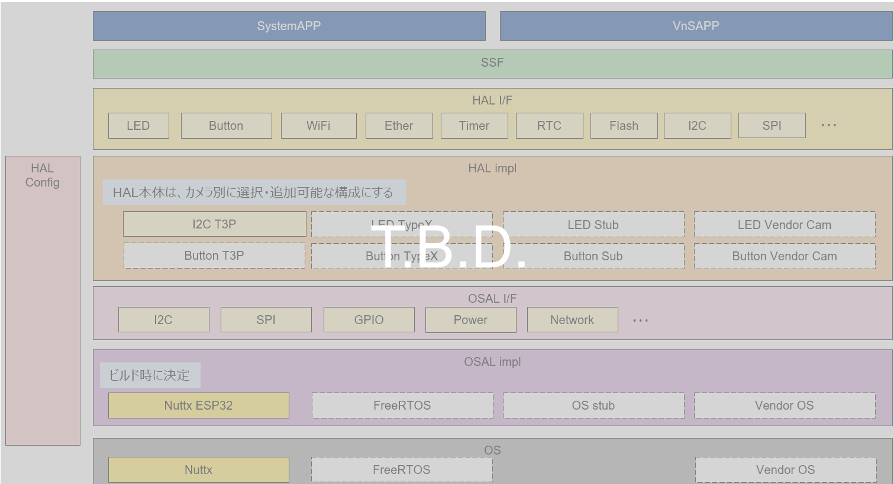

<<<

=== コンポーネントの詳細説明

PL LED の使用シーケンス例を以下に示します。 +
上位レイヤーは <<#_PlLedInitialize, PlLedInitialize>> を実行後、PL LED API を使用して各種 LED 機能を使うことができます。

[#_led_seq]
.シーケンス概要
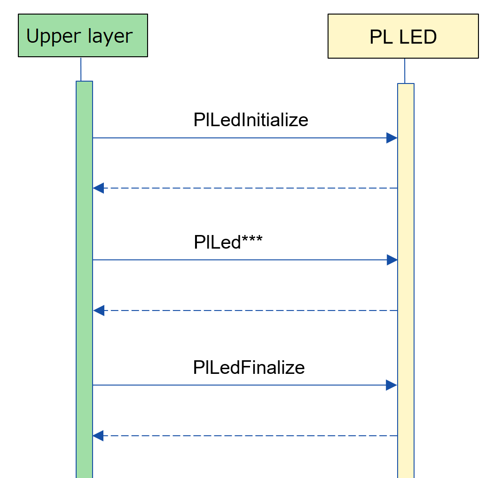

==== 依存ブロック(PL LED 内部向け)
.依存ブロック
[width="100%",options="header"]
|===
|ブロック名 |利用用途 |リンク
|HAL IOExp
|LED の点灯と消灯を制御するために使用します。
|https://github.com/aitrios/aitrios-edge-device-manager/blob/main/docs/spec/hal/ioexp/hal_ioexp_ja.adoc
|Timer
|LED の点滅を制御するためにタイマー機能を使用します。
|https://github.com/aitrios/aitrios-edge-device-manager/blob/main/docs/spec/utility/timer/utility_timer_ja.adoc
|===

<<<

=== 状態遷移
PL LED の取り得る状態を <<#_TableStates>> に示します。

[#_TableStates]
.状態一覧
[width="100%", cols="20%,80%",options="header"]
|===
|状態 |説明 

|LED_READY
|LED 初期状態。

|LED_RUNNING
|LED 実行可能状態。

|LED_START
|LED を制御している状態

|LED_START_SYNC
|複数 LED を同時に制御している状態

|LED_START_SEQ
|LED の点灯・消灯パターンをシーケンス制御している状態

|LED_STOP
|LED が停止している状態。 +
|===

PL LED では <<#_FigureState>> に示す状態遷移を行います。 +
また、各 API でエラーが発生した場合には状態遷移は起こりません。 +

[#_FigureState]
.状態遷移図
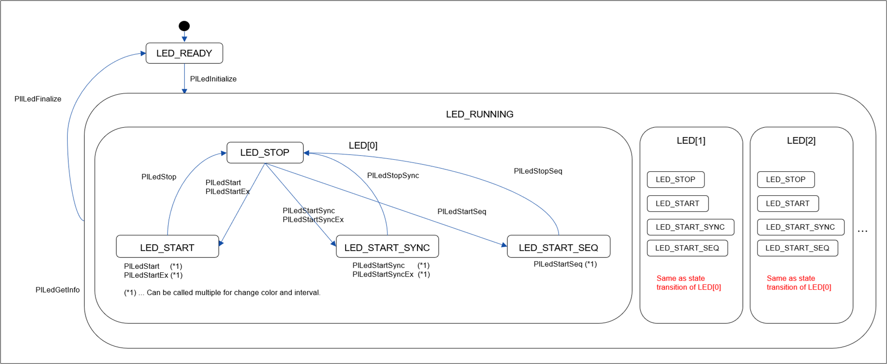

LED_RUNNING 状態の時、個々の LED は独立した状態を持つようになっています。各 LED の状態での API 受け付け可否と状態遷移先を <<#_TableStateTransition>> に示します。 +
表中の状態名は、API 実行完了後の遷移先状態を示し、すなわち API 呼び出し可能であることを示します。 +
x は API 受け付け不可を示し、ここでの API 呼び出しはエラーを返し状態遷移は起きません。 +
エラーの詳細は <<#_PlErrCode>> を参照してください。 

[#_TableStateTransition]
.状態遷移表
[width="100%", cols="5%,20%,15%,15%,15%,15%,15%"]
|===
2.3+|                          5+|状態
                              .2+|LED_READY    4+|LED_RUNNING
                                                 |LED_START |LED_START_SYNC |LED_START_SEQ |LED_STOP
.20+|API 名   |PlLedInitialize   |LED_RUNNING    |x         |x              |x             |x
              |PlLedFinalize     |x              |LED_READY |LED_READY      |LED_READY     |LED_READY
              |PlLedStart        |x              |LED_START |x              |x             |LED_START
              |PlLedStartEx      |x              |LED_START |x              |x             |LED_START
              |PlLedStop         |x              |LED_STOP  |x              |x             |x
              |PlLedStartSync    |x              |x         |LED_START_SYNC |x             |LED_START_SYNC
              |PlLedStartSyncEx  |x              |x         |LED_START_SYNC |x             |LED_START_SYNC
              |PlLedStopSync     |x              |x         |LED_STOP       |x             |x
              |PlLedStartSeq     |x              |x         |x              |LED_START_SEQ |LED_START_SEQ
              |PlLedStopSeq      |x              |x         |x              |LED_STOP      |x
              |PlLedGetInfo      |x              |LED_START |LED_START_SYNC |LED_START_SEQ |LED_STOP
|===

<<<

=== コンポーネントの機能一覧
<<#_TableFunction>> に機能の一覧を示します。

[#_TableFunction]
.機能一覧
[width="100%", cols="25%,50%,25%",options="header"]
|===
|機能名 |概要  |節番号
|LED 点滅・点灯の開始
|LED の点滅・点灯を開始します。
|<<#_Function1, 3.5.1.>>

|LED 点滅の停止・消灯
|LED 点滅の停止・消灯を行います。
|<<#_Function2, 3.5.2.>>

|LED 情報の取得
|LED の個数などカメラが持つ LED 情報を取得できます。
|<<#_Function3, 3.5.3.>>
|===

<<<

=== コンポーネントの機能説明
[#_Function1]
==== LED 点滅・点灯の開始
機能概要::
LED の点滅・点灯を開始します。
前提条件::
<<#_PlLedInitialize, PlLedInitialize>> が実行済みで、LED 実行可能状態であること。 +
操作対象の LED が停止している状態であること。
機能詳細::
点灯用のAPIは複数存在し、以下のように機能が異なります。

.LED Start API
[width="100%", cols="15%,25%,15%"]
|===
|                 |点滅間隔の指定        |引数で指定できる LED
|PlLedStart       |On、Off 時間が等間隔    |1つのみ
|PlLedStartEx     |On、Off 個別に指定可能  |1つのみ
|PlLedStartSync   |On、Off 時間が等間隔    |複数
|PlLedStartSyncEx |On、Off 個別に指定可能  |複数
|PlLedStartSeq    |On と Off の間隔を任意に指定可能 |1つのみ
|===

詳細は <<#_PlLedStart, PlLedStart>>、<<#_PlLedStartEx, PlLedStartEx>>、<<#_PlLedStartSync, PlLedStartSync>>、<<#_PlLedStartSyncEx, PlLedStartSyncEx>>、<<#_PlLedStartSeq, PlLedStartSeq>> を参照してください。

詳細挙動::
LED の点滅・点灯を開始します。
エラー時の挙動、復帰方法::
エラーコードを参照してください。状態遷移や引数の値を確認してください。
検討事項::
なし。

[#_Function2]
==== LED 点滅の停止・消灯
機能概要::
LED 点滅の停止・消灯を行います。
前提条件::
<<#_PlLedInitialize, PlLedInitialize>> が実行済みで、LED 実行可能状態であること。 +
操作対象の LED が実行している状態であること。
機能詳細::
詳細は <<#_PlLedStop, PlLedStop>>、<<#_PlLedStopSync, PlLedStopSync>>、<<#_PlLedStopSeq, PlLedStopSeq>> を参照してください。
詳細挙動::
LED 点滅の停止・消灯を行います。
エラー時の挙動、復帰方法::
エラーコードを参照してください。状態遷移や引数の値を確認してください。
検討事項::
なし。

[#_Function3]
==== カメラが持つ LED 情報の取得
機能概要::
LED の個数などカメラが持つ LED 情報を取得します。
前提条件::
<<#_PlLedInitialize, PlLedInitialize>> が実行済みで、LED 実行可能状態であること。
機能詳細::
詳細は <<#_PlLedGetInfo, PlLedGetInfo>> を参照してください。
詳細挙動::
LED の個数などカメラが持つ LED 情報を取得します。
エラー時の挙動、復帰方法::
エラーコードを参照してください。状態遷移や引数の値を確認してください。
検討事項::
なし。

<<<

=== コンポーネントの非機能要件一覧

<<#_TableNonFunction>> に非機能要件の一覧を示します。

[#_TableNonFunction]
.非機能要件一覧
[width="100%", cols="30%,55%,15%",options="header"]
|===
|機能名 |概要  |節番号
|Stack 最大使用量
|PL LED が使用する最大スタック サイズ
|<<#_stack, 3.7.>>

|通常ヒープ最大使用量
|malloc で取得するメモリ
|<<#_heap, 3.7.>>

|static データ最大使用量
|PL LED が使用する最大 static データ サイズ
|<<#_static, 3.7.>>

|パフォーマンス
|PL LED が提供する機能のパフォーマンス
|<<#_paformance, 3.7.>>
|===

=== コンポーネントの非機能要件説明

==== Stack 最大使用量
[#_stack]
512 バイト

==== 通常ヒープ最大使用量
[#_heap]
0 バイト

==== static データ最大使用量
[#_static]
256 バイト

==== パフォーマンス
[#_paformance]
1ミリ秒未満

<<<

== API 仕様
=== 定義一覧
==== データ型一覧
<<#_TableDataType>> にデータ型の一覧を示します。

[#_TableDataType]
.データ型一覧
[width="100%", cols="25%,55%,20%",options="header"]
|===
|データ型名 |概要  |節番号
|enum PlErrCode
|API の実行結果を定義する列挙型です。
|<<#_PlErrCode, 4.2.1.>>
|PlLedColorsInfo
|色情報を表す構造体です。
|<<#_PlLedColorsInfo, 4.2.2.>>
|PlLedLedsInfo
|LED 情報を表す構造体です。
|<<#_PlLedLedsInfo, 4.2.3.>>
|PlLedInfo
|LED 公開情報を表す構造体です。
|<<#_PlLedInfo, 4.2.4.>>
|PlLedStartParam
|PlLedStart、PlLedStartSync で使用する構造体です。
|<<#_PlLedStartParam, 4.2.5.>>
|PlLedStartParamEx
|PlLedStartEx、PlLedStartSyncEx で使用する構造体です。
|<<#_PlLedStartParamEx, 4.2.6.>>
|PlLedSequence
|PlLedStartSeq で使用する構造体です。
|<<#_PlLedSequence, 4.2.7.>>
|===

==== API 一覧
<<#_TablePublicAPI>> に API の一覧を示します。

[#_TablePublicAPI]
.上位レイヤーから直接使用可能な API
[width="100%", cols="10%,60%,20%",options="header"]
|===
|API 名 |概要 |節番号
|PlLedInitialize
|LED に関する全体的な初期化を行います。
|<<#_PlLedInitialize, 4.3.1.>>

|PlLedFinalize
|LED に関する全体的な終了処理を行います。
|<<#_PlLedFinalize, 4.3.2.>>

|PlLedStart
|LED の点滅・点灯を開始します。(On/Off 等間隔)
|<<#_PlLedStart, 4.3.3.>>

|PlLedStartEx
|LED の点滅・点灯を開始します。(On/Off 間隔指定可能)
|<<#_PlLedStart, 4.3.4.>>

|PlLedStop
|LED 点滅の停止・消灯を行います。
|<<#_PlLedStop, 4.3.5.>>

|PlLedStartSync
|複数の LED の同期した点滅・点灯を開始します。(On/Off 等間隔)
|<<#_PlLedStartSync, 4.3.6.>>

|PlLedStartSyncEx
|複数の LED の同期した点滅・点灯を開始します。(On/Off 間隔指定可能)
|<<#_PlLedStartSyncEx, 4.3.7.>>

|PlLedStopSync
|複数の LED の同期した点滅の停止・消灯を行います。
|<<#_PlLedStopSync, 4.3.8.>>

|PlLedStartSeq
|LED のシーケンス点滅を開始します。(任意の On/Off 間隔を複数指定可能)
|<<#_PlLedStartSyncEx, 4.3.9.>>

|PlLedStopSeq
|LED のシーケンス点滅を停止・消灯します。
|<<#_PlLedStopSync, 4.3.10.>>

|PlLedGetInfo
|カメラが持つ LED の個数など、LED に関する情報を取得できます。
|<<#_PlLedGetInfo, 4.3.11.>>
|===

<<<
[#_BuildConfig]
==== ビルド コンフィグレーション
PL LED の設定情報をビルド コンフィグレーションに記載します。

* *書式*
[source, C]
....
CONFIG_PL_LED_LEDS_NUM=3
CONFIG_PL_LED_LED0_ID=0
CONFIG_PL_LED_LED1_ID=1
CONFIG_PL_LED_LED2_ID=2

CONFIG_PL_LED_COLORS_NUM=4
CONFIG_PL_LED_COLOR0_ID=0
CONFIG_PL_LED_COLOR1_ID=1
CONFIG_PL_LED_COLOR2_ID=2
CONFIG_PL_LED_COLOR_OFF_ID=999

CONFIG_PL_LED_LED0_RED=16
CONFIG_PL_LED_LED0_GREEN=17
CONFIG_PL_LED_LED1_RED=18
CONFIG_PL_LED_LED1_GREEN=19
CONFIG_PL_LED_LED2_RED=20
CONFIG_PL_LED_LED2_GREEN=21

....

[#_BuildConfig_table]
.BuildConfig の説明
[width="100%", cols="30%,70%",options="header"]
|===
|メンバ名  |説明
|CONFIG_PL_LED_LEDS_NUM
|LED 個数
|CONFIG_PL_LED_LED0_ID
|LED 0 の ID
|CONFIG_PL_LED_LED1_ID
|LED 1 の ID
|CONFIG_PL_LED_LED2_ID
|LED 2 の ID
|CONFIG_PL_LED_COLORS_NUM
|LED 色数
|CONFIG_PL_LED_COLOR0_ID
|色 0 (赤) の ID
|CONFIG_PL_LED_COLOR1_ID
|色 1 (緑) の ID
|CONFIG_PL_LED_COLOR2_ID
|色 2 (橙) の ID
|CONFIG_PL_LED_COLOR_OFF_ID
|LED を消灯するための色 ID
|CONFIG_PL_LED_LED0_RED
|LED 0 の赤色に対応した IOExp ID
|CONFIG_PL_LED_LED0_GREEN
|LED 0 の緑色に対応した IOExp ID
|CONFIG_PL_LED_LED1_RED
|LED 1 の赤色に対応した IOExp ID
|CONFIG_PL_LED_LED1_GREEN
|LED 1 の緑色に対応した IOExp ID
|CONFIG_PL_LED_LED2_RED
|LED 2 の赤色に対応した IOExp ID
|CONFIG_PL_LED_LED2_GREEN
|LED 2 の緑色に対応した IOExp ID
|===
<<<

=== データ型定義
[#_PlErrCode]
==== PlErrCode
API の実行結果を定義する列挙型です。

[#_PlLedColorsInfo]
==== PlLedColorsInfo
色情報を表す構造体です。

* *書式*
[source, C]
....
typedef struct led_info_color {
  uint32_t color_id;  // 色番号 (red = 0, green = 1, orange = 2)
} PlLedColorsInfo;
....

[#_PlLedLedsInfo]
==== PlLedLedsInfo
LED 情報を表す構造体です。

* *書式*
[source, C]
....
typedef struct {
  uint32_t          led_id;      // LED 番号
  uint32_t          colors_num;  // 色数
  PlLedColorsInfo   colors[CONFIG_PL_LED_COLORS_NUM]; // 色情報
} PlLedLedsInfo;
....

[#_PlLedInfo]
==== PlLedInfo
PL LED のデバイス情報 (LED 数。色数など) を表す構造体です。

* *書式*
[source, C]
....
typedef struct {
  uint32_t        leds_num;                 // LED 数
  PlLedLedsInfo   leds[CONFIG_PL_LED_NUM];  // LED 情報
  uint32_t        interval_resolution_ms;   // LED 点滅の最小単位 (ミリ秒)
                                            // 仕様として 50ms となっています。
  struct timespec interval_ts_min;          // LED 点滅間隔の最小値
  struct timespec interval_ts_max;          // LED 点滅間隔の最大値
} PlLedInfo;
....

[#_PlLedStartParam]
==== PlLedStartParam
PlLedStart、PlLedStartSync で使用する構造体です。

* *書式*
[source, C]
....
typedef struct {
  uint32_t        led_id;
  uint32_t        color_id;
  struct timespec interval;
} PlLedStartParam;
....

<<<

[#_PlLedStartParamEx]
==== PlLedStartParamEx
PlLedStartEx、PlLedStartSyncEx で使用する構造体です。

* *書式*
[source, C]
....
typedef struct {
  uint32_t        led_id;
  uint32_t        color_id;
  struct timespec interval_on;
  struct timespec interval_off;
} PlLedStartParamEx;
....

<<<

[#_PlLedSequence]
==== PlLedSequence
PlLedStartSeq で使用する構造体です。

* *書式*
[source, C]
....
typedef struct {
  uint32_t        color_id;
  struct timespec interval;
} PlLedSequence;
....

<<<

=== 各 API の説明
[#_PlLedInitialize]
==== PlLedInitialize
* *機能* +
LED に関する全体的な初期化をします。

* *書式* +
[source, C]
....
PlErrCode PlLedInitialize(void)
....

* *引数の説明* +
-

* *戻り値* +
実行結果に応じて PlErrCode のいずれかの値が返ります。

* *説明* +
** LED に関する全体的な初期化をします。

.API 詳細情報
[width="100%", cols="30%,70%",options="header"]
|===
|API 詳細情報  |説明
|API 種別
|同期 API
|実行コンテキスト
|呼び元のコンテキストで動作
|同時呼び出し
|可能
|複数スレッドからの呼び出し
|可能
|複数タスクからの呼び出し
|可能
|API 内部でブロッキングするか
|ブロッキングする。
すでに他のコンテキストで PL LED API が動作中の場合、完了を待ってから実行されます。
|===

[#_PlLedInitialize_error]
.エラー情報
[options="header"]
|===
|エラーコード |原因 |OUT 引数の状態 |エラー後のシステム状態 |復旧方法
|kPlErrInvalidState (仮)
|状態遷移を無視したAPIコール。
|-
|影響なし
|不要

|kPlErrLock (仮)
|排他処理に失敗した
|-
|影響なし
|不要

|kPlErrCodeError (仮)
|Timer API がエラーを返した
|-
|影響なし
|不要
|===

<<<

[#_PlLedFinalize]
==== PlLedFinalize
* *機能* +
LED に関する全体的な終了処理をします。

* *書式* +
[source, C]
....
PlErrCode PlLedFinalize(void)
....

* *引数の説明* +
-

* *戻り値* +
実行結果に応じて PlErrCode のいずれかの値が返ります。

* *説明* +
** LED に関する全体的な終了処理をします。

.API 詳細情報
[width="100%", cols="30%,70%",options="header"]
|===
|API 詳細情報  |説明
|API 種別
|同期 API
|実行コンテキスト
|呼び元のコンテキストで動作
|同時呼び出し
|可能
|複数スレッドからの呼び出し
|可能
|複数タスクからの呼び出し
|可能
|API 内部でブロッキングするか
|ブロッキングする。
すでに他のコンテキストで PL LED API が動作中の場合、完了を待ってから実行されます。
|===

[#_PlLedFinalize_error]
.エラー情報
[options="header"]
|===
|エラーコード |原因 |OUT 引数の状態 |エラー後のシステム状態 |復旧方法
|kPlErrInvalidState (仮)
|状態遷移を無視したAPIコール。
|-
|影響なし
|不要

|kPlErrLock (仮)
|排他処理に失敗した
|-
|影響なし
|不要
|===

<<<

[#_PlLedStart]
==== PlLedStart

* *機能* +
LED の点灯・点滅を開始します。
PlLedStart では一つの LED しか制御できないため、複数の LED を同時に制御する場合は PlLedStartSync を使用してください。

* *書式* +
[source, C]
....
PlErrCode PlLedStart(const PlLedStartParam *param)
....

* *引数の説明* +
**[IN] const PlLedStartParam *param**:: 
LED の点滅状態を表す構造体。
** param->led_id:
*** 操作対象の LED 番号。
*** <<#_PlLedGetInfo, PlLedGetInfo>> で取得した情報から選択してください。 +
** param->color_id:
*** LED の色。
*** <<#_PlLedGetInfo, PlLedGetInfo>> で取得した情報から選択してください。
** interval_ts:
*** 点滅間隔を指定します。
*** 指定した時間 LED を点灯した後、指定した時間 LED を消灯します。これを PlLedStop API が呼び出されるまで繰り返します。 +
*** 常時点灯させる場合は 0 を指定してください。 +
*** 点滅間隔の最小・最大値は <<#_PlLedGetInfo, PlLedGetInfo>> API で取得した PlLedInfo 構造体の interval_ts_min と interval_ts_max を参照してください。 +
*** LED 点滅最小単位 (それぞれ点灯時間、消灯時間の最小単位) に満たない場合は、点滅最小単位 (50ms) に切り上げます。 +
*** (例): interval_ts_min = 50ms のとき
**** 49ms -> エラー
**** 50ms -> 50ms
**** 55ms -> 100ms に切り上げ

* *戻り値* +
実行結果に応じて PlErrCode のいずれかの値が返ります。

* *説明* +
** LED の点灯・点滅を開始します。
** 本 API は、<<#_PlLedInitialize, PlLedInitialize>> の実行後に使用可能です。
** 本 API は非同期型です。
** 本 API は繰り返しコール可能です。
*** PlLedStop を挟まずに色・点滅周期のみを変更などが可能です。
** 本 API により、LED の点滅・点灯を開始します。点滅動作の場合、初期状態は LED=ON で開始し、指定した点滅間隔が経過するたびに、消灯と点灯を繰り返します。
** 対象の LED、color は <<#_PlLedGetInfo, PlLedGetInfo>> で取得した情報から選択してください。

TIP: 同じ引数で繰り返し呼び出すことができます。点滅間隔を指定している場合、呼び出されるたびに点滅周期が新しく開始されます。

LED 点滅動作の例：
[#_led_pl_start]
.PlLedStart
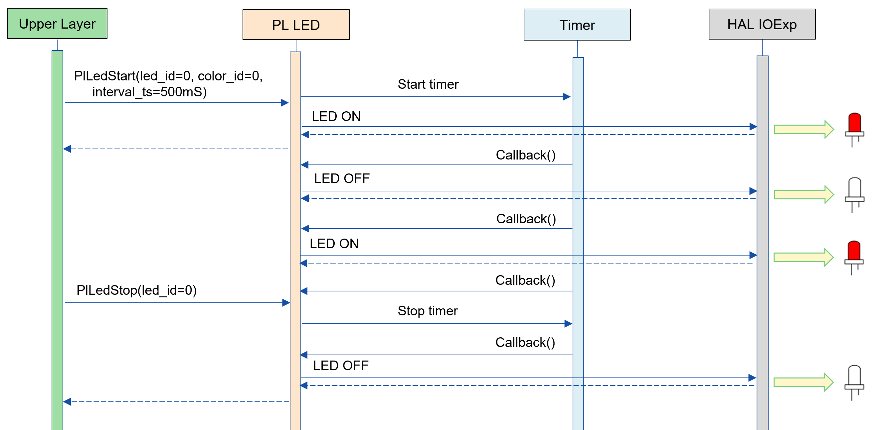

LED 点滅のタイミング チャート：
[#_led_timing]
.LED 点灯
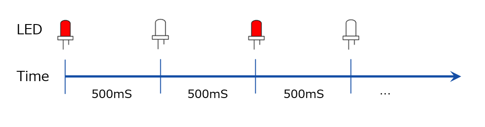

LED 常時点灯の例：
[#_pl_led]
.PL LED API
image::./images/led_api_flow.png[scaledwidth="100%",align="center"]

.API 詳細情報
[width="100%", cols="30%,70%",options="header"]
|===
|API 詳細情報  |説明
|API 種別
|非同期 API
|実行コンテキスト
|パラメータチェックまで：呼び元のコンテキストで動作 +
 点灯・点滅処理：PL LED 側のコンテキストで動作
|同時呼び出し
|可能
|複数スレッドからの呼び出し
|可能
|複数タスクからの呼び出し
|可能
|API 内部でブロッキングするか
|ブロッキングする。 +
すでに他のコンテキストで PL LED API が動作中の場合、完了を待ってから実行されます。
|===

.エラー情報
[options="header"]
|===
|エラーコード |原因 |OUT 引数の状態 |エラー後のシステム状態 |復旧方法
|kPlErrInvalidState (仮)
|状態遷移を無視したAPIコール。
|-
|影響なし
|不要

|kPlErrInvalidParam (仮)
|パラメータエラー
|-
|影響なし
|不要

|kPlErrLock (仮)
|排他処理に失敗した
|-
|影響なし
|不要
|===

<<<

[#_PlLedStartEx]
==== PlLedStartEx

* *機能* +
LED の点灯・点滅を開始します。(On/Off 間隔指定可能)
PlLedStartEx では一つの LED しか制御できないため、複数の LED を同時に制御する場合は PlLedStartSyncEx を使用してください。

* *書式* +
[source, C]
....
PlErrCode PlLedStartEx(const PlLedStartParamEx *param);
....

* *引数の説明* +
**[IN] cont PlLedStartParamEx *param**:: 
LED の点滅状態を表す構造体。
** param->led_id:
*** 操作対象の LED 番号。
*** <<#_PlLedGetInfo, PlLedGetInfo>> で取得した情報から選択してください。
** param->color_id:
*** LED の色。
*** <<#_PlLedGetInfo, PlLedGetInfo>> で取得した情報から選択してください。
** param->interval_on:
*** LED を点灯させる時間を指定します。
*** 指定した時間 LED を点灯した後、interval_off で指定された時間 LED を消灯します。これを PlLedStop が呼び出されるまで繰り返します。
*** 0 の場合、常時点灯となります。
**** 点滅間隔の最小・最大値は <<#_PlLedGetInfo, PlLedGetInfo>> API で取得した PlLedInfo 構造体の interval_ts_min と interval_ts_max を参照してください。
*** LED 点滅最小単位 (それぞれ点灯時間、消灯時間の最小単位) に満たない場合は、点滅最小単位 (50ms) に切り上げます。
*** (例): interval_ts_min = 50ms のとき
**** 49ms -> エラー
**** 50ms -> 50ms
**** 55ms -> 100ms に切り上げ
** param->interval_off:
*** LED を消灯させる時間を指定します。
*** 0 の場合、常時点灯となります。
*** 指定した時間 LED を消灯した後、interval_on で指定された時間 LED を点灯します。これを PlLedStop が呼び出されるまで繰り返します。

* *戻り値* +
実行結果に応じて PlErrCode のいずれかの値が返ります。

* *説明* +
** LED の点灯・点滅を開始します。(On/Off 間隔指定可能)
** 本 API は、<<#_PlLedInitialize, PlLedInitialize>> の実行後に使用可能です。
** 本 API は非同期型です。
** 本 API により、LED の点滅・点灯を開始します。点滅動作の場合、初期状態は LED=ON で開始し、指定した点滅間隔が経過するたびに、消灯と点灯を繰り返します。
** 本 API は繰り返しコール可能です。
*** PlLedStop を挟まずに色・点滅周期のみを変更などが可能です。
** 対象の LED、color は <<#_PlLedGetInfo, PlLedGetInfo>> で取得した情報から選択してください。

TIP: 同じ引数で繰り返し呼び出すことができます。点滅間隔を指定している場合、呼び出されるたびに点滅周期が新しく開始されます。

LED 点滅動作の例：
[#_led_pl_start_ex]
.PlLedStart
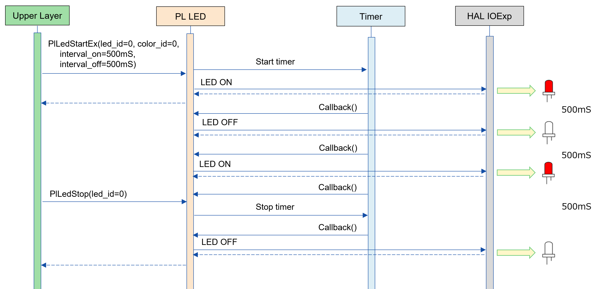

LED 点滅のタイミング チャート：
[#_led_timing_ex]
.LED 点灯
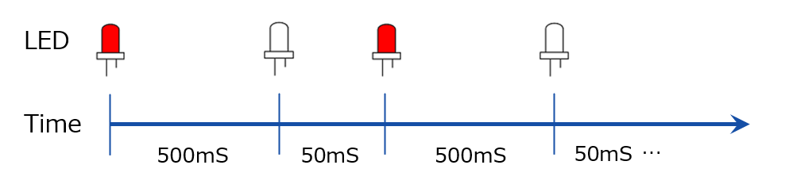

.API 詳細情報
[width="100%", cols="30%,70%",options="header"]
|===
|API 詳細情報  |説明
|API 種別
|非同期 API
|実行コンテキスト
|パラメータチェックまで：呼び元のコンテキストで動作 +
 点灯・点滅処理：PL LED 側のコンテキストで動作
|同時呼び出し
|可能
|複数スレッドからの呼び出し
|可能
|複数タスクからの呼び出し
|可能
|API 内部でブロッキングするか
|ブロッキングする。 +
すでに他のコンテキストで PL LED API が動作中の場合、完了を待ってから実行されます。
|===

.エラー情報
[options="header"]
|===
|エラーコード |原因 |OUT 引数の状態 |エラー後のシステム状態 |復旧方法
|kPlErrInvalidState (仮)
|状態遷移を無視した API コール。
|-
|影響なし
|不要

|kPlErrInvalidParam (仮)
|パラメータエラー
|-
|影響なし
|不要

|kPlErrLock (仮)
|排他処理に失敗した
|-
|影響なし
|不要
|===

<<<

[#_PlLedStop]
==== PlLedStop
* *機能* +
LED 点滅の停止・消灯を行います。

* *書式* +
[source, C]
....
PlErrCode PlLedStop(uint32_t led_id)
....

* *引数の説明* +
**[IN] uint32_t led_id**:: 
操作対象の LED 番号。 +
<<#_PlLedGetInfo, PlLedGetInfo>> で取得できる情報から選択してください。 +
指定された LED で点滅・点灯が実行されていない場合、エラーを返します。

* *戻り値* +
実行結果に応じて PlErrCode のいずれかの値が返ります。

* *説明* +
** 指定された LED の点滅を停止します。
** 本 API は、<<#_PlLedInitialize, PlLedInitialize>>、<<#_PlLedStart, PlLedStart>>、<<#_PlLedStartEx, PlLedStartEx>> の実行後に使用可能です。
** 本 API は、指定された LED が操作中状態の場合に使用可能です。
** 状態が LED_START 以外の場合、エラーを返します。 <<#_FigureState, 状態遷移図>> を参照してください。
** 対象の LED は <<#_PlLedGetInfo, PlLedGetInfo>> で取得した情報から選択してください。

[#_PlLedStop_desc]
.API 詳細情報
[width="100%", cols="30%,70%",options="header"]
|===
|API 詳細情報  |説明
|API 種別
|同期 API
|実行コンテキスト
|呼び元のコンテキストで動作
|同時呼び出し
|可能
|複数スレッドからの呼び出し
|可能
|複数タスクからの呼び出し
|可能
|API 内部でブロッキングするか
|ブロッキングする。
すでに他のコンテキストで PL LED API が動作中の場合、完了を待ってから実行されます。
|===

[#_PlLedStop_error]
.エラー情報
[options="header"]
|===
|エラーコード |原因 |OUT 引数の状態 |エラー後のシステム状態 |復旧方法
|kPlErrInvalidState (仮)
|状態遷移を無視した API コール。
|-
|影響なし
|不要

|kPlErrInvalidParam (仮)
|パラメータエラー
|-
|影響なし
|不要

|kPlErrLock (仮)
|排他処理に失敗した
|-
|影響なし
|不要
|===

<<<
[#_PlLedStartSync]
==== PlLedStartSync

* *機能* +
複数の LED の点灯・点滅を開始します。

* *書式* +
[source, C]
....
PlErrCode PlLedStartSync(const PlLedStartParam *params, uint32_t param_len)
....

* *引数の説明* +
**[IN] const PlLedSyncParam *params**:: 
** 複数の LED 番号、および色を表す配列。
** <<#_PlLedGetInfo, PlLedGetInfo>> で取得できる情報から選択してください。
** params[0].led_id = 0, params[1].led_id = 0 のように、同じ LED 番号を指定された場合はエラーを返します。

**[IN] uint32_t param_len**:: 
** params の配列長。
** 0 の場合エラーを返します。
** PlLedGetInfo で取得した leds_num よりも大きい数の場合エラーを返します。
** <<#_PlLedGetInfo, PlLedGetInfo>> で取得した情報から選択してください。

* *戻り値* +
実行結果に応じて PlErrCode のいずれかの値が返ります。

* *説明* +
** 複数のLED の点灯・点滅を開始します。
** 本 API は、<<#_PlLedInitialize, PlLedInitialize>> の実行後に使用可能です。
** 本 API は非同期型です。
** 本 API により、LED の点滅・点灯を開始します。点滅動作の場合、初期状態は LED=ON で開始し、指定した点滅間隔が経過するたびに、消灯と点灯を繰り返します。
** 本 API は繰り返しコール可能です。
*** PlLedStopSync を挟まずに色・点滅周期のみを変更などが可能です。
** 対象の LED、color は <<#_PlLedGetInfo, PlLedGetInfo>> で取得した情報から選択してください。

TIP: 同じ引数で繰り返し呼び出すことができます。点滅間隔を指定している場合、呼び出されるたびに点滅周期が新しく開始されます。

LED 点滅動作の例：
[#_led_pl_start_sync]
.PlLedStart
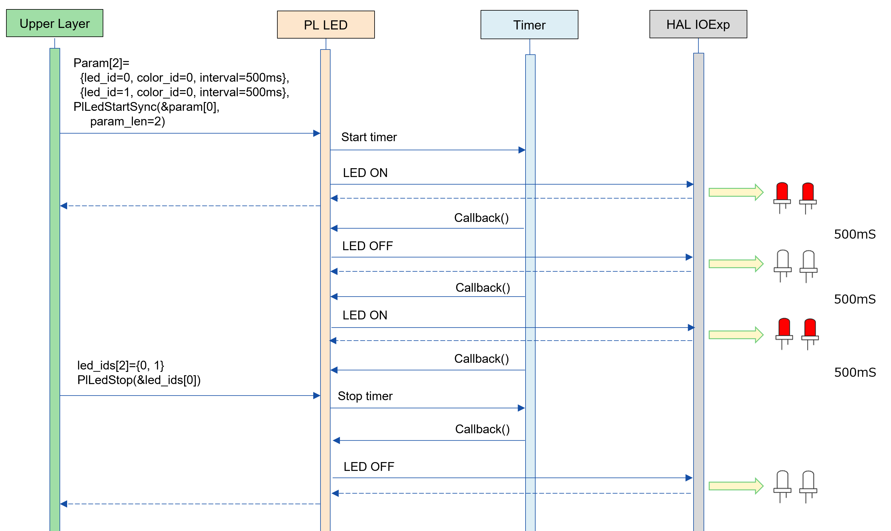

LED 点滅のタイミング チャート：
[#_led_timing_sync]
.LED 点灯
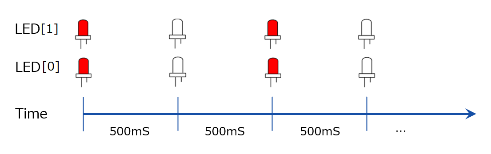

LED 常時点灯の例：
[#_pl_led_sync]
.PL LED API
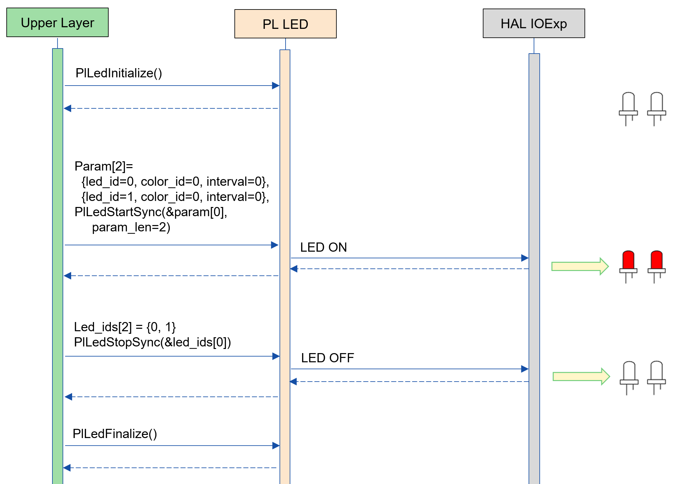

.API 詳細情報
[width="100%", cols="30%,70%",options="header"]
|===
|API 詳細情報  |説明
|API 種別
|非同期 API
|実行コンテキスト
|パラメータチェックまで：呼び元のコンテキストで動作 +
 点灯・点滅処理：PL LED 側のコンテキストで動作
|同時呼び出し
|可能
|複数スレッドからの呼び出し
|可能
|複数タスクからの呼び出し
|可能
|API 内部でブロッキングするか
|ブロッキングする。 +
すでに他のコンテキストで PL LED API が動作中の場合、完了を待ってから実行されます。
|===

.エラー情報
[options="header"]
|===
|エラーコード |原因 |OUT 引数の状態 |エラー後のシステム状態 |復旧方法
|kPlErrInvalidState (仮)
|状態遷移を無視したAPIコール。
|-
|影響なし
|不要

|kPlErrInvalidParam (仮)
|パラメータエラー
|-
|影響なし
|不要

|kPlErrLock (仮)
|排他処理に失敗した
|-
|影響なし
|不要
|===

<<<

[#_PlLedStartSyncEx]
==== PlLedStartSyncEx

* *機能* +
複数のLED の点灯・点滅を開始します。(On/Off 間隔指定可能)

* *書式* +
[source, C]
....
PlErrCode PlLedStartSyncEx(const PlLedStartParamEx *param, uint32_t param_len);
....

* *引数の説明* +
**[IN] const PlLedSyncParam *params**:: 
複数の LED 番号、および色を表す配列。
<<#_PlLedGetInfo, PlLedGetInfo>> で取得できる情報から選択してください。
params[0].led_id = 0, params[1].led_id = 0 のように、同じ LED 番号を指定された場合はエラーを返します。

**[IN] uint32_t param_len**:: 
** params の配列長。
** 0 の場合エラーを返します。
** PlLedGetInfo で取得した leds_num よりも大きい数の場合エラーを返します。

* *戻り値* +
実行結果に応じて PlErrCode のいずれかの値が返ります。

* *説明* +
** LED の点灯・点滅を開始します。(On/Off 間隔指定可能)
** 本 API は、<<#_PlLedInitialize, PlLedInitialize>> の実行後に使用可能です。
** 本 API は非同期型です。
** 本 API により、LED の点滅・点灯を開始します。点滅動作の場合、初期状態は LED=ON で開始し、指定した点滅間隔が経過するたびに、消灯と点灯を繰り返します。
** 本 API は繰り返しコール可能です。
*** PlLedStopSync を挟まずに色・点滅周期のみを変更などが可能です。
** 対象の LED、color は <<#_PlLedGetInfo, PlLedGetInfo>> で取得した情報から選択してください。

TIP: 同じ引数で繰り返し呼び出すことができます。点滅間隔を指定している場合、呼び出されるたびに点滅周期が新しく開始されます。

LED 点滅動作の例：
[#_led_pl_start_sync_ex]
.PlLedStart
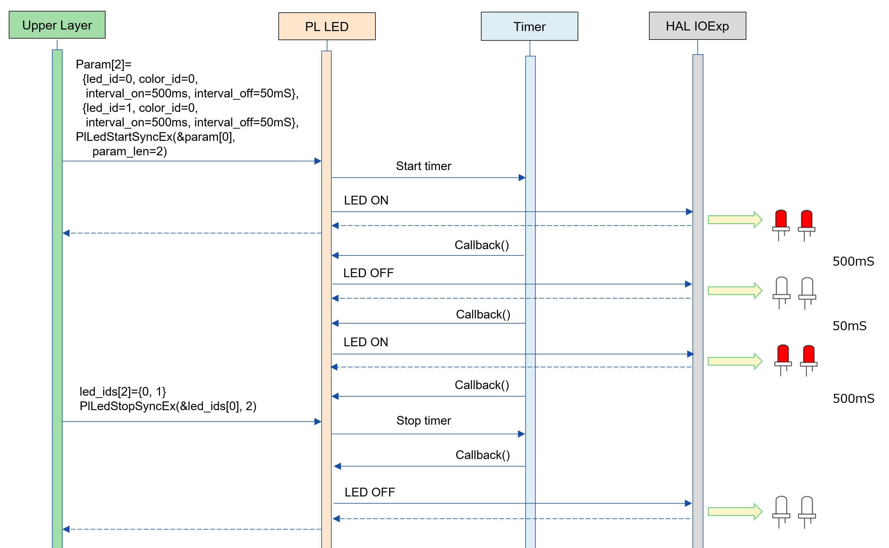

LED 点滅のタイミング チャート：
[#_led_timing_sync_ex]
.LED 点灯
image::./images/led_timing_sync_ex.png[scaledwidth="100%",align="center"]

.API 詳細情報
[width="100%", cols="30%,70%",options="header"]
|===
|API 詳細情報  |説明
|API 種別
|非同期 API
|実行コンテキスト
|パラメータチェックまで：呼び元のコンテキストで動作 +
 点灯・点滅処理：PL LED 側のコンテキストで動作
|同時呼び出し
|可能
|複数スレッドからの呼び出し
|可能
|複数タスクからの呼び出し
|可能
|API 内部でブロッキングするか
|ブロッキングする。 +
すでに他のコンテキストで PL LED API が動作中の場合、完了を待ってから実行されます。
|===

.エラー情報
[options="header"]
|===
|エラーコード |原因 |OUT 引数の状態 |エラー後のシステム状態 |復旧方法
|kPlErrInvalidState (仮)
|状態遷移を無視したAPIコール。
|-
|影響なし
|不要

|kPlErrInvalidParam (仮)
|パラメータエラー
|-
|影響なし
|不要

|kPlErrLock (仮)
|排他処理に失敗した
|-
|影響なし
|不要
|===

<<<

[#_PlLedStopSync]
==== PlLedStopSync
* *機能* +
複数の LED 点滅の停止・消灯を行います。

* *書式* +
[source, C]
....
PlErrCode PlLedStopSync(uint32_t *led_ids, uint32_t len)
....

* *引数の説明* +
**[IN] uint32_t *led_ids**:: 
** LED ID を表す配列。
** led_ids[0] = 0, led_ids[1] = 0 のように、同じ LED 番号を指定された場合はエラーを返します。

**[IN] uint32_t len**:: 
** params の配列長。
** 0 の場合エラーを返します。
** PlLedGetInfo で取得した leds_num よりも大きい数の場合エラーを返します。

* *戻り値* +
実行結果に応じて PlErrCode のいずれかの値が返ります。

* *説明* +
** 指定された LED の点滅を停止します。
** 本 API は、<<#_PlLedInitialize, PlLedInitialize>>、<<#_PlLedStartSync, PlLedStartSync>>、<<#_PlLedStartSyncEx, PlLedStartSyncEx>> の実行後に使用可能です。
** 状態がLED_START_SYNC以外の場合、エラーを返します。 <<#_FigureState, 状態遷移図>> を参照してください。

.API 詳細情報
[width="100%", cols="30%,70%",options="header"]
|===
|API 詳細情報  |説明
|API 種別
|同期 API
|実行コンテキスト
|呼び元のコンテキストで動作
|同時呼び出し
|可能
|複数スレッドからの呼び出し
|可能
|複数タスクからの呼び出し
|可能
|API 内部でブロッキングするか
|ブロッキングする。
すでに他のコンテキストで PL LED API が動作中の場合、完了を待ってから実行されます。
|===

.エラー情報
[options="header"]
|===
|エラーコード |原因 |OUT 引数の状態 |エラー後のシステム状態 |復旧方法
|kPlErrInvalidState (仮)
|状態遷移を無視したAPIコール。
|-
|影響なし
|不要

|kPlErrInvalidParam (仮)
|パラメータエラー
|-
|影響なし
|不要

|kPlErrLock (仮)
|排他処理に失敗した
|-
|影響なし
|不要
|===

<<<
[#_PlLedStartSeq]
==== PlLedStartSeq

* *機能* +
指定した LED のシーケンス点灯・消灯を繰り返し実行します。

* *書式* +
[source, C]
....
PlErrCode PlLedStartSeq(uint32_t led_id, const PlLedSequence *seq, uint32_t seq_len)
....

* *引数の説明* +
**[IN] uint32_t led_id**:: 
** シーケンスを登録する LED 番号を指定します。指定された LED は LED_START_SEQ 状態になります。

**[IN] const PlLedSequence *seq**:: 
** 指定された LED 番号の色と点灯間隔・消灯を指定するシーケンス配列です。
** シーケンス配列の内容は、PL LED 内部へコピーするため、PlLedStartSeq 実行後、メモリは破棄しても構いません。
** color が CONFIG_PL_LED_COLOR_OFF_ID の場合、LED を消灯します。

**[IN] uint32_t seq_len**:: 
** シーケンス配列 (seq) の配列長。
** 0 の場合エラーを返します。

* *戻り値* +
実行結果に応じて PlErrCode のいずれかの値が返ります。

* *説明* +
** 指定した LED をシーケンス配列で指定したパターンで繰り返し実行します。
** 本 API は、<<#_PlLedInitialize, PlLedInitialize>> の実行後に使用可能です。
** 本 API は非同期型です。
** 本 API により、LED の点滅・点灯を開始します。点滅動作の場合、初期状態は LED=ON で開始し、指定した点灯間隔が経過すると消灯します。
** 本 API は繰り返しコール可能です。点滅設定が上書きされ、次の周期（T3P、T5 の場合 50 ms 単位）から新しい点滅シーケンスが開始します。

*** PlLedStopSeq を挟まずに色・点滅周期のみを変更などが可能です。
** 対象の LED、color は <<#_PlLedGetInfo, PlLedGetInfo>> で取得した情報から選択してください。

TIP: 同じ引数で繰り返し呼び出すことができます。呼び出されるたびに先頭のシーケンスから開始されます。

LED シーケンス動作の例：
[#_led_pl_start_seq_1]
.PlLedStartSeq #1 (テストコード PlLedSeqTest1() の動作を図示する)

T.B.D.

[#_led_pl_start_seq_2]
.PlLedStartSeq #2 (テストコード PlLedSeqTest2() の動作を図示する)

T.B.D.

[#_led_pl_start_seq_3]
.PlLedStartSeq #3 (テストコード PlLedSeqTest3() の動作を図示する)

T.B.D.

.API 詳細情報
[width="100%", cols="30%,70%",options="header"]
|===
|API 詳細情報  |説明
|API 種別
|非同期 API
|実行コンテキスト
|パラメータチェックまで：呼び元のコンテキストで動作 +
 点灯・点滅処理：PL LED 側のコンテキストで動作
|同時呼び出し
|可能
|複数スレッドからの呼び出し
|可能
|複数タスクからの呼び出し
|可能
|API 内部でブロッキングするか
|ブロッキングする。 +
すでに他のコンテキストで PL LED API が動作中の場合、完了を待ってから実行されます。
|===

.エラー情報
[options="header"]
|===
|エラーコード |原因 |OUT 引数の状態 |エラー後のシステム状態 |復旧方法
|kPlErrInvalidState (仮)
|状態遷移を無視したAPIコール。
|-
|影響なし
|不要

|kPlErrInvalidParam (仮)
|パラメータエラー
|-
|影響なし
|不要

|kPlErrLock (仮)
|排他処理に失敗した
|-
|影響なし
|不要
|===

<<<

[#_PlLedStopSeq]
==== PlLedStopSeq
* *機能* +
指定した LED のシーケンス点滅動作を停止して LED を消灯します。

* *書式* +
[source, C]
....
PlErrCode PlLedStopSeq(uint32_t led_id)
....

* *引数の説明* +
**[IN] uint32_t led_id**:: 
** シーケンス点滅を停止させたい LED 番号を指定します。指定された LED は LED_STOP 状態になります。

* *戻り値* +
実行結果に応じて PlErrCode のいずれかの値が返ります。

* *説明* +
** 指定された LED のシーケンス点滅を停止します。
** 本 API は、<<#_PlLedInitialize, PlLedInitialize>>、<<#_PlLedStartSeq, PlLedStartSeq>> の実行後に使用可能です。
** 状態が LED_START_SEQ 以外の場合、エラーを返します。 <<#_FigureState, 状態遷移図>> を参照してください。

.API 詳細情報
[width="100%", cols="30%,70%",options="header"]
|===
|API 詳細情報  |説明
|API 種別
|同期 API
|実行コンテキスト
|呼び元のコンテキストで動作
|同時呼び出し
|可能
|複数スレッドからの呼び出し
|可能
|複数タスクからの呼び出し
|可能
|API 内部でブロッキングするか
|ブロッキングする。
すでに他のコンテキストで PL LED API が動作中の場合、完了を待ってから実行されます。
|===

.エラー情報
[options="header"]
|===
|エラーコード |原因 |OUT 引数の状態 |エラー後のシステム状態 |復旧方法
|kPlErrInvalidState (仮)
|状態遷移を無視した API コール。
|-
|影響なし
|不要

|kPlErrInvalidParam (仮)
|パラメータエラー
|-
|影響なし
|不要

|kPlErrLock (仮)
|排他処理に失敗した
|-
|影響なし
|不要
|===

<<<

[#_PlLedGetInfo]
==== PlLedGetInfo
* *機能* +
カメラが持つ LED の個数など、LED に関する情報を取得できます。

* *書式* +
[source, C]
....
PlErrCode PlLedGetInfo(PlLedInfo *info)
....

* *引数の説明* +
**[OUT] struct PlLedInfo *info**:: 
PL LED の公開情報。

* *戻り値* +
実行結果に応じて PlErrCode のいずれかの値が返ります。

* *説明* +
** カメラが持つ LED の個数など、LED に関する情報を取得できます。
** 本 API は、<<#_PlLedInitialize, PlLedInitialize>> の実行後に使用可能です。

.API 詳細情報
[width="100%", cols="30%,70%",options="header"]
|===
|API 詳細情報  |説明
|API 種別
|同期 API
|実行コンテキスト
|呼び元のコンテキストで動作
|同時呼び出し
|可能
|複数スレッドからの呼び出し
|可能
|複数タスクからの呼び出し
|可能
|API 内部でブロッキングするか
|ブロッキングする。 +
 すでに他のコンテキストで PL LED API が動作中の場合、完了を待ってから実行されます。
|===

[#_PlLedGetInfo_error]
.エラー情報
[options="header"]
|===
|エラーコード |原因 |OUT 引数の状態 |エラー後のシステム状態 |復旧方法
|kPlErrInvalidState (仮)
|状態遷移を無視した API コール。
|変更なし
|影響なし
|不要

|kPlErrInvalidParam (仮)
|パラメータエラー
|変更なし
|影響なし
|不要

|kPlErrLock (仮)
|排他処理に失敗した
|変更なし
|影響なし
|不要
|===

<<<

== API使用時の呼び出し例

<<#_led_seq, シーケンス概要>>, <<#_led_pl_start, PlLedStart>>, <<#_led_pl_start_ex, PlLedStartEx>>, <<#_led_pl_start_sync, PlLedStartSync>>, <<#_led_pl_start_sync_ex, PlLedStartSyncEx>>を参照。

== 特記事項やコンポーネントごとの特有の説明事項
なし

== 使用している OSS の一覧
なし

<<<

== 参考文献
なし

<<<

== 更新履歴
[width="100%", cols="20%,80%",options="header"]
|===
|Version |Changes 
|0.0.1
|初版

|0.0.2
|- PlLedStartSync、PlLedStartSyncEx、PlLedStopSync API を追加 +
- 状態遷移図を変更 +
- Stop を介さずに LED の点灯状態を変更可能にした +
- 図 (*.png) を英語表記に変更

|0.0.3
|- LED_START_SEQ 状態を追加し、状態遷移図と状態遷移表を変更 +
- PlLedStartSeq、PlLedStopSeq API を追加 +

|===
