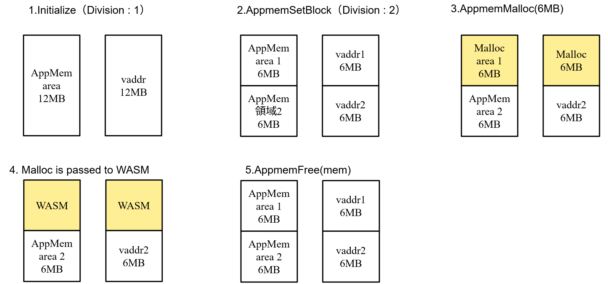
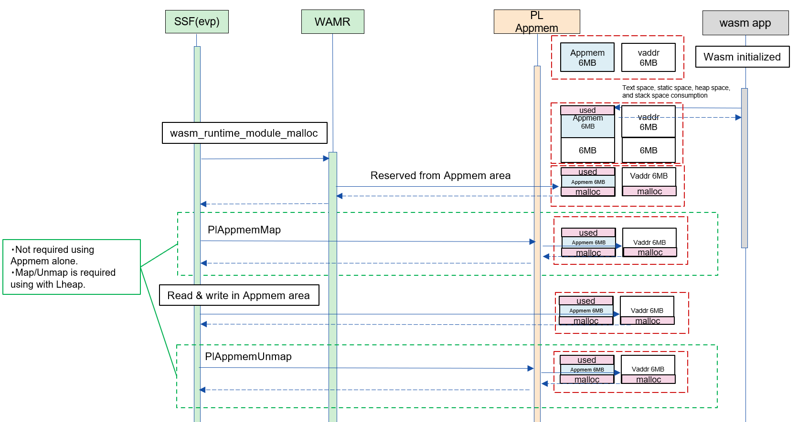
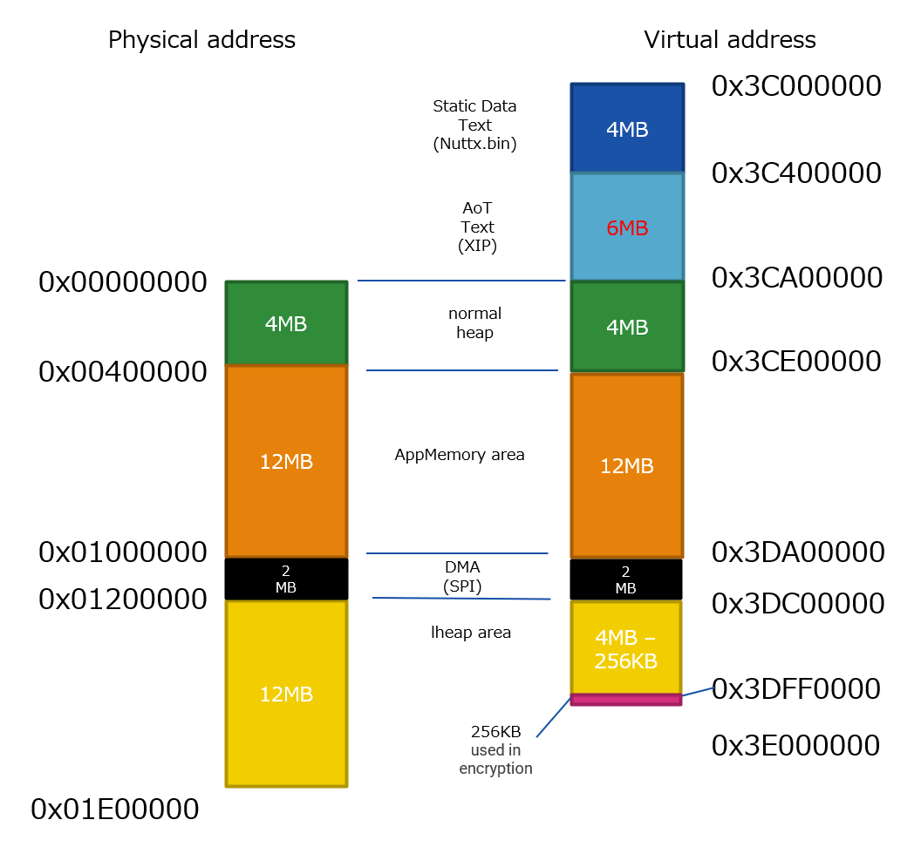
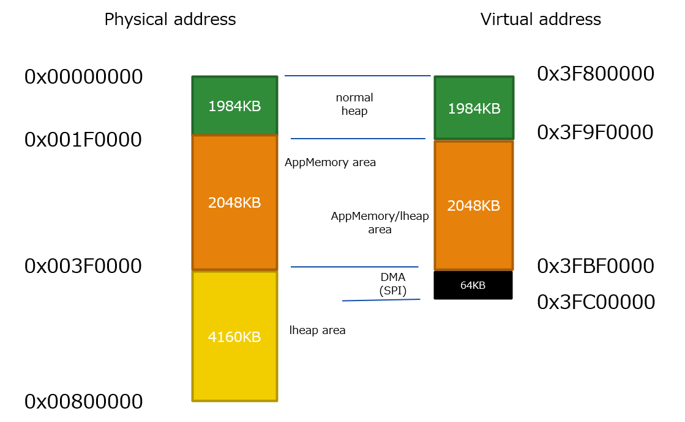

= PL Appmemory
:sectnums:
:sectnumlevels: 3
:chapter-label:
:revnumber: 0.0.2
:toc: left
:toc-title: 目次
:toclevels: 3
:lang: ja
:xrefstyle: short
:figure-caption: Figure
:table-caption: Table
:section-refsig:
:experimental:

<<<

== 目的と適用範囲

本書では AITRIOS PL の impl レイヤーの一つである、
Memory impl の <<#_words, AppMemory 領域>> の仕様について記載します。 +
AppMemory 領域は WASM (AoT) が実行時に使用するメモリ領域です。 +
したがって PL Appmemory の目的は、SoC やメモリ容量などによる I/F の差分を吸収して
上位レイヤーの WASM に対してメモリへのアクセス手段を提供することです。

<<<

== 用語

[#_words]
.用語一覧
[options="header"]
|===
|用語 |説明 
|PL
|Porting Layer. カメラ/ OS 差分を吸収する層

|himem
|high memory

|VnS APP
|Vision and Sensing Application

|AoT
|Ahead of Time
 WASM ファイル形式の一種。

|WASM
|Web Assembly​

|WAMR
|Web Assembly Micro Runtime

|AppMemory 領域
|Application Memory +
 WASM (AoT) が使用できるメモリ領域

|nativeアドレス
|System APP 側から見た AppMemory 領域の絶対アドレス。 +
詳細は <<#_WASM_AoT_Memory, 6.1.>> 参照。 +

|app_offset
|WASM (AoT) 側から見た AppMemory 領域のオフセット位置。。 +
詳細は <<#_WASM_AoT_Memory, 6.1.>> 参照。 +

|===

<<<

== コンポーネントの説明

=== コンポーネントの概要

以下に本ブロックを中心としたソフトウェア構成図を示します。

.概要図
image::./images/appmem_component.png[scaledwidth="100%",align="center"]

=== コンポーネントの詳細説明

=== コンポーネントの機能一覧
<<#_TableFunction>> に機能の一覧を示します。

[#_TableFunction]
.機能一覧
[width="100%", cols="30%,55%,15%",options="header"]
|===
|機能名 |概要  |節番号

|PL Appmemory の初期化/終了
|PL Appmemory 機能を初期化/終了します。
|<<#_Function1, 3.4.1.>>

|AppMemory 領域の物理メモリ領域に仮想メモリ領域を割り当て/解除
|AppMemory 領域の物理メモリ領域に仮想メモリ領域を割り当て/解除します。
|<<#_Function2, 3.4.2.>>

|AppMemory 領域からの動的メモリの確保/解放/サイズ変更
|AppMemory 領域から動的メモリを確保します。
|<<#_Function3, 3.4.3.>>

|WASM (AoT) に対する動的メモリの確保/解放/サイズ変更
|WASM (AoT) に対して動的メモリを確保/解放/サイズ変更をします。
|<<#_Function4, 3.4.4.>>

|AppMemory 領域へのデータの書き込み
|AppMemory 領域へ指定されたデータを書き込みます
|<<#_Function5, 3.4.5.>>

|Map可能かどうかの判断
|与えられたメモリがPlAppmemMap可能かどうかを判断できます。
|<<#_Function6, 3.4.6.>>

|===

<<<

=== コンポーネントの機能説明
[#_Function1]
==== PL Appmemory 機能の初期化/終了
機能概要::
PL Appmemory の機能を初期化/終了します。 +
初期化によって PL Appmemory の各種 API が使用可能になります。
前提条件::
なし。
機能詳細::
なし。
詳細挙動::
詳細は <<#_PlAppmemInitialize>>、<<#_PlAppmemFinalize>> を参照してください。
エラー時の挙動、復帰方法::
詳細は <<#_PlAppmemInitialize>>、<<#_PlAppmemFinalize>> を参照してください。
検討事項::
なし

[#_Function2]
==== AppMemory 領域の物理メモリ領域に仮想メモリ領域を割り当て/解除
機能概要::
AppMemory 領域の物理メモリ領域に仮想メモリ領域を割り当て/解除します。
前提条件::
PL Appmemory 機能が初期化されている。
機能詳細::
なし。
詳細挙動::
詳細は <<#_PlAppmemMap>>、<<#_PlAppmemUnmap>> を参照してください。
エラー時の挙動、復帰方法::
詳細は <<#_PlAppmemMap>>、<<#_PlAppmemUnmap>> を参照してください。
検討事項::
なし

[#_Function3]
==== AppMemory 領域からの動的メモリの確保/解放/サイズ変更
機能概要::
AppMemory 領域から動的メモリを確保します。
前提条件::
PL Appmemory 機能が初期化されている。
機能詳細::
なし。
詳細挙動::
詳細はメモリ用途が Linear メモリ時の
<<#_PlAppmemMalloc>>、<<#_PlAppmemRealloc>>、<<#_PlAppmemFree>> を参照してください。

エラー時の挙動、復帰方法::
詳細はメモリ用途が Linear メモリ時の
<<#_PlAppmemMalloc>>、<<#_PlAppmemRealloc>>、<<#_PlAppmemFree>> を参照してください。
検討事項::
なし

[#_Function4]
==== WASM (AoT) に対する動的メモリの確保/解放/サイズ変更
機能概要::
WASM (AoT) に対して動的メモリを確保/解放/サイズ変更をします。
前提条件::
PL Appmemory 機能が初期化されている。
機能詳細::
なし。
詳細挙動::
詳細はメモリ用途が AppHeap 時の
<<#_PlAppmemMalloc>>、<<#_PlAppmemRealloc>>、<<#_PlAppmemFree>> を参照してください。
エラー時の挙動、復帰方法::
詳細はメモリ用途が AppHeap 時の
<<#_PlAppmemMalloc>>、<<#_PlAppmemRealloc>>、<<#_PlAppmemFree>> を参照してください。
検討事項::
なし

[#_Function5]
==== AppMemory 領域へのデータの書き込み
機能概要::
AppMemory 領域に指定されたデータを書き込みます。
前提条件::
PL Appmemory 機能が初期化されている。
機能詳細::
なし。
詳細挙動::
詳細は <<#_PlAppmemPwrite>> を参照してください。
エラー時の挙動、復帰方法::
詳細は <<#_PlAppmemPwrite>> を参照してください。
検討事項::
なし

[#_Function6]
==== Map可能かどうかの判断
機能概要::
与えられたメモリがPlAppmemMap可能かどうかを判断できます。
前提条件::
PL Appmemory 機能が初期化されている。
機能詳細::
なし。
詳細挙動::
詳細は <<#_PlAppmemIsMapSupport>>、<<#_PlAppmemIsMapSupport>> を参照してください。
エラー時の挙動、復帰方法::
詳細は <<#_PlAppmemIsMapSupport>>、<<#_PlAppmemIsMapSupport>> を参照してください。
検討事項::
なし

<<<

=== コンポーネントの非機能要件一覧

<<#_TableNonFunction>> に非機能要件の一覧を示します。

[#_TableNonFunction]
.非機能要件一覧
[width="100%", cols="30%,55%,15%",options="header"]
|===
|機能名 |概要  |節番号
|Stack 最大使用量
|コンポーネント内で消費されるスタック使用量。
|<<#_NonFunctionStack, 3.6.>>

|通常ヒープ最大使用量
|コンポーネント内で消費される通常ヒープ使用量。
|<<#_NonFunctionHeap, 3.6.>>

|static データ最大使用量
|コンポーネント内で消費される static 使用量。
|<<#_NonFunctionStatic, 3.6.>>

|パフォーマンス
|各 API のパフォーマンス
|<<_NonFunctionPerformance, 3.6.>>
|===

=== コンポーネントの非機能要件説明
本コンポーネントの非機能要件を以下に示します。

[#_NonFunctionStack]
==== Stack 最大使用量
64 Byte

[#_NonFunctionHeap]
==== 通常ヒープ最大使用量
128 Byte

[#_NonFunctionStatic]
==== static データ最大使用量
128 Byte

[#_NonFunctionPerformance]
==== パフォーマンス
すべての API は 1 ms 未満で動作します。

<<<

== API 仕様
=== 定義一覧
==== データ型一覧
<<#_TableDataType>> にデータ型の一覧を示します。

[#_TableDataType]
.データ型一覧
[width="100%", cols="30%,55%,15%",options="header"]
|===
|データ型名 |概要  |節番号
|enum PlErrCode
|APIの実行結果を定義する列挙型です。
|<<#_PlErrCode, 4.2.1.>>

|PlAppmemUsage|PlAppmem のメモリ確保時のタイプ | <<#_PlAppmemUsage, 4.2.2.>>

|PlAppMemory|PlAppmemMalloc 時に確保するメモリの型 | <<#_PlAppMemory, 4.2.3.>>

|===

==== API 一覧
<<#_TablePublicAPI>> に API の一覧を示します。

[#_TablePublicAPI]
.上位アプリから直接使用可能な API 一覧
[width="100%", cols="10%,60%,20%",options="header"]
|===
|API 名 |概要 |節番号
|PlAppmemInitialize
|PlAppmemory 機能を初期化します。
|<<#_PlAppmemInitialize, 4.3.1.>>

|PlAppmemFinalize
|PlAppmemory 機能を終了します。
|<<#_PlAppmemFinalize, 4.3.2.>>

|PlAppmemSetBlock
|AppMemory 領域の分割数を設定します。
|<<#_PlAppmemSetBlock, 4.3.3.>>

|PlAppmemMalloc
|AppMemory 領域・または通常領域からメモリを確保します。 
|<<#_PlAppmemMalloc, 4.3.4.>>

|PlAppmemRealloc
|AppMemory 領域・または通常領域のメモリを再確保します。
|<<#_PlAppmemRealloc, 4.3.5.>>

|PlAppmemFree
|AppMemory 領域・または通常領域のメモリを解放します。 
|<<#_PlAppmemFree, 4.3.6.>>

|PlAppmemMap
|AppMemory 領域から確保したメモリブロックを map します。 
|<<#_PlAppmemMap, 4.3.7.>>

|PlAppmemUnmap
|AppMemory 領域から確保したメモリブロックの map を解除します。 
|<<#_PlAppmemUnmap, 4.3.8.>>

|PlAppmemPwrite
|バッファを AppMemory 領域に書き込みます。
|<<#_PlAppmemPwrite, 4.3.9.>>

|===

<<<

=== データ型定義
[#_PlErrCode]
==== PlErrCode
API の実行結果を定義する列挙型です。
(T.B.D.)

[#_PlAppmemUsage]
==== PlAppmemUsage
PlAppmemMalloc 時に確保するメモリタイプです。

* *書式* +
[source, C]
....
typedef enum {
  kPlAppHeap = 0,
  kPlAppLinearMemory
} PlAppmemUsage;
....

.PlAppmemUsage 一覧
[width="100%", cols="20%,60%",options="header"]
|===
|変数名 |説明
|kPlAppHeap
|通常ヒープを確保したい時に指定する。

|kPlAppLinearMemory
|AppMemory 領域からメモリを確保したい時に指定する。 +
 使用例：連続した大きなメモリ領域が必要な時に指定する。 +
 確保数は <<#_PlAppmemSetBlock>> の設定値までとなる。

|===

[#_PlAppMemory]
==== PlAppMemory
PlAppmemMalloc 時に確保するメモリの型です。

* *定義* +
[source, C]
....
typedef void *PlAppMemory;
....

<<<

[#_api_info]
=== 各 API の説明
[#_PlAppmemInitialize]
==== PlAppmemInitialize

* *機能* +
Pl Appmemory 機能を初期化します。

* *書式* +
[source, C]
....
PlErrCode PlAppmemInitialize(void)
....

* *引数の説明* +
-

* *戻り値* +
実行結果に応じて <<#_PlErrCode, PlErrCode>> のいずれかの値が返ります。

* *説明* +
** Pl Appmem に関する初期化処理を行います。

[#_PlAppmemInitialize_desc]
.API 詳細情報
[width="100%", cols="30%,70%",options="header"]
|===
|API 詳細情報  |説明
|API 種別
|同期 API
|実行コンテキスト
|呼び元のコンテキストで動作
|同時呼び出し
|可能
|複数スレッドからの呼び出し
|可能
|複数タスクからの呼び出し
|可能
|API 内部でブロッキングするか
|ブロッキングする。
|===

[#_PlAppmemInitialize_error]
.エラー情報
[options="header"]
|===
|エラーコード |原因 |OUT 引数の状態 |エラー後のシステム状態 |復旧方法
|kPlErrInvalidState (仮)
|二重 Initialize など、状態エラー
|-
|影響なし
|不要

|kPlErrLock/kPlErrUnlock (仮)
|mutex lock/unlock に失敗
|-
|影響なし
|不要
|===

<<<

[#_PlAppmemFinalize]
==== PlAppmemFinalize

* *機能* +
Pl Appmemory 機能を終了します。

* *書式* +
[source, C]
....
PlErrCode PlAppmemFinalize(void)
....

* *引数の説明* +
-

* *戻り値* +
実行結果に応じて <<#_PlErrCode, PlErrCode>> のいずれかの値が返ります。

* *説明* +
** Pl Appmem に関する終了処理を行います。
** Appmem 領域（kPlAppLinearMemory）の Free に完了していない場合、エラーを返します。

[#_PlAppmemFinalize_desc]
.API 詳細情報
[width="100%", cols="30%,70%",options="header"]
|===
|API 詳細情報  |説明
|API 種別
|同期 API
|実行コンテキスト
|呼び元のコンテキストで動作
|同時呼び出し
|可能
|複数スレッドからの呼び出し
|可能
|複数タスクからの呼び出し
|可能
|API 内部でブロッキングするか
|ブロッキングする。
|===

[#_PlAppmemFinalize_error]
.エラー情報
[options="header"]
|===
|エラーコード |原因 |OUT 引数の状態 |エラー後のシステム状態 |復旧方法
|kPlErrInvalidState (仮)
|二重 Finalize など、状態エラー
|-
|影響なし
|不要

|kPlErrLock/kPlErrUnlock (仮)
|mutex lock/unlock に失敗
|-
|影響なし
|不要
|===

<<<

[#_PlAppmemSetBlock]
==== PlAppmemSetBlock
* *機能* +
AppMemory 領域の分割数を設定します。

* *書式* +
[source, C]
....
PlErrCode PlAppmemSetBlock(int32_t div_num)
....

* *引数の説明* +
**[IN] int32_t div_num**:: 
AppMemory 領域の分割数。 +
0 または 1 を指定すると、分割をせずに 1 個の領域として動作します。
それ以外では分割数分の領域として動作します。

* *戻り値* +
実行結果に応じて <<#_PlErrCode, PlErrCode>> のいずれかの値が返ります。

* *説明* +
** AppMemory 領域の分割数を設定します。初期値は1です。
** 分割時の 1 個辺りのサイズは AppMemory 領域のサイズを分割数で除算した値となります。
** Appmem 領域の利用中 (= PlAppmemMalloc (mem_usage=kPlAppLinearMemory) を利用中) はエラーを返します。
*** 本 API は PlAppmemMalloc の前か PlAppmemFree 後に実施してください。

[#PlAppmemSetBlock_desc]
.API 詳細情報
[width="100%", cols="30%,70%",options="header"]
|===
|API 詳細情報  |説明
|API 種別
|同期 API
|実行コンテキスト
|呼び元のコンテキストで動作
|同時呼び出し
|可能
|複数スレッドからの呼び出し
|可能
|複数タスクからの呼び出し
|可能
|API 内部でブロッキングするか
|ブロッキングする。
|===

[#PlAppmemSetBlock_error]
.エラー情報
[options="header"]
|===
|エラーコード |原因 |OUT 引数の状態 |エラー後のシステム状態 |復旧方法
|kPlErrInvalidParam (仮)
|分割数の上限を超えた値を設定した
|-
|影響なし
|不要

|kPlErrInvalidState (仮)
|Appmem 領域の利用中
|-
|影響なし
|不要

|kPlErrLock/kPlErrUnlock (仮)
|mutex lock/unlock に失敗
|-
|影響なし
|不要

|===

<<<

[#_PlAppmemMalloc]
==== PlAppmemMalloc
* *機能* +
AppMemory 領域・または通常領域からメモリを確保します。

* *書式* +
[source, C]
....
PlAppMemory PlAppmemMalloc(PlAppmemUsage mem_usage, uint32_t size)
....

* *引数の説明* +
**[IN] PlAppmemUsage mem_usage**::
確保するメモリの用途。 +
kPlAppHeap を指定すると、通常ヒープを確保します。 +
kPlAppLinearMemory を指定すると、AppMemory 領域からメモリを確保します。

**[IN] uint32_t size**:: 
確保したいメモリのバイトサイズ。 +
size = 0 の場合、NULL を返します。
size が空き容量の上限を超える場合、NULL を返します。

* *戻り値* +
メモリブロックのポインタ。

* *説明* +
** AppMemory 領域・または通常領域からメモリを確保します。
** 確保する際のメモリ領域は SoC 毎に異なります。<<#_Component_ESP32_S3, 6.1.>> を参照してください。
** kPlAppLinearMemory を指定された場合 +
   サイズが 1 ブロックの最大値を超える場合は、NULL を返します。 +
   サイズが 1 ブロックの最大値以内の場合は、常に AppMemory 領域の 1 ブロックの最大値で動作するため、
   ブロックの最大サイズの AppMemory 領域のポインタを返します。
** kPlAppHeap を指定された場合は指定サイズの通常ヒープを確保します。

[#_PlAppmemMalloc_desc]
.API 詳細情報
[width="100%", cols="30%,70%",options="header"]
|===
|API 詳細情報  |説明
|API 種別
|同期 API
|実行コンテキスト
|呼び元のコンテキストで動作
|同時呼び出し
|可能
|複数スレッドからの呼び出し
|可能
|複数タスクからの呼び出し
|可能
|API 内部でブロッキングするか
|ブロッキングする。
|===

[#PlAppmemMalloc_error]
.エラー情報
[options="header"]
|===
|エラーコード |原因 |OUT 引数の状態 |エラー後のシステム状態 |復旧方法
|NULL
|メモリが確保できません
|-
|影響なし
|不要
|===

[#_PlAppmemRealloc]
==== PlAppmemRealloc
* *機能* +
AppMemory 領域・または通常領域のメモリを再確保します。

* *書式* +
[source, C]
....
PlAppMemory PlAppmemRealloc(PlAppmemUsage mem_usage, PlAppMemory oldmem, uint32_t size)
....

* *引数の説明* +
**[IN] PlAppmemUsage mem_usage**::
oldmem 確保時のメモリの用途。 +

**[IN] PlAppMemory oldmem**:: 
サイズ変更するメモリブロックのハンドル。(PlAppmemMalloc の戻り値)

**[IN] uint32_t size**::
再確保したいメモリサイズ。
size = 0 の場合、エラーとなります。

* *戻り値* +
成功時はメモリブロックのポインタを返します。 +
失敗時は NULL を返します。

* *説明* +
** AppMemory 領域・または通常領域のメモリを再確保します。
** メモリの用途は oldmem の内容を引継ぎます、
   用途を変更する場合には改めて PlAppmemMalloc を実行してください。
** mem_usage と oldmem の組み合わせが不一致の場合には NULL を返します。
** ポインタが変更した場合には、記憶しているデータを更新します。
** mem_usage によって動作が変わります。
** kPlAppLinearMemory を指定された場合 +
   サイズが 1 ブロックの最大値を超える場合は、エラーを返します。 +
   サイズが 1 ブロックの最大値以内の場合は、常に AppMemory 領域の 1 ブロックの最大値で動作するため何もせずに oldmem の値を返します。
** kPlAppHeap を指定された場合は通常ヒープから再確保します。

[#_PlAppmemRealloc_desc]
.API 詳細情報
[width="100%", cols="30%,70%",options="header"]
|===
|API 詳細情報  |説明
|API 種別
|同期 API
|実行コンテキスト
|呼び元のコンテキストで動作
|同時呼び出し
|可能
|複数スレッドからの呼び出し
|可能
|複数タスクからの呼び出し
|可能
|API 内部でブロッキングするか
|ブロッキングする。
|===

[#_PlAppmemRealloc_error]
.エラー情報
[options="header"]
|===
|エラーコード |原因 |OUT 引数の状態 |エラー後のシステム状態 |復旧方法
|NULL
|引数パラメータ異常
|-
|影響なし
|不要
|===
<<<

[#_PlAppmemFree]
==== PlAppmemFree
* *機能* +
AppMemory 領域・または通常領域のメモリを解放します。

* *書式* +
[source, C]
....
void PlAppmemFree(PlAppmemUsage mem_usage, PlAppMemory mem)
....

* *引数の説明* +
**[IN] PlAppmemUsage mem_usage**::
mem 確保時のメモリ用途。 +

**[IN] PlAppMemory mem**::
メモリハンドル。(PlAppmemMalloc の戻り値)

* *戻り値* +
なし

* *説明* +
** AppMemory 領域・または通常領域から確保したメモリを解放します。
** kPlAppLinearMemory を指定された場合、AppMemory 領域の解放をします。
** kPlAppLinearMemory を指定された場合、mem がマップ済みの場合何もせずにreturnします。
** kPlAppLinearMemory を指定された場合、引数と PlAppmemMalloc 時のデータが不一致の場合、何もせずに return します。
** kPlAppLinearMemory を指定された場合、mem が解放済みまたは不正な値のときは何もせずに return します。
** kPlAppHeap を指定された場合は通常ヒープを解放します。

[#_PlAppmemFree_desc]
.API 詳細情報
[width="100%", cols="30%,70%",options="header"]
|===
|API 詳細情報  |説明
|API 種別
|同期 API
|実行コンテキスト
|呼び元のコンテキストで動作
|同時呼び出し
|可能
|複数スレッドからの呼び出し
|可能
|複数タスクからの呼び出し
|可能
|API 内部でブロッキングするか
|ブロッキングする。
|===

[#_PlAppmemMap]
==== PlAppmemMap
* *機能* +
AppMemory 領域から確保したメモリブロックを map します。

* *書式* +
[source, C]
....
PlErrCode PlAppmemMap(const void *native_addr, uint32_t size, void **vaddr)
....

* *引数の説明* +
**[IN] const void *native_addr**:: 
** map する AppMemory 領域の native アドレス。
** PlAppmemMalloc (mem_usage = kPlAppLinearMemory) で取得したハンドルを指定してください。
** NULL の場合、エラーを返します。

**[IN] uint32_t size**:: 
** map したいサイズ。
** AppMemory 領域の使用可能なメモリを超えるサイズを指定した場合、エラーを返します。

**[OUT] void {asterisk}{asterisk}vaddr**::
** 成功時は AppMemory 領域への仮想アドレスをセットします。
** NULL の場合、エラーを返します。

* *戻り値* +
実行結果に応じて <<#_PlErrCode, PlErrCode>> のいずれかの値が返ります。

* *説明* +
** kPlAppHeap で確保したメモリを指定された場合、エラーを返します。
** native_addr を先頭アドレスとして AppMemory 領域のメモリブロックを map します。

[#PlAppmemMap_desc]
.API 詳細情報
[width="100%", cols="30%,70%",options="header"]
|===
|API 詳細情報  |説明
|API 種別
|同期 API
|実行コンテキスト
|呼び元のコンテキストで動作
|同時呼び出し
|可能
|複数スレッドからの呼び出し
|可能
|複数タスクからの呼び出し
|可能
|API 内部でブロッキングするか
|ブロッキングする。
|===

[#PlAppmemMap_error]
.エラー情報
[options="header"]
|===
|エラーコード |原因 |OUT 引数の状態 |エラー後のシステム状態 |復旧方法
|PlErrInvalidState (仮)
|PlAppmemInitialize が実行されていない
|-
|影響なし
|不要

|kPlErrCodeNotFound (仮)
|native アドレスが AppMem 領域外
|-
|影響なし
|不要

|kPlErrInvalidParam (仮)
|size が大きい
|-
|影響なし
|不要

|kPlErrLock/kPlErrUnlock (仮)
|mutex lock/unlock に失敗
|-
|影響なし
|不要
|===

<<<

[#_PlAppmemUnmap]
==== PlAppmemUnmap
* *機能* +
AppMemory 領域から確保したメモリブロックの map を解除します。

* *書式* +
[source, C]
....
PlErrCode PlAppmemUnmap(void *vaddr)
....

* *引数の説明* +
**[IN] void *vaddr**:: 
** 解除したい map の仮想アドレス。
** NULL の場合、エラーを返します。

* *戻り値* +
実行結果に応じて <<#_PlErrCode, PlErrCode>> のいずれかの値が返ります。

* *説明* +
** 仮想アドレスに割り付けられた AppMemory 領域のmapを解除します。
** PlAppmemMap で取得したアドレスを指定してください。

[#_PlAppmemUnmap_desc]
.API 詳細情報
[width="100%", cols="30%,70%",options="header"]
|===
|API 詳細情報  |説明
|API 種別
|同期 API
|実行コンテキスト
|呼び元のコンテキストで動作
|同時呼び出し
|可能
|複数スレッドからの呼び出し
|可能
|複数タスクからの呼び出し
|可能
|API 内部でブロッキングするか
|ブロッキングする。
|===

[#_PlAppmemUnmap_error]
.エラー情報
[options="header"]
|===
|エラーコード |原因 |OUT 引数の状態 |エラー後のシステム状態 |復旧方法
|PlErrInvalidState (仮)
|PlAppmemInitialize が実行されていない
|-
|影響なし
|不要

|kPlErrLock/kPlErrUnlock (仮)
|mutex lock/unlock に失敗
|-
|影響なし
|不要
|===

<<<

[#_PlAppmemPwrite]
==== PlAppmemPwrite
* *機能* +
バッファが指すデータを AppMemory 領域に書き込みます。

* *書式* +
[source, C]
....
PlErrCode PlAppmemPwrite(void *native_addr, const char *buf, uint32_t size, uint32_t offset)
....

* *引数の説明* +
**[IN] void *native_addr**::
** 書き込み先となる AppMemory 領域の native アドレス。
** PlAppmemMalloc (mem_usage = kPlAppLinearMemory) で取得したハンドルを指定してください。
** NULL の場合、エラーを返します。

**[IN] const char *buf**::
** 書き込むデータを指すバッファの先頭アドレス。

**[IN] uint32_t size**:: 
** 書き込むバイト数。

**[IN] uint32_t offset**:: 
** 書き込み位置のオフセット。

* *戻り値* +
実行結果に応じて <<#_PlErrCode, PlErrCode>> のいずれかの値が返ります。

* *説明* +
** kPlAppHeap で確保したメモリを指定された場合、エラーを返します。
** buf が指すバッファから size 分のデータを native_addr へ書き込みます。

[#_PlAppmemPwrite_desc]
.API 詳細情報
[width="100%", cols="30%,70%",options="header"]
|===
|API 詳細情報  |説明
|API 種別
|同期 API
|実行コンテキスト
|呼び元のコンテキストで動作
|同時呼び出し
|可能
|複数スレッドからの呼び出し
|可能
|複数タスクからの呼び出し
|可能
|API 内部でブロッキングするか
|ブロッキングする。
|===

[#_PlAppmemPwrite_error]
.エラー情報
[options="header"]
|===
|エラーコード |原因 |OUT 引数の状態 |エラー後のシステム状態 |復旧方法
|PlErrInvalidState (仮)
|PlAppmemInitialize が実行されていない
|-
|影響なし
|不要

|kPlErrInvalidParam (仮)
|size が大きい
|-
|影響なし
|不要

|kPlErrLock/kPlErrUnlock (仮)
|mutex lock/unlock に失敗
|-
|影響なし
|不要

|===

[#_PlAppmemIsMapSupport]
==== PlAppmemIsMapSupport
* *機能* +
与えられたメモリがPlAppmemMap可能かどうかを判断できます。

* *書式* +
[source, C]
....
bool PlAppmemIsMapSupport(const PlAppMemory mem)
....

* *引数の説明* +
**[IN] const PlAppMemory mem**::
** 対象のメモリ
** NULL の場合、エラーを返します。

* *戻り値* +
PlAppmemMapで使用可能なメモリの場合、trueを返します。

* *説明* +
** 与えられたメモリがPlAppmemMap可能かどうかを判断できます。
*** PlAppmemMallocでmem_usage==kPlAppLinearMemoryを指定して取得したメモリの場合、trueを返します。

.API 詳細情報
[width="100%", cols="30%,70%",options="header"]
|===
|API 詳細情報  |説明
|API 種別
|同期 API
|実行コンテキスト
|呼び元のコンテキストで動作
|同時呼び出し
|可能
|複数スレッドからの呼び出し
|可能
|複数タスクからの呼び出し
|可能
|API 内部でブロッキングするか
|ブロッキングする。
|===

== API 使用時の呼び出し例
=== ESP32-S3
[#_use_pl_appmem_malloc]
==== PlAppmemMalloc から PlAppmemFree
以下に API の手順と各状態のメモリマップを示します。

.AppmemMalloc から AppmemFree までの手順とメモリマップ

次に SSF (evp) と WAMR からのシーケンス図とメモリマップの状態を示します。

.起動から AppmemMalloc までのシーケンス図とメモリマップ
image::./images/appmem_seq_malloc.png[scaledwidth="30%",align="center"]

[#_use_pl_appmem_addr_map]
==== PlAppmemMap から PlAppmemUnmap
以下に API の手順と各状態のメモリマップを示します。

.AppmemMap から AppmemUnmap までの手順とメモリマップ
image::./images/appmem_map.png[scaledwidth="30%",align="center"]

次に SSF (evp) と WAMR からのシーケンス図とメモリマップの状態を示します。

.AppmemMap から AppmemUnmap までのシーケンス図とメモリマップ

<<<

== 特記事項やコンポーネントごとの特有の説明事項
[#_Component_ESP32_S3]
=== ESP32-S3 の仕様
以下にメモリマップを示します。

.メモリマップとアドレス情報

.メモリ定義
|====
|名称 |サイズ
|仮想アドレスの AppMemory 領域 |12 MB
|物理アドレスの AppMemory 領域 |12 MB
|AppMemory 領域の最大分割数 |8 個
|====
AppMemory 領域は仮想アドレスサイズと物理アドレスサイズが同じなので常時マッピングされます。 +
そのため仮想アドレスが示す物理アドレスは常に固定となります。

=== ESP32 の仕様
以下にメモリマップを示します。

.メモリマップとアドレス情報

.メモリ定義
|====
|名称 |サイズ
|仮想アドレスの AppMemory 領域 |2 MB
|物理アドレスの AppMemory 領域 |2 MB
|AppMemory 領域の最大分割数 |2 個
|====
AppMemory 領域は仮想アドレスサイズと物理アドレスサイズが同じなので常時マッピングされます。 +
そのため仮想アドレスが示す物理アドレスは常に固定となります。

<<<

== 使用している OSS の一覧
なし

<<<

[#_ReferenceDocuments]
== 参考文献
[width="100%", cols="10%,30%,60%",options="header"]
|===
|No. |文献 |リンク 
|-
|-
|-
|===

<<<

== 更新履歴
[width="100%", cols="20%,80%",options="header"]
|===
|Version |Changes 
|0.0.1
|初版

|0.0.2
|- 全体 : 英単語の前後に半角空白を挿入 (読みやすくするため) +
- 用語に PL を追加 +
- OSAL (Osal) 記述を PL (Pl) に変更 +
- データ型に PlErrCode を追加 +
- PlAppmemInitialize/PlAppmemFinalize API の並びを先頭に変更 +
- PlAppmemInitialize API のエラーコード変更 +
- PlAppmemFinalize API のエラーコード変更 +
- PlAppmemUnmap API のエラーコード追加 +
- PlAppmemMalloc API にエラーコード追加 +
- PlAppmemMap API にエラーコード追加 +
- PlAppmemUnmap API にエラーコード追加 +
- PlAppmemPwrite API にエラーコード追加 +
- 図 (*.png) を英語表記に変更

|===
