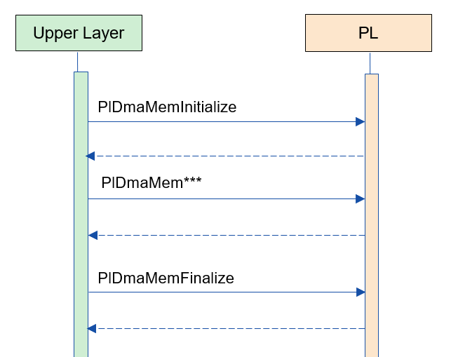
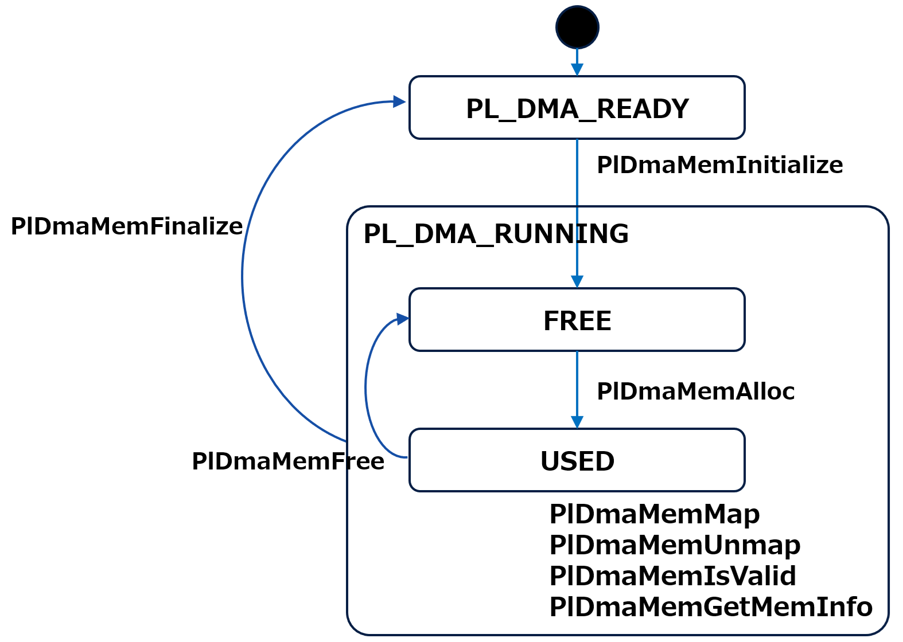
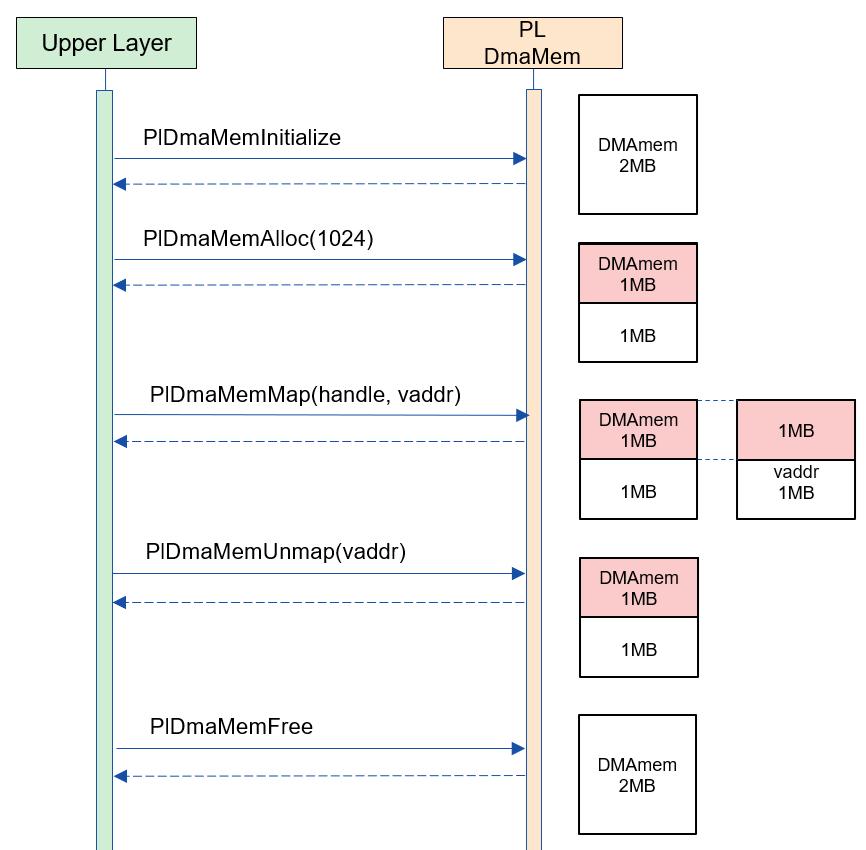

= PL DmaMemory (LLM Translation)
:sectnums:
:sectnumlevels: 3
:chapter-label:
:revnumber: 0.0.2
:toc: left
:toc-title: Table of Contents
:toclevels: 3
:lang: en
:xrefstyle: short
:figure-caption: Figure
:table-caption: Table
:section-refsig:
:experimental:

== Purpose and Scope

This document describes the specifications of PL DmaMemory.
The purpose of PL DmaMemory is to provide access methods to DmaMemory, which has different address regions depending on the camera.

<<<

== Terminology

[#_words]
.Term List
[options="header"]
|===
|Term |Description

|PL
|Porting Layer. A layer that absorbs differences in camera/OS

|I/F
|Interface
|===

<<<

== Component Description

The purpose of PL DmaMemory is to provide access methods to DmaMemory, which has different address regions depending on the camera.

=== Component Overview

The following software architecture diagram shows the structure centered on this block.

.Overview Diagram
image::./images/dmamem_layer.png[scaledwidth="100%",align="center"]

<<<

=== Detailed Component Description

The following shows an example usage sequence of PL DmaMemory.

[#_button_seq]
.Sequence Overview

==== Dependent Blocks (For PL Internal Use)
.Dependent Blocks
[width="100%",options="header"]
|===
|Block Name |Usage |Link
|-
|-
|-
|===

<<<

=== State Transitions
The possible states of PL DmaMemory are shown in <<#_TableStates>>.

[#_TableStates]
.State List
[width="100%", cols="20%,80%",options="header"]
|===
|State |Description
|PL_DMA_READY
|PL DmaMemory is uninitialized

|PL_DMA_RUNNING
|PL DmaMemory is initialized

|FREE
|Memory has never been allocated by PlDmaMemAlloc, or the handle has been freed.

|USED
|Memory has been allocated by PlDmaMemAlloc at least once and has not been freed by PlDmaMemFree.
|===

PL DmaMemory performs the state transitions shown in <<#_FigureState>>. +
Additionally, if an error occurs in any API, no state transitions will occur. +

[#_FigureState]
.State Transition Diagram

The acceptability of API calls and the resulting states after each API execution are shown in <<#_TableStateTransition>>. The state names in the table represent the state after the API execution is complete, indicating that the API can be called. +
× indicates that the API cannot be accepted, and calling the API in this state will return an error without any state transition.

[#_TableStateTransition]
.State Transition Table
[width="100%", cols="10%,20%,20%,20%,20%"]
|===
2.3+| 3+|State
.2+|PL_DMA_READY
2+|PL_DMA_RUNNING
|FREE
|USED
.20+|API Name

|``**PlDmaMemInitialize**``
|PL_DMA_RUNNING
|×
|×

|``**PlDmaMemFinalize**``
|×
|PL_DMA_READY
|PL_DMA_READY

|``**PlDmaMemAlloc**``
|×
|USED
|USED

|``**PlDmaMemFree**``
|×
|×
|FREE or USED

|``**PlDmaMemMap**``
|×
|×
|USED

|``**PlDmaMemUnmap**``
|×
|×
|USED

|``**PlDmaMemIsValid**``
|×
|FREE
|USED

|``**PlDmaMemGetMemInfo**``
|×
|FREE
|USED
|===

=== Function List of Components
The list of functions is shown in <<#_TableFunction>>.

[#_TableFunction]
.Function List
[width="100%", cols="30%,55%,15%",options="header"]
|===
|Function Name |Overview  |Section Number
|Allocate/Free Physical Memory in DmaMem Area
|Allocates/Frees physical memory in the DmaMem area.
|<<#_Function1, 3.5.1.>>

|Map/Unmap Virtual Memory to/from Physical Memory in DmaMem Area
|Maps/Unmaps virtual memory to/from physical memory in the DmaMem area.
|<<#_Function2, 3.5.2.>>

|Validate Physical Memory Handle
|Checks if the physical memory handle is valid.
|<<#_Function3, 3.5.3.>>

|Get DmaMem Area Information
|Retrieves information such as the free space in the DmaMem area.
|<<#_Function4, 3.5.4.>>
|===

<<<

=== Function Descriptions of Components
[#_Function1]
==== Allocate/Free Physical Memory in DmaMem Area
Function Overview::
Allocates/Frees physical memory in the DmaMem area.
Prerequisites::
PlDmaMemInitialize must be executed.
Detailed Functionality::
For more details, see <<#_PlDmaMemAlloc, PlDmaMemAlloc>>, <<#_PlDmaMemFree, PlDmaMemFree>>.
Detailed Behavior::
For more details, see <<#_PlDmaMemAlloc, PlDmaMemAlloc>>, <<#_PlDmaMemFree, PlDmaMemFree>>.
Error Behavior and Recovery Method::
For more details, see <<#_PlDmaMemAlloc, PlDmaMemAlloc>>, <<#_PlDmaMemFree, PlDmaMemFree>>.
Considerations::
None.

[#_Function2]
==== Map/Unmap Virtual Memory to/from Physical Memory in DmaMem Area
Function Overview::
Maps/Unmaps virtual memory to/from physical memory in the DmaMem area.
Prerequisites::
PlDmaMemInitialize must be executed.
Detailed Functionality::
For more details, see <<#_PlDmaMemMap, PlDmaMemMap>>, <<#_PlDmaMemUnmap, PlDmaMemUnmap>>.
Detailed Behavior::
For more details, see <<#_PlDmaMemMap, PlDmaMemMap>>, <<#_PlDmaMemUnmap, PlDmaMemUnmap>>.
Error Behavior and Recovery Method::
For more details, see <<#_PlDmaMemMap, PlDmaMemMap>>, <<#_PlDmaMemUnmap, PlDmaMemUnmap>>.
Considerations::
None.

[#_Function3]
==== Validate Physical Memory Handle
Function Overview::
Checks if the physical memory handle is valid.
Prerequisites::
PlDmaMemInitialize must be executed.
Detailed Functionality::
For more details, see <<#_PlDmaMemIsValid, PlDmaMemIsValid>>.
Detailed Behavior::
For more details, see <<#_PlDmaMemIsValid, PlDmaMemIsValid>>.
Error Behavior and Recovery Method::
For more details, see <<#_PlDmaMemIsValid, PlDmaMemIsValid>>.
Considerations::
None.

[#_Function4]
==== Get DmaMem Area Information
Function Overview::
Retrieves the number of segments, free space, and other information about the DmaMem area.
Prerequisites::
PlDmaMemInitialize must be executed.
Detailed Functionality::
For more details, see <<#_PlDmaMemGetMeminfo, PlDmaMemGetMeminfo>>.
Detailed Behavior::
For more details, see <<#_PlDmaMemGetMeminfo, PlDmaMemGetMeminfo>>.
Error Behavior and Recovery Method::
For more details, see <<#_PlDmaMemGetMeminfo, PlDmaMemGetMeminfo>>.
Considerations::
None.

=== List of Non-Functional Requirements of Components

The list of non-functional requirements is shown in <<#_TableNonFunction>>.

[#_TableNonFunction]
.Non-Functional Requirements List
[width="100%", cols="90%,10%",options="header"]
|===
|Function Name |Section Number
|Maximum Stack Usage
|<<#_NonFunctionStack, 3.7.>>

|Maximum Heap Usage
|<<#_NonFunctionHeap, 3.7.>>

|Static Data Usage
|<<#_NonFunctionStatic, 3.7.>>

|Performance
|<<_NonFunctionPerformance, 3.7.>>
|===

=== Explanation of Non-Functional Requirements of Components

[#_NonFunctionStack]
==== Maximum Stack Usage
1 KB (tentative)

[#_NonFunctionHeap]
==== Maximum Heap Usage
1 KB (tentative)

[#_NonFunctionStatic]
==== Maximum Static Heap Usage
1 KB (tentative)

[#_NonFunctionPerformance]
==== Performance
Under 1 ms

<<<

== API Specifications
=== List of Definitions
==== Data Type List
The list of data types is shown in <<#_TableDataType>>.

[#_TableDataType]
.Data Type List
[width="100%", cols="30%,55%,15%",options="header"]
|===
|Data Type Name |Overview  |Section Number
|enum PlErrCode
|An enumeration type that defines the execution result of the API.
|<<#_PlErrCode, 4.3.1.>>

|PlDmaMemHandle
|A structure representing the physical memory handle in the DmaMem area.
|<<#_PlDmaMemHandle, 4.3.2.>>

|PlDmaMemInfo
|A structure representing the information of the DmaMem area.
|<<#_PlDmaMemInfo, 4.3.3.>>
|===

==== API List
The list of APIs directly usable from the upper application is shown in <<#_TablePublicAPI>>.

[#_TablePublicAPI]
.API List Directly Usable from the Upper Application
[width="100%", cols="10%,60%,20%",options="header"]
|===
|API Name |Overview |Section Number
|PlDmaMemInitialize
|Initializes this module.
|<<#_PlDmaMemInitialize, 4.4.1.>>

|PlDmaMemFinalize
|Terminates this module.
|<<#_PlDmaMemFinalize, 4.4.2.>>

|PlDmaMemAlloc
|Allocates physical memory in the DmaMem area.
|<<#_PlDmaMemAlloc, 4.4.3.>>

|PlDmaMemFree
|Frees physical memory in the DmaMem area.
|<<#_PlDmaMemFree, 4.4.4.>>

|PlDmaMemMap
|Maps virtual memory to the physical memory in the DmaMem area.
|<<#_PlDmaMemMap, 4.4.5.>>

|PlDmaMemUnmap
|Unmaps virtual memory from the physical memory in the DmaMem area.
|<<#_PlDmaMemUnmap, 4.4.6.>>

|PlDmaMemIsValid
|Checks if the physical memory handle is valid.
|<<#_PlDmaMemIsValid, 4.4.7.>>

|PlDmaMemGetMemInfo
|Retrieves the number of segments, free space, and other information about the DmaMem area.
|<<#_PlDmaMemGetMemInfo, 4.4.8.>>
|===

<<<

=== Build Configuration
[#_BuildConfig]
==== ESP32S3

* *Format* +
[source, C]
....
CONFIG_ESP32S3_SPIRAM_DMA_SIZE=2097152
....

[#_BuildConfig_table]
.Description of BuildConfig
[width="100%", cols="30%,70%",options="header"]
|===
|Member Name  |Description
|CONFIG_ESP32S3_SPIRAM_DMA_SIZE
|The total size of the DmaMem area.
|===

=== Data Type Definitions
[#_PlErrCode]
==== PlErrCode
An enumeration type that defines the execution result of the API.
(T.B.D.)

[#_PlDmaMemHandle]
==== PlDmaMemHandle
A structure representing the physical memory handle in the DmaMem area.

* *Format* +
[source, C]
....
typedef void* PlDmaMemHandle;
....

[#_PlDmaMemInfo]
==== PlDmaMemInfo
A structure representing the information of the DmaMem area.

* *Format* +
[source, C]
....
typedef struct {
  uint32_t total_bytes;
  uint32_t used_bytes;
  uint32_t free_bytes;
  uint32_t free_linear_bytes;
} PlDmaMemInfo;
....

* *Values*

.Description of PlDmaMemInfo Values
[width="100%", cols="30%,70%",options="header"]
|===
|Member Name  |Description
|total_bytes
|Represents the total size of the DmaMem area (in bytes).
|used_bytes
|Represents the used size of the DmaMem area (in bytes).
|free_bytes
|Represents the free size of the DmaMem area (in bytes).
|free_linear_bytes
|Represents the maximum continuous free size in the DmaMem area (in bytes).
|===

=== API Descriptions

[#_PlDmaMemInitialize]
==== PlDmaMemInitialize
* *Function* +
Performs the initialization process related to PL DmaMemory.

* *Format* +
[source, C]
....
PlErrCode  PlDmaMemInitialize(void)
....

* *Argument Description* +
-

* *Return Value* +
Returns one of the values of PlErrCode depending on the execution result.

* *Description* +
** Performs the initialization process related to PL DmaMemory.

.API Detailed Information
[width="100%", cols="30%,70%",options="header"]
|===
|API Detailed Information  |Description
|API Type
|Synchronous API
|Execution Context
|Operates in the caller's context
|Simultaneous Invocation
|Possible
|Invocation from Multiple Threads
|Possible
|Invocation from Multiple Tasks
|Possible
|Does the API block internally?
|Yes.
|===

.Error Information
[options="header"]
|===
|Error Code |Cause |State of OUT Argument |System State after Error |Recovery Method
|kPlErrInvalidState (tentative)
|Already in available state.
|-
|No impact
|Not required

|kPlErrLock/kPlErrUnlock (tentative)
|Blocking error
|-
|No impact
|Not required

|===

<<<

[#_PlDmaMemFinalize]
==== PlDmaMemFinalize
* *Function* +
Performs the termination process related to PL DmaMemory.

* *Format* +
[source, C]
....
PlErrCode  PlDmaMemFinalize(void)
....

* *Argument Description* +
-

* *Return Value* +
Returns one of the values of PlErrCode depending on the execution result.

* *Description* +
** Performs the termination process related to PL DmaMemory.

.API Detailed Information
[width="100%", cols="30%,70%",options="header"]
|===
|API Detailed Information  |Description
|API Type
|Synchronous API
|Execution Context
|Operates in the caller's context
|Simultaneous Invocation
|Possible
|Invocation from Multiple Threads
|Possible
|Invocation from Multiple Tasks
|Possible
|Does the API block internally?
|Yes.
|===

.Error Information
[options="header"]
|===
|Error Code |Cause |State of OUT Argument |System State after Error |Recovery Method
|kPlErrInvalidState (tentative)
|Already in PL_DMA_READY state.
|-
|No impact
|Not required

|kPlErrLock/kPlErrUnlock (tentative)
|Blocking error
|-
|No impact
|Not required
|===

<<<

[#_PlDmaMemAlloc]
==== PlDmaMemAlloc

* *Function* +
Allocates physical memory in the DmaMem area.

* *Format* +
[source, C]
....
PlDmaMemHandle PlDmaMemAlloc(uint32_t size)
....

* *Argument Description* +
**[IN] uint32_t size**:: 
** The size of the DmaMem area to allocate (in bytes).
** If there is no free space in the DmaMem area, it returns an error.

* *Return Value* +
If memory is successfully allocated, it returns the memory address. +
If memory cannot be allocated, it returns NULL.

* *Description* +
** Allocates physical memory in the DmaMem area.
** This API is available after PlDmaMemInitialize is executed.

.API Detailed Information
[width="100%", cols="30%,70%",options="header"]
|===
|API Detailed Information  |Description
|API Type
|Synchronous API
|Execution Context
|Operates in the caller's context
|Simultaneous Invocation
|Possible
|Invocation from Multiple Threads
|Possible
|Invocation from Multiple Tasks
|Possible
|Does the API block internally?
|Yes.
|===

.Error Information
[options="header"]
|===
|Error Code |Cause |State of OUT Argument |System State after Error |Recovery Method
|NULL
|Memory cannot be allocated
|-
|No impact
|Not required
|===

<<<

[#_PlDmaMemFree]
==== PlDmaMemFree

* *Function* +
Frees physical memory in the DmaMem area.

* *Format* +
[source, C]
....
PlErrCode  PlDmaMemFree(const PlDmaMemHandle handle)
....

* *Argument Description* +
**[IN] const PlDmaMemHandle handle**::
Handle of the physical memory to be freed.

* *Return Value* +
Returns one of the values of PlErrCode depending on the execution result.

* *Description* +
** Frees physical memory in the DmaMem area.
** Returns an error if the handle is invalid.
** Returns an error if the handle is NULL.
** Returns an error if the handle is mapped by PlDmaMemMap.
*** Unmap before calling Free.

.API Detailed Information
[width="100%", cols="30%,70%",options="header"]
|===
|API Detailed Information  |Description
|API Type
|Synchronous API
|Execution Context
|Operates in the caller's context
|Simultaneous Invocation
|Possible
|Invocation from Multiple Threads
|Possible
|Invocation from Multiple Tasks
|Possible
|Does the API block internally?
|Yes.
|===

.Error Information
[options="header"]
|===
|Error Code |Cause |State of OUT Argument |System State after Error |Recovery Method
|PlErrInvalidState (tentative)
|PlDmaMemInitialize has not been executed
|-
|No impact
|Not required

|PlErrInvalidParam (tentative)
|Parameter error
|-
|No impact
|Not required

|kPlErrLock/kPlErrUnlock (tentative)
|Blocking error
|-
|No impact
|Not required
|===

[#_PlDmaMemMap]
==== PlDmaMemMap
* *Function* +
Maps virtual memory to the physical memory in the DmaMem area.

* *Format* +
[source, C]
....
PlErrCode  PlDmaMemMap(const PlDmaMemHandle handle, void **vaddr)
....

* *Argument Description* +
**[IN] const PlDmaMemHandle handle**::
Handle of the physical memory to map.

**[OUT] void {asterisk}{asterisk}vaddr**::
Virtual memory to map the DmaMem area to.

* *Return Value* +
Returns one of the values of PlErrCode depending on the execution result.

* *Description* +
** Maps virtual memory to the physical memory in the DmaMem area.
** Returns an error if the handle is NULL.
** Returns an error if the handle is invalid.
** Returns an error if vaddr is NULL.

.API Detailed Information
[width="100%", cols="30%,70%",options="header"]
|===
|API Detailed Information  |Description
|API Type
|Synchronous API
|Execution Context
|Operates in the caller's context
|Simultaneous Invocation
|Possible
|Invocation from Multiple Threads
|Possible
|Invocation from Multiple Tasks
|Possible
|Does the API block internally?
|Yes.
|===

.Error Information
[options="header"]
|===
|Error Code |Cause |State of OUT Argument |System State after Error |Recovery Method
|PlErrInvalidState (tentative)
|PlDmaMemInitialize has not been executed
|-
|No impact
|Not required

|PlErrInvalidParam (tentative)
|Parameter error
|-
|No impact
|Not required

|kPlErrLock/kPlErrUnlock (tentative)
|Blocking error
|-
|No impact
|===

<<<

[#_PlDmaMemUnmap]
==== PlDmaMemUnmap
* *Function* +
Unmaps virtual memory from the physical memory in the DmaMem area.

* *Format* +
[source, C]
....
PlErrCode  PlDmaMemUnmap(const void *vaddr)
....

* *Argument Description* +
**[IN] const void *vaddr**::
Virtual memory to unmap.

* *Return Value* +
Returns one of the values of PlErrCode depending on the execution result.

* *Description* +
** Unmaps virtual memory from the physical memory in the DmaMem area.
** Returns an error if vaddr is NULL.

.API Detailed Information
[width="100%", cols="30%,70%",options="header"]
|===
|API Detailed Information  |Description
|API Type
|Synchronous API
|Execution Context
|Operates in the caller's context
|Simultaneous Invocation
|Possible
|Invocation from Multiple Threads
|Possible
|Invocation from Multiple Tasks
|Possible
|Does the API block internally?
|Yes.
|===

.Error Information
[options="header"]
|===
|Error Code |Cause |State of OUT Argument |System State after Error |Recovery Method
|PlErrInvalidState (tentative)
|PlDmaMemInitialize has not been executed
|-
|No impact
|Not required

|PlErrInvalidParam (tentative)
|Parameter error
|-
|No impact
|Not required

|kPlErrLock/kPlErrUnlock (tentative)
|Blocking error
|-
|No impact
|===

<<<

[#_PlDmaMemIsValid]
==== PlDmaMemIsValid
* *Function* +
Checks if the physical memory handle is valid.

* *Format* +
[source, C]
....
bool PlDmaMemIsValid(const PlDmaMemHandle handle)
....

* *Argument Description* +
**[IN] const PlDmaMemHandle handle**::
Handle to check for validity.

* *Return Value* +
** Returns true if the handle is valid.
** Returns false if the handle is invalid.
** Returns false if the handle is NULL.

* *Description* +
** Checks if the physical memory handle is valid.

.API Detailed Information
[width="100%", cols="30%,70%",options="header"]
|===
|API Detailed Information  |Description
|API Type
|Synchronous API
|Execution Context
|Operates in the caller's context
|Simultaneous Invocation
|Possible
|Invocation from Multiple Threads
|Possible
|Invocation from Multiple Tasks
|Possible
|Does the API block internally?
|Yes.
|===

.Error Information
[options="header"]
|===
|Error Code |Cause |State of OUT Argument |System State after Error |Recovery Method
|true/false
|Returns true if the handle is valid. Returns false if the handle is invalid.
|-
|No impact
|Not required
|===

<<<

[#_PlDmaMemGetMemInfo]
==== PlDmaMemGetMemInfo
* *Function* +
Retrieves the number of segments, free space, and other information about the DmaMem area.

* *Format* +
[source, C]
....
PlErrCode  PlDmaMemGetMemInfo(PlDmaMemInfo *info)
....

* *Argument Description* +
**[OUT] PlDmaMemInfo *info**::
Destination for storing DmaMem area information.

* *Return Value* +
Returns one of the values of PlErrCode depending on the execution result.

* *Description* +
** Retrieves information such as the free space of the DmaMem area at the time the API is called.
** Returns an error if info is NULL.

.API Detailed Information
[width="100%", cols="30%,70%",options="header"]
|===
|API Detailed Information  |Description
|API Type
|Synchronous API
|Execution Context
|Operates in the caller's context
|Simultaneous Invocation
|Possible
|Invocation from Multiple Threads
|Possible
|Invocation from Multiple Tasks
|Possible
|Does the API block internally?
|Yes.
|===

.Error Information
[options="header"]
|===
|Error Code |Cause |State of OUT Argument |System State after Error |Recovery Method
|PlErrInvalidState (tentative)
|PlDmaMemInitialize has not been executed
|-
|No impact
|Not required

|PlErrInvalidParam (tentative)
|Parameter error
|-
|No impact
|Not required

|kPlErrLock/kPlErrUnlock (tentative)
|Blocking error
|-
|No impact
|===

<<<

== API Call Examples
=== Example of Alloc to Free
.Example Sequence from Alloc to Free

== Special Notes and Component-Specific Explanations

== List of OSS in Use
None

<<<

== References

<<<

== Revision History
[width="100%", cols="20%,80%",options="header"]
|===
|Version |Changes
|0.0.1
|Initial version

|0.0.2
|- Overall: Added half-width spaces before and after English words (for better readability) +
- Terminology: Removed OSAL, added PL +
- Changed OSAL (Osal) description to PL (Pl) +
- Changed OSAL_READY/OSAL_RUNNING to PL_DMA_READY/PL_DMA_RUNNING +
- Added PlErrCode to data types +
- Moved PlDmaMemInitialize/PlDmaMemFinalize APIs to the beginning +
- Added error codes to PlDmaMemInitialize API +
- Added error codes to PlDmaMemFinalize API +
- Changed error codes in PlDmaMemAlloc API +
- Added error codes to PlDmaMemFree API +
- Added error codes to PlDmaMemMap API +
- Added error codes to PlDmaMemUnmap API +
- Added error codes to PlDmaMemIsValid API +
- Added error codes to PlDmaMemGetMemInfo API +
- Changed figures (*.png) to English notation
|===
