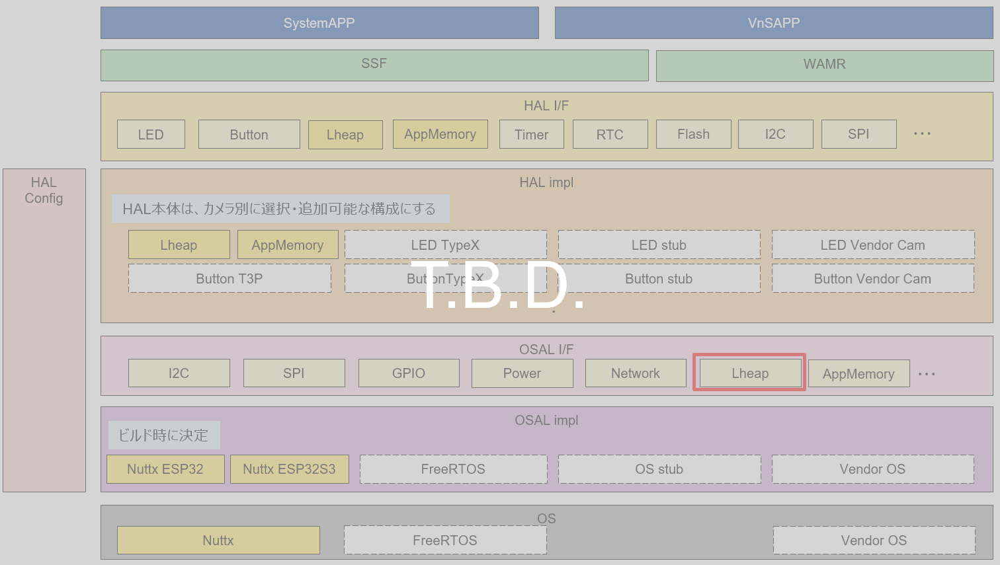
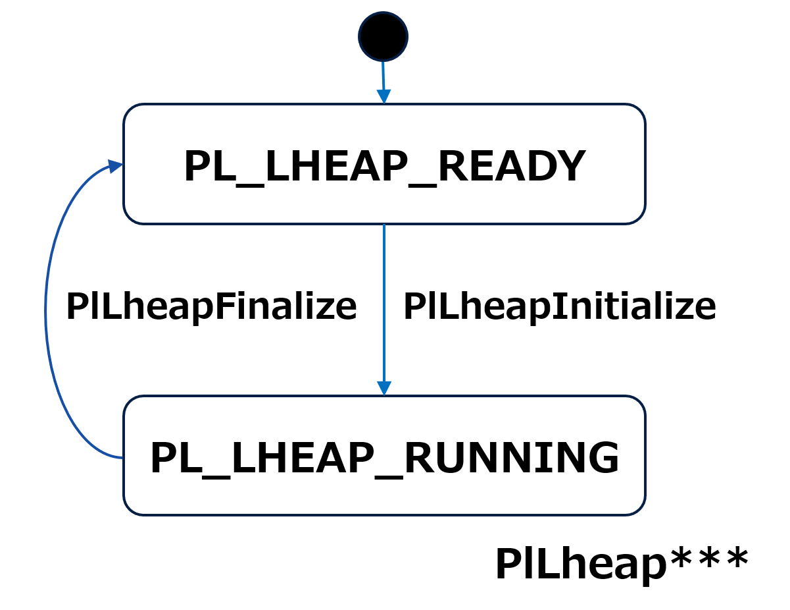
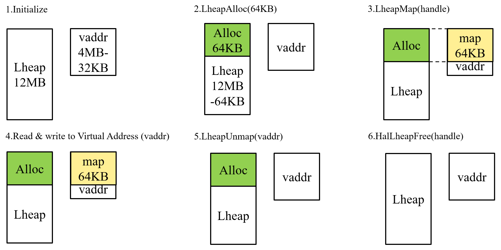
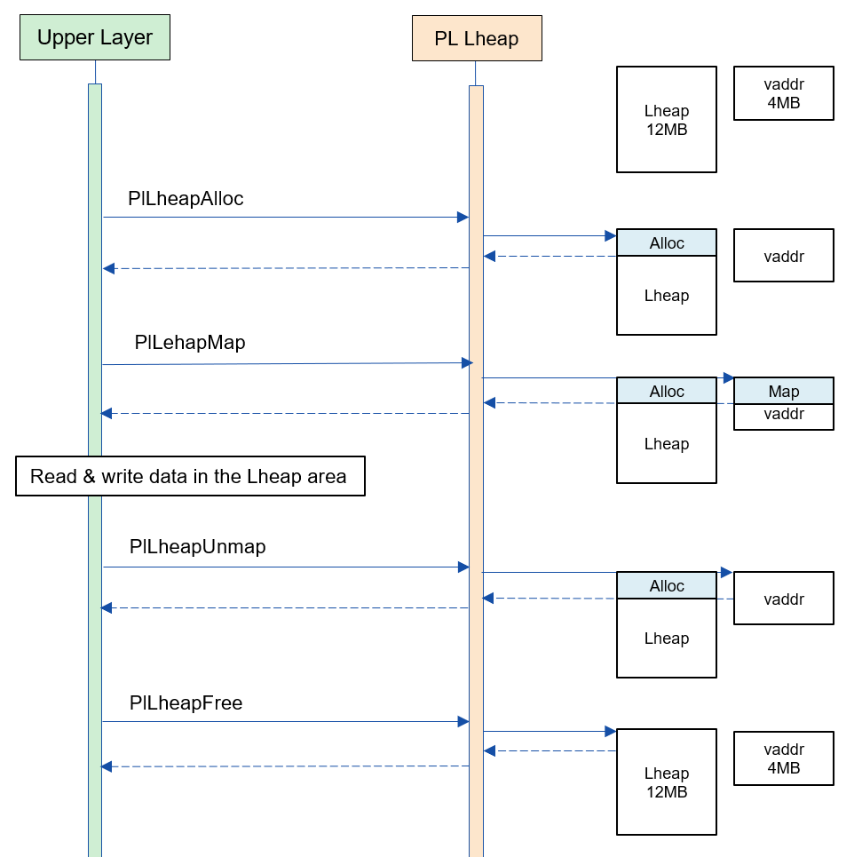
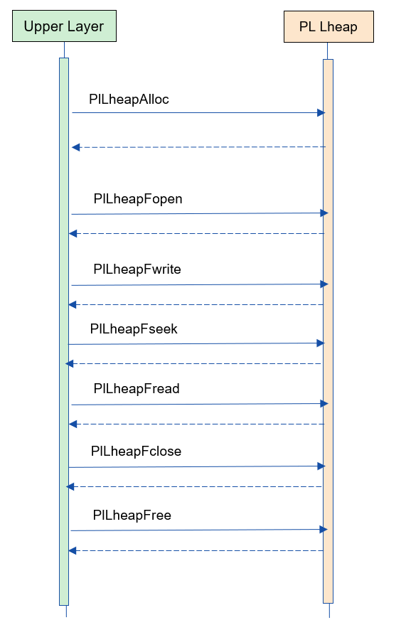

= PL Lheap
:sectnums:
:sectnumlevels: 3
:chapter-label:
:revnumber: 0.0.4
:toc: left
:toc-title: 目次
:toclevels: 3
:lang: ja
:xrefstyle: short
:figure-caption: Figure
:table-caption: Table
:section-refsig:
:experimental:

<<<

== 目的と適用範囲

本書では AITRIOS PL の impl レイヤーの一つである、Memory impl の <<#_words, Lheap 領域>> の仕様について記載します。 +
Lheap 領域の用途は主に連続した大きいメモリへアクセス時などです。 +
したがって PL Lheap の目的は、SoC やメモリ容量などによる I/F の差分を吸収して上位レイヤーに大きなメモリへのアクセス手段を提供することです。

<<<

== 用語

[#_words]
.用語一覧
[options="header"]
|===
|用語 |説明 

|himem
|high memory

|VnS APP
|Vision and Sensing Application

|WAMR
|Web Assembly Micro Runtime

|Lheap 領域
|Large Heap +
 連続した大きいメモリが必要な用途において、
 ユースケース毎にメモリを解放することで、
 メモリ断片化の影響を受けなくする (または軽減する) 目的のメモリ領域。 +
 AITRIOS では主にメモリサイズは 64 KB 以上を使う、
 Streaming データや OTA などを想定している。

|===

<<<

== コンポーネントの説明

=== コンポーネントの概要

以下に本ブロックを中心としたソフトウェア構成図を示します。

.概要図

<<<

=== コンポーネントの詳細説明

<<<

=== 状態遷移
Lheap の取り得る状態を <<#_TableStates, Table 2>> に示します。

[#_TableStates]
.状態一覧
[width="100%", cols="20%,80%",options="header"]
|===
|状態 |説明 

|PL_LHEAP_READY
 kPlLheapReady
|PL Lheap 初期状態。

|PL_LHEAP_RUNNING
 kPlLheapRunning
|PL Lheap 実行可能状態。
|===

Lheap では <<#_FIGURE_STATE>> に示す状態遷移を行います。 +
また、各 API でエラーが発生した場合には状態遷移は起こりません。 +

[#_FIGURE_STATE]
.状態遷移図

各状態での API 受け付け可否と状態遷移先を <<#_TABLE_STATE_TRANSITION>> に示します。 +
表中の状態名は、API 実行完了後の遷移先状態を示し、すなわち API 呼び出し可能であることを示します。 +
× は API 受け付け不可を示し、ここでの API 呼び出しはエラーを返し状態遷移は起きません。 +
エラーの詳細は <<#_PlErrCode>> を参照してください。 +
〇 は API 受け付け可能を示し、この場合は状態遷移が発生しません。 +

[#_TABLE_STATE_TRANSITION]
.状態遷移表
[width="100%", cols="10%,30%,30%,30%"]
|===
2.2+| 2+|状態 
|PL_LHEAP_READY |PL_LHEAP_RUNNING 
.9+|API 名

|``**PlLheapInitialize**``  |PL_LHEAP_RUNNING |×
|``**PlLheapFinalize**``    |×       |PL_LHEAP_READY
|``**PlLheapAlloc**``       |×       |〇
|``**PlLheapFree**``        |×       |〇
|``**PlLheapMap**``         |×       |〇
|``**PlLheapUnmap**``       |×       |〇
|``**PlLheapPwrite**``      |×       |〇
|``**PlLheapGetMeminfo**``  |×       |〇
|``**PlLheapIsValid**``     |×       |〇

|===

<<<

=== コンポーネントの機能一覧
<<#_TableFunction>> に機能の一覧を示します。

[#_TableFunction]
.機能一覧
[width="100%", cols="30%,55%,15%",options="header"]
|===
|機能名 |概要  |節番号

|PL Lheap の初期化/終了
|PL Lheap 機能を初期化/終了します。
|<<#_Function1, 3.6.1.>>

|Lheap 領域の物理メモリ領域の確保/解放
|Lheap 領域の物理メモリ領域を確保/解放します。
|<<#_Function2, 3.6.2.>>

|Lheap 領域の物理メモリ領域に仮想メモリ領域を割り当て/解除
|Lheap 領域の物理メモリ領域に仮想メモリ領域を割り当て/解除します。
|<<#_Function3, 3.6.3.>>

|確保している物理メモリが有効かどうかの判断
|確保している物理メモリ領域が有効であるかを判断します。
|<<#_Function4, 3.6.4.>>

|Lheap 領域の物理メモリ領域へのデータの読み書き
|確保した Lheap 領域の物理メモリの位置にデータを読み書きします。
|<<#_Function5, 3.6.5.>>

|Lheap 領域のメモリ情報の提供
|Lheap 領域のメモリ情報を提供します
|<<#_Function6, 3.6.7.>>

|Map機能をサポートしているかどうかの判断
|Map機能に関係するAPI（PlLheapMap, PlLheapUnmap, PlLheapPwirte）が使用可能かどうか判断できます。
|<<#_Function7, 3.6.8.>>

|===

<<<

=== コンポーネントの機能説明
[#_Function1]
==== PL Lheap 機能の初期化/終了
機能概要::
PL Lheap の機能を初期化/終了します。 +
初期化によって PL Lheap の各種 API が使用可能になります。
前提条件::
なし。
機能詳細::
なし。
詳細挙動::
詳細は <<#_PlLheapInitialize>>、<<#_PlLheapFinalize>> を参照してください。
エラー時の挙動、復帰方法::
詳細は <<#_PlLheapInitialize>>、<<#_PlLheapFinalize>> を参照してください。
検討事項::
なし

[#_Function2]
==== Lheap 領域の物理メモリ領域の確保/解放
機能概要::
Lheap 領域の物理メモリ領域を確保/解放します。
前提条件::
PlLheapInitializeが実行済みであること。
機能詳細::
なし。
詳細挙動::
詳細は <<#_PlLheapAlloc>>、<<#_PlLheapFree>> を参照してください。
エラー時の挙動、復帰方法::
詳細は <<#_PlLheapAlloc>>、<<#_PlLheapFree>> を参照してください。
検討事項::
なし

[#_Function3]
==== Lheap 領域の物理メモリ領域に仮想メモリ領域を割り当て/解除
機能概要::
本モジュールから確保した Lheap 領域の物理メモリ領域に対して、
仮想メモリ領域の割り当て/解除を行います。 +
前提条件::
PlLheapInitializeが実行済みであること。
機能詳細::
なし。
詳細挙動::
詳細は <<#_PlLheapMap>>、<<#_PlLheapUnmap>> を参照してください。
エラー時の挙動、復帰方法::
詳細は <<#_PlLheapMap>>、<<#_PlLheapUnmap>> を参照してください。
検討事項::
なし

[#_Function4]
==== 確保している物理メモリ領域が有効な Lheap 領域であるかをチェック
機能概要::
確保している物理メモリが有効な Lheap 領域であるかをチェックします
前提条件::
なし。
機能詳細::
なし。
詳細挙動::
詳細は <<#_PlLheapIsValid>> を参照してください。
エラー時の挙動、復帰方法::
詳細は <<#_PlLheapIsValid>> を参照してください。
検討事項::
なし

[#_Function5]
==== Lheap 領域の物理メモリ領域へのデータの読み書き
機能概要::
Lheap 領域へデータを読み書きします。
前提条件::
PlLheapInitializeが実行済みであること。
機能詳細::
なし。
詳細挙動::
詳細は <<#_PlLheapPwrite, PlLheapPwrite>>,
<<#_PlLheapFopen, PlLheapFopen>>,
<<#_PlLheapFopen, PlLheapFclose>>,
<<#_PlLheapFopen, PlLheapFwrite>>,
<<#_PlLheapFopen, PlLheapFread>>,
<<#_PlLheapFopen, PlLheapFseek>>,
を参照してください。
エラー時の挙動、復帰方法::
詳細は <<#_PlLheapPwrite, PlLheapPwrite>>,
<<#_PlLheapFopen, PlLheapFopen>>,
<<#_PlLheapFopen, PlLheapFclose>>,
<<#_PlLheapFopen, PlLheapFwrite>>,
<<#_PlLheapFopen, PlLheapFread>>,
<<#_PlLheapFopen, PlLheapFseek>>,
を参照してください。
検討事項::
なし

[#_Function6]
==== Lheap 領域のメモリ情報の提供
機能概要::
Lheap 領域のメモリ情報を提供します
前提条件::
PlLheapInitializeが実行済みであること。
機能詳細::
なし。
詳細挙動::
詳細は <<#_PlLheapGetMeminfo>> を参照してください。
エラー時の挙動、復帰方法::
詳細は <<#_PlLheapGetMeminfo>> を参照してください。
検討事項::
なし

[#_Function7]
==== Map機能をサポートしているかどうかの判断
機能概要::
Map機能に関係するAPI（PlLheapMap, PlLheapUnmap, PlLheapPwirte）が使用可能かどうか判断できます。
前提条件::
PlLheapInitializeが実行済みであること。
機能詳細::
なし。
詳細挙動::
詳細は <<#_PlLheapIsMapSupport, PlLheapIsMapSupport>> を参照してください。
エラー時の挙動、復帰方法::
詳細は <<#_PlLheapIsMapSupport, PlLheapIsMapSupport>> を参照してください。
検討事項::
なし

=== コンポーネントの非機能要件一覧

<<#_TableNonFunction>> に非機能要件の一覧を示します。

[#_TableNonFunction]
.非機能要件一覧
[width="100%", cols="30%,55%,15%",options="header"]
|===
|機能名 |概要  |節番号
|Stack 最大使用量
|コンポーネント内で消費されるスタック使用量。
|<<#_NonFunctionStack, 3.7.>>

|通常ヒープ最大使用量
|コンポーネント内で消費される通常ヒープ使用量。
|<<#_NonFunctionHeap, 3.7.>>

|static データ最大使用量
|コンポーネント内で消費される static データ使用量。
|<<#_NonFunctionStatic, 3.7.>>

|パフォーマンス
|各 API のパフォーマンス。
|<<_NonFunctionPerformance, 3.7.>>
|===

=== コンポーネントの非機能要件説明
本コンポーネントの非機能要件を以下に示します。

[#_NonFunctionStack]
==== Stack 最大使用量
128 Byte

[#_NonFunctionHeap]
==== 通常ヒープ最大使用量
PlLheapAlloc 1 回につき、80 Byte 使用

[#_NonFunctionStatic]
==== static データ最大使用量
128 Byte

[#_NonFunctionPerformance]
==== パフォーマンス
すべての API は 1 ms 未満で動作します。

<<<

== API 仕様
=== 定義一覧
==== データ型一覧
<<#_TableDataType>> を以下に示します。

[#_TableDataType]
.データ型一覧
[width="100%", cols="30%,55%,15%",options="header"]
|===
|データ型名 |概要  |節番号
|enum PlErrCode | API の実行結果を定義する列挙体です。 |<<#_PlErrCode, 4.2.1.>>
|PlLheapHandle |メモリにアクセスするためのハンドルです。 |<<#_PlLheapHandle, 4.2.2.>>
|struct PlLheapMeminfo |Lheap 領域のメモリ情報の構造体です。 |<<#_PlLheapMeminfo, 4.2.3.>>

|===

==== API 一覧
<<#_TablePublicAPI>> を以下に示します。

[#_TablePublicAPI]
.各 API 一覧
[width="100%", cols="10%,60%,20%",options="header"]
|===
|API 名 |概要 |節番号
|PlLheapInitialize
|Pl Lheap 機能を初期化します。
|<<#_PlLheapInitialize, 4.3.1.>>

|PlLheapFinalize
|Pl Lheap 機能を終了します。
|<<#_PlLheapFinalize, 4.3.2.>>

|PlLheapAlloc
|Lheap 領域のメモリにアクセスするためのハンドルを確保します。
|<<#_PlLheapAlloc, 4.3.3.>>

|PlLheapFree
|確保した Lheap 領域のメモリを解放します。
|<<#_PlLheapFree, 4.3.4.>>

|PlLheapMap
|map を行いハンドルで指定されたメモリにアクセス可能なポインタを作成します。
|<<#_PlLheapMap, 4.3.5.>>

|PlLheapUnmap
|Lheap 領域から確保したメモリブロックの map を解除する。
|<<#_PlLheapUnmap, 4.3.6.>>

|PlLheapPwrite
|バッファを Lheap 領域に書き込みます。
|<<#_PlLheapPwrite, 4.3.7.>>

|PlLheapGetMeminfo
|Lheap 領域のメモリの情報を取得します。
|<<#_PlLheapGetMeminfo, 4.3.8.>>

|PlLheapIsValid
|有効な Lheap 領域のハンドルかどうかを判定します。
|<<#_PlLheapIsValid, 4.3.9.>>

|PlLheapIsMapSupport
|Map機能に関係するAPI（PlLheapMap, PlLheapUnmap, PlLheapPwirte）が使用可能かどうか判断できます。
|<<#_PlLheapIsMapSupport, 4.3.10.>>

|PlLheapFopen
|LheapへFileIOアクセスするためのディスクリプタをオープンします。
|<<#_PlLheapFopen, 4.3.11.>>

|PlLheapFclose
|LheapへFileIOアクセスするためのディスクリプタをクローズします。
|<<#_PlLheapFclose, 4.3.12.>>

|PlLheapFread
|PlLheapFopenで取得したディスクリプタで、Lheapのデータを読み込みます。
|<<#_PlLheapFread, 4.3.13.>>

|PlLheapFwrite
|PlLheapFopenで取得したディスクリプタで、Lheapへデータを書き込みます。
|<<#_PlLheapFwrite, 4.3.14.>>

|PlLheapFseek
|PlLheapFopenで取得したディスクリプタで、Lheapのデータ読み書きの位置を設定できます。
|<<#_PlLheapFseek, 4.3.15.>>
|===

<<<

=== データ型定義
[#_PlErrCode]
==== PlErrCode
API の実行結果を定義する列挙型です。
(T.B.D.)

[#_PlLheapHandle]
==== PlLheapHandle
確保したメモリにアクセスするためのハンドルです。
PlLheapAlloc を実行することで獲得できます。
[source, C]
....
typedef void *PlLheapHandle
....

<<<

[#_PlLheapMeminfo]
==== PlLheapMeminfo
Lheap 領域のメモリ情報を格納する構造体です。 +
それぞれ単位はバイト数となります。

[source, C]
....
typedef struct {
  uint32_t total,
  uint32_t used,
  uint32_t free,
  uint32_t linear_free
} PlLheapMeminfo;
....

.PlLheapMemInfo 一覧
[width="100%", cols="20%,60%",options="header"]
|===
|変数名 |説明
|total
|Lheap 領域の合計メモリ量です。

|used
|Lheap 領域のメモリ使用量です。

|free
|Lheap 領域の未使用メモリ量を合計したものです。

|linear_free
|Lheap 領域の一度に確保可能なメモリ量です。
|===

WARNING: 2024/10/17現在、linear_free == free で返します。

<<<

[#_api_info]
=== 各 API の説明

[#_PlLheapInitialize]
==== PlLheapInitialize

* *機能* +
Pl Lheap 機能を初期化します。

* *書式* +
[source, C]
....
PlErrCode PlLheapInitialize(void)
....

* *引数の説明* +
-

* *戻り値* +
実行結果に応じて <<#_PlErrCode, PlErrCode>> のいずれかの値が返ります。

* *説明* +
** Pl Lheap に関する初期化処理を行います。

.API 詳細情報
[width="100%", cols="30%,70%",options="header"]
|===
|API 詳細情報  |説明
|API 種別
|同期 API
|実行コンテキスト
|呼び元のコンテキストで動作
|同時呼び出し
|可能
|複数スレッドからの呼び出し
|可能
|複数タスクからの呼び出し
|可能
|API 内部でブロッキングするか
|ブロッキングする。
|===

.エラー情報
[options="header"]
|===
|エラーコード |原因 |OUT 引数の状態 |エラー後のシステム状態 |復旧方法
|kPlErrInvalidState (仮)
|状態異常
|-
|影響なし
|不要

|kPlErrLock/kPlErrUnlock (仮)
|ブロッキングエラー
|-
|影響なし
|不要

|===

<<<

[#_PlLheapFinalize]
==== PlLheapFinalize

* *機能* +
Pl Lheap 機能を終了します。

* *書式* +
[source, C]
....
PlErrCode PlLheapFinalize(void)
....

* *引数の説明* +
-

* *戻り値* +
実行結果に応じて <<#_PlErrCode, PlErrCode>> のいずれかの値が返ります。

* *説明* +
** 本 API は、<<#_PlLheapInitialize, PlLheapInitialize>> の実行後に使用可能です。
** Pl Lheap に関する終了処理を行います。
** 使用中のハンドルや仮想アドレスが残っていても、
   本モジュールでは検出しないので必ず解放してから実行してください。

.API 詳細情報
[width="100%", cols="30%,70%",options="header"]
|===
|API 詳細情報  |説明
|API 種別
|同期 API
|実行コンテキスト
|呼び元のコンテキストで動作
|同時呼び出し
|可能
|複数スレッドからの呼び出し
|可能
|複数タスクからの呼び出し
|可能
|API 内部でブロッキングするか
|ブロッキングする。
|===

.エラー情報
[options="header"]
|===
|エラーコード |原因 |OUT 引数の状態 |エラー後のシステム状態 |復旧方法

|kPlErrInvalidState (仮)
|状態異常
|-
|影響なし
|不要

|kPlErrLock/kPlErrUnlock (仮)
|ブロッキングエラー
|-
|影響なし
|不要

|===

<<<

[#_PlLheapAlloc]
==== PlLheapAlloc

* *機能* +
Lheap 領域のメモリにアクセスするためのハンドルを確保します。

* *書式* +
[source, C]
....
PlLheapHandle PlLheapAlloc(uint32_t size)
....

* *引数の説明* +
**[IN] uint32_t size**:: 
** 確保したいメモリサイズ [Byte]。
** 0の場合、NULLを返します。

* *戻り値* +
** 成功時はハンドルを返します。 +
** 失敗時は NULL を返します。

* *説明* +
** 本 API は、<<#_PlLheapInitialize, PlLheapInitialize>> の実行後に使用可能です。
** Lheap 領域のメモリにアクセスするためのハンドルを確保します。
** <<#_PlLheapMeminfo, linear_free>> より大きなサイズを指定した場合などに NULL を返します。
** 確保できる最大メモリサイズは SoC に依存して変わるので注意してください。

.API 詳細情報
[width="100%", cols="30%,70%",options="header"]
|===
|API 詳細情報  |説明
|API 種別
|同期 API
|実行コンテキスト
|呼び元のコンテキストで動作
|同時呼び出し
|可能
|複数スレッドからの呼び出し
|可能
|複数タスクからの呼び出し
|可能
|API 内部でブロッキングするか
|ブロッキングする。
|===

.エラー情報
[options="header"]
|===
|エラーコード |原因 |OUT 引数の状態 |エラー後のシステム状態 |復旧方法
|NULL
|パラメータ異常、または状態異常
|-
|影響なし
|不要
|===

<<<

[#_PlLheapFree]
==== PlLheapFree
* *機能* +
確保した Lheap 領域のメモリを解放します。

* *書式* +
[source, C]
....
PlErrCode PlLheapFree(PlLheapHandle handle)
....

* *引数の説明* +
**[IN] PlLheapHandle handle**:: 
** Lheap のメモリにアクセスするためのハンドル。(PlLheapAlloc の戻り値)
** NULLや無効な値の場合、エラーを返します。

* *戻り値* +
** 実行結果に応じて <<#_PlErrCode, PlErrCode>> のいずれかの値が返ります。

* *説明* +
** 本 API は、<<#_PlLheapInitialize, PlLheapInitialize>> の実行後に使用可能です。
** 指定されたLheap 領域のメモリを解放します。
** ハンドルが PlLheapUnmapされていない場合、または PlLheapFcloseされていない場合、エラーを返します。

.API 詳細情報
[width="100%", cols="30%,70%",options="header"]
|===
|API 詳細情報  |説明
|API 種別
|同期 API
|実行コンテキスト
|呼び元のコンテキストで動作
|同時呼び出し
|可能
|複数スレッドからの呼び出し
|可能
|複数タスクからの呼び出し
|可能
|API 内部でブロッキングするか
|ブロッキングする。
|===

.エラー情報
[options="header"]
|===
|エラーコード |原因 |OUT 引数の状態 |エラー後のシステム状態 |復旧方法
|kPlErrInvalidState (仮)
|状態異常
|-
|影響なし
|不要

|kPlErrLock/kPlErrUnlock (仮)
|ブロッキングエラー
|-
|影響なし
|不要

|kPlErrInvalidParam (仮)
|パラメータ異常
|-
|影響なし
|不要
|===

<<<

[#_PlLheapMap]
==== PlLheapMap
* *機能* +
map を行いハンドルで指定されたメモリにアクセス可能なポインタを作成します。

* *書式* +
[source, C]
....
PlErrCode PlLheapMap(const PlLheapHandle handle, void **vaddr)
....

* *引数の説明* +
**[IN] const PlLheapHandle handle**:: 
** 確保したメモリにアクセスするためのハンドル。(PlLheapAlloc の戻り値)
**[OUT] void {asterisk}{asterisk}vaddr**:: 
** map した仮想アドレスの格納先。

* *戻り値* +
** 実行結果に応じて <<#_PlErrCode, PlErrCode>> のいずれかの値が返ります。

* *説明* +
** 本 API は、<<#_PlLheapInitialize, PlLheapInitialize>> の実行後に使用可能です。
** map を行いハンドルで指定されたメモリにアクセス可能なポインタを作成します。
** map 時のサイズはハンドル取得時のサイズを引き継ぎます。
** 使用可能な仮想アドレスの領域がない場合はエラーを返します。

.API 詳細情報
[width="100%", cols="30%,70%",options="header"]
|===
|API 詳細情報  |説明
|API 種別
|同期 API
|実行コンテキスト
|呼び元のコンテキストで動作
|同時呼び出し
|可能
|複数スレッドからの呼び出し
|可能
|複数タスクからの呼び出し
|可能
|API 内部でブロッキングするか
|ブロッキングする。
|===

.エラー情報
[options="header"]
|===
|エラーコード |原因 |OUT 引数の状態 |エラー後のシステム状態 |復旧方法
|kPlErrInvalidState (仮)
|状態異常
|-
|影響なし
|不要

|kPlErrLock/kPlErrUnlock (仮)
|ブロッキングエラー
|-
|影響なし
|不要

|kPlErrInvalidParam (仮)
|パラメータ異常
|-
|影響なし
|不要

|kPlErrMemory (仮)
|引数パラメータ異常、仮想アドレス領域に空きが無い
|-
|影響なし
|不要
|===

<<<

[#_PlLheapUnmap]
==== PlLheapUnmap
* *機能* +
Lheap 領域から確保したメモリブロックの map を解除します。

* *書式* +
[source, C]
....
PlErrCode PlLheapUnmap(void *vaddr)
....

* *引数の説明* +
**[IN] void *vaddr**:: 
解除したい map された仮想アドレス。

* *戻り値* +
実行結果に応じて <<#_PlErrCode, PlErrCode>> のいずれかの値が返ります。

* *説明* +
** 本 API は、<<#_PlLheapInitialize, PlLheapInitialize>> の実行後に使用可能です。
** 仮想アドレスに割り付けられた Lheap 領域の map を解除する API です。
** map を解除するしか行わないため、メモリにアクセスするためのハンドルは引き続き利用可能です。
** ハンドルの解放を行う場合は PlLheapFree を実行してください。

.API 詳細情報
[width="100%", cols="30%,70%",options="header"]
|===
|API 詳細情報  |説明
|API 種別
|同期 API
|実行コンテキスト
|呼び元のコンテキストで動作
|同時呼び出し
|可能
|複数スレッドからの呼び出し
|可能
|複数タスクからの呼び出し
|可能
|API 内部でブロッキングするか
|ブロッキングする。
|===

.エラー情報
[options="header"]
|===
|エラーコード |原因 |OUT 引数の状態 |エラー後のシステム状態 |復旧方法
|kPlErrInvalidState (仮)
|状態異常
|-
|影響なし
|不要

|kPlErrLock/kPlErrUnlock (仮)
|ブロッキングエラー
|-
|影響なし
|不要

|kPlErrInvalidParam (仮)
|パラメータ異常
|-
|影響なし
|不要
|===

<<<

[#_PlLheapPwrite]
==== PlLheapPwrite
* *機能* +
バッファが指すデータをハンドルのオフセット位置に書き込みます。

* *書式* +
[source, C]
....
PlErrCode PlLheapPwrite(const PlLheapHandle handle, const char *buf, uint32_t count, uint32_t offset)
....

* *引数の説明* +
**[IN] const PlLheapHandle handle**:: 
書込み先のメモリにアクセスするためのハンドル。(PlLheapAlloc の戻り値)

**[IN] const char *buf**:: 
書込むデータを指すバッファの先頭アドレス。

**[IN] uint32_t count**:: 
書込むバイト数 [Byte]。

**[IN] uint32_t offset**:: 
書込み先の先頭アドレスとなる Lheap 領域のメモリのオフセット位置。

* *戻り値* +
実行結果に応じて <<#_PlErrCode, PlErrCode>> のいずれかの値が返ります。

* *説明* +
** 本 API は、<<#_PlLheapInitialize, PlLheapInitialize>> の実行後に使用可能です。
** buf が指すバッファから count 分のデータをハンドルのオフセットに書き込みます。

.API 詳細情報
[width="100%", cols="30%,70%",options="header"]
|===
|API 詳細情報  |説明
|API 種別
|同期 API
|実行コンテキスト
|呼び元のコンテキストで動作
|同時呼び出し
|可能
|複数スレッドからの呼び出し
|可能
|複数タスクからの呼び出し
|可能
|API 内部でブロッキングするか
|ブロッキングする。
|===

.エラー情報
[options="header"]
|===
|エラーコード |原因 |OUT 引数の状態 |エラー後のシステム状態 |復旧方法
|kPlErrInvalidState (仮)
|状態異常
|-
|影響なし
|不要

|kPlErrLock/kPlErrUnlock (仮)
|ブロッキングエラー
|-
|影響なし
|不要

|kPlErrInvalidParam (仮)
|パラメータ異常
|-
|影響なし
|不要
|===

<<<

[#_PlLheapGetMeminfo]
==== PlLheapGetMeminfo
* *機能* +
Lheap 領域のメモリの情報を取得します。

* *書式* +
[source, C]
....
PlErrCode PlLheapGetMeminfo(PlLheapMeminfo *info)
....

* *引数の説明* +
**[OUT] PlLheapMeminfo *info**:: 
** Lheap 領域のメモリの情報の構造体。

* *戻り値* +
** 実行結果に応じて <<#_PlErrCode, PlErrCode>> のいずれかの値が返ります。

* *説明* +
** 本 API は、<<#_PlLheapInitialize, PlLheapInitialize>> の実行後に使用可能です。
** Lheap 領域のメモリの情報 (<<#_PlLheapMeminfo>>) を取得します。
** メモリ確保前の size 値の確認やエラー時に呼び出すことを想定しています。

.API 詳細情報
[width="100%", cols="30%,70%",options="header"]
|===
|API 詳細情報  |説明
|API 種別
|同期 API
|実行コンテキスト
|呼び元のコンテキストで動作
|同時呼び出し
|可能
|複数スレッドからの呼び出し
|可能
|複数タスクからの呼び出し
|可能
|API 内部でブロッキングするか
|ブロッキングする。
|===

.エラー情報
[options="header"]
|===
|エラーコード |原因 |OUT 引数の状態 |エラー後のシステム状態 |復旧方法
|kPlErrInvalidState (仮)
|状態異常
|-
|影響なし
|不要

|kPlErrLock/kPlErrUnlock (仮)
|ブロッキングエラー
|-
|影響なし
|不要

|kPlErrInvalidParam (仮)
|パラメータ異常
|-
|影響なし
|不要

|kPlErrInvalidValue (仮)
|引数が不正な値
|-
|影響なし
|不要
|===

<<<

[#_PlLheapIsValid]
==== PlLheapIsValid
* *機能* +
有効な Lheap 領域かどうかを判定します。

* *書式* +
[source, C]
....
bool PlLheapIsValid(const PlLheapHandle handle)
....

* *引数の説明* +
**[IN] const PlLheapHandle handle**:: 
** メモリにアクセスするためのハンドル。(PlLheapAlloc の戻り値)

* *戻り値* +
** Lheap 領域の場合 true を返します。 +
** それ以外であれば false を返します。

* *説明* +
** 本 API は、<<#_PlLheapInitialize, PlLheapInitialize>> の実行後に使用可能です。
** 有効な Lheap 領域かどうかを判定します。

.API 詳細情報
[width="100%", cols="30%,70%",options="header"]
|===
|API 詳細情報  |説明
|API 種別
|同期 API
|実行コンテキスト
|呼び元のコンテキストで動作
|同時呼び出し
|可能
|複数スレッドからの呼び出し
|可能
|複数タスクからの呼び出し
|可能
|API 内部でブロッキングするか
|ブロッキングする。
|===

.エラー情報
[options="header"]
|===
|エラーコード |原因 |OUT 引数の状態 |エラー後のシステム状態 |復旧方法
|true/false
|ハンドルが有効な場合、true を返します。ハンドルが無効な場合、false を返します。
|-
|影響なし
|不要
|===

<<<

[#_PlLheapIsMapSupport]
==== PlLheapIsMapSupport
* *機能* +
有効な Lheap 領域かどうかを判定します。

* *書式* +
[source, C]
....
bool PlLheapIsMapSupport(const PlLheapHandle handle);
....

* *引数の説明* +
**[IN] const PlLheapHandle handle**:: 
** メモリにアクセスするためのハンドル。(PlLheapAlloc の戻り値)
** NULLや無効な値の場合、エラーを返します。

* *戻り値* +
** Map機能を使える場合、true を返します。
** それ以外であれば false を返します。

* *説明* +
** 本 API は、<<#_PlLheapInitialize, PlLheapInitialize>> の実行後に使用可能です。
** Map機能に関係するAPI（PlLheapMap, PlLheapUnmap, PlLheapPwirte）が使用可能かどうか判断できます。

.API 詳細情報
[width="100%", cols="30%,70%",options="header"]
|===
|API 詳細情報  |説明
|API 種別
|同期 API
|実行コンテキスト
|呼び元のコンテキストで動作
|同時呼び出し
|可能
|複数スレッドからの呼び出し
|可能
|複数タスクからの呼び出し
|可能
|API 内部でブロッキングするか
|ブロッキングする。
|===

.エラー情報
[options="header"]
|===
|エラーコード |原因 |OUT 引数の状態 |エラー後のシステム状態 |復旧方法
|true/false
|Map機能を使える場合、true を返します。それ以外であれば false を返します。
|-
|影響なし
|不要
|===

[#_PlLheapFopen]
==== PlLheapFopen
* *機能* +
LheapへFileIOアクセスするためのディスクリプタをオープンします。

* *書式* +
[source, C]
....
PlErrCode PlLheapFopen(const PlLheapHandle handle, int *pfd);
....

* *引数の説明* +
**[IN] const PlLheapHandle handle**:: 
** メモリにアクセスするためのハンドル。(PlLheapAlloc の戻り値)
** NULLや無効な値の場合、エラーを返します。

**[OUT] int *pfd**:: 
** FileIOアクセス用のディスクリプタ。
** PlLheapFread, PlLheapFwrite, PlLheapFseek, PlLheapFclose で使用します。
** NULLの場合、エラーを返します。

* *戻り値* +
** 実行結果に応じて <<#_PlErrCode, PlErrCode>> のいずれかの値が返ります。

* *説明* +
** 本 API は、<<#_PlLheapInitialize, PlLheapInitialize>> の実行後に使用可能です。
** LheapへFileIOアクセスするためのディスクリプタをオープンします。
** 同じhandleに対してディスクリプタを多重オープンすることが可能です。

.API 詳細情報
[width="100%", cols="30%,70%",options="header"]
|===
|API 詳細情報  |説明
|API 種別
|同期 API
|実行コンテキスト
|呼び元のコンテキストで動作
|同時呼び出し
|可能
|複数スレッドからの呼び出し
|可能
|複数タスクからの呼び出し
|可能
|API 内部でブロッキングするか
|ブロッキングする。
|===

.エラー情報
[options="header"]
|===
|エラーコード |原因 |OUT 引数の状態 |エラー後のシステム状態 |復旧方法
|kPlErrInvalidState (仮)
|状態異常
|-
|影響なし
|不要

|kPlErrLock/kPlErrUnlock (仮)
|ブロッキングエラー
|-
|影響なし
|不要

|kPlErrInvalidParam (仮)
|パラメータ異常
|-
|影響なし
|不要
|===

[#_PlLheapFclose]
==== PlLheapFclose
* *機能* +
LheapへFileIOアクセスするためのディスクリプタをクローズします。

* *書式* +
[source, C]
....
PlErrCode PlLheapFclose(const PlLheapHandle handle, int fd);
....

* *引数の説明* +
**[IN] const PlLheapHandle handle**:: 
** メモリにアクセスするためのハンドル。(PlLheapAlloc の戻り値)
** NULLや無効な値の場合、エラーを返します。

**[IN] int fd**:: 
** FileIOアクセス用のディスクリプタ。
** PlLheapFopenで取得したfdを指定してください。
** 無効な値の場合、エラーを返します。

* *戻り値* +
** 実行結果に応じて <<#_PlErrCode, PlErrCode>> のいずれかの値が返ります。

* *説明* +
** 本 API は、<<#_PlLheapInitialize, PlLheapInitialize>> の実行後に使用可能です。
** LheapへFileIOアクセスするためのディスクリプタをクローズします。
** 指定されたhandleがすでにPlLheapFclose済みの場合、エラーを返します。

.API 詳細情報
[width="100%", cols="30%,70%",options="header"]
|===
|API 詳細情報  |説明
|API 種別
|同期 API
|実行コンテキスト
|呼び元のコンテキストで動作
|同時呼び出し
|可能
|複数スレッドからの呼び出し
|可能
|複数タスクからの呼び出し
|可能
|API 内部でブロッキングするか
|ブロッキングする。
|===

.エラー情報
[options="header"]
|===
|エラーコード |原因 |OUT 引数の状態 |エラー後のシステム状態 |復旧方法
|kPlErrInvalidState (仮)
|状態異常
|-
|影響なし
|不要

|kPlErrLock/kPlErrUnlock (仮)
|ブロッキングエラー
|-
|影響なし
|不要

|kPlErrInvalidParam (仮)
|パラメータ異常
|-
|影響なし
|不要
|===

[#_PlLheapFread]
==== PlLheapFread
* *機能* +
PlLheapFopenで取得したディスクリプタで、Lheapのデータを読み込みます。

* *書式* +
[source, C]
....
PlErrCode PlLheapFread(const PlLheapHandle handle, int fd, void *buf, size_t size, size_t *rsize);
....

* *引数の説明* +
**[IN] const PlLheapHandle handle**:: 
** メモリにアクセスするためのハンドル。(PlLheapAlloc の戻り値)
** NULLや無効な値の場合、エラーを返します。

**[IN] int fd**:: 
** FileIOアクセス用のディスクリプタ。
** PlLheapFopenで取得したfdを指定してください。
** 無効な値の場合、エラーを返します。

**[OUT] void *buf**:: 
** Lheap領域からreadしたデータの格納先。
** size分データがコピーされます。
** NULLの場合、エラーを返します。

**[IN] size_t size**:: 
** 読み込みたいデータサイズ。
** 0以下の場合、エラーを返します。

WARNING: ほとんどのコンパイラで size_t は unsigned で定義されているため、負値の入力には注意してください。

**[OUT] size_t *rsize**:: 
** 実際に読み込んだデータサイズ。
** NULLの場合、エラーを返します。

* *戻り値* +
** 実行結果に応じて <<#_PlErrCode, PlErrCode>> のいずれかの値が返ります。

* *説明* +
** 本 API は、<<#_PlLheapInitialize, PlLheapInitialize>> の実行後に使用可能です。
** 指定されたhandleがPlLheapFopenされていない場合、エラーを返します。
** PlLheapFopenで取得したディスクリプタで、Lheapのデータを読み込みます。
** 現在のseek位置から、Lheapの最大サイズ（T3Pの場合、4259840Byte）を超えるようなsizeを指定された場合、読み込み可能な領域まで読み込みを行い、エラーを返します。
*** 例：Lheapの最大サイズが3で中身が"ABC"のとき、SEEK_SET=2, PlLheapFread とした場合、"C" のみが読み込まれ、PlLheapFreadはエラーを返します。

.API 詳細情報
[width="100%", cols="30%,70%",options="header"]
|===
|API 詳細情報  |説明
|API 種別
|同期 API
|実行コンテキスト
|呼び元のコンテキストで動作
|同時呼び出し
|可能
|複数スレッドからの呼び出し
|可能
|複数タスクからの呼び出し
|可能
|API 内部でブロッキングするか
|ブロッキングする。
|===

.エラー情報
[options="header"]
|===
|エラーコード |原因 |OUT 引数の状態 |エラー後のシステム状態 |復旧方法
|kPlErrInvalidState (仮)
|状態異常
|-
|影響なし
|不要

|kPlErrLock/kPlErrUnlock (仮)
|ブロッキングエラー
|-
|影響なし
|不要

|kPlErrInvalidParam (仮)
|パラメータ異常
|-
|影響なし
|不要
|===

[#_PlLheapFwrite]
==== PlLheapFwrite
* *機能* +
PlLheapFopenで取得したディスクリプタで、Lheapへデータを書き込みます。

* *書式* +
[source, C]
....
PlErrCode PlLheapFwrite(const PlLheapHandle handle, int fd, const void *buf, size_t size, size_t *rsize);
....

* *引数の説明* +
**[IN] const PlLheapHandle handle**:: 
** メモリにアクセスするためのハンドル。(PlLheapAlloc の戻り値)
** NULLや無効な値の場合、エラーを返します。

**[IN] int fd**:: 
** FileIOアクセス用のディスクリプタ。
** PlLheapFopenで取得したfdを指定してください。
** 無効な値の場合、エラーを返します。

**[IN] const void *buf**:: 
** Lheap領域へwriteしたいデータ。
** size分データが書き込まれます。
** NULLの場合、エラーを返します。

**[IN] size_t size**:: 
** 読み込みたいデータサイズ。
** 0以下の場合、エラーを返します。

WARNING: ほとんどのコンパイラで size_t は unsigned で定義されているため、負値の入力には注意してください。

**[OUT] size_t *rsize**:: 
** 実際に書き込んだデータサイズ。
** NULLの場合、エラーを返します。

* *戻り値* +
** 実行結果に応じて <<#_PlErrCode, PlErrCode>> のいずれかの値が返ります。

* *説明* +
** 本 API は、<<#_PlLheapInitialize, PlLheapInitialize>> の実行後に使用可能です。
** 指定されたhandleがPlLheapFopenされていない場合、エラーを返します。
** PlLheapFopenで取得したディスクリプタで、Lheapへデータを書き込みます。
** 現在のseek位置から、Lheapの最大サイズ（T3Pの場合、4259840Byte）を超えるようなsizeを指定された場合、書き込み可能な領域まで書き込みを行い、エラーを返します。
*** 例：Lheapの最大サイズが3で中身が"ABC"のとき、SEEK_SET=2, PlLheapFwrite("ABC") とした場合、Lheapの中身は "ABA" という内容になり、PlLheapFwriteはエラーを返します。

.API 詳細情報
[width="100%", cols="30%,70%",options="header"]
|===
|API 詳細情報  |説明
|API 種別
|同期 API
|実行コンテキスト
|呼び元のコンテキストで動作
|同時呼び出し
|可能
|複数スレッドからの呼び出し
|可能
|複数タスクからの呼び出し
|可能
|API 内部でブロッキングするか
|ブロッキングする。
|===

.エラー情報
[options="header"]
|===
|エラーコード |原因 |OUT 引数の状態 |エラー後のシステム状態 |復旧方法
|kPlErrInvalidState (仮)
|状態異常
|-
|影響なし
|不要

|kPlErrLock/kPlErrUnlock (仮)
|ブロッキングエラー
|-
|影響なし
|不要

|kPlErrInvalidParam (仮)
|パラメータ異常
|-
|影響なし
|不要
|===

[#_PlLheapFseek]
==== PlLheapFseek
* *機能* +
PlLheapFopenで取得したディスクリプタで、Lheapのデータ読み書きの位置を設定できます。

* *書式* +
[source, C]
....
PlErrCode PlLheapFseek(const PlLheapHandle handle, int fd, off_t offset, int whence, off_t *roffset);
....

* *引数の説明* +
**[IN] const PlLheapHandle handle**:: 
** メモリにアクセスするためのハンドル。(PlLheapAlloc の戻り値)
** NULLや無効な値の場合、エラーを返します。

**[IN] int fd**:: 
** FileIOアクセス用のディスクリプタ。
** PlLheapFopenで取得したfdを指定してください。
** 無効な値の場合、エラーを返します。

**[IN] off_t offset**:: 
** Seek位置のオフセット。

**[IN] int whence**:: 
** Seekの方式。以下から選択してください。
*** SEEK_SET
**** オフセットは offset バイトに設定されます。
*** SEEK_CUR
**** オフセットは現在位置に offset バイトを足した位置になります。
*** SEEK_END
**** オフセットはファイルのサイズに offset バイトを足した位置になります。

**[OUT] off_t *roffset**:: 
** 実際にseekされた位置。
** NULLの場合、エラーを返します。

* *戻り値* +
** 実行結果に応じて <<#_PlErrCode, PlErrCode>> のいずれかの値が返ります。

* *説明* +
** 本 API は、<<#_PlLheapInitialize, PlLheapInitialize>> の実行後に使用可能です。
** 指定されたhandleがPlLheapFopenされていない場合、エラーを返します。
** Lheapの最大サイズ（T3Pの場合、4259840Byte）を超えるような seek 位置を指定されても、エラーにはなりません。
*** その後、そのseek位置で PlLheapFread/PlLheapFwrite を行うときにエラーになります。
** PlLheapFopenで取得したディスクリプタで、Lheapのデータ読み書きの位置を設定できます。

.API 詳細情報
[width="100%", cols="30%,70%",options="header"]
|===
|API 詳細情報  |説明
|API 種別
|同期 API
|実行コンテキスト
|呼び元のコンテキストで動作
|同時呼び出し
|可能
|複数スレッドからの呼び出し
|可能
|複数タスクからの呼び出し
|可能
|API 内部でブロッキングするか
|ブロッキングする。
|===

.エラー情報
[options="header"]
|===
|エラーコード |原因 |OUT 引数の状態 |エラー後のシステム状態 |復旧方法
|kPlErrInvalidState (仮)
|状態異常
|-
|影響なし
|不要

|kPlErrLock/kPlErrUnlock (仮)
|ブロッキングエラー
|-
|影響なし
|不要

|kPlErrInvalidParam (仮)
|パラメータ異常
|-
|影響なし
|不要
|===

== API 使用時の呼び出し例
以下に API の手順と各状態のメモリマップを示します。

** PlLheapIsMapSupport=trueの場合

.LheapAlloc から LheapFree までの流れ

.LheapAlloc から LheapFree までのシーケンス図とメモリマップ

** PlLheapIsMapSupport=falseの場合

.LheapAlloc から LheapFree までの流れ

== 特記事項やコンポーネントごとの特有の説明事項
=== ESP32-S3 の仕様
以下にメモリマップを示します。

.メモリマップとアドレス情報
image::./images/memorymap_esp32s3.png[scaledwidth="30%",align="center"]

.メモリ定義
|====
|名称 |サイズ
|仮想アドレスの Lheap 領域|4 MB - 256 KB
|物理アドレスの Lheap 領域|12 MB

|====

=== ESP32 の仕様
以下にメモリマップを示します。

.メモリマップとアドレス情報
image::./images/memorymap_esp32.png[scaledwidth="30%",align="center"]

.メモリ定義
|====
|名称 |サイズ
|仮想アドレスの Lheap 領域|4 MB
|物理アドレスの Lheap 領域|2 MB

|====

<<<

== 使用している OSS の一覧
なし

<<<

[#_ReferenceDocuments]
== 参考文献
[width="100%", cols="10%,30%,60%",options="header"]
|===
|No. |文献 |リンク 

|1
|ESP32-S3 Technical Reference Manual
|https://www.espressif.com/sites/default/files/documentation/esp32-s3_technical_reference_manual_en.pdf

|===

<<<

== 更新履歴
[width="100%", cols="20%,80%",options="header"]
|===
|Version |Changes 
|0.0.1
|初版

|0.0.2
|- 全体 : 英単語の前後に半角空白を挿入 (読みやすくするため) +
- 用語に PL を追加 +
- OSAL (Osal) 記述を PL (Pl) に変更 +
- READY/RUNNING を PL_LHEAP_READY/PL_LHEAP_RUNNING に変更 +
- hal_overview.adoc の記述を削除し、HalErrCode を PlErrCode に変更
- データ型に PlErrCode を追加 +
- PlLheapInitialize/PlLheapFinalize API の並びを先頭に変更 +
- PlLheapInitialize API のエラーコードを記載 +
- PlLheapFinalize API のエラーコードを記載 +
- PlLheapFree API のエラーコードを追記 +
- PlLheapMap API のエラーコードを追記、kPlErrCodeError を kPlErrMemory に変更 +
- PlLheapUnmap API のエラーコードを追記 +
- PlLheapPwrite API のエラーコードを追記 +
- PlLheapGetMemInfo API のエラーコードを追記 +
- PlLheapIsValid API のエラーコードを変更 +
- 図 (*.png) を英語表記に変更

|0.0.3
|- PlLheapIsMapSupport, PlLheapFopen, PlLheapFclose, PlLheapFread, PlLheapFwrite, PlLheapFseek を新規追加

|0.0.4
|- PlLheapFopenの仕様を多重オープン可能に変更
|===
