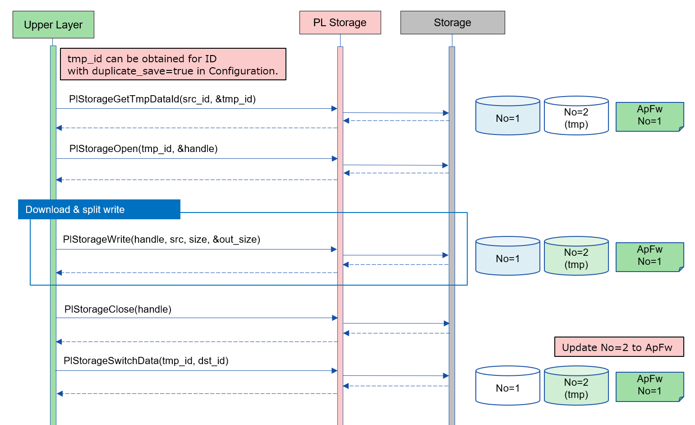

= PL Storage  (LLM Translation)
:sectnums:
:sectnumlevels: 3
:chapter-label:
:revnumber: 0.0.6
:toc: left
:toc-title: Table of Contents
:toclevels: 3
:lang: en
:xrefstyle: short
:figure-caption: Figure
:table-caption: Table
:section-refsig:
:experimental:
ifdef::env-github[:mermaid_block: source,mermaid,subs="attributes"]
ifndef::env-github[:mermaid_block: mermaid,subs="attributes"]
ifdef::env-github,env-vscode[:mermaid_break: break]
ifndef::env-github,env-vscode[:mermaid_break: opt]
ifdef::env-github,env-vscode[:mermaid_critical: critical]
ifndef::env-github,env-vscode[:mermaid_critical: opt]
ifdef::env-github[:mermaid_br: pass:p[&lt;br&gt;]]
ifndef::env-github[:mermaid_br: pass:p[ ]]

== Purpose and Scope

This document describes the specifications of the Storage implementation, one of the impl layers in AITRIOS PL.  
The purpose of PL Storage is to enable upper layers to access auxiliary storage devices using a common interface, without being aware of the specific type of target device such as Flash or eMMC.  
It also aims to allow the same implementation to be used on different cameras without modification in the upper layers.  
PL Storage does not provide rollback functionality except for tmpID.  
Safety depends on the performance of the lower layers.  
Writing without using tmpID results in a direct overwrite, so operation must be based on the assumption that data may become corrupted and undefined if the write fails.

== Terminology

[#_words]
.Term List
[cols="1,5a",options="header"]
|===
|Term |Description

|PL
|Porting Layer. A layer that absorbs differences between cameras and operating systems.

|public API
|An API that can be directly used by the upper layers.

|Camera
|Refers to a smart camera in this document.

|Data
|An item stored in an auxiliary storage device.

|Data ID
|An ID representing an item stored in an auxiliary storage device.

* Examples: WIFI_AP_SSID, NTP_ADDR

|Security Module  (TBD)
|Refers to the functions provided by `security/` and `porting_layer/` accessed by the security components.

|Container
|A data management unit in the Flash memory management functions provided by the Security Module.

* There are two types of containers: list and file.  
* Usage, such as which partition of the Flash memory stores what kind of data and the maximum size, is predefined.

|Container ID
|An ID that uniquely identifies a container. Defined in the header files published by the Security Module.

|File
|A container for managing large data. One file manages one Data ID.

* This concept differs from files in a file system.

|List
|A container for managing small data. One list manages multiple Data IDs.

|List Data ID
|An ID used to uniquely identify each Data ID within a list that manages multiple Data IDs.
|===

== Component Description

The PL Storage layer is the core part of the PL I/F that can be used without considering camera-specific differences.  
Its purpose is to absorb camera-specific differences related to auxiliary storage devices.  
It can also be extended or modified to match the target camera.

=== Component Overview

The following diagram shows the software structure centered around this block.

.Overview Diagram
image::./images/storage_layer.png[scaledwidth="100%",align="center"]

=== Detailed Component Description

An example sequence for using PL Storage is shown below.  
After executing `PlStorageInitialize`, the upper layer can use various storage functions through the PL Storage API.  
The mount process is done by `PlStorageInitialize`, and unmount is done by `PlStorageFinalize`.

[#_storage_seq]
.Sequence Overview
[{mermaid_block}]
----
sequenceDiagram
participant psm as Upper Layer
participant psmpl as PL Storage
psm ->> +psmpl: PlStorageInitialize
psmpl -->> psm: return
psm ->> +psmpl: PlStorage***
psmpl -->> -psm: return
psm ->> psmpl: PlStorageFinalize
psmpl -->> -psm: return
----

=== State Transitions
The possible states of PL Storage are listed in <<#_TableStates>>.

[#_TableStates]
.State List
[width="100%", cols="20%,80%",options="header"]
|===
|State |Description

|PL_STORAGE_READY
|Initial state of PL Storage.

|PL_STORAGE_RUNNING
|Operational state of PL Storage.

|CLOSE
|A sub-state of PL_STORAGE_RUNNING where the handle is not yet opened.

|OPEN
|A sub-state of PL_STORAGE_RUNNING where the handle is opened and usable.

|CLOSE (TMPID)
|A sub-state of PL_STORAGE_RUNNING while acquiring a TmpID and the handle is not yet opened.

|OPEN (TMPID)
|A sub-state of PL_STORAGE_RUNNING while acquiring a TmpID and the handle is opened and usable.
|===

PL performs state transitions as shown in <<#_FigureState>>.  
No state transition occurs when an error occurs in an API (except for `Close` in non-parameter errors).

[#_FigureState]
.State Transition Diagram
[{mermaid_block}]
----
stateDiagram-v2
s_ready : PL_STORAGE_READY
s_run : PL_STORAGE_RUNNING
[*] --> s_ready
s_ready --> s_run : PlStorageInitialize
s_run --> s_ready : PlStorageFinalize
state s_run {
  s_id_x : PlStorageDataId_XX
  [*] --> s_id_x : Have status per PlStorageDataId
  state s_id_x {
    s_close : CLOSE
    s_open : OPEN
    s_tmp : TMP
    [*] --> s_close
    s_close --> s_open : PlStorageOpen
    s_open --> s_close : PlStorageClose
    s_close --> s_tmp : PlStorageGetTmpDataId
    s_tmp --> s_close : PlStorageSwitchData
    state s_tmp {
      s_tmp_close : CLOSE (TMPID)
      s_tmp_open : OPEN (TMPID)
      [*] --> s_tmp_close
      s_tmp_close --> s_tmp_open : PlStorageOpen
      s_tmp_open --> s_tmp_close : PlStorageClose
    }
  }
}
----

The availability of each API and its transition destinations are listed in <<#_TableStateTransition>>.  
The state names in the table indicate the resulting state after the API completes, meaning the API is valid in that state.  
An × symbol indicates that the API is not accepted in that state; calling the API in such a state will result in an error, and no state transition will occur.  
For error details, refer to <<#_PlErrCode>>.

NOTE: `PlStorageFinalize` can be executed during both OPEN and TMPID states.  
TmpID will be discarded. A forced `Close` is performed, so the data being written under a normal ID may become undefined.

[#_TableStateTransition]
.State Transition Table
[width="100%", cols="10%,15%,15%,15%,15%,15%,15%"]
|===
2.4+| 5+|State / Substate (OPEN / CLOSE / TMPID)
.3+|PL_STORAGE_READY
4+|PL_STORAGE_RUNNING
2+|CLOSE
2+|OPEN
||TMPID||TMPID
.18+|API Name

|``**PlStorageInitialize**`` 
|PL_STORAGE_RUNNING 
|×
|×
|×
|×

|``**PlStorageFinalize**`` 
|× 
|PL_STORAGE_READY
|PL_STORAGE_READY
|PL_STORAGE_READY
|PL_STORAGE_READY

|``**PlStorageOpen**`` 
|× 
|OPEN
|OPEN (TMPID)
|×
|×

|``**PlStorageClose**`` 
|× 
|×
|×
|CLOSE
|CLOSE (TMPID)

|``**PlStorageSeek**`` 
|×
|×
|×
|OPEN
|OPEN (TMPID)

|``**PlStorageRead**`` 
|×
|×
|×
|OPEN
|OPEN (TMPID)

|``**PlStorageWrite**`` 
|×
|×
|×
|OPEN
|OPEN (TMPID)

|``**PlStorageErase**`` 
|×
|CLOSE
|CLOSE (TMPID)
|×
|×

|``**PlStorageDRead**`` 
|×
|CLOSE
|CLOSE (TMPID)
|×
|×

|``**PlStorageDWrite**`` 
|×
|CLOSE
|CLOSE (TMPID)
|×
|×

|``**PlStorageGetDataInfo**`` 
|×
|CLOSE
|CLOSE (TMPID)
|OPEN
|OPEN (TMPID)

|``**PlStorageSwitchData**`` 
|×
|×
|CLOSE
|×
|×

|``**PlStorageGetTmpDataId**`` 
|×
|CLOSE (TMPID)
|×
|×
|×

|``**PlStorageClean**`` 
|×
|CLOSE
|CLOSE (TMPID)
|OPEN
|OPEN (TMPID)

|``**PlStorageGetCapabilities**`` 
|PL_STORAGE_RUNNING
|CLOSE
|CLOSE (TMPID)
|OPEN
|OPEN (TMPID)

|``**PlStorageGetIdCapabilities**`` 
|×
|CLOSE
|CLOSE (TMPID)
|OPEN
|OPEN (TMPID)

|``**PlStorageFactoryReset**`` 
|×
|CLOSE
|CLOSE (TMPID)
|×
|×

|``**PlStorageDowngrade**`` 
|PL_STORAGE_RUNNING
|CLOSE
|×
|×
|×
|===

NOTE: T3P does not support the states CLOSE (TMPID) and OPEN (TMPID).

NOTE: T5 does not support `PlStorageDowngrade`.

NOTE: T3P does not support `PlStorageDRead`, `PlStorageDWrite`, `PlStorageSwitchData`, or `PlStorageGetTmpDataId`.

=== Component Function List
The function list is shown in <<#_TableFunction>>.

[#_TableFunction]
.Function List
[width="100%", cols="30%,55%,15%",options="header"]
|===
|Function Name |Overview  |Section
|Open/Close Data
|Opens and closes data.
|<<#_Function1, 3.5.1.>>

|Specify Read/Write Position
|Specifies the position for reading or writing data.
|<<#_Function2, 3.5.2.>>

|Read/Write Data
|Reads and writes data.
|<<#_Function3, 3.5.3.>>

|Erase Data
|Erases data.
|<<#_Function4, 3.5.4.>>

|Simplified Read/Write
|Enables reading/writing data without using Open and Close.
|<<#_Function5, 3.5.5.>>

|Get Data ID Info
|Retrieves information (valid size) for the specified data ID.
|<<#_Function6, 3.5.6.>>

|Temporary Write and Replace
|Writes data to a temporary area and replaces it with the original after completion.
|<<#_Function7, 3.5.7.>>

|Clean Data Area
|Deletes unnecessary data.
|<<#_Function8, 3.5.8.>>

|Get Capabilities
|Retrieves available capabilities of PlStorage.
|<<#_Function9, 3.5.9.>>

|Force Erase Data
|Performs a forced erase of data.
|<<#_Function10, 3.5.10.>>

|Special Processing for Downgrade
|Performs special processing for downgrade.
|<<#_Function11, 3.5.11.>>

|===

=== Component Function Descriptions
[#_Function1]
==== Open/Close Data
Function Overview::
Opens and closes data.
Preconditions::
`PlStorageInitialize` must have been executed.
Function Details::
See <<#_PlStorageOpen, PlStorageOpen>> and <<#_PlStorageClose, PlStorageClose>> for details.
Behavior Details::
Provides/releases a handle for operations based on the ID.
Error Behavior and Recovery::
In case of an error during Open, the process will revert to the previous state.
Even if an error occurs during Close, the management area is released, so retries are prohibited.
Items for Consideration::
`fsync` is not exposed; if write synchronization is needed during Restart/FactoryReset, it will be handled internally.
Consider whether execution is needed at every Close or only during Finalize.

[#_Function2]
==== Specify Read/Write Position
Function Overview::
Specifies the position for reading or writing data.
Preconditions::
A valid handle must have been obtained by opening the data.
Function Details::
See <<#_PlStorageSeek, PlStorageSeek>> for details.
Behavior Details::
See <<#_PlStorageSeek, PlStorageSeek>> for details.
Error Behavior and Recovery::
No error is expected in the normal flow.
Items for Consideration::
This function causes errors with pipe implementations. Avoid using it if pipe extensions are planned.

[#_Function3]
==== Read/Write Data
Function Overview::
Reads and writes data.
Preconditions::
A valid handle must have been obtained by opening the data.
Function Details::
See <<#_PlStorageRead, PlStorageRead>> and <<#_PlStorageWrite, PlStorageWrite>> for details.
Behavior Details::
See <<#_PlStorageRead, PlStorageRead>> and <<#_PlStorageWrite, PlStorageWrite>> for details.
Error Behavior and Recovery::
Errors from the internal library are returned.
Items for Consideration::
None

[#_Function4]
==== Erase Data
Function Overview::
Erases data.
Preconditions::
`PlStorageInitialize` must have been executed.
Function Details::
See <<#_PlStorageErase, PlStorageErase>> for details.
Behavior Details::
See <<#_PlStorageErase, PlStorageErase>> for details.
Error Behavior and Recovery::
Errors from the internal library are returned.
Items for Consideration::
None

[#_Function5]
==== Simplified Read/Write
Function Overview::
Enables reading/writing data without using Open and Close.
Preconditions::
`PlStorageInitialize` must have been executed.
Function Details::
See <<#_PlStorageDRead, PlStorageDRead>> and <<#_PlStorageDWrite, PlStorageDWrite>> for details.
Behavior Details::
Open, Read/Write, and Close are internally executed.
Error Behavior and Recovery::
Errors from the internal library are returned.
Items for Consideration::
None

[#_Function6]
==== Get Data ID Info
Function Overview::
Retrieves information (valid size) for the specified data ID.
Preconditions::
`PlStorageInitialize` must have been executed.
Function Details::
See <<#_PlStorageGetDataInfo, PlStorageGetDataInfo>> for details.
Behavior Details::
See <<#_PlStorageGetDataInfo, PlStorageGetDataInfo>> for details.
Error Behavior and Recovery::
Errors from the internal library are returned.
Items for Consideration::
Extend if information other than file size is needed.

[#_Function7]
==== Temporary Write and Replace
Function Overview::
Writes data to a temporary area and replaces it with the original after completion.
Preconditions::
`PlStorageInitialize` must have been executed.
The target data ID must support duplication.
Function Details::
See <<#_PlStorageSwitchData, PlStorageSwitchData>> and <<#_PlStorageGetTmpDataId, PlStorageGetTmpDataId>> for details.
Behavior Details::
See <<#_PlStorageSwitchData, PlStorageSwitchData>> and <<#_PlStorageGetTmpDataId, PlStorageGetTmpDataId>> for details.
Error Behavior and Recovery::
If temporary data remains during `PlStorageInitialize`, it will be deleted.
If an error occurs during writing using TmpID, deletion must be handled by the upper layer.
Items for Consideration::
Consider whether to allow use of multiple TmpIDs simultaneously (whether to prepare for capacity limit errors).
How to restore empty data (e.g., using a special name if the original does not exist after renaming).

[#_Function8]
==== Clean Data Area
Function Overview::
Deletes unnecessary data.
Preconditions::
`PlStorageInitialize` must have been executed.
Function Details::
See <<#_PlStorageClean, PlStorageClean>> for details.
Behavior Details::
See <<#_PlStorageClean, PlStorageClean>> for details.
Error Behavior and Recovery::
If data cannot be located or deleted, an error is returned. However, deletable data will still be deleted.
Refer to the error log.
Items for Consideration::
The recursion limit for subdirectory tracking is provisionally set to three levels.
If automatic subdirectory creation is added, this limit should also be reviewed.

[#_Function9]
==== Get Capabilities
Function Overview::
Retrieves available capabilities of PlStorage.
Preconditions::
`PlStorageInitialize` must have been executed.
Function Details::
See <<#_PlStorageGetCapabilities, PlStorageGetCapabilities>> and <<#_PlStorageGetIdCapabilities, PlStorageGetIdCapabilities>> for details.
Behavior Details::
See <<#_PlStorageGetCapabilities, PlStorageGetCapabilities>> and <<#_PlStorageGetIdCapabilities, PlStorageGetIdCapabilities>> for details.
Error Behavior and Recovery::
No error is expected in the normal flow.

[#_Function10]
==== Force Erase Data
Function Overview::
Performs a forced erase of data.
Preconditions::
`PlStorageInitialize` must have been executed.
Function Details::
See <<#_PlStorageFactoryReset, PlStorageFactoryReset>> for details.
Behavior Details::
See <<#_PlStorageFactoryReset, PlStorageFactoryReset>> for details.
Error Behavior and Recovery::
Errors from the internal library are returned.
Items for Consideration::
None

[#_Function11]
==== Special Processing for Downgrade
Function Overview::
Performs special processing for downgrade.
Preconditions::
`PlStorageInitialize` must have been executed.
Function Details::
See <<#_PlStorageFactoryReset, PlStorageFactoryReset>> for details.
Behavior Details::
See <<#_PlStorageFactoryReset, PlStorageFactoryReset>> for details.
Error Behavior and Recovery::
Errors from the internal library are returned.
Items for Consideration::
None

=== List of Non-Functional Requirements for the Component

See <<#_TableNonFunction>> below.

[#_TableNonFunction]
.List of Non-Functional Requirements
[width="100%", cols="30%,55%,15%",options="header"]
|===
|Function |Description  |Section
|Maximum Stack Usage
|384 bytes
|<<#_MaxUsedStack, 3.7.1.>>

|Maximum Heap Usage
|15 KB
|<<#_MaxUsedHeap, 3.7.2.>>

|Maximum Static Data Usage
|60 bytes
|<<#_MaxUsedStaticHeap, 3.7.3.>>

|Performance
|1 ms
|<<#_Performance, 3.7.4.>>
|===

=== Description of Non-Functional Requirements for the Component
Includes the library. Values are measured under normal conditions.

[#_MaxUsedStack]
==== Maximum Stack Usage
384 bytes (DRead/DWrite)

[#_MaxUsedHeap]
==== Maximum Heap Usage
15 KB (256 handles, 32 tmpId assignments)

[#_MaxUsedStaticHeap]
==== Maximum Static Data Usage
60 bytes

[#_Performance]
==== Performance
Less than or equal to 1 ms (Excludes delays within the library)

== API Specification
=== List of Definitions
==== List of Data Types
See <<#_TableDataType>> below.

[#_TableDataType]
.List of Data Types
[width="100%", cols="30%,55%,15%",options="header"]
|===
|Data Type |Description  |Section
|enum PlErrCode
|Enumeration that defines the result of API execution.
|<<#_PlErrCode, 4.2.1.>>

|enum PlStorageDataId
|Enumeration that represents items stored in auxiliary storage.
|<<#_PlStorageDataId, 4.2.2.>>

|enum PlStorageSeekType
|Enumeration that indicates the seek type used in PlStorageSeek.
|<<#_PlStorageSeekType, 4.2.3.>>

|struct PlStorageDataInfo
|Structure representing data information obtained through PlStorageGetDataInfo.
|<<#_PlStorageDataInfo, 4.2.4.>>

|PlStorageTmpDataId
|Type representing an ID for a temporary data area.
|<<#_PlStorageTmpDataId, 4.2.5.>>

|PlStorageCapabilities
|Structure that stores information about available PlStorage capabilities.
|<<#_PlStorageCapabilities, 4.2.6.>>

|PlStorageIdCapabilities
|Structure that stores information about available PlStorage capabilities for each data item.
|<<#_PlStorageIdCapabilities, 4.2.7.>>

|PL_STORAGE_OPEN_RDONLY
|Definition of oflags used in PlStorageOpen.
|<<#_PL_STORAGE_OPEN_RDONLY, 4.2.8.>>

|PL_STORAGE_OPEN_WRONLY
|Definition of oflags used in PlStorageOpen.
|<<#_PL_STORAGE_OPEN_WRONLY, 4.2.9.>>

|PL_STORAGE_OPEN_RDWR
|Definition of oflags used in PlStorageOpen.
|<<#_PL_STORAGE_OPEN_RDWR, 4.2.10.>>
|===

==== API List
The public APIs are listed in <<#_TablePublicAPI>>.

[#_TablePublicAPI]
.Public API List
[width="100%", cols="10%,60%,20%",options="header"]
|===
|API Name |Overview |Section

|PlStorageInitialize
|Performs initialization for auxiliary storage.
|<<#_PlStorageInitialize, 4.4.1.>>

|PlStorageFinalize
|Performs finalization for auxiliary storage.
|<<#_PlStorageFinalize, 4.4.2.>>

|PlStorageOpen
|Opens data.
|<<#_PlStorageOpen, 4.4.3.>>

|PlStorageClose
|Closes data.
|<<#_PlStorageClose, 4.4.4.>>

|PlStorageSeek
|Specifies the position for reading or writing data.
|<<#_PlStorageSeek, 4.4.5.>>

|PlStorageRead
|Reads data.
|<<#_PlStorageRead, 4.4.6.>>

|PlStorageWrite
|Writes data.
|<<#_PlStorageWrite, 4.4.7.>>

|PlStorageErase
|Erases data.
|<<#_PlStorageErase, 4.4.8.>>

|PlStorageDRead
|Reads data without using Open or Close.
|<<#_PlStorageDRead, 4.4.9.>>

|PlStorageDWrite
|Writes data without using Open or Close.
|<<#_PlStorageDWrite, 4.4.10.>>

|PlStorageGetDataInfo
|Retrieves information (valid size) for the specified data ID.
|<<#_PlStorageGetDataInfo, 4.4.11.>>

|PlStorageSwitchData
|Assigns the contents of the temporary data area to the specified data ID.
|<<#_PlStorageSwitchData, 4.4.12.>>

|PlStorageGetTmpDataId
|Returns the tmp ID corresponding to the specified data ID. Returns 0 if the tmp area does not exist.
|<<#_PlStorageGetTmpDataId, 4.4.13.>>

|PlStorageClean
|Deletes unnecessary data.
|<<#_PlStorageClean, 4.4.14.>>

|PlStorageGetCapabilities
|Retrieves information about available PlStorage functions.
|<<#_PlStorageGetCapabilities, 4.4.15.>>

|PlStorageGetIdCapabilities
|Retrieves available PlStorage functions for each data ID.
|<<#_PlStorageGetIdCapabilities, 4.4.16.>>

|PlStorageFactoryReset
|Performs a forced erase of data.
|<<#_PlStorageFactoryReset, 4.4.17.>>

|PlStorageDowngrade
|Performs special processing for downgrade.
|<<#_PlStorageDowngrade, 4.4.18.>>

|===

==== Data Type Definitions
[#_PlErrCode]
==== PlErrCode
Enumeration that defines API execution results.  
(T.B.D.)

[#_PlStorageDataId]
==== PlStorageDataId
Enumeration representing items in auxiliary storage.

* Defined as units of persistence, so changes and extensions can be freely made by maintaining the table definitions of <<#_FileSystemLibrary, FileSystemLibrary>> and <<#_ContainerLibrary, ContainerLibrary>>.
* The ID is synchronized with the Parameter Storage Manager. See link:https://github.com/aitrios/aitrios-edge-device-manager/blob/main/docs/spec/esf/parameter_storage_manager/ParameterStorageManager.adoc#_EsfParameterStorageManagerItemID[EsfParameterStorageManagerItemID] for details.

[#_PlStorageSeekType]
==== PlStorageSeekType
Enumeration representing seek types used in `PlStorageSeek`.

* *Format*
[source, C]
....
typedef enum {
    PlStorageSeekSet,
    PlStorageSeekCur,
    PlStorageSeekEnd,
    PlStorageSeekMax
} PlStorageSeekType;
....

* *Values*

[#_PlStorageSeekTypeValue]
.Description of PlStorageSeekType values
[width="100%", cols="30%,70%",options="header"]
|===
|Member Name  |Description
|PlStorageSeekSet
|Indicates that Read/Write starts from the beginning of the data.
|PlStorageSeekCur
|Indicates that Read/Write starts from the current position.
|PlStorageSeekEnd
|Indicates that Read/Write starts from the end of the data.
|PlStorageSeekMax
|Maximum enum value.
|===

[#_PlStorageDataInfo]
==== PlStorageDataInfo
Structure representing data information retrieved by `PlStorageGetDataInfo`.

* *Format*
[source, C]
....
typedef struct {
    uint32_t written_size;
} PlStorageDataInfo;
....

* *Values*
[#_PlStorageDataInfoValue]
.Description of PlStorageDataInfo values
[width="100%", cols="30%,70%",options="header"]
|===
|Member Name  |Description
|uint32_t written_size
|Size of written data.  
If `PlStorageSeek` specifies an address larger than this size before `PlStorageRead`, no error is raised and no data is returned.  
If `PlStorageSeek` specifies an address larger than this size before `PlStorageWrite`, the content of the unwritten area becomes undefined.
|===

* written_size Specification  
Represents the size of written data.  
Even if writing starts after skipping addresses via seek, the highest written address is considered the size.

[#_PlStorageTmpDataId]
==== PlStorageTmpDataId
Type representing the ID of a temporary data area.

* *Format*  
Varies depending on architecture.

Example:
[source, C]
....
typedef uint32_t PlStorageTmpDataId;
typedef void* PlStorageHandle;
....

[#_PlStorageCapabilities]
==== PlStorageCapabilities
Structure representing the available functions of PlStorage.

* *Format*
[source, C]
....
typedef struct {
  uint32_t enable_tmp_id : 1;
} PlStorageCapabilities;
....

* *Values*
[#_PlStorageCapabilitiesValue]
.Description of PlStorageCapabilities values
[width="100%", cols="30%,70%a",options="header"]
|===
|Member Name  |Description
|uint32_t enable_tmp_id : 1
|Flag indicating TMPID availability.  
If APIs for temporary Write and Replace are available, returns 1. Otherwise, returns 0.

* T5: returns 1  
* T3P: returns 0

|===

[#_PlStorageIdCapabilities]
==== PlStorageIdCapabilities
Structure representing the available PlStorage functions per data ID.

* *Format*
[source, C]
....
typedef struct {
  uint32_t is_read_only : 1;
  uint32_t enable_seek : 1;
} PlStorageIdCapabilities;
....

* *Values*

[#_PlStorageIdCapabilitiesValue]
.Description of PlStorageIdCapabilities values
[width="100%", cols="30%,70%a",options="header"]
|===
|Member Name  |Description
|uint32_t is_read_only : 1;
|Read-only flag.  
Returns 1 if the data is read-only.
|uint32_t enable_seek : 1;
|Seek capability flag.  
Returns 1 if seek operations are available for the data.

* T5: returns 1  
* T3P: returns 1 for files
|===

[#_PL_STORAGE_OPEN_RDONLY]
==== PL_STORAGE_OPEN_RDONLY
Definition of oflags used in `PlStorageOpen`.  
Opens in read-only mode.

* *Format*

[source, C]
....
#define PL_STORAGE_OPEN_RDONLY (O_RDONLY)
....

[#_PL_STORAGE_OPEN_WRONLY]
==== PL_STORAGE_OPEN_WRONLY
Definition of oflags used in `PlStorageOpen`.  
Opens in write-only mode.

* *Format*

[source, C]
....
#define PL_STORAGE_OPEN_WRONLY (O_WRONLY | O_CREAT | O_TRUNC)
....

[#_PL_STORAGE_OPEN_RDWR]
==== PL_STORAGE_OPEN_RDWR
Definition of oflags used in `PlStorageOpen`.  
Opens in read-write mode.

* *Format*

[source, C]
....
#define PL_STORAGE_OPEN_RDWR (O_RDWR | O_CREAT)
....

=== API Descriptions

[#_PlStorageInitiaize]
==== PlStorageInitialize

* *Function* +
Initializes PL Storage.

* *Format* +
[source, C]
....
PlErrCode PlStorageInitialize(void)
....

* *Parameters* +
-

* *Return Value* +
Returns one of the values of `PlErrCode` based on the result.

* *Description* +
Performs initialization processing for PL Storage.

[#_PlStorageInitalize_desc]
.API Details
[width="100%", cols="30%,70%",options="header"]
|===
|Detail  |Description
|API Type
|Synchronous API
|Execution Context
|Runs in the caller's context
|Concurrent Invocation
|Allowed
|Multithreaded Invocation
|Allowed
|Multitask Invocation
|Allowed
|Blocking Behavior
|Blocking.  
If `PlStorageInitialize` or `PlStorageFinalize` is already running in another context, execution waits until it completes.
|===

[#_PlStorageInitialize_error]
.Error Information
[options="header"]
|===
|Error Code |Cause |State of OUT Parameters |System State After Error |Recovery Method

|kPlErrLock (tentative)
|Lock failure
|-
|No impact
|Not required

|kPlErrInternal
|Internal error during mount process
|-
|No impact
|Not required
|===

[#_PlStorageFinaize]
==== PlStorageFinalize

* *Function* +
Performs finalization processing for PL Storage.

* *Format* +
[source, C]
....
PlErrCode PlStorageFinalize(void)
....

* *Parameters* +
-

* *Return Value* +
Returns one of the values of `PlErrCode` based on the result.

* *Description* +
Performs finalization processing related to PL Storage.

[#_PlStorageInitalize_desc]
.API Details
[width="100%", cols="30%,70%",options="header"]
|===
|Detail  |Description
|API Type
|Synchronous API
|Execution Context
|Runs in the caller's context
|Concurrent Invocation
|Allowed
|Multithreaded Invocation
|Allowed
|Multitask Invocation
|Allowed
|Blocking Behavior
|Blocking.  
If `PlStorageInitialize` or `PlStorageFinalize` is already running in another context, execution waits until it completes.
|===

[#_PlStorageInitialize_error]
.Error Information
[options="header"]
|===
|Error Code |Cause |State of OUT Parameters |System State After Error |Recovery Method

|kPlErrLock (tentative)
|Lock failure
|-
|No impact
|Not required

|kPlErrInternal
|Internal error during mount process
|-
|No impact
|Not required
|===

[#_PlStorageOpen]
==== PlStorageOpen

* *Function* +
Opens data.

* *Format* +
[source, C]
....
PlErrCode PlStorageOpen(PlStorageDataId id, int oflags, PlStorageHandle *handle)
....

* *Parameters* +
**[IN] PlStorageDataId**::  
The data to be opened.

**[IN] int oflags**::  
Specifies options. One of the following must be specified:
*** <<#_PL_STORAGE_OPEN_RDONLY, 4.2.8. PL_STORAGE_OPEN_RDONLY>>
*** <<#_PL_STORAGE_OPEN_WRONLY, 4.2.9. PL_STORAGE_OPEN_WRONLY>>
*** <<#_PL_STORAGE_OPEN_RDWR, 4.2.10. PL_STORAGE_OPEN_RDWR>>

**[OUT] void* handle**::  
Handle used for Seek, Read, and Write operations.

* *Return Value* +
Returns one of the values of `PlErrCode` based on the result.

* *Description* +
** Opens data in auxiliary storage.
** This API can be used after executing `PlStorageInitialize`.
** On success, the address is set in `handle`.
** On failure, the value of `handle` remains unchanged.
** The handle returned by this API can be used with `PlStorageSeek`, `PlStorageRead`, and `PlStorageWrite`.
** Opening multiple data items at the same time is prohibited. Although the API may return success, behavior is undefined.
** Opening the same data multiple times is prohibited. Although the API may return success, behavior is undefined.
** The initial seek position after this API is 0.
** If `PlStorageFinalize` is executed while handles remain open from this API, they will be automatically closed internally.

[#_PlStorageOpen_desc]
.API Details
[width="100%", cols="30%,70%",options="header"]
|===
|Detail  |Description
|API Type
|Synchronous API
|Execution Context
|Runs in the caller's context
|Concurrent Invocation
|Allowed
|Multithreaded Invocation
|Allowed
|Multitask Invocation
|Allowed
|Blocking Behavior
|Blocking.  
If any `PlStorage` API is already running in another context, execution waits until it completes.
|===

[#_PlStorageOpen_error]
.Error Information
[options="header"]
|===
|Error Code |Cause |State of OUT Parameters |System State After Error |Recovery Method
|kPlErrInvalidState (tentative)
|`PlStorageInitialize` has not been executed
|-
|No impact
|Not required

|kPlErrInvalidParam (tentative)
|Parameter error
|-
|No impact
|Not required

|kPlErrFailed (tentative)
|Lock failure
|-
|No impact
|Not required

|kPlErrMemory (tentative)
|Memory allocation failed
|-
|No impact
|Not required

|kPlErrNotFound (tentative)
|Data not found (when ReadOnly or directory is missing)
|-
|No impact
|Not required

|kPlErrInvalidOperation (tentative)
|No write permission (e.g., ROMFS + R/W)
|-
|No impact
|Not required

|kPlErrInternal (tentative)
|Internal function error
|-
|No impact
|Not required
|===

[#_PlStorageClose]
==== PlStorageClose
* *Function* +
Closes data.

* *Format* +
[source, C]
....
PlErrCode PlStorageClose(const PlStorageHandle handle)
....

* *Parameters* +
**[IN] const PlStorageHandle handle**::  
Handle of the data to be closed.

* *Return Value* +
Returns one of the values of `PlErrCode` based on the result.

* *Description* +
** Closes data in auxiliary storage that was opened by `PlStorageOpen`.
** This API can be used after executing `PlStorageInitialize`.

[#_PlStorageClose_desc]
.API Details
[width="100%", cols="30%,70%",options="header"]
|===
|Detail  |Description
|API Type
|Synchronous API
|Execution Context
|Runs in the caller's context
|Concurrent Invocation
|Allowed
|Multithreaded Invocation
|Allowed
|Multitask Invocation
|Allowed
|Blocking Behavior
|Blocking.  
If any `PlStorage` API is already running in another context, execution waits until it completes.
|===

[#_PlStorageClose_error]
.Error Information
[options="header"]
|===
|Error Code |Cause |State of OUT Parameters |System State After Error |Recovery Method
|kPlErrInvalidState (tentative)
|PlStorageInitialize has not been executed
|-
|No impact
|Not required

|kPlErrInvalidParam (tentative)
|Parameter error
|-
|No impact
|Not required

|kPlErrFailed (tentative)
|Lock failure
|-
|No impact
|Not required

|kPlErrInternal (tentative)
|Error in internal function
|-
|No impact
|Not required
|===

[#_PlStorageSeek]
==== PlStorageSeek
* *Function* +
Specifies the position for reading or writing data.

* *Format* +
[source, C]
....
PlErrCode PlStorageSeek(const PlStorageHandle handle, int32_t offset, PlStorageSeekType type, int32_t *cur_pos)
....

* *Parameter Description* +
**[IN] const PlStorageHandle handle**::  
Handle of the data to seek.

**[IN] int32_t offset**::  
Amount of movement.

**[IN] PlStorageSeekType type**::  
Origin of movement.

**[OUT] int32_t *cur_pos**::  
The current seek position is stored here.

* *Return Value* +
Returns one of the `PlErrCode` values based on the result.

* *Description* +
** Specifies the position for reading or writing data.  
** This API can be used after executing PlStorageInitialize.  
** For lists, only offset = 0 is supported.  
** Only PlStorageSeekSet is supported for type.  
** If the API succeeds, the current seek position is stored in cur_pos.  
** If the API fails, the seek position is restored to the state before the call.  
** Specifying an address outside the valid range of the target data (exceeding max size) does not result in an error from this API. The error will occur during Read or Write.  
** The initial seek position after PlStorageOpen is undefined.

[#_PlStorageSeek_desc]
.API Details
[width="100%", cols="30%,70%",options="header"]
|===
|Detail |Description
|API Type
|Synchronous API
|Execution Context
|Runs in the caller's context
|Concurrent Calls
|Allowed
|Calls from Multiple Threads
|Allowed
|Calls from Multiple Tasks
|Allowed
|Blocking Behavior
|Blocking.  
If another PlStorage API is already running in a different context, this API will wait for it to complete before executing.
|===

[#_PlStorageSeek_error]
.Error Information
[options="header", cols="1,4a,1,2,1"]
|===
|Error Code |Cause |State of OUT Parameters |System State After Error |Recovery Method
|kPlErrInvalidState (tentative)
|PlStorageInitialize has not been executed
|-
|No impact
|Not required

|kPlErrInvalidParam (tentative)
|Parameter error
|-
|No impact
|Not required

|kPlErrFailed (tentative)
|Lock failure
|-
|No impact
|Not required

|kPlErrNoSupported (tentative)
|* type is set to a value other than PlStorageSeekSet  
* offset is set to a non-zero value for list-type data
|-
|No impact
|Not required

|kPlErrInternal (tentative)
|Error in internal function
|-
|No impact
|Not required

|===

[#_PlStorageRead]
==== PlStorageRead
* *Function* +
Reads data.

* *Format* +
[source, C]
....
PlErrCode PlStorageRead(const PlStorageHandle handle, void *out_buf, uint32_t read_size, uint32_t *out_size)
....

* *Parameter Description* +
**[IN] const PlStorageHandle handle**::  
Handle of the data to read.

**[OUT] void *out_buf**::  
Buffer to store the read result.

**[IN] uint32_t read_size**::  
Size to read.

**[OUT] uint32_t *out_size**::  
Size that was read.

* *Return Value* +
Returns one of the `PlErrCode` values based on the result.

* *Description* +
** Reads data.  
** This API can be used after executing `PlStorageInitialize`.  
** For lists, `read_size` must be equal to or greater than `written_size`.  
** If the API succeeds, the seek position is updated as follows:  
*** List: reset to 0  
*** File: advanced by the number of bytes read  
** If the API fails, the seek position is restored to the state before the API call.  
** If the seek position + read_size exceeds `written_size`, the API will return an error.

[#_PlStorageRead_desc]
.API Details
[width="100%", cols="30%,70%",options="header"]
|===
|Detail |Description
|API Type
|Synchronous API
|Execution Context
|Runs in the caller's context
|Concurrent Calls
|Allowed
|Calls from Multiple Threads
|Allowed
|Calls from Multiple Tasks
|Allowed
|Blocking Behavior
|Blocking.  
If another PlStorage API is already running in a different context, this API will wait for it to complete before executing.
|===

[#_PlStorageRead_error]
.Error Information
[options="header", cols="1,4a,1,2,1"]
|===
|Error Code |Cause |State of OUT Parameters |System State After Error |Recovery Method
|kPlErrInvalidState (tentative)
|`PlStorageInitialize` has not been executed
|-
|No impact
|Not required

|kPlErrInvalidParam (tentative)
|Parameter error
|-
|No impact
|Not required

|kPlErrFailed (tentative)
|Lock failure
|-
|No impact
|Not required

|kPlErrNoSupported (tentative)
|* A handle opened with `PL_STORAGE_OPEN_WRONLY` was used  
* For list-type data, `read_size` is less than `written_size`
|-
|No impact
|Not required

|kPlErrInternal (tentative)
|Internal function error
|-
|No impact
|Not required
|===

[#_PlStorageWrite]
==== PlStorageWrite
* *Function* +
Writes data.

* *Format* +
[source, C]
....
PlErrCode PlStorageWrite(const PlStorageHandle handle, const void *src_buf, uint32_t write_size, uint32_t *out_size)
....

* *Parameter Description* +
**[IN] const PlStorageHandle handle**::  
Handle of the data to write.

**[IN] const void *src_buf**::  
Buffer to write.

**[IN] uint32_t write_size**::  
Size to write.

**[OUT] uint32_t *out_size**::  
Size that was written.

* *Return Value* +
Returns one of the `PlErrCode` values based on the result.

* *Description* +
** Writes data.  
** This API can be used after executing `PlStorageInitialize`.  
** If the API succeeds, the seek position is updated as follows:  
*** List: reset to 0  
*** File: advanced by the number of bytes written  
** If the API fails, the seek position is restored to the state before the API call.  
** If the data exceeds the size limit, this API will fail.

[#_PlStorageWrite_desc]
.API Details
[width="100%", cols="30%,70%",options="header"]
|===
|Detail |Description
|API Type
|Synchronous API
|Execution Context
|Runs in the caller's context
|Concurrent Calls
|Allowed
|Calls from Multiple Threads
|Allowed
|Calls from Multiple Tasks
|Allowed
|Blocking Behavior
|Blocking.  
If another PlStorage API is already running in a different context, this API will wait for it to complete before executing.
|===

[#_PlStorageWrite_error]
.Error Information
[options="header"]
|===
|Error Code |Cause |OUT Argument Status |System State After Error |Recovery Method
|kPlErrInvalidState (Tentative)
|PlStorageInitialize has not been executed
|-
|No impact
|Not required

|kPlErrInvalidParam (Tentative)
|Parameter error
|-
|No impact
|Not required

|kPlErrFailed (Tentative)
|Lock failure
|-
|No impact
|Not required

|kPlErrTooBig (Tentative)
|Data size too large
|-
|No impact
|Not required

|kPlErrInvalidOperation (Tentative)
|No write permission (ReadOnly)
|-
|No impact
|Not required

|kPlErrInternal (Tentative)
|Error in internal function
|-
|No impact
|Not required
|===

[#_PlStorageErase]
==== PlStorageErase
* *Function* +
Erases data.

* *Format* +
[source, C]
....
PlErrCode PlStorageErase(PlStorageDataId id)
....

* *Parameter Description* +
**[IN] PlStorageDataId id**:: 
Data to be erased.

* *Return Value* +
Returns one of the PlErrCode values depending on the result.

* *Description* +
** Erases data.
** This API can be used after executing PlStorageInitialize.

[#_PlStorageErase_desc]
.API Details
[width="100%", cols="30%,70%",options="header"]
|===
|API Details  |Description
|API Type
|Synchronous API
|Execution Context
|Runs in the caller's context
|Reentrant
|Allowed
|Callable from multiple threads
|Allowed
|Callable from multiple tasks
|Allowed
|Blocking behavior inside API
|Blocks.
If another context is already executing a PlStorage API, this API waits until completion before proceeding.
|===

[#_PlStorageErase_error]
.Error Information
[options="header"]
|===
|Error Code |Cause |OUT Argument Status |System State After Error |Recovery Method
|kPlErrInvalidState (Tentative)
|PlStorageInitialize has not been executed
|-
|No impact
|Not required

|kPlErrInvalidParam (Tentative)
|Parameter error
|-
|No impact
|Not required

|kPlErrFailed (Tentative)
|Lock failure
|-
|No impact
|Not required

|kPlErrNotFound (Tentative)
|Data not found
|-
|No impact
|Not required

|kPlErrInvalidOperation (Tentative)
|No delete permission (ReadOnly)
|-
|No impact
|Not required

|kPlErrInternal (Tentative)
|Error in internal function
|-
|No impact
|Not required
|===

[#_PlStorageDRead]
==== PlStorageDRead
* *Function* +
Reads data without using Open or Close.

* *Format* +
[source, C]
....
PlErrCode PlStorageDRead(PlStorageDataId id, void *out_buf, uint32_t read_size, uint32_t *out_size)
....

* *Parameter Description* +
**[IN] PlStorageDataId id**:: 
The data to be read.

**[OUT] void *out_buf**:: 
Buffer to store the read result.

**[IN] uint32_t read_size**:: 
The size to read.

**[OUT] uint32_t *out_size**:: 
The actual size read.

* *Return Value* +
Returns one of the PlErrCode values depending on the result.

* *Description* +
** Reads data.
** This API can be used after executing PlStorageInitialize.
** This API operates with the seek position set to the beginning of the data.
** The API will fail if it attempts to access beyond the valid data range.

[#_PlStorageDRead_desc]
.API Details
[width="100%", cols="30%,70%",options="header"]
|===
|API Details  |Description
|API Type
|Synchronous API
|Execution Context
|Runs in the caller's context
|Reentrant
|Allowed
|Callable from multiple threads
|Allowed
|Callable from multiple tasks
|Allowed
|Blocking behavior inside API
|Blocks.
If another context is already executing a PlStorage API, this API waits until completion before proceeding.
|===

[#_PlStorageDRead_error]
.Error Information
[options="header"]
|===
|Error Code |Cause |OUT Argument Status |System State After Error |Recovery Method
|kPlErrInvalidState (Tentative)
|PlStorageInitialize has not been executed
|-
|No impact
|Not required

|kPlErrInvalidParam (Tentative)
|Parameter error
|-
|No impact
|Not required

|kPlErrFailed (Tentative)
|Lock failure
|-
|No impact
|Not required

|kPlErrNotFound (Tentative)
|Data not found (in ReadOnly mode)
|-
|No impact
|Not required

|kPlErrInvalidOperation (Tentative)
|No write permission (ROMFS + R/W Open)
|-
|No impact
|Not required

|kPlErrNoSupported (Tentative)
|Not supported
|-
|No impact
|Not required

|kPlErrInternal (Tentative)
|Error in internal function
|-
|No impact
|Not required
|===

[#_PlStorageDWrite]
==== PlStorageDWrite
* *Function* +
Writes data without using Open or Close.

* *Format* +
[source, C]
....
PlErrCode PlStorageDWrite(PlStorageDataId id, const void *src_buf, uint32_t write_size, uint32_t *out_size)
....

* *Parameter Description* +
**[IN] PlStorageDataId id**:: 
The data to be written.

**[IN] const void *src_buf**:: 
Buffer containing the data to write.

**[IN] uint32_t write_size**:: 
Size of the data to write.

**[OUT] uint32_t *out_size**:: 
Actual size written.

* *Return Value* +
Returns one of the PlErrCode values depending on the result.

* *Description* +
** Writes data.
** This API can be used after executing PlStorageInitialize.
** This API executes with the seek position set to the beginning of the data.
** The API will fail if it attempts to access beyond the valid data range.

[#_PlStorageDWrite_desc]
.API Details
[width="100%", cols="30%,70%",options="header"]
|===
|API Details  |Description
|API Type
|Synchronous API
|Execution Context
|Runs in the caller's context
|Reentrant
|Allowed
|Callable from multiple threads
|Allowed
|Callable from multiple tasks
|Allowed
|Blocking behavior inside API
|Blocks.
If another context is already executing a PlStorage API, this API waits until completion before proceeding.
|===

[#_PlStorageDWrite_error]
.Error Information
[options="header"]
|===
|Error Code |Cause |OUT Argument Status |System State After Error |Recovery Method
|kPlErrInvalidState (Tentative)
|PlStorageInitialize has not been executed
|-
|No impact
|Not required

|kPlErrInvalidParam (Tentative)
|Parameter error
|-
|No impact
|Not required

|kPlErrFailed (Tentative)
|Lock failure
|-
|No impact
|Not required

|kPlErrInvalidOperation (Tentative)
|No write permission (ReadOnly, ROMFS + R/W Open)
|-
|No impact
|Not required

|kPlErrNoSupported (Tentative)
|Not supported
|-
|No impact
|Not required

|kPlErrInternal (Tentative)
|Error in internal function
|-
|No impact
|Not required
|===

[#_PlStorageGetDataInfo]
==== PlStorageGetDataInfo
Retrieves information (valid size) for the specified data ID.

* *Format* +
[source, C]
....
PlErrCode PlStorageGetDataInfo(PlStorageDataId id, PlStorageDataInfo *info)
....

* *Parameter Description* +
**[IN] PlStorageDataId id**:: 
Target data ID.

**[OUT] PlStorageDataInfo *info**:: 
Information of the data ID.

* *Return Value* +
Returns one of the PlErrCode values depending on the result.

* *Description* +
Retrieves information (valid size) for the specified data ID.  
This API can be used after executing PlStorageInitialize.

[#_PlStorageGetDataInfo_desc]
.API Details
[width="100%", cols="30%,70%",options="header"]
|===
|API Details  |Description
|API Type
|Synchronous API
|Execution Context
|Runs in the caller's context
|Reentrant
|Allowed
|Callable from multiple threads
|Allowed
|Callable from multiple tasks
|Allowed
|Blocking behavior inside API
|Blocks.  
If another context is already executing a PlStorage API, this API waits until completion before proceeding.
|===

[#_PlStorageGetDataInfo_error]
.Error Information
[options="header"]
|===
|Error Code |Cause |OUT Argument Status |System State After Error |Recovery Method
|kPlErrInvalidState (Tentative)
|PlStorageInitialize has not been executed
|-
|No impact
|Not required

|kPlErrInvalidParam (Tentative)
|Parameter error
|-
|No impact
|Not required

|kPlErrFailed (Tentative)
|Lock failure
|-
|No impact
|Not required

|kPlErrNotFound (Tentative)
|Data not found
|-
|No impact
|Not required

|kPlErrInternal (Tentative)
|Error in internal function
|-
|No impact
|Not required
|===

[#_PlStorageSwitchData]
==== PlStorageSwitchData
Temporarily stored data is assigned to the specified data ID.  
This API is useful when writing large data while avoiding corruption of the operational data.

* *Format* +
[source, C]
....
PlErrCode PlStorageSwitchData(PlStorageTmpDataId src_id, PlStorageDataId dst_id)
....

* *Parameter Description* +
**[IN] PlStorageTmpDataId src_id**:: 
Data ID that refers to the temporary data area.

**[IN] PlStorageDataId dst_id**:: 
Target data ID for assignment.

* *Return Value* +
Returns one of the PlErrCode values depending on the result.

* *Description* +
** Assigns the contents of the temporary data area to the specified data ID.
** Use PlStorageGetTmpDataId to obtain src_id.
** An error is returned if a src_id not paired with dst_id is specified.
** Only IDs with `duplicate_save > supported = true` (tentative) in PL Config can be specified in this API.
** This API can be used after executing PlStorageInitialize.
** The tmp area will be erased if it still exists at the time of PlStorageInitialize execution.
** Usage steps are as follows:
1. Obtain the ID of the tmp area using PlStorageGetTmpDataId.
2. Since the tmp area does not retain the src_id data, if partial data rewriting is needed, read the data from src_id.
3. Write data to the tmp area using PlStorageOpen and PlStorageWrite.
4. Close the tmp area handle using PlStorageClose.
5. If an error code is returned during writing to the tmp area, erase the tmp area using PlStorageErase after closing it.
6. Apply the contents of the tmp area to the operational data area using PlStorageSwitchData.

.PlStorageSwitchData Example

.API Details
[width="100%", cols="30%,70%",options="header"]
|===
|API Details  |Description
|API Type
|Synchronous API
|Execution Context
|Runs in the caller's context
|Reentrant
|Allowed
|Callable from multiple threads
|Allowed
|Callable from multiple tasks
|Allowed
|Blocking behavior inside API
|Blocks.  
If another context is already executing a PlStorage API, this API waits until completion before proceeding.
|===

.Error Information
[options="header"]
|===
|Error Code |Cause |OUT Argument Status |System State After Error |Recovery Method
|kPlErrInvalidState (Tentative)
|PlStorageInitialize has not been executed
|-
|No impact
|Not required

|kPlErrInvalidParam (Tentative)
|Parameter error
|-
|No impact
|Not required

|kPlErrFailed (Tentative)
|Lock failure
|-
|No impact
|Not required

|kPlErrNoSupported (Tentative)
|Not supported
|-
|No impact
|Not required

|kPlErrInternal (Tentative)
|Error in internal function
|-
|No impact
|Not required
|===

[#_PlStorageGetTmpDataId]
==== PlStorageGetTmpDataId
Returns the tmp area ID corresponding to the specified data ID.

* *Format* +
[source, C]
....
PlErrCode PlStorageGetTmpDataId(PlStorageDataId src_id, PlStorageTmpDataId *tmp_id)
....

* *Parameter Description* +
**[IN] PlStorageDataId src_id**:: 
The data ID for which the corresponding tmp area ID is required.

**[OUT] PlStorageTmpDataId *tmp_id**:: 
The tmp area ID corresponding to src_id.

** If a tmp area ID paired with src_id exists: the ID will be set to tmp_id.  
** If no tmp area ID exists for src_id: tmp_id remains unchanged from its value before the API call.

* *Return Value* +
Returns one of the PlErrCode values depending on the result.

* *Description* +
** Returns the tmp area ID corresponding to the specified data ID.  
** If a data ID with no corresponding tmp area is specified, an error is returned.  
** This API can be used after executing PlStorageInitialize.

.API Details
[width="100%", cols="30%,70%",options="header"]
|===
|API Details  |Description
|API Type
|Synchronous API
|Execution Context
|Runs in the caller's context
|Reentrant
|Allowed
|Callable from multiple threads
|Allowed
|Callable from multiple tasks
|Allowed
|Blocking behavior inside API
|Blocks.  
If another context is already executing a PlStorage API, this API waits until completion before proceeding.
|===

.Error Information
[options="header"]
|===
|Error Code |Cause |OUT Argument Status |System State After Error |Recovery Method
|kPlErrInvalidState (Tentative)
|PlStorageInitialize has not been executed
|-
|No impact
|Not required

|kPlErrInvalidParam (Tentative)
|Parameter error
|-
|No impact
|Not required

|kPlErrFailed (Tentative)
|Lock failure
|-
|No impact
|Not required

|kPlErrAlready (Tentative)
|TmpID has already been issued and opened
|-
|No impact
|Not required

|kPlErrMemory (Tentative)
|Memory allocation failure
|-
|No impact
|Not required

|kPlErrNoSupported (Tentative)
|Not supported
|-
|No impact
|Not required

|kPlErrInternal (Tentative)
|Error in internal function (data deletion failure)
|-
|No impact
|Not required
|===

[#_PlStorageClean]
==== PlStorageClean

* *Function* +
Deletes unnecessary data.

* *Format* +
[source, C]
....
PlErrCode PlStorageClean(void)
....

* *Parameter Description* +
None.

* *Return Value* +
Returns one of the PlErrCode values depending on the result.

* *Description* +
** Deletes unnecessary data from auxiliary storage.  
** This API can be used after executing PlStorageInitialize.  
** Even if a failure occurs during execution, it continues scanning all data areas and deletes all deletable data.  
** Can be executed while data is open or during TmpID creation.

[#_PlStorageClean_desc]
.API Details
[width="100%", cols="30%,70%",options="header"]
|===
|API Details  |Description
|API Type
|Synchronous API
|Execution Context
|Runs in the caller's context
|Reentrant
|Allowed
|Callable from multiple threads
|Allowed
|Callable from multiple tasks
|Allowed
|Blocking behavior inside API
|Blocks.  
If another context is already executing a PlStorage API, this API waits until completion before proceeding.
|===

[#_PlStorageClean_error]
.Error Information
[options="header"]
|===
|Error Code |Cause |OUT Argument Status |System State After Error |Recovery Method
|kPlErrInvalidState (Tentative)
|PlStorageInitialize has not been executed
|-
|No impact
|Not required

|kPlErrFailed (Tentative)
|Lock failure
|-
|No impact
|Not required

|kPlErrMemory (Tentative)
|Memory allocation failure, or directory depth exceeds four levels
|-
|No impact
|Not required

|kPlErrInternal (Tentative)
|Error in internal function
|-
|No impact
|Not required
|===

[#_PlStorageGetCapabilities]
==== PlStorageGetCapabilities

* *Function* +
Retrieves information on available PlStorage capabilities.

* *Format* +
[source, C]
....
PlErrCode PlStorageGetCapabilities(PlStorageCapabilities *capabilities)
....

* *Parameter Description* +
**[OUT] PlStorageCapabilities *capabilities**::  
Structure to store the available PlStorage capabilities information.

* *Return Value* +
Returns one of the PlErrCode values depending on the result.

* *Description* +
** Retrieves information on available capabilities.  
** The available capabilities differ depending on the camera.  
** This API can be used without executing PlStorageInitialize.

[#_PlStorageGetCapabilities_desc]
.API Details
[width="100%", cols="30%,70%",options="header"]
|===
|API Details  |Description
|API Type
|Synchronous API
|Execution Context
|Runs in the caller's context
|Reentrant
|Allowed
|Callable from multiple threads
|Allowed
|Callable from multiple tasks
|Allowed
|Blocking behavior inside API
|Does not block.
|===

[#_PlStorageGetCapabilities_error]
.Error Information
[options="header"]
|===
|Error Code |Cause |OUT Argument Status |System State After Error |Recovery Method
|kPlErrInvalidParam (Tentative)
|Parameter error
|-
|No impact
|Not required
|===

[#_PlStorageGetIdCapabilities]
==== PlStorageGetIdCapabilities

* *Function* +
Retrieves information on available PlStorage capabilities for each data ID.

* *Format* +
[source, C]
....
PlErrCode PlStorageGetIdCapabilities(PlStorageDataId id, PlStorageIdCapabilities *id_capabilities)
....

* *Parameter Description* +
**[IN] PlStorageDataId id**::  
The data ID for which to retrieve capability information.

**[OUT] PlStorageIdCapabilities *id_capabilities**::  
Structure to store information on PlStorage capabilities for the specified data ID.

* *Return Value* +
Returns one of the PlErrCode values depending on the result.

* *Description* +
** Retrieves information on available capabilities.  
** Available capabilities vary by camera and data ID.  
** This API can be used after executing PlStorageInitialize.

[#_PlStorageGetIdCapabilities_desc]
.API Details
[width="100%", cols="30%,70%",options="header"]
|===
|API Details  |Description
|API Type
|Synchronous API
|Execution Context
|Runs in the caller's context
|Reentrant
|Allowed
|Callable from multiple threads
|Allowed
|Callable from multiple tasks
|Allowed
|Blocking behavior inside API
|Does not block
|===

[#_PlStorageGetIdCapabilities_error]
.Error Information
[options="header"]
|===
|Error Code |Cause |OUT Argument Status |System State After Error |Recovery Method
|kPlErrInvalidState (Tentative)
|PlStorageInitialize has not been executed
|-
|No impact
|Not required

|kPlErrInvalidParam (Tentative)
|Parameter error
|-
|No impact
|Not required
|===

[#_PlStorageFactoryReset]
==== PlStorageFactoryReset

* *Function* +
Performs a secure erase of the data.

* *Format* +
[source, C]
....
PlErrCode PlStorageFactoryReset(PlStorageDataId id)
....

* *Parameter Description* +
**[IN] PlStorageDataId id**::  
The data to be securely erased.

* *Return Value* +
Returns one of the PlErrCode values depending on the result.

* *Description* +
** Performs a secure erase of the data.  
** This API can be used after executing PlStorageInitialize.  
** Intended for use cases where Flash memory should be restored to factory default state.  
** The differences from <<#_PlStorageErase, PlStorageErase>> are as follows:  
*** PlStorageErase only makes the data appear deleted from the higher layer, while the information remains in Flash.  
*** PlStorageFactoryReset erases the data so that no information remains in Flash.

[#_PlStorageFactoryReset_desc]
.API Details
[width="100%", cols="30%,70%",options="header"]
|===
|API Details  |Description
|API Type
|Synchronous API
|Execution Context
|Runs in the caller's context
|Reentrant
|Allowed
|Callable from multiple threads
|Allowed
|Callable from multiple tasks
|Allowed
|Blocking behavior inside API
|Blocks.  
If another context is already executing a PlStorage API, this API waits until completion before proceeding.
|===

[#_PlStorageFactoryReset_error]
.Error Information
[options="header"]
|===
|Error Code |Cause |OUT Argument Status |System State After Error |Recovery Method
|kPlErrInvalidState (Tentative)
|PlStorageInitialize has not been executed
|-
|No impact
|Not required

|kPlErrInvalidParam (Tentative)
|Parameter error
|-
|No impact
|Not required

|kPlErrFailed (Tentative)
|Lock failure
|-
|No impact
|Not required

|kPlErrNotFound (Tentative)
|Data not found
|-
|No impact
|Not required

|kPlErrInvalidOperation (Tentative)
|No delete permission (ReadOnly)
|-
|No impact
|Not required

|kPlErrInternal (Tentative)
|Error in internal function
|-
|No impact
|Not required
|===

[#_PlStorageDowngrade]
==== PlStorageDowngrade
* *Function* +
Performs special processing for downgrade.

* *Format* +
[source, C]
....
PlErrCode PlStorageDowngrade(void)
....

* *Parameter Description* +
None.

* *Return Value* +
Returns one of the PlErrCode values depending on the result.

* *Description* +
** Performs special processing for downgrade.  
** This API can be used without executing PlStorageInitialize.  
** Not supported on T5.  
** Intended for downgrade use cases involving T3P.

[#_PlStorageDowngrade_desc]
.API Details
[width="100%", cols="30%,70%",options="header"]
|===
|API Details  |Description
|API Type
|Synchronous API
|Execution Context
|Runs in the caller's context
|Reentrant
|Allowed
|Callable from multiple threads
|Allowed
|Callable from multiple tasks
|Allowed
|Blocking behavior inside API
|Blocks.  
If another context is already executing a PlStorage API, this API waits until completion before proceeding.
|===

[#_PlStorageDowngrade_error]
.Error Information
[options="header"]
|===
|Error Code |Cause |OUT Argument Status |System State After Error |Recovery Method
|kPlErrInvalidParam (Tentative)
|Parameter error
|-
|No impact
|Not required

|kPlErrFailed (Tentative)
|Lock failure
|-
|No impact
|Not required

|kPlErrNotFound (Tentative)
|Data not found
|-
|No impact
|Not required

|kPlErrInvalidOperation (Tentative)
|No delete permission (ReadOnly)
|-
|No impact
|Not required

|kPlErrInternal (Tentative)
|Error in internal function
|-
|No impact
|Not required

|kPlErrNoSupported (Tentative)
|Not supported
|-
|No impact
|Not required
|===

== API Usage Examples
=== Read Example
.PlStorageRead (Example)
[{mermaid_block}]
----
sequenceDiagram
participant psm as Upper Layer
participant psmpl as PL Storage
psm ->> psmpl: PlStorageInitialize
psm ->> psmpl: PlStorageOpen
psmpl -->> psm: handle
psm ->> psmpl: PlStorageSeek
psm ->> psmpl: PlStorageRead
psmpl -->> psm: data
psm ->> psm: process(data)
psm ->> psmpl: PlStorageClose
psm ->> psmpl: PlStorageFinalize
----

=== DRead Example
.PlStorageDRead (Example)
[{mermaid_block}]
----
sequenceDiagram
participant psm as Upper Layer
participant psmpl as PL Storage
psm ->> psmpl: PlStorageInitialize
psm ->> psmpl: PlStorageDRead
psmpl -->> psm: data
psm ->> psm: process(data)
psm ->> psmpl: PlStorageFinalize
----

=== GetDataInfo Example
.PlStorageGetDataInfo (Example)
[{mermaid_block}]
----
sequenceDiagram
participant psm as Upper Layer
participant psmpl as PL Storage
psm ->> psmpl: PlStorageInitialize
psm ->> psmpl: PlStorageGetDataInfo
psmpl -->> psm: info
psm ->> psm: malloc(info.written_size)
psm ->> psmpl: PlStorageFinalize
----

== Notes and Component-Specific Descriptions
[#_FileSystemLibrary]
=== FileSystemLibrary
A library for storing persistent data in the filesystem.

==== Table Definition
* The data saved for mount processing and `PlStorageDataId` is defined in a table.
* When adding a new `PlStorageDataId`, you must also add it to the table.
* This is intended to be modified and used as needed for upper-layer persistence or initial configuration.

===== struct PlStorageMountDefs
A structure representing mount information.  
The instance is defined as `s_mount_defs`.

* *Format*
[source, C]
....
struct PlStorageMountDefs {
  const char* source;
  const char* target;
  const char* type;
  const unsigned int do_clean : 1;
};
....

* *Values*

[#PlStorageMountDefsValue]
.Description of PlStorageMountDefs Values
[width="100%", cols="30%,70%a",options="header"]
|===
|Member Name |Description
|source
|* Path to the device file.  
* Setting to NULL indicates the end of the table.
|target
|* Mount point path.
|type
|* Filesystem type. (Currently only littlefs has been confirmed to work)
|do_clean
|* Indicates whether clean should be executed. (1: perform clean, 0: do not perform clean)
|===

===== PlStorageFilesystemDataIdTbl
A structure representing information about stored data.  
This is the structure definition; the association with `PlStorageDataId` is defined in `s_id_tbl`.

* *Format*
[source, C]
....
typedef struct {
  char *path;
  int access;
  uint32_t max_size;
  int tmp_id;
  unsigned int disable_chunk : 1;
} PlStorageFilesystemDataIdTbl;
....

* *Values*

[#PlStorageFilesystemDataIdTblValue]
.Description of PlStorageFilesystemDataIdTbl Values
[width="100%", cols="30%,70%a",options="header"]
|===
|Member Name |Description
|path
|* Path to the stored data.  
* If set to NULL, this ID is considered invalid.
|access
|* Indicates the access permission for the data. Specify one of the following:  
** For read-only: `O_RDONLY`  
** For read/write: `O_RDWR`
|max_size
|* Maximum size allowed for the stored data.  
* If set to 0, there is no limit (up to available capacity).
|tmp_id
|* Indicates whether temporary write/replace APIs can be used for this data.  
** If usable: `1`  
** If not usable: `0`
|disable_chunk
|* Indicates whether offset access is disabled for this data. Specify one of the following:  
** List: `1`  
** File: `0`
|===

==== Behavior
The `PlStorageDataId` enum is defined in `pl_storage.h`.  
The mount definitions (`s_mount_defs`) and ID definitions (`s_id_tbl`) are in `pl_filesystem_tbl.c`.  
During initialization, the driver mounts to the directory, and it unmounts at termination.  
Data is associated via the ID definitions, and this library accesses it as a filesystem.

==== Table Definition Example
A concrete example is provided below.

* *Format*

===== pl_filesystem_tbl.h
[source, C]
....
static const struct PlStorageMountDefs s_mount_defs[] = {
    {"/dev/esp/partition/camera_data_encr", "/camera_data_encr", "littlefs", 1},
    {"/dev/esp/partition/camera_data_norm", "/camera_data_norm", "littlefs", 1},
    {"/dev/esp/partition/fa_data2",         "/fa_data2",         "littlefs", 0},
    {NULL, NULL, NULL, 0},
};

static const PlStorageFilesystemDataIdTbl s_id_tbl[PlStorageDataMax] = {
    [PlStorageDataDpsURL] =
        {"/camera_data_norm/DpsURL", O_RDWR,   0, 0, 1},
    [PlStorageDataPkiRootCerts] =
        {"/fa_data2/PkiRootCerts",   O_RDONLY, 0, 0, 0},
    [PlStorageDataSensorAIModelFlashAddress] = 
        {NULL,                       O_RDWR,   0, 1, 1},
};
....

* `s_mount_defs` Specification
** Mounted in order at initialization (PlStorageInitialize) and unmounted at termination (PlStorageFinalize).
** If mounting fails, it will retry with autoformat enabled. In this case, data will be erased.
** Even if a mount/unmount fails, it will only log the failure and proceed with the next mount/unmount operation.

* `s_id_tbl` Specification
** Specifies the data corresponding to each `PlStorageDataId` in order.
** If `O_RDONLY` is specified, `PlStorageErase` (deletion) will return an error.
** `max_size` is a write limit value, used to maintain compatibility with security (Flash). Typically, setting it to 0 (unlimited) is acceptable.
** If `tmp_id` is 0, `PlStorageGetTmpDataId` will return an error. Since read-only (`O_RDONLY`) data will also fail when trying to create a TmpID, set this to 0 in such cases.

[#_ContainerLibrary]
=== ContainerLibrary
A library for storing persistent data using the Flash memory data management feature provided by the Security Module.

==== Table Definition
The association between data IDs and containers is defined in a table.  
When adding a new data ID, you must also update the table accordingly.

===== sec_container_def.h
Contains define constants for container IDs.  
Since these are managed by the Security Module, a change request is required to modify the container definitions themselves.

===== pl_storage_list_data_id.h
Contains enum definitions for list data IDs.  
It is assumed that this file will be modified as needed by the upper layers.

===== pl_storage_container_map.h
This header defines the table that links Data IDs, Container IDs, and List Data IDs.  
The table is defined in `s_container_map`.  
It is intended to be modified as needed by the upper layer.

[#s_container_map]
.Description of s_container_map Values
[width="100%", cols="1,5a",options="header"]
|===
|Member Name |Description
|access
|Specifies access permissions for the data. Choose one of the following:

* For read-only: `O_RDONLY`  
* For read/write: `O_RDWR`

|container
|Associates with a container. The format differs for files and lists:

* For files: `FILE(<container ID without "_ID">)`  
* For lists: `LIST(<container ID without "_ID">)`

|file_no or list_data_id
|Associates with a container. The format differs for files and lists:

* For files: use the Container ID  
* For lists: use the List Data ID
|===

==== Table Definition Example
A concrete example is provided below.  
Only the necessary parts of the source code are excerpted for explanation purposes.

===== sec_container_def.h
[source, C]
....
// ----------------------------------------
// PARTITION: SEC
// ----------------------------------------
----
// Container ID (List)
#define SEC_CTR_SEC_LIST_KS1_ID                           (0)
----
// File ID
#define SEC_CTR_SEC_FILE_AUTH_INFO0_ID                    (0x0100)
----
....

===== pl_storage_list_data_id.h
[source, C]
....
// ----------------------------------------
// PARTITION: SEC
// ----------------------------------------
// SEC_CTR_SEC_LIST_KS1_ID
typedef enum {
  kDataIdSecKs1 = 0,
  kSecKs1ListDataEntryIDNum
} SecKs1ListDataEntryID;
....

===== pl_storage_container_map.h
[source, C]
....
#include "pl_storage_list_data_id.h"
#include "sec_container_def.h"

static const PlStorageContainerMap s_container_map[PlStorageDataMax] = {
    [PlStorageDataAuthInfo0] =
        {O_RDONLY,
         FILE(SEC_CTR_SEC_FILE_AUTH_INFO0),
         {SEC_CTR_SEC_FILE_AUTH_INFO0_ID}},
    [PlStorageDataKs1] =
        {O_RDWR,
         LIST(SEC_CTR_SEC_LIST_KS1),
         {kDataIdSecKs1}},
    [PlStorageDataKs2] =
        {O_RDONLY},
};
....

* File example: Associate data ID `PlStorageDataAuthInfo0` with container ID `SEC_CTR_SEC_FILE_AUTH_INFO0_ID`
** Specify the data access permission in `s_container_map.access`.  
*** In this example: `O_RDONLY`
** Specify the container using `FILE(<container ID without "_ID">)` in `s_container_map.container`.  
*** In this example: `FILE(SEC_CTR_SEC_FILE_AUTH_INFO0)`
** Specify the container ID in `s_container_map.file_no`.  
*** In this example: `SEC_CTR_SEC_FILE_AUTH_INFO0_ID`

* List example: Associate data ID `PlStorageDataKs1` with container ID `SEC_CTR_SEC_LIST_KS1_ID`
** Define the list data ID enum in `pl_storage_list_data_id.h`.  
*** In this example: `SecKs1ListDataEntryID` and `kDataIdSecKs1`
** Specify the data access permission in `s_container_map.access`.  
*** In this example: `O_RDWR`
** Specify the container using `LIST(<container ID without "_ID">)` in `s_container_map.container`.  
*** In this example: `LIST(SEC_CTR_SEC_LIST_KS1)`
** Specify the list data ID in `s_container_map.list_data_id`.  
*** In this example: `kDataIdSecKs1`

* Intentional omission: Do not associate data ID `PlStorageDataKs2` with any container  
** Specify only the data access permission in `s_container_map.access`.  
*** In this example: `O_RDONLY`

==== When Data IDs Are Not Mapped to Containers
API behavior becomes undefined for data IDs not mapped to a container.

* If you need to define specific behavior for data IDs that are not mapped,  
please contact us for support via the ContainerLibrary.

== List of OSS Used
None

== References
None

== Revision History
[width="100%", cols="20%,80%a",options="header"]
|===
|Version |Changes 
|0.0.1
|Initial version
|0.0.2
|2024/6/10 Feedback applied
|0.0.3
|- General: Inserted half-width spaces before and after English words (for readability) +
- Replaced mentions of HAL with PL +
- Terminology: Removed HAL, OSAL, private API; added PL +
- Dependency block: Removed Osal Msg +
- Replaced PL description with PL WDT +
- Changed READY/RUNNING to PL_STORAGE_READY/PL_STORAGE_RUNNING +
- Added `PlErrCode` to data type definitions +
- Made PlStorageInitialize / PlStorageFinalize public APIs and moved them to the top of the API list +
- Removed “です。” from the description of "PlStorageDataId value descriptions" +
- Added `kPlErrInternal` to PlStorageInitialize / PlStorageFinalize +
- Removed all “T.B.D.” from API sections +
- Replaced diagrams (*.png) with English-labeled versions
|0.0.4
|Added explanation for ContainerLibrary
|0.0.5
|* Changed sequence diagrams and state transition diagrams to Mermaid format  
* Added component descriptions  
** Data area cleaning  
** Capability retrieval for data  
** Secure erase for data  
** Special processing for downgrade  
* Added data type definitions  
** PlStorageCapabilities  
** PlStorageIdCapabilities  
** PL_STORAGE_OPEN_RDONLY  
** PL_STORAGE_OPEN_WRONLY  
** PL_STORAGE_OPEN_RDWR  
* Added API descriptions  
** PlStorageGetCapabilities  
** PlStorageGetIdCapabilities  
** PlStorageFactoryReset  
** PlStorageDowngrade  
* Added `oflags` parameter to PlStorageOpen
|0.0.6
|* Updated API usage examples to Mermaid format  
* Updated API descriptions  
** PlStorageOpen: Behavior when opening multiple data IDs simultaneously  
** PlStorageOpen: Behavior when opening the same data ID multiple times  
** PlStorageSeek: Restrictions on `offset` and `type`  
** PlStorageRead: Restrictions on `read_size` and behavior of seek position after success  
** PlStorageWrite: Behavior of seek position after success  
** PlStorageDRead: Added "not supported" to return values  
** PlStorageDWrite: Added "not supported" to return values  
** PlStorageSwitchData: Added "not supported" to return values  
** PlStorageGetTmpDataId: Added "not supported" to return values  
* Updated description for FileSystemLibrary  
** access: Clarified it indicates data access permissions  
** tmp_id: Clarified it indicates whether temporary write/replace APIs are supported  
** disable_chunk: Added description
|===
