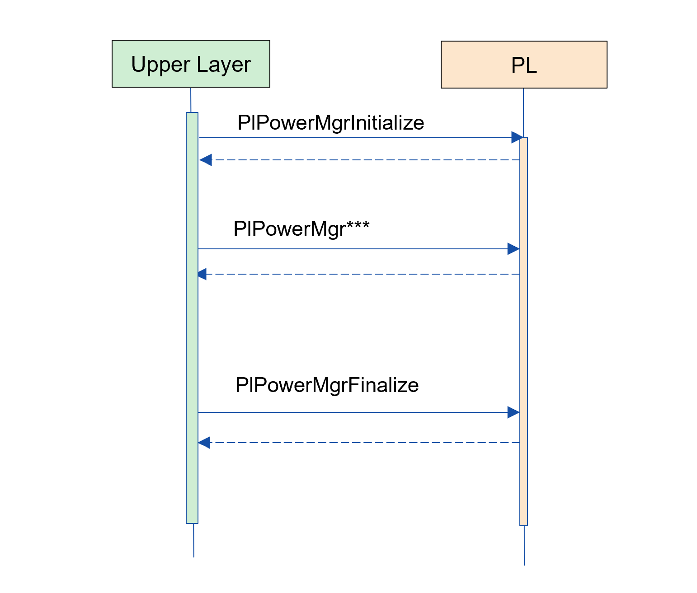
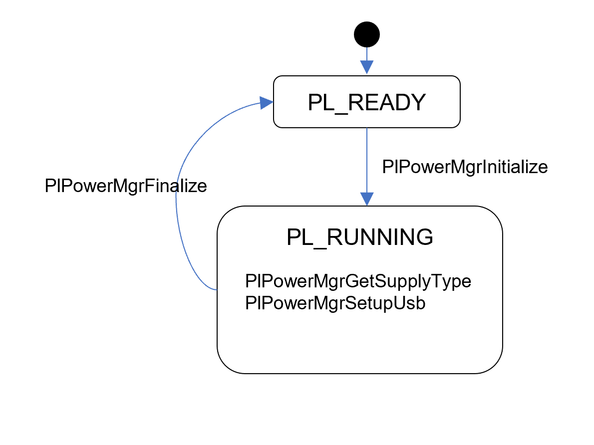
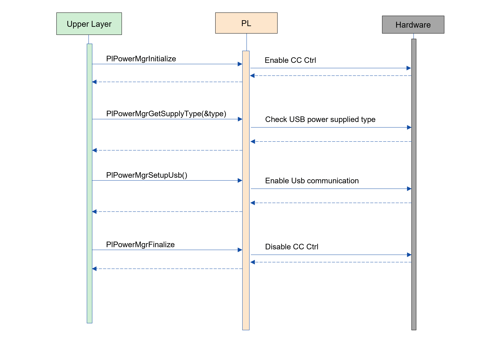

= PL PowerManager
:sectnums:
:sectnumlevels: 3
:chapter-label:
:revnumber: 0.0.2
:toc: left
:toc-title: 目次
:toclevels: 3
:lang: ja
:xrefstyle: short
:figure-caption: Figure
:table-caption: Table
:section-refsig:
:experimental:

== 目的と適用範囲

本書ではAITRIOS PL I/Fレイヤーの一つである、PL PowerManagerの仕様について記載します。
PL PowerManagerの目的は、電源情報の取得や、USBデータ通信の有効化などを担当することです。

<<<

== 用語

[#_words]
.用語一覧
[options="header"]
|===
|用語 |説明 

|PL
|Porting Layer. カメラ/ OS 差分を吸収する層

|I/F
|Interface
|===

<<<

== コンポーネントの説明

PL PowerManagerレイヤーは、電源情報の取得や、USB通信の有効化設定を行うことが目的となります。
このモジュールはカメラ差分に影響されず、ビルドコンフィグの内容によってカメラ差分を吸収することができます。

=== コンポーネントの概要

以下に本ブロックを中心としたソフトウェア構成図を示します。

.概要図

<<<

=== コンポーネントの詳細説明

PL PowerManagerの使用シーケンス例を以下に示します。
上位レイヤーはPlPowerMgrInitializeを実行後、Pl PowerManagerのAPIを使用して各種制御機能を使うことができます。

[#_button_seq]
.シーケンス概要

==== 依存ブロック（PL 内部向け）
.依存ブロック
[width="100%",options="header"]
|===
|ブロック名 |利用用途 |リンク
|HAL I2C
|電源供給種別取得、USB通信の有効化設定のため
|https://github.com/aitrios/aitrios-edge-device-manager/blob/main/docs/spec/hal/i2c/hal_i2c_ja.adoc
|===

<<<

=== 状態遷移
PL PowerManagerの取り得る状態を<<#_TableStates>>に示します。

[#_TableStates]
.状態一覧
[width="100%", cols="20%,80%",options="header"]
|===
|状態 |説明 

|PL_READY
|PL PowerManager未初期化。

|PL_RUNNING
|PL PowerManager初期化済み。

|===

Pl PowerManagerでは<<#_FigureState>>に示す状態遷移を行います。
また、各APIでエラーが発生した場合には状態遷移は起こりません。

[#_FigureState]
.状態遷移図

各状態でのAPI受け付け可否と状態遷移先を<<#_TableStateTransition>>に示します。表中の状態名は、API実行完了後の遷移先状態を示し、すなわちAPI呼び出し可能であることを示します。×はAPI受け付け不可を示し、ここでのAPI呼び出しはエラーを返し状態遷移は起きません。エラーの詳細は <<#_PlErrCode, PlErrCode>> を参照してください。

[#_TableStateTransition]
.状態遷移表
[width="100%", cols="10%,30%,30%,30%"]
|===
2.2+| 2+|状態 
|PL_READY |PL_RUNNING 
.14+|API 名

|``**PlPowerMgrInitialize**``
|PL_RUNNING
|×

|``**PlPowerMgrFinalize**``
|×
|PL_READY

|``**PlPowerMgrGetSupplyType**``
|×
|PL_RUNNING

|``**PlPowerMgrSetupUsb**``
|×
|PL_RUNNING

|``**PlPowerMgrDisableUsb**``
|×
|PL_RUNNING

|``**PlPowerMgrSwWdtKeepalive**``
|PL_READY
|PL_RUNNING

|``**PlPowerMgrEnableSwWdt**``
|PL_READY
|PL_RUNNING

|``**PlPowerMgrDisableSwWdt**``
|PL_READY
|PL_RUNNING

|``**PlPowerMgrGetMigrationData**``
|PL_READY
|PL_RUNNING

|``**PlPowerMgrEraseMigrationData**``
|PL_READY
|PL_RUNNING
|===
<<<

=== コンポーネントの機能一覧
<<#_TableFunction>>に機能の一覧を示します。

[#_TableFunction]
.機能一覧
[width="100%", cols="30%,55%,15%",options="header"]
|===
|機能名 |概要  |節番号
|電源供給種別の取得
|電源供給種別を取得する。
|<<#_Function1>>

|USB通信の有効化
|USB通信を有効化する。
|<<#_Function2>>

|プロセス死活監視機能 
|Edge device coreプロセスの死活監視機能を提供します。
|<<#_Function3>>

|マイグレーション機能
|過去のバージョンとの互換性を保つため、旧形式の設定データを新形式に移行する機能です。
|<<#_Function4>>
|===

<<<

=== コンポーネントの機能説明
[#_Function1]
==== 電源供給種別の取得
機能概要::
電源供給種別を取得します。
前提条件::
PL PowerManagerが初期化済みであること。
機能詳細::
詳細は<<#_PlPowerMgrGetSupplyType, PlPowerMgrGetSupplyType>>を参照してください。
詳細挙動::
詳細は<<#_PlPowerMgrGetSupplyType, PlPowerMgrGetSupplyType>>を参照してください。
エラー時の挙動、復帰方法::
詳細は<<#_PlPowerMgrGetSupplyType, PlPowerMgrGetSupplyType>>を参照してください。
検討事項::
なし

[#_Function2]
==== USB通信の有効化
機能概要::
USB通信の有効化します。
前提条件::
PL PowerManagerが初期化済みであること。
機能詳細::
詳細は<<#_PlPowerMgrSetupUsb, PlPowerMgrSetupUsb>>を参照してください。
詳細挙動::
詳細は<<#_PlPowerMgrSetupUsb, PlPowerMgrSetupUsb>>を参照してください。
エラー時の挙動、復帰方法::
詳細は<<#_PlPowerMgrSetupUsb, PlPowerMgrSetupUsb>>を参照してください。
検討事項::
なし

[#_Function3]
==== プロセス死活監視機能 
機能概要::
Edge device coreプロセスの死活監視機能を提供します。
前提条件::
なし
機能詳細::
詳細は<<#_PlPowerMgrEnableSwWdt, _PlPowerMgrEnableSwWdt>>を参照してください。
詳細挙動::
詳細は<<#_PlPowerMgrEnableSwWdt, _PlPowerMgrEnableSwWdt>>を参照してください。
エラー時の挙動、復帰方法::
詳細は<<#_PlPowerMgrEnableSwWdt, _PlPowerMgrEnableSwWdt>>を参照してください。
検討事項::
なし

[#_Function4]
==== データマイグレーション機能
機能概要::
過去のバージョンとの互換性を保つため、旧形式の設定データを新形式に移行する機能です。
前提条件::
なし
機能詳細::
詳細は<<#_PlPowerMgrGetMigrationData, PlPowerMgrGetMigrationData>>を参照してください。
詳細挙動::
詳細は<<#_PlPowerMgrGetMigrationData, PlPowerMgrGetMigrationData>>を参照してください。
エラー時の挙動、復帰方法::
詳細は<<#_PlPowerMgrGetMigrationData, PlPowerMgrGetMigrationData>>を参照してください。
検討事項::
なし

=== コンポーネントの非機能要件一覧

<<#_TableNonFunction>> を以下に示します。

[#_TableNonFunction]
.非機能要件一覧
[width="100%", cols="90%,10%",options="header"]
|===
|機能名 |節番号
|Stack 最大使用量
|<<#_NonFunctionStack, 3.7.1>>

|通常ヒープ最大使用量
|<<#_NonFunctionNormalHeap, 3.7.2>>

|static データ使用量
|<<#_NonFunctionStatic, 3.7.3>>

|パフォーマンス
|<<#_NonFunctionPerformance, 3.7.4>>
|===

=== コンポーネントの非機能要件説明

[#_NonFunctionStack]
==== Stack 最大使用量
512 byte

[#_NonFunctionNormalHeap]
==== 通常ヒープ最大使用量
0 byte (未使用)

[#_NonFunctionStatic]
==== static ヒープ最大使用量
64 byte

[#_NonFunctionPerformance]
==== パフォーマンス
*** PlPowerMgrInitialize          : CONFIG_EXTRENAL_PL_POWER_MGR_CC_CTRL_ENABLE_WAIT_MS[ms] = 1[sec]
*** PlPowerMgrFinalize            : 1[ms]未満
*** PlPowerMgrGetSupplyType       : 1[ms]未満
*** PlPowerMgrSetupUsb            : 1[ms]未満
*** PlPowerMgrSwWdtKeepalive      : 1[ms]未満
*** PlPowerMgrEnableSwWdt         : 1[ms]未満
*** PlPowerMgrDisableSwWdt        : 1[ms]未満
*** PlPowerMgrGetMigrationData    : 1[ms]未満
*** PlPowerMgrEraseMigrationData  : 1[ms]未満

※下位モジュールの処理時間は含みません。

<<<

== API仕様
=== 定義一覧
==== データ型一覧
<<#_TableDataType>>にデータ型の一覧を示します。

[#_TableDataType]
.データ型一覧
[width="100%", cols="30%,55%,15%",options="header"]
|===
|データ型名 |概要  |節番号
|enum PlErrCode
|API の実行結果を定義する列挙型です。
|<<#_PlErrCode, 4.3.1>>

|enum PlPowerMgrSupplyType
|電源供給種別を定義する列挙型です。
|<<#_PlPowerMgrSupplyType, 4.3.2>>

|enum PlPowerMgrMigrationDataId
|マイグレーションデータの種類を定義する列挙型です。
|<<#_PlPowerMgrMigrationDataId, 4.3.3>>
|===

==== API一覧
<<#_TablePublicAPI>>にAPIの一覧を示します。

[#_TablePublicAPI]
.上位レイヤーから直接使用可能なAPI
[width="100%", cols="10%,60%,20%",options="header"]
|===
|API名 |概要 |節番号
|PlPowerMgrInitialize
|PL PowerManagerに関する初期化処理を行います。
|<<#_PlPowerMgrInitialize, 4.4.1>>
|PlPowerMgrFinalize
|PL PowerManagerに関する終了処理を行います。
|<<#_PlPowerMgrFinalize, 4.4.2>>
|PlPowerMgrGetSupplyType
|電源供給種別を取得します。
|<<#_PlPowerMgrGetSupplyType, 4.3.3>>
|PlPowerMgrSetupUsb
|USB通信を有効化します。
|<<#_PlPowerMgrSetupUsb, 4.3.4>>
|PlPowerMgrSwWdtKeepalive
|プロセス死活監視のためのKeepAliveを送信します。
|<<#_PlPowerMgrSwWdtKeepalive, 4.3.5>>
|PlPowerMgrEnableSwWdt
|プロセス死活監視を開始します。
|<<#_PlPowerMgrEnableSwWdt, 4.3.6>>
|PlPowerMgrDisableSwWdt
|プロセス死活監視を停止します。
|<<#_PlPowerMgrDisableSwWdt, 4.3.7>>
|PlPowerMgrGetMigrationData
|旧形式の設定データを取得します。
|<<#_PlPowerMgrGetMigrationData, 4.3.8>>
|PlPowerMgrEraseMigrationData
|旧形式の設定データを削除します。
|<<#_PlPowerMgrEraseMigrationData, 4.3.9>>
|===

<<<

=== ビルドコンフィグ
[#_BuildConfig]
==== ESP32S3

* *書式* +
[source, C]
....
CONFIG_EXTRENAL_PL_POWER_MGR_CC_CTRL_ENABLE_WAIT_MS=1000
....

[#_BuildConfig_table]
.BuildConfig の説明
[width="100%", cols="30%,70%",options="header"]
|===
|メンバ名  |説明
|CONFIG_EXTRENAL_PL_POWER_MGR_CC_CTRL_ENABLE_WAIT_MS
|CC Ctrl起動後に待機する秒数[ms] (PL 内部用)。
|===

<<<
=== データ型定義
[#_PlErrCode]
==== PlErrCode
APIの実行結果を定義する列挙型です。(T.B.D.)

[#_PlPowerMgrSupplyType]
==== PlPowerMgrSupplyType
電源供給種別を定義する列挙型です。

* *書式* +
[source, C]
....
typedef enum {
  kPlPowerMgrSupplyTypePoE = 0,
  kPlPowerMgrSupplyTypeBC12,
  kPlPowerMgrSupplyTypeCC15A,
  kPlPowerMgrSupplyTypeNotSupport,
  kPlPowerMgrSupplyTypeMax
} PlPowerMgrSupplyType;
....

[#_PlPowerMgrMigrationDataId]
==== PlPowerMgrMigrationDataId
マイグレーションデータの種類を定義する列挙型です。

* *書式* +
[source, C]
....
typedef enum {
  kPlPowerMgrMigrationDataIdHoursMeter = 0,
} PlPowerMgrMigrationDataId;
....

<<<

=== 各APIの説明
[#_PlPowerMgrInitialize]
==== PlPowerMgrInitialize

* *機能* +
PL PowerManagerに関する初期化処理を行います。

* *書式* +
[source, C]
....
PlErrCode PlPowerMgrInitialize(void)
....
* *引数の説明* +
-

* *戻り値* +
実行結果に応じて PlErrCode のいずれかの値が返ります。

* *説明* +
** PL PowerManagerに関する初期化処理を行います。

.API詳細情報
[width="100%", cols="30%,70%",options="header"]
|===
|API詳細情報  |説明
|API種別
|同期API
|実行コンテキスト
|呼び元のコンテキストで動作
|同時呼び出し
|可能
|複数スレッドからの呼び出し
|可能
|複数タスクからの呼び出し
|可能
|API内部でブロッキングするか
|ブロッキングする。
PL PowerManager APIが他のコンテキストで動作中の場合、完了を待ってから実行されます。
|===

[#_PlPowerMgrInitialize_error]
.エラー情報
[options="header"]
|===
|エラーコード |原因 |OUT引数の状態 |エラー後のシステム状態 |復旧方法
|kPlInvalidState(仮)
|PlPowerMgrInitializeが既に実行されている
|-
|影響なし
|不要

|kPlErrLock/kPlErrUnlock (仮)
|ブロッキングエラー
|-
|影響なし
|不要

|kPlErrInternal (仮)
|HAL I2C エラー
|-
|影響なし
|不要
|===

<<<

[#_PlPowerMgrFinalize]
==== PlPowerMgrFinalize
* *機能* +
PL PowerManagerに関する終了処理を行います。

* *書式* +
[source, C]
....
PlErrCode PlPowerMgrFinalize(void)
....

* *引数の説明* +
-

* *戻り値* +
実行結果に応じて PlErrCode のいずれかの値が返ります。

* *説明* +
** PL PowerManagerに関する終了処理を行います。
** 本APIはPlPowerMgrInitializeの実行後に使用可能です。

.API詳細情報
[width="100%", cols="30%,70%",options="header"]
|===
|API詳細情報  |説明
|API種別
|同期API
|実行コンテキスト
|呼び元のコンテキストで動作
|同時呼び出し
|不可能
|複数スレッドからの呼び出し
|可能
|複数タスクからの呼び出し
|可能
|API内部でブロッキングするか
|ブロッキングする。
PL PowerManager APIが他のコンテキストで動作中の場合、完了を待ってから実行されます。
|===

[#_PlPowerMgrFinalize_error]
.エラー情報
[options="header"]
|===
|エラーコード |原因 |OUT引数の状態 |エラー後のシステム状態 |復旧方法
|kPlInvalidState(仮)
|PlPowerMgrInitializeが実行されていない
|-
|影響なし
|不要

|kPlErrLock/kPlErrUnlock (仮)
|ブロッキングエラー
|-
|影響なし
|不要

|kPlErrInternal (仮)
|HAL I2C エラー
|-
|影響なし
|不要
|===

<<<

[#_PlPowerMgrGetSupplyType]
==== PlPowerMgrGetSupplyType
* *機能* +
電源供給種別を取得します。

* *書式* +
[source, C]
....
PlErrCode PlPowerMgrGetSupplyType(PlPowerMgrSupplyType *type)
....

* *引数の説明* +
**[OUT] <<_PlPowerMgrSupplyType, PlPowerMgrSupplyType>> *type**::
取得した電源供給種別の値。NULLの場合はエラーを返します。

* *戻り値* +
実行結果に応じて PlErrCode のいずれかの値が返ります。

* *説明* +
** 電源供給種別を取得します。
** 本APIはPlPowerMgrInitializeの実行後に使用可能です。

.API詳細情報
[width="100%", cols="30%,70%",options="header"]
|===
|API詳細情報  |説明
|API種別
|同期API
|実行コンテキスト
|呼び元のコンテキストで動作
|同時呼び出し
|可能
|複数スレッドからの呼び出し
|可能
|複数タスクからの呼び出し
|可能
|API内部でブロッキングするか
|ブロッキングする。
PL PowerManager APIが他のコンテキストで動作中の場合、完了を待ってから実行されます。
|===

[#_PlPowerMgrGetSupplyType_error]
.エラー情報
[options="header"]
|===
|エラーコード |原因 |OUT引数の状態 |エラー後のシステム状態 |復旧方法
|kPlInvalidState(仮)
|PlPowerMgrInitializeが実行されていない
|-
|影響なし
|不要

|kPlErrLock/kPlErrUnlock (仮)
|ブロッキングエラー
|-
|影響なし
|不要

|kPlErrInvalidParam (仮)
|値取得エラー
|-
|影響なし
|不要

|kPlErrInternal (仮)
|HAL I2C エラー
|-
|影響なし
|不要
|===

<<<

[#_PlPowerMgrSetupUsb]
==== PlPowerMgrSetupUsb
* *機能* +
USB通信を有効化します。

* *書式* +
[source, C]
....
PlErrCode PlPowerMgrSetupUsb(void)
....

* *引数の説明* +
-

* *戻り値* +
実行結果に応じて PlErrCode のいずれかの値が返ります。

* *説明* +
** USB通信を有効化します。
** 本APIはPlPowerMgrInitializeの実行後に使用可能です。

.API詳細情報
[width="100%", cols="30%,70%",options="header"]
|===
|API詳細情報  |説明
|API種別
|同期API
|実行コンテキスト
|呼び元のコンテキストで動作
|同時呼び出し
|可能
|複数スレッドからの呼び出し
|可能
|複数タスクからの呼び出し
|可能
|API内部でブロッキングするか
|ブロッキングする。
PL PowerManager APIが他のコンテキストで動作中の場合、完了を待ってから実行されます。
|===

[#_PlPowerMgrSetupUsb_error]
.エラー情報
[options="header"]
|===
|エラーコード |原因 |OUT引数の状態 |エラー後のシステム状態 |復旧方法
|kPlInvalidState(仮)
|PlPowerMgrInitializeが実行されていない
|-
|影響なし
|不要

|kPlErrLock/kPlErrUnlock (仮)
|ブロッキングエラー
|-
|影響なし
|不要

|kPlErrInternal (仮)
|HAL I2C エラー
|-
|影響なし
|不要
|===

[#_PlPowerMgrSwWdtKeepalive]
==== PlPowerMgrSwWdtKeepalive
* *機能* +
プロセス死活監視のためのKeepAliveを送信します。

* *書式* +
[source, C]
....
PlErrCode PlPowerMgrSwWdtKeepalive(uint32_t id)
....

* *引数の説明* +
**[IN] uint32_t id**::
KeepAliveをしたいモジュールID。このIDに対するPlPowerMgrSwWdtKeepaliveが CONFIG_EXTERNAL_POWER_MANAGER_SW_WDT_TIMEOUT_SEC 以上行われなくなった場合、Edge device coreプロセス全体を停止させます。

* *戻り値* +
実行結果に応じて PlErrCode のいずれかの値が返ります。

* *説明* +
** プロセス死活監視のためのKeepAliveを送信します。

.API詳細情報
[width="100%", cols="30%,70%",options="header"]
|===
|API詳細情報  |説明
|API種別
|同期API
|実行コンテキスト
|呼び元のコンテキストで動作
|同時呼び出し
|可能
|複数スレッドからの呼び出し
|可能
|複数タスクからの呼び出し
|可能
|API内部でブロッキングするか
|ブロッキングする。
PlPowerMgrSwWdtKeepalive / PlPowerMgrEnableSwWdt / PlPowerMgrDisableSwWdt のいずれかが他のコンテキストで動作中の場合、完了を待ってから実行されます。
|===

.エラー情報
[options="header"]
|===
|エラーコード |原因 |OUT引数の状態 |エラー後のシステム状態 |復旧方法
|kPlErrLock/kPlErrUnlock (仮)
|ブロッキングエラー
|-
|影響なし
|不要

|kPlErrInternal (仮)
|OSエラー
|-
|影響なし
|不要
|===

[#_PlPowerMgrEnableSwWdt]
==== PlPowerMgrEnableSwWdt
* *機能* +
プロセス死活監視を開始します。

* *書式* +
[source, C]
....
PlErrCode PlPowerMgrEnableSwWdt(uint32_t id)
....

* *引数の説明* +
**[IN] uint32_t id**::
監視を開始したいモジュールID。このIDに対するPlPowerMgrSwWdtKeepaliveが CONFIG_EXTERNAL_POWER_MANAGER_SW_WDT_TIMEOUT_SEC 以上行われなくなった場合、Edge device coreプロセス全体を停止させます。

* *戻り値* +
実行結果に応じて PlErrCode のいずれかの値が返ります。

* *説明* +
** プロセス死活監視を開始します。

.API詳細情報
[width="100%", cols="30%,70%",options="header"]
|===
|API詳細情報  |説明
|API種別
|同期API
|実行コンテキスト
|呼び元のコンテキストで動作
|同時呼び出し
|可能
|複数スレッドからの呼び出し
|可能
|複数タスクからの呼び出し
|可能
|API内部でブロッキングするか
|ブロッキングする。
PlPowerMgrSwWdtKeepalive / PlPowerMgrEnableSwWdt / PlPowerMgrDisableSwWdt のいずれかが他のコンテキストで動作中の場合、完了を待ってから実行されます。
|===

.エラー情報
[options="header"]
|===
|エラーコード |原因 |OUT引数の状態 |エラー後のシステム状態 |復旧方法
|kPlErrLock/kPlErrUnlock (仮)
|ブロッキングエラー
|-
|影響なし
|不要

|kPlErrInternal (仮)
|OSエラー
|-
|影響なし
|不要
|===

[#_PlPowerMgrDisbleSwWdt]
==== PlPowerMgrDisableSwWdt
* *機能* +
プロセス死活監視を停止します。

* *書式* +
[source, C]
....
PlErrCode PlPowerMgrDisableSwWdt(uint32_t id)
....

* *引数の説明* +
**[IN] uint32_t id**::
監視を停止したいモジュールID。

* *戻り値* +
実行結果に応じて PlErrCode のいずれかの値が返ります。

* *説明* +
** プロセス死活監視を停止します。

.API詳細情報
[width="100%", cols="30%,70%",options="header"]
|===
|API詳細情報  |説明
|API種別
|同期API
|実行コンテキスト
|呼び元のコンテキストで動作
|同時呼び出し
|可能
|複数スレッドからの呼び出し
|可能
|複数タスクからの呼び出し
|可能
|API内部でブロッキングするか
|ブロッキングする。
PlPowerMgrSwWdtKeepalive / PlPowerMgrEnableSwWdt / PlPowerMgrDisableSwWdt のいずれかが他のコンテキストで動作中の場合、完了を待ってから実行されます。
|===

.エラー情報
[options="header"]
|===
|エラーコード |原因 |OUT引数の状態 |エラー後のシステム状態 |復旧方法
|kPlErrLock/kPlErrUnlock (仮)
|ブロッキングエラー
|-
|影響なし
|不要

|kPlErrInternal (仮)
|OSエラー
|-
|影響なし
|不要
|===

[#_PlPowerMgrGetMigrationData]
==== PlPowerMgrGetMigrationData
* *機能* +
旧形式の設定データを取得します。

* *書式* +
[source, C]
....
PlErrCode PlPowerMgrGetMigrationData(PlPowerMgrMigrationDataId id, void *dst, size_t dst_size)
....

* *引数の説明* +
**[IN] PlPowerMgrMigrationDataId id**::
取得したいマイグレーションデータの種類。
**[OUT] void *dst**::
取得結果。
**[IN] size_t dst_size**::
dstのサイズ[Byte]。

* *戻り値* +
実行結果に応じて PlErrCode のいずれかの値が返ります。

* *説明* +
** 旧形式の設定データを取得します。

.API詳細情報
[width="100%", cols="30%,70%",options="header"]
|===
|API詳細情報  |説明
|API種別
|同期API
|実行コンテキスト
|呼び元のコンテキストで動作
|同時呼び出し
|可能
|複数スレッドからの呼び出し
|可能
|複数タスクからの呼び出し
|可能
|API内部でブロッキングするか
|ブロッキングする。
PL PowerManager APIが他のコンテキストで動作中の場合、完了を待ってから実行されます。
|===

.エラー情報
[options="header"]
|===
|エラーコード |原因 |OUT引数の状態 |エラー後のシステム状態 |復旧方法
|kPlErrLock/kPlErrUnlock (仮)
|ブロッキングエラー
|-
|影響なし
|不要

|kPlErrInternal (仮)
|OSエラー
|-
|影響なし
|不要
|===

[#_PlPowerMgrEraseMigrationData]
==== PlPowerMgrEraseMigrationData
* *機能* +
旧形式の設定データを削除します。

* *書式* +
[source, C]
....
PlErrCode PlPowerMgrEraseMigrationData(PlPowerMgrMigrationDataId id)
....

* *引数の説明* +
**[IN] PlPowerMgrMigrationDataId id**::
削除したいマイグレーションデータの種類。

* *戻り値* +
実行結果に応じて PlErrCode のいずれかの値が返ります。

* *説明* +
** 旧形式の設定データを削除します。

.API詳細情報
[width="100%", cols="30%,70%",options="header"]
|===
|API詳細情報  |説明
|API種別
|同期API
|実行コンテキスト
|呼び元のコンテキストで動作
|同時呼び出し
|可能
|複数スレッドからの呼び出し
|可能
|複数タスクからの呼び出し
|可能
|API内部でブロッキングするか
|ブロッキングする。
PL PowerManager APIが他のコンテキストで動作中の場合、完了を待ってから実行されます。
|===

.エラー情報
[options="header"]
|===
|エラーコード |原因 |OUT引数の状態 |エラー後のシステム状態 |復旧方法
|kPlErrLock/kPlErrUnlock (仮)
|ブロッキングエラー
|-
|影響なし
|不要

|kPlErrInternal (仮)
|OSエラー
|-
|影響なし
|不要
|===

<<<

== API使用時の呼び出し例
=== 電源供給種別の取得、USB通信の有効化/無効化の一例
.電源供給種別の取得、USB通信の有効化/無効化の一例

== 使用しているOSSの一覧
なし

<<<

== 参考文献
なし

<<<

== 更新履歴
[width="100%", cols="20%,80%",options="header"]
|===
|Version |Changes 
|0.0.1
|初版
|0.0.2
|プロセス死活監視機能、マイグレーション機能を追記
|===