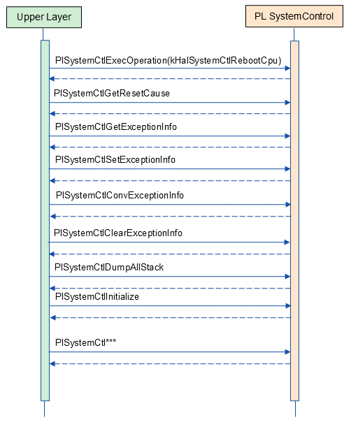
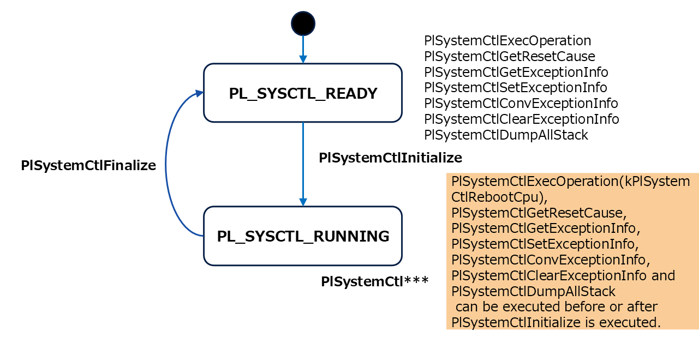

= PL SystemControl
:sectnums:
:sectnumlevels: 3
:chapter-label:
:revnumber: 0.0.3
:toc: left
:toc-title: 目次
:toclevels: 3
:lang: ja
:xrefstyle: short
:figure-caption: Figure
:table-caption: Table
:section-refsig:
:experimental:

== 目的と適用範囲

本書では AITRIOS PL の impl レイヤーの一つである、SystemControl impl の仕様について記載します。
SystemControl impl の目的は、カメラごとに異なる電源制御などの差分を吸収することです。

TIP: 例として、リブートや電源 OFF 機能はカメラによって差分があり、PL SystemControl がその差分を吸収するレイヤーになります。

<<<

== 用語

[#_words]
.用語一覧
[options="header"]
|===
|用語 |説明 

|PL
|Porting Layer. カメラ/ OS 差分を吸収する層

|===

<<<

== コンポーネントの説明

PL SystemControl レイヤーは、カメラ差分を意識せずに使える PL I/F に対する本体部分であり、システムの電源制御機能などに関する基板差分を吸収することが目的となります。 また、ターゲットとするカメラに合わせて追加・変更が可能です。

=== コンポーネントの概要

以下に本ブロックを中心としたソフトウェア構成図を示します。

.概要図
image::./images/systemcontrol_layer.png[scaledwidth="100%",align="center"]

<<<

=== コンポーネントの詳細説明

PL SystemControl の使用シーケンス例を以下に示します。上位レイヤーは PlSystemCtlInitialize を実行後、
PL SystemControl API を使用してシステムの電源操作などを行うことができます。また、リブート、リセット要因取得、エクセプション情報取得・保存の場合は PlSystemCtlInitialize 実行前にも実行可能です。

[#_systemcontrol_seq]
.シーケンス概要

==== 依存ブロック (PL SystemControl 内部向け)
.依存ブロック
[width="100%",options="header"]
なし

<<<

=== 状態遷移
PL SystemControl の取り得る状態を <<#_TableStates>> に示します。

[#_TableStates]
.状態一覧
[width="100%", cols="20%,80%",options="header"]
|===
|状態 |説明 

|PL_SYSCTL_READY
|PL SystemControl 初期状態。

|PL_SYSCTL_RUNNING
|PL SystemControl 実行可能状態。
|===

PL SystemControl では <<#_FigureState>> に示す状態遷移を行います。 +
また、各 API でエラーが発生した場合には状態遷移は起こりません。 +

[#_FigureState]
.状態遷移図

各状態での API 受け付け可否と状態遷移先を <<#_TableStateTransition>> に示します。表中の状態名は、API 実行完了後の遷移先状態を示し、すなわち API 呼び出し可能であることを示します。 +
× は API 受け付け不可を示し、ここでの API 呼び出しはエラーを返し状態遷移は起きません。エラーの詳細は PlErrCode 一覧 (T.B.D.) を参照してください。

TIP: PL SystemControl は、強制リブートや強制電源 OFF のユースケースを想定しており、強制リブートは PlSystemCtlInitialize 実行前でも呼び出し可能としています。

[#_TableStateTransition]
.状態遷移表
[width="100%", cols="10%,30%,30%,30%"]
|===
2.2+| 2+|状態 
|PL_SYSCTL_READY |PL_SYSCTL_RUNNING 
.10+|API 名

|``**PlSystemCtlInitialize**``
|PL_SYSCTL_RUNNING
|×

|``**PlSystemCtlFinalize**``
|×
|PL_SYSCTL_READY

|``**PlSystemCtlExecOperation**``
|PL_SYSCTL_READY
|PL_SYSCTL_RUNNING

|``**PlSystemCtlGetResetCause**``
|PL_SYSCTL_READY
|PL_SYSCTL_RUNNING

|``**PlSystemCtlGetExceptionInfo**``
|PL_SYSCTL_READY
|PL_SYSCTL_RUNNING

|``**PlSystemCtlSetExceptionInfo**``
|PL_SYSCTL_READY
|PL_SYSCTL_RUNNING

|``**PlSystemCtlConvExceptionInfo**``
|PL_SYSCTL_READY
|PL_SYSCTL_RUNNING

|``**PlSystemCtlClearExceptionInfo**``
|PL_SYSCTL_READY
|PL_SYSCTL_RUNNING

|``**PlSystemCtlDumpAllStack**``
|PL_SYSCTL_READY
|PL_SYSCTL_RUNNING

|===

<<<

=== コンポーネントの機能一覧
<<#_TableFunction>> に機能の一覧を示します。

[#_TableFunction]
.機能一覧
[width="100%", cols="30%,55%,15%",options="header"]
|===
|機能名 |概要  |節番号
|初期化・終了処理
|システム系操作のための初期化処理・終了処理を行います。
|<<#_Function0, 3.5.1.>>

|システム操作
|システム系の操作を行います。
|<<#_Function1, 3.5.2.>>

|リセット要因取得
|リセット要因の取得を行います。
|<<#_Function2, 3.5.3.>>

|エクセプション情報操作
|最後に動作していたタスクのスタックデータ等のエクセプション情報をRTCメモリへ保存します。 +
RTCメモリからエクセプション情報の取得を行います。 +
エクセプション情報をテキスト形式に変換します。 +
RTCメモリのエクセプション情報の削除を行います。
|<<#_Function3, 3.5.4.>>

|全スタック情報の出力
|本API実行時点で存在する全スレッドのスタック情報を出力します。
|<<#_Function4, 3.5.5.>>
|===

<<<

=== コンポーネントの機能説明
[#_Function0]
==== 初期化・終了処理
機能概要::
システム系操作のための初期化処理・終了処理を行います。
前提条件::
なし
機能詳細::
詳細は <<#_PlSystemCtlInitialize, PlSystemCtlInitialize>>、<<#_PlSystemCtlFinalize, PlSystemCtlFinalize>> を参照してください。
詳細挙動::
詳細は <<#_PlSystemCtlInitialize, PlSystemCtlInitialize>>、<<#_PlSystemCtlFinalize, PlSystemCtlFinalize>> を参照してください。
エラー時の挙動、復帰方法::
詳細は <<#_PlSystemCtlInitialize, PlSystemCtlInitialize>>、<<#_PlSystemCtlFinalize, PlSystemCtlFinalize>> を参照してください。
検討事項::
なし

[#_Function1]
==== システム操作
機能概要::
電源制御などシステム系の操作を行います。
前提条件::
なし
機能詳細::
詳細は <<#_PlSystemCtlExecOperation, PlSystemCtlExecOperation>> を参照してください。
詳細挙動::
詳細は <<#_PlSystemCtlExecOperation, PlSystemCtlExecOperation>> を参照してください。
エラー時の挙動、復帰方法::
詳細は <<#_PlSystemCtlExecOperation, PlSystemCtlExecOperation>> を参照してください。
検討事項::
なし

[#_Function2]
==== リセット要因取得
機能概要::
リセット要因の取得を行います。
前提条件::
なし
機能詳細::
詳細は <<#_PlSystemCtlGetResetCause, PlSystemCtlGetResetCause>> を参照してください。
詳細挙動::
詳細は <<#_PlSystemCtlGetResetCause, PlSystemCtlGetResetCause>> を参照してください。
エラー時の挙動、復帰方法::
詳細は <<#_PlSystemCtlGetResetCause, PlSystemCtlGetResetCause>> を参照してください。
検討事項::
なし

[#_Function3]
==== エクセプション情報操作
機能概要::
最後に動作していたタスクのスタックデータ等のエクセプション情報をRTCメモリへ保存します。 +
RTCメモリからエクセプション情報の取得を行います。 +
エクセプション情報をテキスト形式に変換します。 +
RTCメモリのエクセプション情報の削除を行います。
前提条件::
なし
機能詳細::
詳細は <<#_PlSystemCtlGetExceptionInfo, PlSystemCtlGetExceptionInfo>>、<<#_PlSystemCtlSetExceptionInfo, PlSystemCtlSetExceptionInfo>>、<<#_PlSystemCtlConvExceptionInfo, PlSystemCtlConvExceptionInfo>>、<<#_PlSystemCtlClearExceptionInfo, PlSystemCtlClearExceptionInfo>> を参照してください。
詳細挙動::
詳細は <<#_PlSystemCtlGetExceptionInfo, PlSystemCtlGetExceptionInfo>>、<<#_PlSystemCtlSetExceptionInfo, PlSystemCtlSetExceptionInfo>>、<<#_PlSystemCtlConvExceptionInfo, PlSystemCtlConvExceptionInfo>>、<<#_PlSystemCtlClearExceptionInfo, PlSystemCtlClearExceptionInfo>> を参照してください。
エラー時の挙動、復帰方法::
詳細は <<#_PlSystemCtlGetExceptionInfo, PlSystemCtlGetExceptionInfo>>、<<#_PlSystemCtlSetExceptionInfo, PlSystemCtlSetExceptionInfo>>、<<#_PlSystemCtlConvExceptionInfo, PlSystemCtlConvExceptionInfo>>、<<#_PlSystemCtlClearExceptionInfo, PlSystemCtlClearExceptionInfo>> を参照してください。
検討事項::
なし

[#_Function4]
==== 全スタック情報の出力
機能概要::
本API実行時点で存在する全スレッドのスタック情報を出力します。
前提条件::
なし
機能詳細::
詳細は <<#_PlSystemCtlDumpAllStack, PlSystemCtlDumpAllStack>> を参照してください。
詳細挙動::
詳細は <<#_PlSystemCtlDumpAllStack, PlSystemCtlDumpAllStack>> を参照してください。
エラー時の挙動、復帰方法::
詳細は <<#_PlSystemCtlDumpAllStack, PlSystemCtlDumpAllStack>> を参照してください。
検討事項::
なし

<<<
=== コンポーネントの非機能要件一覧

<<#_TableNonFunction>> に非機能要件の一覧を示します。

[#_TableNonFunction]
.非機能要件一覧
[width="100%", cols="30%,55%,15%",options="header"]
|===
|機能名 |概要  |節番号
|Stack 最大使用量
|Stack 使用量の最大値 (バイト数)
|<<#_NonFunctionStack, 3.7.>>

|ヒープ最大使用量
|ヒープ使用量の最大値 (バイト数)
|<<#_NonFunctionNormalHeap, 3.7.>>

|static データ最大使用量
|static データ使用量 (バイト数)
|<<#_NonFunctionStatic, 3.7.>>

|パフォーマンス
|各 API の処理時間
|<<#_NonFunctionPerformance, 3.7.>>
|===

=== コンポーネントの非機能要件説明

[#_NonFunctionStack]
==== Stack 最大使用量
*** 256 バイト

[#_NonFunctionNormalHeap]
==== ヒープ最大使用量
*** 0 バイト (未使用)

[#_NonFunctionStatic]
==== static データ最大使用量
*** 0 バイト (未使用)

[#_NonFunctionPerformance]
==== パフォーマンス
*** PlSystemCtlExecOperation 1 [ms] 未満
*** PlSystemCtlGetResetCause 1 [ms] 未満
*** PlSystemCtlGetExceptionInfo 1 [ms] 未満
*** PlSystemCtlSetExceptionInfo 1 [ms] 未満
*** PlSystemCtlConvExceptionInfo 1 [ms] 未満
*** PlSystemCtlClearExceptionInfo 1 [ms] 未満

※下位モジュールの処理時間は含みません。

<<<

== API 仕様
=== 定義一覧
==== データ型一覧
<<#_TableDataType>> にデータ型の一覧を示します。

[#_TableDataType]
.データ型一覧
[width="100%", cols="30%,55%,15%",options="header"]
|===
|データ型名 |概要  |節番号
|enum PlErrCode
|API の実行結果を定義する列挙型です。
|<<#_PLERRCODE, 4.2.1.>>

|enum PlSystemCtlOperation
|システム系の操作内容を定義する列挙型です。
|<<#_PL_SYSTEMCTL_OPERATION, 4.2.2.>>

|enum PlSystemCtlResetCause
|リセット要因を定義する列挙型です。
|<<#_PL_SYSTEMCTL_RESET_CAUSE, 4.2.3.>>

|#define PL_SYSTEMCTL_EXCEPTION_INFO_SIZE
|エクセプション情報のテキスト形式の最大サイズの定義です。
|<<#_PL_SYSTEMCTL_EXCEPTION_INFO_SIZE, 4.2.4.>>

|#define PL_SYSTEMCTL_EXCEPTION_INFO_STACKDUMP_NUM
|エクセプション情報のスタック情報数の最大値の定義です。
|<<#_PL_SYSTEMCTL_EXCEPTION_INFO_STACKDUMP_NUM, 4.2.5.>>

|#define PL_SYSTEMCTL_EXCEPTION_INFO_STACKDUMP_DATA_NUM
|スタック情報のデータ数の定義です。
|<<#_PL_SYSTEMCTL_EXCEPTION_INFO_STACKDUMP_DATA_NUM, 4.2.6.>>

|struct PlSystemCtlExceptionInfoBody
|スタック情報の構造体です。
|<<#_PlSystemCtlExceptionInfoBody, 4.2.7.>>

|struct PlSystemCtlExceptionInfo
|エクセプション情報の構造体です。
|<<#_PlSystemCtlExceptionInfo, 4.2.8.>>

|===

==== API 一覧
<<#_TablePublicAPI>> に API の一覧を示します。

[#_TablePublicAPI]
.上位レイヤーから直接使用可能な API
[width="100%", cols="10%,60%,20%",options="header"]
|===
|API 名 |概要 |節番号
|PlSystemCtlInitialize
|システムの電源操作を行うための初期化を行います。
|<<#_PlSystemCtlInitialize, 4.3.1.>>

|PlSystemCtlFinalize
|システムの電源操作系の終了処理を行います。
|<<#_PlSystemCtlFinalize, 4.3.2.>>

|PlSystemCtlExecOperation
|システム系の操作を行います。
|<<#_PlSystemCtlExecOperation, 4.3.3.>>

|PlSystemCtlGetResetCause
|リセット要因の取得を行います。
|<<#_PlSystemCtlGetResetCause, 4.3.4.>>

|PlSystemCtlGetExceptionInfo
|RTCメモリからスタックデータ等のエクセプション情報の取得を行います。|<<#_PlSystemCtlGetExceptionInfo, 4.3.5.>>

|PlSystemCtlSetExceptionInfo
|最後に動作していたタスクのスタックデータ等のエクセプション情報をRTCメモリへ保存します。|<<#_PlSystemCtlSetExceptionInfo, 4.3.6.>>

|PlSystemCtlConvExceptionInfo
|エクセプション情報をテキスト形式に変換します。|<<#_PlSystemCtlConvExceptionInfo, 4.3.7.>>

|PlSystemCtlClearExceptionInfo
|RTCメモリのエクセプション情報の削除を行います。|<<#_PlSystemCtlClearExceptionInfo, 4.3.8.>>

|PlSystemCtlDumpAllStack
|全スタック情報を出力します。
|<<#_PlSystemCtlDumpAllStack, 4.3.9>>
|===

<<<

=== データ型定義

[#_PLERRCODE]
==== PlErrCode
API の実行結果を定義する列挙型です。
(T.B.D.)

[#_PL_SYSTEMCTL_OPERATION]
==== PlSystemCtlOperation
システム系の操作内容を定義する列挙型です。

* *書式*
[source, C]
....
typedef enum {
  kPlSystemCtlRebootCpu,
  kPlSystemCtlRebootEdgeDevice,
  kPlSystemCtlPowerOff,
  kPlSystemCtlMax
} PlSystemCtlOperation;
....

* *値*

[#_PL_SYSTEMCTL_OPERATIONValue]
.PlSystemCtlOperation の値の説明
[width="100%", cols="30%,70%",options="header"]
|===
|メンバ名  |説明
|kPlSystemCtlRebootCpu
|CPU のリブートを行う。
|kPlSystemCtlRebootEdgeDevice
|EdgeDevice 全体のリブートを行う。
|kPlSystemCtlPowerOff
|システムの電源を OFF にする。
|kPlSystemCtlMax
|Enum 最大数
|===

TIP: 使用例 kPlSystemCtlRebootCpu：正常系でのリブートや、異常発生時の強制的なリブートなど。

TIP: 使用例 kPlSystemCtlRebootEdgeDevice：正常系での EdgeDevice 全体リブートや、異常発生時の強制的な EdgeDevice 全体リブートなど。

TIP: 使用例 kPlSystemCtlPowerOff：本 API で電源を落とした後、RTC など周辺デバイスで自動再起動を行うなど。

[#_PL_SYSTEMCTL_RESET_CAUSE]
==== PlSystemCtlResetCause
リセット要因を定義する列挙型です。

* *書式*
[source, C]
....
typedef enum {
  kPlSystemCtlResetCauseSysChipPowerOnReset,
  kPlSystemCtlResetCauseSysBrownOut,
  kPlSystemCtlResetCauseCoreSoft,
  kPlSystemCtlResetCauseCoreDeepSleep,
  kPlSystemCtlResetCauseWDT,
  kPlSystemCtlResetCauseMax
} PlSystemCtlResetCause;
....

* *値*

[#_PL_SYSTEMCTL_RESET_CAUSEValue]
.PlSystemCtlResetCause の値の説明
[width="100%", cols="30%,70%",options="header"]
|===
|メンバ名  |説明
|kPlSystemCtlResetCauseSysChipPowerOnReset|chip power on system reset
|kPlSystemCtlResetCauseSysBrownOut|brown-out system reset
|kPlSystemCtlResetCauseCoreSoft|software core reset
|kPlSystemCtlResetCauseCoreDeepSleep|deep-sleep core reset
|kPlSystemCtlResetCauseWDT|Watchdog reset
|kPlSystemCtlResetCauseMax|Enum 最大数
|===

[#_PL_SYSTEMCTL_EXCEPTION_INFO_SIZE]
==== PL_SYSTEMCTL_EXCEPTION_INFO_SIZE
エクセプション情報のテキスト形式の最大サイズの定義です。

* *書式*
[source, C]
....
#ifdef CONFIG_STACK_COLORATION
#define PL_SYSTEMCTL_EXCEPTION_INFO_SIZE                (18158)
#else
#define PL_SYSTEMCTL_EXCEPTION_INFO_SIZE                (18141)
#endif
....

[#_PL_SYSTEMCTL_EXCEPTION_INFO_STACKDUMP_NUM]
==== PL_SYSTEMCTL_EXCEPTION_INFO_STACKDUMP_NUM
エクセプション情報のスタック情報数の最大値の定義です。

* *書式*
[source, C]
....
#define PL_SYSTEMCTL_EXCEPTION_INFO_STACKDUMP_NUM       (220)
....

[#_PL_SYSTEMCTL_EXCEPTION_INFO_STACKDUMP_DATA_NUM]
==== PL_SYSTEMCTL_EXCEPTION_INFO_STACKDUMP_DATA_NUM
スタック情報のデータ数の定義です。

* *書式*
[source, C]
....
#define PL_SYSTEMCTL_EXCEPTION_INFO_STACKDUMP_DATA_NUM  (8)
....

[#_PlSystemCtlExceptionInfoBody]
==== struct PlSystemCtlExceptionInfoBody
スタック情報の構造体です。

* *書式*
[source, C]
....
struct PlSystemCtlExceptionInfoBody
  uint32_t addr;
  uint32_t data[PL_SYSTEMCTL_EXCEPTION_INFO_STACKDUMP_DATA_NUM];
};
....

* *値*

[#_PlSystemCtlExceptionInfoBodyValue]
.PlSystemCtlExceptionInfoBody の値の説明
[width="100%", cols="30%,70%",options="header"]
|===
|メンバ名  |説明
|addr|スタックデータの開始アドレス
|data|スタックデータ
|===

[#_PlSystemCtlExceptionInfo]
==== struct PlSystemCtlExceptionInfo
エクセプション情報の構造体です。

* *書式*
[source, C]
....
struct PlSystemCtlExceptionInfo {
  char          taskname[32];
  uint32_t      reg_pc;
  uint32_t      stack_base;
  uint32_t      stack_size;
#ifdef CONFIG_STACK_COLORATION
  uint32_t      stack_used;
#endif
  uint32_t      stack_num;
  struct PlSystemCtlExceptionInfoBody
                stack_dump[PL_SYSTEMCTL_EXCEPTION_INFO_STACKDUMP_NUM];
};
....

* *値*

[#_PlSystemCtlExceptionInfoValue]
.PlSystemCtlExceptionInfo の値の説明
[width="100%", cols="30%,70%",options="header"]
|===
|メンバ名  |説明
|taskname|タスク名
|reg_pc|PCレジスタ値
|stack_base|スタック情報のベースアドレス
|stack_size|スタックサイズ
|stack_used|スタック使用サイズ
|stack_num|スタック情報数
|stack_dump|スタック情報
|===

=== 各 API の説明
[#_PlSystemCtlInitialize]
==== PlSystemCtlInitialize
* *機能* +
システム系操作のための初期化処理を行います。

* *書式* +
[source, C]
....
PlErrCode PlSystemCtlInitialize(void)
....

* *引数の説明* +
-

* *戻り値* +
+
実行結果に応じて PlErrCode のいずれかの値が返ります。

* *説明* +
システム系操作のための初期化処理を行います。

[#_PlSystemCtlInitialize_desc]
.API 詳細情報
[width="100%", cols="30%,70%",options="header"]
|===
|API 詳細情報  |説明
|API 種別
|同期 API
|実行コンテキスト
|呼び元のコンテキストで動作
|同時呼び出し
|可能
|複数スレッドからの呼び出し
|可能
|複数タスクからの呼び出し
|可能
|API 内部でブロッキングするか
|ブロッキングする。
すでに他のコンテキストで PL SystemControl API が動作中の場合、完了を待ってから実行されます。
|===

[#_PlSystemCtlInitialize_error]
.エラー情報
[options="header"]
|===
|エラーコード |原因 |OUT 引数の状態 |エラー後のシステム状態 |復旧方法
|なし
|-
|-
|-
|-
|===

<<<

[#_PlSystemCtlFinalize]
==== PlSystemCtlFinalize
* *機能* +
システム系操作に関する終了処理を行います。

* *書式* +
[source, C]
....
PlErrCode PlSystemCtlFinalize(void)
....

* *引数の説明* +
-

* *戻り値* +
+
実行結果に応じて PlErrCode のいずれかの値が返ります。

* *説明* +
システム系操作に関する終了処理を行います。

[#_PlSystemCtlFinalize_desc]
.API 詳細情報
[width="100%", cols="30%,70%",options="header"]
|===
|API 詳細情報  |説明
|API 種別
|同期 API
|実行コンテキスト
|呼び元のコンテキストで動作
|同時呼び出し
|可能
|複数スレッドからの呼び出し
|可能
|複数タスクからの呼び出し
|可能
|API 内部でブロッキングするか
|ブロッキングする。
すでに他のコンテキストで PL SystemControl API が動作中の場合、完了を待ってから実行されます。
|===

[#_PlSystemCtlFinalize_error]
.エラー情報
[options="header"]
|===
|エラーコード |原因 |OUT 引数の状態 |エラー後のシステム状態 |復旧方法
|なし
|-
|-
|-
|-
|===

<<<

[#_PlSystemCtlExecOperation]
==== PlSystemCtlExecOperation
* *機能* +
システム系の操作を行います。

* *書式* +
[source, C]
....
PlErrCode PlSystemCtlExecOperation(PlSystemCtlOperation operation)
....

* *引数の説明* +
**[IN] PlSystemCtlOperation operation**::
実行したい操作。

* *戻り値* +
+
実行結果に応じて PlErrCode のいずれかの値が返ります。

* *説明* +
指定されたシステム操作を行います。
本 API は、kPlSystemCtlReboot が指定された時は PlSystemCtlInitialize の実行に関わらず使用可能です。PlSystemCtlInitialize の実行前後で効果に差はありません。
本 API は他の PL API の実行状態に関わらず強制的に実行されます。

[#_PlSystemCtlExecOperation_desc]
.API 詳細情報
[width="100%", cols="30%,70%",options="header"]
|===
|API 詳細情報  |説明
|API 種別
|同期 API
|実行コンテキスト
|呼び元のコンテキストで動作
|同時呼び出し
|可能
|複数スレッドからの呼び出し
|可能
|複数タスクからの呼び出し
|可能
|API 内部でブロッキングするか
|ブロッキングしない。
実行した順に処理を行います。
|===

[#_PlSystemCtlExecOperation_error]
.エラー情報
[options="header"]
|===
|エラーコード |原因 |OUT 引数の状態 |エラー後のシステム状態 |復旧方法
|kPlErrInvalidState (仮)
|すでに使用可能状態になっている。
|-
|影響なし
|不要

|kPlErrInvalidParam (仮)
|パラメータエラー
|-
|影響なし
|不要

|===

<<<

[#_PlSystemCtlGetResetCause]
==== PlSystemCtlGetResetCause
* *機能* +
リセット要因の取得を行います。

* *書式* +
[source, C]
....
PlErrCode PlSystemCtlGetResetCause(PlSystemCtlResetCause *cause)
....

* *引数の説明* +
**[OUT] PlSystemCtlResetCause *cause**::
リセット要因。NULLが指定された場合、エラーを返します。

* *戻り値* +
+
実行結果に応じて PlErrCode のいずれかの値が返ります。

* *説明* +
リセット要因を返します。 +
本 API は、PlSystemCtlInitialize の実行に関わらず使用可能です。
PlSystemCtlInitialize の実行前後で効果に差はありません。 +
本 API は他の PL API の実行状態に関わらず実行されます。 +

[#_PlSystemCtlGetResetCause_desc]
.API 詳細情報
[width="100%", cols="30%,70%",options="header"]
|===
|API 詳細情報  |説明
|API 種別
|同期 API
|実行コンテキスト
|呼び元のコンテキストで動作
|同時呼び出し
|可能
|複数スレッドからの呼び出し
|可能
|複数タスクからの呼び出し
|可能
|API 内部でブロッキングするか
|ブロッキングしない。
実行した順に処理を行います。
|===

[#_PlSystemCtlGetResetCause_error]
.エラー情報
[options="header"]
|===
|エラーコード |原因 |OUT 引数の状態 |エラー後のシステム状態 |復旧方法
|kPlErrInvalidParam (仮)
|パラメータエラー
|-
|影響なし
|不要

|kPlErrInvalidValue (仮)
|リセット原因のコードが不正です。
|-
|影響なし
|不要
|===

<<<

[#_PlSystemCtlGetExceptionInfo]
==== PlSystemCtlGetExceptionInfo
* *機能* +
RTCメモリからスタックデータ等のエクセプション情報の取得を行います。 +

* *書式* +
[source, C]
....
PlErrCode PlSystemCtlGetExceptionInfo(struct PlSystemCtlExceptionInfo *info)
....

* *引数の説明* +
**[OUT] <<#PlSystemCtlExceptionInfo, struct PlSystemCtlExceptionInfo>> *info**::
エクセプション情報。NULL が指定された場合、エラーを返します。

* *戻り値* +
+
実行結果に応じて PlErrCode のいずれかの値が返ります。

* *説明* +
RTCメモリからスタックデータ等のエクセプション情報の取得を行います。
WDT 割り込み時に <<#_PlSystemCtlSetExceptionInfo, PlSystemCtlSetExceptionInfo>> で保存されたエクセプション情報を、 WDT リブート後に本 API を呼び出すことでエクセプション情報を取得できます。 +
+
本 API は、PlSystemCtlInitialize の実行に関わらず使用可能です。
PlSystemCtlInitialize の実行前後で効果に差はありません。 +
本 API は他の PL API の実行状態に関わらず実行されます。 +

[#_PlSystemCtlGetExceptionInfo_desc]
.API 詳細情報
[width="100%", cols="30%,70%",options="header"]
|===
|API 詳細情報  |説明
|API 種別
|同期 API
|実行コンテキスト
|呼び元のコンテキストで動作
|同時呼び出し
|可能
|複数スレッドからの呼び出し
|可能
|複数タスクからの呼び出し
|可能
|API 内部でブロッキングするか
|ブロッキングする。すでに他のコンテキストで PlSystemCtlGetExceptionInfo, PlSystemCtlSetExceptionInfo, PlSystemCtlConvExceptionInfo, PlSystemCtlClearExceptionInfo のいずれかが動作中の場合、完了を待ってから実行されます。
|===

[#_PlSystemCtlGetExceptionInfo_error]
.エラー情報
[options="header"]
|===
|エラーコード |原因 |OUT 引数の状態 |エラー後のシステム状態 |復旧方法
|kPlErrInvalidParam (仮)
|パラメータエラー
|-
|影響なし
|不要

|kPlErrMagicCode (仮)
|Magic コード エラー
|-
|影響なし
|不要

|kPlErrLock/kPlErrUnlock (仮)
|ブロッキングエラー
|-
|影響なし
|不要

|===

<<<

[#_PlSystemCtlSetExceptionInfo]
==== PlSystemCtlSetExceptionInfo
* *機能* +
最後に動作していたタスクのスタックデータ等のエクセプション情報をRTCメモリへ保存します。

* *書式* +
[source, C]
....
PlErrCode PlSystemCtlSetExceptionInfo(void)
....

* *引数の説明* +
-

* *戻り値* +
+
実行結果に応じて PlErrCode のいずれかの値が返ります。

* *説明* +
最後に動作していたタスクのスタックデータ等のエクセプション情報をRTCメモリへ保存します。 +
WDT 割り込み時に本 API を呼び出すことで、エクセプション情報が保存され、WDT リブート後に <<#_PlSystemCtlGetExceptionInfo, PlSystemCtlGetExceptionInfo>> で取得できます。 +
+
本 API は、PlSystemCtlInitialize の実行に関わらず使用可能です。
PlSystemCtlInitialize の実行前後で効果に差はありません。 +
本 API は他の PL API の実行状態に関わらず実行されます。 +

[#_PlSystemCtlSetExceptionInfo_desc]
.API 詳細情報
[width="100%", cols="30%,70%",options="header"]
|===
|API 詳細情報  |説明
|API 種別
|同期 API
|実行コンテキスト
|呼び元のコンテキストで動作
|同時呼び出し
|可能
|複数スレッドからの呼び出し
|可能
|複数タスクからの呼び出し
|可能
|API 内部でブロッキングするか
|ブロッキングする。すでに他のコンテキストで PlSystemCtlGetExceptionInfo, PlSystemCtlSetExceptionInfo, PlSystemCtlConvExceptionInfo, PlSystemCtlClearExceptionInfo のいずれかが動作中の場合、完了を待ってから実行されます。
|===

[#_PlSystemCtlSetExceptionInfo_error]
.エラー情報
[options="header"]
|===
|エラーコード |原因 |OUT 引数の状態 |エラー後のシステム状態 |復旧方法
|kPlErrLock/kPlErrUnlock (仮)
|ブロッキングエラー
|-
|影響なし
|不要
|===

<<<

[#_PlSystemCtlConvExceptionInfo]
==== PlSystemCtlConvExceptionInfo
* *機能* +
エクセプション情報をテキスト形式に変換します。 +

* *書式* +
[source, C]
....
PlErrCode PlSystemCtlConvExceptionInfo(struct PlSystemCtlExceptionInfo *info, char *dst, uint32_t dst_size)
....

* *引数の説明* +
**[IN] struct PlSystemCtlExceptionInfo *info**::
エクセプション情報。NULL が指定された場合、エラーを返します。

**[OUT] char *dst**::
エクセプション情報バッファ。NULL が指定された場合、エラーを返します。

**[IN] uint32_t dst_size**::
エクセプション情報バッファサイズ。0 が指定された場合、エラーを返します。※ <<#_Note1>>

* *戻り値* +
+
実行結果に応じて PlErrCode のいずれかの値が返ります。

* *説明* +
本 API は、<<#_PlSystemCtlGetExceptionInfo, PlSystemCtlGetExceptionInfo>> で取得したエクセプション情報をテキスト形式に変換します。 +
+
本 API は、PlSystemCtlInitialize の実行に関わらず使用可能です。
PlSystemCtlInitialize の実行前後で効果に差はありません。 +
本 API は他の PL API の実行状態に関わらず実行されます。 +

[#_PlSystemCtlConvExceptionInfo_desc]
.API 詳細情報
[width="100%", cols="30%,70%",options="header"]
|===
|API 詳細情報  |説明
|API 種別
|同期 API
|実行コンテキスト
|呼び元のコンテキストで動作
|同時呼び出し
|可能
|複数スレッドからの呼び出し
|可能
|複数タスクからの呼び出し
|可能
|API 内部でブロッキングするか
|ブロッキングする。すでに他のコンテキストで PlSystemCtlGetExceptionInfo, PlSystemCtlSetExceptionInfo, PlSystemCtlConvExceptionInfo, PlSystemCtlClearExceptionInfo のいずれかが動作中の場合、完了を待ってから実行されます。
|===

[#_PlSystemCtlConvExceptionInfo_error]
.エラー情報
[options="header"]
|===
|エラーコード |原因 |OUT 引数の状態 |エラー後のシステム状態 |復旧方法
|kPlErrInvalidParam (仮)
|パラメータエラー
|-
|影響なし
|不要

|kPlErrWrite (仮)
|書き込みエラー
|-
|影響なし
|不要

|kPlErrLock/kPlErrUnlock (仮)
|ブロッキングエラー
|-
|影響なし
|不要

|===

<<<

[#_PlSystemCtlClearExceptionInfo]
==== PlSystemCtlClearExceptionInfo
* *機能* +
RTCメモリのエクセプション情報の削除を行います。 +

* *書式* +
[source, C]
....
PlErrCode PlSystemCtlClearExceptionInfo(void)
....

* *引数の説明* +
-

* *戻り値* +
+
実行結果に応じて PlErrCode のいずれかの値が返ります。

* *説明* +
RTCメモリのエクセプション情報の削除を行います。 +
+
本 API は、PlSystemCtlInitialize の実行に関わらず使用可能です。
PlSystemCtlInitialize の実行前後で効果に差はありません。 +
本 API は他の PL API の実行状態に関わらず実行されます。 +

[#_PlSystemCtlClearExceptionInfo_desc]
.API 詳細情報
[width="100%", cols="30%,70%",options="header"]
|===
|API 詳細情報  |説明
|API 種別
|同期 API
|実行コンテキスト
|呼び元のコンテキストで動作
|同時呼び出し
|可能
|複数スレッドからの呼び出し
|可能
|複数タスクからの呼び出し
|可能
|API 内部でブロッキングするか
|ブロッキングする。すでに他のコンテキストで PlSystemCtlGetExceptionInfo, PlSystemCtlSetExceptionInfo, PlSystemCtlConvExceptionInfo, PlSystemCtlClearExceptionInfo のいずれかが動作中の場合、完了を待ってから実行されます。
|===

[#_PlSystemCtlClearExceptionInfo_error]
.エラー情報
[options="header"]
|===
|エラーコード |原因 |OUT 引数の状態 |エラー後のシステム状態 |復旧方法
|kPlErrLock/kPlErrUnlock (仮)
|ブロッキングエラー
|-
|影響なし
|不要

|===

<<<

[#_PlSystemCtlDumpAllStack]
==== PlSystemCtlDumpAllStack
* *機能* +
本API実行時点で存在する全スレッドのスタック情報を出力します。

* *書式* +
[source, C]
....
PlErrCode PlSystemCtlDumpAllStack(void)​
....

* *引数の説明* +
-

* *戻り値* +
実行結果に応じて PlErrCode のいずれかの値が返ります。

* *説明* +
本API実行時点で存在する全スレッドのスタック情報を出力します。
本 API は、PlSystemCtlInitialize の実行に関わらず使用可能です。
PlSystemCtlInitialize の実行前後で効果に差はありません。 +
本 API は他の PL API の実行状態に関わらず実行されます。 +
同時呼び出しを行った場合、正常に出力されません。 +

[#_PlSystemCtlDumpAllStack_desc]
.API 詳細情報
[width="100%", cols="30%,70%",options="header"]
|===
|API 詳細情報  |説明
|API 種別
|同期 API
|実行コンテキスト
|呼び元のコンテキストで動作
|同時呼び出し
|不可能
|複数スレッドからの呼び出し
|可能
|複数タスクからの呼び出し
|可能
|API 内部でブロッキングするか
|ブロッキングする。すでに他のコンテキストで PlSystemCtlDumpAllStack が動作中の場合、完了を待ってから実行されます。
|===

[#_PlSystemCtlDumpAllStack_error]
.エラー情報
[options="header"]
|===
|エラーコード |原因 |OUT 引数の状態 |エラー後のシステム状態 |復旧方法
|kPlErrLock/kPlErrUnlock (仮)
|ブロッキングエラー
|-
|影響なし
|不要
|===

<<<

== API 使用時の呼び出し例

<<#_systemcontrol_seq, シーケンス概要>> を参照。

<<<

== 特記事項やコンポーネントごとの特有の説明事項
なし

== 注意事項
[#_Note1]
=== PlSystemCtlConvExceptionInfo API の引数 dst_size について
エクセプション情報のサイズより、引数 dst_size が小さい場合、全てのエクセプション情報が取得できません。 +
T5 ですべてのエクセプション情報を取得するためには <<#_PL_SYSTEMCTL_EXCEPTION_INFO_SIZE, PL_SYSTEMCTL_EXCEPTION_INFO_SIZE>> で定義されたバイト数が必要になります。

== 使用している OSS の一覧
なし

<<<

== 参考文献
なし

<<<

== 更新履歴
[width="100%", cols="20%,80%",options="header"]
|===
|Version |Changes 
|0.0.1
|初版

|0.0.2
|- 全体 : 英単語の前後に半角空白を挿入 (読みやすくするため) +
- READY/RUNNING を PL_SYSCTL_READY/PL_SYSCTL_RUNNING に変更 +
- データ型に PlErrCode を追加 +

- PlSystemCtlInitialize/PlSystemCtlFinalize API の並びを先頭に変更 +
- PlSystemCtlExecOperation のエラーコードを記載 +
- PlSystemCtlGetResetCause のエラーコードを記載 +
- PlSystemCtlGetExceptionInfo のエラーコードを記載 +
- PlSystemCtlSetExceptionInfo のエラーコードを記載 +
- 図 (*.png) を英語表記に変更

|0.0.3
|- 全体 : PlSystemCtlConvExceptionInfo API, PlSystemCtlClearExceptionInfo API の追加 +
- データ型 PlSystemCtlResetCause に以下を追加 +
kPlSystemCtlResetCauseCpuMainWdt1 +
- データ型 PlSystemCtlResetCause の 値の記載を修正+
- データ型に以下を追加 +
  #define PL_SYSTEMCTL_EXCEPTION_INFO_SIZE +
  #define PL_SYSTEMCTL_EXCEPTION_INFO_STACKDUMP_NUM +
  #define PL_SYSTEMCTL_EXCEPTION_INFO_STACKDUMP_DATA_NUM +
  struct PlSystemCtlExceptionInfoBody +
  struct PlSystemCtlExceptionInfo +
- #_PlSystemCtlGetExceptionInfo API の引数を変更
- #_PlSystemCtlGetExceptionInfo API の記載内容を修正
- #_PlSystemCtlSetExceptionInfo API の記載内容を修正
- 注意事項の記載を修正
- 図 (*.png) を変更

|0.0.4
| enum PlSystemCtlResetCause の変更
|===
