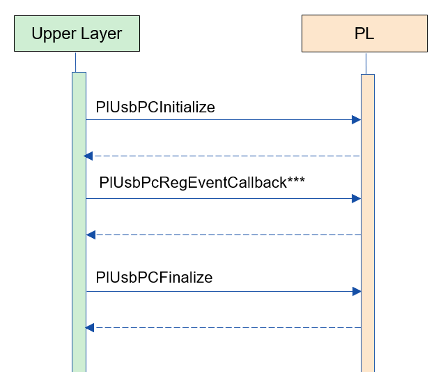
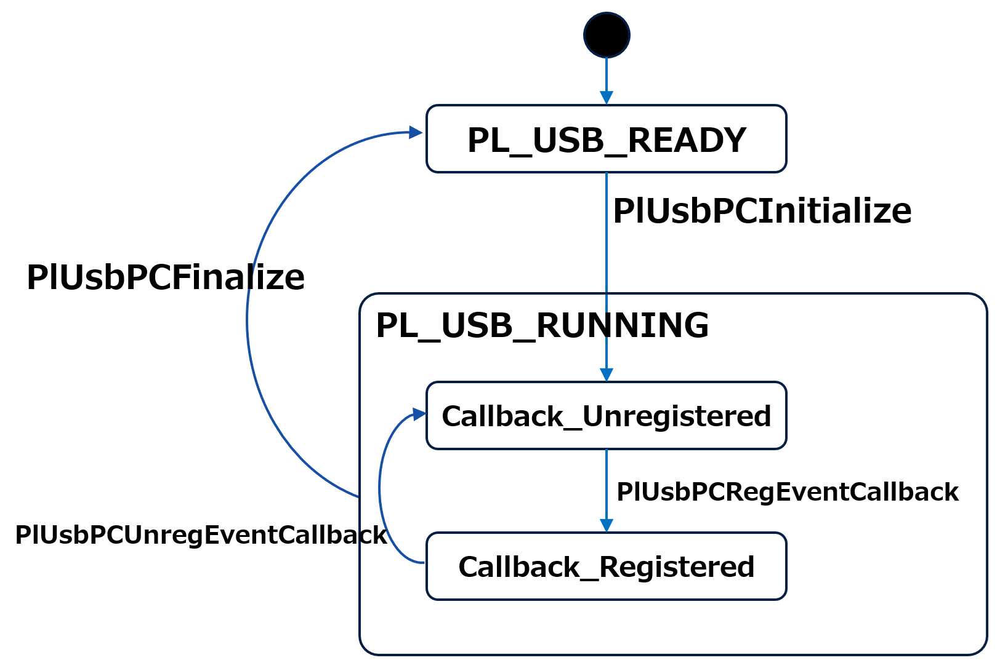
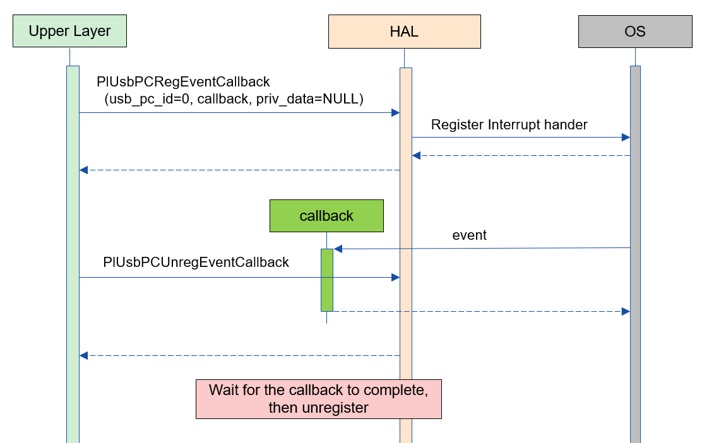

= PL USB Port Controller (LLM Translation)
:sectnums:
:sectnumlevels: 3
:chapter-label:
:revnumber: 0.0.2
:toc: left
:toc-title: Table of Contents
:toclevels: 3
:lang: en
:xrefstyle: short
:figure-caption: Figure
:table-caption: Table
:section-refsig:
:experimental:

== Purpose and Scope

This document describes the specifications of the PL USB Port Controller. 
The purpose of the PL USB Port Controller is to absorb the differences in USB Port Controller chips that vary between cameras. 
For example, the detection of USB device connection and disconnection events varies depending on the USB Port Controller chip or circuit connection, but the upper layer can use the event detection function without worrying about such differences.

<<<

== Terminology

[#_words]
.Term List
[options="header"]
|===
|Term |Description

|PL
|Porting layer. A layer that absorbs differences between camera/OS.

|I/F
|Interface

|PlUsbPC
|Pl USB Port Controller
|===

<<<

== Component Description

The purpose of the PL USB Port Controller is to absorb the differences in USB Port Controller chips that vary between cameras.

=== Component Overview

The software configuration diagram centered on this block is shown below.

.Diagram

<<<

=== Detailed Component Description

The usage sequence example of the PL USB Port Controller is shown below.

[#_button_seq]
.Sequence Overview

==== Dependent Blocks (For PL Internal Use)
.Dependent Blocks
[width="100%",options="header"]
|===
|Block Name |Usage |Link
|HAL IOexp
|For detecting interrupts during USB connection/disconnection
|https://github.com/aitrios/aitrios-edge-device-manager/blob/main/docs/spec/hal/ioexp/hal_ioexp.adoc

|HAL I2C
|For confirming USB Attach/Detach during USB connection/disconnection
|https://github.com/aitrios/aitrios-edge-device-manager/blob/main/docs/spec/hal/i2c/hal_i2c.adoc
|===

<<<

=== State Transitions

The states that the PL USB Port Controller can take are shown in <<#_TableStates>>.

[#_TableStates]
.State List
[width="100%", cols="20%,80%",options="header"]
|===
|State |Description
|PL_USB_READY
|PL USB Port Controller not initialized

|PL_USB_RUNNING
|PL USB Port Controller initialized

|Callback_Unregistered
|USB event callback not registered

|Callback_Registered
|USB event callback registered
|===

The PL USB Port Controller undergoes the state transitions shown in <<#_FigureState>>. +
State transitions do not occur in the case of errors in the respective API. +

[#_FigureState]
.State Transition Diagram

The acceptability of APIs and the state transition destinations in each state are shown in <<#_TableStateTransition>>. The state names in the table represent the transition destination state after the API execution, indicating that the API can be called. +
A × indicates that the API cannot be accepted, and calling the API will return an error without triggering a state transition. For details on errors, refer to <<#_PlErrCode, PlErrCode>>.

[#_TableStateTransition]
.State Transition Table
[width="100%", cols="10%,20%,20%,20%,20%"]
|===
2.3+| 3+|State
.2+|PL_USB_READY
2+|PL_USB_RUNNING
|Callback_Unregistered
|Callback_Registered
.20+|API Name

|``**PlUsbPCInitialize**``
|PL_USB_RUNNING
|×
|×

|``**PlUsbPCFinalize**``
|×
|PL_USB_READY
|PL_USB_READY

|``**PlUsbPCRegEventCallback**``
|×
|Callback_Registered
|×

|``**PlUsbPCUnregEventCallback**``
|×
|×
|Callback_Unregistered
|===

=== Component Function List

<<#_TableFunction>> shows the list of functions.

[#_TableFunction]
.Function List
[width="100%", cols="30%,55%,15%",options="header"]
|===
|Function Name |Description  |Section Number
|USB Connection/Disconnection Event Detection
|Detect USB connection/disconnection events.
|<<#_Function1, 3.5.1.>>
|===

<<<

=== Component Function Descriptions
[#_Function1]
==== USB Connection/Disconnection Event Detection
Function Overview::
Detect USB connection/disconnection events.
Prerequisites::
PlUsbPCInitialize has been executed.
Function Details::
See <<#_PlUsbPCRegEventCallback, PlUsbPCRegEventCallback>> and <<#_PlUsbPCUnregEventCallback, PlUsbPCUnregEventCallback>> for details.
Detailed Behavior::
See <<#_PlUsbPCRegEventCallback, PlUsbPCRegEventCallback>> and <<#_PlUsbPCUnregEventCallback, PlUsbPCUnregEventCallback>> for details.
Behavior in case of Error, Recovery Method::
See <<#_PlUsbPCRegEventCallback, PlUsbPCRegEventCallback>> and <<#_PlUsbPCUnregEventCallback, PlUsbPCUnregEventCallback>> for details.
Considerations::
None

=== Component Non-functional Requirements List

<<#_TableNonFunction>> shows the list of non-functional requirements.

[#_TableNonFunction]
.Non-functional Requirements List
[width="100%", cols="90%,10%",options="header"]
|===
|Function Name |Section Number
|Max Stack Usage
|<<#_NonFunctionStack, 3.7.>>

|Max Normal Heap Usage
|<<#_NonFunctionNormalHeap, 3.7.>>

|Max Static Data Usage
|<<#_NonFunctionStatic, 3.7.>>

|Performance
|<<#_NonFunctionPerformance, 3.7.>>
|===

=== Non-functional Requirements Descriptions

[#_NonFunctionStack]
==== Max Stack Usage
1 KB (provisional)

[#_NonFunctionNormalHeap]
==== Max Normal Heap Usage
1 KB (provisional)

[#_NonFunctionStatic]
==== Max Static Heap Usage
1 KB (provisional)

[#_NonFunctionPerformance]
==== Performance
Less than 1 ms

<<<

== API Specifications
=== Definition List
==== Data Type List

The data types are shown in <<#_TableDataType>>.

[#_TableDataType]
.Data Type List
[width="100%", cols="30%,55%,15%",options="header"]
|===
|Data Type Name |Description  |Section Number
|enum PlErrCode
|Enumeration type defining API execution results.
|<<#_PlErrCode, 4.3.1.>>
|enum PlUsbPCEvent
|Enumeration type representing USB connection/disconnection events.
|<<#_PlUsbPCEvent, 4.3.2.>>
|PlUsbPCEventCallback
|Function pointer for the USB connection/disconnection event callback.
|<<#_PlUsbPCEventCallback, 4.3.3.>>
|===

==== API List
The list of APIs is shown in <<#_TablePublicAPI>>.

[#_TablePublicAPI]
.List of APIs directly available to upper-level applications
[width="100%", cols="10%,60%,20%",options="header"]
|===
|API Name |Description |Section Number
|PlUsbPCInitialize
|Initializes this module.
|<<#_PlUsbPCInitialize, 4.4.1.>>

|PlUsbPCFinalize
|Finalizes this module.
|<<#_PlUsbPCFinalize, 4.4.2.>>

|PlUsbPCRegEventCallback
|Registers a callback to detect USB connection/disconnection events.
|<<#_PlUsbPCRegEventCallback, 4.4.3.>>

|PlUsbPCUnregEventCallback
|Unregisters the callback for detecting USB connection/disconnection events.
|<<#_PlUsbPCUnregEventCallback, 4.4.4.>>
|===

<<<

=== Build Configuration
[#_BuildConfig]
==== ESP32S3

* *Format* +
[source, C]
....
CONFIG_EXTERNAL_PL_USB_PORT_CTRL_NUM = 1
CONFIG_EXTERNAL_PL_USB_PORT_CTRL_DEV_ID = 1
CONFIG_EXTERNAL_PL_USB_PORT_CTRL_IOEXP_ID = 1
....

[#_BuildConfig_table]
.Description of BuildConfig
[width="100%", cols="30%,70%",options="header"]
|===
|Member Name  |Description
|CONFIG_EXTERNAL_PL_USB_PORT_CTRL_NUM
|Number of available USB ports.
|CONFIG_EXTERNAL_PL_USB_PORT_CTRL_DEV_ID
|Device number representing the USB Port Controller (for internal PL use). Used when calling the HAL I2C API.
|CONFIG_EXTERNAL_PL_USB_PORT_CTRL_IOEXP_ID
|Device number ID representing the IOexpander to which the USB Port Controller's interrupt pin is connected (for internal PL use). Used when registering interrupts.
|===

=== Data Type Definitions

[#_PlErrCode]
==== PlErrCode
Enumeration type defining API execution results.
(T.B.D.)

[#_PlUsbPCEvent]
==== PlUsbPCEvent
Enumeration type representing USB connection/disconnection events.

* *Format* +
[source, C]
....
typedef enum {
  PlUsbPCEventConnected,
  PlUsbPCEventDisconnected,
  PlUsbPCEventMax
} PlUsbPCEvent;
....

.Description of PlUsbPCEvent
[width="100%", cols="20%,80%",options="header"]
|===
|Member Name |Description
|PlUsbPCEventConnected
|Indicates that the USB has been connected.

|PlUsbPCEventConnected
|Indicates that the USB has been disconnected.

|PlUsbPCEventMax
|Maximum number of enum values
|===

[#_PlUsbPCEventCallback]
==== PlUsbPCEventCallback
Function pointer for the USB connection/disconnection event callback.

* *Format* +
[source, C]
....
void (*PlUsbPCRegEventCallback)(PlUsbPCEvent event, void *private_data)
....

=== API Descriptions
[#_PlUsbPCInitialize]
==== PlUsbPCInitialize
* *Function* +
Initializes the PL USB Port Controller.

* *Format* +
[source, C]
....
PlErrCode PlUsbPCInitialize(void)
....

* *Description of Arguments* +
-

* *Return Value* +
Returns a value of PlErrCode based on the execution result.

* *Description* +
** Initializes the PL USB Port Controller.

.API Details
[width="100%", cols="30%,70%",options="header"]
|===
|API Detail  |Description
|API Type
|Synchronous API
|Execution Context
|Runs in the caller's context.
|Concurrent Calls
|Possible
|Calls from Multiple Threads
|Possible
|Calls from Multiple Tasks
|Possible
|Blocking within API
|Blocks.
If PlUsbPCInitialize or PlUsbPCFinalize is already running in another context, it waits for completion before execution.
|===

.Error Information
[options="header"]
|===
|Error Code |Cause |OUT Argument State |System State After Error |Recovery Method
|kPlErrInvalidState (provisional)
|PlUsbPCInitialize has not been executed
|-
|No effect
|Not needed

|kPlErrLock/kPlErrUnlock (provisional)
|Blocking error
|-
|No effect
|Not needed

|kPlErrInternal (provisional)
|Failed to OPEN the specified Ioexp ID.
|-
|No effect
|Not needed

|kPlErrInvalidParam (provisional)
|Parameter error
|-
|No effect
|Not needed

|===

<<<

[#_PlUsbPCFinalize]
==== PlUsbPCFinalize
* *Function* +
Finalizes the PL USB Port Controller.

* *Format* +
[source, C]
....
PlErrCode PlUsbPCFinalize(void)
....

* *Description of Arguments* +
-

* *Return Value* +
Returns a value of PlErrCode based on the execution result.

* *Description* +
** Finalizes the PL USB Port Controller.

.API Details
[width="100%", cols="30%,70%",options="header"]
|===
|API Detail  |Description
|API Type
|Synchronous API
|Execution Context
|Runs in the caller's context.
|Concurrent Calls
|Possible
|Calls from Multiple Threads
|Possible
|Calls from Multiple Tasks
|Possible
|Blocking within API
|Blocks.
If PlUsbPCInitialize or PlUsbPCFinalize is already running in another context, it waits for completion before execution.
|===

.Error Information
[options="header"]
|===
|Error Code |Cause |OUT Argument State |System State After Error |Recovery Method
|kPlErrInvalidState (provisional)
|PlUsbPCInitialize has not been executed
|-
|No effect
|Not needed

|kPlErrLock/kPlErrUnlock (provisional)
|Blocking error
|-
|No effect
|Not needed

|kPlErrInternal (provisional)
|Failed to CLOSE the specified Ioexp ID.
|-
|No effect
|Not needed

|kPlErrInvalidParam (provisional)
|Parameter error
|-
|No effect
|Not needed
|===

[#_PlUsbPCRegEventCallback]
==== PlUsbPCRegEventCallback

* *Function* +
Registers a callback to detect USB connection/disconnection events.

* *Format* +
[source, C]
....
PlErrCode PlUsbPCRegEventCallback(uint32_t usb_pc_id, PlUsbPCEventCallback callback, void *private_data)
....

* *Description of Arguments* +
**[IN] uint32_t usb_pc_id**:: 
** Virtual number of the USB for which the event callback is to be registered.
** Specify a number less than CONFIG_EXTERNAL_PL_USB_PORT_CTRL_NUM in the build configuration.
*** Example: If CONFIG_EXTERNAL_PL_USB_PORT_CTRL_NUM = 1, only usb_pc_id = 0 can be used.
** If an ID not present in the CONFIG is specified, it returns an error.

**[IN] PlUsbPCEventCallback callback**:: 
** The event callback body. Returns an error if NULL.

**[IN] void *private_data**:: 
** User data set as an argument during callback execution. NULL is also acceptable.

* *Return Value* +
Returns a value of PlErrCode based on the execution result.

* *Description* +
** Registers a callback to detect USB connection/disconnection events.
** This API is available after PlUsbPCInitialize is executed.
** The event callback is executed in an interrupt context.
** Returns an error if a callback is already registered for the target usb_pc_id.

.API Details
[width="100%", cols="30%,70%",options="header"]
|===
|API Detail  |Description
|API Type
|Synchronous API
|Execution Context
|Runs in the caller's context.
|Concurrent Calls
|Possible
|Calls from Multiple Threads
|Possible
|Calls from Multiple Tasks
|Possible
|Blocking within API
|Blocks.
|===

.Error Information
[options="header"]
|===
|Error Code |Cause |OUT Argument State |System State After Error |Recovery Method
|kPlErrInvalidState (provisional)
|PlUsbPCInitialize has not been executed
|-
|No effect
|Not needed

|kPlErrInvalidParam (provisional)
|Parameter error
|-
|No effect
|Not needed

|kPlErrLock/kPlErrUnlock (provisional)
|Blocking error
|-
|No effect
|Not needed

|kPlErrAlread (provisional)
|Callback already registered
|-
|No effect
|Not needed

|kPlErrInternal (provisional)
|Failed to register the callback.
|-
|No effect
|Not needed

|===

<<<

[#_PlUsbPCUnregEventCallback]
==== PlUsbPCUnregEventCallback

* *Function* +
Unregisters the callback for detecting USB connection/disconnection events.

* *Format* +
[source, C]
....
PlErrCode PlUsbPCUnregEventCallback(uint32_t usb_pc_id)
....

* *Description of Arguments* +
**[IN] uint32_t usb_pc_id**:: 
Virtual number of the USB for which the event callback is to be unregistered.

* *Return Value* +
Returns a value of PlErrCode based on the execution result.

* *Description* +
** Unregisters the callback for detecting USB connection/disconnection events.
** Specify a number less than CONFIG_EXTERNAL_PL_USB_PORT_CTRL_NUM in the build configuration.
*** Example: If CONFIG_EXTERNAL_PL_USB_PORT_CTRL_NUM = 1, only usb_pc_id = 0 can be used.
** This API is available after PlUsbPCInitialize is executed.
** Returns an error if no callback is registered for the target usb_pc_id.
** If a callback for the target usb_pc_id is running, this process waits for completion before execution.

.API Details
[width="100%", cols="30%,70%",options="header"]
|===
|API Detail  |Description
|API Type
|Synchronous API
|Execution Context
|Runs in the caller's context.
|Concurrent Calls
|Possible
|Calls from Multiple Threads
|Possible
|Calls from Multiple Tasks
|Possible
|Blocking within API
|Blocks.
|===

.Error Information
[options="header"]
|===
|Error Code |Cause |OUT Argument State |System State After Error |Recovery Method
|kPlErrInvalidState (provisional)
|PlUsbPCInitialize has not been executed
|-
|No effect
|Not needed

|kPlErrInvalidParam (provisional)
|Parameter error
|-
|No effect
|Not needed

|kPlErrAlread (provisional)
|Callback already unregistered
|-
|No effect
|Not needed

|kPlErrInternal (provisional)
|Failed to unregister the callback.
|-
|No effect
|Not needed
|===

<<<

== API Usage Examples
=== Example of Registering and Unregistering Callbacks
.Example of Registering and Unregistering Callbacks

== Special Notes and Component-Specific Information

== List of OSS Used
None

<<<

== References

<<<

== Change Log
[width="100%", cols="20%,80%",options="header"]
|===
|Version |Changes 
|0.0.1
|First edition

|0.0.2
|- Overall: Added spaces around English words for readability +
- Changed HAL to PL +
- Deleted HAL terms and replaced them with PL +
- Changed HAL_READY/HAL_RUNNING to PL_USB_READY/PL_USB_RUNNING +
- Added PlErrCode to data types +
- Moved PlUsbPCInitialize/PlUsbPCFinalize APIs to the beginning +
- Modified error codes for PlUsbPCFinalize +
- Modified error codes for PlUsbPCRegEventCallback +
- Modified error codes for PlUsbPCUnregEventCallback +
- Updated figures (*.png) to English
|===
