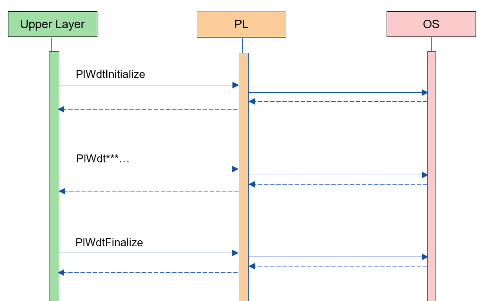
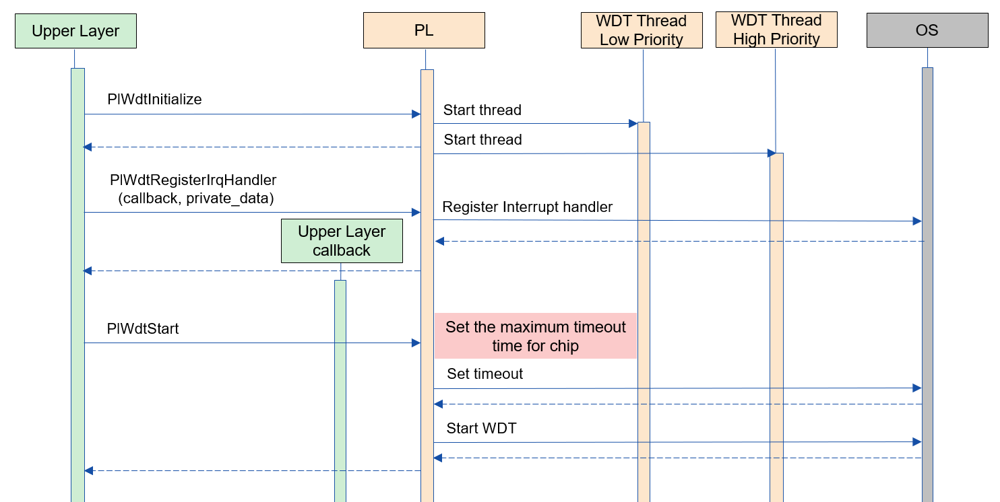
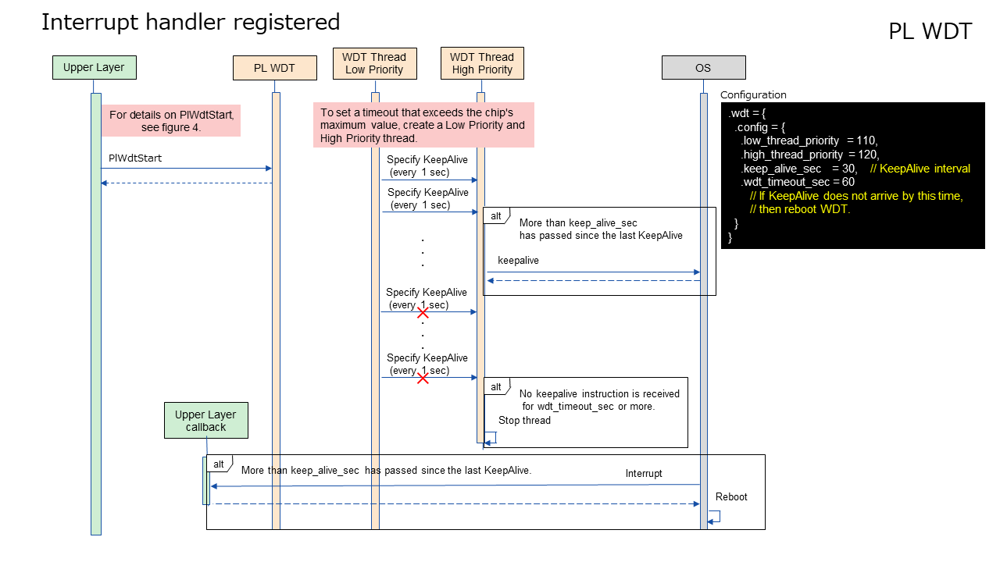
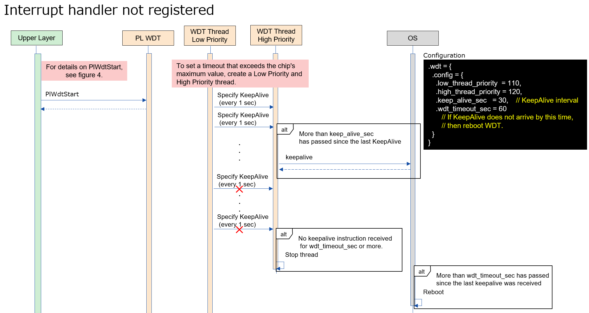
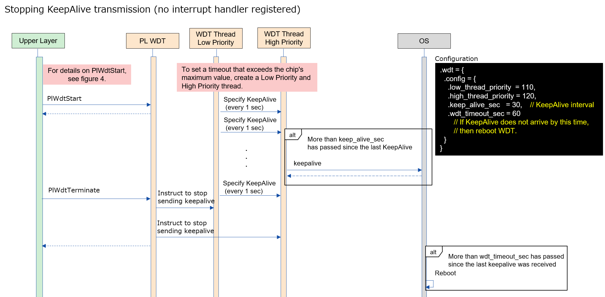
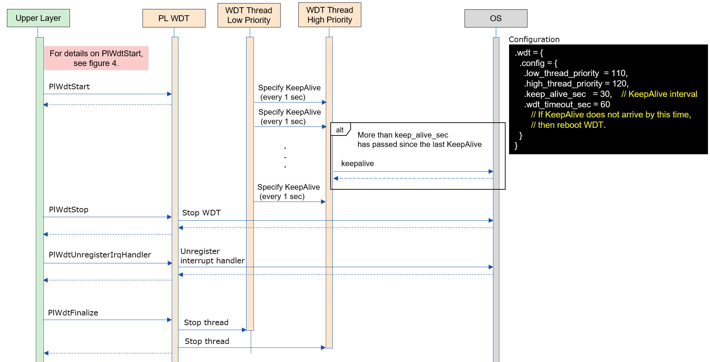

= PL WDT
:sectnums:
:sectnumlevels: 3
:chapter-label:
:revnumber: 0.0.2
:toc: left
:toc-title: 目次
:toclevels: 3
:lang: ja
:xrefstyle: short
:figure-caption: Figure
:table-caption: Table
:section-refsig:
:experimental:

== 目的と適用範囲
本書では AITRIOS PL I/F レイヤーの一つである、PL WDT の仕様について記載します。PL WDT の目的は、カメラ毎に異なる WDT の制御差分を吸収することです。WDT 発火時の割り込みハンドラの設定や、WDT の起動・停止を行います。

<<<

== 用語

[#_words]
.用語一覧
[options="header"]
|===
|用語 |説明 

|PL
|Porting Layer. カメラ/OS 差分を吸収する層

|WDTL
|Watch Dog Timer. タイマーを使用してシステムを監視する仕組み

|I/F
|Interface
|===

<<<

== コンポーネントの説明
PL WDT レイヤーは、カメラ差分を意識せずに使える PL I/F に対する本体部分であり、WDT の制御に関するカメラ差分を吸収することを目的としています。 また、ターゲットとするカメラに合わせて追加・変更が可能です。

=== コンポーネントの概要
以下に本ブロックを中心としたソフトウェア構成図を示します。

.概要図
image::./images/wdt_layer.png[scaledwidth="100%",align="center"]

<<<

=== コンポーネントの詳細説明
PL WDT の使用シーケンス例を以下に示します。 +
上位レイヤーは PlWdtInitialize を実行後、PL WDT API を使用して各種 WDT 機能を使うことができます。

[#_button_seq]
.シーケンス概要

==== 依存ブロック（PL 内部向け）
.依存ブロック
[width="100%",options="header"]
|===
|ブロック名 |利用用途 |リンク
|Pl WDTLib
|WDT を制御するために使用します。
|https://github.com/aitrios/aitrios-edge-device-manager/blob/main/docs/spec/porting_layer/power_manager/wdt/pl_wdt_lib_ja.adoc

|===

<<<

=== 状態遷移
PL WDT の取り得る状態を <<#_TableStates>> に示します。

[#_TableStates]
.状態一覧
[width="100%", cols="20%,80%",options="header"]
|===
|状態 |説明 

|PL_WDT_READY
|PL WDT 未初期化。

|PL_WDT_RUNNING
|PL WDT 初期化済み。

|WDT_STOP
|WDT 停止中。PL_WDT_RUNNING のサブ状態です。

|WDT_START
|WDT 起動中。PL_WDT_RUNNING のサブ状態です。
|===

[#_FigureState]
.状態遷移図
image::./images/wdt_state.png[scaledwidth="100%",align="center"]

各状態での API 受け付け可否と状態遷移先を <<#_TableStateTransition>> に示します。表中の状態名は、API 実行完了後の遷移先状態を示し、すなわち API 呼び出し可能であることを示します。 +
× は API 受け付け不可を示し、ここでの API 呼び出しはエラーを返し状態遷移は起きません。エラーの詳細は <<#_PlErrCode>> を参照してください。 

[#_TableStateTransition]
.状態遷移表
[width="100%", cols="10%,20%,20%,20%,20%"]
|===
2.3+| 3+|状態
.2+|PL_WDT_READY
2+|PL_WDT_RUNNING
|WDT_STOP
|WDT_START
.20+|API 名

|``**PlWdtInitialize**``
|PL_WDT_RUNNING
|×
|×

|``**PlWdtFinalize**``
|×
|PL_WDT_READY
|PL_WDT_READY

|``**PlWdtStart**``
|×
|WDT_START
|×

|``**PlWdtStop**``
|×
|×
|WDT_STOP

|``**PlWdtRegisterIrqHandler**``
|×
|WDT_STOP
|×

|``**PlWdtUnregisterIrqHandler**``
|×
|WDT_STOP
|×

|``**PlWdtTerminate**``
|×
|×
|WDT_START

|``**PlWdtKeepAlive**``
|PL_WDT_READY
|WDT_STOP
|WDT_START
|===
<<<

=== コンポーネントの機能一覧
<<#_TableFunction>> を以下に示します。

[#_TableFunction]
.機能一覧
[width="100%", cols="30%,55%,15%",options="header"]
|===
|機能名 |概要  |節番号
|PL WDT の起動・停止
|WDT を起動・停止します。
|<<#_Function1, 3.5.1.>>

|WDT の割り込み設定
|割り込みハンドラを登録・解除します。
|<<#_Function2, 3.5.2.>>

|KeepAlive 送信停止
|WDT への KeepAlive の送信を停止します。
|<<#_Function3, 3.5.3.>>

|KeepAlive 送信
|WDT へ KeepAlive を送信します。
|<<#_Function4, 3.5.4.>>
|===

<<<

=== コンポーネントの機能説明
[#_Function1]
==== PL WDT の起動・停止
機能概要::
WDT を起動・停止します。
前提条件::
PlWdtInitialize が実行済みであること。
機能詳細::
WDT の起動は <<#_PlWdtStart, PlWdtStart>> を参照してください。 +
WDT の停止は <<#_PlWdtStop, PlWdtStop>> を参照してください。
詳細挙動::
WDT の起動は <<#_PlWdtStart_disc, PlWdtStart>> を参照してください。 +
WDT の停止は <<#_PlWdtStop_disc, PlWdtStop>> を参照してください。
エラー時の挙動、復帰方法::
WDT の起動は <<#_PlWdtStart_error, PlWdtStart>> を参照してください。 +
WDT の停止は <<#_PlWdtStop_error, PlWdtStop>> を参照してください。
検討事項::
なし

[#_Function2]
==== WDT の割り込み設定
機能概要::
割り込みハンドラの登録・解除を行います。 +
割り込み登録を行わない場合、WDT が発火した際に再起動を行います。
前提条件::
PlWdtInitialize が実行済みであること。 +
PL WDT の状態が <<#_TableStates, WDT_STOP>> であること。
機能詳細::
割り込みハンドラの登録は <<#_PlWdtRegisterIrqHandler, PlWdtRegisterIrqHandler>> を参照してください。 +
割り込みハンドラの解除は <<#_PlWdtUnregisterIrqHandler, PlWdtUnregisterIrqHandler>> を参照してください。
詳細挙動::
割り込みハンドラの登録は <<#_PlWdtRegisterIrqHandler_disc, PlWdtRegisterIrqHandler>> を参照してください。 +
割り込みハンドラの解除は <<#_PlWdtUnregisterIrqHandler_disc, PlWdtUnregisterIrqHandler>> を参照してください。
エラー時の挙動、復帰方法::
割り込みハンドラの登録は <<#_PlWdtRegisterIrqHandler_error, PlWdtRegisterIrqHandler>> を参照してください。 +
割り込みハンドラの解除は <<#_PlWdtUnregisterIrqHandler_error, PlWdtUnregisterIrqHandler>> を参照してください。
検討事項::
なし

[#_Function3]
==== KeepAlive 送信停止
機能概要::
WDT への KeepAlive の送信を停止します。
前提条件::
PlWdtInitialize が実行済みであること。 +
PL WDT の状態が <<#_TableStates, WDT_START>> であること。
機能詳細::
KeepAlive 送信停止は <<#_PlWdtTerminate, PlWdtTerminate>> を参照してください。
詳細挙動::
KeepAlive 送信停止は <<#_PlWdtTerminate_disc, PlWdtTerminate>> を参照してください。
エラー時の挙動、復帰方法::
KeepAlive 送信停止は <<#_PlWdtTerminate_error, PlWdtTerminate>> を参照してください。
検討事項::
なし

[#_Function4]
==== KeepAlive 送信
機能概要::
WDT へ KeepAlive を送信します。
前提条件::
なし
機能詳細::
詳細は <<#_PlWdtKeepAlive, PlWdtKeepAlive>> を参照してください。
詳細挙動::
詳細は <<#_PlWdtKeepAlive_disc, PlWdtKeepAlive>> を参照してください。
エラー時の挙動、復帰方法::
詳細は <<#_PlWdtKeepAlive_error, PlWdtKeepAlive>> を参照してください。
検討事項::
なし

=== コンポーネントの非機能要件一覧

<<#_TableNonFunction>> を以下に示します。

[#_TableNonFunction]
.非機能要件一覧
[width="100%", cols="30%,55%,15%",options="header"]
|===
|機能名 |概要  |節番号
|Stack 最大使用量
|PL WDT が使用する最大スタックサイズ
|<<#_stack, 3.7.>>

|ヒープ最大使用量
|PL WDT が使用する最大ヒープサイズ
|<<#_heap, 3.7.>>

|staticデータ最大使用量
|PL WDT が使用する最大 static データサイズ
|<<#_static, 3.7.>>

|パフォーマンス
|PL WDT が提供する機能のパフォーマンス
|<<#_paformance, 3.7.>>
|===

=== コンポーネントの非機能要件説明
[#_stack]
==== Stack 最大使用量
512 バイト + 8192 バイト (Thread 2 つ) = 8704 バイト

==== ヒープ最大使用量
[#_heap]
PL WDT ではヒープを使用しません。

[#_static]
==== static データ最大使用量
256 バイト

[#_paformance]
==== パフォーマンス
1 ミリ秒未満

<<<

== API 仕様
=== 定義一覧
==== データ型一覧
<<#_TableDataType>> を以下に示します。

[#_TableDataType]
.データ型一覧
[width="100%", cols="30%,55%,15%",options="header"]
|===
|データ型名 |概要  |節番号
|enum PlErrCode
|API の実行結果を定義する列挙型です。
|<<#_PlErrCode, 4.2.1.>>

|PlWdtIrqHandler
|WDT の割り込みハンドラを表す関数ポインタです。
|<<#_PlWdtIrqHandler, 4.2.2.>>

|===

==== API 一覧
<<#_TablePublicAPI>> を以下に示します。

[#_TablePublicAPI]
.上位レイヤーから直接使用可能な API
[width="100%", cols="10%,60%,20%",options="header"]
|===
|API 名 |概要 |節番号
|PlWdtInitialize
|WDT を使用可能状態にします。
|<<#_PlWdtInitialize, 4.3.1.>>

|PlWdtFinalize
|WDT を使用不可状態にします。
|<<#_PlWdtFinalize, 4.3.2.>>

|PlWdtStart
|WDT を起動します。
|<<#_PlWdtStart, 4.3.3.>>

|PlWdtStop
|WDT を停止します。
|<<#_PlWdtStop, 4.3.4.>>

|PlWdtRegisterIrqHandler
|割り込みハンドラを登録します。
|<<#_PlWdtRegisterIrqHandler, 4.3.5.>>

|PlWdtUnregisterIrqHandler
|割り込みハンドラの登録を解除します。
|<<#_PlWdtUnregisterIrqHandler, 4.3.6.>>

|PlWdtTerminate
|KeepAlive の送信を停止します。
|<<#_PlWdtTerminate, 4.3.7.>>

|PlWdtKeepAlive
|WDT に KeepAlive を送信します。
|<<#_PlWdtKeepAlive, 4.3.8.>>
|===

<<<

=== ビルドコンフィグ
[#_BuildConfig]
==== ビルドコンフィグ (esp32s3 の場合)
WDT の設定情報をビルドコンフィグに記載します。

* *書式* +
[source, C]
....
CONFIG_EXTERNAL_PL_WDT_NUM=2
CONFIG_EXTERNAL_PL_WDT_LOW_THREAD_PRIORITY=50
CONFIG_EXTERNAL_PL_WDT_HIGH_THREAD_PRIORITY=120
CONFIG_EXTERNAL_PL_WDT_KEEP_ALIVE_SEC=10
CONFIG_EXTERNAL_PL_WDT0_TIMEOUT_SEC=60
CONFIG_EXTERNAL_PL_WDT1_TIMEOUT_SEC=70
....

[#_BuildConfig_table]
.BuildConfig の説明
[width="100%", cols="30%,70%",options="header"]
|===
|メンバ名  |説明
|CONFIG_EXTERNAL_PL_WDT_NUM
|使用する WDT の個数。 +
個数に合わせて OS の CONFIG の定義を変更してください。 +
CONFIG_ESP32_MWDT0, CONFIG_ESP32_MWDT1
|CONFIG_EXTERNAL_PL_WDT_LOW_THREAD_PRIORITY
|KeepAlive 送信用スレッド (優先度低) の優先度
|CONFIG_EXTERNAL_PL_WDT_HIGH_THREAD_PRIORITY
|KeepAlive 送信用スレッド (優先度高) の優先度
|CONFIG_EXTERNAL_PL_WDT_KEEP_ALIVE_SEC
|KeepAlive 送信間隔 [sec]。タイムアウト時間以上に設定した場合はサポート外です。
|CONFIG_EXTERNAL_PL_WDT0_TIMEOUT_SEC
|WDT0 のタイムアウト時間 [sec]。1 秒以下の場合はサポート外です。
|CONFIG_EXTERNAL_PL_WDT1_TIMEOUT_SEC
|WDT1 のタイムアウト時間 [sec]。1 秒以下の場合はサポート外です。
|===
<<<

=== データ型定義
[#_PlErrCode]
==== PlErrCode
API の実行結果を定義する列挙型です。 +
(T.B.D.)

[#_PlWdtIrqHandler]
==== PlWdtIrqHandler
WDT 割り込みハンドラ本体を表す関数ポインタです。 +
システムがWDT割り込みを検出した際に実行されます。

* *書式* +
[source, C]
....
typedef void (*PlWdtIrqHandler)(void *private_data)
....

* *引数の説明* +
**[IN] void *private_data**::
PlWdtRegisterIrqHandler で指定された private_data がセットされます。

<<<

=== 各APIの説明

[#_PlWdtInitialize]
==== PlWdtInitialize

* *機能* +
PL WDT を使用可能状態にします。

* *書式* +
[source, C]
....
PlErrCode PlWdtInitialize(const PlConfigObj *wdt_root)
....
* *引数の説明* +
**[IN] PlConfigObj *wdt_root**::
Config オブジェクト データ。NULL の場合エラーを返します。

* *戻り値* +
実行結果に応じて PlErrCode のいずれかの値が返ります。

* *説明* +
** PL WDT を使用可能状態にします。

[#_PlWdtInitialize_disc]
.API 詳細情報
[width="100%", cols="30%,70%",options="header"]
|===
|API 詳細情報  |説明
|API 種別
|同期 API
|実行コンテキスト
|呼び元のコンテキストで動作
|同時呼び出し
|不可能
|複数スレッドからの呼び出し
|可能
|複数タスクからの呼び出し
|可能
|API 内部でブロッキングするか
|ブロッキングする。
PL WDT API が他のコンテキストで動作中の場合、完了を待ってから実行されます。ただし、二重に Initialize を実行した場合、エラーになります。
|===

[#_PlWdtInitialize_error]
.エラー情報
[options="header"]
|===
|エラーコード |原因 |OUT 引数の状態 |エラー後のシステム状態 |復旧方法
|kPlErrInvalidState (仮)
|すでに使用可能状態になっている。
|-
|影響なし
|不要

|kPlErrInvalidParam (仮)
|パラメータエラー
|-
|影響なし
|不要

|kPlErrLock (仮)
|ブロッキングエラー
|-
|影響なし
|不要
|===

<<<

[#_PlWdtFinalize]
==== PlWdtFinalize
* *機能* +
PL WDT を使用不可状態にします。

* *書式* +
[source, C]
....
PlErrCode PlWdtFinalize(void)
....

* *引数の説明* +
-

* *戻り値* +
実行結果に応じて PlErrCode のいずれかの値が返ります。

* *説明* +
** PL WDT を使用不可状態にします。
** 本 API は PlWdtInitialize の実行後に使用可能です。

[#_PlWdtFinalize_disc]
.API 詳細情報
[width="100%", cols="30%,70%",options="header"]
|===
|API 詳細情報  |説明
|API 種別
|同期 API
|実行コンテキスト
|呼び元のコンテキストで動作
|同時呼び出し
|不可能
|複数スレッドからの呼び出し
|可能
|複数タスクからの呼び出し
|可能
|API 内部でブロッキングするか
|ブロッキングする。
PL WDT API が他のコンテキストで動作中の場合、完了を待ってから実行されます。PL impl 実装者は、PL API 内で実行してください。ただし、二重に Finalize を実行した場合、エラーになります。
|===

[#_PlWdtFinalize_error]
.エラー情報
[options="header"]
|===
|エラーコード |原因 |OUT 引数の状態 |エラー後のシステム状態 |復旧方法
|kPlErrInvalidState (仮)
|PlWdtInitialize が実行されていない
|-
|影響なし
|不要

|kPlErrLock (仮)
|ブロッキングエラー
|-
|影響なし
|不要
|===

<<<

[#_PlWdtStart]
==== PlWdtStart

* *機能* +
WDT を起動します。

* *書式* +
[source, C]
....
PlErrCode PlWdtStart(void)
....
* *引数の説明* +
-

* *戻り値* +
実行結果に応じて PlErrCode のいずれかの値が返ります。

* *説明* +
** ** <<#_BuildConfig, CONFIG_EXTERNAL_PL_WDT_NUM>> 個の WDT を起動します。
** PL WDT の状態が <<#_TableStates, WDT_START>> の場合は、エラーを返します。
** WDT 起動後に <<#_BuildConfig, CONFIG_EXTERNAL_PL_WDT*_TIMEOUT_SEC>> [sec] 以上 KeepAlive が送信されなかった時、<<#_PlWdtRegisterIrqHandler, PlWdtRegisterIrqHandler>> で割り込みハンドラを登録していた場合は、登録した割り込みハンドラが実行され、割り込みハンドラがリターンした後に SW リセットを行います。
** WDT 起動後に <<#_BuildConfig, CONFIG_EXTERNAL_PL_WDT*_TIMEOUT_SEC>> [sec] 以上 KeepAlive が送信されなかった時、割り込みハンドラを登録していない場合は、再起動を実施します。

[#_PlWdtStart_disc]
.API 詳細情報
[width="100%", cols="30%,70%",options="header"]
|===
|API 詳細情報  |説明
|API 種別
|同期 API
|実行コンテキスト
|呼び元のコンテキストで動作
|同時呼び出し
|可能
|複数スレッドからの呼び出し
|可能
|複数タスクからの呼び出し
|可能
|API 内部でブロッキングするか
|ブロッキングする。
PL WDT API が他のコンテキストで動作中の場合、完了を待ってから実行されます。
|===

[#_PlWdtStart_error]
.エラー情報
[options="header"]
|===
|エラーコード |原因 |OUT 引数の状態 |エラー後のシステム状態 |復旧方法
|kPlErrInvalidState (仮)
|PlWdtInitialize が実行されていない。
|-
|影響なし
|不要

|kPlErrLock (仮)
|ブロッキングエラー
|-
|影響なし
|不要
|===

<<<

[#_PlWdtStop]
==== PlWdtStop

* *機能* +
WDT を停止します。

* *書式* +
[source, C]
....
PlErrCode PlWdtStop(void)
....
* *引数の説明* +
-

* *戻り値* +
実行結果に応じて PlErrCode のいずれかの値が返ります。

* *説明* +
** WDT を停止します。
** PL WDT の状態が <<#_TableStates, WDT_STOP>> の場合は、エラーを返します。

[#_PlWdtStop_disc]
.API 詳細情報
[width="100%", cols="30%,70%",options="header"]
|===
|API 詳細情報  |説明
|API 種別
|同期 API
|実行コンテキスト
|呼び元のコンテキストで動作
|同時呼び出し
|可能
|複数スレッドからの呼び出し
|可能
|複数タスクからの呼び出し
|可能
|API 内部でブロッキングするか
|ブロッキングする。
PL WDT API が他のコンテキストで動作中の場合、完了を待ってから実行されます。
|===

[#_PlWdtStop_error]
.エラー情報
[options="header"]
|===
|エラーコード |原因 |OUT 引数の状態 |エラー後のシステム状態 |復旧方法
|kPlErrInvalidState (仮)
|PlWdtInitialize が実行されていない。
|-
|影響なし
|不要

|kPlErrLock (仮)
|ブロッキングエラー
|-
|影響なし
|不要
|===

<<<

[#_PlWdtRegisterIrqHandler]
==== PlWdtRegisterIrqHandler

* *機能* +
割り込みハンドラを登録します。

* *書式* +
[source, C]
....
PlErrCode PlWdtRegisterIrqHandler(PlWdtIrqHandler handler, void *private_data)
....
* *引数の説明* +
**[IN] <<#_PlWdtIrqHandler, PlWdtIrqHandler>> handler**::
割り込みハンドラ。NULL の場合はエラーを返します。

**[IN] void *private_data**::
割り込みハンドラのデータ。NULL でも問題ありません。

* *戻り値* +
実行結果に応じて PlErrCode のいずれかの値が返ります。

* *説明* +
** <<#_BuildConfig, CONFIG_EXTERNAL_PL_WDT_NUM>> 個の WDT のうち、 WDT0 に割り込みハンドラを登録します。
** PL WDT の状態が <<#_TableStates, WDT_START>> の場合は、エラーを返します。
** 割り込みハンドラ登録済みの場合は、エラーを返します。
** 登録された割り込みハンドラは、<<#_BuildConfig, CONFIG_EXTERNAL_PL_WDT0_TIMEOUT_SEC>> [sec] 以上の期間 KeepAlive 送信スレッドから WDT0 へ KeepAlive が送信されなかった時に実行されます。
** 登録された割り込みハンドラがリターンした後、PL WDT は SW リセットを行います。割り込みハンドラがリターンしない場合、WDT0 では SW リセットは行われず、 WDT1 が実行された時に再起動を行います。

TIP: <<#_BuildConfig, CONFIG_EXTERNAL_PL_WDT*_TIMEOUT_SEC>> が 60 [sec] 以下の場合、<<#_BuildConfig, CONFIG_EXTERNAL_PL_WDT*_TIMEOUT_SEC>> をチップに登録します。 +
<<#_BuildConfig, CONFIG_EXTERNAL_PL_WDT*_TIMEOUT_SEC>> が 61 [sec] 以上の場合、チップにはタイムアウト時間を 60 [sec] として登録し、KeepAlive 送信スレッドでタイムアウト時間を制御します。

[#_PlWdtRegisterIrqHandler_disc]
.API 詳細情報
[width="100%", cols="30%,70%",options="header"]
|===
|API 詳細情報  |説明
|API 種別
|同期 API
|実行コンテキスト
|呼び元のコンテキストで動作
|同時呼び出し
|可能
|複数スレッドからの呼び出し
|可能
|複数タスクからの呼び出し
|可能
|API 内部でブロッキングするか
|ブロッキングする。
PL WDT API が他のコンテキストで動作中の場合、完了を待ってから実行されます。
|===

[#_PlWdtRegisterIrqHandler_error]
.エラー情報
[options="header"]
|===
|エラーコード |原因 |OUT 引数の状態 |エラー後のシステム状態 |復旧方法
|kPlErrInvalidState (仮)
|PlWdtInitialize が実行されていない。 +
|-
|影響なし
|不要

|kPlErrInvalidParam (仮)
|パラメータエラー
|-
|影響なし
|不要

|kPlErrLock (仮)
|ブロッキングエラー
|-
|影響なし
|不要
|===

<<<

[#_PlWdtUnregisterIrqHandler]
==== PlWdtUnregisterIrqHandler

* *機能* +
割り込みハンドラの登録を解除します。

* *書式* +
[source, C]
....
PlErrCode PlWdtUnregisterIrqHandler(void)
....
* *引数の説明* +
-

* *戻り値* +
実行結果に応じて PlErrCode のいずれかの値が返ります。

* *説明* +
** 割り込みハンドラの登録を解除します。
** PL WDT の状態が <<#_TableStates, WDT_START>> の場合は、エラーを返します。
** 割り込みハンドラが登録されていない場合は、エラーを返します。

[#_PlWdtUnregisterIrqHandler_disc]
.API 詳細情報
[width="100%", cols="30%,70%",options="header"]
|===
|API 詳細情報  |説明
|API 種別
|同期 API
|実行コンテキスト
|呼び元のコンテキストで動作
|同時呼び出し
|可能
|複数スレッドからの呼び出し
|可能
|複数タスクからの呼び出し
|可能
|API 内部でブロッキングするか
|ブロッキングする。
PL WDT API が他のコンテキストで動作中の場合、完了を待ってから実行されます。
|===

[#_PlWdtUnregisterIrqHandler_error]
.エラー情報
[options="header"]
|===
|エラーコード |原因 |OUT 引数の状態 |エラー後のシステム状態 |復旧方法
|kPlErrInvalidState (仮)
|PlWdtInitialize が実行されていない。 +
|-
|影響なし
|不要

|kPlErrLock (仮)
|ブロッキングエラー
|-
|影響なし
|不要
|===

<<<

[#_PlWdtTerminate]
==== PlWdtTerminate

* *機能* +
WDT への KeepAlive の送信を停止します。

* *書式* +
[source, C]
....
PlErrCode PlWdtTerminate(void)
....
* *引数の説明* +
-

* *戻り値* +
実行結果に応じて PlErrCode のいずれかの値が返ります。

* *説明* +
** WDT への KeepAlive の送信を停止します。
** PL WDT の状態が <<#_TableStates, WDT_STOP>> の場合は、エラーを返します。
** KeepAlive の送信停止後、<<#_BuildConfig, CONFIG_EXTERNAL_PL_WDT0_TIMEOUT_SEC>> [sec] 後に WDT が発火します。
** <<#_BuildConfig, CONFIG_EXTERNAL_PL_WDT0_TIMEOUT_SEC>> が 61 [sec] 以上の場合は、60 [sec] 後に WDT が発火します。

[#_PlWdtTerminate_disc]
.API 詳細情報
[width="100%", cols="30%,70%",options="header"]
|===
|API 詳細情報  |説明
|API 種別
|同期 API
|実行コンテキスト
|呼び元のコンテキストで動作
|同時呼び出し
|可能
|複数スレッドからの呼び出し
|可能
|複数タスクからの呼び出し
|可能
|API 内部でブロッキングするか
|ブロッキングする。
PL WDT API が他のコンテキストで動作中の場合、完了を待ってから実行されます。
|===

[#_PlWdtTerminate_error]
.エラー情報
[options="header"]
|===
|エラーコード |原因 |OUT 引数の状態 |エラー後のシステム状態 |復旧方法
|kPlErrInvalidState (仮)
|PlWdtInitialize が実行されていない。 +
|-
|影響なし
|不要

|kPlErrLock (仮)
|ブロッキングエラー
|-
|影響なし
|不要
|===

<<<

[#_PlWdtKeepAlive]
==== PlWdtKeepAlive

* *機能* +
WDT へ KeepAlive を送信します。

* *書式* +
[source, C]
....
PlErrCode PlWdtKeepAlive(void)
....
* *引数の説明* +
-

* *戻り値* +
実行結果に応じて PlErrCode のいずれかの値が返ります。

* *説明* +
** WDT へ KeepAlive を送信します。
** 本 API は状態に関わらず実行が可能です。
** 本 API 実行後、WDTのタイムアウト時間がリセットされます。

[#_PlWdtTerminate_disc]
.API 詳細情報
[width="100%", cols="30%,70%",options="header"]
|===
|API 詳細情報  |説明
|API 種別
|同期 API
|実行コンテキスト
|呼び元のコンテキストで動作
|同時呼び出し
|可能
|複数スレッドからの呼び出し
|可能
|複数タスクからの呼び出し
|可能
|API 内部でブロッキングするか
|ブロッキングする。
PL WDT API が他のコンテキストで動作中の場合、完了を待ってから実行されます。
|===

[#_PlWdtTerminate_error]
.エラー情報
[options="header"]
|===
|エラーコード |原因 |OUT 引数の状態 |エラー後のシステム状態 |復旧方法
|kPlErrInternal (仮)
|内部で使用している関数が失敗
|-
|影響なし
|不要

|kPlErrLock (仮)
|ブロッキングエラー
|-
|影響なし
|不要
|===

<<<

== API 使用時の呼び出し例
=== PlWdtStart の一例
.PlWdtStart

=== WDT 発火時の一例 (割り込みハンドラ登録あり)
.PL WDT interrupt (Registered)

=== WDT 発火時の一例 (割り込みハンドラ登録なし)
.PL WDT interrupt (Unregistered)

=== KeepAlive 送信停止の一例
.PL WDT terminate

=== PlWdtStop の一例
.PlWdtStop

== 使用している OSS の一覧
なし

<<<

== 更新履歴
[width="100%", cols="20%,80%",options="header"]
|===
|Version |Changes 
|0.0.1
|初版

|0.0.2
|- 全体 : 英単語の前後に半角空白を挿入 (読みやすくするため) +
- 依存ブロック : Osal Msg を削除 +
- PL の記述を PL WDT に変更
- READY/RUNNING を PL_SYSCTL_READY/PL_SYSCTL_RUNNING に変更 +
- データ型に PlErrCode を追加 +
- PlWdtInitialize/PlWdtFinalize API の並びを先頭に変更 +
- PlWdtInitialize のエラーコードを変更 +
- PlWdtFinalize のエラーコードを変更 +
- PlWdtStart のエラーコードを変更 +
- PlWdtStop のエラーコードを変更 +
- PlWdtRegisterIrqHandler のエラーコードを変更 +
- PlWdtUnregisterIrqHandler のエラーコードを変更 +
- PlWdtTerminate のエラーコードを変更 +
- 図 (*.png) を英語表記に変更

|0.0.3
|- 全体 : +
PlWdtKeepAliveを追加 +
WDTに割り込みハンドラを登録した場合の仕様を変更 +
|===
