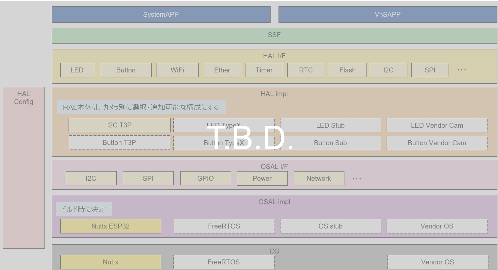
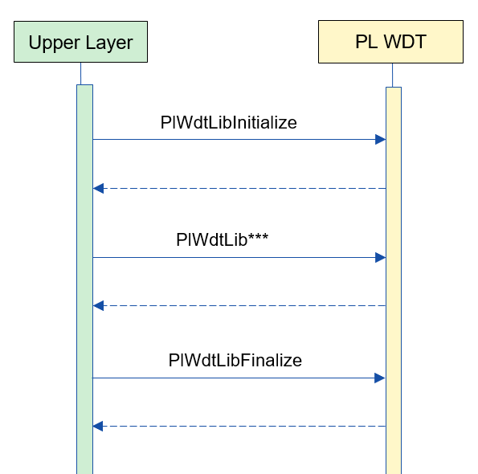
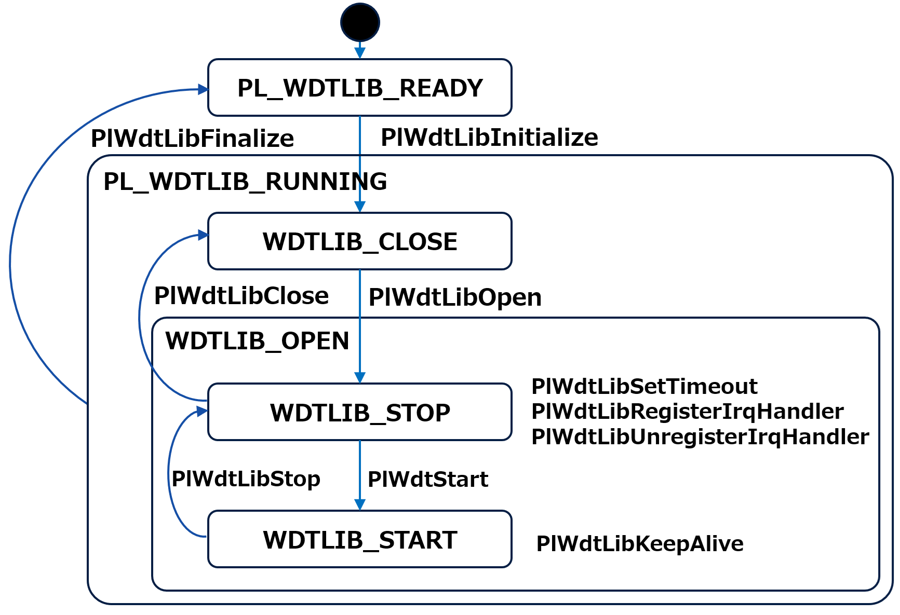
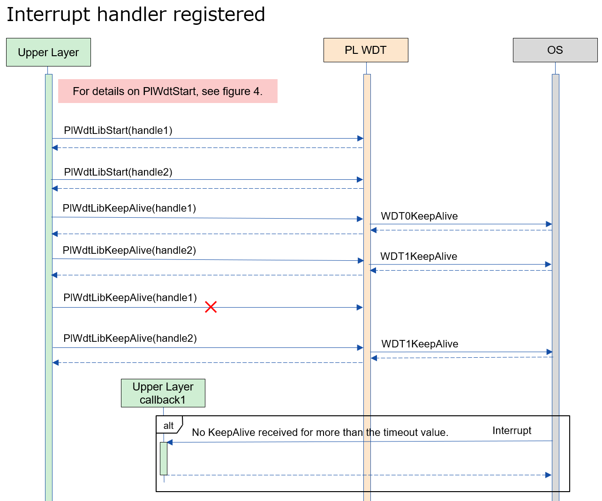
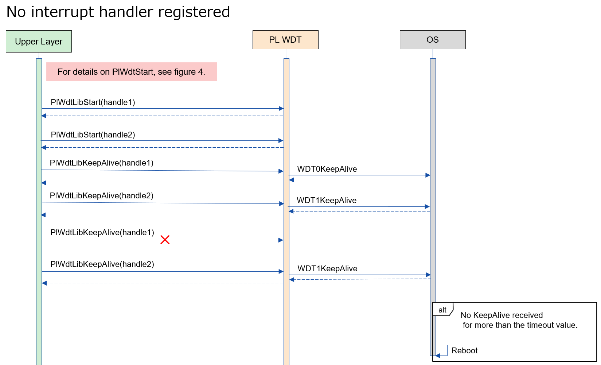

= PL WDTLib (LLM Translation)
:sectnums:
:sectnumlevels: 3
:chapter-label:
:revnumber: 0.0.2
:toc: left
:toc-title: Table of Contents
:toclevels: 3
:lang: en
:xrefstyle: short
:figure-caption: Figure
:table-caption: Table
:section-refsig:
:experimental:

== Purpose and Scope
NOTE: This specification is an internal document for PL.

This document describes the specifications of PL WDTLib, one of the AITRIOS PL layers. The purpose of PL WDTLib is to handle detailed WDT functions, such as opening/closing the WDT and setting the timeout period.

<<<

== Terminology

[#_words]
.Term List
[options="header"]
|===
|Term |Description 

|PL
|Porting Layer. A layer that absorbs the differences between camera/OS.

|I/F
|Interface
|===

<<<

== Component Description
The purpose of PL WDTLib is to handle detailed WDT functions, such as opening/closing the WDT and setting the timeout period.

=== Component Overview
The following diagram shows the software structure centered around this block.

.Diagram

<<<

=== Detailed Component Description

The following is an example of a usage sequence for PL WDTLib. 
After executing `PlWdtInitialize`, the upper layer can use the WDT functions via the PL WDTLib API.

[#_button_seq]
.Sequence Overview

<<<

=== State Transitions
The possible states for PL WDTLib are shown in <<#_TableStates>>.

[#_TableStates]
.State List
[width="100%", cols="20%,80%",options="header"]
|===
|State |Description 

|PL_WDTLIB_READY
|PL WDT uninitialized.

|PL_WDTLIB_RUNNING
|PL WDTLib initialized.

|WDTLIB_CLOSE
|WDT not opened. Substate of PL_WDTLIB_RUNNING.

|WDTLIB_OPEN
|WDT opened. Substate of PL_WDTLIB_RUNNING.

|WDTLIB_STOP
|WDT stopped. Substate of WDTLIB_OPEN.

|WDTLIB_START
|WDT running. Substate of WDTLIB_OPEN.
|===

[#_FigureState]
.State Transition Diagram

The acceptability of API calls and the next state after execution are shown in <<#_TableStateTransition>>. The state names in the table represent the state after the API execution, meaning the API can be called. 
An "×" indicates that the API cannot be accepted, and calling the API in this state will return an error without state transition. Refer to the PlErrCode list (T.B.D.) for error details.

[#_TableStateTransition]
.State Transition Table
[width="100%", cols="10%,20%,20%,20%,20%, 20"]
|===
2.4+| 4+|State
.3+|PL_WDTLIB_READY
3+|PL_WDTLIB_RUNNING
.2+|WDTLIB_CLOSE
2+|WDTLIB_OPEN
|WDTLIB_STOP
|WDTLIB_START
.20+|API Name

|``**PlWdtlibInitialize**``
|PL_CLOSE
|×
|×
|×

|``**PlWdtFinalize**``
|×
|PL_WDTLIB_READY
|PL_WDTLIB_READY
|PL_WDTLIB_READY

|``**PlWdtLibOpen**``
|×
|WDTLIB_STOP
|×
|×

|``**PlWdtLibClose**``
|×
|×
|WDTLIB_CLOSE
|×

|``**PlWdtLibStart**``
|×
|×
|WDTLIB_START
|×

|``**PlWdtLibStop**``
|×
|×
|×
|WDTLIB_STOP

|``**PlWdtLibSetTimeout**``
|×
|×
|WDTLIB_STOP
|×

|``**PlWdtLibRegisterIrqHandler**``
|×
|×
|WDTLIB_STOP
|×

|``**PlWdtLibUnregisterIrqHandler**``
|×
|×
|WDTLIB_STOP
|×

|``**PlWdtLibKeepAlive**``
|×
|×
|×
|WDTLIB_START
|===

<<<

=== Component Function List
The following is shown in <<#_TableFunction>>.

[#_TableFunction]
.Function List
[width="100%", cols="30%,55%,15%",options="header"]
|===
|Function Name |Overview  |Section Number
|Get/Release PL WDTLib Handle
|Acquires or releases the handle for using the PL WDTLib API.
|<<#_Function1, 3.5.1.>>

|Start/Stop WDT
|Starts or stops the WDT.
|<<#_Function2, 3.5.2.>>

|Set Timeout Period
|Sets the timeout period of the WDT.
|<<#_Function3, 3.5.3.>>

|Set WDT Interrupt
|Registers or unregisters the interrupt handler for WDT.
|<<#_Function4, 3.5.4.>>

|Send KeepAlive
|Sends KeepAlive.
|<<#_Function5, 3.5.5.>>
|===

<<<

=== Component Function Descriptions
[#_Function1]
==== Get/Release PL WDTLib Handle
Overview:: 
Acquires or releases the handle for using the PL WDTLib API.
Precondition:: 
`PlWdtlibInitialize` must have been executed.
Details:: 
For handle acquisition, refer to <<#_PlWdtLibOpen, PlWdtLibOpen>>. +
For handle release, refer to <<#_PlWdtLibClose, PlWdtLibClose>>.
Behavior:: 
For handle acquisition, refer to <<#_PlWdtLibOpen_disc, PlWdtLibOpen>>. +
For handle release, refer to <<#_PlWdtLibClose_disc, PlWdtLibClose>>.
Error Handling:: 
For handle acquisition, refer to <<#_PlWdtLibOpen_error, PlWdtLibOpen>>. +
For handle release, refer to <<#_PlWdtLibClose_error, PlWdtLibClose>>.
Considerations:: 
None.

[#_Function2]
==== Start/Stop WDT
Overview:: 
Starts or stops the WDT.
Precondition:: 
`PlWdtlibInitialize` must have been executed. +
The state of PL WDTLib must be <<#_TableStates, WDTLIB_OPEN>>.
Details:: 
For WDT start, refer to <<#_PlWdtLibStart, PlWdtLibStart>>. +
For WDT stop, refer to <<#_PlWdtLibStop, PlWdtLibStop>>.
Behavior:: 
For WDT start, refer to <<#_PlWdtLibStart_disc, PlWdtLibStart>>. +
For WDT stop, refer to <<#_PlWdtLibStop_disc, PlWdtLibStop>>.
Error Handling:: 
For WDT start, refer to <<#_PlWdtLibStart_error, PlWdtLibStart>>. +
For WDT stop, refer to <<#_PlWdtLibStop_error, PlWdtLibStop>>.
Considerations:: 
None.

[#_Function3]
==== Set Timeout Period
Overview:: 
Sets the timeout period of the WDT.
Precondition:: 
`PlWdtlibInitialize` must have been executed. +
The state of PL WDTLib must be <<#_TableStates, WDTLIB_STOP>>.
Details:: 
For timeout period setting, refer to <<#_PlWdtLibSetTimeout, PlWdtLibSetTimeout>>.
Behavior:: 
For timeout period setting, refer to <<#_PlWdtLibSetTimeout_disc, PlWdtLibSetTimeout>>.
Error Handling:: 
For timeout period setting, refer to <<#_PlWdtLibSetTimeout_error, PlWdtLibSetTimeout>>.
Considerations:: 
None.

[#_Function4]
==== Set WDT Interrupt
Overview:: 
Registers or unregisters the interrupt handler for WDT.
Precondition:: 
`PlWdtlibInitialize` must have been executed. +
The state of PL WDTLib must be <<#_TableStates, WDTLIB_STOP>>.
Details:: 
For interrupt handler registration, refer to <<#_PlWdtLibRegisterIrqHandler, PlWdtLibRegisterIrqHandler>>. +
For interrupt handler unregistration, refer to <<#_PlWdtLibUnregisterIrqHandler, PlWdtLibUnregisterIrqHandler>>.
Behavior:: 
For interrupt handler registration, refer to <<#_PlWdtLibRegisterIrqHandler_disc, PlWdtLibRegisterIrqHandler>>. +
For interrupt handler unregistration, refer to <<#_PlWdtLibUnregisterIrqHandler_disc, PlWdtLibUnregisterIrqHandler>>.
Error Handling:: 
For interrupt handler registration, refer to <<#_PlWdtLibRegisterIrqHandler_error, PlWdtLibRegisterIrqHandler>>. +
For interrupt handler unregistration, refer to <<#_PlWdtLibUnregisterIrqHandler_error, PlWdtLibUnregisterIrqHandler>>.
Considerations:: 
None.

[#_Function5]
==== Send KeepAlive
Overview:: 
Sends KeepAlive.
Precondition:: 
`PlWdtlibInitialize` must have been executed. +
The state of PL WDTLib must be <<#_TableStates, WDTLIB_START>>.
Details:: 
For KeepAlive transmission, refer to <<#_PlWdtLibKeepAlive, PlWdtLibKeepAlive>>.
Behavior:: 
For KeepAlive transmission, refer to <<#_PlWdtLibKeepAlive_disc, PlWdtLibKeepAlive>>.
Error Handling:: 
For KeepAlive transmission, refer to <<#_PlWdtLibKeepAlive_error, PlWdtLibKeepAlive>>.
Considerations:: 
None.

=== Non-functional Requirements List

The following is shown in <<#_TableNonFunction>>.

[#_TableNonFunction]
.Non-functional Requirements List
[width="100%", cols="30%,55%,15%",options="header"]
|===
|Function Name |Overview  |Section Number
|Maximum Stack Usage
|Maximum stack size used by PL WDTLib.
|<<#_stack, 3.7.>>

|Maximum Heap Usage
|Maximum heap size used by PL WDTLib.
|<<#_heap, 3.7.>>

|Maximum Static Data Usage
|Maximum static data size used by PL WDTLib.
|<<#_static, 3.7.>>

|Performance
|Performance of the functions provided by PL WDTLib.
|<<#_performance, 3.7.>>
|===

=== Non-functional Requirement Descriptions
[#_stack]
==== Maximum Stack Usage
1024 bytes

[#_heap]
==== Maximum Heap Usage
PL WDTLib does not use the heap.

[#_static]
==== Maximum Static Data Usage
128 bytes

[#_performance]
==== Performance
Less than 1 millisecond

<<<

== API Specifications
=== Definitions
==== Data Type List
The following is shown in <<#_TableDataType>>.

[#_TableDataType]
.Data Type List
[width="100%", cols="30%,55%,15%",options="header"]
|===
|Data Type Name |Overview  |Section Number
|enum PlErrCode
|Enumeration defining the result of API execution.
|<<#_PlErrCode, 4.3.1.>>

|PlWdtLibHandle
|Structure representing the handle for using PL WDTLib API.
|<<#_PlWdtLibHandle, 4.3.2.>>

|PlWdtLibIrqHandler
|Function pointer representing the WDT interrupt handler.
|<<#_PlWdtLibIrqHandler, 4.3.3.>>
|===

==== API List
The following is shown in <<#_TablePublicAPI>>.

[#_TablePublicAPI]
.API List Usable Directly by the Upper Layer
[width="100%", cols="10%,60%,20%",options="header"]
|===
|API Name |Overview |Section Number
|PlWdtLibInitialize
|Makes PL WDTLib ready for use.
|<<#_PlWdtLibInitialize, 4.4.1.>>

|PlWdtLibFinalize
|Makes PL WDTLib unavailable.
|<<#_PlWdtLibFinalize, 4.4.2.>>

|PlWdtLibOpen
|Opens the WDT.
|<<#_PlWdtLibOpen, 4.4.3.>>

|PlWdtLibClose
|Closes the WDT.
|<<#_PlWdtLibClose, 4.4.4.>>

|PlWdtLibStart
|Starts the WDT.
|<<#_PlWdtLibStart, 4.4.5.>>

|PlWdtLibStop
|Stops the WDT.
|<<#_PlWdtLibStop, 4.4.6.>>

|PlWdtLibSetTimeout
|Sets the timeout period of the WDT.
|<<#_PlWdtLibSetTimeout, 4.4.7.>>

|PlWdtLibRegisterIrqHandler
|Registers the WDT interrupt handler.
|<<#_PlWdtLibRegisterIrqHandler, 4.4.8.>>

|PlWdtLibUnregisterIrqHandler
|Unregisters the WDT interrupt handler.
|<<#_PlWdtLibUnregisterIrqHandler, 4.4.9.>>

|PlWdtLibKeepAlive
|Sends KeepAlive.
|<<#_PlWdtLibKeepAlive, 4.4.10.>>
|===

<<<

=== Build Configuration
[#_BuildConfig]
==== Build Configuration (for esp32s3)
The WDT configuration information is included in the build configuration.

* *Format* +
[source, C]
....
CONFIG_EXTERNAL_PL_WDT_NUM=2
CONFIG_EXTERNAL_PL_WDT_LOW_THREAD_PRIORITY=50
CONFIG_EXTERNAL_PL_WDT_HIGH_THREAD_PRIORITY=120
CONFIG_EXTERNAL_PL_WDT_KEEP_ALIVE_SEC=10
CONFIG_EXTERNAL_PL_WDT0_TIMEOUT_SEC=60
CONFIG_EXTERNAL_PL_WDT1_TIMEOUT_SEC=70
....

[#_BuildConfig_table]
.BuildConfig Description
[width="100%", cols="30%,70%",options="header"]
|===
|Member Name  |Description
|CONFIG_EXTERNAL_PL_WDT_NUM
|The number of WDTs to use. +
Adjust the OS configuration according to the number. +
CONFIG_ESP32_MWDT0, CONFIG_ESP32_MWDT1

|CONFIG_EXTERNAL_PL_WDT_LOW_THREAD_PRIORITY
|Priority of the KeepAlive transmission thread (low priority).

|CONFIG_EXTERNAL_PL_WDT_HIGH_THREAD_PRIORITY
|Priority of the KeepAlive transmission thread (high priority).

|CONFIG_EXTERNAL_PL_WDT_KEEP_ALIVE_SEC
|Interval [sec] for sending KeepAlive. Unsupported if set longer than the timeout period.

|CONFIG_EXTERNAL_PL_WDT0_TIMEOUT_SEC
|Timeout period [sec] for WDT0. Unsupported if set less than 1 second.

|CONFIG_EXTERNAL_PL_WDT1_TIMEOUT_SEC
|Timeout period [sec] for WDT1. Unsupported if set less than 1 second.
|===

<<<

=== Data Type Definitions
[#_PlErrCode]
==== PlErrCode
Enumeration defining the result of API execution. +
(T.B.D.)

[#_PlWdtLibHandle]
==== PlWdtLibHandle
Structure representing the handle for using PL WDTLib API.

* *Format* +
[source, C]
....
typedef void* PlWdtLibHandle;
....

[#_PlWdtLibIrqHandler]
==== PlWdtLibIrqHandler
Function pointer representing the WDT interrupt handler. +
Executed when a WDT interrupt is detected by the system.

* *Format* +
[source, C]
....
typedef void (*PlWdtLibIrqHandler)(void *private_data)
....

* *Parameter Description* +
**[OUT] void *private_data**:: 
The private_data specified in `PlWdtLibRegisterIrqHandler` is set.

<<<

=== API Descriptions

[#_PlWdtLibInitialize]
==== PlWdtLibInitialize

* *Function* +
Makes PL WDTLib ready for use.

* *Format* +
[source, C]
....
PlErrCode PlWdtLibInitialize(void)
....
* *Parameter Description* +
-

* *Return Value* +
Returns one of the PlErrCode values based on the result of execution.

* *Description* +
** Makes PL WDTLib ready for use.

[#_PlWdtLibInitialize_desc]
.API Details
[width="100%", cols="30%,70%",options="header"]
|===
|API Details  |Description
|API Type
|Synchronous API
|Execution Context
|Executed in the caller's context
|Concurrent Calls
|Not allowed
|Called from Multiple Threads
|Allowed
|Called from Multiple Tasks
|Allowed
|Blocking in the API
|Blocks.
If PL WDTLib API is already running in another context, it will wait for completion before executing. However, if Initialize is executed twice, an error will occur.
|===

[#_PlWdtLibInitialize_error]
.Error Information
[options="header"]
|===
|Error Code |Cause |OUT Parameter State |System State After Error |Recovery Method
|kPlErrInvalidState (tentative)
|Already in a ready state.
|-
|No impact
|None needed

|kPlErrInvalidParam (tentative)
|Parameter error
|-
|No impact
|None needed

|kPlErrLock/kPlErrUnlock (tentative)
|Blocking error
|-
|No impact
|None needed
|===

<<<

[#_PlWdtLibFinalize]
==== PlWdtLibFinalize
* *Function* +
Makes PL WDTLib unavailable.

* *Format* +
[source, C]
....
PlErrCode PlWdtLibFinalize(void)
....

* *Parameter Description* +
-

* *Return Value* +
Returns one of the PlErrCode values based on the result of execution.

* *Description* +
** Makes PL WDTLib unavailable.
** This API can be used after executing PlWdtlibInitialize.

[#_PlWdtLibFinalize_desc]
.API Details
[width="100%", cols="30%,70%",options="header"]
|===
|API Details  |Description
|API Type
|Synchronous API
|Execution Context
|Executed in the caller's context
|Concurrent Calls
|Not allowed
|Called from Multiple Threads
|Allowed
|Called from Multiple Tasks
|Allowed
|Blocking in the API
|Blocks.
If PL WDTLib API is already running in another context, it will wait for completion before executing. PL impl implementers should run this within the PL API. However, if Finalize is executed twice, an error will occur.
|===

[#_PlWdtLibFinalize_error]
.Error Information
[options="header"]
|===
|Error Code |Cause |OUT Parameter State |System State After Error |Recovery Method
|kPlErrInvalidState (tentative)
|PlWdtlibInitialize not executed
|-
|No impact
|None needed

|kPlErrLock/kPlErrUnlock (tentative)
|Blocking error
|-
|No impact
|None needed
|===

<<<

[#_PlWdtLibOpen]
==== PlWdtLibOpen

* *Function* +
Acquires a handle for using the PL WDTLib API.

* *Format* +
[source, C]
....
PlErrCode PlWdtLibOpen(PlWdtLibHandle *handle, uint32_t wdt_num)
....
* *Parameter Description* +
**[OUT] <<#_PlWdtLibHandle, PlWdtLibHandle>> *handle**::
PL WDTLib handle. Returns an error if NULL.

**[IN] uint32_t wdt_num**::
WDT number for which to acquire a handle. The number of WDT handles that can be acquired is set in the build configuration (CONFIG_EXTERNAL_PL_WDT_NUM). +
If CONFIG_EXTERNAL_PL_WDT_NUM = 3, valid values for wdt_num are 0, 1, 2.

* *Return Value* +
Returns one of the PlErrCode values based on the result of execution.

* *Description* +
** Acquires a handle for using the PL WDTLib API.
** If a handle is already acquired for the specified wdt_num, an error is returned.
** If a value greater than CONFIG_EXTERNAL_PL_WDT_NUM is specified, an error is returned.
** If a WDT not defined in the CONFIG is specified, an error is returned.

[#_PlWdtLibOpen_disc]
.API Details
[width="100%", cols="30%,70%",options="header"]
|===
|API Details  |Description
|API Type
|Synchronous API
|Execution Context
|Executed in the caller's context
|Concurrent Calls
|Allowed
|Called from Multiple Threads
|Allowed
|Called from Multiple Tasks
|Allowed
|Blocking in the API
|Blocks.
If PL WDTLib API is already running in another context, it will wait for completion before executing.
|===

[#_PlWdtLibOpen_error]
.Error Information
[options="header"]
|===
|Error Code |Cause |OUT Parameter State |System State After Error |Recovery Method
|kPlErrInvalidState (tentative)
|PlWdtlibInitialize not executed.
|-
|No impact
|None needed

|kPlErrInvalidParam (tentative)
|Parameter error
|-
|No impact
|None needed

|kPlErrLock/kPlErrUnlock (tentative)
|Blocking error
|-
|No impact
|None needed
|===

<<<

[#_PlWdtLibClose]
==== PlWdtLibClose

* *Function* +
Releases the WDT handle.

* *Format* +
[source, C]
....
PlErrCode PlWdtLibClose(const PlWdtLibHandle handle)
....
* *Parameter Description* +
**[IN] const <<#_PlWdtLibHandle, PlWdtLibHandle>> *handle**::
PL WDTLib handle. Returns an error if NULL.

* *Return Value* +
Returns one of the PlErrCode values based on the result of execution.

* *Description* +
** Releases the WDT handle.
** If a handle other than the one acquired by PlWdtLibOpen is provided, an error is returned.
** An error is returned if the state of PL WDTLib is not <<#_TableStates, WDTLIB_STOP>>.

[#_PlWdtLibClose_desc]
.API Details
[width="100%", cols="30%,70%",options="header"]
|===
|API Details  |Description
|API Type
|Synchronous API
|Execution Context
|Executed in the caller's context
|Concurrent Calls
|Allowed
|Called from Multiple Threads
|Allowed
|Called from Multiple Tasks
|Allowed
|Blocking in the API
|Blocks.
If PL WDTLib API is already running in another context, it will wait for completion before executing.
|===

[#_PlWdtLibClose_error]
.Error Information
[options="header"]
|===
|Error Code |Cause |OUT Parameter State |System State After Error |Recovery Method
|kPlErrInvalidState (tentative)
|PlWdtlibInitialize not executed.
|-
|No impact
|None needed

|kPlErrInvalidParam (tentative)
|Parameter error
|-
|No impact
|None needed

|kPlErrLock/kPlErrUnlock (tentative)
|Blocking error
|-
|No impact
|None needed
|===

<<<

[#_PlWdtLibStart]
==== PlWdtLibStart

* *Function* +
Starts the WDT.

* *Format* +
[source, C]
....
PlErrCode PlWdtLibStart(const PlWdtLibHandle handle)
....
* *Parameter Description* +
**[IN] const <<#_PlWdtLibHandle, PlWdtLibHandle>> handle**::
PL WDTLib handle. Returns an error if NULL.

* *Return Value* +
Returns one of the PlErrCode values based on the result of execution.

* *Description* +
** Starts the WDT.
** If a handle other than the one acquired by PlWdtLibOpen is provided, an error is returned.
** An error is returned if the state of PL WDTLib is not <<#_TableStates, WDTLIB_STOP>>.

[#_PlWdtLibStart_disc]
.API Details
[width="100%", cols="30%,70%",options="header"]
|===
|API Details  |Description
|API Type
|Synchronous API
|Execution Context
|Executed in the caller's context
|Concurrent Calls
|Allowed
|Called from Multiple Threads
|Allowed
|Called from Multiple Tasks
|Allowed
|Blocking in the API
|Blocks.
If PL WDTLib API is already running in another context, it will wait for completion before executing.
|===

[#_PlWdtLibStart_error]
.Error Information
[options="header"]
|===
|Error Code |Cause |OUT Parameter State |System State After Error |Recovery Method
|kPlErrInvalidState (tentative)
|PlWdtlibInitialize not executed.
|-
|No impact
|None needed

|kPlErrInvalidParam (tentative)
|Parameter error
|-
|No impact
|None needed

|kPlErrLock/kPlErrUnlock (tentative)
|Blocking error
|-
|No impact
|None needed
|===

<<<

[#_PlWdtLibStop]
==== PlWdtLibStop

* *Function* +
Stops the WDT.

* *Format* +
[source, C]
....
PlErrCode PlWdtLibStop(const PlWdtLibHandle handle)
....
* *Parameter Description* +
**[IN] const <<#_PlWdtLibHandle, PlWdtLibHandle>> handle**::
PL WDTLib handle. Returns an error if NULL.

* *Return Value* +
Returns one of the PlErrCode values based on the result of execution.

* *Description* +
** Stops the WDT.
** If a handle other than the one acquired by PlWdtLibOpen is provided, an error is returned.
** An error is returned if the state of PL WDTLib is not <<#_TableStates, WDTLIB_START>>.

[#_PlWdtLibStop_disc]
.API Details
[width="100%", cols="30%,70%",options="header"]
|===
|API Details  |Description
|API Type
|Synchronous API
|Execution Context
|Executed in the caller's context
|Concurrent Calls
|Allowed
|Called from Multiple Threads
|Allowed
|Called from Multiple Tasks
|Allowed
|Blocking in the API
|Blocks.
If PL WDTLib API is already running in another context, it will wait for completion before executing.
|===

[#_PlWdtLibStop_error]
.Error Information
[options="header"]
|===
|Error Code |Cause |OUT Parameter State |System State After Error |Recovery Method
|kPlErrInvalidState (tentative)
|PlWdtlibInitialize not executed.
|-
|No impact
|None needed

|kPlErrInvalidParam (tentative)
|Parameter error
|-
|No impact
|None needed

|kPlErrLockError (tentative)
|Blocking error
|-
|No impact
|None needed
|===

<<<

[#_PlWdtLibSetTimeout]
==== PlWdtLibSetTimeout

* *Function* +
Sets the WDT timeout period.

* *Format* +
[source, C]
....
PlErrCode PlWdtLibSetTimeout(const PlWdtLibHandle handle, uint32_t timeout)
....
* *Parameter Description* +
**[IN] const <<#_PlWdtLibHandle, PlWdtLibHandle>> handle**::
PL WDTLib handle. Returns an error if NULL.

**[IN] uint32_t timeout**::
WDT timeout period [sec].

* *Return Value* +
Returns one of the PlErrCode values based on the result of execution.

* *Description* +
** Sets the WDT timeout period.
** If a handle other than the one acquired by PlWdtLibOpen is provided, an error is returned.
** An error is returned if the state of PL WDTLib is not <<#_TableStates, WDTLIB_STOP>>.

[#_PlWdtLibSetTimeout_disc]
.API Details
[width="100%", cols="30%,70%",options="header"]
|===
|API Details  |Description
|API Type
|Synchronous API
|Execution Context
|Executed in the caller's context
|Concurrent Calls
|Allowed
|Called from Multiple Threads
|Allowed
|Called from Multiple Tasks
|Allowed
|Blocking in the API
|Blocks.
If PL WDTLib API is already running in another context, it will wait for completion before executing.
|===

[#_PlWdtLibSetTimeout_error]
.Error Information
[options="header"]
|===
|Error Code |Cause |OUT Parameter State |System State After Error |Recovery Method
|kPlErrInvalidState (tentative)
|PlWdtlibInitialize not executed.
|-
|No impact
|None needed

|kPlErrInvalidParam (tentative)
|Parameter error
|-
|No impact
|None needed

|kPlErrLock (tentative)
|Blocking error
|-
|No impact
|None needed
|===

<<<

[#_PlWdtLibRegisterIrqHandler]
==== PlWdtLibRegisterIrqHandler

* *Function* +
Registers a WDT interrupt handler.

* *Format* +
[source, C]
....
PlErrCode PlWdtLibRegisterIrqHandler(const PlWdtLibHandle handle, PlWdtLibIrqHandler handler, void *private_data)
....
* *Parameter Description* +
**[IN] const <<#_PlWdtLibHandle, PlWdtLibHandle>> handle**::
PL WDTLib handle. Returns an error if NULL.

**[IN] <<#_PlWdtLibIrqHandler, PlWdtLibIrqHandler>> handler**::
WDT interrupt handler. Returns an error if NULL.

**[IN] void *private_data**::
Interrupt handler data. NULL is also acceptable.

* *Return Value* +
Returns one of the PlErrCode values based on the result of execution.

* *Description* +
** Registers a WDT interrupt handler.
** If a handle other than the one acquired by PlWdtLibOpen is provided, an error is returned.
** An error is returned if the state of PL WDTLib is not <<#_TableStates, WDTLIB_STOP>>.
** If the specified WDT already has a registered interrupt handler, an error is returned.

[#_PlWdtLibRegisterIrqHandler_disc]
.API Details
[width="100%", cols="30%,70%",options="header"]
|===
|API Details  |Description
|API Type
|Synchronous API
|Execution Context
|Executed in the caller's context
|Concurrent Calls
|Allowed
|Called from Multiple Threads
|Allowed
|Called from Multiple Tasks
|Allowed
|Blocking in the API
|Blocks.
If PL WDTLib API is already running in another context, it will wait for completion before executing.
|===

[#_PlWdtLibRegisterIrqHandler_error]
.Error Information
[options="header"]
|===
|Error Code |Cause |OUT Parameter State |System State After Error |Recovery Method
|kPlErrInvalidState (tentative)
|PlWdtlibInitialize not executed.
|-
|No impact
|None needed

|kPlErrInvalidParam (tentative)
|Parameter error
|-
|No impact
|None needed

|kPlErrLock/kPlErrUnlock (tentative)
|Blocking error
|-
|No impact
|None needed
|===

<<<

[#_PlWdtLibUnregisterIrqHandler]
==== PlWdtLibUnregisterIrqHandler

* *Function* +
Unregisters the interrupt handler.

* *Format* +
[source, C]
....
PlErrCode PlWdtLibUnregisterIrqHandler(const PlWdtLibHandle handle)
....
* *Parameter Description* +
**[IN] const <<#_PlWdtLibHandle, PlWdtLibHandle>> handle**::
PL WDTLib handle. Returns an error if NULL.

* *Return Value* +
Returns one of the PlErrCode values based on the result of execution.

* *Description* +
** Unregisters the interrupt handler.
** If a handle other than the one acquired by PlWdtLibOpen is provided, an error is returned.
** An error is returned if the state of PL WDTLib is not <<#_TableStates, WDTLIB_STOP>>.
** If the specified WDT does not have a registered interrupt handler, an error is returned.

[#_PlWdtLibUnregisterIrqHandler_disc]
.API Details
[width="100%", cols="30%,70%",options="header"]
|===
|API Details  |Description
|API Type
|Synchronous API
|Execution Context
|Executed in the caller's context
|Concurrent Calls
|Allowed
|Called from Multiple Threads
|Allowed
|Called from Multiple Tasks
|Allowed
|Blocking in the API
|Blocks.
If PL WDTLib API is already running in another context, it will wait for completion before executing.
|===

[#_PlWdtLibUnregisterIrqHandler_error]
.Error Information
[options="header"]
|===
|Error Code |Cause |OUT Parameter State |System State After Error |Recovery Method
|kPlErrInvalidState (tentative)
|PlWdtlibInitialize not executed.
|-
|No impact
|None needed

|kPlErrInvalidParam (tentative)
|Parameter error
|-
|No impact
|None needed

|kPlErrLock/kPlErrUnlock (tentative)
|Blocking error
|-
|No impact
|None needed
|===

<<<

[#_PlWdtLibKeepAlive]
==== PlWdtLibKeepAlive

* *Function* +
Sends KeepAlive.

* *Format* +
[source, C]
....
PlErrCode PlWdtLibKeepAlive(const PlWdtLibHandle handle)
....
* *Parameter Description* +
**[IN] const <<#_PlWdtLibHandle, PlWdtLibHandle>> handle**::
PL WDTLib handle. Returns an error if NULL.

* *Return Value* +
Returns one of the PlErrCode values based on the result of execution.

* *Description* +
** Sends KeepAlive.
** If a handle other than the one acquired by PlWdtLibOpen is provided, an error is returned.
** An error is returned if the state of PL WDTLib is not <<#_TableStates, WDTLIB_START>>.

[#_PlWdtLibKeepAlive_disc]
.API Details
[width="100%", cols="30%,70%",options="header"]
|===
|API Details  |Description
|API Type
|Synchronous API
|Execution Context
|Executed in the caller's context
|Concurrent Calls
|Allowed
|Called from Multiple Threads
|Allowed
|Called from Multiple Tasks
|Allowed
|Blocking in the API
|Blocks.
If PL WDTLib API is already running in another context, it will wait for completion before executing.
|===

[#_PlWdtLibKeepAlive_error]
.Error Information
[options="header"]
|===
|Error Code |Cause |OUT Parameter State |System State After Error |Recovery Method
|kPlErrInvalidState (tentative)
|PlWdtlibInitialize not executed.
|-
|No impact
|None needed

|kPlErrInvalidParam (tentative)
|Parameter error
|-
|No impact
|None needed

|kPlErrLock/kPlErrUnlock(tentative)
|Blocking error
|-
|No impact
|None needed
|===

<<<

== API Usage Example
=== Example of PlWdtLibStart
.PlWdtLibStart
image::./images/wdt_lib_start.png[scalewidth="100%", align="center"]

=== Example of WDT Trigger with Registered Interrupt Handler
.PL WDTLib interrupt (Registered)

=== Example of WDT Trigger without Registered Interrupt Handler
.PL WDTLib interrupt (Unregistered)

=== Example of PlWdtLibClose
.PlWdtLibClose
image::./images/wdt_lib_stop.png[scalewidth="100%", align="center"]

== List of OSS Used
None

<<<

== Revision History
[width="100%", cols="20%,80%",options="header"]
|===
|Version |Changes 
|0.0.1
|Initial version

|0.0.2
|- Overall: Added half-width spaces before and after English words (for readability) +
- Terms: Revised description of PL +
- Dependent Block: Removed Osal Msg +
- Changed the description of PL to PL WDT
- Changed PL_WDT_READY/PL_WDT_RUNNING to PL_WDTLIB_READY/PL_WDTLIB_RUNNING +
- Changed WDT_OPEN/WDT_CLOSE/WDT_START/WDT_STOP to WDTLIB_OPEN/WDTLIB_CLOSE/WDTLIB_START/WDTLIB_STOP +
- Added PlErrCode to the data types +
- Changed PlWdtLibInitialize/PlWdtLibFinalize APIs to Public and listed them at the beginning of the API list +
- Modified PlWdtLibInitialize error codes +
- Updated diagrams (*.png) to English labels

|===
