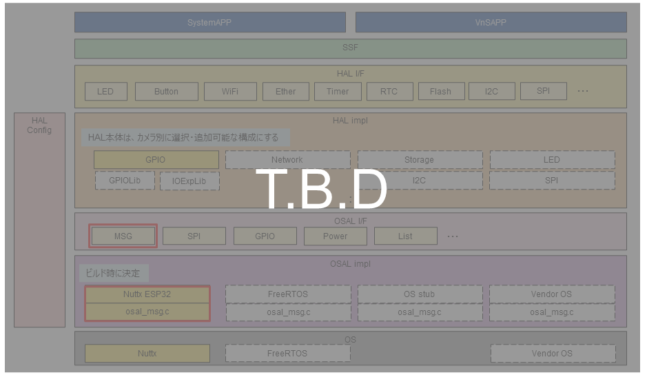
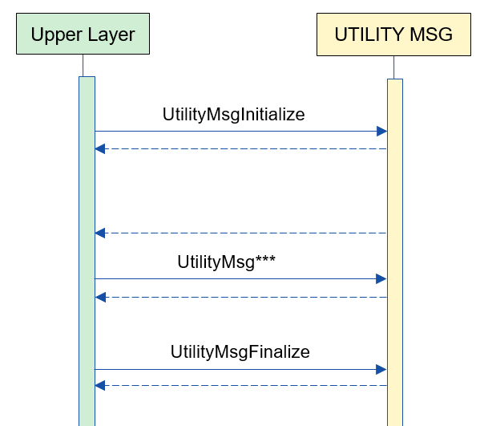
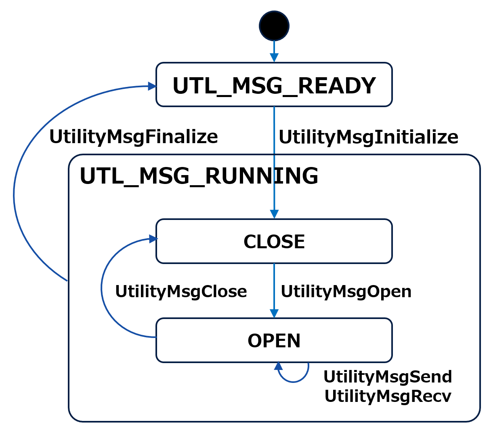
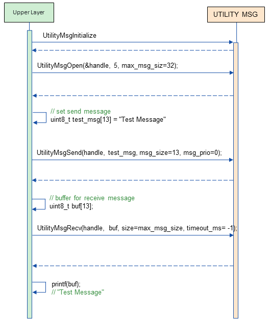
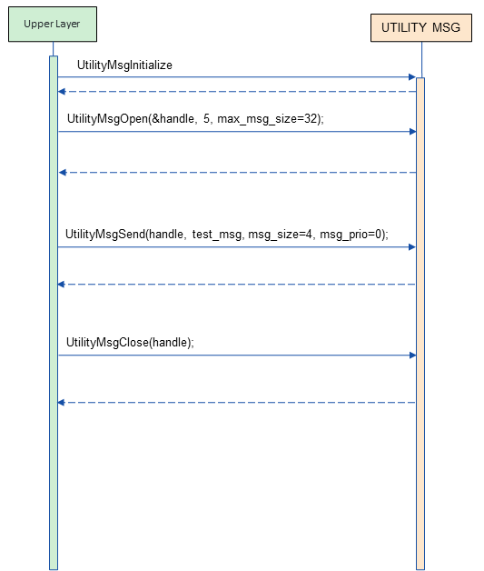

= UTILITY MSG (LLM Translation)
:sectnums:
:sectnumlevels: 3
:chapter-label:
:revnumber: 0.0.2
:toc: left
:toc-title: Table of Contents
:toclevels: 3
:lang: en
:xrefstyle: short
:figure-caption: Figure
:table-caption: Table
:section-refsig:
:experimental:

== Purpose and Scope

This document describes the specifications of UTILITY MSG, one of the AITRIOS utilities.
The purpose of UTILITY MSG is to enable communication functionality within the same module without considering OS differences.

<<<

== Terminology

[#_words]
.Terminology List
[options="header"]
|===
|Term |Description 
|I/F
|Interface
|===

<<<

== Component Description

The purpose of the UTILITY MSG layer is to absorb OS differences related to inter-task communication functionality.
Additionally, it can be customized or modified according to the target OS.

=== Component Overview

The following is a software configuration diagram centered around this block.

.Overview Diagram

<<<

=== Detailed Component Description

The following is an example of the usage sequence of UTILITY MSG.
After executing UtilityMsgInitialize, the upper layer can use various MSG functions through the UTILITY MSG API.

[#_button_seq]
.Sequence Overview

<<<

=== State Transitions

The possible states of UTILITY MSG are shown in <<#_TableStates>>.

[#_TableStates]
.State List
[width="100%", cols="20%,80%",options="header"]
|===
|State |Description 

|UTL_MSG_READY
|UTILITY MSG is initial state.

|UTL_MSG_RUNNING
|UTILITY MSG is running state.

|CLOSE
|State where a message queue can be created.

|OPEN
|State where a message queue has been created.
|===

UTILITY MSG undergoes state transitions as shown in <<#_FigureState>>. +
Also, no state transition occurs if an error occurs with any API. +

[#_FigureState]
.State Transition Diagram

The table <<#_TableStateTransition>> shows the acceptance status of APIs in each state and the state to which they transition. The state names in the table indicate the post-transition states after the API execution is completed, showing that the API call is possible. "×" indicates that the API is not accepted, and calling the API will return an error and no state transition will occur. For error details, refer to <<#_UtilityMsgErrCode>>.

[#_TableStateTransition]
.State Transition Table
[width="100%", cols="10%,20%,20%,20%,20%"]
|===
2.3+| 3+|State 
.2+|UTL_MSG_READY 
2+|UTL_MSG_RUNNING|CLOSE |OPEN
.10+|API Name

|``**UtilityMsgInitialize**``
|CLOSE
|×
|×

|``**UtilityMsgFinalize**``   
|×
|UTL_MSG_READY
|UTL_MSG_READY

|``**UtilityMsgOpen**``   
|×
|OPEN
|×

|``**UtilityMsgSend**``   
|×
|×
|OPEN

|``**UtilityMsgRecv**``   
|×
|×
|OPEN

|``**UtilityMsgClose**``   
|×
|×
|CLOSE
|===

<<<

=== Function List

The function list is shown in <<#_TableFunction>>.

[#_TableFunction]
.Function List
[width="100%", cols="30%,55%,15%",options="header"]
|===
|Function Name |Description  |Section Number
|Initialize/Finalize Message Queue
|Initializes and finalizes the message queue.
|<<#_Function0, 3.5.1.>>

|Open/Close Message Queue
|Creates and destroys a message queue.
|<<#_Function1, 3.5.2.>>

|Send/Receive Message
|Sends and receives messages to/from the message queue.
|<<#_Function2, 3.5.3.>>

|===

<<<

=== Function Descriptions

[#_Function0]
==== Initialize/Finalize Message Queue
Function Overview:: 
Initializes and finalizes the message queue.
Preconditions:: 
None
Function Details:: 
Refer to <<#_UtilityMsgInitialize, UtilityMsgInitialize>> and <<#_UtilityMsgFinalize, UtilityMsgFinalize>>.
Behavior Details:: 
Refer to <<#_UtilityMsgInitialize, UtilityMsgInitialize>> and <<#_UtilityMsgFinalize, UtilityMsgFinalize>>.
Error Behavior and Recovery Methods:: 
Refer to <<#_UtilityMsgInitialize, UtilityMsgInitialize>> and <<#_UtilityMsgFinalize, UtilityMsgFinalize>>.
Considerations:: 
None

[#_Function1]
==== Open/Close Message Queue
Function Overview:: 
Creates and destroys a message queue.
Preconditions:: 
UtilityMsgInitialize must have been executed.
Function Details:: 
Refer to <<#_UtilityMsgOpen, UtilityMsgOpen>> and <<#_UtilityMsgClose, UtilityMsgClose>>.
Behavior Details:: 
Refer to <<#_UtilityMsgOpen, UtilityMsgOpen>> and <<#_UtilityMsgClose, UtilityMsgClose>>.
Error Behavior and Recovery Methods:: 
Refer to <<#_UtilityMsgOpen, UtilityMsgOpen>> and <<#_UtilityMsgClose, UtilityMsgClose>>.
Considerations:: 
None

[#_Function2]
==== Send/Receive Message
Function Overview:: 
Sends and receives messages to/from the message queue.
Preconditions:: 
UtilityMsgInitialize must have been executed.
A handle must have been obtained with UtilityMsgOpen.
Function Details:: 
Refer to <<#_UtilityMsgSend, UtilityMsgSend>> and <<#_UtilityMsgRecv, UtilityMsgRecv>>.
Behavior Details:: 
Refer to <<#_UtilityMsgSend, UtilityMsgSend>> and <<#_UtilityMsgRecv, UtilityMsgRecv>>.
Error Behavior and Recovery Methods:: 
Refer to <<#_UtilityMsgSend, UtilityMsgSend>> and <<#_UtilityMsgRecv, UtilityMsgRecv>>.
Considerations:: 
None

<<<

=== Non-functional Requirements List

The list of non-functional requirements is shown in <<#_TableNonFunction>>.

[#_TableNonFunction]
.Non-functional Requirements List
[width="100%", cols="30%,55%,15%",options="header"]
|===
|Function Name |Description  |Section Number
|Maximum Stack Usage
|Maximum stack usage (in bytes)
|<<#_NonFunctionStack, 3.7.>>

|Maximum Heap Usage
|Maximum heap usage (in bytes)
|<<#_NonFunctionHeap, 3.7.>>

|Static Data Usage
|Static data usage (in bytes)
|<<#_NonFunctionStatic, 3.7.>>

|Performance
|Processing time for each API
|<<_NonFunctionPerformance, 3.7.>>
|===

[#_CompornentNonFunction]
=== Non-functional Requirements Description

[#_NonFunctionStack]
==== Maximum Stack Usage
*** 1024 bytes

[#_NonFunctionHeap]
==== Maximum Heap Usage
*** Total message size stored in each queue + 500 bytes used

.Heap Usage Example
[width="100%", cols="15%,18%,35%,22%",options="header"]
|===
|Number of Queues (UtilityMsgOpen) |Number of Messages Being Sent (Message Size) |Total Message Size Stored in Each Queue (Bytes) |Normal Maximum Heap Usage (Bytes)
|1|1 (1024)|1024|1524
|1|1 (2048)|2048|2548
|1|1 (10240)|10240|10740
|1|1 (102400)|102400|102900
|2|1 (1024)|1024|1524
|2|2 (1024,1024)|2048|2548
|===

[#_NonFunctionStatic]
==== Maximum Static Data Usage
*** 100 bytes

[#_NonFunctionPerformance]
==== Performance
*** UtilityMsgSend < 1[ms] (except when the maximum number of messages is exceeded)

*** UtilityMsgRecv < 1[ms] (except when receiving a message from an empty queue, which waits indefinitely)

<<<

== API Specifications
=== Definition List
==== Data Type List
The list of data types is shown in <<#_TableDataType>>.

[#_TableDataType]
.Data Type List
[width="100%", cols="30%,55%,15%",options="header"]
|===
|Data Type Name |Description  |Section Number
|enum UtilityMsgErrCode
|Enumeration type defining API execution results.
|<<#_UtilityMsgErrCode, 4.2.1.>>
|===

==== API List
The list of APIs available for direct use by upper layers is shown in <<#_TablePublicAPI>>.

[#_TablePublicAPI]
.APIs Directly Usable by Upper Layers
[width="100%", cols="10%,60%,20%",options="header"]
|===
|API Name |Description |Section Number
|UtilityMsgInitialize
|Initializes the message queue.
|<<#_UtilityMsgInitialize, 4.3.1.>>
|UtilityMsgFinalize
|Finalizes the message queue.
|<<#_UtilityMsgFinalize, 4.3.2.>>
|UtilityMsgOpen
|Creates the message queue.
|<<#_UtilityMsgOpen, 4.3.3.>>
|UtilityMsgSend
|Sends a message to the message queue.
|<<#_UtilityMsgSend, 4.3.4.>>
|UtilityMsgRecv
|Receives a message from the message queue.
|<<#_UtilityMsgRecv, 4.3.5.>>
|UtilityMsgClose
|Destroys the message queue.
|<<#_UtilityMsgClose, 4.3.6.>>
|===

<<<

=== Data Type Definitions
[#_UtilityMsgErrCode]
==== UtilityMsgErrCode
This is an enumeration type that defines the execution results of the API.

* *Format*
[source, C]
....
typedef enum {
  kUtilityMsgOk = 0,
  kUtilityMsgErrState,
  kUtilityMsgErrParam,
  kUtilityMsgErrLock,
  kUtilityMsgErrUnlock,
  kUtilityMsgErrTimedout,
  kUtilityMsgErrRetry,
  kUtilityMsgErrMemory,
  kUtilityMsgErrNotFound,
  kUtilityMsgErrInternal,
  kUtilityMsgErrTerminate,
} UtilityMsgErrCode;
....

* *Values*

[#_UtilityMsgErrCodeValue]
.Description of UtilityMsgErrCode Values
[width="100%", cols="30%,70%",options="header"]
|===
|Member Name  |Description
|kUtilityMsgOk
|Normal termination
|kUtilityMsgErrState
|State error
|kUtilityMsgErrParam
|Parameter error
|kUtilityMsgErrLock
|Blocking setting error
|kUtilityMsgErrUnlock
|Blocking release error
|kUtilityMsgErrTimedout
|Timeout
|kUtilityMsgErrRetry
|Open error. Reopen is required.
|kUtilityMsgErrMemory
|Memory error
|kUtilityMsgErrNotFound
|Message queue handle not found
|kUtilityMsgErrInternal
|Internal error
|kUtilityMsgErrTerminate
|UtilityMsgClose was executed during API execution
|===

<<<

=== API Descriptions
[#_UtilityMsgInitialize]
==== UtilityMsgInitialize
* *Function* +
Initializes the message queue.

* *Format* +
[source, C]
....
UtilityMsgErrCode UtilityMsgInitialize(void)
....

* *Explanation of Parameters* +
-

* *Return Value* +
Returns one of the values in <<#_UtilityMsgErrCode>> based on the execution result. +
Refer to <<#_UtilityMsgInitialize_error>> for details.

* *Explanation* +
** Initializes the message queue.

[#_UtilityMsgInitialize_desc]
.API Details
[width="100%", cols="30%,70%",options="header"]
|===
|API Details  |Description
|API Type
|Synchronous API
|Execution Context
|Operates in the caller's context
|Concurrent Calls
|Possible
|Calls from Multiple Threads
|Possible
|Calls from Multiple Tasks
|Possible
|Does the API Block Internally?
|Yes.
If another UTILITY MSG API is running, the API waits for its completion before execution. However, calling UtilityMsgInitialize twice results in an error.
|===

[#_UtilityMsgInitialize_error]
.Error Information
[options="header"]
|===
|Error Code |Cause |State of OUT Parameters |System State After Error |Recovery Method
|kUtilityMsgOk
|Normal termination
|-
|-
|-

|kUtilityMsgErrState
|UtilityMsgInitialize has already been executed
|-
|No impact
|No recovery needed. Avoid calling UtilityMsgInitialize twice.

|kUtilityMsgErrLock
|System error
|-
|System abnormality
|Restart the device.

|kUtilityMsgErrUnlock
|System error
|-
|System abnormality
|Restart the device.
|===

<<<

[#_UtilityMsgFinalize]
==== UtilityMsgFinalize
* *Function* +
Finalizes the message queue.

* *Format* +
[source, C]
....
UtilityMsgErrCode UtilityMsgFinalize(void)
....

* *Explanation of Parameters* +
-

* *Return Value* +
Returns one of the values in <<#_UtilityMsgErrCode>> based on the execution result. +
Refer to <<#_UtilityMsgFinalize_error>> for details.

* *Explanation* +
** Finalizes the message queue.

** If UtilityMsgSend/UtilityMsgRecv is being executed in another thread, those functions return an error (kUtilityMsgErrTerminate).

[#_UtilityMsgFinalize_desc]
.API Details
[width="100%", cols="30%,70%",options="header"]
|===
|API Details  |Description
|API Type
|Synchronous API
|Execution Context
|Operates in the caller's context
|Concurrent Calls
|Possible
|Calls from Multiple Threads
|Possible
|Calls from Multiple Tasks
|Possible
|Does the API Block Internally?
|Yes.
If another UTILITY MSG API is running, the API waits for its completion before execution. However, calling UtilityMsgFinalize twice results in an error.
|===

[#_UtilityMsgFinalize_error]
.Error Information
[options="header"]
|===
|Error Code |Cause |State of OUT Parameters |System State After Error |Recovery Method
|kUtilityMsgOk
|Normal termination
|-
|-
|-

|kUtilityMsgErrState
|UtilityMsgInitialize has not been executed, or UtilityMsgFinalize has already been executed
|-
|No impact
|No recovery needed. Execute UtilityMsgInitialize before UtilityMsgFinalize.

|kUtilityMsgErrLock
|System error
|-
|System abnormality
|Restart the device.

|kUtilityMsgErrUnlock
|System error
|-
|System abnormality
|Restart the device.
|===

<<<

[#_UtilityMsgOpen]
==== UtilityMsgOpen

* *Function* +
Creates a message queue.

* *Format* +
[source, C]
....
UtilityMsgErrCode UtilityMsgOpen(int32_t *handle, uint32_t queue_size, uint32_t max_msg_size)
....

* *Explanation of Parameters* +
**[OUT] int32_t *handle**:: 
Handle for the message queue.

**[IN] uint32_t queue_size**:: 
The maximum number of messages that can be stored in the message queue. Specify a value of 1 or greater.

**[IN] uint32_t max_msg_size**:: 
The maximum message size that can be specified with UtilityMsgSend. Specify a value of 1 or greater.

* *Return Value* +
Returns one of the values in <<#_UtilityMsgErrCode>> based on the execution result. +
Refer to <<#_UtilityMsgOpen_error>> for details.

* *Explanation* +
** Creates a message queue.
** This API can be used after executing UtilityMsgInitialize.
** Use the handle obtained from this API with UtilityMsgSend, Recv, and Close.
** If UtilityMsgFinalize is executed without closing the opened handle, UtilityMsgClose will be automatically executed within UTILITY MSG.
** If a value of 0 is specified for queue_size, an error will be returned.
** If a value of 0 is specified for max_msg_size, an error will be returned.

[#_UtilityMsgOpen_desc]
.API Details
[width="100%", cols="30%,70%",options="header"]
|===
|API Details  |Description
|API Type
|Synchronous API
|Execution Context
|Operates in the caller's context
|Concurrent Calls
|Possible
|Calls from Multiple Threads
|Possible
|Calls from Multiple Tasks
|Possible
|Does the API Block Internally?
|Yes.
If another UTILITY MSG API is running, the API waits for its completion before execution.
|===

[#_UtilityMsgOpen_error]
.Error Information
[options="header"]
|===
|Error Code |Cause |State of OUT Parameters |System State After Error |Recovery Method
|kUtilityMsgOk
|Normal termination
|-
|-
|-

|kUtilityMsgErrState
|UtilityMsgInitialize has not been executed
|No change
|No impact
|Execute UtilityMsgInitialize before calling UtilityMsgOpen.

|kUtilityMsgErrParam
|Parameter error
|No change
|No impact
|No recovery needed.

|kUtilityMsgErrRetry
|Open error. Reopen required
|No change
|No impact
|Re-execute UtilityMsgOpen.

|kUtilityMsgErrInternal
|Internal error
|No change
|System abnormality
|Restart the device.

|kUtilityMsgErrLock
|System error
|No change
|System abnormality
|Restart the device.

|kUtilityMsgErrUnlock
|System error
|Undefined value stored in the handle argument
|System abnormality
|Restart the device.
|===

<<<

[#_UtilityMsgSend]
==== UtilityMsgSend
* *Function* +
Sends a message to the message queue.

* *Format* +
[source, C]
....
UtilityMsgErrCode UtilityMsgSend(int32_t handle, const void *msg, uint32_t msg_size, int32_t msg_prio, int32_t *sent_size)
....

* *Explanation of Parameters* +
**[IN] int32_t handle**:: 
Handle for the message queue.

**[IN] const void *msg**:: 
Message to be sent. Data of msg_size will be sent.

**[IN] uint32_t msg_size**:: 
Message size. Ensure that it does not exceed the max_msg_size specified in UtilityMsgOpen.

**[IN] int32_t msg_prio**:: 
Message priority. The higher the number, the higher the priority. Messages are stored in the queue in order of priority, and messages with the same priority are received in the order they were stored.

**[OUT] int32_t *sent_size**:: 
The actual size sent.

* *Return Value* +
Returns one of the values in <<#_UtilityMsgErrCode>> based on the execution result. +
Refer to <<#_UtilityMsgSend_error>> for details.

* *Explanation* +
** Sends a message to the message queue.
** The sent message will be retained in the queue until it is received or the message queue is destroyed.
** This API can be used after executing UtilityMsgInitialize.
** If a size larger than max_msg_size is specified, the message will not be sent, and an error will be returned.

[#_UtilityMsgSend_desc]
.API Details
[width="100%", cols="30%,70%",options="header"]
|===
|API Details  |Description
|API Type
|Synchronous API
|Execution Context
|Operates in the caller's context
|Concurrent Calls
|Possible
|Calls from Multiple Threads
|Possible
|Calls from Multiple Tasks
|Possible
|Does the API Block Internally?
|Yes.
If the queue is filled to the maximum number of messages, the API will block until a message is received.
|===

[#_UtilityMsgSend_error]
.Error Information
[options="header"]
|===
|Error Code |Cause |State of OUT Parameters |System State After Error |Recovery Method
|kUtilityMsgOk
|Normal termination
|-
|-
|-

|kUtilityMsgErrState
|UtilityMsgInitialize has not been executed
|No change
|No impact
|Execute UtilityMsgInitialize/UtilityMsgOpen before calling UtilityMsgSend.

|kUtilityMsgErrParam
|Parameter error
|No change
|No impact
|No recovery needed.

|kUtilityMsgErrNotFound
|Message queue handle not found
|No change
|No impact
|No recovery needed. Specify a valid message queue handle.

|kUtilityMsgErrTerminate
|UtilityMsgClose was executed during API execution
|No change
|No impact
|No recovery needed.

|kUtilityMsgErrInternal
|Internal error
|No change
|No impact
|No recovery needed.

|kUtilityMsgErrMemory
|Memory error
|No change
|No impact
|No recovery needed.

|kUtilityMsgErrLock
|System error
|No change
|System abnormality
|Restart the device.

|kUtilityMsgErrUnlock
|System error
|No change
|System abnormality
|Restart the device.
|===

<<<

[#_UtilityMsgRecv]
==== UtilityMsgRecv
* *Function* +
Receives a message from the message queue.

* *Format* +
[source, C]
....
UtilityMsgErrCode UtilityMsgRecv(int32_t handle, void *buf, uint32_t size, int32_t timeout_ms, int32_t *recv_size)
....

* *Explanation of Parameters* +
**[IN] const int32_t handle**:: 
Handle for the message queue.

**[IN] void *buf**:: 
Buffer to receive the message. Data of size will be received.

**[IN] uint32_t size**:: 
Size of buf. If a size smaller than max_msg_size specified in UtilityMsgOpen is provided, an error will be returned.

**[IN] int32_t timeout_ms**:: 
Timeout value for receiving (in milliseconds).
-1: Wait indefinitely, 0: Return immediately even if there is no data.

**[OUT] int32_t *recv_size**:: 
The actual size received.

* *Return Value* +
Returns one of the values in <<#_UtilityMsgErrCode>> based on the execution result. +
Refer to <<#_UtilityMsgRecv_error>> for details.

* *Explanation* +
** Receives a message from the message queue.
** This API can be used after executing UtilityMsgInitialize.
** If a size smaller than max_msg_size is specified, no message will be received, and an error will be returned.
** The oldest and highest priority message in the message queue is stored in buf.
** This API blocks until a new message arrives or the function call is interrupted by a signal handler.

[#_UtilityMsgRecv_desc]
.API Details
[width="100%", cols="30%,70%",options="header"]
|===
|API Details  |Description
|API Type
|Synchronous API
|Execution Context
|Operates in the caller's context
|Concurrent Calls
|Possible
|Calls from Multiple Threads
|Possible
|Calls from Multiple Tasks
|Possible
|Does the API Block Internally?
|Yes.
The API blocks until a new message arrives or the function call is interrupted by a signal handler.
|===

[#_UtilityMsgRecv_error]
.Error Information
[options="header"]
|===
|Error Code |Cause |State of OUT Parameters |System State After Error |Recovery Method
|kUtilityMsgOk
|Normal termination
|-
|-
|-

|kUtilityMsgErrState
|UtilityMsgInitialize has not been executed
|No change
|No impact
|Execute UtilityMsgInitialize/UtilityMsgOpen before calling UtilityMsgRecv.

|kUtilityMsgErrParam
|Parameter error
|No change
|No impact
|No recovery needed.

|kUtilityMsgErrNotFound
|Message queue handle not found
|No change
|No impact
|No recovery needed. Specify a valid message queue handle.

|kUtilityMsgErrTerminate
|UtilityMsgClose was executed during API execution
|No change
|No impact
|No recovery needed.

|kUtilityMsgErrTimedout
|Timeout
|No change
|No impact
|No recovery needed.

|kUtilityMsgErrInternal
|Internal error
|No change
|No impact
|No recovery needed.

|kUtilityMsgErrLock
|System error
|No change
|System abnormality
|Restart the device.

|kUtilityMsgErrUnlock
|System error
|No change
|System abnormality
|Restart the device.
|===

<<<

<<<

[#_UtilityMsgClose]
==== UtilityMsgClose
* *Function* +
Destroys the message queue.

* *Format* +
[source, C]
....
UtilityMsgErrCode UtilityMsgClose(int32_t handle)
....

* *Explanation of Parameters* +
**[IN] int32_t handle**:: 
Handle for the message queue.

* *Return Value* +
Returns one of the values in <<#_UtilityMsgErrCode>> based on the execution result. +
Refer to <<#_UtilityMsgClose_error>> for details.

* *Explanation* +
** Destroys the message queue.
** If UtilityMsgSend/UtilityMsgRecv is being executed in another thread, those functions return an error (kUtilityMsgErrTerminate).

[#_UtilityMsgClose_desc]
.API Details
[width="100%", cols="30%,70%",options="header"]
|===
|API Details  |Description
|API Type
|Synchronous API
|Execution Context
|Operates in the caller's context
|Concurrent Calls
|Possible
|Calls from Multiple Threads
|Possible
|Calls from Multiple Tasks
|Possible
|Does the API Block Internally?
|Yes.
If another UTILITY MSG API is running, the API waits for its completion before execution.
|===

[#_UtilityMsgClose_error]
.Error Information
[options="header"]
|===
|Error Code |Cause |State of OUT Parameters |System State After Error |Recovery Method
|kUtilityMsgOk
|Normal termination
|-
|-
|-

|kUtilityMsgErrState
|UtilityMsgInitialize has not been executed
|-
|No impact
|Execute UtilityMsgInitialize/UtilityMsgOpen before calling UtilityMsgClose.

|kUtilityMsgErrNotFound
|Message queue handle not found
|-
|No impact
|No recovery needed. Specify a valid message queue handle.

|kUtilityMsgErrParam
|Parameter error
|-
|No impact
|No recovery needed.

|kUtilityMsgErrLock
|System error
|-
|System abnormality
|Restart the device.

|kUtilityMsgErrUnlock
|System error
|-
|System abnormality
|Restart the device.
|===

<<<

== Examples of API Usage
=== Example up to MSGRecv
.MSGRecv (Example)

=== Example up to MSGClose
.MSGClose (Example)

== Special Notes and Component-Specific Explanations
== Precautions
This module is intended to be used only within the same module.
If direct message communication between different modules is required, a mechanism for managing and sharing handles at a higher level between the modules must be established. +
Calling UTILITY MSG API from an interrupt handler is not supported. Do not call it from an interrupt handler.

== List of OSS Used
None

<<<

== References
[width="100%", cols="20%,80%",options="header"]
|===
|Document|Link
|-
|-
|===

<<<

== Change Log
[width="100%", cols="20%,80%",options="header"]
|===
|Version |Changes 
|0.0.1
|First Edition
|0.0.2
|- Changed READY to UTL_MSG_READY +
- Added UTL_MSG_RUNNING state +
- Changed section numbers to number notation +
- Changed diagrams (*.png) to English notation
|===
