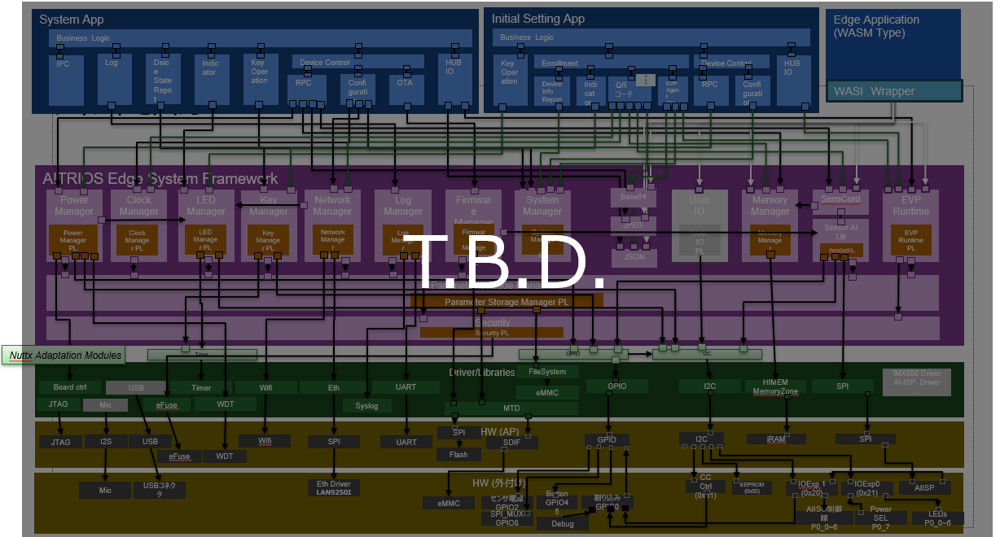
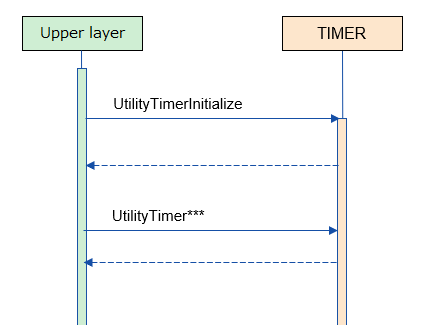
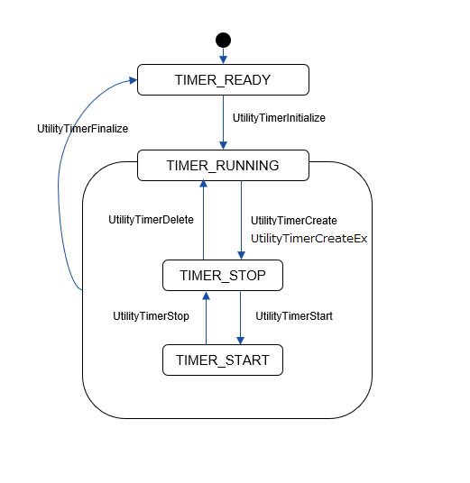
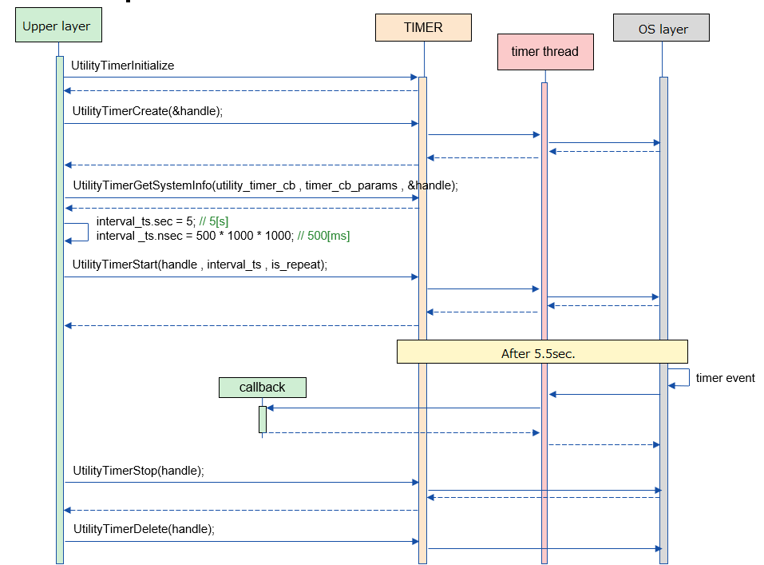

= Timer
:sectnums:
:sectnumlevels: 3
:chapter-label:
:revnumber: 0.0.1
:toc: left
:toc-title: Table of Contents
:toclevels: 3
:lang: en
:xrefstyle: short
:figure-caption: Figure
:table-caption: Table
:section-refsig:
:experimental:

== Purpose and Scope

This document describes the specifications of the Timer provided as a Utility. + 
The purpose of the Timer is to provide timer functionality to upper layers such as ESF and SystemApp.

<<<

== Terminology

[#_words]
.List of Terms
[options="header"]
|===
|Term |Description

|ESF
|Edge System Framework. A set of functions required to run Edge Applications, which correspond to upper layers.
|===

<<<

== Component Description
The Timer layer provides timer functionality to upper layers.

=== Component Overview

Below is a software configuration diagram centered on this block.

.Figure Overview

<<<

=== Detailed Component Description
Examples of Timer usage are shown below. +
Upper layers that use the Timer functionality can use various Timer APIs immediately after the UtilityTimerInitialize sequence is executed. +

[#_sequence_overview]
.Sequence Overview

==== Dependent Blocks
.Dependent Blocks
[width="100%",options="header"]
|===
|Block Name |Usage |Link
|[T.B.D.] +
 OSAL MSG
|Used to convey requests from upper layers to the TimerThread.
|[T.B.D.]
|===

<<<

=== State Transition
The possible states of TIMER are shown in <<#_TableStates>>.

[#_TableStates]
.List of States
[width="100%", cols="20%,80%",options="header"]
|===
|State |Description 

|TIMER_READY
|Initial state.

|TIMER_RUNNING
|Runnable state.

|TIMER_START
|State where the timer is started. +
*This is a sub-state of TIMER_RUNNING, and the state is maintained for each timer.* +

|TIMER_STOP
|State where the timer is stopped. +
*This is a sub-state of TIMER_RUNNING, and the state is maintained for each timer.* +

|===

In Timer, state transitions are performed as shown in <<#_FigureState>>. +
Also, if an error occurs in each API, no state transition will occur. +

[#_FigureState]
.State Transition Diagram

The acceptability of APIs and the destination state for each state are shown in <<#_TableStateTransition>>. +
TIMER_RUNNING has sub-states, which are shown in the second row of the table. +
Sub-states are maintained for each timer, and state management starts with timer creation and ends with timer deletion. +

The state names in the table indicate the destination state after API execution is completed, and indicate that the API can be called. +
× indicates that the API cannot be accepted, and calling the API here will return an error and no state transition will occur. +
- indicates that the state is no longer managed after the state transition. +

[#_TableStateTransition]
.State Transition Table
[width="100%", cols="10%,20%,20%,20%,20%"]
|===
2.3+| 3+|State 
.2+|TIMER_READY
2+|TIMER_RUNNING
|TIMER_START
|TIMER_STOP
.20+|API Name

|``**UtilityTimerInitialize**``
|TIMER_RUNNING +
-
|×
|×

|``**UtilityTimerFinalize**``
|×
|TIMER_READY
|TIMER_READY

|``**UtilityTimerCreate**``
|×
|TIMER_RUNNING +
TIMER_STOP
|TIMER_RUNNING +
TIMER_STOP

|``**UtilityTimerCreateEx**``
|×
|TIMER_RUNNING +
TIMER_STOP
|TIMER_RUNNING +
TIMER_STOP

|``**UtilityTimerStart**``
|×
|×
|TIMER_RUNNING +
TIMER_START

|``**UtilityTimerStop**``
|×
|TIMER_RUNNING +
TIMER_STOP
|×

|``**UtilityTimerDelete**``
|×
|×
|TIMER_RUNNING +
-

|``**UtilityTimerGetSystemInfo**``
|×
|TIMER_RUNNING +
TIMER_START
|TIMER_RUNNING +
TIMER_STOP
|===

<<<

=== List of Component Functions
A list of functions is shown in <<#_TableFunction>>.

[#_TableFunction]
.List of Functions
[width="100%", cols="30%,55%,15%",options="header"]
|===
|Function Name |Overview  |Section Number
|Initialization and Finalization of Timer Functionality
|Performs initialization and finalization of timer functionality.
|<<#_Function1>>

|Timer Creation
|Creates a timer.
|<<#_Function2>>

|Timer Start
|Starts a timer.
|<<#_Function3>>

|Timer Stop
|Stops a timer.
|<<#_Function4>>

|Timer Deletion
|Deletes a timer.
|<<#_Function5>>

|Acquisition of System Information Related to Timer
|Acquires information such as the minimum cycle that can be set for the timer.
|<<#_Function6>>
|===

<<<

=== Description of Component Functions
[#_Function1]
==== Initialization and Finalization of Timer Functionality
Function Overview::
Performs initialization and finalization of timer functionality.
Preconditions::
None
Function Details::
For details, refer to <<#_UtilityTimerInitialize, UtilityTimerInitialize>> and <<#_UtilityTimerFinalize, UtilityTimerFinalize>>.
Detailed Behavior::
For details, refer to <<#_UtilityTimerInitialize, UtilityTimerInitialize>> and <<#_UtilityTimerFinalize, UtilityTimerFinalize>>.
Behavior in Case of Error and Recovery Method::
For details, refer to <<#_UtilityTimerInitialize, UtilityTimerInitialize>> and <<#_UtilityTimerFinalize, UtilityTimerFinalize>>.
Considerations::
None

[#_Function2]
==== Timer Creation
Function Overview::
Creates a timer.
Preconditions::
UtilityTimerInitialize() must have been executed.
Function Details::
For details, refer to <<#_UtilityTimerCreate, UtilityTimerCreate>> and <<#_UtilityTimerCreateEx, UtilityTimerCreateEx>>.
Detailed Behavior::
For details, refer to <<#_UtilityTimerCreate, UtilityTimerCreate>> and <<#_UtilityTimerCreateEx, UtilityTimerCreateEx>>.
Behavior in Case of Error and Recovery Method::
For details, refer to <<#_UtilityTimerCreate, UtilityTimerCreate>> and <<#_UtilityTimerCreateEx, UtilityTimerCreateEx>>.
Considerations::
None

[#_Function3]
==== Timer Start
Function Overview::
Starts a timer.
Preconditions::
UtilityTimerInitialize() must have been executed. +
A timer must have been created by UtilityTimerCreate() or UtilityTimerCreateEx().
Function Details::
For details, refer to <<#_UtilityTimerStart, UtilityTimerStart>>.
Detailed Behavior::
For details, refer to <<#_UtilityTimerStart, UtilityTimerStart>>.
Behavior in Case of Error and Recovery Method::
For details, refer to <<#_UtilityTimerStart, UtilityTimerStart>>.
Considerations::
None

[#_Function4]
==== Timer Stop
Function Overview::
Stops a timer.
Preconditions::
UtilityTimerInitialize() must have been executed. +
A timer must have been created by UtilityTimerCreate() or UtilityTimerCreateEx().
Function Details::
For details, refer to <<#_UtilityTimerStop, UtilityTimerStop>>.
Detailed Behavior::
For details, refer to <<#_UtilityTimerStop, UtilityTimerStop>>.
Behavior in Case of Error and Recovery Method::
For details, refer to <<#_UtilityTimerStop, UtilityTimerStop>>.
Considerations::
None

[#_Function5]
==== Timer Deletion
Function Overview::
Deletes a timer.
Preconditions::
UtilityTimerInitialize() must have been executed. +
A timer must have been created by UtilityTimerCreate() or UtilityTimerCreateEx().
Function Details::
For details, refer to <<#_UtilityTimerDelete, UtilityTimerDelete>>.
Detailed Behavior::
For details, refer to <<#_UtilityTimerDelete, UtilityTimerDelete>>.
Behavior in Case of Error and Recovery Method::
For details, refer to <<#_UtilityTimerDelete, UtilityTimerDelete>>.
Considerations::
None

[#_Function6]
==== Acquisition of System Information Related to Timer
Function Overview::
Acquires information such as the minimum cycle that can be set for the timer.
Preconditions::
UtilityTimerInitialize() must have been executed.
Function Details::
For details, refer to <<#_UtilityTimerGetSystemInfo, UtilityTimerGetSystemInfo>>.
Detailed Behavior::
For details, refer to <<#_UtilityTimerGetSystemInfo, UtilityTimerGetSystemInfo>>.
Behavior in Case of Error and Recovery Method::
For details, refer to <<#_UtilityTimerGetSystemInfo, UtilityTimerGetSystemInfo>>.
Considerations::
None

<<<

=== List of Non-Functional Requirements of the Component

A list of non-functional requirements is shown in <<#_TableNonFunction>>.

[#_TableNonFunction]
.List of Non-Functional Requirements
[width="100%", cols="30%,55%,15%",options="header"]
|===
|Requirement Name |Overview  |Section Number
|Maximum Stack Usage
|Maximum value of stack usage (bytes)
|<<#_CompornentNonFunction, 3.7>>

|Maximum Heap Usage
|Maximum value of heap usage (bytes)
|<<#_CompornentNonFunction, 3.7>>

|Static Data Usage
|Static data usage (bytes)
|<<#_CompornentNonFunction, 3.7>>

|Performance
|Processing time of each API
|<<#_CompornentNonFunction, 3.7>>
|===

[#_CompornentNonFunction]
=== Description of Non-Functional Requirements of the Component

==== Maximum Stack Usage
** 1792 (bytes)

==== Maximum Normal Heap Usage
** 128 (bytes)

==== Maximum Static Heap Usage
** 128 (bytes)

==== Performance
** Less than 1 [ms]

<<<

== API Specification
=== List of Definitions
==== List of Data Types
A list of data types is shown in <<#_TableDataType>>.

[#_TableDataType]
.List of Data Types
[width="100%", cols="30%,55%,15%",options="header"]
|===
|Data Type Name |Overview  |Section Number
|enum UtilityTimerErrCode
|Enumeration type that defines the result of API execution.
|<<#_UtilityTimerErrCode, 4.2.1>>

|enum UtilityTimerRepeatType
|Enumeration type that defines whether the timer is executed repeatedly.
|<<#_UtilityTimerRepeatType, 4.2.2>>

|UtilityTimerHandle
|Pointer to a structure representing the timer handler.
|<<#_UtilityTimerHandle, 4.2.3>>

|UtilityTimerCallback
|Function pointer representing the timer callback.
|<<#_UtilityTimerCallback, 4.2.4>>

|UtilityTimerSystemInfo
|Structure representing system information related to the timer.
|<<#_UtilityTimerSystemInfo, 4.2.5>>

|===

==== List of APIs
A list of APIs is shown in <<#_TablePublicAPI>>.

[#_TablePublicAPI]
.List of Available APIs
[width="100%", cols="10%,60%,20%",options="header"]
|===
|API Name |Overview |Section Number
|UtilityTimerInitialize
|Performs initialization processing related to the timer.
|<<#_UtilityTimerInitialize, 4.3.1>>

|UtilityTimerCreate
|Creates a timer.
|<<#_UtilityTimerCreate, 4.3.2>>

|UtilityTimerCreateEx
|Creates a timer by specifying stack size and thread priority.
|<<#_UtilityTimerCreateEx, 4.3.3>>

|UtilityTimerStart
|Starts the timer.
|<<#_UtilityTimerStart, 4.3.4>>

|UtilityTimerStop
|Stops the timer.
|<<#_UtilityTimerStop, 4.3.5>>

|UtilityTimerDelete
|Deletes the timer.
|<<#_UtilityTimerDelete, 4.3.6>>

|UtilityTimerGetSystemInfo
|Can acquire system information related to the timer.
|<<#_UtilityTimerGetSystemInfo, 4.3.7>>

|UtilityTimerFinalize
|Performs finalization processing related to the timer.
|<<#_UtilityTimerFinalize, 4.3.8>>
|===

<<<

=== Data Type Definitions

[#_UtilityTimerErrCode]
==== UtilityTimerErrCode
Enumeration type that defines the result of TimerAPI execution. +

* *Format*
[source, C]
....
typedef enum {
  kUtilityTimerOk = 0,
  kUtilityTimerErrInvalidStatus,
  kUtilityTimerErrInvalidParams,
  kUtilityTimerErrNotFound,
  kUtilityTimerErrBusy,
  kUtilityTimerErrInternal,
} UtilityTimerErrCode
....

[#_UtilityTimerRepeatType]
==== UtilityTimerRepeatType
Enumeration type that defines whether the timer is executed repeatedly. +

* *Format*
[source, C]
....
typedef enum {
  kUtilityTimerOneShot = 0,
  kUtilityTimerRepeat,
} UtilityTimerRepeatType;
....

[#_UtilityTimerHandle]
==== UtilityTimerHandle
Structure representing the timer handler. +
It is generated by UtilityTimerCreate and used for starting and stopping the timer.
It can be destroyed by UtilityTimerDelete.

* *Format*
[source, C]
....
typedef void* UtilityTimerHandle;
....

[#_UtilityTimerCallback]
==== UtilityTimerCallback
Function pointer representing the timer callback.

* *Format*
[source, C]
....
typedef void (*UtilityTimerCallback)(void *timer_cb_params);
....

* *Description of Arguments* +
**[IN] void *timer_cb_params**:: 
The timer_cb_params specified in UtilityTimerCreate will be set.

<<<

* *Format*
[source, C]
....
typedef struct {
    timespec interval_min_ts; // Minimum value that can be specified for the timer
    timespec interval_max_ts; // Maximum value that can be specified for the timer
} UtilityTimerSystemInfo;
....

* *Values*

.Description of UtilityTimerSystemInfo values
[width="100%", cols="30%,70%",options="header"]
|===
|Member Name  |Description

|timespec interval_min_ts
|Minimum value that can be specified for the timer

|timespec interval_max_ts
|Maximum value that can be specified for the timer
|===

<<<

=== Description of Each API
[#_UtilityTimerInitialize]
==== UtilityTimerInitialize
Performs initialization processing related to the timer.

* *Format* +
[source, C]
....
UtilityTimerErrCode UtilityTimerInitialize()
....

* *Description of Arguments* +
-

* *Return Value* +
One of the UtilityTimerErrCode values will be returned according to the execution result.

* *Description* +
** Be sure to execute this when using timer functions.
*** After executing this API, various timer functions can be used.

[#_UtilityTimerInitialize_desc]
.API Detailed Information
[width="100%", cols="30%,70%",options="header"]
|===
|API Detailed Information  |Description
|API Type
|Synchronous API
|Execution Context
|Operates in the caller's context
|Simultaneous Calls
|Possible
|Calls from Multiple Threads
|Possible
|Calls from Multiple Tasks
|Possible
|Blocking Inside API
|Blocks. +
If UtilityTimerInitialize is being executed in another context, it will wait for completion before executing. +
|===

[#_UtilityTimerInitialize_error]
.Error Information
[options="header"]
|===
|Error Code |Cause |State of OUT Argument |System State After Error |Recovery Method

|kUtilityTimerErrInvalidStatus
|UtilityTimerInitialize has already been executed
|-
|No impact
|Not required

|kUtilityTimerErrInternal
|Some error occurred
|-
|No impact
|Not required

|===

<<<

[#_UtilityTimerCreate]
==== UtilityTimerCreate

* *Function* +
Creates a timer.

* *Format* +
[source, C]
....
UtilityTimerErrCode UtilityTimerCreate(
                        const UtilityTimerCallback utility_timer_cb,
                        void *timer_cb_params,
                        UtilityTimerHandle *utility_timer_handle);
....

* *Description of Arguments* +
**[IN] const UtilityTimerCallback utility_timer_cb**:: 
Callback function. +
Executed when the timer created by UtilityTimerCreate expires.

**[IN] void *timer_cb_params**:: 
Pointer to be set as an argument when executing the callback function. NULL is also acceptable.

**[OUT] UtilityTimerHandle *utility_timer_handle**:: 
Timer handler. +
Specify this when executing UtilityTimerStart/UtilityTimerStop/UtilityTimerDelete.

* *Return Value* +
One of the UtilityTimerErrCode values will be returned according to the execution result.

* *Description* +
** Creates a timer.
** This API can be used after UtilityTimerInitialize has been executed.
** If it fails, the value of handle will remain the same as before this API was executed.
** This API creates a thread inside UtilityTimer.
*** The stack size is 4096, and the thread priority uses CONFIG_UTILITY_TIMER_THREAD_PRIORITY.
** The upper limit of the number of timers follows the maximum number of timers defined by the OS. +
Example: In the case of NuttX, the upper limit is 32.
** If multiple timers share utility_timer_cb, mutual exclusion control must be implemented within that callback function.
** The following APIs can be used with the timer handler obtained by this API.
*** UtilityTimerStart
*** UtilityTimerStop
*** UtilityTimerDelete

WARNING: If many timers are created, the callbacks of timers created later may be delayed by up to about 5ms. (Under investigation)

[#_UtilityTimerCreate_desc]
.API Detailed Information
[width="100%", cols="30%,70%",options="header"]
|===
|API Detailed Information  |Description
|API Type
|Synchronous API
|Execution Context
|Until the timer creation request: operates in the caller's context +
Timer creation: operates in the timer's context
|Simultaneous Calls
|Possible
|Calls from Multiple Threads
|Possible
|Calls from Multiple Tasks
|Possible
|Blocking Inside API
|Blocks. +
If another context is already running UtilityTimer API, it will wait for completion before executing. +
If it overlaps with the execution of the timer callback, it will be blocked and executed after the callback processing is completed.
|===

[#UtilityTimerCreate_error]
.Error Information
[options="header"]
|===
|Error Code |Cause |State of OUT Argument |System State After Error |Recovery Method
|kUtilityTimerErrInvalidStatus
|UtilityTimerInitialize has not been executed
|No change
|No impact
|Not required

|kUtilityTimerErrInvalidParams
|Parameter error
|No change
|No impact
|Not required

|kUtilityTimerErrBusy
|Exceeded the upper limit of timers
|No change
|No impact
|Not required

|kUtilityTimerErrInternal
|Some error occurred
|No change
|No impact
|Not required

|===

<<<

[#_UtilityTimerCreateEx]
==== UtilityTimerCreateEx

* *Function* +
Creates a timer.

* *Format* +
[source, C]
....
UtilityTimerErrCode UtilityTimerCreateEx(const UtilityTimerCallback callback,
                                         void *cb_params,
                                         int priority,
                                         size_t stacksize,
                                         UtilityTimerHandle *timer_handle);
....

* *Description of Arguments* +
**[IN] const UtilityTimerCallback callback**:: 
Callback function. +
Executed when the timer created by UtilityTimerCreateEx expires.

**[IN] void *cb_params**:: 
Pointer to be set as an argument when executing the callback function. NULL is also acceptable.

**[IN] int priority**:: 
Thread priority on the UtilityTimer side that executes the callback function.
Follows the specification of pthread_attr_setschedparam.

**[IN] size_t stacksize**:: 
Stack size of the thread on the UtilityTimer side that executes the callback function.
Follows the specification of pthread_attr_setstacksize.

**[OUT] UtilityTimerHandle *utility_timer_handle**:: 
Timer handler. +
Specify this when executing UtilityTimerStart/UtilityTimerStop/UtilityTimerDelete.

* *Return Value* +
One of the UtilityTimerErrCode values will be returned according to the execution result.

* *Description* +
** Creates a timer.
** This API can be used after UtilityTimerInitialize has been executed.
** If it fails, the value of handle will remain the same as before this API was executed.
** The upper limit of the number of timers follows the maximum number of timers defined by the OS. +
** This API creates a thread inside UtilityTimer.
*** The stack size uses the stacksize argument, and the thread priority uses the priority argument.
Example: In the case of NuttX, the upper limit is 32.
** The following APIs can be used with the timer handler obtained by this API.
*** UtilityTimerStart
*** UtilityTimerStop
*** UtilityTimerDelete

WARNING: If many timers are created, the callbacks of timers created later may be delayed by up to about 5ms. (Under investigation)

[#_UtilityTimerCreateEx_desc]
.API Detailed Information
[width="100%", cols="30%,70%",options="header"]
|===
|API Detailed Information  |Description
|API Type
|Synchronous API
|Execution Context
|Until the timer creation request: operates in the caller's context +
Timer creation: operates in the timer's context
|Simultaneous Calls
|Possible
|Calls from Multiple Threads
|Possible
|Calls from Multiple Tasks
|Possible
|Blocking Inside API
|Blocks. +
If another context is already running UtilityTimer API, it will wait for completion before executing. +
If it overlaps with the execution of the timer callback, it will be blocked and executed after the callback processing is completed.
|===

[#UtilityTimerCreateEx_error]
.Error Information
[options="header"]
|===
|Error Code |Cause |State of OUT Argument |System State After Error |Recovery Method
|kUtilityTimerErrInvalidStatus
|UtilityTimerInitialize has not been executed
|No change
|No impact
|Not required

|kUtilityTimerErrInvalidParams
|Parameter error
|No change
|No impact
|Not required

|kUtilityTimerErrBusy
|Exceeded the upper limit of timers
|No change
|No impact
|Not required

|kUtilityTimerErrInternal
|Some error occurred
|No change
|No impact
|Not required

|===

<<<

[#_UtilityTimerStart]
==== UtilityTimerStart

* *Function* +
Starts the timer.

* *Format* +
[source, C]
....
UtilityTimerErrCode UtilityTimerStart(
                        const UtilityTimerHandle utility_timer_handle,
                        const struct timespec *interval_ts,
                        const UtilityTimerRepeatType utility_timer_repeat_type);
....

* *Description of Arguments* +
**[IN] const UtilityTimerHandle utility_timer_handle**:: 
Timer handler to be started. +
Use the one returned by UtilityTimerCreate.

**[IN] const struct timespec *interval_ts**:: 
** Timer cycle. The timer is started with sec + nsec as the cycle.
*** time.tv_sec ... unit [s]
*** time.tv_nsec ... unit [ns] (nanoseconds)

**[IN] const UtilityTimerRepeatType utility_timer_repeat_type**:: 
Flag indicating whether the timer is executed repeatedly. +  
kUtilityTimerRepeat: Repeated, kUtilityTimerOneShot: Only once

* *Return Value* +
One of the UtilityTimerErrCode values will be returned according to the execution result.

* *Description* +
** Starts the timer.
** This API can be used after UtilityTimerInitialize has been executed.
** If the specified timer is already started, an error will be returned. +
** If the value is outside the minimum/maximum range that can be specified for the timer, an error will be returned. +
The minimum/maximum values can be obtained with UtilityTimerGetSystemInfo.
** The specified cycle will be rounded up to the minimum unit cycle of the timer (= minimum value that can be specified for the timer). +
Example: If the minimum unit cycle is assumed to be 10ns and 15ns is specified, it will be processed as a 20ns timer.
** When utility_timer_repeat_type=kUtilityTimerOneShot, the timer will start and the callback will be executed only once. After the callback is executed, stop the timer with UtilityTimerStop.
** When utility_timer_repeat_type=kUtilityTimerRepeat, the timer will continue to operate and the callback will be executed repeatedly until UtilityTimerStop is called.
** The callback is executed in the thread on the UtilityTimer side.
*** The thread on the timer side is created for each UtilityTimerCreate/UtilityTimerCreateEx.

[#_UtilityTimerStart_desc]
.API Detailed Information
[width="100%", cols="30%,70%",options="header"]
|===
|API Detailed Information  |Description
|API Type
|Synchronous API
|Execution Context
|Until the timer start request: operates in the caller's context +
Timer start and timer callback execution: operates in the timer's context
|Simultaneous Calls
|Possible
|Calls from Multiple Threads
|Possible
|Calls from Multiple Tasks
|Possible
|Blocking Inside API
|Blocks. +
If another context is already running UtilityTimer API, it will wait for completion before executing. +
If it overlaps with the execution of the timer callback, it will be blocked and executed after the callback processing is completed.
|===

[#UtilityTimerStart_error]
.Error Information
[options="header"]
|===
|Error Code |Cause |State of OUT Argument |System State After Error |Recovery Method
|kUtilityTimerErrInvalidStatus
|UtilityTimerInitialize has not been executed +
The timer is already started
|-
|No impact
|Not required

|kUtilityTimerErrInvalidParams
|Parameter error
|-
|No impact
|Not required

|kUtilityTimerErrNotFound
|The specified handler does not exist
|-
|No impact
|Not required

|kUtilityTimerErrInternal
|Some error occurred
|-
|No impact
|Not required

|===

<<<

[#_UtilityTimerStop]
==== UtilityTimerStop
* *Function* +
Stops the timer.

* *Format* +
[source, C]
....
UtilityTimerErrCode UtilityTimerStop(const UtilityTimerHandle utility_timer_handle)
....

* *Description of Arguments* +
**[IN] const UtilityTimerHandle utility_timer_handle**:: 
Timer handler to be stopped. +
Use the one returned by UtilityTimerCreate.

* *Return Value* +
One of the UtilityTimerErrCode values will be returned according to the execution result.

* *Description* +
** Stops the timer started by UtilityTimerStart.
** This API can be used after UtilityTimerInitialize has been executed.
** If the specified timer is already stopped, an error will be returned. +
** If UtilityTimerStop is not executed and UtilityFinalize is executed, the timer will be automatically stopped and deleted internally.

[#_UtilityTimerStop_desc]
.API Detailed Information
[width="100%", cols="30%,70%",options="header"]
|===
|API Detailed Information  |Description
|API Type
|Synchronous API
|Execution Context
|Operates in the caller's context
|Simultaneous Calls
|Possible
|Calls from Multiple Threads
|Possible
|Calls from Multiple Tasks
|Possible
|Blocking Inside API
|Blocks. +
If it overlaps with the execution of the timer callback, it will be blocked and executed after the callback processing is completed.
|===

[#_UtilityTimerStop_error]
.Error Information
[options="header"]
|===
|Error Code |Cause |State of OUT Argument |System State After Error |Recovery Method
|kUtilityTimerErrInvalidStatus
|UtilityTimerInitialize has not been executed +
The timer is already stopped
|-
|No impact
|Not required

|kUtilityTimerErrInvalidParams
|Parameter error
|-
|No impact
|Not required

|kUtilityTimerErrNotFound
|The specified handler does not exist
|-
|No impact
|Not required

|kUtilityTimerErrInternal
|Some error occurred
|-
|No impact
|Not required

|===

<<<

[#_UtilityTimerDelete]
==== UtilityTimerDelete
* *Function* +
Deletes the timer.

* *Format* +
[source, C]
....
UtilityTimerErrCode UtilityTimerDelete(UtilityTimerHandle utility_timer_handle)
....

* *Description of Arguments* +
**[IN] const UtilityTimerHandle utility_timer_handle**:: 
Handler of the timer to be deleted. +
Please use the one returned by UtilityTimerCreate.

* *Return Value* +
One of the UtilityTimerErrCode values will be returned according to the execution result.

* *Description* +
** Deletes the timer created by UtilityTimerCreate.
** This API can be used after UtilityTimerInitialize has been executed.
** If the specified timer is running, an error will be returned. +
*** Please stop the timer first.
** If UtilityTimerFinalize is executed without UtilityTimerDelete, the timer will be automatically deleted internally.
*** Since there is a limit to the number of timers, please delete timers that are no longer needed.

[#_UtilityTimerDelete_desc]
.API Detailed Information
[width="100%", cols="30%,70%",options="header"]
|===
|API Detailed Information  |Description
|API Type
|Synchronous API
|Execution Context
|Operates in the caller's context
|Simultaneous Calls
|Possible
|Calls from Multiple Threads
|Possible
|Calls from Multiple Tasks
|Possible
|Blocking Inside API
|Blocks. +
If the timer of the target handler is in the process of stopping, it will wait for the stop process to complete before executing.
|===

[#_UtilityTimerDelete_error]
.Error Information
[options="header"]
|===
|Error Code |Cause |State of OUT Argument |System State After Error |Recovery Method
|kUtilityTimerErrInvalidStatus
|UtilityTimerInitialize has not been executed +
The timer has not been stopped
|-
|No impact
|Not required

|kUtilityTimerErrInvalidParams
|Parameter error
|-
|No impact
|Not required

|kUtilityTimerErrNotFound
|The specified handler does not exist
|-
|No impact
|Not required

|kUtilityTimerErrInternal
|Some error occurred
|-
|No impact
|Not required

|===

<<<

[#_UtilityTimerGetSystemInfo]
==== UtilityTimerGetSystemInfo
* *Function* +
Can acquire system information related to the timer.

* *Format* +
[source, C]
....
UtilityTimerErrCode UtilityTimerGetSystemInfo(UtilityTimerSystemInfo *utility_timer_sysinfo)
....

* *Description of Arguments* +
**[OUT] struct UtilityTimerSystemInfo *utility_timer_sysinfo**:: 
System information related to the timer.

* *Return Value* +
One of the UtilityTimerErrCode values will be returned according to the execution result.

* *Description* +
** This API can be used after UtilityTimerInitialize has been executed.
** If it fails, the value of utility_timer_sysinfo will remain the same as before this API was executed.

・From "Nuttx Documentation - System Time and Clock", the minimum unit is 100us.
[width="100%", cols="100%",options="header"]
|===
|System Timer
In most implementations, system time is provided by a timer interrupt. That timer interrupt runs at rate determined by
CONFIG_USEC_PER_TICK
(default 10000 microseconds or 100Hz. If
CONFIG_SCHED_TICKLESS
is selected, the default is 100 microseconds).
|===

[#_UtilityTimerGetSystemInfo_desc]
.API Detailed Information
[width="100%", cols="30%,70%",options="header"]
|===
|API Detailed Information  |Description
|API Type
|Synchronous API
|Execution Context
|Operates in the caller's context
|Simultaneous Calls
|Possible
|Calls from Multiple Threads
|Possible
|Calls from Multiple Tasks
|Possible
|Blocking Inside API
|Does not block.
|===

[#_UtilityTimerGetSystemInfo_error]
.Error Information
[options="header"]
|===
|Error Code |Cause |State of OUT Argument |System State After Error |Recovery Method
|kUtilityTimerErrInvalidStatus
|UtilityTimerInitialize has not been executed
|No change
|No impact
|Not required

|kUtilityTimerErrInvalidParams
|Parameter error
|No change
|No impact
|Not required

|===

<<<

[#_UtilityTimerFinalize]
==== UtilityTimerFinalize
[HAL internal API] Performs finalization processing related to the timer.

* *Format* +
[source, C]
....
UtilityTimerErrCode UtilityTimerFinalize(void)
....

* *Description of Arguments* +
-

* *Return Value* +
One of the UtilityTimerErrCode values will be returned according to the execution result.

* *Description* +
** Be sure to execute this when you no longer use the timer function.

[#_UtilityTimerFinalize_desc]
.API Detailed Information
[width="100%", cols="30%,70%",options="header"]
|===
|API Detailed Information  |Description
|API Type
|Synchronous API
|Execution Context
|Operates in the caller's context
|Simultaneous Calls
|Possible
|Calls from Multiple Threads
|Possible
|Calls from Multiple Tasks
|Possible
|Blocking Inside API
|Blocks. +
If UtilityTimer API is already running in another context, it will wait for completion before executing. +
|===

[#_UtilityTimerFinalize_error]
.Error Information
[options="header"]
|===
|Error Code |Cause |State of OUT Argument |System State After Error |Recovery Method

|kUtilityTimerErrInvalidStatus
|UtilityTimerInitialize has never been executed
|-
|No impact
|Not required

|===

<<<

== Example of API Usage

.UtilityTimerStart/Stop (Example)

== Special Notes or Component-Specific Explanations
None

<<<

== List of OSS Used
None

<<<

== References
- Nuttx Documentation - System Time and Clock
  https://nuttx.apache.org/docs/latest/reference/os/time_clock.html#basic-system-timer

<<<

== Revision History
[width="100%", cols="20%,80%",options="header"]
|===
|Version |Changes 
|0.0.1
|Initial version
|0.0.2
|Added UtilityTimerCreateEx
|===
